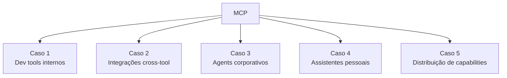

# Casos comuns no mercado

> [!abstract] TL;DR
> Em 2026, [[Dicionário de IA#MCP (Model Context Protocol)|MCP]] virou padrão em **5 categorias** de uso: (1) **dev tools internos** (codebase, internal APIs), (2) **integrações cross-tool** (mesmo server, múltiplos clients), (3) **[[Dicionário de IA#Agent|agents]] corporativos** (workflows internos), (4) **assistentes pessoais** (vault, calendar, email), (5) **distribuição de capabilities** (publicar server público). Esta nota dá exemplos concretos por categoria + boas práticas. Reconhecer o caso certo é metade do trabalho.

> [!question]- Como MCP muda o que o produto pode fazer vs o que o LLM consegue fazer sozinho?
> O LLM sozinho tem conhecimento até o cutoff de treinamento, não acessa sistemas em tempo real, e não pode executar ações com efeitos no mundo. MCP é o que expande esses limites: com os servers certos, o mesmo modelo passa a consultar seu banco de dados ao vivo, criar issues no Jira, enviar mensagens no Slack e ler arquivos do filesystem — tudo em uma conversa. O produto muda de "assistente de texto" para "agente que age nos seus sistemas". Esse é o salto qualitativo: sem MCP, o produto é limitado pela memória do modelo; com MCP, o produto é limitado pela extensão dos servers disponíveis.



## Caso 1 — Dev tools internos

> *"Meu time tem API/codebase complexa. Quero que devs falem com ela em natural language em qualquer client."*

### Setup

- [[Dicionário de IA#MCP server|MCP server]] interno expondo APIs/serviços críticos
- Hospedado internamente (HTTP+SSE em K8s)
- Auth via SSO corporativo (OAuth 2.1)
- Audit log para compliance
- Devs configuram nos seus clients ([[Dicionário de IA#Claude Code|Claude Code]], Cursor)

### Tools típicas

```python
@mcp.tool()
def get_service_status(service_name: str) -> dict:
    """Get current status of internal service."""

@mcp.tool()
def query_user(user_id: str) -> User:
    """Get user info from internal user-service API."""

@mcp.tool()
def deploy_to_staging(service: str, version: str) -> str:
    """Deploy service to staging. REQUIRES human approval."""
```

### Vantagens vs alternativas

| | MCP server interno | API direto |
|---|---|---|
| Cross-client | ✅ Reusa em todos | ❌ Cada IDE/CLI implementa |
| Onboarding | ✅ Plug-and-play | ❌ Manual |
| Auth uniforme | ✅ OAuth central | ⚠️ Fragmentado |
| Audit log | ✅ Centralizado | ⚠️ Por integration |

### Caso real

Empresa de telecom com microservices. MCP server interno expõe top 30 APIs. Devs de 5 times consomem em Claude Code/Cursor sem precisar conhecer endpoints. Onboard de novo dev passou de 2 semanas para 3 dias.

## Caso 2 — Integrações cross-tool

> *"Já uso 5 ferramentas (GitHub, Linear, Slack, etc.). Quero que LLM em qualquer client integre com tudo."*

### Setup

- Instalar Awesome MCP servers correspondentes
- Configurar auth (PATs, API keys via env)
- Cada client (Claude Desktop, Cursor) tem mesmo set de servers

### Stack típica

```json
{
  "mcpServers": {
    "github": { "command": "npx", "args": ["-y", "@modelcontextprotocol/server-github"], "env": {"GITHUB_PERSONAL_ACCESS_TOKEN": "${TOKEN}"} },
    "linear": { "command": "npx", "args": ["-y", "mcp-linear"], "env": {"LINEAR_API_KEY": "${KEY}"} },
    "slack": { "command": "npx", "args": ["-y", "mcp-slack"], "env": {"SLACK_BOT_TOKEN": "${TOKEN}"} },
    "notion": { "command": "npx", "args": ["-y", "mcp-notion"], "env": {"NOTION_API_KEY": "${KEY}"} }
  }
}
```

### Workflow exemplo

```
User: "Crie issue Linear sobre o bug que reportei no PR #123, e me chame no Slack quando review estiver pronto"

LLM:
1. github.get_pr(123) → reads PR
2. linear.create_issue(title=..., description=..., labels=["bug"])
3. slack.set_reminder("@me", "Review #123 ready")
```

3 servers, 1 conversa. Em 2024 isso requeria custom integration.

## Caso 3 — Agents corporativos

> *"Empresa quer agent que executa workflows internos com auditabilidade."*

### Setup

- MCP servers internos com **all destrutivas com human-in-the-loop**
- Slack approval flow integrado
- Compliance log (SOX, GDPR, etc.)
- Permissões fine-grained por user/role

### Tools típicas

```python
@mcp.tool()
async def refund_customer(
    customer_id: str,
    amount: float,
    reason: str
) -> dict:
    """Process refund. ALWAYS requires Manager approval via Slack."""
    if amount > 100:
        approval = await request_slack_approval(
            channel="#refunds-approval",
            payload={"customer_id": customer_id, "amount": amount, "reason": reason}
        )
        if not approval.approved:
            return {"status": "rejected", "by": approval.user}

    return await stripe.refund(customer_id, amount, reason=reason)
```

### Compliance

Cada tool call:
- Logged with user, timestamp, args, result
- Stored em DB imutável (write-once)
- Retenção 7 anos
- Audit dashboards (Grafana)

### Caso real

Empresa SaaS B2B. Agent de customer success automatizou 70% das ações repetitivas (refunds <$100, account upgrades, etc). 30% restantes vão para humano via Slack approval. Tempo médio de resolution caiu 60%.

## Caso 4 — Assistentes pessoais

> *"Quero meu LLM acessando minha vida digital — vault, calendar, email, tasks."*

### Setup pessoal

```json
{
  "mcpServers": {
    "obsidian": { "command": "uvx", "args": ["mcp-obsidian", "/home/user/vault"] },
    "calendar": { "command": "npx", "args": ["-y", "mcp-google-workspace"], "env": {"GOOGLE_OAUTH_TOKEN": "${TOKEN}"} },
    "todoist": { "command": "npx", "args": ["-y", "mcp-todoist"], "env": {"TODOIST_API_TOKEN": "${TOKEN}"} },
    "email": { "command": "npx", "args": ["-y", "mcp-imap"], "env": {"IMAP_PASSWORD": "${PASS}"} }
  }
}
```

### Workflows típicos

- "Resuma minhas reuniões da semana e crie tasks de follow-up no Todoist"
- "Adicione nota ao vault sobre essa conversa"
- "Quem mencionou X em emails dos últimos 30 dias?"

### Caveats

- Privacidade: tudo pessoal exposto ao agent
- Auth tokens devem ter scopes mínimos (read-only quando possível)
- Audit pessoal (você verifica)

### Caso real (este Codex)

[[Memória de Agentes|index]] como MCP server. Claude Code acessa vault, propõe conexões, sugere notas. Skill `/glosa` (este vault) usa MCP fetch para buscar artigos.

## Caso 5 — Distribuição de capabilities (publishing)

> *"Construí algo útil. Quero distribuir como MCP server público."*

### Setup

- Server limpo (sem creds harcoded)
- README claro com setup
- Versionamento semver
- Tests
- Submit para Awesome MCP Servers
- Registro em smithery.ai / mcp.so

### Considerações

- **Auth e security** — você é responsável se server vazar dados de users
- **Manutenção** — issues, PRs, atualizações
- **Versioning discipline** — breaking changes precisam ser major
- **License** — MIT é padrão

### Caso real

Dev solo cria `mcp-spotify` com 5 tools (playback, search, playlist). Awesome MCP Servers, 200 stars em 3 meses, 50K downloads. Vira projeto side-passive.

## Patterns que se repetem

### Pattern 1 — Server core + adapters

```
mcp-jira-core (read-only)         ← oficial, manutenção ativa
  ↑
mcp-jira-write (extends core)     ← user adiciona capabilities
mcp-jira-corporate-auth (extends) ← empresa specific
```

Composição em vez de fork.

### Pattern 2 — Server pipeline

```
LLM → MCP server A → MCP server B → result
```

Server A delega para Server B. Útil quando há orchestração.

### Pattern 3 — Multi-tenant single server

Um server, vários tenants. Auth determina what each tenant vê.

```python
@mcp.tool()
async def query_data(request, query: str):
    tenant = request.user.tenant_id
    return db.query_filtered_by_tenant(tenant, query)
```

## Armadilhas comuns

> [!warning] Expor tools de write sem human-in-the-loop
> Agentes corporativos que executam ações irreversíveis (reembolsos, deleções, deploys) sem um gate de aprovação humana são um risco operacional e de compliance. O caso real de customer success com 70% de automação funciona porque o 30% que vai para humano é exatamente o que deveria ir: ações acima de threshold, casos ambíguos, e qualquer coisa que gere audit trail para regulação. Automatizar sem gate é apostar que o LLM nunca comete erros — e ele comete.

> [!warning] Não distinguir servers internos de externos na estratégia
> Times que adotam MCP sem separar "nossos servers internos com dados confidenciais" de "servers externos do Awesome MCP" criam risco de supply chain confuso. Um dev que instala um server de terceiros no mesmo client que conecta ao server interno com dados de clientes cria um caminho potencial de exfiltração. A estratégia deve ser explícita: servers internos ficam em client corporativo configurado centralmente; servers externos ficam separados, com paths e scopes restritos.

> [!warning] Ignorar o impacto em onboarding depois de adotar MCP
> Um dos benefícios mais subestimados de MCP é o onboarding — o caso de telecom que reduziu onboard de 2 semanas para 3 dias existe porque novos devs chegam com o MCP server interno já configurado e podem conversar com as APIs em linguagem natural. Mas esse benefício só se realiza se o time investiu em boas descriptions de tools e documentação mínima do server. Um MCP server com tools mal descritas prejudica o onboarding tanto quanto não ter o server.

## Quando NÃO usar MCP em produção

❌ **Latência ultra-crítica (<50ms total)** — overhead do protocol ❌ **Aplicação consumer high-volume** — onerosa em escala alta ❌ **Domínio com requisitos específicos não cobertos pela spec** ❌ **Time muito pequeno sem capacity para manter servers**

## Lições aprendidas (2025-2026)

> [!quote] Insights da indústria
>
> **De Anthropic:** *"MCP foi sucesso porque resolve N×M; não tente fazer ele resolver tudo."*
>
> **De adopters enterprise:** *"Audit log é não-negociável. Sem isso, compliance bloqueia adoção."*
>
> **De solo devs:** *"Reusar 5 servers do Awesome economiza meses vs construir tudo."*
>
> **De security teams:** *"MCP server é supply chain. Trate como dependência crítica."*

## Métricas para acompanhar

| Métrica | Por que importa |
|---|---|
| % chamadas com sucesso | Health do server |
| Latência p95 | UX |
| Custo per call | Budget |
| % com human approval | Compliance |
| Audit log completeness | Auditability |

## Como explicar em inglês

MCP use cases in production cluster into five patterns: internal dev tooling (exposing internal APIs as MCP servers so developers can query them in natural language from any client), cross-tool integrations (same server, multiple clients — GitHub + Linear + Slack in one conversation), corporate agents (workflows with human-in-the-loop gates for compliance), personal assistants (vault, calendar, email, tasks accessible from a single agent), and capability distribution (publishing a server publicly so others can reuse it).

The common thread across all five is the N×M reduction: instead of building separate integrations for each client-system pair, teams build one server and connect any client. The case that illustrates the business impact most clearly is the corporate agent scenario — 70% automation of repetitive actions with 30% escalation to humans via Slack approval, dropping average resolution time by 60%. MCP isn't just a developer productivity tool; it's infrastructure for automating workflows at the business level.

**In a technical interview**, you might say:

> "In production, I've seen five recurring MCP patterns: internal API servers for dev tooling, cross-tool workflow integrations, corporate agents with compliance audit trails and human approval gates, personal knowledge management, and server distribution. The business case that resonates most in enterprise is the corporate agent: you get 70% automation of repetitive tasks with a human-in-the-loop gate for the irreversible ones, full audit log for compliance, and you deploy once and all clients benefit. The design principle across all cases is the same — expose the minimum necessary, require human approval for irreversible actions, and log everything."

| PT | EN |
|----|-----|
| Dev tools internos | Internal dev tooling |
| Automação de workflow | Workflow automation |
| Humano no ciclo | Human-in-the-loop |
| Trilha de auditoria | Audit trail |
| Assistente pessoal | Personal assistant |
| Distribuição de capabilities | Capability distribution |
| Aprovação por Slack | Slack approval flow |
| Multitenant | Multi-tenant |
| Servidor especializado | Specialized server |
| Agente corporativo | Corporate agent |

## O que vem a seguir

Os casos de uso mostram o que é possível. A nota final da trilha fecha o ciclo com um roadmap end-to-end para colocar um MCP server em produção: stack recomendada, 4 fases de desenvolvimento (local → quality → auth → deploy), e best practices distiladas de todas as notas anteriores. É o checklist que sintetiza tudo.

- [[10 - Setup completo + best practices]] — roadmap de 4 semanas do zero ao server production-ready

## Veja também

- [[01 - O que é MCP e por que importa]]
- [[04 - MCP servers oficiais e populares]]
- [[06 - MCP remoto — HTTP + SSE para times]]
- [[07 - Segurança em MCP]]
- [[10 - Setup completo + best practices]]

## Referências

- **Anthropic** — [*Introducing the Model Context Protocol*](https://www.anthropic.com/news/model-context-protocol) (2024). Anúncio original do protocolo.
- **Awesome MCP Servers** — [github.com/punkpeye/awesome-mcp-servers](https://github.com/punkpeye/awesome-mcp-servers). Catálogo curado de servers por categoria.
- **Cloudflare** — [*Build and deploy Remote Model Context Protocol (MCP) servers to Cloudflare*](https://blog.cloudflare.com/remote-model-context-protocol-servers-mcp/) (2025). MCP remoto em produção.
