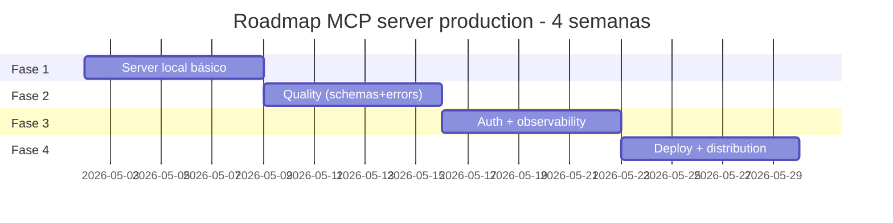

# Setup completo + best practices

> [!abstract] TL;DR
> Esta nota fecha a trilha com checklist end-to-end para construir e operar [[Dicionário de IA#MCP server|MCP servers]] em produção. Stack base: Python [[Dicionário de IA#SDK|SDK]] + Pydantic + FastMCP + uvx para distribuição. Roadmap de 4 fases × ~1 semana cada. Best practices distiladas: tool design rigoroso, schemas tipados, audit log, versioning semver, MCP Inspector na CI. **Investimento total: ~4 semanas para server interno production-ready.**

> [!question]- Qual o erro mais comum ao integrar MCP em produção?
> O erro mais comum é pular a Fase 2 (quality) e ir direto de "funciona no Inspector" para "está em produção". Isso deixa tools com descrições genéricas que o LLM usa incorretamente, schemas primitivos sem validação que aceitam inputs inválidos, e erros que não dão feedback útil ao modelo para auto-correção. O resultado é uma experiência de produção onde "funciona às vezes" — o agente chama a tool errada, passa argumentos malformados, e falha silenciosamente. A semana de qualidade não é opcional; ela é o que separa um server que funciona de um server que é confiável.

Todo mundo que constrói um MCP server passa pela mesma tentação: o Inspector mostra a tool funcionando, o time comemora, e o próximo passo "óbvio" é apontar o client de produção pra esse mesmo server ainda sem schema tipado, sem audit log, sem versionamento. É o salto de "funciona no Inspector" para "está em produção para o time" — e é exatamente esse salto que separa um protótipo de fim de semana de um server do qual colegas dependem todo dia. O checklist abaixo é o mapa desse caminho: quatro fases, cada uma com um gate de qualidade que a fase seguinte pressupõe como já resolvido.

## Stack recomendada (2026)

```
┌────────────────────────────────────────────────────────┐
│  Linguagem:       Python 3.11+ (TypeScript alternativa)│
│  SDK:             mcp (FastMCP)                        │
│  Validação:       Pydantic v2                          │
│  Transport:       stdio (local) ou HTTP+SSE (team)     │
│  Hosting (HTTP):  Cloudflare Workers, Fly.io, K8s      │
│  Auth (HTTP):     OAuth 2.1 ou Bearer tokens           │
│  Distribution:    uvx (Python) ou npx (TS)             │
│  Inspector:       MCP Inspector (local + CI)           │
│  Logging:         JSON logs → Loki/CloudWatch         │
│  Monitoring:      Langfuse ou OpenTelemetry           │
└────────────────────────────────────────────────────────┘
```

## Roadmap de 4 fases



## Fase 1 — Server local (semana 1)

**Objetivo:** server stdio funcionando.

### Checklist

- [ ] `pip install mcp` ou `uv add mcp`
- [ ] Estrutura de projeto:

```
my-mcp-server/
├── pyproject.toml
├── README.md
├── src/
│   └── my_server/
│       ├── __init__.py
│       ├── server.py       # FastMCP setup
│       ├── tools.py        # @mcp.tool() definitions
│       ├── resources.py    # @mcp.resource() definitions
│       └── prompts.py      # @mcp.prompt() definitions
└── tests/
    └── test_tools.py
```

- [ ] FastMCP("my-server") com 1 tool funcionando
- [ ] Test via MCP Inspector: `npx @modelcontextprotocol/inspector python -m my_server`
- [ ] Plugar em Claude Desktop/Cursor para teste real
- [ ] Configurar logging básico

### Exemplo mínimo

```python
# src/my_server/server.py
from mcp.server.fastmcp import FastMCP
from .tools import register_tools

mcp = FastMCP("my-server", version="0.1.0")
register_tools(mcp)

def main():
    mcp.run()

if __name__ == "__main__":
    main()
```

```python
# src/my_server/tools.py
def register_tools(mcp):
    @mcp.tool()
    def hello(name: str) -> str:
        """Greet a person by name."""
        return f"Hello, {name}!"
```

## Fase 2 — Quality (semana 2)

**Objetivo:** tools robustos com schemas e error handling.

### Checklist

- [ ] Tools com Pydantic models (não primitives)
- [ ] Cada tool com docstring clara: o quê, quando, retorna o quê, quando NÃO usar
- [ ] Erros informativos (raise ValueError com mensagem útil)
- [ ] Output compacto (truncate, paginate)
- [ ] Idempotência onde possível
- [ ] Resources com URI scheme claro
- [ ] Prompts úteis (templates)
- [ ] Tests unitários para cada tool
- [ ] Validação manual via Inspector

### Exemplo de tool quality

```python
from pydantic import BaseModel, Field, validator
from typing import Literal

class SearchParams(BaseModel):
    query: str = Field(..., min_length=1, max_length=500, description="Search query in natural language")
    limit: int = Field(default=10, ge=1, le=100, description="Max results (1-100)")
    type: Literal["docs", "code", "all"] = Field(default="all")

class SearchResult(BaseModel):
    id: str
    title: str
    snippet: str = Field(..., max_length=200)
    url: str

@mcp.tool()
def search(params: SearchParams) -> list[SearchResult]:
    """
    Search internal knowledge base.

    Use when user asks 'how to', 'what is', 'where can I find'.
    Returns top results with title, snippet, and URL.

    Do NOT use for searching code (use search_code instead).
    """
    if not params.query.strip():
        raise ValueError("query cannot be empty or whitespace")

    raw = backend.search(params.query, params.limit, params.type)
    return [SearchResult(**r) for r in raw]
```

## Fase 3 — Auth + observability (semana 3)

**Objetivo:** server pronto para multi-user.

### Checklist (HTTP+SSE deploy)

- [ ] Migrar para HTTP+SSE transport
- [ ] Bearer token auth (mínimo) ou OAuth 2.1
- [ ] Per-user scoping em tools (request.user)
- [ ] Audit log estruturado (JSON):

```python
log_entry = {
    "timestamp": iso_now(),
    "user_id": request.user.id,
    "tool": "search",
    "args": sanitize(params.dict()),  # remove PII
    "duration_ms": elapsed,
    "success": True,
    "result_size": len(result)
}
logger.info(json.dumps(log_entry))
```

- [ ] Rate limiting (slowapi ou custom)
- [ ] Health check endpoint
- [ ] Métricas exportadas (Prometheus, Datadog)
- [ ] [[Dicionário de IA#tracing|Tracing]] (OpenTelemetry)

### Pattern de tool com auth

```python
@mcp.tool()
async def get_my_data(request) -> dict:
    """Get data for the authenticated user."""
    user_id = request.user.id  # extracted by middleware
    return db.query("SELECT * FROM data WHERE user_id = ?", user_id)
```

## Fase 4 — Deploy + distribution (semana 4)

**Objetivo:** server rodando 24/7 em produção.

### Checklist

- [ ] Dockerfile minimal
- [ ] CI/CD pipeline (GitHub Actions, etc.)
- [ ] Deploy: K8s, Fly.io, Cloudflare Workers, ou managed
- [ ] TLS (HTTPS) obrigatório
- [ ] Backup de state (se houver)
- [ ] Monitoring + alertas (Sentry, PagerDuty)
- [ ] Documentação operacional (runbook)
- [ ] Versioning semver começando em 1.0.0
- [ ] CHANGELOG.md
- [ ] Release process documentado

### Para servers públicos (extra)

- [ ] README com setup copy-paste
- [ ] Examples folder
- [ ] License (MIT recomendado)
- [ ] Submit ao Awesome MCP Servers
- [ ] Registro em smithery.ai / mcp.so
- [ ] Discord/issues para suporte
- [ ] Versioning rigoroso (breaking = major)

## Best practices distiladas

### Tool design

> [!tip] Os 7 princípios (resumo)
> 1. Nome claro e específico (`search_docs`, não `search`)
> 2. Descrição como docstring (o que, quando, retorna, quando NÃO)
> 3. Inputs tipados com Pydantic
> 4. Outputs compactos e estruturados
> 5. Erros informativos com sugestão
> 6. Sem sobreposição com outras tools
> 7. Idempotência quando possível

Ver [[Anatomia de Agents|03 - Tool design — princípios e categorias]].

### Schemas

```python
# ❌ Ruim
@mcp.tool()
def query(q: str) -> dict:
    """Query."""
    return db.execute(q)

# ✅ Bom
class QueryParams(BaseModel):
    sql: str = Field(..., description="Read-only SQL (SELECT)")
    limit: int = Field(default=100, ge=1, le=1000)

@mcp.tool()
def query_database(params: QueryParams) -> dict:
    """
    Run read-only SQL query against production DB.

    Use for ad-hoc analysis. Returns up to 1000 rows.
    """
    if not params.sql.strip().upper().startswith("SELECT"):
        raise ValueError("Only SELECT queries allowed")
    return db.execute(params.sql, limit=params.limit)
```

### Versioning

```
1.0.0 — initial release
1.1.0 — add new tool (backward compatible)
1.1.1 — bug fix
2.0.0 — breaking: rename tool
```

CHANGELOG documenta migrations.

### Testing

```python
# tests/test_tools.py
import pytest
from my_server.tools import search

def test_search_basic():
    result = search(SearchParams(query="test"))
    assert len(result) > 0
    assert all(r.url for r in result)

def test_search_empty_query():
    with pytest.raises(ValueError, match="cannot be empty"):
        search(SearchParams(query=""))

def test_search_limit():
    result = search(SearchParams(query="test", limit=5))
    assert len(result) <= 5
```

### Logging

```python
import logging
import json

logger = logging.getLogger("mcp-server")

class JSONFormatter(logging.Formatter):
    def format(self, record):
        log_obj = {
            "ts": self.formatTime(record),
            "level": record.levelname,
            "msg": record.getMessage(),
            "module": record.module
        }
        if hasattr(record, "tool_call"):
            log_obj.update(record.tool_call)
        return json.dumps(log_obj)
```

Logs estruturados → ship to Loki/CloudWatch para analysis.

## Armadilhas comuns

> [!warning] Pular a validação no MCP Inspector antes do deploy
> O Inspector é a única forma de ver o que o server está expondo antes que o LLM o consuma. Sem ele, você descobre bugs de schema e descrições problemáticas no momento em que o agent chama a tool errada em produção — com usuário esperando. A heurística é simples: toda tool nova, toda mudança de schema, e todo release candidate passa pelo Inspector antes de subir. É 5 minutos de verificação que previnem horas de debugging.

> [!warning] Não incluir o MCP Inspector na pipeline de CI
> Se o Inspector só roda localmente na máquina do dev, ele cai no esquecimento quando há pressão de prazo. Integrar o Inspector na CI garante que toda mudança de interface do server seja validada automaticamente — schema inválido, tool sem descrição, resource com URI mal formado falham o build antes de chegar em produção. O comando é simples: `npx @modelcontextprotocol/inspector --ci python -m my_server`.

> [!warning] Versionar como 0.x indefinidamente
> Servers internos que ficam em `0.x` por meses são um sinal de que não há disciplina de breaking changes. Quando alguém muda uma tool signature sem bumpar a versão, todos os clients que dependem do contrato anterior quebram silenciosamente. Comece em `1.0.0` quando o server estiver estável o suficiente para outros dependerem, siga semver estritamente (breaking = major), e mantenha um CHANGELOG.md que documente migrations. Versioning não é burocracia — é comunicação com quem usa o server.

## Anti-patterns (evite!)

- **`-y` install sem audit** — supply chain risk
- **Tools sem schema** — agent passa args errados
- **Output cru** (HTML, JSON gigante) — context rot
- **Server gigante** (50+ tools) — divida em servers especializados
- **Sem audit log** — debugging impossível, compliance impossível
- **Without MCP Inspector na CI** — bugs descobertos só em prod
- **Hardcoded credentials** — env vars sempre
- **Sem rate limiting** (HTTP) — abuse mata budget

## Métricas-alvo

| Métrica | Alvo |
|---|---|
| **Tools por server** | 5-15 |
| **Tokens em descrição de tool** | 50-300 |
| **Tokens em output médio** | <2K |
| **Latência [[Dicionário de IA#tool call\|tool call]] (stdio)** | <100ms |
| **Latência tool call (HTTP)** | <500ms |
| **Uptime (HTTP server)** | >99.9% |
| **Audit log coverage** | 100% |
| **% requests com valid schema** | 100% (validação rigorosa) |

## Quando expandir

| Sinal | Próximo passo |
|---|---|
| Server tem 30+ tools | Quebra em servers especializados |
| Múltiplos times consumindo | Migra para HTTP+SSE com auth |
| Compliance entra em jogo | Audit log persistente + retenção |
| Custo cresce | Rate limiting + caching de outputs |
| Feedback de users | Versioning rigoroso + CHANGELOG |

## Como explicar em inglês

A production-ready MCP server is the output of four sequential phases, each with a clear acceptance criterion. Phase 1 gets stdio working with MCP Inspector validation. Phase 2 adds Pydantic schemas, informative errors, compact outputs, and unit tests. Phase 3 migrates to HTTP+SSE with auth, rate limiting, structured audit logging, and observability. Phase 4 deploys with Dockerfile, CI/CD, TLS, monitoring, and semver releases. Each phase builds trust in the server: Phase 1 proves it works, Phase 2 proves it's robust, Phase 3 proves it's safe for multiple users, Phase 4 proves it's operable at scale.

The best practices that matter most distill to: typed schemas so the LLM always passes valid arguments, informative errors so the model can self-correct, compact outputs to avoid context rot, audit logging at 100% coverage, and MCP Inspector in the CI pipeline so regressions are caught before deployment. These aren't preferences — they're the difference between a server that works in a demo and one that your team depends on daily.

**In a technical interview**, you might say:

> "I think about MCP server development in four phases. Phase 1 is 'does it work' — stdio, FastMCP, Inspector validation. Phase 2 is 'is it robust' — Pydantic schemas, informative errors, output pagination, unit tests. Phase 3 is 'is it safe for a team' — HTTP+SSE, auth, rate limiting, structured audit logs. Phase 4 is 'can it be operated' — Dockerfile, CI/CD, monitoring, semver. Each phase has a clear gate. Most people skip to Phase 4 and wonder why the server is unreliable. The quality work in Phase 2 is what makes everything else work."

| PT | EN |
|----|-----|
| Roadmap de implantação | Deployment roadmap |
| Validação de esquema | Schema validation |
| Tratamento de erros | Error handling |
| Paginação de resultados | Output pagination |
| Log estruturado | Structured logging |
| Pipeline de CI/CD | CI/CD pipeline |
| Imagem Docker | Docker image |
| Checklist de release | Release checklist |
| Idempotência | Idempotency |
| Retrocompatibilidade | Backward compatibility |

## Veja também

- [[01 - O que é MCP e por que importa]]
- [[02 - Os três primitivos — Tools, Resources, Prompts]]
- [[05 - Construindo um MCP server local]]
- [[06 - MCP remoto — HTTP + SSE para times]]
- [[07 - Segurança em MCP]]
- [[Anatomia de Agents|03 - Tool design — princípios e categorias]]

## Referências

- **MCP Spec** — [modelcontextprotocol.io/specification](https://modelcontextprotocol.io/specification)
- **Python SDK** — [github.com/modelcontextprotocol/python-sdk](https://github.com/modelcontextprotocol/python-sdk)
- **Anúncio oficial da Anthropic** — [anthropic.com/news/model-context-protocol](https://www.anthropic.com/news/model-context-protocol)
- **MCP Inspector** — [github.com/modelcontextprotocol/inspector](https://github.com/modelcontextprotocol/inspector)
- **Awesome MCP Servers** — examples canônicos

## O que vem a seguir

Esta nota fecha o galho MCP: você tem o roadmap de 4 fases, os checklists de qualidade e os anti-patterns pra não repetir os erros mais comuns. Mas um MCP server não vive sozinho — ele é consumido por um agente, e esse agente tem as mesmas preocupações de design e custo que apareceram aqui em outra escala. Duas direções naturais a partir daqui:

- **[[Agentes de Codificação]]** — o MCP server que você acabou de projetar normalmente vira uma tool a mais na caixa de ferramentas de um agente de codificação (Claude Code, Cursor). Entender como esses agentes decidem quando chamar uma tool — e onde eles ainda erram — fecha o loop entre "server bem desenhado" e "agente que usa esse server bem".
- **[[Economia de Tokens]]** — cada tool call do seu MCP server consome tokens de contexto do agente que o chama: a descrição da tool, o schema, o output. As mesmas métricas-alvo desta nota (tokens em descrição, tokens em output médio) são, na prática, decisões de economia de tokens — vale a pena entender o orçamento do outro lado da chamada.
