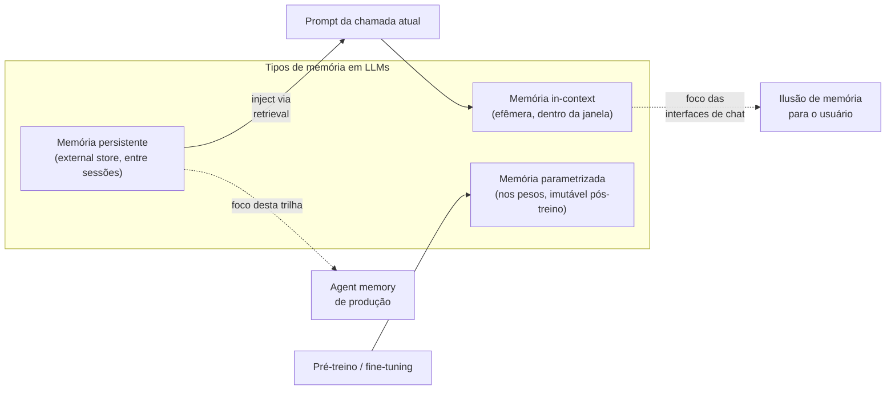
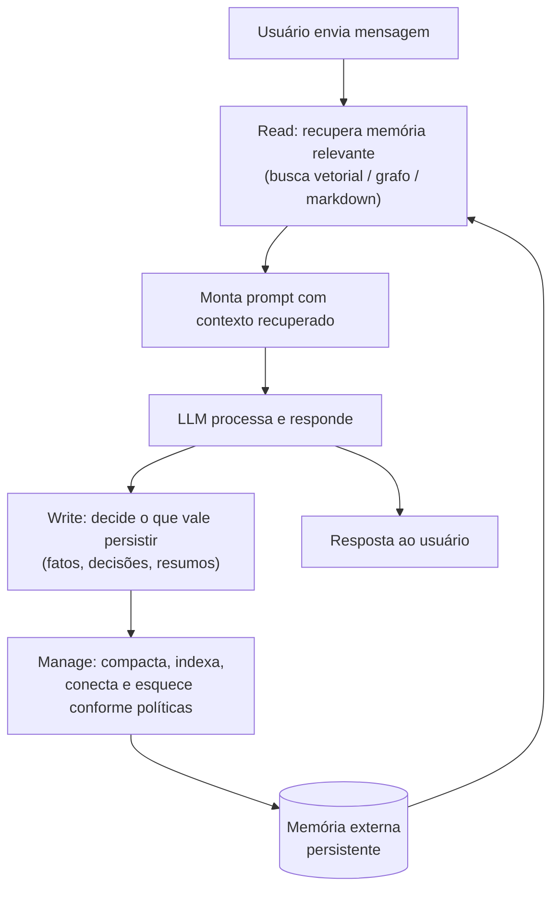
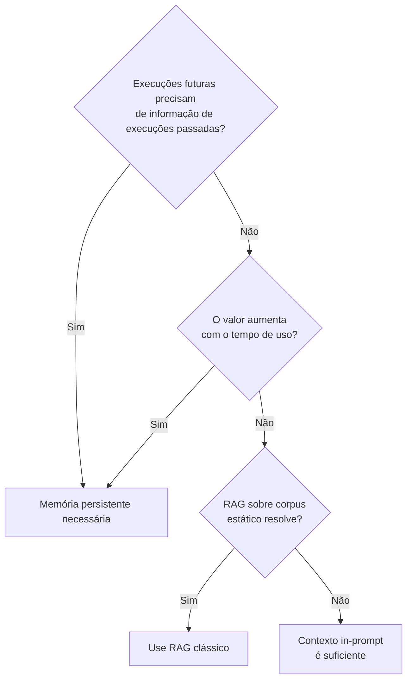

# O que é memória em IA

> [!abstract] TL;DR
> Todo LLM nasce amnésico: cada chamada de API começa do zero, sem qualquer lembrança do que aconteceu na sessão anterior — nem mesmo da mensagem que você mandou há dois minutos, se ela não estiver de novo no prompt. Memória persistente é a engenharia que resolve isso por fora do modelo: um substrato externo (markdown, banco vetorial, grafo de conhecimento) onde o agente guarda o que importa e de onde recupera o que for relevante antes de cada resposta. O mecanismo universal por trás disso é o loop write-manage-read — escrever o que vale persistir, gerenciar (compactar, indexar, esquecer) pra não virar lixo informacional, e ler de volta só o que é relevante pro turno atual — formalizado em surveys acadêmicos e já rodando em frameworks de produção em 2026.

> [!question]- Dúvidas e lacunas desta nota
> - Dúvida gerada pelo conteúdo: qual é o custo real, em latência e em tokens, de executar o loop write-manage-read a cada turno de conversação — e como frameworks de produção amortizam esse custo sem sacrificar a qualidade da memória?
> - Lacuna potencial: a nota descreve o loop write-manage-read de forma abstrata mas não dá um exemplo concreto end-to-end de uma interação real — entrada do usuário, decisão do agente de o que escrever, como gerenciar e o que injetar no próximo prompt.

## O que é

Quando alguém em 2026 diz que um agente "tem memória", o termo carrega ambiguidade. Há pelo menos três coisas distintas chamadas de memória no contexto de [[Dicionário de IA#LLM (Large Language Model)|LLMs]], e confundi-las é a fonte mais comum de erro arquitetural na hora de desenhar um sistema. Distinguir os três tipos é o primeiro passo para entender qualquer discussão técnica do campo.

1. **Memória in-context.** É o conteúdo do prompt da chamada atual: system message, mensagens anteriores da conversa em curso, documentos colados, resultados de tools. Vive dentro da [[Dicionário de IA#Context window|janela de contexto]] e é totalmente efêmera — termina no instante em que a chamada termina. Quando você pergunta "lembra do que falamos ontem?" e o ChatGPT parece lembrar, é porque a interface injetou o histórico no prompt. O modelo em si não lembra de nada; ele apenas lê o que recebe.

2. **Memória persistente.** Informação preservada entre chamadas e sessões em um substrato externo ao modelo: arquivos markdown, [[Dicionário de IA#vector database|banco vetorial]], grafo de conhecimento, banco relacional, log estruturado. O agente lê e escreve nesse substrato via tools ou via injeção de trechos no prompt. É **este** o foco da trilha "Memória de Agentes". Quando este vault fala em "memória de agentes", "agent memory" ou "agentic memory", está sempre falando deste tipo.

3. **Memória parametrizada.** Informação "absorvida" pelos pesos do modelo durante pré-treino ou fine-tuning. É o que faz o LLM "saber" que Paris é capital da França sem que ninguém precise contar. Praticamente imutável após o treino — atualizar exige novo treino, com custo proibitivo na prática. Não é o que esta trilha discute, mas vale ter o nome para não confundir com os outros dois.

A trilha inteira gira em torno do tipo (2). Qualquer técnica, framework ou arquitetura discutida nas próximas notas é, no fundo, uma forma diferente de organizar memória persistente em volta de um LLM que, sozinho, não lembra de nada.

> [!info] Terminologia no vault
> Neste vault, "memória de agentes", "agent memory" e "agentic memory" são sinônimos e referem-se sempre ao tipo (2) — memória persistente. Quando uma nota discutir memória in-context ou memória parametrizada, dirá explicitamente. Na ausência de qualificação, assume-se memória persistente externa.

## Por que importa

> [!note] Intuição para levar adiante
> Pense num LLM como um especialista com amnésia total — todo brilhante, mas esquece tudo assim que você sai da sala. Memória de agentes é o sistema de anotações que você deixa na mesa antes de sair, para que ele leia quando você voltar. O especialista não mudou; o que mudou é o contexto que você preparou para ele.

Sem memória persistente, agents são amnésicos. Cada sessão recomeça do zero: repetem perguntas que já foram respondidas, não acumulam contexto sobre quem é o usuário, não evoluem com o uso, não percebem que o projeto de hoje é continuação direta da conversa de ontem. Para um chat eventual de tirar dúvida pontual isso é aceitável — para qualquer sistema que pretende ser **parceiro contínuo** de trabalho, é fatal.

Em 2026, agentes memoriosos viraram precondição para classes inteiras de casos de uso que antes ficavam no protótipo: assistentes pessoais que aprendem hábitos, automação de longa duração que mantém estado entre disparos, sistemas de pesquisa que compõem conhecimento ao longo de meses, agents de coding que internalizam convenções de um codebase. Toda a discussão sobre "agentes autônomos" pressupõe, mesmo quando não diz com todas as letras, alguma forma de memória persistente.

O campo amadureceu rápido. Em 2026 já existem surveys acadêmicos consolidando vocabulário e taxonomias — o de Pengfei Du, "Memory for Autonomous LLM Agents: Mechanisms, Evaluation, and Emerging Frontiers", é uma referência central. O ICLR 2026 hospedou o workshop "MemAgents", dedicado especificamente ao tema. E há múltiplos frameworks de produção em circulação — cada um detalhado em outras notas desta trilha — disputando como exatamente fazer memória persistente funcionar.

Para tornar mais concreto: imagine um assistente de coding que, depois de uma semana de trabalho num projeto, ainda não sabe o nome das suas variáveis de ambiente, repete as mesmas perguntas sobre a arquitetura, e ignora que você já decidiu não usar Redux. Isso é o que falta de memória persistente gera — não um bug técnico, mas um parceiro que não aprende, que não acumula e que desperdiça o tempo de quem trabalha com ele. Memória de agentes é o que separa um chatbot de uma ferramenta que evolui com o uso.

### Linha do tempo do campo

O problema de memória em agentes tem raízes em IA simbólica das décadas de 1980-1990 (sistemas especialistas tinham "working memory" explícita e bases de conhecimento separadas), mas a versão moderna — com LLMs no centro — emergiu a partir de 2022:

| Ano | Marco |
|-----|-------|
| 2022 | ChatGPT populariza a ilusão de memória via histórico injetado no prompt; usuários começam a questionar por que o modelo "esquece" |
| 2023 | Park et al. (Stanford) publica "Generative Agents" com o memory stream; MemGPT propõe paginação de memória análoga a SO |
| 2024 | OpenAI lança ChatGPT Memory em versão geral; Letta (ex-MemGPT) vira framework open-source; Mem0 entra em produção como biblioteca |
| 2025 | Múltiplos benchmarks multi-sessão emergem para avaliar retenção de memória; debate sobre governança e privacidade de memória cresce |
| 2026 | ICLR 2026 hospeda workshop "MemAgents"; survey de Du consolida taxonomia e métricas; frameworks de produção amadurecem com APIs estáveis |

A trajetória mostra que memória de agentes passou de curiosidade acadêmica a precondição de produto em menos de quatro anos — velocidade que reflete tanto a maturação dos LLMs quanto a demanda de mercado por agentes que realmente aprendem com o uso.

### O campo ainda está aberto

Apesar do progresso, há questões em aberto que ainda não têm resposta consolidada em 2026:

- **Avaliação**: como medir se um sistema de memória está "funcionando bem"? Benchmarks multi-sessão existem mas são poucos e específicos. Métricas de qualidade de memória (precisão de recall, taxa de hallucination de memória, drift de persona) não estão padronizadas.
- **Escalonamento**: a maioria dos sistemas de memória de produção foi testada com um usuário ou com milhares de sessões. Como se comporta com milhões de usuários e bilhões de entradas de memória? As respostas existem para bancos vetoriais e grafos, mas o layer de manage (compactação, forget) não foi testado em escala.
- **Composição**: quando você tem múltiplos agentes no mesmo sistema (multi-agent), a memória é compartilhada? Cada agente tem a sua? Como um agente herda memória de outro? O campo não tem padrões estabelecidos ainda.
- **Trust e verificação**: como saber se a memória armazenada é correta? Em sistemas onde o LLM escreve a própria memória, erros de hallucination se perpetuam. Mecanismos de verificação, revisão e correc ção de memória são área de pesquisa ativa.

Essas questões abertas indicam que a trilha "Memória de Agentes" não é um campo com respostas fixas — é um campo em movimento ativo, onde as melhores práticas de 2024 já foram superadas em 2026, e onde novas soluções continuam emergindo.

## Como funciona

A ideia central é simples e merece ser repetida porque costuma demorar para "cair a ficha": **o LLM não tem memória nativa**. Tudo que parece memória é truque de engenharia construído em volta do modelo, externo a ele. O modelo continua sendo uma função pura — entra prompt, sai resposta, sem estado entre chamadas. A memória vive fora.

A arquitetura genérica que aparece em praticamente todos os sistemas modernos pode ser resumida num loop write-manage-read, formalização proposta no survey de 2026 de Du:

- **Write.** O agente decide o que vale guardar de cada interação: fatos sobre o usuário, decisões tomadas, resumos de longas conversas, observações sobre o ambiente.
- **Manage.** Memória que só cresce vira lixo. O sistema precisa compactar (resumir entradas redundantes), indexar (criar [[Dicionário de IA#embedding|embeddings]], links, tags), conectar (cruzar referências entre entradas) e esquecer (descartar o que envelheceu mal). Esta é a etapa que mais separa um sistema profissional de um log bruto.
- **Read.** Quando uma nova interação começa, o agente recupera o que é relevante — por busca vetorial, por wikilinks, por consulta a grafo, por leitura direta de markdown — e injeta no prompt da próxima chamada.

O substrato em que essa memória externa vive é um eixo de decisão importante: pode ser markdown plano, banco vetorial, grafo de conhecimento, ou combinações híbridas — cada escolha com tradeoffs próprios, explorados em [[08 - Arquitetura de um sistema de memória]] e em [[09 - Panorama de implementações (abril 2026)|09 - Panorama de implementações]].

Vale registrar uma referência foundational: em 2023, Park e colegas (Stanford) introduziram em "Generative Agents" o conceito de **memory stream** — um log apendado de observações com pontuação de relevância, recência e importância para recuperação. Foi um dos primeiros desenhos completos do loop write-manage-read aplicado a agentes. O paper é detalhado em [[18 - Generative Agents (Park, Stanford 2023)]] e fica como pré-leitura recomendada para quem quiser entender a genealogia técnica do campo.

Para visualizar o fluxo de decisão de write de forma ainda mais concreta: imagine que o usuário diz "decidi usar PostgreSQL em vez de MongoDB para o projeto X". Um agente com memória bem projetada vai (1) identificar essa afirmação como fato relevante sobre o projeto, (2) escrever uma entrada no substrato de memória do tipo `projeto-X: banco de dados = PostgreSQL (decisão de <data>)`, (3) no próximo turno, recuperar essa entrada quando o assunto "projeto X" ou "banco de dados" emergir, e (4) injetar no prompt para que o LLM nunca sugira MongoDB novamente. Sem memória, a decisão se perde assim que a janela de contexto é encerrada.

### Detalhando cada fase

**Write** não é simplesmente "salvar tudo". Um sistema eficiente precisa de um filtro: o que **desta** interação merece persistência? Heurísticas comuns incluem: decisões explícitas do usuário ("vou usar X"), preferências declaradas ("prefiro Y"), fatos sobre o projeto ("esse sistema usa Java 21"), e conclusões alcançadas ("bug era no handler de timezone"). O que não merece: perguntas retóricas, pensamento em voz alta, conteúdo que já existe no substrato em forma equivalente.

**Manage** é a fase mais difícil e mais negligenciada. Compactação envolve detectar entradas redundantes e substituí-las por um sumário — por exemplo, cinco entradas sobre "o usuário gosta de código limpo" viram uma. Indexação envolve criar embeddings ou tags para recuperação eficiente. Esquecimento envolve política explícita: entradas com baixo score de relevância+recência+importância saem do substrato principal (podem ir para arquivo ou serem deletadas). Sem manage, o substrato cresce sem freio e a qualidade de recuperação deteriora.

**Read** não é simplesmente "buscar por similaridade". Sistemas sofisticados combinam múltiplos sinais: similaridade semântica via embeddings, recência (entradas recentes têm peso maior), importância (entradas marcadas como críticas têm prioridade), e grafo de links (entradas conectadas a entidades mencionadas no prompt atual). A saída do read é um conjunto de entradas que cabem num orçamento de tokens definido pelo sistema — nunca todas as entradas, mas as mais relevantes dentro do espaço disponível.

## Quando usar / quando não usar

**Quando faz sentido:**

- Tarefas que **atravessam sessões** — assistente que se lembra hoje do que ficou combinado ontem.
- **Contexto compartilhado** entre usuários ou entre execuções que precisa persistir além da chamada atual.
- Agents que **aprendem com uso** — skills emergentes, preferências do usuário, idiossincrasias de um projeto.
- Domínios com **conhecimento que evolui** — projeto longo, relacionamento profissional contínuo, pesquisa de um tema por meses.
- Composição de conhecimento ao longo do tempo — quando o valor está em **acumular e cruzar**, não em consultar uma fonte única.
- **Personalização a longo prazo** — usuário que quer que o agente aprenda seu estilo de escrita, suas preferências de formato, suas convenções de nomenclatura. Sem memória, você repete o onboarding a cada sessão.

**Quando NÃO faz sentido:**

- **Tasks one-shot.** Se cada execução é independente, não há acumulação que justifique a infraestrutura.
- **Dados sensíveis sem proteção adequada.** Memória persistente é, por definição, dado pessoal armazenado — vira responsabilidade LGPD/GDPR. Sem governance clara, é risco maior que valor.
- Quando **[[Dicionário de IA#RAG (Retrieval-Augmented Generation)|RAG]] sobre docs fixos resolve.** Se o conhecimento já está num corpus estável e o problema é só "achar o trecho certo", retrieval clássico basta. A distinção é central e está detalhada em [[04 - RAG vs memória de longo prazo]].
- Quando o **custo de manutenção excede o valor.** Memória profissional exige lint, governance, observabilidade, esquecimento deliberado. Sem orçamento para isso, a memória apodrece e contamina respostas futuras.
- **Prototipagem rápida ou MVP inicial.** Memória de agentes bem feita tem fricção de implementação real. Para validar se o produto faz sentido para usuários, começar sem memória e adicionar depois é estratégia legítima — o risco é depois virar tech debt gigante quando o produto decolar.

### Heurística para decidir

Uma forma prática de decidir: responda a duas perguntas. (1) **Cada execução do agente precisa de algo que aconteceu em execuções anteriores?** (2) **O valor do sistema aumenta com o tempo de uso?** Se a resposta for "sim" para qualquer das duas, memória persistente é provavelmente necessária. Se a resposta for "não" para ambas, pule a infraestrutura e use contexto in-prompt ou RAG simples.

## Dimensões de design de um sistema de memória

Antes de entrar nos exemplos reais, vale ter uma visão das dimensões que qualquer arquiteto de sistema de memória precisa decidir. Cada dimensão é um eixo independente, e as escolhas se combinam em múltiplos vetores de tradeoff.

| Dimensão | Opções principais | Tradeoff central |
|----------|------------------|-----------------|
| **Substrato** | Markdown flat, banco vetorial, grafo de conhecimento, banco relacional | Legibilidade vs. eficiência de recuperação |
| **Granularidade de write** | Fragmento (frase), entrada (parágrafo), sessão (sumário) | Precisão vs. custo de armazenamento |
| **Política de forget** | Nunca esquecer, TTL por tempo, decaimento por relevância, arquivamento | Completude histórica vs. sinal-ruído |
| **Estratégia de read** | Busca vetorial, BM25, grafo de links, híbrido | Recall semântico vs. precisão lexical |
| **Orquestração de manage** | Síncrono (a cada turno), assíncrono (background), periódico (cron) | Consistência vs. custo por chamada |
| **Controle de acesso** | Privado por usuário, compartilhado por equipe, público por projeto | Privacidade vs. colaboração |

Cada uma dessas dimensões é explorada em detalhes nas notas arquiteturais desta trilha, especialmente em [[08 - Arquitetura de um sistema de memória]]. O que importa agora é reconhecer que "memória de agente" não é uma decisão binária — é um espaço de design com pelo menos seis eixos independentes.

## Exemplos reais em 2026

O campo passou de puramente acadêmico para produção industrial entre 2023 e 2026. Alguns exemplos concretos do que existe:

**ChatGPT Memory (OpenAI)** — lançado em versão geral em 2024, permite que o modelo mantenha notas sobre o usuário entre sessões. A escrita é guiada pelo usuário ("lembre que prefiro código Python") e as entradas são listáveis e editáveis. Transparente mas limitado: memória é plana, sem hierarquia ou conexões entre entradas.

**Claude Projects (Anthropic)** — allows embedding project-specific context (docs, instructions, knowledge) that persists across conversations within a project. Mais próximo de "contexto salvo" do que memória dinâmica emergente, mas cumpre o caso de uso de manter convenções e documentação relevante sem reenviar a cada chamada.

**Letta (ex-MemGPT)** — framework open-source focado especificamente em memória de agentes. Implementa a divisão entre "core memory" (sumário de fatos importantes, presente em todo prompt), "archival memory" (banco vetorial para entradas mais antigas) e "recall memory" (histórico de conversas buscável). Um dos primeiros a modelar memória como cidadã de primeira classe na arquitetura do agente.

**Mem0** — biblioteca que adiciona uma camada de memória persistente a qualquer LLM. Extrai automaticamente fatos relevantes de conversas, os armazena num grafo de conhecimento, e os recupera quando relevantes em turnos futuros. Abstrai a maior parte do loop write-manage-read para o desenvolvedor.

**LLM Wiki Pattern (Karpathy, 2026)** — proposta de [[Andrej Karpathy|Karpathy]] de usar um wiki de páginas markdown como substrato de memória semântica. Cada conceito relevante tem uma página; o agente lê e escreve nessas páginas ao longo do tempo. Simples de implementar, legível por humanos, facilmente versionável em git. Detalhado em [[06 - O LLM Wiki Pattern (gist do Karpathy)]].

**A-MEM (Zettelkasten dinâmico)** — implementação que combina a filosofia zettelkasten (notas atômicas interligadas) com embeddings semânticos para conexão dinâmica. O agente cria notas para novos conceitos e links entre elas automaticamente, construindo uma rede de conhecimento que cresce com o uso. Detalhado em [[19 - A-MEM — Zettelkasten dinâmico]].

Esses exemplos mostram que o problema não é teórico: empresas e pesquisadores estão investindo em infraestrutura real de memória porque o valor de negócio é mensurável — retenção de usuários, produtividade em tarefas longas, redução de onboarding repetitivo. A escolha entre eles depende das dimensões de design discutidas na seção anterior: substrato, granularidade, política de forget e estratégia de leitura.

## Armadilhas comuns

> [!warning] Armadilha 1: Confundir RAG com memória de agentes
> RAG é retrieval reativo sobre documentos estáticos curados; memória de agentes é construção ativa que evolui com a interação. O LLM em RAG **lê** um corpus fixo; em sistemas de memória, o LLM **escreve** o corpus que depois consulta. A diferença é categórica: RAG não aprende com o uso, memória de agentes aprende. Misturar os dois termos cria decisões arquiteturais erradas desde o início. A distinção está detalhada em [[04 - RAG vs memória de longo prazo]].

> [!warning] Armadilha 2: Memorizar tudo sem política de esquecimento
> Memória que só cresce vira lixo informacional. Ruído sufoca sinal, embeddings perdem precisão por diluição, prompts inchados ficam mais lentos e caros, e o modelo começa a extrair conclusões erradas de um corpus mal gerenciado. Esquecer deliberadamente — compactar, descartar, expirar — é parte do design, não falha do sistema. Um memory store sem política de forget é um passivo disfarçado de feature.

> [!warning] Armadilha 3: Supor que o LLM lembra da sessão passada por conta própria
> Não lembra. Cada chamada de API começa do zero, sem qualquer estado entre elas. Quando uma interface parece "lembrar", é porque algum sistema externo recuperou histórico e injetou no prompt — o modelo apenas leu o que recebeu. Esta ilusão de memória nativa é a fonte de surpresas mais comuns no primeiro contato com LLMs em produção: o modelo "esquece" tudo quando a sessão termina porque nunca soube nada além do prompt atual.

> [!warning] Armadilha 4: Tratar memória como log passivo e append-only
> Anotar tudo num arquivo append-only não é memória — é histórico bruto. Sem a etapa de manage do loop write-manage-read (compactação, indexação, links emergentes, esquecimento deliberado), o sistema não evolui: ele apenas acumula. Um log cresce ilimitado, não tem estrutura de recuperação eficiente, e mistura sinal com ruído indiscriminadamente. Memória de agentes exige curadoria ativa, não apenas acúmulo passivo.

> [!warning] Armadilha 5: Confiar cegamente no conteúdo gerado pelo LLM para a própria memória
> Se o agente escreve sua memória sozinho, erros silenciosos viram fatos consolidados. Um erro de hallucination numa nota hoje vira pressuposto errado em todas as respostas futuras. O problema se amplifica em domínios sensíveis (saúde, jurídico, financeiro) onde uma informação incorreta consolidada pode causar dano real. Em sistemas críticos, revisão humana periódica das entradas de memória não é luxo — é parte da governança do sistema.

## Como explicar em inglês

> [!tip] Interview quote
> "LLMs are stateless by design — every API call starts from scratch. Agent memory is the engineering layer built outside the model to simulate persistence: the model reads what you inject, so memory is really about what you choose to retrieve and inject each time. The model doesn't remember; your system does."

Uma forma de desdobrar isso em resposta a pergunta de entrevista sobre arquitetura de agentes: "There are three distinct things called 'memory' in LLM systems. In-context memory is just what's in the current prompt — it disappears when the call ends. Parametric memory is what's baked into the model weights during training — you can't change it at runtime. Persistent memory is what I actually build: an external store the agent reads from and writes to across sessions. The write-manage-read loop is the canonical pattern — you write relevant observations, manage the store to avoid noise accumulation, and read back what's relevant for the current call."

| Português | Inglês |
|-----------|--------|
| Memória em IA | Agent memory / agentic memory |
| Janela de contexto | Context window |
| Memória persistente | Persistent memory / long-term memory |
| Memória parametrizada | Parametric memory / weights-stored knowledge |
| Loop escrever-gerenciar-ler | Write-manage-read loop |
| Substrato externo | External memory store |
| Esquecimento deliberado | Deliberate forgetting / memory pruning |
| Governança de memória | Memory governance |
| Compactação | Compaction / summarization |
| Banco vetorial | Vector database / vector store |
| Injeção no prompt | Context injection / prompt injection |
| Recuperação por relevância | Relevance-based retrieval |

## Perguntas frequentes

**P: Se o modelo tem 1M de tokens de contexto, por que não jogar todo o histórico no prompt e pronto?**

Porque custo, latência e qualidade não escalam bem com contexto longo. Uma janela de 1M tokens cheia custa ~$5 por chamada no Opus 4.7 — em uma app com mil usuários fazendo dez turnos por dia, isso é $50k/dia em input tokens apenas. Além disso, o fenômeno "lost in the middle" degrada a qualidade de recuperação em prompts longos, e o prefill de 1M tokens leva dezenas de segundos antes do primeiro token de resposta. Contexto longo é ótimo para análise pontual de documentos grandes; para conversação acumulativa, memória externa é mais eficiente. A nota [[02 - O problema das janelas de contexto]] detalha cada um desses problemas.

**P: Fine-tuning não resolve? Se eu treinar o modelo nas conversas do usuário, ele vai "lembrar"?**

Fine-tuning não é memória de agentes. Primeiro, o custo de treinar ou mesmo adaptar um modelo para cada usuário é proibitivo. Segundo, fine-tuning não é dinâmico — você não pode atualizar o modelo em tempo real com novas informações da sessão; é necessário um novo ciclo de treino. Terceiro, o modelo treinado em conversas passadas não "lembra" delas como eventos — absorve padrões estatísticos, não fatos datados. Memória persistente é dinâmica, barata e auditável; memória parametrizada via fine-tuning não é nenhuma das três.

**P: Qual é a diferença prática entre memória de agentes e um banco de dados normal?**

Memória de agentes é diferente de um banco de dados porque o acesso é **mediado por linguagem natural** e **orientado por relevância**, não por query estruturada. Num banco relacional, você sabe exatamente o que quer e escreve um SELECT. Num sistema de memória de agentes, o agente decide dinamicamente o que recuperar com base no contexto da chamada atual — e a recuperação pode ser por similaridade semântica, não por match exato. A sobreposição existe (memória de agentes pode usar um banco relacional como substrato), mas o padrão de acesso é fundamentalmente diferente.

**P: Memória de agentes e RAG são a mesma coisa?**

Não — essa é uma das confusões mais comuns do campo. RAG (Retrieval-Augmented Generation) é um padrão de recuperação de informação de um corpus **estático e curado** — documentos que não mudam (ou mudam raramente) e foram indexados com antecedência. O LLM em RAG é sempre um **leitor** do corpus. Memória de agentes é um corpus **dinâmico** que o próprio agente escreve durante o uso — o LLM é simultaneamente **leitor e escritor**. RAG escala para recuperação sobre grandes volumes de documentos fixos; memória de agentes escala para acumulação personalizada ao longo do tempo. Os dois podem coexistir no mesmo sistema — e frequentemente coexistem em sistemas de produção sofisticados.

**P: Como lidar com privacidade de dados pessoais na memória?**

É uma das questões mais sérias do campo em 2026. Memória persistente de agentes, por definição, armazena informação pessoal: preferências, decisões, conversas, comportamentos. Isso cria obrigações legais (LGPD, GDPR) e riscos de segurança (o banco de memória é um alvo de alto valor para exfiltração). Princípios gerais de design: minimização de dados (guardar apenas o necessário), transparência (usuário deve poder ver e editar o que o agente lembrou), direito ao esquecimento (mecanismo de delete deve existir e ser acessível), e isolamento (memória de usuário A nunca deve vazar para usuário B). Governança de memória não é detalhe de implementação — é requisito de produto.

## O que vem a seguir

A nota estabeleceu que memória de agentes existe porque LLMs são funções puras e sem estado — mas não explorou por que simplesmente aumentar a janela de contexto não resolve o problema. É tentador pensar que, com janelas de 1M tokens disponíveis em 2026, bastaria jogar todo o histórico no prompt a cada chamada. A próxima nota, [[02 - O problema das janelas de contexto]], desfaz essa ilusão: custo linear, latência de prefill, lost-in-the-middle e context rot são quatro razões estruturais pelas quais contexto longo é recurso valioso a ser gerenciado, não substituto de memória persistente.

Depois de entender por que contexto longo não basta, a nota [[03 - Taxonomia da memória (episódica, semântica, procedural)]] oferece o vocabulário para classificar diferentes tipos de memória — distinção que vai se revelar crucial ao escolher substrato, política de write e estratégia de recuperação para cada camada do sistema. Os três tipos (episódica, semântica, procedural) são as categorias que estruturam toda a arquitetura discutida nas notas seguintes. Sem essa taxonomia, decisões de design viram conversas ambíguas sobre "que tipo de memória usar" — com cada participante falando de coisas diferentes com o mesmo nome.

## Veja também

- [[02 - O problema das janelas de contexto]] — o problema técnico que motiva tudo: por que contexto longo não basta
- [[03 - Taxonomia da memória (episódica, semântica, procedural)]] — vocabulário fundamental para classificar o que persistir e como
- [[04 - RAG vs memória de longo prazo]] — distinção crucial entre recuperação de corpus fixo e memória dinâmica
- [[05 - Beyond RAG - quando RAG não basta]] — casos onde RAG não cobre e memória de agentes é necessária
- [[06 - O LLM Wiki Pattern (gist do Karpathy)]] — abordagem de [[Andrej Karpathy|Karpathy]] usando wiki markdown como substrato
- [[08 - Arquitetura de um sistema de memória]] — como as dimensões de design viram componentes concretos
- [[09 - Panorama de implementações (abril 2026)|09 - Panorama de implementações]] — survey de frameworks (Letta, Mem0, A-MEM e outros)
- [[18 - Generative Agents (Park, Stanford 2023)]] — paper foundational do memory stream com pontuação de relevância
- [[19 - A-MEM — Zettelkasten dinâmico]] — memória semântica com zettelkasten e embeddings dinâmicos
- [[20 - Surveys e estado da arte 2026]] — consolidação acadêmica do campo em 2026

## Síntese da nota

> [!summary] Três ideias centrais para levar adiante
> 1. **LLMs não têm memória nativa.** Tudo que parece memória é engenharia externa — o modelo é uma função pura sem estado entre chamadas. "Memória de agentes" é o nome do sistema construído fora do modelo para simular persistência.
> 2. **O loop write-manage-read é o padrão universal.** Todo sistema de memória de agentes, independente de substrato ou framework, implementa alguma versão desse loop. Entender as três fases é entender o campo.
> 3. **Memória é design, não feature.** As dimensões de substrato, granularidade, política de forget, estratégia de read e governança precisam ser decididas explicitamente — deixá-las implícitas gera sistemas que funcionam no demo e apodrecem em produção.

## Referências

- **Du, Pengfei (2026)** — "Memory for Autonomous LLM Agents: Mechanisms, Evaluation, and Emerging Frontiers". `https://arxiv.org/abs/2603.07670` — survey que formaliza o loop write-manage-read e apresenta cinco famílias de mecanismos de gerenciamento de memória, com avaliação em benchmarks multi-sessão. É a referência central do campo em 2026 para quem quer vocabulário consolidado e visão de estado da arte.
- **The New Stack** — "Memory for AI Agents: A New Paradigm of Context Engineering" — cobertura editorial que enquadra memória de agentes como o próximo capítulo do "context engineering" depois de prompting e RAG. Útil para ter o framing de mercado do tema.
- **Park, J. S. et al. (2023)** — "Generative Agents: Interactive Simulacra of Human Behavior". `https://arxiv.org/abs/2304.03442` — paper foundational de Stanford que introduziu o conceito de memory stream com pontuação de relevância, recência e importância. Detalhado em [[18 - Generative Agents (Park, Stanford 2023)]]. Leitura obrigatória para entender a genealogia técnica do campo.
- **Zhong, W. et al. (2024)** — "MemoryBank: Enhancing Large Language Models with Long-Term Memory". `https://arxiv.org/abs/2305.10250` — sistema que implementa banco de memória para LLMs com mecanismo de forgetting inspirado na curva de Ebbinghaus (decaimento temporal), associando relevância com frequência de acesso e tempo decorrido.
- **Packer, C. et al. (2023)** — "MemGPT: Towards LLMs as Operating Systems". `https://arxiv.org/abs/2310.08560` — paper que originou o framework Letta; propõe tratar o LLM como um processo com paginação de memória, movendo informação entre context window e armazenamento externo de forma análoga a como um SO gerencia memória RAM e disco.
- **Anthropic** — "Building effective agents". `https://www.anthropic.com/research/building-effective-agents` — guia oficial da Anthropic com padrões arquiteturais para agentes, incluindo considerações sobre estado e memória entre passos de um workflow. Contexto prático de como memória se encaixa na arquitetura maior de um agente de produção.
- **Weng, L. (2023)** — "LLM-powered Autonomous Agents". `https://lilianweng.github.io/posts/2023-06-23-agent/` — post de Lilian Weng (OpenAI) que formalizou o modelo componentes de um agente LLM (planning, memory, action) e é ainda hoje referência de vocabulário no campo. A seção sobre memory divide em short-term (in-context) e long-term (external), com exemplos de cada.
- **Karpathy, A. (2026)** — "LLM Wiki Pattern". Gist publicado em abril de 2026 propondo usar markdown wiki como substrato de memória semântica de agentes. Detalhado em [[06 - O LLM Wiki Pattern (gist do Karpathy)]]. Relevante aqui como exemplo concreto de sistema de memória minimalista e legível por humanos.
- **Workshop MemAgents @ ICLR 2026** — workshop dedicado a memória de agentes LLM no ICLR 2026. Consolidou vocabulário e apresentou benchmarks de avaliação de memória multi-sessão. Referência para quem quer acompanhar o estado da pesquisa no campo em 2026.
- **Gravitas, S. (2023)** — "Auto-GPT: An Autonomous GPT-4 Experiment". `https://github.com/Significant-Gravitas/AutoGPT` — projeto open-source que popularizou agentes autônomos em 2023 e implementou uma das primeiras versões de memória persistente com banco vetorial (Pinecone/Chroma) para agentes LLM de uso geral. Historicamente importante como primeiro caso de uso mainstream de memória de agentes fora de ambiente acadêmico.
- **Weng, L. (2023)** — "LLM-powered Autonomous Agents". `https://lilianweng.github.io/posts/2023-06-23-agent/` — post de Lilian Weng (OpenAI) formalizou o modelo de componentes de um agente LLM: planning, memory e action. A divisão de memória em short-term (in-context) e long-term (external vector store, relational DB, cache) ainda é referência canônica de vocabulário no campo.
- **Masson, V. et al. (2024)** — "RAISE: Implementing Claude's Interactivity in LLM Agents". Paper que detalha como implementar interatividade, estado e memória em agentes baseados em Claude (Anthropic), discutindo estratégias de gestão de contexto e armazenamento externo em sistema de produção.
- **Sumers, T. et al. (2024)** — "Cognitive Architectures for Language Agents". `https://arxiv.org/abs/2309.02427` — survey que enquadra agentes LLM dentro de arquiteturas cognitivas clássicas (inspiradas em ACT-R, SOAR), com memória como componente central. Formaliza a distinção entre memória de curto e longo prazo no contexto de agentes linguísticos.
