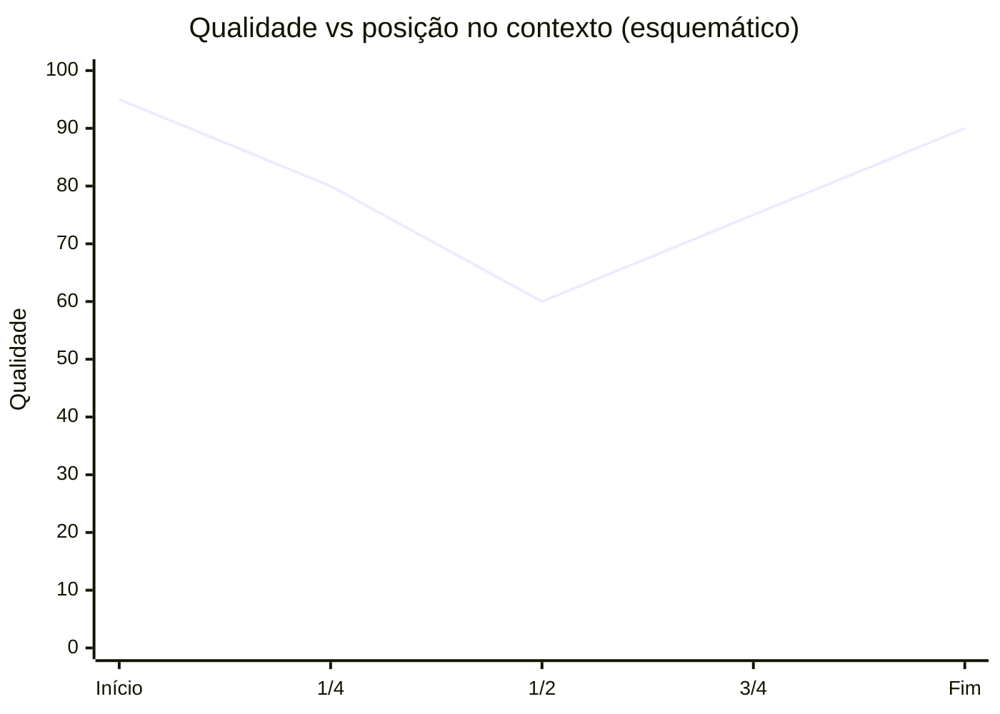
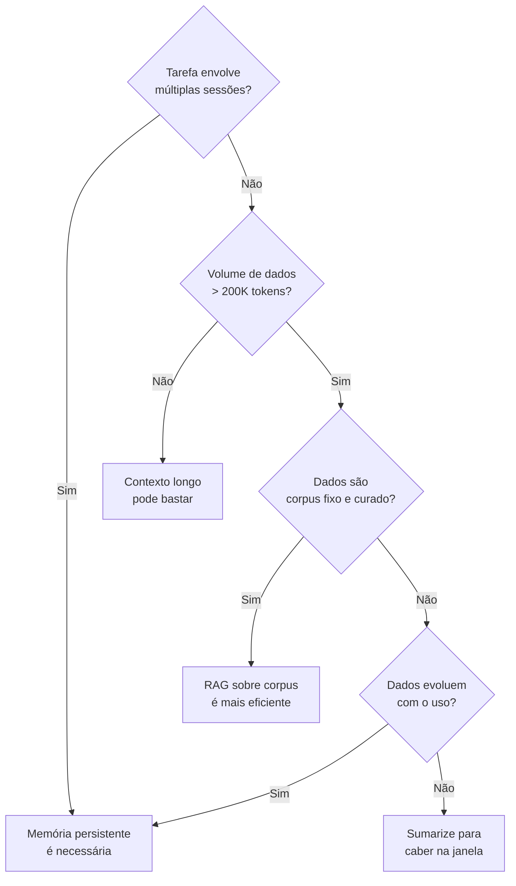

# O problema das janelas de contexto

> [!abstract] TL;DR
> Mesmo com janelas de contexto de 1M-2M tokens em 2026, há limites práticos que impedem tratar contexto longo como substituto de memória. Custo cresce linearmente com o tamanho do prompt, latência de prefill também, e o fenômeno **lost in the middle** faz informação no meio do contexto ser usada pior que nas bordas. Soma-se a isso o **context rot**: redundância e ruído acumulados degradam a qualidade ao longo da sessão. Janela grande não é memória resolvida — é um recurso caro que precisa ser gerenciado.

> [!question]- Dúvidas e lacunas desta nota
> - Dúvida gerada pelo conteúdo: o fenômeno "lost in the middle" foi estudado principalmente com modelos de 2023; modelos de 2026 treinados explicitamente para contexto longo (Claude 3.5, Gemini 1.5 Pro) ainda exibem a mesma curva em U, ou o treinamento especializado mitigou o efeito?
> - Lacuna potencial: a nota discute custo em termos absolutos ($ por requisição) mas não modela o custo comparativo — qual é o breakeven entre "jogar tudo no prompt com prompt caching" versus "banco vetorial com retrieval" para uma app típica com N usuários e K turnos por sessão?

## O que é

Imagine uma sessão de 20 turnos com um agente de coding: no turno 5 o usuário decide usar JWT para autenticação; no turno 12 vocês discutem trade-offs de deploy; no turno 18 revisitam e confirmam a decisão do turno 5. Tudo isso parece "lembrado" — porque, dentro da mesma chamada, o histórico inteiro está ali, disponível para o modelo consultar. Mas assim que a sessão termina e uma nova chamada de API começa, essa memória desaparece por completo: o modelo não guarda nada entre chamadas, cada requisição é processada do zero, e se o histórico da conversa não for reenviado explicitamente no próximo prompt, a decisão do turno 5 simplesmente não existe mais para o modelo. É esse comportamento que [[Dicionário de IA#Context window|janela de contexto]] descreve: o número de [[Dicionário de IA#Token|tokens]] que um [[Dicionário de IA#LLM (Large Language Model)|LLM]] processa em uma única chamada, somando entrada (system prompt, histórico, documentos, tool results) e saída gerada. Tudo que o modelo "sabe" sobre a tarefa em curso vive ali; nada além disso é considerado. Quando a janela enche, o conteúdo mais antigo é truncado ou descartado pelo orquestrador antes da próxima chamada.

Em abril de 2026 os limites declarados pelos principais provedores são, em ordem de grandeza:

- **Claude Opus 4.7** e **Sonnet 4.6**: até **1M tokens** de contexto.
- **Gemini 2.5 Pro**: **1M tokens** atual, com **2M tokens** anunciado (março de 2025) mas ainda pendente em abril de 2026.
- **GPT-5 Pro**: contexto total de **400K tokens** (**272K** máx de input + **128K** máx de output) — significativamente menor que os concorrentes na ponta de contexto longo.

> [!info] GPT-5.5 (abril de 2026)
> **GPT-5.5**, lançado em **23-24 de abril de 2026** (dois dias antes desta nota), sobe para **1M tokens** de contexto — fechando a distância para Claude e Gemini. Esses números mudam rapidamente; antes de citar em produção, sempre confira a página oficial de cada provedor.

Para ter uma ideia de escala: 1M tokens correspondem a aproximadamente 750.000 palavras em inglês — mais do que *Guerra e Paz* e *Dom Quixote* juntos. É uma janela imensa para análise pontual de documentos longos. Mas não é memória. A diferença fica clara quando você pensa na dimensão temporal: um documento longo cabe numa janela de 1M tokens porque está todo lá de uma vez. Uma conversa de seis meses com um agente não cabe — e mesmo que coubesse, custo e latência tornariam a abordagem inviável.

A leitura ingênua é animadora: "se cabe um livro no prompt, por que memória externa?". Esta nota responde com quatro problemas concretos.

## Por que importa

A premissa de que "modelo grande resolve tudo, basta jogar o histórico inteiro no prompt" é uma das tentações mais comuns ao desenhar um agente. Ela parece elegante: dispensa banco vetorial, RAG, lógica de retrieval, esquecimento. Mas se desfaz rápido em produção. Os quatro problemas listados a seguir — custo, latência, lost-in-the-middle e context rot — são a razão estrutural pela qual memória persistente continua necessária mesmo com janelas de 1M+ tokens.

Internalizar esses limites é o que separa um sistema que funciona em demo de um que sobrevive em produção. É também o que motiva todo o resto da trilha: cada framework discutido nas próximas notas é, no fundo, uma forma diferente de não pagar o custo de jogar tudo no prompt o tempo todo.

A ironia do momento: os provedores de modelos têm um incentivo comercial para que você use janelas maiores — cada token custa. Frameworks de memória persistente, por outro lado, reduzem o número de tokens por chamada. Entender os limites reais das janelas de contexto é também um ato de defesa econômica: usar contexto onde contexto faz sentido, e memória onde memória faz sentido, ao invés de usar contexto para tudo.

### O que muda com a escala

O problema de custo não é linear na percepção — é invisível até virar crítico. Em escala pequena (centenas de usuários, poucos turnos por sessão), janela grande é absolutamente viável. O problema aparece quando:

- Volume cresce (milhares de usuários, dezenas de turnos)
- Sessões ficam mais longas (o histórico cresce por semanas, não horas)
- O produto evolui para casos de uso que exigem mais contexto
- A janela de contexto é usada por múltiplos agentes em paralelo (multi-agent, onde cada agente carrega seu contexto separadamente)

Em cada um desses cenários, a conta de tokens cresce muito mais rápido do que o crescimento de usuários — porque o custo por usuário também sobe conforme as sessões ficam mais longas. Planejar a arquitetura de memória antes de escalar é muito mais barato do que refatorar um sistema inteiro que foi construído na premissa de "jogar tudo no prompt".

## Como funciona — anatomia do problema

Os quatro problemas abaixo se manifestam em ordem crescente de sutileza. Os dois primeiros são econômicos e visíveis na fatura; os dois últimos são qualitativos e só aparecem em avaliação cuidadosa.

> [!tip] Por que "quatro problemas" e não "janela grande resolve"?
> A tentação de "simplesmente usar contexto maior" é compreensível — é a solução mais simples, sem infraestrutura adicional. Mas os quatro problemas abaixo são estruturais: não somem com modelos mais novos ou com janelas maiores. Custo e latência escalam com o tamanho da janela, não melhoram. Lost-in-the-middle persiste mesmo em modelos otimizados para contexto longo. Context rot é inevitável em conversas acumulativas. Entender esses quatro limites é o que torna a decisão de usar memória externa racional, não prematura.

### 1. Custo linear em tokens

Cada token enviado e cada token gerado é cobrado. Para Claude Opus 4.7, em abril de 2026, a tabela oficial cita aproximadamente **$5 por milhão de tokens de input** e **$25 por milhão de tokens de output**. Modelos de Sonnet e Haiku ficam abaixo, e há descontos relevantes via [[Dicionário de IA#Prompt caching|prompt caching]] e batch processing — mas o custo nominal segue linear no tamanho do prompt.

Em números arredondados: encher uma janela de 1M tokens de input em Opus custa cerca de **$5 por requisição** (sem cache). Para um chat eventual, é trivial. Para um app com volume — milhares de usuários, várias chamadas por sessão — vira fatura proibitiva rapidamente. Memória externa existe, em parte, exatamente para evitar enviar o mesmo histórico repetido a cada turno.

O contraponto importante é o **prompt caching**: para partes do prompt que não mudam entre chamadas (system prompt, documentação, instruções de projeto), caching reduz o custo de re-leitura em ~90% (Anthropic) após a primeira chamada. Isso torna contextos longos **estáticos** muito mais acessíveis. O problema permanece para a parte **dinâmica** do prompt — o histórico crescente da conversa — que não pode ser cacheado porque muda a cada turno. Caching e memória persistente são complementares: caching resolve o custo do conteúdo estático; memória persistente resolve o crescimento do conteúdo dinâmico.

> [!info] Calculando o ponto de break-even
> Quando compensa investir em memória persistente vs. usar prompt caching para o histórico? Regra de thumb: se o histórico médio por sessão ultrapassa 20K tokens E você tem mais de 100 usuários ativos diários, a infraestrutura de memória começa a se pagar. Abaixo disso, caching + sliding window podem ser suficientes. Acima de 50K tokens de histórico médio, memória persistente é quase sempre a escolha economicamente dominante.

### 2. Latência de prefill

Antes do primeiro token de saída, o modelo precisa processar todo o input — etapa chamada **prefill**. O TTFT (*time to first token*) é dominado por esse custo quando o prompt é longo. [[Dicionário de IA#attention|Attention]] tradicional é **O(n²)** em memória e compute em relação ao tamanho do contexto, então prompts grandes não escalam linearmente em latência: escalam pior.

Otimizações como **FlashAttention**, **paged attention**, kernels customizados e técnicas de [[Dicionário de IA#KV cache|KV-cache]] mitigam constantes e melhoram throughput, mas não eliminam a complexidade assintótica. Em janelas de centenas de milhares a milhões de tokens, é normal o usuário esperar dezenas de segundos antes do primeiro caractere aparecer. Para aplicações conversacionais, isso é fatal de UX. Para aplicações batch, é apenas caro.

Para ter uma referência de grandeza: em janelas de ~100K tokens, TTFT típico em Claude Sonnet pode ser de 3-8 segundos. Em 500K tokens, 15-30 segundos. Em 1M tokens, pode chegar a 60+ segundos dependendo da infraestrutura de serving e do load do cluster. Nenhum usuário de chat aguarda 60 segundos de resposta sem perceber que algo está errado. A latência de prefill é o limite prático mais imediato para uso de janelas longas em contexto conversacional.

### 3. Lost in the middle

Mesmo quando o modelo aceita o prompt longo e o custo é absorvido, há um problema de qualidade documentado: o paper **"Lost in the Middle: How Language Models Use Long Contexts"**, de Liu et al. (2023, arXiv:2307.03172), mostrou empiricamente que LLMs **usam pior a informação posicionada no meio do contexto** do que a informação nas bordas. A performance forma uma curva em U: alta no início, vale no meio, recuperação no fim.

O fenômeno se manifesta tanto em modelos com janela "pequena" quanto em modelos explicitamente desenhados para contexto longo. Em prompts de dezenas de milhares de tokens a degradação já é mensurável; em centenas de milhares, vira dramática em tasks que exigem raciocínio multi-hop ou recuperação precisa. A implicação prática é incômoda: **onde você coloca a informação no prompt importa**, e enterrar fato crítico no meio de um contexto gigante é receita para o modelo "esquecer" mesmo lendo.

O gráfico acima é esquemático — números reais variam por modelo, tarefa e tamanho do prompt — mas a forma da curva é robusta na literatura.

A implicação prática mais importante é sobre **design de recuperação**: quando você recupera memória para injetar no prompt, não basta encontrar o conteúdo certo — você precisa posicioná-lo certo. Informação crítica recuperada de memória externa deve ir para o início do contexto (antes do histórico da conversa atual), não para o meio. A seção de system message e o início da mensagem do usuário são as bordas com melhor atenção do modelo.

Uma forma de tirar proveito da curva U: use a estrutura `[informação crítica recuperada] + [conversa em curso] + [resumo dos pontos mais importantes]`. Repete o essencial nas duas bordas. É verboso, mas é robusto contra lost-in-the-middle.

Pesquisas mais recentes (2024-2026) investigam se modelos treinados especificamente para contexto longo (como Gemini 1.5 Pro e Claude 3.5 Sonnet) atenuam o efeito. Os resultados são mistos: a degradação no meio persiste, mas começa mais tarde (o vale se desloca para contextos maiores). Para janelas de até 100K tokens, modelos modernos são consideravelmente mais robustos do que os modelos de 2023 estudados no paper original de Liu et al.

### 4. Context rot

O quarto problema é mais sutil e menos formalizado academicamente, mas conhecido por qualquer pessoa que tenha mantido uma sessão longa com um agente: **a qualidade da resposta degrada ao longo do tempo mesmo dentro da janela**. Causas se sobrepõem:

- **Repetição.** O modelo reciclou a mesma instrução cinco vezes; agora ela compete consigo mesma.
- **Redundância.** Tool results acumulados trazem o mesmo fato em formatos diferentes, diluindo sinal.
- **Ruído.** Mensagens de erro, tentativas falhas, checkpoints intermediários ocupam espaço sem agregar.
- **Drift.** Decisões antigas que foram revistas continuam no histórico, criando contradição com o estado atual.

Context rot é um dos motivos pelos quais resumir e descartar — *manage* no loop write-manage-read discutido em [[01 - O que é memória em IA]] — é parte essencial do design, não detalhe de polimento. Memória externa bem mantida é, em última análise, a forma mais eficaz de evitar que o contexto vire lixão.

Um sintoma comum de context rot que passa despercebido: o modelo começa a contradizer decisões anteriores. Se na mensagem 5 o usuário decidiu usar autenticação com JWT e na mensagem 45 o contexto está cheio de discussões sobre OAuth (incluindo attempts revertidos), o modelo pode voltar a sugerir OAuth porque o sinal da decisão original está diluído no ruído. Context rot não é só degradação de qualidade abstrata — é comportamento incorreto concreto que aparece em sessões longas.

> [!note] Os quatro problemas se combinam
> Custo, latência, lost-in-the-middle e context rot não são problemas independentes — eles se combinam. Uma sessão longa (context rot ativo) exige prompt enorme (custo alto, latência alta), com informação distribuída pelo contexto (lost-in-the-middle atacando qualidade). O efeito composto é muito pior do que qualquer problema isolado. É por isso que memória persistente não é otimização prematura: é o que permite que um sistema com LLM funcione além da sessão única.

### Anatomia da conta em produção

Vamos tornar o problema de custo concreto com um cenário realista. Suponha um agente de coding que usa Claude Opus 4.7, com:

- System prompt fixo: 5.000 tokens (instruções do agente, CLAUDE.md do projeto)
- Histórico de conversa crescente: começa em 0, vai a 50.000 tokens ao longo de 20 turnos
- Tool results por turno: ~2.000 tokens em média
- Output do modelo por turno: ~500 tokens

| Turno | Input tokens | Output tokens | Custo (Opus 4.7) |
|-------|-------------|---------------|-----------------|
| 1 | ~7.000 | ~500 | ~$0,049 |
| 5 | ~17.000 | ~500 | ~$0,097 |
| 10 | ~29.500 | ~500 | ~$0,160 |
| 20 | ~54.500 | ~500 | ~$0,285 |
| **Sessão inteira (20 turnos)** | | | **~$3,20** |

Uma sessão de 20 turnos custa ~$3,20 em Opus sem caching. Com prompt caching nos 5.000 tokens fixos, o custo cai para ~$2,80 — melhora pequena porque o custo é dominado pelo histórico crescente, que não é cacheável. Para uma app com 1.000 usuários fazendo uma sessão por dia, são ~$80K-$96K/mês só em API costs. Com memória externa bem projetada — que recupera apenas os ~5.000 tokens mais relevantes de um histórico de 50.000 — o custo por turno cai drasticamente e permanece estável mesmo com histórico ilimitado.

### Como mitigar (sem abandonar contexto longo)

Contexto longo tem casos de uso legítimos. Algumas estratégias para mitigar os problemas sem abrir mão do recurso quando ele é apropriado:

- **Prompt caching (Anthropic/Google)**: partes estáticas do prompt (system message, documentação, CLAUDE.md) são cacheadas por até 5 minutos (Anthropic) a 1 hora (Google), reduzindo drasticamente o custo de reenvio. Funciona bem para conteúdo que não muda entre chamadas.
- **Sliding window**: em vez de incluir toda a conversa, inclui apenas os N turnos mais recentes. Simples, mas perde contexto histórico; é onde memória persistente complementa — o histórico distante fica no substrato externo e é recuperado se relevante.
- **Sumarização progressiva**: a cada K turnos, o agente sumariza a conversa até aquele ponto e substitui o histórico detalhado pelo sumário. Reduz tokens mantendo informação compactada. É a etapa "manage" do loop write-manage-read aplicada inline.
- **Posicionamento estratégico**: colocar a informação mais crítica no início e no fim do prompt (bordas da curva U do lost-in-the-middle). Não resolve o problema estrutural mas mitiga o efeito.
- **Retrieval seletivo**: em vez de incluir todo o histórico, recuperar apenas os fragmentos semanticamente relevantes para o turno atual. É a abordagem de memória persistente — e resolve os quatro problemas simultaneamente ao custo de infraestrutura adicional.

## Quando contexto longo basta / quando não

**Bom para:**

- **Single-doc analysis** estável e de tamanho moderado — analisar um artigo, um PDF de poucas páginas, um log de algumas dezenas de milhares de tokens.
- **Raciocínio cruzado entre poucas peças** que precisam estar juntas para fazer sentido — comparar dois contratos, sintetizar três papers.
- **Casos isolados** em que memória persistente seria overkill — script único, automação de uma vez só, exploração ad-hoc.
- **Prompts cacheáveis e estáveis** — system prompts grandes que se repetem entre chamadas se beneficiam fortemente de prompt caching, reduzindo custo efetivo do contexto longo.
- **Raciocínio que exige coerência global** — quando a task depende de manter coerência entre partes distantes de um documento único (ex: reescrever um livro inteiro mantendo consistência de personagens), ter tudo na janela é melhor do que recuperar fragmentos.

**Ruim para:**

- **Histórico cumulativo** de chats de longa duração — cresce sem limite e custa caro a cada turno.
- **Multi-session** — sessões separadas precisam de algo que sobreviva entre chamadas, e janela de contexto não sobrevive.
- **Dados que mudam frequentemente** — manter no prompt obriga reenvio constante e arrisca informação desatualizada coexistir com nova.
- **Apps com volume relevante de usuários** — o custo linear vira inviável em qualquer ordem de grandeza séria.
- **Tasks que exigem precisão de recuperação** — lost-in-the-middle ataca exatamente esse caso, e RAG bem feito costuma vencer prompt longo em retrieval factual.
- **Sistemas com histórico de múltiplos usuários** — manter histórico de milhares de usuários em contexto é inviável; memória externa por usuário é a única saída escalável.

### Heurística de decisão: contexto vs. memória vs. RAG

A heurística não é absoluta — há casos que misturam os três (RAG + contexto longo + memória persistente coexistindo). Mas a árvore ajuda a evitar a armadilha mais comum: usar contexto longo onde RAG seria 10x mais barato, ou usar RAG onde memória persistente é o que realmente resolve.

## Armadilhas comuns

> [!warning] Armadilha 1: Confiar no número da janela sem benchmark próprio
> "1M tokens" é a capacidade nominal do modelo, não a capacidade usável na sua tarefa. Modelos diferentes degradam em ritmos muito diferentes conforme o contexto aumenta — alguns são quase inúteis acima de 200K tokens em tasks que exigem raciocínio multi-hop, mesmo anunciando suporte a 1M+. Antes de apostar uma decisão arquitetural no limite máximo declarado, rode avaliação na sua tarefa real, com seus dados, medindo accuracy e qualidade de recuperação em múltiplos tamanhos de contexto. O número no site do provedor é o teto teórico, não a garantia de qualidade.

> [!warning] Armadilha 2: Esquecer que cada token custa e o custo escala com volume
> Prompts gigantes em produção viram fatura surpresa no fim do mês. O cálculo crítico é: `tokens_médios_por_chamada × chamadas_por_sessão × sessões_por_dia × usuários × dias`. Um prompt de 200K tokens em Opus 4.7 custa ~$1 por chamada. Com 1.000 usuários fazendo 10 chamadas por dia, são $10.000/dia só em input — $300K/mês. Prompt caching mitiga o custo de partes estáticas, mas não de conteúdo dinâmico (histórico, tool results). Calcule antes de escalar.

> [!warning] Armadilha 3: Ignorar lost-in-the-middle ao posicionar informação crítica
> Posicionar fato crítico no meio de um prompt longo é furada documentada na literatura (Liu et al., 2023). Se a informação precisa estar no prompt longo, repita-a nas bordas — começo e fim do contexto têm performance significativamente melhor. Melhor ainda: use retrieval estruturado para que só o relevante chegue ao prompt, e o que chega esteja posicionado estrategicamente. Não assuma que o modelo encontra o que importa em qualquer posição.

> [!warning] Armadilha 4: Achar que long context substitui RAG ou memória persistente
> Quase nunca substitui — são ferramentas com regimes distintos. Contexto longo é ótimo para análise pontual de um documento inteiro (um PDF longo, um codebase médio). RAG é ótimo para retrieval estável sobre corpus fixo e volumoso. Memória persistente é ótima para acumulação evolutiva ao longo do tempo. Usar contexto longo onde RAG seria mais eficiente é desperdiçar tokens em conteúdo que poderia ser recuperado sob demanda; usar RAG onde memória dinâmica é necessária é recuperar corpus estático quando o dado relevante está emergindo da interação.

> [!warning] Armadilha 5: Tratar prefill como custo irrelevante para UX
> TTFT (time to first token) é dominado pelo custo de prefill em prompts longos. Em chat, dezenas de segundos de espera antes do primeiro caractere aparecer quebram o produto antes de qualquer problema de qualidade aparecer — o usuário abandona ou perde a sensação de fluidez conversacional. Em produção batch, prefill longo ainda é caro em compute mesmo que o usuário não espere. Nunca trate prefill como grátis em análise de viabilidade de arquitetura com contexto longo.

## Perguntas frequentes

**P: Prompt caching não resolve o problema de custo?**

Resolve parcialmente — mas só para conteúdo estático. Prompt caching (disponível na Anthropic e Google em 2026) armazena o processamento de prefixes do prompt que não mudam entre chamadas, cobrando uma fração do preço para reprocessar esses tokens em chamadas subsequentes. O system prompt, documentação do projeto e qualquer conteúdo fixo pode ser cacheado com desconto de ~90% (Anthropic) no custo de re-leitura. Mas o histórico de conversa — que é a parte que cresce — não pode ser cacheado de forma eficiente porque muda a cada turno. Caching é otimização complementar a memória persistente, não substituta.

**P: FlashAttention e KV-cache não eliminam o custo de latência?**

FlashAttention e variantes (Flash Attention 2, Flash Attention 3) reduzem drásticamente o **uso de memória GPU** da atenção (de O(n²) para O(n) em memória), permitindo janelas maiores e maior throughput. KV-cache reutiliza computação de atenção de tokens já processados nas chamadas anteriores. Ambas são otimizações de implementação que melhoram as constantes e a viabilidade de janelas longas — mas não eliminam a complexidade assintótica do problema. O custo de processar N tokens novos ainda escala com N. Em janelas de 500K-1M tokens com parte nova, o prefill continua sendo o gargalo de latência dominante.

**P: Qual a melhor forma de medir se o lost-in-the-middle está afetando meu sistema?**

Benchmark próprio é mais confiável do que resultados da literatura (que usam tarefas e dados específicos). Abordagem prática: (1) crie um conjunto de perguntas que exigem recuperação de fato específico; (2) posicione o fato em diferentes posições do contexto (início, 25%, 50%, 75%, fim); (3) meça accuracy de recuperação por posição. Se houver degradação no meio, você confirmou o efeito no seu modelo+tarefa e pode quantificar o custo antes de decidir a estratégia de mitigação.

## Como explicar em inglês

> [!tip] Interview quote
> "Large context windows don't solve the memory problem — they just make it more expensive to ignore it. Filling a 1M token window costs real money per call, prefill latency degrades UX, and 'lost in the middle' means information buried in a long prompt is used worse than information at the edges. Context is a scarce resource to manage, not a bucket to dump everything into."

Complemento para pergunta sobre tradeoffs de arquitetura: "The four practical limits of long context are: linear cost scaling (every token has a price and it compounds with volume), prefill latency (TTFT grows with prompt size and breaks conversational UX), lost-in-the-middle (empirically worse retrieval for information in the middle of long contexts), and context rot (quality degrades as conversations accumulate redundancy and drift). These are the reasons why persistent memory with selective retrieval is still necessary even with 1M+ token windows."

| Português | Inglês |
|-----------|--------|
| Janela de contexto | Context window |
| Tokens de entrada | Input tokens |
| Latência de prefill | Prefill latency / TTFT (time to first token) |
| Perdido no meio | Lost in the middle |
| Podridão de contexto | Context rot |
| Custo linear | Linear cost / linear scaling |
| Atenção quadrática | Quadratic attention |
| Cache do KV | KV cache |
| Truncamento | Truncation / context truncation |
| Janela deslizante | Sliding window context |
| Cache de prompt | Prompt caching / context caching |
| Otimização de prefill | Prefill optimization |

## A evolução dos limites ao longo do tempo

Um padrão que se repete na história das LLMs: os limites de janela crescem consistentemente, mas os problemas de custo, latência e qualidade seguem o mesmo ritmo. GPT-3 tinha 4K tokens em 2020; em 2026 temos 1M+ tokens. Mas o custo nominal por token não caiu na mesma proporção, e os problemas de qualidade (lost-in-the-middle, context rot) se deslocaram para janelas maiores, não desapareceram.

O padrão sugere que memória persistente não vai se tornar obsoleta com janelas maiores. Ela vai se tornar necessária em escalas maiores — onde antes 50K tokens de histórico era o limite prático, agora é 500K. Mas a estrutura do problema permanece a mesma: contexto finito e caro, informação que cresce sem limite, necessidade de recuperação seletiva e esquecimento deliberado.

## Perguntas de revisão

Para fixar o conteúdo desta nota, tente responder sem olhar:

1. Quais são os quatro problemas estruturais de usar contexto longo como substituto de memória?
2. Por que prompt caching resolve o problema de custo para system prompts mas não para histórico de conversa?
3. O que é o fenômeno "lost in the middle" e qual a forma da curva de qualidade que ele descreve?
4. Quais são os quatro tipos de causa de context rot, e como memória externa resolve cada um?
5. Em que cenários contexto longo ainda é a melhor ferramenta, mesmo com os quatro problemas?
6. Qual é a complexidade assintótica da atenção tradicional e por que isso importa para TTFT?
7. Como as cinco estratégias de mitigação (prompt caching, sliding window, sumarização progressiva, posicionamento estratégico, retrieval seletivo) se complementam — e qual é a única que resolve os quatro problemas simultaneamente?
8. Qual é a heurística de break-even para decidir entre caching+sliding window e memória persistente?
9. Por que context rot é especialmente perigoso em sistemas de decision-making (ex: coding agents, pesquisa)?
10. Qual o efeito composto de custo+latência+lost-in-the-middle+context rot quando todos atacam simultaneamente?

## Síntese da nota

> [!summary] Quatro limites, uma conclusão
> Contexto longo é uma ferramenta poderosa para análise de documentos e raciocínio intensivo dentro de uma sessão. Mas como substituto de memória persistente, falha em quatro dimensões: (1) **custo** escala linearmente e vira inviável em volume; (2) **latência de prefill** cresce com o tamanho do prompt e quebra a UX de chat; (3) **lost-in-the-middle** degrada qualidade de recuperação para informação enterrada no meio do contexto; (4) **context rot** deteriora a coerência ao longo de sessões longas. A resposta a esses quatro problemas não é "janela maior" — é memória persistente com recuperação seletiva.

## O que vem a seguir

Esta nota desmontou a ilusão de que janelas grandes de contexto resolvem o problema de memória — e mostrou quatro razões concretas (custo, latência, lost-in-the-middle, context rot) pelas quais contexto longo é recurso caro e limitado, não substituto de memória persistente. Com esse problema em mente, a próxima nota [[03 - Taxonomia da memória (episódica, semântica, procedural)]] oferece o vocabulário para pensar nos diferentes tipos de informação que um agente precisa persistir — e por que cada tipo pede estratégias e substratos distintos. É a fundação conceitual que antecede qualquer decisão de implementação.

Saber que "contexto longo não basta" ainda não diz o que usar no lugar. A taxonomia da próxima nota — episódica, semântica, procedural — é o que permite decompor a pergunta "o que meu agente precisa lembrar?" em categorias tratáveis, cada uma com substrato, frequência de escrita e política de esquecimento próprias. Sem essa decomposição, qualquer sistema de memória tende a tratar tudo da mesma forma — e falha por motivos diferentes para cada tipo de informação.

## Veja também

- [[01 - O que é memória em IA]] — o conceito que vem antes; define o loop write-manage-read
- [[03 - Taxonomia da memória (episódica, semântica, procedural)]] — como classificar o que persistir e em que substrato
- [[04 - RAG vs memória de longo prazo]] — alternativa pragmática para retrieval estável sobre corpus fixo
- [[05 - Beyond RAG - quando RAG não basta]] — onde o problema continua mesmo com RAG
- [[08 - Arquitetura de um sistema de memória]] — como sistemas reais resolvem os quatro problemas
- [[09 - Panorama de implementações (abril 2026)|09 - Panorama de implementações]] — frameworks que tratam dos problemas acima com diferentes tradeoffs
- [[Dicionário de IA#Context window|Context window]] — definição técnica do conceito
- [[Dicionário de IA#KV cache|KV cache]] — otimização de serving que mitiga latência sem resolver custo

## Referências

- **Liu, N. F. et al. (2023)** — "Lost in the Middle: How Language Models Use Long Contexts". `https://arxiv.org/abs/2307.03172` — paper foundational do fenômeno: modelos usam pior informação no meio do contexto, com curva de qualidade em U entre início e fim. Avaliação em multi-document QA e key-value retrieval. Resultado replicado em múltiplos modelos e tamanhos de contexto subsequentemente.
- **Anthropic (2024)** — "Introducing Contextual Retrieval". `https://www.anthropic.com/news/contextual-retrieval` — post explicando como Anthropic combina retrieval contextualizado com prompt caching para mitigar custo e qualidade em prompts longos; pano de fundo prático para as tradeoffs discutidas aqui.
- **Anthropic — Pricing oficial.** `https://www.anthropic.com/pricing` (e `https://platform.claude.com/docs/en/about-claude/pricing`) — tabela de preços por milhão de tokens de input/output dos modelos Claude. Em abril de 2026, Opus 4.7 figurava em ~$5/M input e ~$25/M output, com descontos via prompt caching e batch.
- **Google AI for Developers** — "Long context | Gemini API". `https://ai.google.dev/gemini-api/docs/long-context` — documentação oficial dos limites de janela do Gemini 2.5 Pro (1M atual, 2M anunciado) e melhores práticas para uso de contexto longo.
- **OpenAI — documentação de modelos GPT-5.** Página oficial para limites por tier (Pro ~272K em abril/2026). Conferir antes de citar em produção, pois números mudam com frequência.
- **Dao, T. et al. (2022)** — "FlashAttention: Fast and Memory-Efficient Exact Attention with IO-Awareness". `https://arxiv.org/abs/2205.14135` — paper que introduziu FlashAttention, otimização de atenção que reduz uso de memória de O(n²) para O(n) via IO-awareness. Base técnica para entender por que janelas longas ficaram viáveis sem eliminar o custo assintótico de processar novos tokens.
- **Shi, Z. et al. (2023)** — "Large Language Models Can Be Easily Distracted by Irrelevant Context". `https://arxiv.org/abs/2302.00093` — paper que demonstra como ruído e contexto irrelevante no prompt degradam performance do LLM, complementando o fenômeno de context rot documentado nesta nota.
- **Anthropic** — "Prompt caching with Claude". `https://docs.anthropic.com/en/docs/build-with-claude/prompt-caching` — documentação oficial do prompt caching do Claude: como funciona, quais partes do prompt podem ser cacheadas, limites de TTL (5 minutos por padrão) e preços com desconto. Estratégia central para mitigar custo de prompts com partes estáticas longas.
