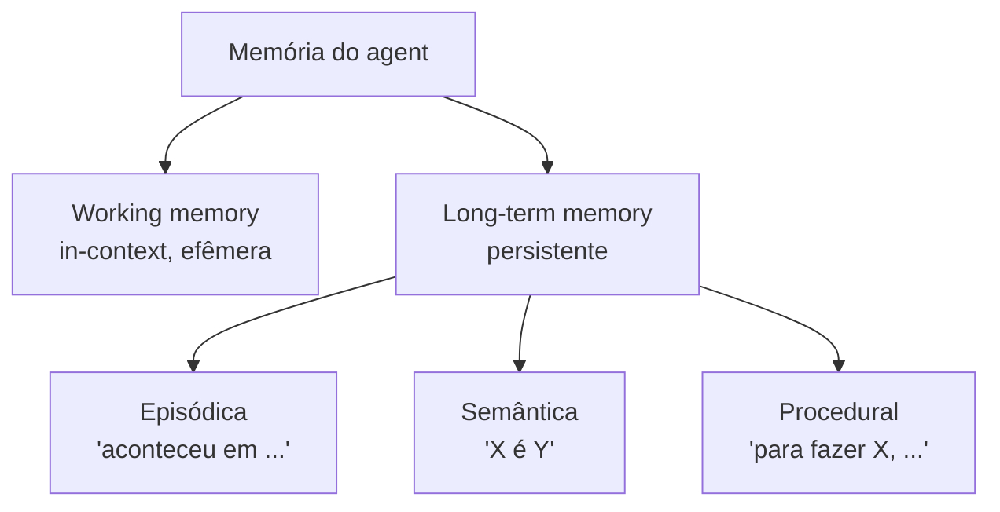
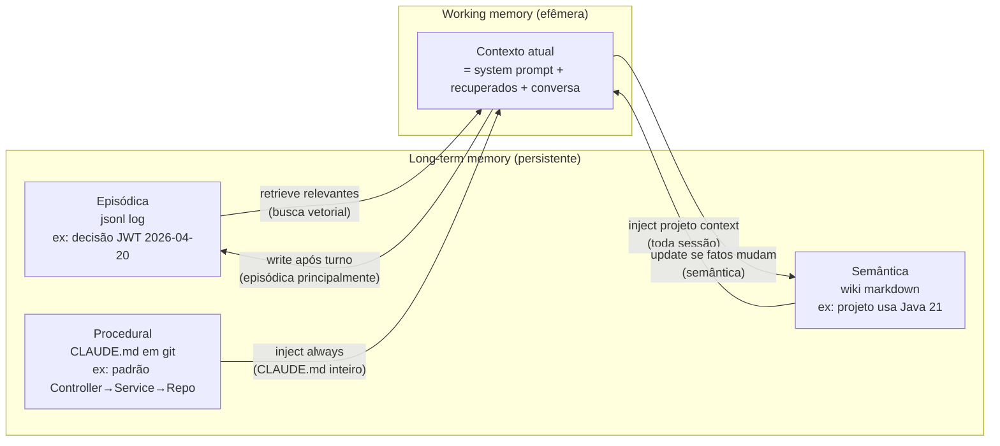
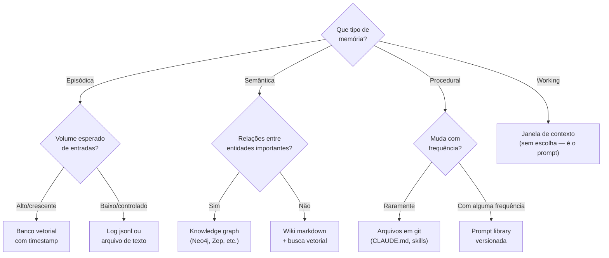

# Taxonomia da memória

> [!abstract] TL;DR
> Memória humana se divide em **episódica** (eventos vividos), **semântica** (fatos sobre o mundo) e **procedural** (como fazer coisas) — taxonomia proposta por Endel Tulving a partir de 1972. Sistemas de IA emprestam esse vocabulário para discutir agentes que precisam lembrar **o que aconteceu**, **o que é** e **como agir**. A isso soma-se a distinção **working memory** (in-context, efêmera) versus **long-term memory** (persistente). É metáfora útil, não regra rígida — implementações reais misturam tipos.

> [!question]- Dúvidas e lacunas desta nota
> - Dúvida gerada pelo conteúdo: memória procedural em humanos é frequentemente implícita (não consciente) — agentes de IA têm analogamente memória procedural "implícita" nos pesos do modelo (instintos de raciocínio adquiridos no treino) além da procedural explícita em skills/runbooks? Como distinguir as duas?
> - Lacuna potencial: a nota descreve cada tipo de memória mas não dá um exemplo de sistema real que implementa os três simultaneamente, com o diagrama mostrando como episódica, semântica e procedural coexistem e interagem num único agente de produção.

## O que é

A taxonomia clássica vem do psicólogo Endel Tulving. Em 1972, ele distinguiu **[[Dicionário de IA#episodic memory|memória episódica]]** — lembrança de eventos específicos vividos pelo sujeito, marcados no tempo e no contexto — de **[[Dicionário de IA#semantic memory|memória semântica]]** — conhecimento factual sobre o mundo, descontextualizado e atemporal. Mais tarde a literatura cognitiva incorporou a **memória procedural** (saber como executar habilidades, frequentemente sem acesso consciente ao "como") e a **[[Dicionário de IA#working memory|working memory]]** (espaço de trabalho de curtíssimo prazo, popularizado pelo modelo de Baddeley).

Em IA, esse vocabulário foi importado por extensão metafórica. Quando um paper de 2026 fala em "memória episódica do agente", está apropriando o termo de Tulving para descrever um log cronológico de interações; "memória semântica" costuma referir-se a fatos consolidados num grafo, knowledge base ou páginas de wiki. A correspondência é frouxa — sistemas reais não respeitam fronteiras conceituais com precisão — mas a metáfora pegou porque resolve um problema prático: dá nomes diferentes para coisas que, embora todas se chamem "memória", têm padrões de uso radicalmente distintos.

> [!note] Por que Tulving e não outra taxonomia?
> Tulving não foi o único a propor taxonomias de memória — Anderson (ACT-R, 1983) e Laird (SOAR, 1987) também formularam divisões influentes em IA simbólica. A escolha de Tulving em 2026 reflete que o vocabulário dele é o mais conhecido fora da IA (psicologia cognitiva, neurociência, educação), facilitando comunicação interdisciplinar. Além disso, a divisão episódica/semântica/procedural resiste razoavelmente bem ao mapeamento para sistemas de IA, mesmo sendo imperfeita. Qualquer taxonomia é uma simplificação — Tulving é a simplificação mais amplamente adotada e com menor custo de onboarding.

A trilha "Memória de Agentes" usa esses quatro termos como vocabulário-base. Saber se um caso é episódico, semântico, procedural ou in-context vai ser útil em quase toda nota seguinte.

> [!info] Correspondência com taxonomias de IA simbólica
> O campo de IA simbólica dos anos 1980-1990 já usava distinções similares, embora com nomes diferentes. Arquiteturas como ACT-R (Anderson, 1983) distinguiam "declarative memory" (similar a semântica+episódica de Tulving) de "procedural memory" (regras de produção — similar ao procedural desta nota). SOAR (Laird, 1987) tinha "working memory" (estado atual do problema) e "long-term memory" (conhecimento procedural em regras, episódico em chunks). A importação de Tulving para IA moderna é, em parte, um retorno às raízes do campo — mas num substrato radicalmente diferente (LLMs vs. sistemas simbólicos).

### A "quarta categoria" que falta: memória prospectiva

Alguns pesquisadores da área de memória de agentes propõem uma quarta categoria além das três de Tulving: **memória prospectiva** (prospective memory) — memória de intenções futuras, de "o que preciso fazer quando X acontecer". Em humanos, é o tipo ativado quando você lembra de tomar o remédio ao ver o copo d'água. Em agentes de IA, manifesta-se como triggers pendentes, tarefas agendadas, ou condições monitoradas.

Esta categoria não está universalmente adotada no campo em 2026, mas aparece em sistemas que precisam de comportamento proativo — agentes que não apenas respondem a perguntas mas tomam iniciativa quando certas condições são detectadas. Vale conhecer o termo para não se surpreender ao encontrá-lo em papers ou implementações avançadas.

## Por que importa

A taxonomia paga seu custo por três razões práticas.

Primeiro: **vocabulário compartilhado**. Sem nomes distintos, qualquer discussão sobre "memória do agente" desliza para ambiguidade. Um engenheiro chama de "memória" o histórico do chat; outro chama de "memória" a base de conhecimento; um terceiro chama de "memória" os system prompts versionados. Os três falam coisas diferentes e nenhum percebe. Episódico/semântico/procedural/working são quatro etiquetas que custam pouco e evitam horas de conversa cruzada.

Segundo: **cada tipo tem padrões distintos de write/read/forget**. Episódica é alta-frequência de escrita, baixa de leitura, política agressiva de esquecimento ou compactação. Semântica é baixa de escrita, alta de leitura, política de revisão e versionamento. Procedural quase nunca muda, mas precisa estar disponível em quase toda chamada. Tratar os três com o mesmo substrato e a mesma política é receita para um sistema que desperdiça recursos ou esquece o que importa.

Terceiro: **a taxonomia ajuda a decidir substrato**. Episódica casa com log cronológico apendado (jsonl, event store, memory stream). Semântica casa com knowledge graph, banco vetorial ou markdown em wiki. Procedural casa com arquivos versionados em git: skills, prompts, AGENTS.md/CLAUDE.md, runbooks. Quando substrato e tipo combinam, leitura e escrita ficam baratas; quando não, o sistema sofre.

| Tipo | Pergunta | Frequência write | Frequência read | Política forget | Substrato ideal |
|------|----------|-----------------|-----------------|----------------|----------------|
| Episódica | O que aconteceu, quando? | Alta | Baixa | Compactação por recência | Log cronológico, event store |
| Semântica | O que é X? | Baixa a média | Alta | Revisão e versionamento | Knowledge graph, banco vetorial, wiki markdown |
| Procedural | Como se faz Y? | Muito baixa | Alta (sempre disponível) | Raramente esquecida, mas versionada | Git, arquivos CLAUDE.md/AGENTS.md |
| Working | O que está em jogo agora? | Por chamada | Por chamada | Automática (fim da chamada) | Janela de contexto (em memória) |

## Como funciona

Cada tipo carrega uma pergunta arquetípica. Episódica responde "**aconteceu o quê, quando?**". Semântica responde "**o que é X?**". Procedural responde "**como se faz Y?**". Working memory responde "**o que está em jogo agora?**".

Há uma simetria interessante com o triângulo clássico do conhecimento em epistemologia: "o quê" (semântica), "quando/onde" (episódica) e "como" (procedural). O que IA adiciona é a distinção working/long-term — não sobre o tipo de conhecimento, mas sobre onde ele vive no instante atual. É exatamente essa distinção que torna o design de sistemas de memória um problema de engenharia, não apenas de epistemologia.

### Memória episódica — "aconteceu em..."

Cronológica, datável e contextual. Cada entrada está ancorada num momento específico e carrega o entorno em que aconteceu — quem falou, o que foi dito, qual era a tarefa, o que veio antes. Em humanos, é "lembrar do que aconteceu ontem na reunião". Em IA, manifesta-se como log de interações: chat history, registros de tool calls, observações de ambiente em ordem temporal.

O exemplo canônico é o **memory stream** de Park et al. em "Generative Agents" (Stanford, 2023): um log apendado de observações em linguagem natural, cada uma com timestamp e pontuada por relevância, recência e importância no momento da recuperação. Detalhes em [[18 - Generative Agents (Park, Stanford 2023)]]. Exemplo prosaico: "em 2026-04-25 às 14h32, o usuário pediu X numa conversa sobre Y".

### Memória semântica — "X é Y"

Atemporal, factual e descontextualizada. Não importa **quando** alguém aprendeu que Paris é capital da França — o fato é tratado como verdade estável, sem âncora temporal. Em IA, manifesta-se como knowledge graph, base estruturada de fatos, páginas de wiki ou notas zettelkasten.

O exemplo no qual a trilha mais investe é o **LLM Wiki Pattern** proposto por [[Andrej Karpathy|Karpathy]] ([[06 - O LLM Wiki Pattern (gist do Karpathy)]]): cada conceito vira página de markdown, com título, definição, links para outras páginas, atualizada quando o entendimento evolui. Outro exemplo é o **A-MEM** ([[19 - A-MEM — Zettelkasten dinâmico]]), em que o agente cria notas atômicas e as conecta dinamicamente. Entrada semântica típica: "LLM Wiki Pattern é um padrão proposto por Karpathy em abril/2026".

A memória semântica é a que mais se beneficia de técnicas de grafo de conhecimento: entidades (pessoas, projetos, conceitos) com atributos e relacionamentos entre elas. Uma entrada semântica não é apenas um fato isolado — é um nó numa rede de conhecimento. A capacidade de **atravessar links** (este projeto usa esta tecnologia que tem estas restrições que afetam esta decisão) é o que separa uma base de fatos plana de uma memória semântica rica.

### Memória procedural — "para fazer X, ..."

O "como". Skills, padrões de ação, prompts reutilizáveis, runbooks, receitas. Em humanos, é o tipo que fica intacto em vários quadros de amnésia que apagam episódica e semântica — andar de bicicleta, datilografar. Tipicamente implícita: sabe-se fazer, sem explicar passo a passo.

Em IA, é frequentemente sub-discutida. O exemplo mais visível em 2026 são os **agent skills** versionados em git: arquivos como `CLAUDE.md` e `AGENTS.md`, que registram como o agente deve agir num projeto; tool patterns reutilizáveis; prompts como código. Entrada procedural típica: "Para revisar uma nota Obsidian, abrir o arquivo, conferir frontmatter, validar wikilinks, rodar lint de aliases, sugerir ajustes".

A memória procedural tem uma propriedade única: ela precisa estar disponível em **toda chamada**, ou pelo menos disponível para recuperação imediata sempre que o agente iniciar uma nova tarefa. Isso distingue o substrato: enquanto episódica e semântica são recuperadas seletivamente (só o relevante para a tarefa atual), procedural frequentemente vai toda para o contexto — porque o agente precisa saber "como agir" antes de saber "o que fazer". É por isso que `CLAUDE.md` vai inteiro no prompt, não é recuperado por busca vetorial.

### Working memory — transversal

O espaço de trabalho da chamada atual: tudo dentro da janela de contexto naquele instante. Efêmera por definição — quando a chamada termina, o conteúdo se desfaz. Limitada pela capacidade da janela e pelos fenômenos discutidos em [[02 - O problema das janelas de contexto]].

Em IA, working memory é o prompt atual. Episódico, semântico e procedural só influenciam a chamada se forem **carregados** para a working memory na hora certa — via injeção no prompt ou via tool calls. Por isso os outros três são tipicamente **[[Dicionário de IA#long-term memory|long-term memory]]**: vivem em substrato persistente e entram na working memory apenas quando recuperados. A separação working/long-term é ortogonal à de Tulving: qualquer tipo pode ser working ou long-term, dependendo de estar ou não dentro da janela atual.

> [!info] A hierarquia completa
> Working memory não é um "quarto tipo" de Tulving — é uma dimensão ortogonal. Tulving distingue tipos pelo **conteúdo** (o quê); working vs. long-term distingue pela **localização** (onde está no momento). Um fato semântico pode estar em working memory (porque foi injetado no prompt desta chamada) ou em long-term memory (porque está num banco vetorial aguardando ser recuperado). O mesmo fato episódico pode estar em working (histórico da sessão atual) ou long-term (arquivo de log de sessões passadas). A combinação das duas dimensões dá quatro células — mas as interessantes em design são as da long-term memory.

## Exemplo integrado: agente de coding com os três tipos

Para tornar a taxonomia concreta, considere um agente de coding que trabalha num projeto por semanas. Como os três tipos de memória aparecem no mesmo sistema:

**Memória episódica** registra o que aconteceu: "em 2026-04-20, o usuário pediu refactor do módulo de autenticação e decidiu usar JWT com refresh tokens"; "em 2026-04-21, o bugfix do handler de timezone foi para produção"; "em 2026-04-23, o usuário reclamou que a suite de testes estava lenta". Essas entradas ficam num log cronológico (jsonl ou banco vetorial com timestamp). São recuperadas quando a conversa menciona "autenticação", "timezone", "performance de testes".

**Memória semântica** registra o que é verdade sobre o projeto: "o projeto usa Java 21 com Spring Boot 3.5"; "o banco de dados é PostgreSQL 16 com schema de multi-tenancy"; "o sistema tem três módulos: auth, billing, core"; "a convenção de nomenclatura usa camelCase para variáveis e PascalCase para classes". Essas entradas ficam num wiki markdown ou knowledge graph. São lidas na maioria das chamadas porque descrevem o contexto permanente do projeto.

**Memória procedural** registra como o agente deve agir neste projeto: "para criar um novo endpoint, seguir o padrão Controller → Service → Repository"; "para fazer commit, usar conventional commits com escopo do módulo"; "para testar, sempre rodar testes de integração antes de unit tests porque o projeto tem dependency injection complexa". Essas entradas ficam em `CLAUDE.md` ou `AGENTS.md` e vão inteiras no prompt de cada sessão.

O diagrama mostra a assimetria de read entre os tipos: procedural vai sempre para o contexto; semântica vai de forma seletiva ou completa dependendo do volume; episódica vai recuperada por relevância. Esse é o design que a taxonomia justifica.

## Quando usar / quando não forçar

**Quando a taxonomia ajuda:**

- **Decisões de substrato.** Saber se o caso é episódico, semântico ou procedural orienta a escolha entre log apendado, grafo, banco vetorial, wiki ou skills versionados.
- **Dimensionamento de políticas write/read/forget.** Frequência e custo de cada operação variam por tipo; saber qual tipo está em jogo evita overengineering em uns e underengineering em outros.
- **Comunicação entre time técnico e stakeholders.** Vocabulário compartilhado transforma decisões sobre o que persistir, descartar e revisar em conversa concreta — não negociação ambígua sobre a palavra "memória".
- **Comparação entre implementações.** Letta, Mem0, MemPalace, A-MEM, wiki pattern: os trade-offs ficam mais nítidos quando se pergunta "que mistura de episódico, semântico e procedural cada um cobre, e em que substrato?". A nota [[09 - Panorama de implementações (abril 2026)|09 - Panorama de implementações]] usa essa lente.
- **Debugging de problemas de memória.** Quando um sistema de memória falha de forma inesperada, a taxonomia ajuda a diagnosticar. "O agente não lembra de decisões passadas" → episódica fraca. "O agente parece não saber em que projeto está" → semântica insuficiente. "O agente usa abordagem incorreta repetidamente" → procedural ausente ou mal carregada.
- **Planejamento de testes.** Cada tipo de memória tem casos de falha distintos que precisam de testes específicos. Episódica: recupera corretamente entradas por relevância e recência? Semântica: fatos antigos são atualizados quando há revisão? Procedural: está disponível no início de cada sessão, não só quando solicitada?
- **Onboarding de novos membros no time.** "Nosso sistema tem memória episódica em Redis Streams, semântica num grafo Neo4j, e procedural em CLAUDE.md no repositório" é uma descrição que alguém com a taxonomia desta nota entende em 30 segundos. Sem a taxonomia, a explicação equivalente levaria minutos e ainda assim seria ambígua.
- **Documentação e ADRs.** Architecture Decision Records que descrevem decisões de memória ficam muito mais claros quando usam a taxonomia: "decidimos tratar o histórico de decisões como memória episódica em banco vetorial, e não como semântica em grafo, por causa da frequência de write e da política de compactação mensal".

**Quando NÃO forçar:**

- **Implementações reais misturam tipos.** Um memory stream pode ser indexado por [[Dicionário de IA#embedding|embeddings]] semânticos. Uma página de wiki pode ter log de revisões. Um skill pode incluir exemplos episódicos. Querer pureza categorial gera mais discussão do que clareza.
- **Casos simples não precisam da distinção.** Cache de respostas, chat curto, automação one-shot pedem código, não taxonomia. Importar Tulving para resolver um cache é overengineering.
- **Quando a complexidade excede o valor.** Em sistemas pequenos, três caixas viram três pastas vazias e três políticas redundantes. A taxonomia paga em sistemas que vão evoluir; em scripts de fim de semana, atrapalha.
- **Para análise rápida de prototipação.** Num MVP ou PoC, começar com uma única store genérica (banco vetorial flat, por exemplo) e refatorar para tipos separados quando o sistema crescer é estratégia válida. A taxonomia é mais útil para *planejar a refatoração* do que para impedi-la de acontecer inicialmente.
- **Quando já existe um framework com taxonomia própria.** Letta usa "core/archival/recall". Mem0 usa "graph memory". ChatGPT usa "memories" sem distinção. Se você está integrando com esses frameworks, a taxonomia de Tulving serve para entender o que eles fazem, não para impor uma nomenclatura diferente sobre eles.

### Decisão de substrato por tipo: árvore resumida

## A taxonomia na prática: frameworks em 2026

Diferentes frameworks implementam combinações distintas dos tipos. Analisar o que cada um cobre é uma das melhores formas de entender a taxonomia em ação:

**Letta (ex-MemGPT)** implementa três zonas explicitamente mapeadas à taxonomia: "core memory" (semântica + procedural: perfil do usuário, instruções de comportamento, fatos permanentes), "archival memory" (episódica + semântica estendida: banco vetorial de interações passadas e conhecimento adicional), e "recall memory" (episódica recente: histórico de conversas buscável). A divisão é deliberada e documentada.

**Mem0** foca em semântica: extrai automaticamente fatos de conversas e os armazena num grafo de conhecimento. Tem pouca ênfase em episódica (não mantém log temporal explícito) e nenhuma em procedural. É ótimo para "o agente deve saber sobre o usuário" — preferências, projetos, relações — mas não para "o agente deve lembrar do que aconteceu".

**LLM Wiki Pattern (Karpathy)** é puramente semântico: pages de markdown organizadas em wiki. Simples e legível por humanos, mas sem suporte nativo para episódica ou procedural. Pode ser complementado com log separado para episódica e CLAUDE.md para procedural.

**Generative Agents (Park et al.)** foca em episódica com recuperação semântica: o memory stream é um log cronológico (episódico no formato), consultado por score composto de relevância semântica + recência + importância. Não tem memória semântica separada (fatos emergem do log) nem procedural explícita.

Esta análise comparativa deixa claro que nenhum framework cobre os três tipos igualmente — a escolha de framework é também uma escolha de quais tipos de memória você prioriza.

## Perguntas frequentes

**P: Por que a taxonomia é de Tulving e não de alguém da área de IA?**

Porque memória de agentes como campo é jovem — o vocabulário consolidado ainda está sendo construído. O survey de Du (2026) usa a taxonomia de Tulving porque ela já estava estabelecida e resolvia o problema prático de distinguir tipos distintos de informação. O campo emprestou a linguagem, não a teoria subjacente. Em 10 anos, é provável que IA desenvolva sua própria taxonomia mais precisa para o contexto de sistemas artificiais.

**P: Memória semântica em IA é o mesmo que RAG?**

Não exatamente. RAG é uma **técnica de acesso** a informação — retrieval sobre corpus, seguido de geração aumentada. Memória semântica de agentes é um **tipo de conteúdo** — fatos sobre o mundo, entidades, relacionamentos. RAG pode ser a técnica usada para acessar memória semântica (e é a mais comum), mas memória semântica pode também ser acessada por grafo, por busca exata, ou por injeção direta no prompt. A distinção importa porque diz o quê (semântica) versus como (RAG).

**P: Qual é a relação entre memória procedural e fine-tuning?**

Há analogia interessante mas não são a mesma coisa. Fine-tuning pode ser entendido como internalizar memória procedural nos pesos do modelo — o modelo "aprende" como agir numa certa classe de tarefas. Memória procedural explícita (em arquivos CLAUDE.md/skills) é externa ao modelo e editável. A diferença prática: memória procedural em arquivo é inspecionável, editável, versionável e aplicável imediatamente; fine-tuning é opaco, custoso, e requer novo ciclo de treino para atualizar. Para casos de uso que mudam frequentemente (convenções de projeto, runbooks), memória procedural explícita é mais ágil.

## Armadilhas comuns

> [!warning] Armadilha 1: Forçar separação categórica rígida entre os tipos
> A taxonomia é uma lente de análise, não fronteiras impermeáveis. O memory stream do Park et al. é episódico no formato (log datado com timestamp), mas é consultado por similaridade semântica via embeddings — usa critério semântico para acessar conteúdo episódico. Uma página de wiki (semântica) pode incluir um log de revisões que é episódico. Um skill (procedural) pode incluir exemplos episódicos inline. Querer pureza categorial leva a abstrações que não modelam o que está acontecendo nos sistemas reais e gera debates estéreis sobre "isso é episódico ou semântico?" em vez de decisões de implementação.

> [!warning] Armadilha 2: Confundir working memory com memória persistente
> Working memory **é** o prompt atual — tudo que está na janela de contexto neste instante. Memória persistente **é** o que vive em arquivo, banco ou grafo entre chamadas. Chamar "histórico do chat na sessão atual" de "memória do agente" sem distinguir cria confusão: quando a sessão termina, o histórico se desfaz junto com a working memory. Alguém novo no time pode construir um sistema inteiro pensando que "memória" é o histórico da sessão — e depois descobrir que tudo se perde quando o usuário fecha e reabre o chat.

> [!warning] Armadilha 3: Tratar todos os tipos com o mesmo substrato
> Knowledge graph para episódica é exagero (alta frequência de escrita em grafo é caro e lento). Arquivo de log append-only para semântica é insuficiente (acesso por similaridade em texto plano não escala). Banco vetorial para procedural é desnecessário (skills mudam raramente e são melhor gerenciados em git com histórico de versões). O substrato deve casar com o padrão de acesso esperado: episódica quer log cronológico rápido de escrever; semântica quer index por similaridade; procedural quer versionamento e portabilidade.

> [!warning] Armadilha 4: Esquecer a memória procedural no design do sistema
> Muita discussão pública sobre memória de agentes só lida com episódico e semântico — chat history e knowledge base. Skills, prompts versionados e runbooks costumam ser tratados como "configuração" e não como "memória"; o sistema perde uma camada inteira por falta de nome. A consequência prática: se o agente aprende uma nova maneira de fazer algo (um workflow melhor, uma convenção nova do projeto), esse aprendizado procedural não tem onde morar — e se perde. Um sistema de memória completo precisa de resposta para as três perguntas: "o que aconteceu?", "o que é?", **e** "como se faz?".

> [!warning] Armadilha 5: Tomar Tulving como bíblia
> A taxonomia veio de psicologia cognitiva humana e é guideline para IA, não ontologia exata. Agentes em silício não têm a fundação biológica — memória procedural em humanos envolve cerebelo e gânglios da base, com características neurológicas específicas que não mapeiam diretamente para arquivos de configuração. A metáfora é útil porque resolve o problema prático de ter vocabulário compartilhado para tipos distintos de informação; a literalidade não ajuda e pode levar a analogias erradas sobre como os sistemas realmente funcionam.

## Síntese: a taxonomia como ferramenta de design

A taxonomia não é trivia acadêmica — é uma ferramenta de design com três aplicações práticas imediatas:

**1. Diagnóstico de sistemas existentes**: quando um sistema de memória não funciona bem, perguntar "qual tipo de memória está faltando?" frequentemente aponta o problema. Sistema que "não lembra de decisões passadas" provavelmente tem episódica fraca ou ausente. Sistema que "parece não conhecer o projeto" tem semântica insuficiente. Sistema que "keep making the same mistakes" pode ter procedural inexistente.

**2. Planejamento de substrato**: antes de escolher um banco vetorial, grafo ou arquivo markdown, responder "que tipo(s) de memória este componente serve?" orienta a escolha. Substrato que serve múltiplos tipos simultaneamente costuma ser compromisso — às vezes é melhor ter substratos separados para tipos distintos.

**3. Comunicação de equipe**: quando alguém diz "precisamos de memória aqui", a pergunta de follow-up é "episódica, semântica ou procedural?". A resposta muda a conversa sobre o quê implementar, como estruturar e com que política de manutenção.

> [!summary] A taxonomia em uma frase por tipo
> - **Episódica**: o diário do agente — "aconteceu X em Y, no contexto Z"
> - **Semântica**: a enciclopédia do agente — "X é Y, com propriedades P"
> - **Procedural**: o manual do agente — "para fazer X, execute os passos P1, P2, P3"
> - **Working memory**: a mesa de trabalho do agente — tudo que está em jogo agora, que some ao fim da sessão

## Como explicar em inglês

> [!tip] Interview quote
> "We borrow Tulving's cognitive taxonomy for agent memory: episodic memory stores what happened and when — interaction logs, decision records; semantic memory stores what is true — facts, knowledge bases, wiki pages; procedural memory stores how to act — skills, prompt templates, runbooks. Working memory is the current context window — ephemeral and bounded. Episodic and semantic are long-term and live in external stores. Procedural is often in git. Real systems mix all four."

| Português | Inglês |
|-----------|--------|
| Memória episódica | Episodic memory |
| Memória semântica | Semantic memory |
| Memória procedural | Procedural memory |
| Memória de trabalho | Working memory |
| Memória de longo prazo | Long-term memory |
| Fluxo de memória | Memory stream |
| Grafo de conhecimento | Knowledge graph |
| Log cronológico | Chronological log / event log |
| Skills versionados | Versioned skills / agent skills |
| Substrato de memória | Memory substrate / memory store |
| Recuperação por relevância | Relevance-based retrieval |
| Pontuação de importância | Importance scoring |

Complemento para pergunta sobre design de sistema de memória em entrevista: "When designing an agent memory system, I start by classifying what the agent needs to remember into Tulving's types: episodic — timestamped events and decisions, stored in a chronological log or vector store with temporal metadata; semantic — stable facts and relationships about entities, stored in a knowledge graph or wiki; procedural — how to act, stored in versioned files like CLAUDE.md or skill libraries committed to git; and working memory, which is just the current context window. Each type has a different write frequency, read pattern, and forget policy, which drives the substrate choice. The key insight is that treating all three with the same substrate and the same policy is how you build a system that either wastes resources or forgets the wrong things at the wrong time."

## O que vem a seguir

A taxonomia desta nota — episódica, semântica, procedural, working — é o vocabulário que estrutura todo o restante da trilha. Toda decisão arquitetural subsequente pode ser formulada em termos desses tipos: que substrato para episódica? Que política de forget para semântica? Como versionar procedural? A próxima nota [[04 - RAG vs memória de longo prazo]] aplica esse vocabulário a uma das distinções mais importantes do campo: a diferença entre recuperar de corpus estático (RAG) e acumular conhecimento dinâmico (memória). A taxonomia vai aparecer nessa discussão para clarificar que RAG é um mecanismo de acesso a memória semântica estática, enquanto memória de agentes cobre principalmente episódica e semântica dinâmica.

Com a distinção RAG vs. memória dinâmica estabelecida na próxima nota, a trilha vai explorar implementações específicas (Letta, Mem0, LLM Wiki Pattern) que implementam diferentes combinações dos tipos definidos aqui. A taxonomia desta nota é a lente que permite comparar essas implementações não por feature list, mas por **o que tipo de informação cada uma persiste e com que política** — análise muito mais útil para decisões de arquitetura.

Uma forma de testar se você internalizou a taxonomia: dado qualquer sistema de memória que você usa ou projeta, consegue classificar cada componente em episódico, semântico, procedural ou working? Se sim, a taxonomia está funcionando como ferramenta de design. Se não, revisite os exemplos do agente de coding desta nota e tente classificar cada entrada de memória descrita antes de avançar.

## Veja também

- [[01 - O que é memória em IA]] — conceito antecedente; o loop write-manage-read que a taxonomia informa
- [[02 - O problema das janelas de contexto]] — por que working memory não basta; a limitação que motiva long-term memory
- [[04 - RAG vs memória de longo prazo]] — distinção crítica que usa o vocabulário da taxonomia
- [[06 - O LLM Wiki Pattern (gist do Karpathy)]] — wiki como memória semântica em prática
- [[08 - Arquitetura de um sistema de memória]] — como os três tipos viram componentes concretos
- [[18 - Generative Agents (Park, Stanford 2023)]] — memory stream como memória episódica; exemplo canônico
- [[19 - A-MEM — Zettelkasten dinâmico]] — semântica com evolução dinâmica via zettelkasten
- [[20 - Surveys e estado da arte 2026]] — formalização atual da taxonomia em surveys de IA

## Referências

- **Tulving, E. (1972)** — "Episodic and semantic memory". In: Tulving, E. & Donaldson, W. (eds.), *Organization of Memory*, Academic Press, pp. 381-403. Capítulo foundational que distingue episódico de semântico — ponto de partida para qualquer taxonomia derivada. Tulving argumenta que episódica é uma especialização de semântica (a episódica acessa memórias semânticas marcadas temporalmente), distinção que ecoa em sistemas de IA como a diferença entre log datado e knowledge base atemporal.
- **Tulving, E. (1985)** — "How many memory systems are there?". *American Psychologist*, 40(4), 385-398. Extensão em que Tulving formaliza a hierarquia procedural/semântica/episódica e discute dissociações neuropsicológicas que sustentam a separação. Importante para entender por que os três tipos são "sistemas" distintos, não apenas categorias do mesmo sistema.
- **Park, J. S. et al. (2023)** — "Generative Agents: Interactive Simulacra of Human Behavior". `https://arxiv.org/abs/2304.03442` — paper foundational do memory stream, exemplo canônico de memória episódica em agentes LLM. Detalhado em [[18 - Generative Agents (Park, Stanford 2023)]]. O paper usa pontuação tripartite (recência, importância, relevância) para recuperação — o que constitui um critério implicitamente semântico aplicado a conteúdo episódico.
- **Du, Pengfei (2026)** — "Memory for Autonomous LLM Agents: Mechanisms, Evaluation, and Emerging Frontiers". `https://arxiv.org/abs/2603.07670` — survey que formaliza taxonomias modernas, cruzando a herança de Tulving com a divisão working/long-term. É a referência que consolida o vocabulário episódico/semântico/procedural no contexto de sistemas de IA em 2026.
- **Sumers, T. et al. (2024)** — "Cognitive Architectures for Language Agents". `https://arxiv.org/abs/2309.02427` — survey que enquadra agentes LLM dentro de arquiteturas cognitivas clássicas (ACT-R, SOAR, Global Workspace Theory), com memória como componente central. Formaliza a distinção entre tipos de memória em agentes linguísticos e propõe um framework de análise cross-arquitetural.
- **Weng, L. (2023)** — "LLM-powered Autonomous Agents". `https://lilianweng.github.io/posts/2023-06-23-agent/` — post de Lilian Weng (OpenAI) que formalizou planning/memory/action como componentes canônicos de um agente LLM. A seção de memória distingue short-term (in-context) de long-term (external), com subtipos que mapeiam para a taxonomia desta nota.
- **Baddeley, A. D. & Hitch, G. (1974)** — "Working memory". In: Bower, G. H. (ed.), *The Psychology of Learning and Motivation*, Academic Press, vol. 8, pp. 47-89. Artigo foundational que formalizou o modelo de working memory com componentes (executivo central, alça fonológica, bloco viso-espacial) — ponto de partida para o conceito de "working memory" aplicado à janela de contexto de LLMs.
- **Packer, C. et al. (2023)** — "MemGPT: Towards LLMs as Operating Systems". `https://arxiv.org/abs/2310.08560` — paper que propõe tratar o LLM como processo com paginação de memória entre contexto (working memory) e armazenamento externo (episódica + semântica), análogo ao gerenciamento de memória de um SO. Implementação prática que usa os três tipos implicitamente.
- **Zhong, W. et al. (2024)** — "MemoryBank: Enhancing Large Language Models with Long-Term Memory". `https://arxiv.org/abs/2305.10250` — sistema com memória de longo prazo para LLMs que implementa mecanismo de esquecimento inspirado na curva de Ebbinghaus (decaimento por tempo), aplicando pontuação de relevância que combina frequência de acesso com tempo decorrido. Relevante para a dimensão "política de forget" da memória episódica e semântica descritas nesta nota.
- **Anderson, J. R. (1983)** — "The Architecture of Cognition". Harvard University Press. Livro que introduz ACT-R, arquitetura cognitiva que divide memória em declarativa (similar a episódica+semântica de Tulving) e procedural (regras de produção), com mecanismo de ativação por relevância — precursor importante das abordagens de pontuação de relevância em memória de agentes.
- **Laird, J. et al. (1987)** — "SOAR: An Architecture for General Intelligence". *Artificial Intelligence*, 33(1), 1-64. Arquitetura simbólica de IA com working memory explícita e long-term memory procedural (regras de produção) — outra influência histórica no vocabulário de memória que chegou aos agentes LLM modernos. Os papers ACT-R e SOAR mostram que o problema de tipologia de memória em sistemas inteligentes precede os LLMs em décadas.
- **Moscovitch, M. (1992)** — "Memory and working-with-memory: A component process model based on modules and central systems". *Journal of Cognitive Neuroscience*, 4(3), 257-267. Extensão crítica da taxonomia de Tulving que formaliza como episódica e semântica interagem na recuperação — relevante para entender por que sistemas de IA que combinam os dois tipos (como memory streams consultados por embeddings semânticos) estão imitando, mesmo que inconscientemente, uma dinâmica documentada em cognição humana.
- **Karpathy, A. (2026)** — "LLM Wiki gist". Proposta de wiki markdown como substrato de memória semântica de agentes, com cada conceito em uma página. Detalhado em [[06 - O LLM Wiki Pattern (gist do Karpathy)]]. O exemplo mais concreto disponível em 2026 de implementação de memória semântica minimalista e legível por humanos.
- **Atkinson, R. C. & Shiffrin, R. M. (1968)** — "Human memory: A proposed system and its control processes". In: Spence, K. W. & Spence, J. T. (eds.), *The Psychology of Learning and Motivation*, Academic Press, vol. 2, pp. 89-195. Modelo modal de memória (sensorial → short-term → long-term) que é o precursor direto da distinção working/long-term usada em IA. A arquitetura de troca entre short-term e long-term é exatamente o que MemGPT formaliza para LLMs.
