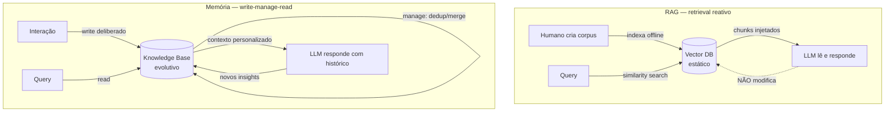
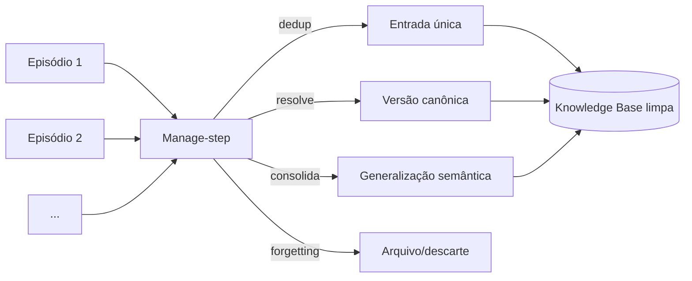
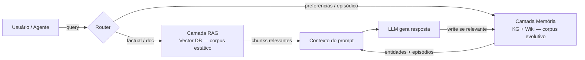

# RAG vs memória de longo prazo

> [!abstract] TL;DR
> RAG é **retrieval reativo** sobre um corpus estático: alguém pergunta, o sistema busca chunks relevantes e injeta no prompt. Memória de longo prazo é **construção ativa** de uma representação que evolui com o uso, escrita pelo próprio LLM ao longo das interações. RAG funciona como uma biblioteca consultada sob demanda; memória funciona como o caderno de um estudante que volta a ele para anotar e revisar. Os dois resolvem problemas diferentes, e a maior parte dos sistemas sérios em 2026 combina ambos.

> [!question]- Dúvidas e lacunas desta nota
> - Dúvida gerada pelo conteúdo: se o manage-step (consolidação, resolução de contradições) for feito por um LLM separado em batch, isso ainda é "memória de longo prazo" ou uma forma avançada de RAG com reindexação ativa?
> - Lacuna potencial: a nota não aborda custos comparativos — RAG tem custo de embedding e retrieval por query; memória tem custo de write e manage. Qual escala financeira justifica cada abordagem?

> [!info] RAG em 90 segundos
> RAG (Retrieval-Augmented Generation) é uma técnica em 3 componentes:
> 1. **Index:** documentos são quebrados em chunks, transformados em embeddings (vetores) e armazenados em um vector DB.
> 2. **Retrieve:** dada uma pergunta, busca-se os N chunks mais similares.
> 3. **Augment:** os chunks recuperados são injetados no prompt do LLM como contexto.
>
> O resultado: o LLM "parece" saber sobre os dados, mas na verdade está apenas lendo os trechos injetados em runtime. Nada é "aprendido" — cada chamada parte do zero, busca no índice e descarta o contexto ao final.
>
> Para profundidade real (chunking, [[Dicionário de IA#hybrid search|hybrid search]], [[Dicionário de IA#reranking|reranking]], evaluation), leia [[RAG e Vector Databases]].

## O que é

A confusão entre RAG e memória aparece porque os dois envolvem "buscar coisas para o LLM ler". A diferença está em **quem escreve**, **quando escreve** e **como o conteúdo evolui**.

**[[Dicionário de IA#RAG (Retrieval-Augmented Generation)|RAG (Retrieval-Augmented Generation)]]** foi formalizado por [Lewis et al. (2020)](https://arxiv.org/abs/2005.11401) como uma arquitetura que combina um modelo gerador com um retriever sobre um corpus indexado. Na prática moderna, RAG significa: documentos são preparados offline ([[Dicionário de IA#chunking|chunking]], [[Dicionário de IA#embedding|embedding]], indexação em [[Dicionário de IA#vector database|vector DB]]), e em runtime cada pergunta dispara uma busca por similaridade, com os chunks mais relevantes sendo injetados no prompt. O modelo **lê** esses chunks e gera a resposta, mas **não modifica** o corpus. O conteúdo da base é estável até que um humano decida re-indexar.

**[[Dicionário de IA#long-term memory|Memória de longo prazo]]** opera no sentido oposto: a representação é **escrita pelo próprio [[Dicionário de IA#LLM (Large Language Model)|LLM]]** (ou por um pipeline orquestrado em torno dele) a partir das interações. O ciclo canônico é **write-manage-read** — o agente decide o que vale a pena registrar, faz manutenção (deduplicação, resolução de contradições, consolidação) e lê quando precisa. Essa representação persiste entre sessões e evolui sem intervenção humana direta. Pode ser armazenada em wikis (ver [[06 - O LLM Wiki Pattern (gist do Karpathy)]]), grafos de conhecimento, vector DBs próprios ou combinações híbridas.

A distinção essencial: **RAG injeta conhecimento que já existia; memória constrói conhecimento novo.** Um sistema de RAG sobre a documentação de um produto não fica "mais inteligente" com o uso — ele só fica desatualizado se ninguém re-indexar. Um sistema de memória, por construção, fica diferente a cada interação significativa.



## Por que importa

Esta distinção importa por quatro motivos práticos — e os dois últimos são os mais caros de ignorar.

**A confusão é endêmica.** É comum ler "adicionei RAG, agora meu agent tem memória" — e isso é falso. Pegar logs de conversa, jogar em um vector DB e fazer similarity search **não é memória**: é log indexado. Falta o passo de manage (consolidação, contradição, esquecimento) e o de write deliberado (decidir o que vale registrar e em qual nível de abstração). A confusão não é inocente: leva times a construir sistemas que parecem ter memória em demos mas falham em produção quando o volume de sessões cresce.

**Decisões de arquitetura dependem da distinção.** RAG e memória têm padrões diferentes de escrita, leitura e atualização. Tratá-los como a mesma coisa leva a sistemas que falham silenciosamente: respostas inconsistentes entre sessões (o que o chunk retrievado hoje pode ser diferente do de ontem), contexto crescendo sem controle (cada sessão acumula mais logs sem consolidação), custo aumentando linearmente sem ganho proporcional de qualidade. O sistema parece funcionar — até que não funciona, e o diagnóstico não é óbvio.

**O modo de falha é diferente — e isso importa para debugging.** RAG falha quando o chunk certo não é retrievado: a resposta é neutra ou incorreta, mas detectável. Memória falha quando a knowledge base diverge da realidade: o sistema responde com confiança sobre algo que mudou, ou ignora algo que aconteceu porque não foi consolidado. Falhas de memória são mais silenciosas e mais difíceis de rastrear. Saber qual sistema está sendo usado determina o que monitorar.

**Frameworks sérios de 2026 combinam os dois — e você precisa entender cada camada.** [Mem0](https://arxiv.org/abs/2504.19413) usa pipeline de extração para destilar memórias de conversas, armazena em vetorial (para retrieval factual) e em grafo (para relações), e expõe APIs separadas para cada tipo. basic-memory combina wiki markdown com search BM25. Zep/Graphiti usam grafo temporal para memória com linha do tempo. Nesses sistemas, as camadas não são intercambiáveis — cada uma tem responsabilidades distintas, e entender qual é qual é pré-requisito para debugar, escalar ou contribuir com o sistema.

## Uma analogia para fixar

Pense em RAG como uma **biblioteca pública**: você entra, faz uma busca no catálogo, lê os livros que o bibliotecário traz, sai — e a biblioteca permanece exatamente igual a quando você entrou. Qualquer outra pessoa que faça a mesma busca amanhã recebe os mesmos livros. Não há registro de que você esteve lá, de que você leu o capítulo 3 com atenção especial, de que você já sabia o conteúdo do capítulo 1.

Memória de longo prazo é como um **caderno de notas pessoal** que você leva à biblioteca e atualiza a cada visita: você anota o que leu, conecta com leituras anteriores, risca o que ficou desatualizado, escreve perguntas abertas nas margens. Com o tempo, o caderno vira uma extensão do seu conhecimento — organizado do jeito que faz sentido para *você*, refletindo *sua* trajetória de aprendizado. A biblioteca (RAG) é necessária para acessar as fontes originais; o caderno (memória) é necessário para construir compreensão acumulada.

Sistemas sérios têm os dois: a biblioteca para buscar o texto autoritativo; o caderno para manter o que você construiu a partir dele.

## Como funciona — tabela comparativa

| Dimensão | RAG | Memória de longo prazo |
|---|---|---|
| **Substrato** | Vector DB de docs | Wiki/KG/notes mantidos pelo LLM |
| **Quem escreve?** | Humano (corpus) | LLM (a partir de interações) |
| **Atualização** | Re-index manual | Contínua, autônoma |
| **Tipo de info** | Factual sobre conteúdo | Episódica + semântica + procedural |
| **Pattern** | Read-only retrieval | Write-manage-read loop |
| **Failure mode** | Chunk não retrievado | Contradição, drift |
| **Caso ideal** | QA sobre docs estáveis | Agent companion, projeto longo |
| **Auditabilidade** | Alta (corpus versionável) | Menor (evolui dinamicamente) |
| **Custo principal** | Indexação + embedding | Write + manage (LLM tokens) |

A linha mais densa é a do **pattern**. RAG é fundamentalmente **read-only**: a base é construída fora do loop e o modelo só consulta. Mesmo variações sofisticadas (hybrid search, reranking, query rewriting) preservam essa propriedade — o corpus não muda durante a inferência. Isso é uma vantagem operacional: a base é auditável, versionável, reproduzível. Se algo der errado, você pode inspecionar exatamente quais chunks foram retrievados e por quê.

Memória, por outro lado, vive no loop **write-manage-read**. *Write* é o passo onde o agente decide registrar algo novo (uma preferência do usuário, uma decisão tomada, um fato aprendido). Não se registra tudo — a granularidade e o nível de abstração da escrita determinam a qualidade da base. *Manage* é onde mora a complexidade real: deduplicação, resolução de contradições ("o usuário disse X em janeiro e Y em março — qual prevalece?"), consolidação (transformar 20 episódios em uma generalização semântica), forgetting (descartar o que não importa mais). *Read* parece RAG mas opera sobre uma base que o próprio sistema construiu — então a qualidade da leitura depende criticamente da qualidade do write e do manage. Lixo entra, lixo sai: se o write foi descuidado, o read vai ser ruidoso. Para a taxonomia dos tipos de informação que memória precisa cobrir (episódica, semântica, procedural), ver [[03 - Taxonomia da memória (episódica, semântica, procedural)]].

A coluna **Auditabilidade** merece atenção. RAG é auditável por construção: dado o corpus e a query, você pode reproduzir exatamente quais chunks foram usados. Memória ativa é mais difícil de auditar — a knowledge base muda com o tempo, e o estado atual pode não ser reproduzível a partir de logs de interação sem todo o histórico de writes e manage. Em contextos regulatórios (saúde, finanças, jurídico), isso é argumento relevante para preferir RAG: a trilha de evidência é clara e verificável. Em contextos de experiência personalizada (companion, tutor, assistente pessoal), a auditabilidade importa menos que a continuidade — e memória ativa é o trade-off correto.

## Exemplo concreto — o mesmo problema nas duas abordagens

Imagine um assistente de pesquisa de mercado para uma empresa de SaaS. Dois cenários:

**Cenário RAG:** a empresa indexa seus 200 relatórios internos e papers do setor. Um analista pergunta "qual é o churn médio de startups SaaS no Brasil?". O sistema busca 5 chunks relevantes, o LLM monta a resposta. Semana que vem, o mesmo analista pergunta de novo — mesma busca, mesma resposta. Mas se o analista disse na semana passada que "prefiro dados de empresas Series B em diante", o sistema não sabe disso: cada query é independente.

**Cenário memória:** depois da primeira conversa, o sistema escreve na knowledge base: `preferência: [analista João] prioriza dados de empresas Series B+`. Na semana seguinte, ao responder sobre churn, o sistema filtra e apresenta dados já com essa preferência aplicada — sem o analista ter que repetir. Conforme novas pesquisas acontecem, o perfil do analista evolui: tópicos de interesse, fontes preferidas, lacunas identificadas.

O ponto: RAG é excelente para o corpus factual (os 200 relatórios). Memória é necessária para o contexto acumulado do analista. Sistemas sérios usam os dois — o que muda é o substrato para cada tipo de informação.

## O write-step — decidir o que vale lembrar

Antes de gerenciar memória, é preciso decidir o que registrar. Essa decisão é mais difícil do que parece, e erra para os dois lados:

**Registrar demais** gera ruído. Se cada frase do usuário vira uma entrada na knowledge base, o sistema acumula informação trivial, contraditória e descontextualizada. Retrieval começa a trazer memórias irrelevantes. O manage-step fica sobrecarregado. O custo de manutenção cresce sem ganho de qualidade.

**Registrar de menos** gera amnésia. Se o sistema só registra fatos explícitos ("meu nome é João"), perde preferências implícitas ("o usuário sempre pede exemplos antes de teoria — nunca pediu explicitamente, mas é consistente em 8 sessões"), padrões emergentes e contexto de projeto crítico para continuidade.

O write-step bem calibrado registra em três níveis de abstração:

1. **Fatos explícitos** — informação declarada diretamente pelo usuário: nome, empresa, stack tecnológico, cargo, objetivos declarados.
2. **Preferências inferidas** — padrões observados ao longo de múltiplas sessões: estilo de comunicação, nível técnico preferido, áreas de interesse recorrentes, tipos de resposta que geram follow-up positivo.
3. **Contexto de projeto** — estado atual de trabalhos em andamento: o que foi decidido, o que está pendente, dependências identificadas, deadlines mencionados. Esse nível é o mais frágil sem gestão ativa — fica desatualizado rapidamente se não houver ciclo de manutenção.

A heurística prática: registre o que mudaria a resposta do sistema na próxima sessão se fosse conhecido. Se a ausência da informação não mudaria nada, não vale o custo de armazenar e gerenciar.

Em termos de implementação, o write-step costuma ser um LLM call separado ao final de cada turno de conversa, com um prompt específico: "Dada esta conversa, o que é novo e relevante para o perfil do usuário? Liste apenas fatos que não estavam na knowledge base ou que contradizem algo existente." O resultado é processado pelo manage-step antes de ser persistido. Esse padrão — extração LLM + manage estruturado — é o que o Mem0 formaliza como pipeline e expõe como API.

```
# pseudocódigo — write-step ao final de um turno
new_facts = llm.extract(
    conversation=current_turn,
    existing_kb=user_memory_snapshot,
    prompt="What's new and relevant for this user's profile?"
)
for fact in new_facts:
    memory.manage(fact)  # dedup, resolve contradictions, consolidate
```

## O manage-step — onde a complexidade real vive

O manage-step é o que diferencia memória de longo prazo de log indexado. É a etapa que a maioria dos projetos ou ignora ou subestima drasticamente. Tem quatro sub-operações:

**Deduplicação.** O usuário menciona "prefiro Python" na sessão 1 e na sessão 7. Sem deduplicação, a knowledge base acumula N instâncias do mesmo fato, gerando ruído no retrieval. O manage-step identifica redundâncias e colapsa em uma única entrada canônica, preservando metadata de proveniência (quando foi dito, com que frequência foi reforçado).

**Resolução de contradições.** O usuário diz "meu stack é React" em fevereiro e "migramos para Vue" em maio. Qual é o estado atual? RAG puro retorna os dois chunks sem critério. O manage-step tem política explícita: temporalidade (mais recente ganha), autoridade (afirmação explícita supera inferência), ou escalada (quando não há critério claro, marcar como "divergente" e perguntar ao usuário). Sem essa política, o sistema se comporta de forma inconsistente entre chamadas.

**Consolidação.** Vinte episódios individuais ("o usuário pediu mais exemplos práticos nas sessões 3, 5, 8, 12...") podem ser comprimidos em uma generalização semântica ("estilo de aprendizado: prefere exemplos antes de teoria"). A consolidação reduz ruído, comprime o knowledge base e eleva o nível de abstração do que é armazenado. É análoga ao que o hipocampo faz durante o sono: transformar memórias episódicas em semânticas.

**Forgetting deliberado.** Nem tudo deve ser lembrado para sempre. Contexto de projeto encerrado, preferências que mudaram, informação que expirou — tudo isso ocupa espaço e polui retrieval. O manage-step tem política de TTL (time-to-live) ou de relevance decay: entradas antigas que não são acessadas e não foram reforçadas gradualmente perdem peso até serem arquivadas ou descartadas.



Sem manage-step, qualquer sistema de "memória" é na verdade um arquivo em crescimento constante. A qualidade de retrieval degrada com o tempo, e o custo de contexto aumenta proporcionalmente.

## Sistemas híbridos — quando usar os dois juntos

A pergunta prática não é "RAG ou memória?" mas sim "qual substrato para qual tipo de informação?". Em sistemas de produção sofisticados, as duas abordagens coexistem com responsabilidades distintas:

**Camada RAG (corpus estático):**
- Documentação de produto — manual de API, referência técnica
- Base de conhecimento corporativa — políticas, processos, SLAs
- Regulação e jurisprudência — conteúdo que não deve ser sintetizado
- Knowledge externo — papers, artigos, relatórios de mercado

**Camada de memória ativa (corpus evolutivo):**
- Perfil e preferências do usuário — estilos, prioridades, histórico de decisões
- Contexto de projetos longos — o que foi decidido, por quê, o que está pendente
- Aprendizado emergente do agente — padrões observados, heurísticas refinadas com uso
- Memória episódica inter-sessão — o que aconteceu nas últimas N interações relevantes

O Mem0 (2025) é o exemplo paradigmático desta arquitetura híbrida: usa um vector DB para retrieval factual rápido (semelhante a RAG), um grafo de conhecimento para relações e contexto episódico, e um pipeline de extração que faz o manage-step automaticamente a partir das conversas. As camadas não são intercambiáveis — elas têm padrões de acesso, custo e latência diferentes.



A regra de roteamento é simples na teoria e delicada na prática: perguntas sobre "como o produto funciona" vão para RAG; perguntas ou inferências sobre "o que este usuário prefere" vão para memória. O desafio é que a fronteira é fuzzy — uma pergunta sobre uma feature pode conter uma preferência implícita ("como eu configuro o timeout? — já tentei 30s e foi pouco") que merece ser registrada como memória episódica.

**Lição central:** comece com RAG. Monitore os pontos onde o sistema falha em continuidade, conhecimento evolutivo, ou síntese. Adicione memória ativa nesses pontos, com manage-step desde o início — não como afterthought. A ordem importa: bolted-on manage-step nunca alcança a coerência de um pipeline desenhado para isso desde a fundação.

## Quando usar / quando não

A pergunta decisiva não é técnica — é comportamental: **o conteúdo deve mudar como consequência da interação com o usuário?** Se sim, memória. Se não, RAG.

**RAG basta quando:**

- O caso de uso é Q&A sobre documentação fixa: manual de produto, FAQ, base de conhecimento corporativa, contratos, regulação. O conteúdo é autoritativo, estável, e a tarefa é *encontrar* a informação certa, não *construir* uma representação personalizada.
- A interação é one-shot ou stateless — cada conversa começa do zero e não há acumulação relevante entre chamadas. Bots de suporte de tier 1, pesquisa pública, busca em catálogo.
- O conteúdo é autoritativo e não deve ser sintetizado, modificado ou interpretado pelo modelo. Um manual médico, uma regulação financeira, um contrato — precisam ser citados literalmente, não reescritos pelo LLM. A síntese pode mascarar nuances legalmente relevantes.
- A janela de tempo entre re-indexações é compatível com a velocidade de mudança dos dados. Se o conteúdo muda mensalmente e o time re-indexa semanalmente, RAG funciona sem problema.
- O orçamento de manutenção é limitado. RAG não exige manage-step; memória ativa sim. Se não há capacidade operacional para manter o ciclo de consolidação, RAG com re-indexação periódica é mais sustentável.

**Memória de longo prazo é necessária quando:**

- Há **multi-session continuity** — o usuário espera que o agent se lembre do que aconteceu antes. Assistente pessoal, companion, terapeuta digital, tutor adaptativo. Sem memória, cada sessão é uma amnésia: o usuário recomeça do zero, o agent não aprende. Para o problema raiz que torna isso difícil com contexto longo, ver [[02 - O problema das janelas de contexto]].
- O **conhecimento evolui no uso**: projetos de longa duração (semanas ou meses), relacionamentos profissionais contínuos, estudos progressivos. O valor do sistema cresce com o tempo — e crescimento sem memória é impossível.
- O agent precisa **aprender com uso**: adaptar estilo de resposta, refinar entendimento de preferências, detectar padrões de comportamento, ajustar heurísticas. Isso é aprendizado in-context, não fine-tuning — mas exige que os insights sejam persistidos.
- Há **síntese e consolidação** relevantes — o valor está em transformar 20 episódios em uma generalização, não em recuperar o episódio cru. Um tutor que lembra "o aluno sempre tropeça em derivadas parciais quando aplicadas a problemas físicos" é mais útil que um tutor que recupera o trecho da sessão 3 onde o aluno errou.
- O sistema precisa de **meta-conhecimento**: "o que eu sei sobre o usuário X?", "quais lacunas existem no projeto Y?", "o que mudou desde a última sessão?". Essas perguntas exigem reflexão sobre a base, não retrieval de chunks.

Nada impede combinar os dois. Um agent de suporte técnico pode usar RAG sobre a documentação oficial (estável, autoritativa) e memória de longo prazo para preferências e histórico do cliente (evolutivo, episódico). A linha que separa os dois substratos costuma ser a pergunta: "isto deveria mudar com o uso?".

## Armadilhas comuns

> [!warning] Armadilha 1: confundir log indexado com memória
> Pegar histórico de conversa, jogar em um vector DB e fazer similarity search **não é memória** — é log indexado com busca. Falta o manage-step: consolidação, resolução de contradições, decisão sobre o que vale a pena lembrar. Sistemas que prometem "memória via RAG" sem write deliberado entregam arqueologia, não continuidade. O teste diagnóstico é simples: se o usuário mudar de opinião na sessão 10 sobre algo que disse na sessão 2, o sistema lida com isso corretamente? Se não há manage-step, a resposta é não.

> [!warning] Armadilha 2: acumular histórico bruto no vector DB indefinidamente
> Conforme as conversas crescem, o vector DB incha, embeddings ficam ruidosos e o retrieval começa a trazer trechos irrelevantes ou contraditórios — tudo isso a custo crescente e qualidade decrescente. Histórico bruto não é uma boa unidade de retrieval: é matéria-prima para extração. O corpus de memória precisa passar por consolidação periódica, não acumulação linear. Um sistema com 10.000 turnos de conversa indexados como chunks individuais vai ter retrieval pior que um sistema com 200 memórias consolidadas — com custo muito maior.

> [!warning] Armadilha 3: tratar RAG e memória como escolha binária
> "Ou RAG ou memória" é falsa dicotomia. Sistemas como Mem0 combinam vetorial + grafo + extração. basic-memory junta wiki estruturada com search RAG-like. Zep/Graphiti mantêm grafo temporal para capturar evolução de entidades ao longo do tempo. A pergunta real é: para **cada tipo de informação**, qual substrato e qual ciclo de escrita? Documentação do produto → RAG. Preferências do usuário → memória ativa. Histórico de decisões do projeto → memória com timeline explícita. Regulação e contratos → RAG com citação literal, sem síntese.

> [!warning] Armadilha 4: implementar write sem manage desde o início
> Adicionar write-step é a parte fácil: "salve isso na knowledge base". O manage-step é o que sustenta qualidade a longo prazo. Times que implementam write sem manage acumulam conhecimento contraditório, ruidoso e não deduplicado — e depois tentam consertá-lo com cron jobs noturnos que nunca alcançam a coerência de um sistema desenhado corretamente. Manage-step não é afterthought; é a parte onde a arquitetura precisa ser desenhada desde o começo.

## Como explicar em inglês

Em entrevistas técnicas para posições sênior, a pergunta "how does your system handle memory?" é comum em contextos de design de sistemas com LLM. A distinção entre RAG e long-term memory é o que separa uma resposta superficial de uma resposta que demonstra entendimento arquitetural real.

> [!tip] Interview quote
> "RAG is read-only retrieval over a static corpus — the model never modifies the knowledge base. Long-term memory is a write-manage-read loop where the LLM actively builds and maintains its own knowledge representation across sessions. In production systems, you typically need both: RAG for authoritative, stable content; long-term memory for user context and evolving knowledge."

| Português | Inglês |
|-----------|--------|
| Memória de longo prazo | Long-term memory |
| Recuperação e geração aumentada | Retrieval-Augmented Generation (RAG) |
| Ciclo de escrita-gestão-leitura | Write-manage-read loop |
| Base de conhecimento | Knowledge base |
| Consolidação de memórias | Memory consolidation |
| Deduplicação | Deduplication |
| Resolução de contradições | Contradiction resolution |
| Busca por similaridade | Similarity search |
| Corpus estático | Static corpus |
| Indexação offline | Offline indexing |
| Passo de escrita | Write step |
| Passo de gestão | Manage step |
| Esquecimento deliberado | Deliberate forgetting / memory decay |
| Continuidade entre sessões | Cross-session continuity |
| Memória episódica | Episodic memory |
| Memória semântica | Semantic memory |

## O que vem a seguir

A distinção entre RAG e memória define o problema — mas reconhecer que RAG não basta não é o mesmo que saber *quando* ele para de bastar. A próxima nota aprofunda exatamente isso: os cinco cenários estruturais em que retrieval passivo falha e escrita ativa se torna necessária. Esses cenários não são edge cases — são os casos que aparecem assim que um sistema RAG vai para produção com usuários reais ao longo do tempo. Conhecer esses cinco pontos de falha é o que permite tomar a decisão arquitetural com base em evidência, não em intuição — e é o que justifica introduzir a complexidade de um write-manage-read loop em vez de empilhar mais camadas de RAG sobre o mesmo problema.

> [!summary] Resumo de uma linha
> RAG busca o que existe; memória constrói o que passa a existir. Os dois têm casos de uso distintos, modos de falha distintos e custos operacionais distintos — e sistemas sérios usam os dois, cada um para o tipo de informação que lhe é mais adequado.

## Veja também

> [!note] Sequência de leitura recomendada
> Esta nota estabelece a distinção fundamental. Leia [[05 - Beyond RAG - quando RAG não basta]] a seguir para os cinco cenários concretos onde RAG falha. Depois, [[06 - O LLM Wiki Pattern (gist do Karpathy)]] mostra uma implementação prática de memória ativa que não depende de vector DB.
>
> Se ainda estiver no início do galho, leia [[02 - O problema das janelas de contexto]] antes desta nota — ela explica por que contexto longo não resolve o problema e por que memória persistente é necessária.

- [[01 - O que é memória em IA]] — conceito antecedente, define memória no contexto de agentes
- [[02 - O problema das janelas de contexto]] — o problema raiz que motiva tanto RAG quanto memória
- [[03 - Taxonomia da memória (episódica, semântica, procedural)]] — os tipos de informação que memória precisa cobrir
- [[05 - Beyond RAG - quando RAG não basta]] — análise das limitações de RAG e quando memória se torna necessária
- [[06 - O LLM Wiki Pattern (gist do Karpathy)]] — abordagem ativa de [[Andrej Karpathy|Karpathy]] para memória estruturada
- [[15 - Mem0 — vetorial + grafo]] — sistema de produção que combina retrieval factual e memória episódica
- [[RAG e Vector Databases]] — para profundidade técnica em RAG

## Referências

- Lewis, P. et al. (2020). *Retrieval-Augmented Generation for Knowledge-Intensive NLP Tasks.* — paper original que formaliza a arquitetura RAG. [arxiv.org/abs/2005.11401](https://arxiv.org/abs/2005.11401)
- Chhikara, P. et al. (2025). *Mem0: Building Production-Ready AI Agents with Scalable Long-Term Memory.* — sistema que combina extração, vetorial e grafo, usado como exemplo paradigmático em 2026. [arxiv.org/abs/2504.19413](https://arxiv.org/abs/2504.19413)
- Karpathy, A. *On LLM memory and the wiki pattern* (gist). — ver discussão e contexto em [[06 - O LLM Wiki Pattern (gist do Karpathy)]]. [gist.github.com/karpathy/442a6bf555914893e9891c11519de94f](https://gist.github.com/karpathy/442a6bf555914893e9891c11519de94f)
- [[RAG e Vector Databases]] — nota de profundidade interna do Codex sobre chunking, hybrid search, reranking e evaluation.
- [[03 - Taxonomia da memória (episódica, semântica, procedural)]] — os tipos de informação que um sistema de memória precisa cobrir, com implicações para o design do write e manage step.
