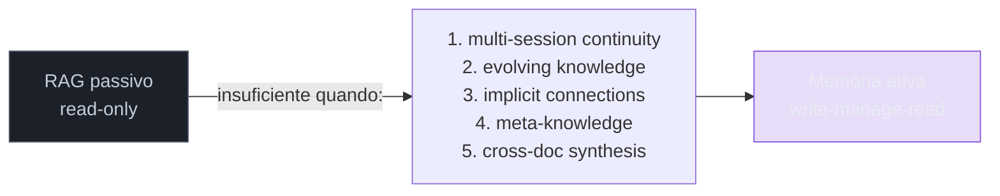
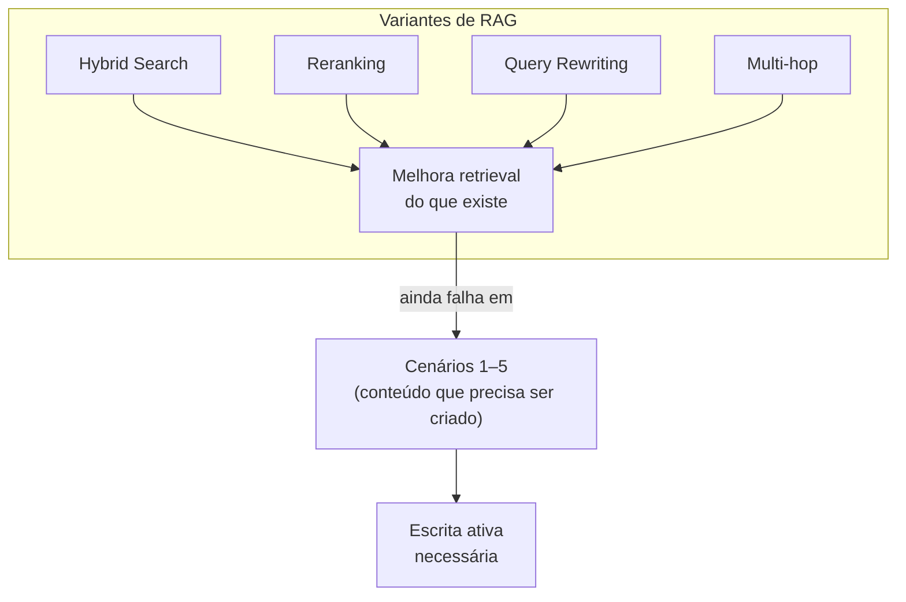
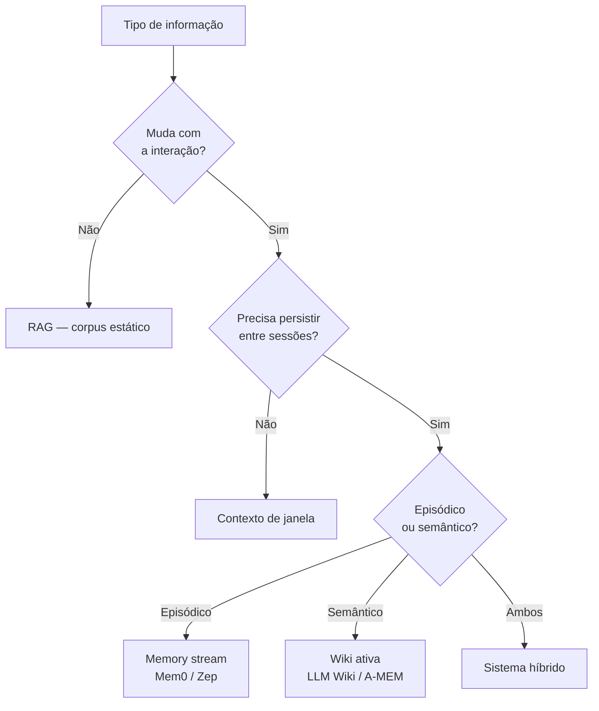

# Beyond RAG

> [!abstract] TL;DR
> RAG é poderoso para Q&A sobre documentação fixa, mas falha em cinco casos: **continuidade multi-sessão**, **conhecimento que evolui**, **conexões implícitas que precisam ser construídas**, **meta-conhecimento** (saber o que se sabe) e **síntese cross-document**. É aí que entra memória de longo prazo — e é por isso que patterns como o LLM Wiki do Karpathy (abril/2026) viraram referência. "Beyond RAG" não é "abandonar RAG"; é reconhecer onde retrieval passivo termina e onde escrita ativa começa.

> [!question]- Dúvidas e lacunas desta nota
> - Dúvida gerada pelo conteúdo: em sistemas de RAG com reranking e query rewriting sofisticados, até que ponto os cenários 3 (conexões implícitas) e 5 (síntese cross-document) podem ser parcialmente mitigados sem escrita ativa? Há uma linha de demarcação clara ou é um gradiente?
> - Lacuna potencial: a nota identifica os cinco cenários mas não discute como detectar em produção *quando* um deles começou a acontecer — quais métricas ou sinais indicam que o sistema atingiu o limite do RAG e precisa de memória ativa. A seção de detecção aborda isso parcialmente, mas métricas concretas (ex: taxa de recontextualização, variância de resposta) precisariam de benchmarks para serem acionáveis.
> - Conexão sugerida: o framework de decisão desta nota (3 perguntas) e a taxonomia de memória de [[03 - Taxonomia da memória (episódica, semântica, procedural)]] deveriam ser lidos juntos — a taxonomia informa quais tipos de informação fazem parte de qual cenário desta nota. A conexão entre as duas notas poderia ser mais explícita.

## O que é

"Beyond RAG" não é uma tecnologia — é um diagnóstico. É o reconhecimento de que RAG, por design, tem limites estruturais que não podem ser resolvidos por mais sofisticação de retrieval: eles exigem uma operação fundamentalmente diferente, que é **escrever** conhecimento novo a partir da interação, não apenas ler o que já existia. O framing ganhou tração porque nomeou algo que times que trabalham com LLM em produção já sentiam na pele, mas não tinham vocabulário preciso para descrever.

"Beyond RAG" é o framing que ganhou tração em 2026 para descrever os limites estruturais de [[Dicionário de IA#RAG (Retrieval-Augmented Generation)|Retrieval-Augmented Generation]]. RAG, formalizado por [Lewis et al. (2020)](https://arxiv.org/abs/2005.11401), é uma técnica madura: a maioria das aplicações sérias com [[Dicionário de IA#LLM (Large Language Model)|LLM]] em produção tem alguma forma de RAG no meio do caminho — index, retrieve, augment. Funciona bem para Q&A sobre manuais, busca em base de conhecimento, citação em bots de suporte, sistemas regulatórios. Nesses casos, RAG é a ferramenta certa, e empilhar memória ativa em cima é over-engineering.

A virada de discurso veio quando [[Andrej Karpathy]] publicou o "LLM Wiki Pattern" em 3 de abril de 2026 — uma arquitetura em que o próprio LLM **escreve e mantém** uma wiki em markdown, dispensando vector DB. A cobertura da [VentureBeat](https://venturebeat.com/data/karpathy-shares-llm-knowledge-base-architecture-that-bypasses-rag-with-an) usou explicitamente "bypasses RAG", e o [post de Plaban Nayak no Level Up Coding](https://levelup.gitconnected.com/beyond-rag-how-andrej-karpathys-llm-wiki-pattern-builds-knowledge-that-actually-compounds-31a08528665e) consolidou o vocabulário "Beyond RAG" para descrever a categoria de problemas em que retrieval passivo não dá conta. Daí a importância de mapear, com precisão, **onde** RAG deixa de bastar — sem cair no oposto, que é tratar tudo como problema de memória ativa.

## Por que importa

Primeiro, **evita over-engineering**. É comum ver times empilhando camadas de RAG ([[Dicionário de IA#hybrid search|hybrid search]], [[Dicionário de IA#reranking|reranking]], query rewriting, multi-hop [[Dicionário de IA#retrieval|retrieval]]) quando o problema real não é de retrieval — é de escrita. Nenhuma dessas camadas resolve continuidade entre sessões, porque continuidade não é "achar o trecho certo"; é "ter um trecho que existe a partir do uso anterior". O sintoma de over-engineering em RAG é latência crescente com ganho decrescente de qualidade: cada camada adicional aumenta o tempo de resposta e a complexidade operacional, mas o usuário ainda precisa recontextualizar a cada sessão.

Segundo, **ajuda a reconhecer quando o caso pede wiki ativa em vez de biblioteca passiva**. A pergunta diagnóstica é simples: o conteúdo da base **deve mudar como consequência da interação**? Se sim, RAG sozinho não basta — falta o passo de write deliberado. Se não, RAG provavelmente é suficiente, e camadas adicionais só aumentam custo. O problema é que essa pergunta raramente é feita explicitamente no início de um projeto — e o resultado é sistemas que herdam a arquitetura errada desde a fundação.

Terceiro, o vocabulário "Beyond RAG" tem **valor de comunicação**. Em RFCs internos, discussões com stakeholders e posts técnicos, ter um termo compartilhado reduz fricção. Em escrita pública sobre arquitetura de agentes em 2026, alinhar-se com o discurso corrente do campo é estratégia editorial razoável. Quando um engenheiro diz "estamos indo beyond RAG porque temos o cenário de síntese cross-document", a conversa já começa num nível de precisão que economiza horas de alinhamento.

Quarto, **a detecção tardia é cara**. Sistemas que começam como RAG puro e só descobrem a necessidade de memória ativa em produção enfrentam migração difícil: o pipeline de escrita precisa ser retrofitado, o histórico existente precisa ser processado retroativamente, e a arquitetura de dados muda. Mapear esses cinco cenários antes de começar a construir é o que permite fazer a escolha certa na fundação. A analogia com débito técnico é precisa: ignorar memória ativa quando ela é necessária gera débito arquitetural que cresce com o volume de uso e é exponencialmente mais caro de pagar quanto mais tarde a decisão é tomada.

## Como funciona — 5 cenários onde RAG não basta

Os cinco cenários não são hipotéticos: cada um tem um modo de falha específico, detectável em produção, que não é resolvido por mais sofisticação de retrieval. A heurística unificadora: **se o conteúdo necessário para responder bem à query não existe na base e precisaria ser criado a partir da interação, RAG não tem como resolver**.

### 1. Multi-session continuity

O usuário volta no dia seguinte e espera que o agente "lembre" do que foi discutido. RAG não lembra: cada chamada é stateless. Se o histórico de conversa estiver indexado em um [[Dicionário de IA#vector database|vector DB]], o sistema até recupera trechos antigos por similaridade — mas isso não é continuidade, é arqueologia. Continuidade implica que algumas conclusões foram **consolidadas** (preferências, decisões fechadas, contexto de projeto), e que o agente as trata como dadas, não como resultado de retrieval em runtime.

Exemplo concreto: um tutor digital descobre na sessão 1 que o aluno tem dificuldade com derivadas parciais. Na sessão 2, o tutor deveria **abrir** o assunto com essa informação no estado mental, não esperar que uma similarity search traga de volta um chunk de log. Para um assistente que se torna mais útil com uso, RAG sobre logs é fundamentalmente cego — falta o passo de extração e consolidação que define o que vale a pena lembrar. Ver [[02 - O problema das janelas de contexto]] para o porquê de contexto longo não resolver isso sozinho.

O sintoma em produção é o "reinício constante": usuários que precisam repetir contexto a cada sessão, que se frustram com o sistema "que não aprende", que abandonam porque o esforço de recontextualização supera o valor do assistente. Esse sintoma específico — "o usuário tem que repetir tudo toda vez" — é o sinal mais claro de que RAG não é suficiente e memória inter-sessão é necessária.

### 2. Conhecimento que evolui

Um fato novo contradiz um fato antigo. RAG retrieva os dois sem critério — match por similaridade não tem opinião sobre temporalidade ou autoridade. Quem decide qual é atual? O modelo, na hora, sem informação suficiente. O resultado típico: respostas inconsistentes entre chamadas, a depender de quais chunks foram retrievados.

Exemplo concreto: um agente de pesquisa de mercado indexa relatórios trimestrais. No Q1, a empresa X reportou margem de 18%. No Q4, reportou 12%. Sem manutenção ativa, RAG pode retrieve qualquer um dos dois trechos, e a resposta sobre "qual é a margem da X?" varia. A correção exige que **alguém** mantenha o conhecimento — marque a versão antiga como histórica, atualize a página de entidade, registre a mudança. Essa **manutenção** é o ponto da memória ativa, e é o trabalho que falta em RAG puro. Sistemas como [[16 - Zep e Graphiti — knowledge graph temporal|Zep/Graphiti]] atacam essa dimensão temporal explicitamente.

### 3. Conexões implícitas

"X e Y se relacionam por Z" é um insight que muitas vezes **não está em nenhuma fonte individual** — emerge da combinação. RAG só lê o que existe; não escreve insights novos. Pode até recuperar um trecho sobre X e outro sobre Y, e o LLM, no prompt, faz a conexão na resposta — mas essa conexão se evapora ao final da chamada. Não fica registrada, não vira página, não está disponível na próxima query.

Karpathy chama o LLM Wiki Pattern de "wiki que **compõe**", em oposição a "wiki que arquiva". A diferença é literal: na wiki que compõe, quando uma nova fonte é ingerida, **páginas de síntese existentes são atualizadas** para refletir a conexão nova. Numa biblioteca passiva (RAG), a fonte nova entra como mais um documento; na wiki ativa, ela altera o estado do conhecimento composto. Ver [[06 - O LLM Wiki Pattern (gist do Karpathy)]] para a abordagem completa.

Exemplo concreto: um analista pesquisa por meses "memória episódica em LLMs" e "Zettelkasten digital" como subdomínios separados. Em algum momento, percebe que A-MEM é a ponte entre os dois. Numa wiki ativa, essa percepção vira uma página de síntese que linka para os dois subdomínios e modifica os índices. Em RAG puro, a percepção morre quando o navegador fecha.

### 4. Meta-conhecimento

"O que eu sei sobre A?" é uma pergunta sobre o **estado da própria base** — exige reflection, não match. RAG não reflete: faz similaridade vetorial. Se a pergunta é "quais lacunas existem no que eu pesquisei sobre tópico X?", RAG não tem como responder, porque a resposta exige raciocínio sobre cobertura, não recuperação de chunks.

Meta-conhecimento tem três dimensões que RAG não endereça:

1. **Cobertura**: "quais subtópicos de X já estão cobertos na minha base?" — exige mapa do que existe, não busca por similaridade.
2. **Lacunas**: "o que eu ainda não sei sobre X?" — exige comparar o mapa de cobertura com o espaço conceitual do tema.
3. **Contradições**: "há afirmações conflitantes sobre X na minha base?" — exige comparar o conteúdo de diferentes fontes com política de resolução.

Sistemas que atacam meta-conhecimento explicitamente: [[19 - A-MEM — Zettelkasten dinâmico|A-MEM]] usa estrutura de Zettelkasten para tornar conexões e lacunas inspecionáveis; [[18 - Generative Agents (Park, Stanford 2023)|Park et al. (2023)]] introduziram memory streams com reflection trees, em que o agente periodicamente faz síntese de alto nível sobre o que viu — gerando memórias derivadas que falam **sobre** as memórias originais. Em ambos os casos, há uma estrutura deliberada para sustentar perguntas meta, algo que retrieval flat não suporta. O LLM Wiki Pattern de Karpathy endereça meta-conhecimento através do `index.md` (mapa de cobertura) e da operação de lint (detecção de contradições e lacunas).

Exemplo concreto: um pesquisador pergunta ao agente "que fontes contradizem a hipótese H1 na minha base?". Em RAG, o melhor que se obtém é um set de chunks que mencionam H1 — sem garantia de cobertura, sem detecção de contradição, sem mapa do território. Em memória ativa com lint regular, contradições já estão **marcadas** porque o ciclo de manutenção as detectou no momento da ingestão.

### 5. Síntese cross-document

Combinar informação de N fontes em um insight novo é o problema clássico de **síntese**, não de retrieval. RAG retorna chunks e o LLM compõe na resposta — mas essa composição é refeita a cada chamada, com o conjunto de chunks que aquela query específica retrievou. Não há acumulação, não há refinamento, não há registro do trabalho de síntese.

Exemplo concreto: revisão de literatura cobrindo 80 papers. Em RAG, cada pergunta retrieva 5–10 chunks e o modelo monta uma resposta em runtime — a resposta pode ser boa, mas não fica registrada, e a próxima pergunta similar refaz o trabalho do zero. Em LLM Wiki, o produto é uma página de síntese mantida — "Estado da arte em memória de agentes (abril/2026)" — atualizada a cada paper novo ingerido, e que serve como ponto de partida para todas as queries sobre o tema. A síntese vira **artefato persistente**, não saída efêmera. Quando o leitor precisa de uma resposta com nuance composta de várias fontes — e quando essa resposta tende a ser pedida de novo ou a evoluir — RAG é só o começo do trabalho.

## Uma analogia para fixar os cinco cenários

Imagine um detetive que trabalha em casos por meses. RAG seria um sistema onde o detetive tem acesso a um arquivo de casos e documentos, pode buscar qualquer documento em segundos, mas **não pode anotar nada novo no arquivo** — cada investigação começa sem registro do que foi descoberto ontem.

- **Cenário 1 (multi-session):** o detetive descobre na segunda-feira que o suspeito tem álibi para terça-feira. Na quarta, ao retomar o caso, precisa redescobrir isso — nada foi anotado. O arquivo continua igual.
- **Cenário 2 (conhecimento que evolui):** a testemunha mudou de versão. O arquivo tem as duas versões sem indicar qual é atual. O detetive não sabe em qual confiar.
- **Cenário 3 (conexões implícitas):** o detetive percebe que o suspeito A e o suspeito B estão ligados pelo mesmo advogado — insight emergente de múltiplas fontes. Mas não pode registrá-lo. Na próxima sessão, precisa redescobrí-lo.
- **Cenário 4 (meta-conhecimento):** o supervisor pergunta "o que você ainda não sabe sobre o caso?". O detetive não tem como responder — o arquivo não tem estrutura para mapear lacunas.
- **Cenário 5 (síntese cross-document):** a conclusão de semanas de investigação ("os três suspeitos agiram coordenados") não está em nenhum documento — é uma síntese. Mas não pode ser escrita em nenhum lugar. Na próxima sessão, a investigação recomeça sem ela.

Memória ativa dá ao detetive um caderno: ele pode anotar descobertas, registrar conexões, marcar lacunas, escrever sínteses. O arquivo (RAG) ainda é necessário para os documentos originais. O caderno (memória) é o que transforma um investigador stateless em um detetive que aprende com o caso.

## Por que hybrid RAG não resolve

Uma dúvida razoável ao ler os cinco cenários: "mas e com hybrid search + reranking + query rewriting? Isso não cobre pelo menos os cenários 3 e 5?"

A resposta curta: não. A razão é estrutural, não de qualidade de retrieval.

**Hybrid search** (BM25 + vetorial) melhora a cobertura de retrieval — você acha chunks que similaridade semântica pura perderia. Mas não cria chunks que não existem. Se a conexão entre X e Y não está em nenhum documento do corpus, hybrid search não a encontra.

**Reranking** reordena os chunks recuperados por relevância mais refinada. Melhora a qualidade do top-K, mas o top-K ainda é limitado ao que estava indexado. Conexões implícitas que emergem da síntese de múltiplos documentos não viram um chunk reranqueável.

**Query rewriting / multi-hop retrieval** decompe a query em subqueries e encadeia retrieval em múltiplos passos. Isso ajuda com síntese cross-document em queries pontuais — mas cada resposta ainda é efêmera. O trabalho de síntese não é acumulado: a próxima query similar refaz o mesmo percurso multi-hop do zero.

**O problema fundamental:** todas essas técnicas operam sobre o corpus existente sem modificá-lo. Para os cenários 1 (continuidade), 2 (evolução), 3 (conexões persistidas), 4 (meta-knowledge) e 5 (síntese acumulada), o conteúdo necessário **não existe no corpus** — ele precisa ser criado. E criar conteúdo é exatamente o que RAG, por definição, não faz.

## Quando ainda usar RAG

> [!info] RAG continua sendo a ferramenta certa em vários casos
> Beyond RAG não é "RAG é ruim". É "RAG não cobre tudo". Há cenários em que RAG é, sim, a melhor escolha — e tentar substituí-lo por memória ativa é desperdício.

RAG é a ferramenta correta quando:

- **Q&A simples sobre documentos fixos.** Manuais de produto, FAQs, regulação, contratos. O conteúdo é autoritativo, estável e bem-formatado para retrieval. Adicionar memória ativa não traz ganho.
- **Casos one-shot ou stateless.** Sistemas em que cada interação é independente — pesquisa pública, busca em catálogo, suporte de tier 1. Não há acumulação para justificar a infraestrutura de memória.
- **Quando a manutenção de wiki é cara demais.** Lint regular, schema bem escrito e revisão de páginas críticas custam tempo. Para uma startup pequena com volume moderado de uso, esse custo pode não compensar.
- **Quando o conteúdo é autoritativo e não deve ser reescrito.** Regulação financeira, documentação médica, jurisprudência — a síntese do LLM pode mascarar nuances que importam legalmente. Aqui RAG com citação literal é mais seguro do que wiki ativa.
- **Quando precisão factual estrita supera síntese.** Em domínios onde a interpretação do LLM pode introduzir viés ou imprecisão relevante (cálculos legais, dosagens médicas, conformidade regulatória), retornar o texto original com citação é mais seguro que gerar uma síntese.

A regra prática: comece com RAG e introduza memória ativa quando os cinco cenários acima começarem a aparecer no produto. Não antes.

> [!tip] Heurística de custo-benefício
> O custo de adicionar memória ativa não é trivial: pipeline de extração, manage-step, schema da wiki, lint periódico, revisão humana inicial. Esse custo só se justifica quando o benefício de continuidade, conexões e síntese persistida supera o custo de manutenção. Em sistemas com poucos usuários ou interações esporádicas, RAG puro com re-indexação periódica frequentemente é a escolha mais racional.
>
> Uma regra prática: se os usuários do sistema têm mais de 5 interações por semana e esperam continuidade, o custo de memória ativa provavelmente se paga. Se as interações são esporádicas e independentes, RAG é mais eficiente. O volume de interações por usuário é o preditor mais confiável de quando a transição faz sentido.
>
> Em termos de custo de tokens: o write-step (extração de memórias ao final de cada turno) custa em média 500–1000 tokens por chamada. O manage-step (deduplicação, resolução de contradições) pode ser batched e processado offline. Em escala, esse custo é marginal comparado ao valor de não ter que reprocessar contexto de sessões anteriores a cada nova interação.

### Como o campo chegou aqui

O framing "Beyond RAG" não surgiu do nada. A trajetória é relevante porque explica por que o vocabulário cristalizou precisamente em 2026:

- **2020:** RAG formalizado por Lewis et al. como técnica de NLP.
- **2022–2023:** explosão de aplicações RAG com LangChain, LlamaIndex. Quase todo chatbot corporativo usa RAG. Limitações começam a aparecer em sistemas com usuários de longo prazo.
- **2023:** Park et al. (Generative Agents) introduzem memory streams com reflection — primeira demonstração sistemática de que LLMs precisam de mais que retrieval para comportamento coerente ao longo do tempo.
- **2024–2025:** Mem0, Zep, A-MEM surgem como sistemas que formalmente adicionam write + manage ao loop. O campo começa a distinguir "RAG" de "memória ativa".
- **Abril 2026:** Karpathy publica o LLM Wiki Pattern, que virali2za e consolida o vocabulário "Beyond RAG" como categoria. O pattern é simples o suficiente para ser adotado imediatamente por qualquer pessoa, o que explica o alcance (16M+ visualizações, 5k+ estrelas no gist em dias).

## Detectando os sinais em produção

Os cinco cenários não aparecem todos de uma vez. Eles têm sintomas distintos que permitem detectar quando o sistema atingiu o limite do RAG puro:

| Cenário | Sintoma detectável | Métrica proxy |
|---|---|---|
| Multi-session continuity | Usuários repetem o mesmo contexto em múltiplas sessões | Taxa de recontextualização por sessão; churn de usuários recorrentes |
| Conhecimento que evolui | Respostas inconsistentes sobre o mesmo tópico em datas diferentes | Variância de resposta para a mesma query ao longo do tempo |
| Conexões implícitas | Insights gerados em respostas nunca reaparecem em queries futuras | Overlap de insights entre respostas a queries similares |
| Meta-conhecimento | O sistema não consegue responder "o que você sabe sobre X?" de forma útil | Taxa de rejeição / "não sei" em queries de cobertura |
| Síntese cross-document | Cada query sobre síntese refaz o mesmo trabalho, sem melhoria acumulada | Latência crescente de queries de síntese conforme o corpus cresce |

Monitorar esses sintomas permite introduzir memória ativa de forma cirúrgica — apenas nos pontos onde RAG demonstravelmente falha — em vez de reescrever a arquitetura inteira. A abordagem incremental é mais segura: começa com RAG, identifica qual dos cinco cenários aparece primeiro, e adiciona a camada de memória apenas naquele ponto.

## Framework de decisão — RAG vs memória ativa

A decisão não é binária e pode ser tomada por tipo de informação no mesmo sistema. O framework tem três perguntas:

**Pergunta 1: O conteúdo precisa mudar como resultado da interação?**
- Não → RAG é suficiente para este tipo de informação
- Sim → continue para a pergunta 2

**Pergunta 2: O conteúdo precisa ser persistido entre sessões?**
- Não → contexto de janela é suficiente (sem persistência)
- Sim → continue para a pergunta 3

**Pergunta 3: O conteúdo é episódico (o que aconteceu) ou semântico (o que se sabe)?**
- Episódico → memory stream com consolidação periódica (ex: Mem0, Zep)
- Semântico → wiki ativa com lint (ex: LLM Wiki Pattern, A-MEM)
- Ambos → sistema híbrido com camadas separadas

Aplicar o framework ao exemplo do assistente de pesquisa de mercado:
- Documentação de produto → Q1: Não → **RAG**
- Preferências do analista → Q1: Sim → Q2: Sim → Q3: Episódico → **Memory stream**
- Síntese do domínio de mercado → Q1: Sim → Q2: Sim → Q3: Semântico → **Wiki ativa**

O resultado é um sistema com três substratos distintos, cada um otimizado para o tipo de informação que gerencia.

## Armadilhas comuns

> [!warning] Armadilha 1: empilhar mais RAG em vez de introduzir escrita
> Quando RAG começa a falhar, a resposta intuitiva é "preciso de RAG melhor": hybrid search, reranking, multi-query, multi-hop. Essas técnicas melhoram o retrieval de conteúdo que já existe na base — mas **não criam conteúdo que ainda não existe**. Se o problema é "o sistema precisa lembrar do que aconteceu", nenhuma sofisticação de retrieval resolve. Falta o write-step, e RAG por construção não escreve.

> [!warning] Armadilha 2: confundir "vector DB grande" com "memória"
> Indexar todo o histórico de conversa num vector DB de 100M chunks **não é memória**: é log indexado. Escala não muda a natureza do sistema — sem extração, consolidação e resolução de contradições, é só log com search por similaridade. Ver [[04 - RAG vs memória de longo prazo]]. O custo cresce linearmente, mas a qualidade do retrieval degrada com o volume porque os embeddings de conversas antigas competem com os de conversas recentes sem critério de prioridade.

> [!warning] Armadilha 3: tentar fazer manage-step com cron jobs em cima de RAG
> Cron noturno "limpando duplicatas" vira frankenstein rapidamente. O manage-step precisa estar acoplado ao write — decidir o que registrar, em qual nível de abstração, com quais links. Bolted on depois nunca alcança a coerência de um pipeline desenhado para isso desde o início. A principal razão: cron jobs retroativos não têm o contexto da conversa que gerou o dado — e sem esse contexto, a consolidação é cega.

> [!warning] Armadilha 4: subestimar o custo de transição
> Migrar de RAG para memória ativa não é "trocar o substrato": envolve schema, observabilidade (lint, métricas de drift, taxa de contradição), revisão humana das primeiras semanas, versionamento da wiki. Estimar por baixo gera projetos parados na metade. A regra heurística: o primeiro mês de uma wiki ativa com manage-step bem desenhado requer o dobro do esforço de setup comparado com RAG. Depois disso, o custo marginal por sessão cai significativamente.

> [!warning] Armadilha 5: generalizar prematuramente
> Tomar uma boa experiência com LLM Wiki num caso e aplicar a tudo. Há casos onde RAG é melhor, casos onde grafo é melhor, casos híbridos. A escolha é por substrato e loop de escrita para **cada tipo de informação**, não por moda. Um sistema que usa LLM Wiki para preferências de usuário (correto) mas também para documentação regulatória (errado) introduz risco desnecessário na segunda camada.

## Como explicar em inglês

Em entrevistas de design de sistema, a questão "when would you go beyond RAG?" é uma das mais reveladoras sobre maturidade em arquitetura de LLM. A resposta esperada de um sênior não é uma lista de tecnologias — é um framework de decisão baseado em comportamento do sistema. O que diferencia uma resposta sênior de uma júnior é a capacidade de nomear os cenários específicos, o motivo estrutural pelo qual RAG falha em cada um, e o critério de decisão ("começa com RAG, adiciona memória quando os cinco cenários aparecem").

> [!tip] Interview quote
> "I'd go beyond RAG when I see five failure patterns: multi-session continuity breaks, knowledge that needs to evolve from use, implicit connections that need to be persisted rather than re-derived, meta-knowledge queries like 'what do we know about X', and cross-document synthesis that shouldn't be recomputed from scratch each time. RAG is still the right tool for authoritative, static content — the decision is per information type, not per system. And adding more sophisticated RAG — hybrid search, reranking, multi-hop — doesn't fix any of these five patterns, because the problem is the absence of a write step, not the quality of the read step."

| Português | Inglês |
|-----------|--------|
| Além do RAG | Beyond RAG |
| Continuidade multi-sessão | Multi-session continuity |
| Conhecimento que evolui | Evolving knowledge |
| Conexões implícitas | Implicit connections |
| Meta-conhecimento | Meta-knowledge |
| Síntese cross-document | Cross-document synthesis |
| Escrita ativa | Active writing |
| Retrieval passivo | Passive retrieval |
| Wiki que compõe | Composing wiki |
| Biblioteca passiva | Passive library |
| Fragmento / trecho | Chunk |
| Consistência entre chamadas | Cross-call consistency |
| Passo de escrita ausente | Missing write step |
| Busca multi-salto | Multi-hop retrieval |
| Reordenação por relevância | Reranking |
| Busca híbrida | Hybrid search |

## O que vem a seguir

Conhecer os cinco cenários onde RAG falha motiva a pergunta natural: qual é a alternativa concreta? A próxima nota responde com o exemplo mais influente de 2026: o LLM Wiki Pattern de Karpathy, publicado em abril daquele ano. O pattern é notável precisamente porque resolve os cinco cenários de forma elegante — memória ativa que compõe, conecta e mantém coerência — sem depender de vector DB ou de infraestrutura complexa.

O que torna o LLM Wiki Pattern especialmente relevante após esta nota é a sua concretude: não é um framework abstrato, é uma arquitetura com três camadas (raw sources, wiki, schema), três operações (ingest, query, lint) e um exemplo real (a wiki pessoal de Karpathy com ~100 artigos e ~400 mil palavras num único tópico de pesquisa). Entender os limites do RAG (esta nota) torna a solução do Karpathy mais fácil de apreciar e mais fácil de decidir quando aplicar — especialmente o motivo pelo qual o lint (health check periódico) é a operação que distingue uma wiki ativa sustentável de uma wiki que apodrece.

> [!summary] Resumo de uma linha
> RAG falha em cinco cenários estruturais — continuidade, evolução, conexões, meta-conhecimento e síntese — porque não tem write-step. Nenhuma sofisticação de retrieval resolve isso. A solução é memória ativa, introduzida cirurgicamente onde RAG demonstravelmente falha.
>
> O framework de decisão é: começa com RAG; monitora os cinco sintomas; quando um aparece, adiciona memória ativa apenas para aquele tipo de informação, com manage-step desde o início. Nunca retrofite o manage-step — ele precisa estar no design original.
>
> O LLM Wiki Pattern (próxima nota) é a implementação mais elegante deste princípio para o cenário de síntese cross-document e conhecimento composto.

## Veja também

> [!note] Sequência de leitura recomendada
> Esta nota é o "por quê" do Beyond RAG. Para o "como", leia [[06 - O LLM Wiki Pattern (gist do Karpathy)]] — o pattern que cristalizou o framing. Para implementações de mercado, veja [[15 - Mem0 — vetorial + grafo]] (sistema híbrido de produção) e [[19 - A-MEM — Zettelkasten dinâmico]] (meta-conhecimento via Zettelkasten).

- [[04 - RAG vs memória de longo prazo]] — distinção fundamental entre retrieval reativo e construção ativa; a nota anterior desta sequência
- [[06 - O LLM Wiki Pattern (gist do Karpathy)]] — a abordagem ativa que motivou o framing "Beyond RAG"; a nota seguinte
- [[09 - Panorama de implementações (abril 2026)|09 - Panorama]] — quem está fazendo o quê em memória ativa, com mapa de implementações
- [[15 - Mem0 — vetorial + grafo]] — sistema de produção que combina RAG e memória; resolve cenários 1, 2 e parcialmente 4
- [[19 - A-MEM — Zettelkasten dinâmico]] — meta-conhecimento via Zettelkasten; resolve cenário 4 de forma explícita
- [[18 - Generative Agents (Park, Stanford 2023)]] — memory streams com reflection trees; primeiro sistema a atacar todos os cinco cenários de forma sistemática
- [[RAG e Vector Databases]] — para profundidade técnica em RAG (chunking, hybrid search, reranking); o ponto de partida que esta nota pressupõe

## Referências

- **Karpathy, A.** *LLM Wiki* (gist, 03/abr/2026). — fonte primária do pattern que motivou o framing "Beyond RAG"; descreve as 3 camadas e 3 operações que resolvem os cinco cenários. [gist.github.com/karpathy/442a6bf555914893e9891c11519de94f](https://gist.github.com/karpathy/442a6bf555914893e9891c11519de94f)
- **VentureBeat** — "Karpathy shares 'LLM Knowledge Base' architecture that bypasses RAG with an evolving markdown library maintained by AI." Cobertura editorial mainstream que usou explicitamente "bypasses RAG" como tese. [venturebeat.com/data/karpathy-shares-llm-knowledge-base-architecture-that-bypasses-rag-with-an](https://venturebeat.com/data/karpathy-shares-llm-knowledge-base-architecture-that-bypasses-rag-with-an)
- **Nayak, P.** (Level Up Coding, abril/2026) — "Beyond RAG: How Andrej Karpathy's LLM Wiki Pattern Builds Knowledge That Actually Compounds." Análise focada em por que o pattern compõe enquanto RAG não — diretamente relacionada aos cenários 3 e 5 desta nota. [levelup.gitconnected.com/beyond-rag-how-andrej-karpathys-llm-wiki-pattern-builds-knowledge-that-actually-compounds](https://levelup.gitconnected.com/beyond-rag-how-andrej-karpathys-llm-wiki-pattern-builds-knowledge-that-actually-compounds-31a08528665e)
- **Gamgee Blog** — "Andrej Karpathy's LLM Wiki: Why the Future of AI Memory Isn't RAG." Argumenta que memória deveria ser **síntese**, não retrieval, e detalha as dimensões que RAG não cobre (relacional, temporal, consolidação) — cobre cenários 2, 3 e 5 com profundidade. [gamgee.ai/blogs/karpathy-llm-wiki-memory-pattern](https://gamgee.ai/blogs/karpathy-llm-wiki-memory-pattern/)
- **Park, J. et al.** (2023). *Generative Agents: Interactive Simulacra of Human Behavior.* — primeira demonstração sistemática de todos os cinco cenários com memory streams e reflection trees. Referência obrigatória para o cenário 4. [arxiv.org/abs/2304.03442](https://arxiv.org/abs/2304.03442)
- **Lewis, P. et al.** (2020). *Retrieval-Augmented Generation for Knowledge-Intensive NLP Tasks.* — paper original que formaliza RAG; entender o modelo formal é o que permite articular precisamente onde ele não cobre. [arxiv.org/abs/2005.11401](https://arxiv.org/abs/2005.11401)
- **Chhikara, P. et al.** (2025). *Mem0: Building Production-Ready AI Agents with Scalable Long-Term Memory.* — o sistema que endereça os cinco cenários em produção com pipeline de extração + vetorial + grafo. [arxiv.org/abs/2504.19413](https://arxiv.org/abs/2504.19413)
