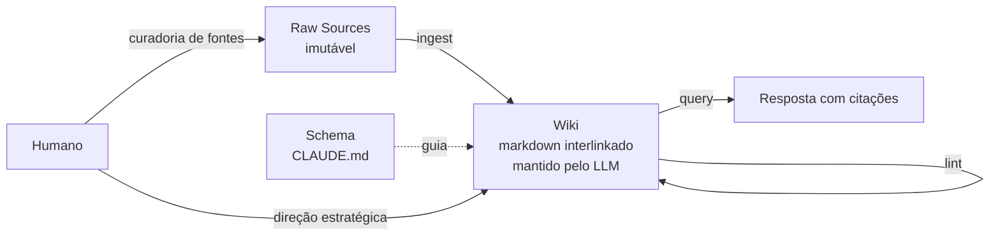

# O LLM Wiki Pattern

> [!abstract] TL;DR
> Em 3 de abril de 2026, Andrej Karpathy publicou no X (e via gist) o "LLM Wiki" pattern: em vez de o LLM consultar documentos via RAG, **um LLM constrói e mantém ativamente uma wiki interlinkada em markdown** a partir de fontes brutas. A arquitetura tem 3 camadas (raw sources, wiki, schema), 3 operações (ingest, query, lint) e um substrato textual durável. A wiki pessoal de Karpathy num único tópico de pesquisa atingiu cerca de 100 artigos e 400 mil palavras — mais que muitas teses de doutorado — sem que ele tenha redigido o texto. É evidência prática de que o pattern escala.

> [!question]- Dúvidas e lacunas desta nota
> - Dúvida gerada pelo conteúdo: o `index.md` como ponto único de catálogo funciona bem até ~100-200 páginas — mas qual estratégia de sharding do índice funciona melhor após esse threshold? A nota menciona BM25/vetorial/grafo, mas não compara as opções em termos de custo de manutenção vs. cobertura.
> - Lacuna potencial: a nota descreve a arquitetura mas não discute versionamento da wiki. Se o schema mudar radicalmente (ex: mudança na estrutura de entity pages), como migrar as páginas existentes? A imutabilidade do raw é a resposta parcial, mas o processo de regeneração não é descrito.
> - Conexão sugerida: a operação de lint desta nota tem paralelo direto com o manage-step descrito em [[04 - RAG vs memória de longo prazo]] — mas a nota não torna essa correspondência explícita. Lint = manage-step aplicado à wiki como substrato.

Imagine um pesquisador que passa meses investigando um domínio difícil, conversando com um LLM quase todo dia. Cada sessão nova começa do zero: ele reabre o chat, resume o que já discutiu, reexplica as definições que cunhou, relembra as contradições que já resolveu — só então chega à pergunta de hoje. Multiplique isso por semanas e o custo fica visível: pesquisadores, analistas e consultores que usavam LLMs intensivamente relatavam gastar **20–30% de cada sessão apenas re-explicando o que já havia sido discutido**. Não é fricção pequena — é um imposto recorrente sobre todo o tempo de trabalho de conhecimento. Foi essa dor concreta, sentida por gente que vivia de pensar sobre documentos, que o LLM Wiki Pattern de Karpathy veio resolver — e é por isso que o gist, quando saiu, viralizou tão rápido (mais adiante, em "O contexto histórico", o porquê exato).

## O que é

O insight central de [[Andrej Karpathy|Karpathy]] é uma analogia com compiladores. Artigos brutos — PDFs, papers, posts, transcrições — são como _source code_: úteis, mas verbosos, redundantes, contextualmente implícitos, organizados para humanos e não para consulta rápida. O LLM atua como _compilador_: lê esse material e o "compila" numa wiki estruturada de páginas em markdown interlinkadas, otimizada para retrieval e síntese. A wiki é o _executable_ — o artefato que você efetivamente consulta no dia a dia.

A diferença crucial em relação a [[05 - Beyond RAG - quando RAG não basta|RAG]] é direcional: em [[Dicionário de IA#RAG (Retrieval-Augmented Generation)|RAG]] o [[Dicionário de IA#LLM (Large Language Model)|LLM]] **lê** documentos estáticos a cada query, recuperando trechos por similaridade vetorial. No LLM Wiki o LLM **escreve** o knowledge base — ele sintetiza, cruza referências, atualiza páginas existentes quando novas fontes entram, e mantém um catálogo navegável. RAG resolve "achar a passagem certa"; o LLM Wiki resolve "manter um corpo de conhecimento que cresce e se reorganiza sozinho".

Há três papéis bem definidos. O **humano** cura as fontes (decide o que entra no raw) e dá direção estratégica (o que pesquisar, o que aprofundar). O **LLM** faz o trabalho de _bookkeeping_: ler, resumir, criar páginas de entidade, atualizar índices, identificar contradições. A **wiki** é o artefato que compõe — cada nova fonte ingerida não substitui o que já existe, ela enriquece, estende e refina. É essa propriedade de composição que diferencia o pattern de um repositório passivo de notas.

## LLM Wiki vs RAG — comparativo direto

| Dimensão | RAG | LLM Wiki Pattern |
|---|---|---|
| **Quem escreve?** | Humano (corpus offline) | LLM (a partir de fontes) |
| **Substrato** | Vector DB + embeddings | Markdown plano interlinkado |
| **Retrieval** | Similarity search | Leitura direta de páginas |
| **Atualização** | Re-indexação manual | Ingest + update de páginas |
| **Composição** | Nenhuma (corpus estático) | Cada ingest atualiza páginas existentes |
| **Meta-conhecimento** | Não suportado | index.md + lint |
| **Infraestrutura** | Vector DB, embedding model | Apenas arquivos + LLM |
| **Dependência externa** | Alta (vector DB, API de embedding) | Baixa (apenas LLM) |
| **Auditabilidade** | Alta (corpus versionável) | Alta (raw sources imutáveis + log.md) |
| **Lint/health check** | Não existe | Operação formal com ciclo periódico |
| **Custo de setup** | Médio (indexação, configuração) | Baixo (apenas criar o schema) |
| **Custo de manutenção** | Baixo (re-indexação periódica) | Médio (lint regular, revisão humana) |

A linha mais reveladora é **Composição**. RAG não compõe por design: o corpus é um conjunto estático de documentos, e adicionar um documento não muda nenhum dos outros. LLM Wiki compõe por design: adicionar uma fonte força a atualização de páginas relacionadas, gerando efeitos cascata que enriquecem progressivamente o knowledge base. É essa propriedade que permite a uma wiki de 100 páginas ser mais do que a soma de 100 summaries independentes.

## Por que importa

RAG passivo escala mal para conhecimento que **compõe**. Quando você pesquisa um domínio por meses, o que importa não é só recuperar trechos relevantes — é manter continuidade entre sessões, conectar ideias que aparecem em fontes diferentes, perceber quando uma afirmação nova contradiz uma antiga, e construir uma estrutura mental que evolui. RAG não faz nada disso: cada query é independente, e o knowledge base é fixo até alguém reindexar.

O LLM Wiki estabelece um padrão claro para construção de "second brain" assistido por IA — território onde 2026 viu uma explosão de implementações inspiradas: [[10 - LLM-knowledge-base (Wendel) — direto do gist|LLM-knowledge-base do Wendel]] (a implementação canônica direto do gist), [[11 - OpenKB — wiki compilada com PageIndex|OpenKB]] (wiki compilada com PageIndex para documentos longos), [[13 - basic-memory — MCP nativo Obsidian|basic-memory]] (MCP nativo para Obsidian), [[12 - graphify — knowledge graph de raw|graphify]], entre outros. O pattern virou referência porque resolve um problema real que profissionais de conhecimento sentem na pele: o conhecimento acumulado se perde entre sessões com o LLM.

A simplicidade radical do pattern é deliberada e merece atenção. Não há vector DB, embeddings, framework, biblioteca exótica. Markdown em arquivos. O que torna isso poderoso é o **schema** — o documento de regras que ensina o LLM como organizar, linkar e atualizar. O substrato é trivial; a inovação real está no protocolo de manutenção. Essa decisão arquitetural alinha o pattern com [[07 - Por que Obsidian e markdown como substrato|por que markdown é o substrato certo]].

Uma dimensão muitas vezes ignorada: o LLM Wiki é também um padrão de **colaboração humano-LLM**. O humano contribui com julgamento editorial (o que vale pesquisar, quais fontes são confiáveis) e revisão crítica (detectar alucinações nas primeiras semanas). O LLM contribui com consistência e escala (nenhum humano conseguiria manter manualmente uma wiki de 400 mil palavras com 100 páginas interlinkadas sem perder coerência). A divisão de papéis é o que torna o pattern sustentável a longo prazo.

O padrão também tem relevância para o debate sobre automação de trabalho de conhecimento. O LLM Wiki não substitui o especialista — ele elimina o trabalho de bookkeeping (registro, organização, linkagem) que consome tempo sem gerar insight. O especialista foca em decidir o que é relevante, fazer as perguntas certas e validar as sínteses. O LLM faz o trabalho mecânico de manter a coerência da base. Essa é uma divisão de trabalho que augmenta o especialista, não o substitui.

Por fim, a escala demonstrada por Karpathy (~400 mil palavras num único tópico) tem implicações práticas para profissionais de pesquisa: é a primeira vez que um fluxo de trabalho acessível — sem engenharia de ML, sem infraestrutura especial — permite construir e manter corpos de conhecimento comparáveis a uma tese de doutorado de forma assistida. Isso muda o que é possível fazer individualmente no domínio de gestão de conhecimento.

## Como funciona



### Arquitetura em 3 camadas

**1. Raw Sources (imutável).** É a sua coleção curada de documentos-fonte: artigos, papers, imagens, dados, transcrições. Karpathy é explícito: "These are immutable — the LLM reads from them but never modifies them. This is your source of truth." O humano deposita material aqui; o LLM nunca altera. Essa imutabilidade é o que permite reconstruir a wiki do zero se o esquema mudar — os raw sources são o chão firme a partir do qual tudo é regenerável.

A curadoria de raw sources é a decisão editorial mais importante que o humano toma. Fontes de baixa qualidade geram wiki de baixa qualidade. Fontes redundantes geram deduplicação desnecessária. A regra de Karpathy é pragmática: "se você leria o artigo com atenção, ele entra no raw".

**2. The Wiki (mantida pelo LLM).** Um diretório de arquivos markdown gerados pelo LLM: summaries de fontes, entity pages (pessoas, empresas, conceitos), concept pages, comparações, overviews, sínteses. Karpathy: "The LLM owns this layer entirely." É aqui que o conhecimento composto vive — e é aqui que o trabalho de manutenção acontece. A wiki não é um arquivo estático: ela está em constante estado de atualização à medida que novas fontes entram e o lint detecta divergências.

**3. The Schema.** Um documento (tipicamente `CLAUDE.md` para Claude Code ou `AGENTS.md` para Codex) que diz ao LLM como a wiki é estruturada, quais são as convenções e quais workflows seguir. Esse arquivo é o equivalente do sistema de build na analogia do compilador: é onde a inovação real vive. Schema bem escrito produz wiki coerente; schema vago produz caos. O schema é código — merece versionamento, testes (comparar output esperado com output gerado) e refinamento iterativo.

### As três operações

**Ingest.** Quando uma nova fonte entra no raw, o LLM a lê, discute os takeaways com o humano, escreve uma summary page na wiki, atualiza o `index.md`, modifica páginas relacionadas (entity pages, concept pages) em toda a wiki para refletir o novo material e adiciona uma entrada no `log.md`. Não é só "criar um resumo" — é integrar o novo conhecimento ao corpo existente. Uma fonte nova sobre o modelo de atenção, por exemplo, deve atualizar tanto a summary page da fonte quanto a concept page sobre "Transformer architecture" — e potencialmente as entity pages de "Vaswani et al." e "Google Brain".

**Query.** O humano faz uma pergunta. O LLM busca nas páginas da wiki, lê as relevantes e sintetiza uma resposta com citações para as wiki pages e fontes. Quando uma resposta é particularmente valiosa ou recorrente, ela vira material para uma nova wiki page — fechando o ciclo de composição. Isso é o que Karpathy chama de wiki "que compõe": as queries retroalimentam o crescimento da base.

**Lint.** Health check periódico. O LLM percorre a wiki procurando contradições entre páginas, claims stale (afirmações que fontes mais novas superaram), páginas órfãs (sem inbound links), índices desatualizados, links quebrados. É auto-healing: a wiki não apodrece sozinha porque há um ciclo deliberado de revisão. Sem lint, qualquer knowledge base de tamanho razoável degrada — contradições silenciosas se acumulam, páginas ficam desatualizadas, o index.md perde coerência com o conteúdo real.

O lint não é um script automatizado — é uma operação guiada pelo LLM com o schema. O schema define o que verificar e como reportar; o LLM executa a varredura e propõe correções; o humano revisa e aplica. Essa divisão garante que o lint não introduza novos erros ao corrigir os antigos.

### Arquivos especiais

- **`index.md`** — catálogo content-oriented de todas as páginas, agrupado por categoria, cada entrada com link, one-liner e metadados opcionais (data, contagem de fontes). É o mapa da wiki — o ponto de entrada para qualquer navegação ou query. Karpathy recomenda mantê-lo sempre atualizado, mesmo que isso exija atenção especial no schema para garantir que ingest atualize o índice automaticamente.
- **`log.md`** — append-only log cronológico de todos os ingests, queries notáveis e lint passes. Serve como memória do _processo_ (não só do conteúdo) — permite entender como o conhecimento foi construído, rastrear quais fontes foram ingeridas e quando, e diagnosticar por que uma página tem o conteúdo que tem.

> [!tip] Compiler analogy — vocabulário-chave
> Karpathy resume a divisão de papéis assim: "Obsidian is the IDE; the LLM is the programmer; the wiki is the codebase." Raw articles são source code; o LLM seguindo o schema é o compilador; a wiki é o output executável. Internalize esse vocabulário — ele é o que conecta o pattern ao restante do discurso sobre agentes em 2026.

### Escala demonstrada

A wiki pessoal de Karpathy num único tópico de pesquisa cresceu para cerca de 100 artigos e 400 mil palavras — comparável a uma tese longa — construída inteiramente pelo LLM a partir de fontes que ele curou. O próprio gist é mais conservador, descrevendo o ponto-doce como "~100 sources, ~hundreds of pages". De toda forma, não é toy: o pattern já provou que sustenta corpos de conhecimento profissionais. O tweet original de 3 de abril de 2026 acumulou mais de 16 milhões de visualizações e o gist passou de 5 mil estrelas em poucos dias — sinal de que tocou num problema real.

## O contexto histórico — por que o gist viralizou

O tweet de Karpathy em 3 de abril de 2026 acumulou mais de 16 milhões de visualizações em poucos dias. O gist passou de 5 mil estrelas. Esse alcance não é trivial para um post técnico — e tem uma explicação: o pattern tocou numa dor muito específica que profissionais de conhecimento estavam sentindo há meses.

Em 2024–2025, o fluxo de trabalho padrão com LLM era: abrir uma conversa, descrever o contexto, fazer as perguntas, obter respostas, fechar. Na próxima sessão, repetir o contexto do zero. Quanto mais sofisticado o domínio, maior o custo de recontextualização — é exatamente a dor descrita na abertura desta nota (aqueles 20–30% de cada sessão perdidos em re-explicação), só que agora generalizada: não era o incômodo de um pesquisador isolado, era o padrão da indústria inteira.

Diversas tentativas de solução foram construídas — custom instructions, system prompts longos, armazenamento de contexto em arquivos — mas todas sofriam do mesmo problema: o contexto não compunha, não se organizava e não se atualizava sozinho. Era um dump de texto, não um knowledge base.

O LLM Wiki Pattern resolveu isso com três insights simultâneos:
1. **O LLM pode escrever, não apenas ler** — óbvio em retrospecto, mas subutilizado na prática
2. **Markdown é o formato ideal** — durável, legível por humanos e LLMs, portável, sem dependências
3. **O schema é o produto principal** — a inovação não é o substrato, é o protocolo de manutenção

A combinação desses três insights, apresentada de forma prática (com exemplos de `index.md`, `log.md` e schema), foi o que tornou o post um marco. Não era teoria — era uma receita executável que qualquer pessoa com acesso a um LLM podia implementar no mesmo dia.

## Implementações que surgiram do gist

Em poucas semanas após o gist, o GitHub registrou dezenas de projetos inspirados diretamente no pattern. As mais notáveis:

- **LLM-knowledge-base (Wendel)** — a implementação canônica mais próxima do gist original, em Python. Recebeu o maior volume de estrelas entre as implementações. Ver [[10 - LLM-knowledge-base (Wendel) — direto do gist]].
- **OpenKB** — adicionou o conceito de PageIndex para lidar com documentos longos que estouram o contexto em uma leitura. Resolve o problema de ingesting papers de 40 páginas sem truncar. Ver [[11 - OpenKB — wiki compilada com PageIndex]].
- **graphify** — transformou o output do pattern em um grafo de conhecimento ao invés de uma wiki plana, tornando as conexões entre entidades explicitamente navegáveis. Ver [[12 - graphify — knowledge graph de raw]].
- **basic-memory** — implementou o pattern como servidor MCP, tornando a wiki acessível diretamente de clientes Claude (incluindo Obsidian via plugin). A integração MCP elimina o overhead de copiar/colar entre o LLM e a wiki. Ver [[13 - basic-memory — MCP nativo Obsidian]].
- **NicholasSpisak/second-brain** e **Apify Second Brain Builder** — variantes com foco em uso pessoal e automação de ingest a partir de feeds RSS, bookmarks e emails.

Cada implementação fez trade-offs diferentes — mas todas preservaram as três operações centrais (ingest, query, lint) e a separação entre raw sources e wiki. O core do pattern mostrou-se robusto a variações de substrato e tooling.

## O schema como protocolo — o que ele precisa cobrir

O schema é a parte mais importante do pattern e a mais negligenciada. Times que implementam o pattern sem investir no schema produzem wikis inconsistentes que degradam rapidamente. Um schema completo cobre pelo menos seis dimensões:

**1. Tipos de página e seus templates.** Quais categorias de página existem (summary, entity, concept, overview, comparison) e qual é a estrutura esperada de cada uma. O LLM precisa saber: "uma entity page sempre tem seção de afiliação, seção de contribuições e seção de links para fontes". Sem isso, entity pages ficam com formatos diferentes e o lint tem dificuldade de validar.

**2. Convenções de nomenclatura.** Como nomear arquivos (kebab-case? Título do paper? Nome da entidade?), como formatar links (wikilinks? Markdown links?), como nomear seções (H2 ou H3 para subsections?). Inconsistência de nomenclatura é o problema mais comum em wikis sem schema explícito — depois de 50 páginas, links começam a quebrar porque nomes divergem.

**3. Workflow de ingest.** Passo a passo do que fazer quando uma nova fonte chega: ler, discutir takeaways, criar summary page, atualizar index.md, identificar quais páginas existentes precisam ser modificadas, fazer as modificações, adicionar ao log.md. O schema define a sequência e os critérios de completude de cada passo.

**4. Critérios de atualização de páginas existentes.** Quando um novo fato contradiz uma página existente, qual é o protocolo? Atualizar in-place com nota de versão? Criar seção "historical context"? Marcar como contradição pendente de resolução? Sem critérios explícitos, o LLM toma decisões ad-hoc que geram inconsistência.

**5. Workflow de lint.** O que verificar, em que ordem, com que frequência. Checklist mínimo: contradições entre páginas, links quebrados, páginas sem inbound links, index.md desatualizado, claims sem citação. O schema define o que "lint passou" significa — um critério de aceitação claro.

**6. Critérios de qualidade de query.** Quando uma resposta é boa o suficiente para ser promovida a uma nova wiki page? O schema pode definir: respostas com mais de N palavras que sintetizam mais de M fontes são candidatas a virarem páginas. Isso fecha o ciclo de composição.

```
# Exemplo de schema minimalista — estrutura de uma entity page
## Entity Page Template
- Nome da entidade (H1)
- Afiliação / organização principal
- Contribuições relevantes ao domínio desta wiki
- Relações com outras entidades (links wikilink)
- Fontes: lista de raw sources que mencionam esta entidade
- Última atualização: [data do último ingest que modificou esta página]
```

## Quando usar / quando não usar

**Quando faz sentido:**

- Conhecimento que **evolui** ao longo do tempo (vs. documentação estática que não muda).
- Multi-session continuity — você quer que o agente "lembre" o que foi discutido em sessões anteriores.
- Exploração de domínio novo, onde **conexões entre fontes** importam mais que retrieve de uma fonte específica.
- Casos onde meta-knowledge importa: "o que eu sei sobre X?", "quais lacunas existem na minha pesquisa?".
- Trabalhos onde **síntese cross-document** é o produto principal (revisão de literatura, due diligence, pesquisa de mercado).
- Profissionais de conhecimento que trabalham intensivamente num domínio por semanas ou meses (pesquisadores, analistas, consultores).

**Quando NÃO faz sentido:**

- Q&A simples sobre documentos fixos onde a resposta está literal numa página — RAG basta e custa menos.
- Tarefas one-shot — não há acumulação para justificar a infraestrutura.
- Baixo orçamento de manutenção — lint regular é trabalho, e sem ele a wiki apodrece. Se o time não tem 2–3 horas por semana para ingest e lint, o pattern não sustenta.
- Documentos autoritativos que **não devem** ser sintetizados (legal, regulatório, normativo) — a síntese do LLM pode mascarar nuances que importam juridicamente.
- Quando precisão factual exata é mais crítica que síntese — a wiki é interpretação, não cópia. Dosagens farmacológicas, cálculos estruturais, normas técnicas — nesses casos, citar o original é mais seguro do que gerar uma síntese.
- Times sem capacidade operacional para revisar as primeiras semanas de ingest — sem revisão humana inicial, erros silenciosos se propagam pela wiki antes de serem detectados pelo lint.

## Armadilhas comuns

> [!warning] Armadilha 1: wiki rot sem lint regular
> Sem o ciclo de health check, contradições silenciosas se acumulam: uma página afirma X, outra afirma não-X, e ambas continuam linkadas em índices. Lint não é opcional em wikis com mais de algumas dezenas de páginas. A degradação é gradual e insidiosa — o sistema continua funcionando, mas as respostas ficam progressivamente menos confiáveis. Wikis acima de 50 páginas sem lint semanal invariavelmente acumulam contradições detectáveis em 60 dias.

> [!warning] Armadilha 2: schema mal escrito gera caos
> Instruções vagas no `CLAUDE.md` (ou equivalente) produzem wiki inconsistente — convenções de nome divergentes, páginas com seções diferentes, links quebrados. Schema é código; merece o mesmo cuidado. A heurística: se você der o schema para 3 LLMs diferentes e pedir para ingerirem a mesma fonte, as wikis resultantes deveriam ser estruturalmente similares (mesmos tipos de página, mesmas convenções de link). Se divergem muito, o schema está incompleto. Itere até convergir.

> [!warning] Armadilha 3: confiança cega em LLM-generated content
> O humano precisa revisar páginas críticas, especialmente nas primeiras semanas, antes que erros silenciosos virem citações em outras páginas e contaminem a wiki inteira. O LLM alucina — não com frequência alta, mas com frequência suficiente para ser problemático em wikis que se tornam a fonte de verdade. Estabeleça um protocolo de revisão: nas primeiras 4 semanas, revisar pelo menos 20% das páginas geradas; depois, fazer spot-check em páginas de conceito crítico durante o lint.

> [!warning] Armadilha 4: escalar `index.md` além do limite do contexto
> O `index.md` único funciona até 100-200 páginas. Acima disso, ele estoura o [[Dicionário de IA#Context window|contexto]] do LLM em uma leitura — e aí precisa de busca real ([[Dicionário de IA#BM25|BM25]], vetorial, ou grafo de entidades) para não perder cobertura. Planejar esse threshold desde o início evita a necessidade de migrar a estrutura do índice quando a wiki já cresceu. A regra prática: defina no schema um índice hierárquico (índice por categoria, com sub-índices por domínio) desde o início, mesmo que ainda não seja necessário — é mais fácil ter estrutura que não usa do que migrar estrutura quando a wiki estoura.

> [!warning] Armadilha 5: confundir o pattern com RAG
> Wiki **escrita** pelo LLM é categoricamente diferente de wiki **lida** pelo LLM. A escrita é o ponto. Quem implementa "RAG sobre uma pasta de markdown" e chama isso de LLM Wiki perde o que torna o pattern interessante — a composição, o lint, a atualização de páginas existentes quando novas fontes entram. O teste simples: quando uma nova fonte entra, quantas páginas existentes são atualizadas? Em LLM Wiki correto, a resposta é "várias". Em RAG sobre markdown, a resposta é "nenhuma".

## Como explicar em inglês

Em entrevistas para posições de arquitetura de sistemas de LLM, o LLM Wiki Pattern é um exemplo ideal de "como você pensaria sobre memória de longo prazo sem depender de vector DB?". O pattern demonstra entendimento de trade-offs arquiteturais e de como simplicidade de substrato pode ser potencializada por sofisticação de protocolo.

Uma resposta sênior sobre o pattern inclui três elementos: (1) a inversão do modelo RAG (escrever em vez de ler), (2) a analogia do compilador como modelo mental para a divisão de responsabilidades, e (3) o lint como operação que diferencia uma wiki sustentável de uma wiki que apodrece.

> [!tip] Interview quote
> "The LLM Wiki Pattern, from Karpathy's April 2026 gist, flips the RAG model: instead of the LLM reading static documents via retrieval, the LLM writes and maintains an interlinked markdown wiki. The key insight is the compiler analogy — raw sources are source code, the LLM following a schema is the compiler, and the wiki is the executable. What makes it work isn't the substrate (just markdown files), it's the maintenance protocol: ingest, query, and lint as recurring operations that keep the wiki coherent and growing. The innovation is the schema, not the substrate — you could use any plain-text format, but the protocol of how the LLM maintains it is what makes knowledge compound rather than accumulate."

| Português | Inglês |
|-----------|--------|
| Wiki interlinkada | Interlinked wiki |
| Fontes brutas | Raw sources |
| Página de entidade | Entity page |
| Página de conceito | Concept page |
| Verificação de saúde | Lint / health check |
| Esquema da wiki | Wiki schema |
| Ingestão de fonte | Source ingestion |
| Imutável | Immutable |
| Compilador (analogia) | Compiler (analogy) |
| Código-fonte (analogia) | Source code (analogy) |
| Execução (analogia) | Executable (analogy) |
| Síntese de múltiplas fontes | Cross-source synthesis |
| Catálogo de conteúdo | Content-oriented catalog |
| Ciclo de composição | Composing cycle |
| Apodrecimento da wiki | Wiki rot |
| Bookkeeping (papel do LLM) | Bookkeeping |
| Curadoria (papel do humano) | Source curation |
| Segundo cérebro | Second brain |

## Exemplo de ingest na prática

Para tornar as três operações concretas, um exemplo de ingest de um paper de machine learning:

1. **Humano deposita o paper** no diretório `raw/` com o nome `2026-04-vaswani-attention.pdf`.

2. **LLM lê o paper** e discute os principais takeaways com o humano em linguagem natural: "quais são os três insights mais importantes? Que afirmações contradizem páginas existentes?"

3. **LLM cria a summary page** `wiki/sources/2026-04-vaswani-attention.md` com: título, autores, data, abstract em uma frase, os principais contribuições, limitações e conexões com o domínio.

4. **LLM atualiza o index.md** adicionando a nova entrada na categoria "Transformer architecture": `- [[vaswani-attention]] — "Attention is All You Need": o paper que eliminou recorrência de NLP (2017)`.

5. **LLM identifica páginas relacionadas** buscando no index.md por: "Transformer", "attention mechanism", "Vaswani", "Google Brain". Encontra 3 páginas.

6. **LLM atualiza as páginas relacionadas** — entity page de Vaswani ganha menção ao paper; concept page de "Transformer" ganha uma linha sobre a contribuição histórica.

7. **LLM adiciona ao log.md**: `[2026-06-28] INGEST: vaswani-attention.pdf → summary, 3 entity pages atualizadas, index.md atualizado`.

Todo esse processo, com um schema bem escrito, leva em média 3–5 minutos de LLM time e zero tempo de escrita humana. O humano contribui com a decisão de ingerir e com a revisão spot-check da summary page gerada.

## O que vem a seguir

O LLM Wiki Pattern estabelece o princípio — mas como implementá-lo concretamente? As próximas notas do galho mapeiam o ecossistema de implementações que surgiu a partir do gist de Karpathy. O primeiro ponto de parada é a questão de substrato: por que markdown (e especificamente Obsidian) é o substrato certo para esse tipo de wiki — o que envolve raciocinar sobre durabilidade, portabilidade, tooling disponível e afinidade com o formato de saída natural de LLMs.

A escolha de substrato não é trivial: impacta o schema (o schema de uma wiki em Obsidian é diferente de um schema para um grafo de conhecimento), o lint (ferramentas de validação de links são diferentes), as ferramentas disponíveis (plugins de Obsidian vs. CLI Python) e a longevidade do conhecimento construído (formatos proprietários têm risco de lock-in que markdown não tem). A próxima nota ([07 - Por que Obsidian e markdown como substrato]) explora exatamente esses trade-offs.

> [!summary] Resumo de uma linha
> O LLM Wiki Pattern inverte o RAG: em vez de o LLM ler, o LLM escreve e mantém. A inovação é o schema + protocolo de manutenção (ingest, query, lint), não o substrato (markdown plano). O resultado é um knowledge base que compõe — cada nova fonte enriquece o existente, não apenas adiciona um documento ao corpus.
>
> A analogia do compilador: raw sources = source code (imutável), LLM + schema = compilador, wiki = executable. O humano é o engenheiro de software que decide o que compilar e valida o output — não o compilador em si.
>
> O ponto de atenção mais importante em adoção: o lint não é opcional. Wikis acima de 30–50 páginas sem lint semanal acumulam contradições silenciosas que degradam progressivamente a confiabilidade. O lint é o que diferencia o pattern de um repositório de notas com LLM integrado.

## Veja também

> [!note] Sequência de leitura recomendada
> Esta nota descreve o pattern em sua forma canônica (gist do Karpathy). Para entender o que o motivou, leia [[05 - Beyond RAG - quando RAG não basta]] antes. Para implementar, leia [[23 - Guia de implementação do zero]] e compare as implementações disponíveis começando por [[10 - LLM-knowledge-base (Wendel) — direto do gist]].
>
> Se você trabalha com Obsidian especificamente, [[13 - basic-memory — MCP nativo Obsidian]] é o ponto de entrada mais direto — ele integra via MCP sem exigir setup adicional.

- [[05 - Beyond RAG - quando RAG não basta]] — o que motiva o pattern; os cinco cenários que o LLM Wiki resolve; a nota anterior desta sequência
- [[07 - Por que Obsidian e markdown como substrato]] — escolha de substrato e as razões arquiteturais; a nota seguinte
- [[08 - Arquitetura de um sistema de memória]] — generalização do pattern para sistemas de agentes com múltiplos substratos
- [[10 - LLM-knowledge-base (Wendel) — direto do gist]] — implementação canônica do gist em Python; a mais próxima do original
- [[11 - OpenKB — wiki compilada com PageIndex]] — CLI com PageIndex para documentos longos acima do threshold de contexto
- [[13 - basic-memory — MCP nativo Obsidian]] — alternativa pronta com integração MCP; ideal para usuários de Obsidian
- [[23 - Guia de implementação do zero]] — como começar do zero com o pattern, com checklist de setup e schema inicial

## Referências

> [!note] Sobre as referências desta nota
> O gist do Karpathy é a fonte primária — leia-o diretamente antes de qualquer análise secundária. O post da VentureBeat e o de Nayak são análises de segunda ordem úteis para entender como o campo interpretou o pattern. MindStudio aprofunda a analogia do compilador. Park et al. é a referência acadêmica que estabeleceu os fundamentos que o LLM Wiki simplificou.

- **Karpathy, gist oficial** — `https://gist.github.com/karpathy/442a6bf555914893e9891c11519de94f` — a fonte primária; descreve as 3 camadas, as 3 operações, `index.md` e `log.md`, a analogia "Obsidian/programmer/codebase".
- **Karpathy, tweet de 03/abr/2026** — `https://x.com/karpathy/status/2040470801506541998` — o post que viralizou (16M+ visualizações), com os números da wiki pessoal (~100 artigos, ~400k palavras num único tópico).
- **VentureBeat** — "Karpathy shares 'LLM Knowledge Base' architecture that bypasses RAG" — cobertura editorial mainstream do anúncio; primeiro veículo a usar "bypasses RAG" como tese principal.
- **Plaban Nayak (Level Up Coding)** — "Beyond RAG: How Andrej Karpathy's LLM Wiki Pattern Builds Knowledge That Actually Compounds" — análise focada em por que o pattern compõe enquanto RAG não; útil para entender os cenários 3 e 5.
- **MindStudio** — "The Compiler Analogy Explained" — desdobra a analogia compiler/source-code/executable em quatro camadas operacionais; útil para aprofundar a seção de analogia desta nota.
- **Gamgee Blog** — "Andrej Karpathy's LLM Wiki: Why the Future of AI Memory Isn't RAG" — argumenta que memória deveria ser síntese, não retrieval; detalha as dimensões relacionais, temporais e de consolidação que RAG não cobre; complementar à seção "LLM Wiki vs RAG" desta nota. [gamgee.ai/blogs/karpathy-llm-wiki-memory-pattern](https://gamgee.ai/blogs/karpathy-llm-wiki-memory-pattern/)
- **Park, J. et al.** (2023). *Generative Agents: Interactive Simulacra of Human Behavior.* — precursor acadêmico do pattern; introduziu memory streams com reflection trees, resolução de contradições e meta-knowledge. O LLM Wiki é a simplificação prática de princípios que Park et al. formalizaram. [arxiv.org/abs/2304.03442](https://arxiv.org/abs/2304.03442)
- **LLM-knowledge-base (Wendel, GitHub)** — implementação Python canônica do gist; o melhor ponto de partida para quem quer implementar o pattern sem construir do zero. O código é legível e o schema de exemplo é um bom template. [github.com/LLM-knowledge-base](https://github.com/LLM-knowledge-base)
- **basic-memory (MCP server)** — implementação do pattern como servidor MCP; integra com Claude Desktop e clientes MCP sem setup adicional; ideal para quem quer testar o pattern sem escrever código. Ver [[13 - basic-memory — MCP nativo Obsidian]].
- **OpenKB** — extensão do gist com PageIndex para suportar documentos longos; resolve o limite de contexto em ingestão de papers e relatórios extensos. Ver [[11 - OpenKB — wiki compilada com PageIndex]].
