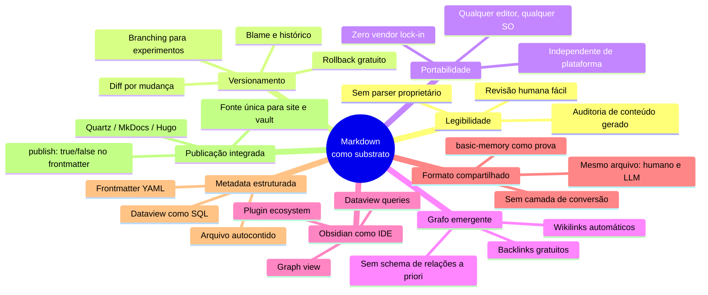
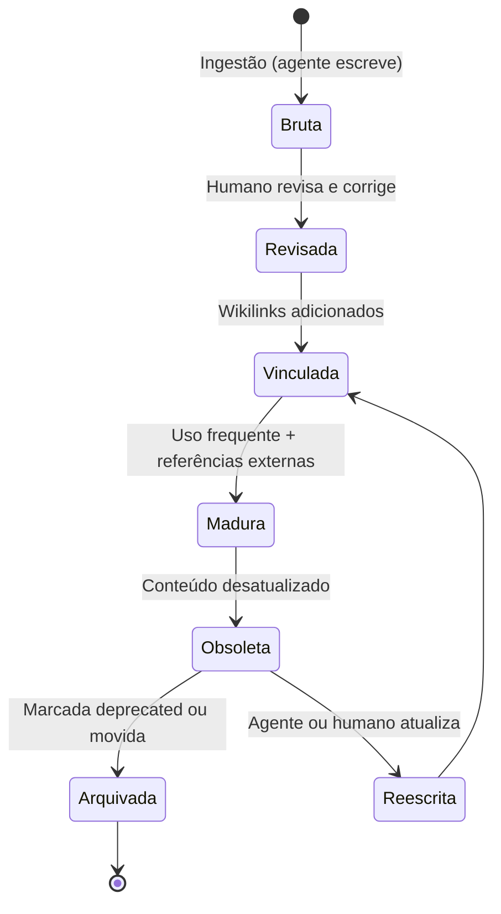
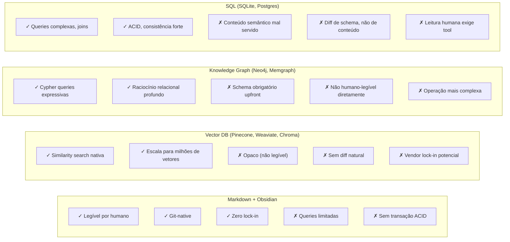
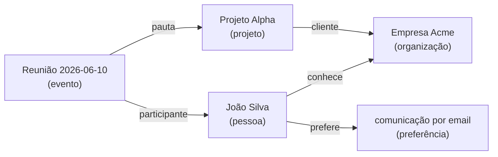

# Por que Obsidian e markdown como substrato

> [!abstract] TL;DR
> Markdown + Obsidian é o substrato natural para memória de agentes em 2026. As razões são concretas: o conteúdo é humano-legível (e quem opera o agente pode revisar o que o LLM escreveu sem ferramenta especializada), versionável em git (diff, blame, rollback gratuitos), portável (zero vendor lock-in), e o grafo emerge sozinho via wikilinks. Obsidian funciona como IDE — graph view, backlinks, dataview — sem ser pesado. O ponto-chave: o **mesmo formato** é lido e escrito tanto por humano quanto por LLM. O servidor [[Dicionário de IA#MCP (Model Context Protocol)|MCP]] `basic-memory` é evidência prática: ele expõe um vault Obsidian para o [[Dicionário de IA#LLM (Large Language Model)|LLM]] sem conversão de formato. Quando o substrato é o mesmo, a colaboração humano↔agente para de exigir tradução.

> [!question]- Dúvidas e lacunas desta nota
> - Dúvida gerada pelo conteúdo: Em sistemas onde múltiplos agentes (não só humanos) escrevem concorrentemente no vault, como se resolve o risco de conflito de merge no git — e existem convenções consolidadas para isso em markdown?
> - Lacuna potencial: A nota trata Obsidian como a ferramenta de referência, mas não discute comparativamente outras IDEs de markdown (VSCode com extensões, Logseq, Notion exportado) — em quais cenários elas competem com Obsidian como substrate IDE?

## O que é

Substrato, no contexto de memória de agentes, é o formato físico em que o conhecimento vive em disco — o nível abaixo da arquitetura de camadas, abaixo do schema, abaixo da estratégia de retrieval. É o que sobra quando se desliga o agente: arquivos. A escolha desse formato decide o que o sistema consegue fazer com baixo atrito e o que vira fricção crônica.

A proposta de markdown como substrato é peculiar por um motivo: é o **mesmo formato textual servindo humano e LLM**, em escrita E em leitura. O humano abre o arquivo num editor qualquer, lê, edita, comenta. O LLM abre o mesmo arquivo, lê, edita, comenta. Não há fase de export, transformação ou projeção entre representações — o que está em disco é o que o agente vê. Não é a única opção viável (vector DB puro, JSON, SQL, knowledge graphs dedicados são alternativas legítimas), mas markdown captura a maior parte do valor com simplicidade radical, e essa simplicidade é o que torna o pattern adotável.

### A analogia com código-fonte

Há uma analogia que clareia por que a escolha não é ingênua. Código-fonte vive em arquivos texto há décadas, mesmo existindo alternativas binárias mais compactas e mais rápidas de parsear. A razão é que arquivos texto legíveis por humano rendem diff legível, blame utilizável, revisão de código possível, histórico auditável. Ninguém propõe armazenar código em binário para ganhar performance de leitura, porque o custo de manutenção seria catastrófico.

[[Andrej Karpathy|Karpathy]] fez exatamente essa analogia ao formular o LLM Wiki Pattern. A frase canônica é "Obsidian is the IDE; the LLM is the programmer; the wiki is the codebase". Trocar markdown por um vector DB opaco seria como compilar o código-fonte e jogar o fonte fora — você ganha velocidade de execução e perde auditabilidade, versionamento e a possibilidade de entender o que está acontecendo em produção.

## Por que importa

A escolha de substrato é uma decisão arquitetural de longa duração — uma vez que a wiki tem milhares de entradas, migrar custa caro. E substrato impacta dimensões que só aparecem com o tempo: legibilidade do conteúdo gerado pelo LLM, versionamento das mudanças, portabilidade entre máquinas e ferramentas, capacidade de revisão humana sob estresse, custo de saída quando o vendor da ferramenta muda termos.

Em sistemas de memória que **evoluem por anos**, esses fatores são amplificados. Um vault que cresce devagar mas continuamente acumula valor exponencial — e qualquer fricção (não conseguir abrir num editor, não ter histórico, não conseguir migrar) compõe junto com o valor. Escolher mal é pesadelo de migração; escolher bem é uma decisão que se paga sozinha.

A evidência prática mais forte vem do servidor `basic-memory` — um servidor MCP que expõe um vault Obsidian diretamente para o LLM. O fato de essa implementação ser viável — de o LLM conseguir ler, escrever e navegar o mesmo vault que o humano usa sem nenhuma camada de conversão — é prova de que o formato não é apenas teoricamente adequado. É operacionalmente adequado, em produção, hoje.

## Como funciona — vantagens enumeradas

São oito vantagens concretas que se reforçam mutuamente. Nenhuma delas isoladamente justifica a escolha; o conjunto, sim.

**1. Humano-legível.** Abrir um arquivo `.md` num editor qualquer e entender o conteúdo sem parser, sem ferramenta proprietária, sem build step. Em sistemas onde o LLM escreve a maior parte do conteúdo, isso é crítico: quem opera precisa **revisar o que o agente produziu** com baixa fricção. Conteúdo ilegível por humano vira caixa-preta — e caixa-preta gerada por LLM é receita para erro silencioso virar dogma.

**2. Versionável em git.** Diff por mudança, rollback de um lint que correu mal, branching para experimentar reorganizações, blame para descobrir quando determinada afirmação entrou. Knowledge base como código — com todas as práticas maduras que o ecossistema git acumulou em duas décadas. Em vector DBs, "diff" não é uma operação natural.

**3. Portável.** Zero vendor lock-in real. Os arquivos abrem em qualquer editor (VSCode, Sublime, Vim, Notepad), em qualquer SO, em qualquer ano. Obsidian é apenas uma das views possíveis sobre o conteúdo — se o Obsidian fechar amanhã, o vault continua acessível. Comparar com uma base proprietária num SaaS que pode mudar API, encerrar o produto ou aumentar preço unilateralmente.

**4. Grafo emergente.** Wikilinks `[[Nota X]]` formam um grafo sem schema explícito de relacionamentos. Backlinks são gratuitos — Obsidian computa quem aponta pra cada nota automaticamente. Diferente de knowledge graphs dedicados (Neo4j, Memgraph), aqui o grafo cresce como subproduto da escrita normal, sem necessidade de modelar entidades e arestas a priori.

**5. Obsidian como IDE.** Graph view para visualização, backlinks no painel lateral, dataview para queries declarativas, plugins para tudo (lint, search semântico, exportadores, integrações com agents). É ferramenta poderosa sem ser pesada — instalação local, sem servidor, arquivos seus. O Obsidian é gratuito para uso pessoal e o Sync é opcional.

**6. Formato compartilhado humano↔LLM.** O mesmo arquivo `.md` é lido e escrito por humano e por agente. Nada de "exportar para o agent" ou "importar a resposta do agent". O servidor `basic-memory` (MCP nativo Obsidian) é prova de conceito viva: aponta o agente para o vault e ele opera diretamente nos arquivos que o humano também edita. Eliminação de fronteira entre formatos é eliminação de bug surface.

**7. Frontmatter como metadata estruturada.** Tags, status, type, datas, aliases, autoria — tudo em YAML no topo do arquivo, sem banco de dados separado. Plugins como dataview consultam esse metadata como se fosse SQL sobre uma tabela. Metadata e conteúdo no mesmo arquivo significa que mover, copiar ou versionar uma nota leva tudo junto, sem joins quebrados.

**8. Compatibilidade com Quartz e static sites.** Publicação direta da wiki via render estático (Quartz, MkDocs, Hugo, Astro). O vault é também a fonte do site público — sem pipeline de export complexo. Notas com `publish: true` viram páginas; notas privadas ficam no vault. Continuidade de formato entre nota privada e página publicada reduz drasticamente o atrito de compartilhar conhecimento.

## Obsidian como ambiente de trabalho compartilhado

Uma maneira menos óbvia de pensar em Obsidian é como **ambiente de trabalho compartilhado entre humano e agente** — não apenas como visualizador do vault. Quando o servidor `basic-memory` conecta Claude (ou outro LLM) ao vault via MCP, ambos estão "dentro" do mesmo ambiente. O humano abre o Graph View e navega; o agente recebe as mesmas notas como texto e navega por wikilinks. A sessão é diferente, mas o território é o mesmo.

Isso tem implicações concretas para o design do vault:

- **Nomeação de arquivos importa duplamente.** O humano navega pelo painel de arquivos e pelo Graph View usando o nome da nota. O agente busca por texto e por wikilink. Um nome como `2026-06-10 João reunião Alpha.md` serve mal os dois — o humano não reconhece de imediato em qual contexto a reunião aconteceu; o agente pode não encontrar ao buscar por "reunião com João sobre Alpha". Um nome como `Reunião - João Silva - Projeto Alpha - 2026-06-10.md` serve melhor ambos.

- **Tags e frontmatter são queries compartilhadas.** Quando o humano cria uma view dataview `TABLE where type = "person"`, e o agente busca "liste todas as pessoas no vault", os dois estão usando o mesmo campo `type: person` no frontmatter. Schema inconsistente — metade das pessoas com `type: person`, metade com `type: pessoa`, metade sem campo — torna a view inútil para o humano e a busca imprecisa para o agente. O frontmatter é interface pública do vault.

- **Estrutura de pastas é nav para o humano e hierarquia para o agente.** A organização em `pessoas/`, `projetos/`, `reuniões/` ajuda o humano a saber onde criar novas notas. Para o agente, é informação estrutural que pode ser usada em prompts ("crie esta nota em `pessoas/`") ou em queries ("busque em `projetos/`"). Estrutura de pasta e wikilinks se complementam: pasta dá hierarquia, wikilink dá rede.

> [!info] O CLAUDE.md como contrato de vault
> O arquivo `CLAUDE.md` (ou `AGENTS.md`) na raiz do vault não é apenas instrução para o LLM — é o **contrato de vault**. Ele define para ambos os parceiros (humano e agente) as convenções que mantêm o sistema coerente: nomes de arquivo, estrutura de pastas, campos obrigatórios no frontmatter, taxonomia de tags, quando criar nota nova vs expandir existente. Sem esse contrato escrito, cada sessão reinventa parte das convenções e o vault diverge progressivamente.

## Quando NÃO usar markdown

Markdown não é universal. Há cenários em que outro substrato ganha por critérios objetivos.

- **Dados estruturados em escala** — quando o sistema lida com milhões de registros tabulares e queries complexas (joins multi-tabela, agregações, filtros profundos), banco de dados relacional ou de grafo é melhor. Markdown não foi feito pra ser questionado em SQL.
- **Transações ACID** — markdown em arquivos não suporta consistência transacional. Se múltiplos agentes escrevem ao mesmo arquivo concorrentemente, o melhor que se tem é file locking ad-hoc. Sistemas que precisam de garantias de consistência forte (financeiro, regulatório) precisam de DB transacional.
- **Relacionamentos densos com queries de grafo profundas** — quando o caso de uso central é "encontre todos os nodes a 3 hops de X que satisfazem propriedade Y", knowledge graph dedicado (Neo4j, Memgraph, ArangoDB) ganha. Wikilinks dão grafo, mas não dão Cypher.
- **Conteúdo binário pesado** — imagens, vídeos, áudio, datasets grandes. Markdown referencia esses arquivos, mas o storage real precisa estar em outro lugar (filesystem, S3, CDN). Vault Obsidian não é blob storage.

A regra é simples: markdown ganha quando o caso de uso central é **conhecimento conceitual interligado, mantido por humano e LLM, com horizonte de anos**. Para casos fora desse perfil, escolha o substrato adequado e prossiga.

## Ciclo de vida de uma nota no vault

Para tornar abstração concreta, vale seguir o ciclo de vida de uma nota gerada pelo agente — do momento em que nasce até que se torna conteúdo maduro.

Cada estado tem características distintas no vault:

- **Bruta:** frontmatter `status: seedling`, conteúdo inicial gerado pelo agente, wikilinks mínimos ou ausentes.
- **Revisada:** humano corrigiu erros factuais, ajustou tom, confirmou que as afirmações são corretas.
- **Vinculada:** conectada ao grafo do vault — quem aponta pra ela, quem ela referencia. Backlinks visíveis no Obsidian.
- **Madura:** `status: evergreen`, fonte confiável para o agente recuperar, indexada em MOC.
- **Obsoleta:** `status: deprecated` ou nota de aviso no início; o agente não deveria recuperar como se fosse verdade atual.

Implementar essa progressão exige apenas convenção de frontmatter — nenhum banco de dados, nenhuma ferramenta externa. O dataview consulta `status` e filtra conforme necessário. Isso é a governance de vault sendo feita com o substrato markdown, sem overhead.

## Armadilhas comuns

> [!warning] Armadilha 1: Vault sem governance vira lixão
> Markdown é simples, mas essa simplicidade não dispensa estrutura. Sem um documento de regras (CLAUDE.md, AGENTS.md ou similar), o LLM espalha conteúdo sem coerência: notas duplicadas, naming divergente, pastas órfãs. Em vector DBs, o schema é obrigatório por design; em markdown, ele é opcional — e essa opcionalidade é tanto a força quanto o risco. Definir convenções de naming, frontmatter obrigatório e taxonomia de tags antes de escalar é o investimento mais barato que existe em sistemas de memória.

> [!warning] Armadilha 2: Wikilinks quebrados acumulam silenciosamente
> Renomear uma nota sem ferramenta adequada quebra wikilinks que apontavam para ela. Obsidian resolve isso ao renomear dentro do vault; mas scripts externos, imports batch ou LLMs que criam links sem verificar o destino introduzem links quebrados que acumulam silenciosamente. Sem lint regular (`Obsidian Linter`, `Broken Link Finder` ou verificação custom), a coerência interna da wiki se desfaz nota a nota, sem alarme. Implementar lint de wikilinks como step de CI ou rotina periódica é práxis obrigatória para vaults em produção.

> [!warning] Armadilha 3: Frontmatter inconsistente trava dataview e automações
> Schema YAML divergente entre notas — `tag` vs `tags`, `created` vs `date`, valores em formatos diferentes — torna queries dataview difíceis ou impossíveis. Pior: quando o LLM escreve frontmatter baseado em exemplos distintos, ele reproduz a inconsistência do corpus. O efeito composto é uma base onde as mesmas queries nunca retornam resultados completos. Definir o schema do frontmatter no documento de regras desde o início — e validá-lo com lint — economiza retrabalho proporcional ao tamanho do vault.

> [!warning] Armadilha 4: Confundir "markdown é simples" com "sem manutenção"
> A simplicidade do substrato não se transfere automaticamente para o sistema. Vault grande exige governance: lint regular, naming convention documentada, taxonomia de tags estável, revisão periódica de conteúdo obsoleto. A ilusão de baixa manutenção seduz na fase de setup e cobra o preço meses depois, quando o vault começou a acumular lixo e o agente recupera informação contraditória com a mesma confiança que recupera o que é correto.

> [!warning] Armadilha 5: Misturar conteúdo público e privado sem separação clara
> Risco real de vazar dados sensíveis numa publicação Quartz ou ao compartilhar o vault. Convenção de `publish: true/false` no frontmatter, isolamento por pasta, ou vaults separados são opções — qualquer uma serve, desde que adotada antes do primeiro vazamento. Em sistemas onde o LLM tem acesso de escrita, ele pode criar notas com `publish: true` por padrão se não houver instrução explícita no schema.

## Comparativo prático: markdown vs alternativas

Para anciar a escolha de substrato com mais precisão, vale comparar markdown contra as três alternativas mais citadas — não como argumento de vendas, mas como mapa de trade-offs.

A lição prática é que nenhum substrato domina em todos os critérios. A vantagem de markdown é o **conjunto de propriedades que aparecem juntas numa única escolha**: legibilidade, versionamento, portabilidade e compatibilidade com ferramentas de escrita que humanos já usam. Vector DB ganha em similarity search; knowledge graph ganha em queries relacionais; SQL ganha em consistência transacional. A pergunta certa não é "qual é o melhor substrato?" mas "qual substrato é melhor para o meu caso de uso dominante?"

> [!example] Exemplo concreto de trade-off
> Imagine um assistente pessoal que precisa responder "qual é a preferência de comunicação do João?" Num vector DB, você faz uma similarity search e recupera os N fragmentos mais próximos de "preferência comunicação João" — rápido e escalável. No vault markdown, você navega até `pessoas/joao.md` e lê o arquivo inteiro — lento se o vault tem mil pessoas, mas o arquivo é revisável, editável e versionado. Para um assistente pessoal com algumas centenas de contatos, markdown ganha. Para um CRM com um milhão de clientes, vector DB ganha.

## Markdown como "codebase" da memória

A analogia com código-fonte tem uma consequência prática que vai além da metáfora: as mesmas práticas de engenharia de software aplicam-se ao vault markdown.

**Commit discipline.** Mudanças no vault deveriam ter mensagens descritivas — `feat(personas): adiciona perfil de João Silva` é mais útil que `update notas`. Quando o agente escreve diretamente no vault, isso significa que o sistema deve gerar mensagens de commit legíveis. Implementações como `basic-memory` fazem isso automaticamente; implementações custom precisam projetar isso.

**Code review como vault review.** Em contextos de equipe, o pull request de conteúdo gerado por LLM é o análogo do code review. Alguém revisa o que o agente escreveu antes de mergear para main — especialmente importante em vaults que alimentam bases de decisão. Sem essa prática, erros factuais do LLM persistem indefinidamente no vault.

**Automated tests como lint de vault.** Assim como CI roda testes a cada push, um vault saudável deveria rodar lint periódico — wikilinks quebrados, frontmatter inválido, notas órfãs. O próprio Karpathy nomeia essa operação "lint" deliberadamente. Ferramentas como `Obsidian Linter`, `remark-lint` ou scripts custom preenchem esse papel.

**Branching para experimentos.** Reorganizações maiores do vault deveriam acontecer em branch separada — especialmente se o agente for executar uma operação de renomeação em massa que quebra wikilinks. Git permite reverter sem perda; reorganização direta no main sem backup não permite.

> [!tip] A "ubiquitous language" do vault
> Em Domain-Driven Design, a "ubiquitous language" é o vocabulário compartilhado entre técnicos e especialistas do domínio. O `CLAUDE.md` ou `AGENTS.md` do vault serve ao mesmo propósito: define os termos canônicos que tanto o humano quanto o LLM usam ao criar e buscar conteúdo. Sem essa linguagem comum, o vault cresce com sinônimos divergentes — "usuário", "cliente", "user", "cliente final" — e nenhuma busca encontra tudo.

## O grafo emergente na prática

Wikilinks `[[Nota X]]` são simples na sintaxe e poderosos no efeito. O Obsidian computa backlinks automaticamente — toda nota sabe quem aponta para ela sem que nenhum campo seja preenchido manualmente. Isso cria um grafo navegável cujas arestas são mantidas como subproduto da escrita normal.

No vault, cada caixa é um arquivo markdown. As arestas são wikilinks. O diagrama acima não exige modelagem prévia — ele emerge à medida que o humano (ou o agente) escreve os links naturalmente. Quando a nota `Reunião 2026-06-10.md` menciona `[[João Silva]]` e `[[Projeto Alpha]]`, as arestas existem. Obsidian Graph View visualiza isso sem configuração adicional.

A diferença em relação a um knowledge graph dedicado (Neo4j) é que o vault não tem schema de entidades e relações definido upfront. Você não diz "tipo Pessoa com propriedades nome, email; tipo Organização com propriedade CNPJ; relação TRABALHA_EM entre Pessoa e Organização". Você só escreve e os links emergem. Isso é mais rápido para começar e mais flexível para evoluir; menos rigoroso em queries complexas.

## Como explicar em inglês

> [!tip] Interview quote
> "I use markdown files in Obsidian as my agent's memory substrate — same format read and written by both human and LLM, versioned in git, zero vendor lock-in. The key insight is that when the substrate is shared, collaboration stops requiring translation."

| Português | Inglês |
|-----------|--------|
| substrato | substrate |
| cofre / vault | vault |
| grafo emergente | emergent graph |
| wikilink | wikilink |
| metadados do arquivo | file metadata / frontmatter |
| legível por humano | human-readable |
| versionamento | version control / versioning |
| portabilidade | portability |
| lock-in de fornecedor | vendor lock-in |
| publicação estática | static site publishing |

## O que vem a seguir

Com o substrato escolhido e suas vantagens e limitações compreendidas, a próxima pergunta natural é: o que exatamente se coloca dentro desse substrato e como essas partes se organizam? A [[08 - Arquitetura de um sistema de memória|nota 08]] responde isso: ela descreve os cinco componentes universais de qualquer sistema de memória (ingestão, indexação, retrieval, manutenção e schema/governance) e o write-manage-read loop que os conecta. Substrato é o nível físico; arquitetura é o nível estrutural acima dele. Entender a arquitetura antes de olhar implementações concretas é o que permite comparar ferramentas com critério, em vez de seguir marketing.

## Veja também

- [[06 - O LLM Wiki Pattern (gist do Karpathy)|06 - O LLM Wiki Pattern]] — pattern que adota markdown como substrato deliberado
- [[08 - Arquitetura de um sistema de memória]] — onde o substrato encaixa na arquitetura geral
- [[10 - LLM-knowledge-base (Wendel) — direto do gist|10 - LLM-knowledge-base (Wendel)]] — implementação que usa markdown
- [[13 - basic-memory — MCP nativo Obsidian|13 - basic-memory]] — servidor MCP que opera direto no vault
- [[23 - Guia de implementação do zero]] — como começar com markdown + Obsidian

## Extensões e variações do pattern

O pattern puro de markdown + Obsidian pode ser estendido sem abrir mão da propriedade central (legibilidade + versionamento). Variações comuns vistas em implementações reais:

- **Markdown + SQLite (basic-memory).** SQLite armazena índice de busca e metadados para recuperação rápida, mas os arquivos markdown continuam sendo a fonte de verdade. Se o SQLite for apagado, ele é reconstruído a partir dos `.md`. Legibilidade preservada; velocidade de retrieval melhorada.
- **Markdown + embeddings locais (graphify).** Embeddings são gerados e armazenados como artefatos de side-car (JSON ou SQLite) ao lado dos `.md`. Os arquivos markdown ainda são a fonte de verdade; os embeddings são cache de similarity search. Se os embeddings ficarem obsoletos, são regenerados sem perda de conteúdo.
- **Markdown + Quartz (publicação).** O vault privado tem `publish: false` em notas sensíveis e `publish: true` no que pode ser público. Quartz renderiza apenas as notas marcadas para publicação. Mesma fonte, dois destinos. Colaboração humano↔agente acontece no vault privado; o resultado curado vai para o site.

A regra de extensão saudável é: o arquivo markdown deve sempre ser recuperável como fonte de verdade, mesmo se o componente adicional (SQLite, embeddings, índice) for perdido. Quando o componente adicional vira a fonte de verdade e o markdown é derivado, o sistema perdeu a propriedade de legibilidade e versionamento que justificava a escolha. O teste prático: se você apagar o banco auxiliar e ainda conseguir ler e entender o conteúdo do vault, a extensão é segura.

## Referências

- **Karpathy, gist oficial** — `https://gist.github.com/karpathy/442a6bf555914893e9891c11519de94f` — analogia compiler/source-code/executable; markdown apresentado como escolha deliberada de substrato; "Obsidian is the IDE".
- **basic-memory — Obsidian integration** — `https://docs.basicmemory.com/integrations/obsidian` — argumentos de markdown nativo, leitura/escrita compartilhada humano↔LLM via MCP, ausência de conversão de formato.
- **Obsidian Help** — `https://help.obsidian.md/` — referência oficial sobre wikilinks, frontmatter (Properties), graph view e plugins. Documenta o que torna o Obsidian uma IDE viável para markdown.
- **Quartz documentation** — `https://quartz.jzhao.xyz/` — gerador estático que publica vaults Obsidian, evidência prática de continuidade entre nota privada e página publicada.
- **Obsidian Linter plugin** — `https://github.com/platers/obsidian-linter` — ferramenta de lint de vault que automatiza validação de frontmatter, capitalização de títulos e formatação de wikilinks; reforça a analogia com linters de código.
- **Du et al. (2026). A Survey on Memory in LLM Agents** — `https://arxiv.org/abs/2603.07670` — contexto acadêmico sobre substrato como decisão arquitetural no campo de agent memory.
