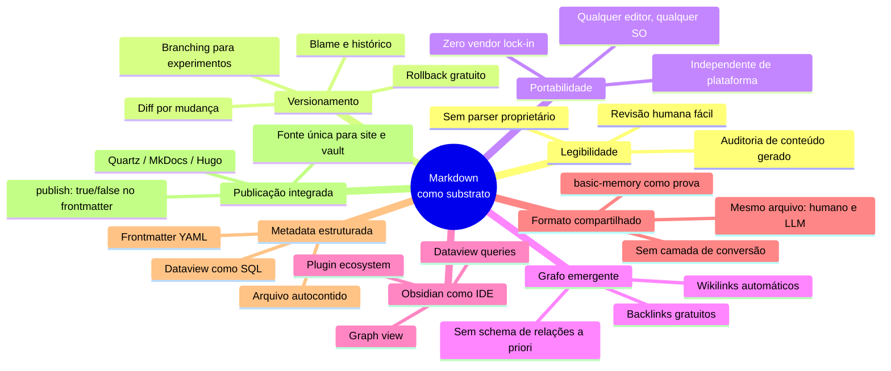

# Por que Obsidian e markdown como substrato

> [!abstract] TL;DR
> Markdown + Obsidian é o substrato natural para memória de agentes em 2026. As razões são concretas: o conteúdo é humano-legível (e quem opera o agente pode revisar o que o LLM escreveu sem ferramenta especializada), versionável em git (diff, blame, rollback gratuitos), portável (zero vendor lock-in), e o grafo emerge sozinho via wikilinks. Obsidian funciona como IDE — graph view, backlinks, dataview — sem ser pesado. O ponto-chave: o **mesmo formato** é lido e escrito tanto por humano quanto por LLM. O servidor [[Dicionário de IA#MCP (Model Context Protocol)|MCP]] `basic-memory` é evidência prática: ele expõe um vault Obsidian para o [[Dicionário de IA#LLM (Large Language Model)|LLM]] sem conversão de formato. Quando o substrato é o mesmo, a colaboração humano↔agente para de exigir tradução.

> [!question]- Dúvidas e lacunas desta nota
> - Dúvida gerada pelo conteúdo: Em sistemas onde múltiplos agentes (não só humanos) escrevem concorrentemente no vault, como se resolve o risco de conflito de merge no git — e existem convenções consolidadas para isso em markdown?
> - Lacuna potencial: A nota trata Obsidian como a ferramenta de referência, mas não discute comparativamente outras IDEs de markdown (VSCode com extensões, Logseq, Notion exportado) — em quais cenários elas competem com Obsidian como substrate IDE?

## O que é

Substrato, no contexto de memória de agentes, é o formato físico em que o conhecimento vive em disco — o nível abaixo da arquitetura de camadas, abaixo do schema, abaixo da estratégia de retrieval. É o que sobra quando se desliga o agente: arquivos. A escolha desse formato decide o que o sistema consegue fazer com baixo atrito e o que vira fricção crônica.

A proposta de markdown como substrato é peculiar por um motivo: é o **mesmo formato textual servindo humano e LLM**, em escrita E em leitura. O humano abre o arquivo num editor qualquer, lê, edita, comenta. O LLM abre o mesmo arquivo, lê, edita, comenta. Não há fase de export, transformação ou projeção entre representações — o que está em disco é o que o agente vê. Não é a única opção viável (vector DB puro, JSON, SQL, knowledge graphs dedicados são alternativas legítimas), mas markdown captura a maior parte do valor com simplicidade radical, e essa simplicidade é o que torna o pattern adotável.

### A analogia com código-fonte

Há uma analogia que clareia por que a escolha não é ingênua. Código-fonte vive em arquivos texto há décadas, mesmo existindo alternativas binárias mais compactas e mais rápidas de parsear. A razão é que arquivos texto legíveis por humano rendem diff legível, blame utilizável, revisão de código possível, histórico auditável. Ninguém propõe armazenar código em binário para ganhar performance de leitura, porque o custo de manutenção seria catastrófico.

[[Andrej Karpathy|Karpathy]] fez exatamente essa analogia ao formular o LLM Wiki Pattern. A frase canônica é "Obsidian is the IDE; the LLM is the programmer; the wiki is the codebase". Trocar markdown por um vector DB opaco seria como compilar o código-fonte e jogar o fonte fora — você ganha velocidade de execução e perde auditabilidade, versionamento e a possibilidade de entender o que está acontecendo em produção.

## Por que importa

A escolha de substrato é uma decisão arquitetural de longa duração — uma vez que a wiki tem milhares de entradas, migrar custa caro. E substrato impacta dimensões que só aparecem com o tempo: legibilidade do conteúdo gerado pelo LLM, versionamento das mudanças, portabilidade entre máquinas e ferramentas, capacidade de revisão humana sob estresse, custo de saída quando o vendor da ferramenta muda termos.

Em sistemas de memória que **evoluem por anos**, esses fatores são amplificados. Um vault que cresce devagar mas continuamente acumula valor exponencial — e qualquer fricção (não conseguir abrir num editor, não ter histórico, não conseguir migrar) compõe junto com o valor. Escolher mal é pesadelo de migração; escolher bem é uma decisão que se paga sozinha.

A evidência prática mais forte vem do servidor `basic-memory` — um servidor MCP que expõe um vault Obsidian diretamente para o LLM. O fato de essa implementação ser viável — de o LLM conseguir ler, escrever e navegar o mesmo vault que o humano usa sem nenhuma camada de conversão — é prova de que o formato não é apenas teoricamente adequado. É operacionalmente adequado, em produção, hoje.

## Como funciona — vantagens enumeradas

São oito vantagens concretas que se reforçam mutuamente. Nenhuma delas isoladamente justifica a escolha; o conjunto, sim.

**1. Humano-legível.** Abrir um arquivo `.md` num editor qualquer e entender o conteúdo sem parser, sem ferramenta proprietária, sem build step. Em sistemas onde o LLM escreve a maior parte do conteúdo, isso é crítico: quem opera precisa **revisar o que o agente produziu** com baixa fricção. Conteúdo ilegível por humano vira caixa-preta — e caixa-preta gerada por LLM é receita para erro silencioso virar dogma.

**2. Versionável em git.** Diff por mudança, rollback de um lint que correu mal, branching para experimentar reorganizações, blame para descobrir quando determinada afirmação entrou. Knowledge base como código — com todas as práticas maduras que o ecossistema git acumulou em duas décadas. Em vector DBs, "diff" não é uma operação natural.

**3. Portável.** Zero vendor lock-in real. Os arquivos abrem em qualquer editor (VSCode, Sublime, Vim, Notepad), em qualquer SO, em qualquer ano. Obsidian é apenas uma das views possíveis sobre o conteúdo — se o Obsidian fechar amanhã, o vault continua acessível. Comparar com uma base proprietária num SaaS que pode mudar API, encerrar o produto ou aumentar preço unilateralmente.

**4. Grafo emergente.** Wikilinks `[[Nota X]]` formam um grafo sem schema explícito de relacionamentos. Backlinks são gratuitos — Obsidian computa quem aponta pra cada nota automaticamente. Diferente de knowledge graphs dedicados (Neo4j, Memgraph), aqui o grafo cresce como subproduto da escrita normal, sem necessidade de modelar entidades e arestas a priori.

**5. Obsidian como IDE.** Graph view para visualização, backlinks no painel lateral, dataview para queries declarativas, plugins para tudo (lint, search semântico, exportadores, integrações com agents). É ferramenta poderosa sem ser pesada — instalação local, sem servidor, arquivos seus. O Obsidian é gratuito para uso pessoal e o Sync é opcional.

**6. Formato compartilhado humano↔LLM.** O mesmo arquivo `.md` é lido e escrito por humano e por agente. Nada de "exportar para o agent" ou "importar a resposta do agent". O servidor `basic-memory` (MCP nativo Obsidian) é prova de conceito viva: aponta o agente para o vault e ele opera diretamente nos arquivos que o humano também edita. Eliminação de fronteira entre formatos é eliminação de bug surface.

**7. Frontmatter como metadata estruturada.** Tags, status, type, datas, aliases, autoria — tudo em YAML no topo do arquivo, sem banco de dados separado. Plugins como dataview consultam esse metadata como se fosse SQL sobre uma tabela. Metadata e conteúdo no mesmo arquivo significa que mover, copiar ou versionar uma nota leva tudo junto, sem joins quebrados.

**8. Compatibilidade com Quartz e static sites.** Publicação direta da wiki via render estático (Quartz, MkDocs, Hugo, Astro). O vault é também a fonte do site público — sem pipeline de export complexo. Notas com `publish: true` viram páginas; notas privadas ficam no vault. Continuidade de formato entre nota privada e página publicada reduz drasticamente o atrito de compartilhar conhecimento.

## Quando NÃO usar markdown

Markdown não é universal. Há cenários em que outro substrato ganha por critérios objetivos.

- **Dados estruturados em escala** — quando o sistema lida com milhões de registros tabulares e queries complexas (joins multi-tabela, agregações, filtros profundos), banco de dados relacional ou de grafo é melhor. Markdown não foi feito pra ser questionado em SQL.
- **Transações ACID** — markdown em arquivos não suporta consistência transacional. Se múltiplos agentes escrevem ao mesmo arquivo concorrentemente, o melhor que se tem é file locking ad-hoc. Sistemas que precisam de garantias de consistência forte (financeiro, regulatório) precisam de DB transacional.
- **Relacionamentos densos com queries de grafo profundas** — quando o caso de uso central é "encontre todos os nodes a 3 hops de X que satisfazem propriedade Y", knowledge graph dedicado (Neo4j, Memgraph, ArangoDB) ganha. Wikilinks dão grafo, mas não dão Cypher.
- **Conteúdo binário pesado** — imagens, vídeos, áudio, datasets grandes. Markdown referencia esses arquivos, mas o storage real precisa estar em outro lugar (filesystem, S3, CDN). Vault Obsidian não é blob storage.

A regra é simples: markdown ganha quando o caso de uso central é **conhecimento conceitual interligado, mantido por humano e LLM, com horizonte de anos**. Para casos fora desse perfil, escolha o substrato adequado e prossiga.

## Armadilhas comuns

> [!warning] Armadilha 1: Vault sem governance vira lixão
> Markdown é simples, mas essa simplicidade não dispensa estrutura. Sem um documento de regras (CLAUDE.md, AGENTS.md ou similar), o LLM espalha conteúdo sem coerência: notas duplicadas, naming divergente, pastas órfãs. Em vector DBs, o schema é obrigatório por design; em markdown, ele é opcional — e essa opcionalidade é tanto a força quanto o risco. Definir convenções de naming, frontmatter obrigatório e taxonomia de tags antes de escalar é o investimento mais barato que existe em sistemas de memória.

> [!warning] Armadilha 2: Wikilinks quebrados acumulam silenciosamente
> Renomear uma nota sem ferramenta adequada quebra wikilinks que apontavam para ela. Obsidian resolve isso ao renomear dentro do vault; mas scripts externos, imports batch ou LLMs que criam links sem verificar o destino introduzem links quebrados que acumulam silenciosamente. Sem lint regular (`Obsidian Linter`, `Broken Link Finder` ou verificação custom), a coerência interna da wiki se desfaz nota a nota, sem alarme. Implementar lint de wikilinks como step de CI ou rotina periódica é práxis obrigatória para vaults em produção.

> [!warning] Armadilha 3: Frontmatter inconsistente trava dataview e automações
> Schema YAML divergente entre notas — `tag` vs `tags`, `created` vs `date`, valores em formatos diferentes — torna queries dataview difíceis ou impossíveis. Pior: quando o LLM escreve frontmatter baseado em exemplos distintos, ele reproduz a inconsistência do corpus. O efeito composto é uma base onde as mesmas queries nunca retornam resultados completos. Definir o schema do frontmatter no documento de regras desde o início — e validá-lo com lint — economiza retrabalho proporcional ao tamanho do vault.

> [!warning] Armadilha 4: Confundir "markdown é simples" com "sem manutenção"
> A simplicidade do substrato não se transfere automaticamente para o sistema. Vault grande exige governance: lint regular, naming convention documentada, taxonomia de tags estável, revisão periódica de conteúdo obsoleto. A ilusão de baixa manutenção seduz na fase de setup e cobra o preço meses depois, quando o vault começou a acumular lixo e o agente recupera informação contraditória com a mesma confiança que recupera o que é correto.

> [!warning] Armadilha 5: Misturar conteúdo público e privado sem separação clara
> Risco real de vazar dados sensíveis numa publicação Quartz ou ao compartilhar o vault. Convenção de `publish: true/false` no frontmatter, isolamento por pasta, ou vaults separados são opções — qualquer uma serve, desde que adotada antes do primeiro vazamento. Em sistemas onde o LLM tem acesso de escrita, ele pode criar notas com `publish: true` por padrão se não houver instrução explícita no schema.

## Como explicar em inglês

> [!tip] Interview quote
> "I use markdown files in Obsidian as my agent's memory substrate — same format read and written by both human and LLM, versioned in git, zero vendor lock-in. The key insight is that when the substrate is shared, collaboration stops requiring translation."

| Português | Inglês |
|-----------|--------|
| substrato | substrate |
| cofre / vault | vault |
| grafo emergente | emergent graph |
| wikilink | wikilink |
| metadados do arquivo | file metadata / frontmatter |
| legível por humano | human-readable |
| versionamento | version control / versioning |
| portabilidade | portability |
| lock-in de fornecedor | vendor lock-in |
| publicação estática | static site publishing |

## O que vem a seguir

Com o substrato escolhido e suas vantagens e limitações compreendidas, a próxima pergunta natural é: o que exatamente se coloca dentro desse substrato e como essas partes se organizam? A [[08 - Arquitetura de um sistema de memória|nota 08]] responde isso: ela descreve os cinco componentes universais de qualquer sistema de memória (ingestão, indexação, retrieval, manutenção e schema/governance) e o write-manage-read loop que os conecta. Substrato é o nível físico; arquitetura é o nível estrutural acima dele. Entender a arquitetura antes de olhar implementações concretas é o que permite comparar ferramentas com critério, em vez de seguir marketing.

## Veja também

- [[06 - O LLM Wiki Pattern (gist do Karpathy)|06 - O LLM Wiki Pattern]] — pattern que adota markdown como substrato deliberado
- [[08 - Arquitetura de um sistema de memória]] — onde o substrato encaixa na arquitetura geral
- [[10 - LLM-knowledge-base (Wendel) — direto do gist|10 - LLM-knowledge-base (Wendel)]] — implementação que usa markdown
- [[13 - basic-memory — MCP nativo Obsidian|13 - basic-memory]] — servidor MCP que opera direto no vault
- [[23 - Guia de implementação do zero]] — como começar com markdown + Obsidian

## Referências

- **Karpathy, gist oficial** — `https://gist.github.com/karpathy/442a6bf555914893e9891c11519de94f` — analogia compiler/source-code/executable; markdown apresentado como escolha deliberada de substrato; "Obsidian is the IDE".
- **basic-memory — Obsidian integration** — `https://docs.basicmemory.com/integrations/obsidian` — argumentos de markdown nativo, leitura/escrita compartilhada humano↔LLM via MCP, ausência de conversão de formato.
- **Obsidian Help** — `https://help.obsidian.md/` — referência oficial sobre wikilinks, frontmatter (Properties), graph view e plugins. Documenta o que torna o Obsidian uma IDE viável para markdown.
- **Quartz documentation** — `https://quartz.jzhao.xyz/` — gerador estático que publica vaults Obsidian, evidência prática de continuidade entre nota privada e página publicada.
