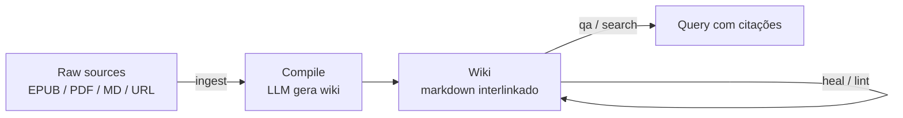

# LLM-knowledge-base (Wendel)

> [!abstract] TL;DR
> `LLM-knowledge-base` é a implementação Python de referência do **LLM Wiki Pattern** do Karpathy, mantida por Wendel em `https://github.com/wendeus0/LLM-knowledge-base`. O mecanismo é um ciclo de quatro etapas — *ingest → compile → Q&A/search → heal/lint* — em que documentos brutos (EPUB, PDF com OCR opcional, web) viram uma wiki markdown compilada por LLM, consultável via busca híbrida (keyword + BM25 + RRF) e mantida por healing/lint automáticos, com um subsistema de claims lifecycle rastreando confiança, supersessão e decaimento de cada afirmação.
> Tecnicamente é notável por manter a separação engine/dados via `KB_DATA_DIR`, integrar com Obsidian através do plugin `obsidian-terminal` e sustentar 311 testes com 90%+ de cobertura e 16 ADRs documentando as decisões de design.
> Vale como **referência canônica em código real** para estudar como o pattern do Karpathy vira software — não como SaaS pronto: é CLI de autor único sob AGPL-3.0, sem SLA, sem suporte e sem UX polida.

> [!question]- Dúvidas e lacunas desta nota
> - Dúvida gerada pelo conteúdo: Como o sistema de claims lifecycle lida com conflitos quando dois documentos ingeridos afirmam coisas contraditórias sobre o mesmo fato — a supersessão é automática ou requer intervenção humana?
> - Lacuna potencial: A nota descreve os módulos em alto nível, mas não mostra exemplos concretos de como o schema de claims JSON-Lines é estruturado na prática, o que seria útil para quem vai implementar variante própria.

## O que é

Imagine ter lido o gist do Karpathy sobre o LLM Wiki Pattern ([[06 - O LLM Wiki Pattern (gist do Karpathy)]]), concordar com a ideia, e então abrir o terminal com uma pergunta prática: "ok, mas como isso vira código de verdade?" Um PDF técnico de 200 páginas está na sua pasta `raw/`. Você roda `kb import-book paper.pdf`, depois `kb compile`, e alguns minutos depois existe uma wiki markdown navegável, com artigos linkados entre si, prontos para consulta via `kb qa "o que esse paper diz sobre X?"`. É exatamente esse percurso — do gist conceitual ao comando de terminal — que o `LLM-knowledge-base` de Wendel documenta em código Python executável, publicado em `https://github.com/wendeus0/LLM-knowledge-base`.

O README descreve o sistema como "engine de knowledge base mantida por [[Dicionário de IA#LLM (Large Language Model)|LLM]]" — coleta documentos brutos, compila-os em uma wiki markdown, responde perguntas contra essa wiki e executa health checks com healing automático. Cada uma das três camadas e três operações do gist tem ponto de entrada explícito na CLI, e o pacote `kb/` é legível para quem quer entender o pattern em código real, não só em prosa.

A separação entre engine e dados é uma escolha arquitetural bem sinalizada. O repositório guarda **apenas** o pacote Python, testes, documentação e exemplos neutros. O *corpus* do usuário — `raw/`, `wiki/`, `outputs/`, `kb_state/` — vive em um diretório externo apontado pela variável de ambiente `KB_DATA_DIR`. Isso evita o erro clássico de misturar código e conteúdo no mesmo repositório e permite reconstruir a wiki do zero a partir do raw imutável quando o schema muda. O frontend recomendado é Obsidian sobre o vault em `KB_DATA_DIR`, com o plugin `obsidian-terminal` rodando comandos `kb` no terminal integrado.

```
Repositório (pacote Python)          KB_DATA_DIR (dados do usuário)
├── kb/                              ├── raw/
│   ├── compile.py                   │   ├── paper.pdf
│   ├── qa.py                        │   ├── artigo.epub
│   ├── search.py                    │   └── notas.md
│   ├── heal.py                      ├── wiki/
│   ├── lint.py                      │   ├── artigo-1.md
│   ├── claims.py                    │   └── artigo-2.md
│   └── cli.py                       ├── outputs/
├── tests/ (311 testes)              │   └── resposta-1.md
└── docs/ (16 ADRs)                  └── kb_state/
                                         └── claims.jsonl
```

Essa separação também facilita versionamento independente: o vault em `KB_DATA_DIR` pode ser um repositório Git separado, permitindo rastrear a evolução do conhecimento compilado ao longo do tempo sem poluir o histórico do código-fonte da engine.

## Por que importa

Para quem está estudando o LLM Wiki Pattern, ler o gist resolve a parte conceitual; ler `kb/` resolve a parte de "como isso vira código". A maioria dos repositórios inspirados no pattern abstrai decisões importantes atrás de frameworks ou esconde lógica em prompts opacos. Aqui, a tradução de cada conceito do gist para Python é direta o suficiente para servir de mapa: módulos com nomes como `compile.py`, `qa.py`, `lint.py` e `heal.py` ecoam um por um as operações descritas pelo Karpathy. Essa transparência é o argumento principal para citar o repositório como referência canônica em uma trilha de estudo do pattern.

Além da fidelidade ao gist, o repositório acrescenta camadas que o gist não detalha mas que qualquer implementação séria precisa: detecção de conteúdo sensível com opt-in explícito (`--allow-sensitive`), commits Git controlados por flag, tracking SQLite de execuções, jobs canônicos agendáveis (`jobs run`, `jobs gate`, `jobs cron`), conformidade documental (`doc-gate`) e handoff estruturado de sessão. Para quem vai construir variante própria, esse conjunto serve como checklist do que falta implementar ao sair do "demo de fim de semana" para algo usável de fato.

A tabela abaixo mapeia os conceitos do gist para os módulos concretos do repositório, o que é o exercício central de leitura do código como tradução do pattern:

| Conceito no gist (Karpathy) | Módulo no repositório (Wendel) | Comando CLI |
|-----------------------------|-------------------------------|-------------|
| Coleta de raw | `web_ingest.py`, `book_import.py` | `kb ingest`, `kb import-book` |
| Compilação para wiki | `compile.py` | `kb compile` |
| Query com traversal | `qa.py`, `router.py` | `kb qa` |
| Busca em artigos | `search.py` | `kb search` |
| Healing estocástico | `heal.py` | `kb heal --n N` |
| Lint de qualidade | `lint.py` | `kb lint` |
| Health gate | `audit.py` | `kb jobs gate` |
| Claims lifecycle | `claims.py` | (interno) |

Essa correspondência um-para-um é o principal argumento para usar o repositório como material de estudo: não é necessário inferir como o pattern vira código — os módulos documentam isso diretamente.

## Como funciona — 4-stage cycle

O ciclo central é descrito no próprio README como `Ingest → Compile → Q&A / Search → Heal / Lint`. Cada estágio tem comando dedicado na CLI Typer.



1. **Ingest** — `kb ingest` adiciona documentos e URLs a `raw/`. O comando `kb import-book` é a porta de entrada para EPUB/PDF, gerando capítulos em markdown; `--ocr` aciona reconhecimento de texto para PDFs escaneados; `--chunk-pages` controla [[Dicionário de IA#chunking|granularidade de chunks]]. Web ingest (`kb ingest <url>`) requer o extra opcional `[web]`.
2. **Compile** — `kb compile` lê `raw/` e produz a wiki em markdown via LLM, em paralelo (`--workers N`). O frontmatter YAML de cada artigo compilado inclui `title`, `topic`, `tags`, `source`, `translated_by`, `reviewed_at`. O guardrail de conteúdo sensível bloqueia compilação por padrão; `--allow-sensitive` é o opt-in explícito.
3. **Q&A / Search** — `kb qa "pergunta"` responde com routing por fonte e *traversal* de wikilinks; `-f` arquiva a resposta como file-back em `outputs/`; `--commit` versiona explicitamente. `kb search "termo"` faz [[Dicionário de IA#hybrid search|busca híbrida]] combinando keyword, [[Dicionário de IA#BM25|BM25]] e *reciprocal rank fusion* (RRF), sem dependência externa de vetor DB.
4. **Heal / Lint** — `kb heal --n N` faz healing estocástico de N arquivos por execução (corresponde à manutenção contínua do gist); `kb lint` faz auditoria da wiki via LLM. Ambos compõem o "health gate" exposto por `kb jobs gate --stale-max-pct ...`, que falha o job quando thresholds configuráveis são violados.

A simetria com o gist é clara: as operações **ingest**, **query** e **lint** do Karpathy aparecem como `ingest`+`compile`, `qa`+`search` e `heal`+`lint`. A divisão extra (compile separado de ingest, heal separado de lint) reflete decisões pragmáticas de Python — separar I/O de chamada LLM, separar correção estocástica leve de auditoria global pesada — sem trair o pattern original.

### Fluxo típico de uma sessão de trabalho

Para concretizar o ciclo, um fluxo real de primeiro uso seria:

```bash
# 1. Configurar o diretório de dados (fora do repo)
export KB_DATA_DIR="$HOME/knowledge-base"
mkdir -p $KB_DATA_DIR

# 2. Adicionar documentos brutos
kb ingest https://example.com/artigo-tecnico
kb import-book paper.pdf --chunk-pages 3

# 3. Compilar a wiki (LLM em paralelo)
kb compile --workers 4

# 4. Consultar com citações
kb qa "Quais são as principais diferenças entre RAG e o LLM Wiki Pattern?" -f

# 5. Manter saúde da wiki (healing estocástico de 5 artigos)
kb heal --n 5

# 6. Auditar via LLM
kb lint

# 7. Jobs em CI ou cron
kb jobs gate --stale-max-pct 15
```

A lógica de separação é: **ingest** só move arquivos e converte formatos; **compile** é a única etapa que consome tokens LLM pesados e produz wiki; **qa/search** fazem leitura; **heal/lint** fazem manutenção. Isso permite usar `kb compile` apenas quando novos documentos chegam, sem reprocessar toda a wiki a cada consulta — custo amortizado ao longo do tempo.

### O papel do schema de artigo

O schema de cada artigo compilado é o que diferencia uma wiki de qualidade de um dump de summaries. O frontmatter YAML padrão gerado pelo `compile.py` inclui:

```yaml
---
title: "Titulo do artigo"
topic: "topico-principal"
tags: [tag1, tag2]
source: "raw/nome-do-arquivo.pdf"
translated_by: "gpt-4o"
reviewed_at: null
---
```

O campo `reviewed_at: null` é o marcador de stale. Quando o health gate encontra mais de N% de artigos com `reviewed_at` nulo ou vencido, o job falha — obrigando revisão periódica. O schema também guia o lint: o LLM sabe o que esperar em cada artigo e reporta desvios em relação ao template esperado.

### Claims lifecycle — o subsistema mais sofisticado

O `claims.py` é o que separa o repositório de uma implementação ingênua do pattern. Em vez de tratar cada artigo da wiki como verdade absoluta e imutável, o sistema mantém um ciclo de vida explícito para afirmações:

```
Estado inicial: DRAFT (confiança baixa, aguardando corroboração)
        ↓
Estado validado: ACTIVE (confiança alta, corroborado por múltiplas fontes)
        ↓
Estado superado: SUPERSEDED (claim mais novo invalida este explicitamente)
        ↓
Estado decaído: STALE (tempo passou sem revisão, confiança caiu abaixo do threshold)
```

Cada claim fica em JSON-Lines em `kb_state/claims.jsonl`, com timestamps UTC, fonte original, score de confiança e referência ao claim que o supera (quando houver). Isso permite responder "o que eu sabia sobre X em março e o que sei agora?" — rastreabilidade temporal sem depender de Git para semântica de conhecimento.

## Anatomia técnica

> [!warning] Detalhes datados — abril de 2026
> Os detalhes desta seção refletem o estado público do `main` em abril de 2026. O repositório está ativo (commits frequentes), então nomes de módulo, contagem de testes e cobertura podem ter mudado — vale revisitar o README e o changelog antes de citar números exatos em entrevista ou documentação própria.

- **Estrutura do pacote.** `kb/` contém os módulos do ciclo (`compile.py`, `qa.py`, `search.py`, `heal.py`, `lint.py`), CLI Typer (`cli.py`), helpers de estado (`state.py`, `audit.py`, `claims.py`), importadores (`book_import.py`, `book_import_core.py`, `book_import_pdf.py`, `web_ingest.py`), routing/grafo (`router.py`, `graph.py`), guardrails, git helper, handoff, conformidade documental e subpacotes `cmds/`, `core/`, `discover/`, `analytics/`. Os dados do usuário vivem em `KB_DATA_DIR`, fora do repositório, com subpastas `raw/`, `wiki/`, `outputs/` e `kb_state/`.
- **Hybrid search sem vetor DB externo.** `search.py` combina keyword, BM25 e *reciprocal rank fusion* — cobertura semântica razoável sem operar Pinecone, Qdrant ou Weaviate. Custo computacional pago em CPU local.
- **Claims lifecycle.** `claims.py` implementa o ciclo de vida das afirmações — confiança, supersessão explícita (claims novos invalidam antigos) e decaimento. Entradas em JSON-Lines em `kb_state/`, timestamps em UTC. É o subsistema que persiste *meta-conhecimento* sobre o que está atualizado, obsoleto ou pedindo revisão.
- **Importadores EPUB/PDF/Web.** `book_import.py` é a *facade* sobre `book_import_core.py` e `book_import_pdf.py`. PDFs textuais usam o extra `[pdf]`; escaneados, `[ocr]`; web ingest, `[web]`. A modularização por extras opcionais mantém a instalação base enxuta.
- **Health gate.** `kb jobs gate --stale-max-pct N` falha quando o vault tem mais que N% de páginas stale — útil em CI ou crons noturnos. `kb jobs cron` imprime bloco de cron sugerido.
- **Git integration explícita.** Por padrão, comandos que escrevem **não** comitam — alteração local pura. `--commit` versiona; `--no-commit` continua sendo *no-op* válido. É o oposto do "commit automático silencioso".
- **Obsidian compatibility.** Frontmatter YAML padronizado, wikilinks, integração via plugin `obsidian-terminal` documentada em `docs/OBSIDIAN.md`. Sintetiza com [[07 - Por que Obsidian e markdown como substrato]].
- **Tests.** O README declara **311 testes passando e 90%+ de cobertura** (baseline 22/abr/2026). Por módulo: `git.py` 100%, `cli.py` 98%, `client.py` 97%, `book_import_core.py` 97%, `compile.py` 91%.
- **Stack.** Python 3.11+, Typer + Rich, OpenAI SDK (OpenCode Go, OpenAI oficial, modelos locais), armazenamento em JSON, markdown e SQLite. Lint com ruff. Licença AGPL-3.0.

### Busca híbrida sem vector DB — como funciona na prática

O `search.py` implementa a combinação de três sinais para produzir um ranking final sem depender de banco vetorial externo:

```
Consulta do usuário
        │
        ├── Keyword match ──────── score_k (match literal)
        │
        ├── BM25 ───────────────── score_b (tf-idf probabilístico)
        │
        └── RRF (Reciprocal Rank Fusion) ──── score_final
                 score_final = Σ 1/(k + rank_i)  para cada lista i
```

O **BM25** (Best Match 25) é um modelo probabilístico que pondera frequência do termo no documento versus frequência no corpus inteiro — penalizando documentos muito longos que contêm a palavra muitas vezes só por serem compridos. O **RRF** funde os rankings das listas independentes sem precisar normalizar scores absolutos: dado que documento X está na posição 3 da lista de keyword e na posição 7 da lista BM25, o score final combina os ranks, não as magnitudes.

O resultado é cobertura razoável com apenas CPU local. A desvantagem é que busca semântica real (vetores) ainda é melhor para consultas onde o usuário usa sinônimos ou descreve o conceito sem citar o termo exato. Para esse caso, o roadmap do repositório prevê embeddings + RAG híbrido como item futuro.

### ADRs — as decisões de design documentadas

O repositório mantém 16 ADRs (Architecture Decision Records) em `docs/adr/`, numerados 0001–0016. Essa é uma prática de engenharia raramente vista em projetos pessoais sob licença aberta do tamanho do `LLM-knowledge-base`. Os ADRs cobrem escolhas como:

- Por que AGPL-3.0 (e não MIT ou Apache-2.0)
- Por que SQLite para tracking de execuções (e não um arquivo JSON plano)
- Por que BM25+RRF em vez de embeddings (custo e dependência zero)
- Por que `KB_DATA_DIR` separado do pacote Python (versionabilidade e reprodutibilidade)
- Por que Typer (e não Click ou argparse)

Ler os ADRs antes de fork ou extensão poupa retrabalho: muitas decisões que parecem "óbvias de mudar" têm rationale documentado sobre por que foram feitas assim. O `docs/API.md` com ~813 linhas complementa com referência completa da CLI e da Python API.

## Integração prática com agentes

O `LLM-knowledge-base` foi desenhado para uso humano direto via CLI, mas pode alimentar agentes como memória externa de longo prazo:

1. **Agente compila a wiki a partir de fontes autorizadas.** O agente usa `kb compile` periodicamente (ou via webhook) para manter a wiki atualizada. Os documentos em `raw/` são a fonte de verdade imutável.
2. **Agente consulta via `kb qa` ou Python API.** Em vez de embeddings em tempo real, o agente busca na wiki pré-compilada. Latência de consulta é baixa; custo de LLM é pago na compilação.
3. **Health gate bloqueia deploy se wiki está stale.** Em pipeline CI, `kb jobs gate --stale-max-pct 15` falha o job quando mais de 15% das páginas estão desatualizadas — forçando compilação antes de servir o agente em produção.
4. **Claims lifecycle rastreia o que o agente "acredita".** O agente pode consultar `kb_state/claims.jsonl` para saber quais afirmações têm alta confiança versus quais estão marcadas como STALE ou SUPERSEDED — e propagar essa incerteza nas respostas ao usuário.

## Quando usar / quando não usar

**Quando vale considerar:**

- O objetivo é estudar o **LLM Wiki Pattern em código real**. O repositório serve como tradução fiel do gist para Python, com nomes de módulo que ecoam os termos do Karpathy.
- Pretende construir variante própria em Python e prefere começar de uma base com TDD/SDD já estabelecidos a partir do zero.
- O caso de uso requer importação de **EPUB/PDF**, inclusive escaneados (OCR), e integração com Obsidian — esses fluxos estão prontos.
- Tolera UX *rougher* — é CLI Typer, não SaaS polido. A curva de adoção exige conforto com terminal, variáveis de ambiente e edição de YAML.
- Quer self-host AGPL-3.0 explícito, sem dependência de vendor ou cloud obrigatória.

**Quando NÃO vale:**

- Procura solução pronta com UX limpa — [[13 - basic-memory — MCP nativo Obsidian|basic-memory]] resolve melhor o caso "abrir Obsidian e funcionar" via MCP nativo, sem exigir CLI separada.
- Não conhece Python o suficiente para estender. O pattern é simples, mas customizar `compile.py`, ajustar prompts ou alterar o esquema de claims requer leitura de código.
- O caso pede SaaS gerenciado — Mem0 e Zep cobrem cenários enterprise com integrações prontas; ver [[09 - Panorama de implementações (abril 2026)|09 - Panorama]].
- Stack já é LangChain/LangGraph e a equipe quer um plug-in nativo — LangMem encaixa melhor sem adicionar uma CLI separada.
- O domínio é regulatório/legal/normativo onde síntese automática mascara nuances jurídicas. Markdown puro com revisão humana ainda é o caminho.

## Armadilhas comuns

> [!warning] Confundir referência com produto pronto
> O maior risco ao adotar o repositório é tratá-lo como SaaS — com SLAs, equipe de suporte e roadmap previsível. É código de um único autor sob AGPL-3.0; útil como referência e como base, **não** como produto. Quem precisa de garantias contratuais deve buscar Letta, Mem0 ou Zep, e quem precisa só de Obsidian deve olhar basic-memory antes.

> [!warning] `KB_DATA_DIR` mal configurado é bug silencioso
> Se a variável de ambiente apontar para um diretório inexistente ou errado, `kb` cria uma estrutura nova no local apontado sem emitir aviso claro. O resultado é um vault fantasma preenchido em paralelo ao vault real. Validar o caminho antes da primeira execução com `echo $KB_DATA_DIR && ls $KB_DATA_DIR` é higiene básica — especialmente em ambientes com múltiplos projetos ou containers com volumes montados.

> [!warning] AGPL-3.0 em produto comercial
> Qualquer fork do repositório servido em rede — mesmo internamente — precisa publicar o código-fonte sob a mesma licença. Isso é incompatível com SaaS proprietário fechado ou com produtos onde a engine de knowledge base é parte do diferencial competitivo. Ler a licença antes de embutir o código é obrigação, não opcional. Licenças alternativas (Apache-2.0, MIT) estão em OpenKB e graphify.

> [!warning] Lint pass sem schema vira teatro
> `kb lint` chama LLM contra a wiki e reporta problemas — mas a qualidade da auditoria é proporcional à especificidade do schema. Schema vago aceita qualquer coisa como "bem formado". A inovação real do pattern continua sendo o schema de artigo, não a automação de lint. Definir regras claras de coerência, formato de claims e critérios de stale antes de ativar o job de lint é o que separa o health gate funcional do relatório de lint que ninguém lê.

- **Subestimar dependência de OCR.** O extra `[ocr]` puxa toolchain pesada (Tesseract, libs nativas). Em containers minimal ou máquinas corporativas, a instalação pode virar projeto à parte. Avaliar se EPUBs ou PDFs textuais já cobrem o caso antes de habilitar.
- **Cobertura de testes alta não é garantia de adequação.** 311 testes em 90%+ cobrem cenários *do autor*, não os seus. Modos de uso fora do trilho documentado podem expor caminhos não testados.

## Como explicar em inglês

> [!tip] Interview quote
> "LLM-knowledge-base is a Python CLI that turns Karpathy's LLM Wiki Pattern into executable code: raw documents flow through an ingest-compile-query-heal cycle, with hybrid search (BM25 + RRF) and a claims lifecycle that tracks confidence and supersession — all without an external vector database."

| Português | Inglês |
|-----------|--------|
| ciclo de quatro etapas | four-stage cycle |
| claims lifecycle | claims lifecycle (confiança = confidence, supersessão = supersession, decaimento = decay) |
| busca híbrida | hybrid search |
| healing estocástico | stochastic healing |
| health gate | health gate |
| cobertura de testes | test coverage |
| variável de ambiente | environment variable |
| separação engine/dados | engine/data separation |
| importadores de livro | book importers |
| fusão por rank recíproco | reciprocal rank fusion (RRF) |
| reconhecimento óptico de caracteres | optical character recognition (OCR) |
| conformidade documental | document conformance / doc-gate |
| handoff de sessão | session handoff |
| artigos da wiki | wiki pages / wiki articles |
| registro de execuções | execution tracking |
| conteúdo sensível | sensitive content |
| guardrail de segurança | safety guardrail |
| travessia de wikilinks | wikilink traversal |

**Frases úteis para contextualizar em entrevista:**

- *"The system separates the engine from the data — the Python package is versioned independently from the knowledge corpus, which lives in `KB_DATA_DIR`."*
- *"Claims have a lifecycle: they start as drafts, become active when corroborated, and decay over time unless explicitly reviewed — it's semantic versioning for facts, not just for code."*
- *"Hybrid search combines keyword matching, BM25 probabilistic ranking, and reciprocal rank fusion to produce results without spinning up an external vector database."*

## O que vem a seguir

A nota 10 mostrou como o LLM Wiki Pattern se transforma em código real com o `LLM-knowledge-base` de Wendel — foco em fidelidade ao gist, separação engine/dados e claims lifecycle. O próximo passo natural é comparar com uma implementação que aposta em uma adição concreta: o **PageIndex**. A nota 11 explora o **OpenKB**, da VectifyAI, que empacota o mesmo pattern como CLI instalável via `pip`, mas acrescenta suporte nativo a documentos longos por meio de uma árvore hierárquica de páginas — sem precisar de vector DB externo. Entender o PageIndex é entender como a família Karpathy-inspired resolve o problema de contexto longo antes de apostar em embeddings.

Depois de ver o `LLM-knowledge-base` como referência canônica de código e o OpenKB como implementação polida com documentos longos, a nota 12 fecha o trio mostrando uma terceira direção: substituir o substrato markdown por um **knowledge graph** — o que muda quando a consulta deixa de ser "qual artigo da wiki responde isso?" e vira "qual caminho no grafo conecta esses dois conceitos?".

## Veja também

- [[06 - O LLM Wiki Pattern (gist do Karpathy)]] — pattern original que esta nota implementa
- [[09 - Panorama de implementações (abril 2026)|09 - Panorama]] — onde o repositório se posiciona em relação às outras famílias
- [[11 - OpenKB — wiki compilada com PageIndex|11 - OpenKB]] — outra implementação CLI do pattern, com foco em PageIndex e documentos longos
- [[13 - basic-memory — MCP nativo Obsidian|13 - basic-memory]] — alternativa Karpathy-inspired mais polida no front Obsidian
- [[23 - Guia de implementação do zero]] — usar `kb/` como referência ao implementar variante própria
- [[RAG e Vector Databases]] — fundamentos de hybrid search, BM25 e RRF que aparecem aqui
- [[07 - Por que Obsidian e markdown como substrato]] — escolha de substrato que o repositório adota

## Referências

- **Repositório oficial** — `https://github.com/wendeus0/LLM-knowledge-base` — engine Python sob AGPL-3.0, README em PT com versão `README.en.md` em inglês. URL confirmado via `gh api repos/wendeus0/LLM-knowledge-base` em abril de 2026.
- **Karpathy, gist oficial** — `https://gist.github.com/karpathy/442a6bf555914893e9891c11519de94f` — pattern original que o repositório implementa.
- **Documentação interna do repo** — `docs/architecture/ARCHITECTURE.md`, `docs/API.md` (referência CLI + Python API, ~813 linhas), `docs/OBSIDIAN.md`, `docs/adr/` (16 ADRs numerados 0001–0016) — material de aprofundamento publicado dentro do próprio repositório.
- **README — seção "Stack" e "Roadmap"** — declara explicitamente Python 3.11+, Typer, Rich, OpenAI SDK, busca BM25+RRF sem dependência externa, e roadmap com itens já entregues e pendentes ([[Dicionário de IA#embedding|embeddings]] + [[Dicionário de IA#RAG (Retrieval-Augmented Generation)|RAG]] híbrido, multi-agent specialization).
