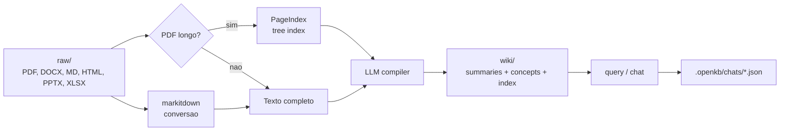

# OpenKB

> [!abstract] TL;DR
> **OpenKB** (`github.com/VectifyAI/OpenKB`) é uma implementação open-source do **LLM Wiki Pattern** em forma de CLI Python: documentos brutos entram em `raw/`, são convertidos por `markitdown`, documentos longos passam por **PageIndex** e o LLM compila uma wiki markdown em `wiki/` com `summaries/`, `concepts/`, `index.md`, `log.md` e `AGENTS.md`. O diferencial em relação a implementações mais simples do pattern é a aposta explícita em **long document retrieval vectorless** via PageIndex, multimodalidade e chat interativo com sessões persistidas em `.openkb/chats/*.json`. Encaixa bem como **memória longa documental** para agentes e pesquisa, mas ainda não substitui uma memory layer conversacional tipo Mem0/Letta: a sessão é salva como histórico, não como fatos duráveis curados automaticamente.

> [!question]- Dúvidas e lacunas desta nota
> - Dúvida gerada pelo conteúdo: O PageIndex usa uma árvore hierárquica para navegar documentos longos sem embeddings — mas como o LLM decide quais nós da árvore expandir para responder uma pergunta? É um processo de poda beam-search ou iteração completa da árvore?
> - Lacuna potencial: A nota descreve a sessão de chat como histórico JSON persistido, mas não explica como o sistema decide o que promover de `wiki/explorations/` para `wiki/concepts/` — essa curadoria é manual ou há alguma heurística automática?

## O que é

OpenKB se apresenta como "Open LLM Knowledge Base": um sistema de CLI que transforma documentos em uma wiki estruturada, interlinkada e mantida por [[Dicionário de IA#LLM (Large Language Model)|LLM]]. A ideia é a mesma família conceitual do [[06 - O LLM Wiki Pattern (gist do Karpathy)|LLM Wiki Pattern]]: em vez de fazer [[Dicionário de IA#RAG (Retrieval-Augmented Generation)|RAG]] tradicional sobre [[Dicionário de IA#chunking|chunks]] a cada pergunta, o sistema **compila conhecimento uma vez** em páginas persistentes — resumos, conceitos, cross-links e índice — e usa essa wiki como substrato de consulta e evolução.

A arquitetura padrão criada por `openkb init` é deliberadamente legível:

- `raw/` — arquivos originais adicionados pelo usuário
- `wiki/sources/` — conversões para texto/markdown e fontes extraídas
- `wiki/summaries/` — resumo por documento
- `wiki/concepts/` — sínteses transversais entre documentos
- `wiki/explorations/` — respostas salvas e transcripts exportados
- `wiki/reports/` — relatórios de lint
- `wiki/AGENTS.md` — instruções/schema da wiki para o LLM
- `.openkb/` — estado operacional, configuração, hashes e sessões de chat

O ponto arquitetural mais interessante é que OpenKB não tenta ser apenas "Obsidian com bot". Ele adiciona uma camada de processamento para documentos longos: PDFs a partir de um limiar configurável passam por PageIndex, que cria uma árvore hierárquica de páginas/seções. O LLM navega essa árvore em vez de carregar o PDF inteiro no contexto. Isso diferencia OpenKB de soluções markdown-first mais simples como [[13 - basic-memory — MCP nativo Obsidian|basic-memory]] e de engines mais diretas do gist como [[10 - LLM-knowledge-base (Wendel) — direto do gist|LLM-knowledge-base]]. Para o aprofundamento técnico em PageIndex como padrão de RAG, ver [[RAG e Vector Databases|13 - PageIndex — RAG vectorless por árvore de documentos]].

### Como o PageIndex resolve o problema de contexto longo

O problema de documentos longos no LLM Wiki Pattern é preciso: um PDF de 200 páginas não cabe na janela de contexto do LLM de compilação. As soluções usuais são (a) chunking fixo com embeddings para recuperar os chunks relevantes, ou (b) sumarização hierárquica em cascata. O PageIndex adota uma terceira via — **recuperação raciocinada por árvore**:

```
Documento longo (ex.: paper de 150 páginas)
         │
         ▼
    Árvore de PageIndex
    ├── Capítulo 1 (resumo do capítulo)
    │   ├── Seção 1.1 (resumo da seção)
    │   └── Seção 1.2 (resumo da seção)
    ├── Capítulo 2
    │   ├── Seção 2.1
    │   └── Seção 2.2 ...
    └── ...

    Query: "Qual é o mecanismo de atenção proposto?"
         │
         ▼
    LLM navega a árvore: descarta capítulos irrelevantes,
    expande apenas Seção 2.3, lê o conteúdo completo dessa seção.
```

O LLM recebe o sumário da raiz, decide quais capítulos/seções são relevantes, expande apenas esses nós e lê o texto completo só onde necessário. Isso evita o custo de embeddings e o problema de chunks que cortam conceitos no meio, mas requer um modelo suficientemente capaz de raciocinar sobre a estrutura do documento — um modelo fraco que não consegue navegar a árvore vai ler partes irrelevantes ou perder seções-chave.

### Estrutura de sessão de chat — anatomia do JSON

Cada sessão de chat fica em `<kb>/.openkb/chats/<id>.json` com a seguinte estrutura:

```json
{
  "id": "abc123",
  "created_at": "2026-05-06T14:32:00Z",
  "updated_at": "2026-05-06T15:10:22Z",
  "model": "gpt-4o",
  "language": "pt",
  "title": "Análise de papers sobre RAG",
  "turn_count": 7,
  "history": [...],
  "user_turns": ["Pergunta 1", "Pergunta 2", ...],
  "assistant_texts": ["Resposta 1", "Resposta 2", ...]
}
```

A separação entre `history` (lista completa para o Agents SDK), `user_turns` e `assistant_texts` (texto limpo para exportação) é deliberada: o histórico completo contém tool calls, resultados de tools e metadados internos; os textos limpos são o que o usuário lê e exporta para `wiki/explorations/`. A sanitização de imagens (substituição de payloads `data:` por placeholders) evita que sessions com imagens explodam o tamanho do arquivo JSON.

### Watch mode e rebuild incremental

`openkb watch ./raw` observa o diretório e dispara compilação quando arquivos novos chegam. O comportamento é diferente para cada tipo:

- **Documentos curtos** (abaixo do limiar de PageIndex): recompilados imediatamente, custo de LLM pequeno.
- **Documentos longos** (PDFs acima do limiar): o watch **notifica** que há re-pass pendente, mas não dispara o LLM de forma silenciosa — o usuário precisa rodar `openkb add <arquivo>` explicitamente para controlar custo.

Essa diferença de comportamento entre curto e longo é uma decisão de UX importante: watch automático em corpus grande com muitos PDFs poderia gerar custos inesperados de LLM. O sistema prefere ser explícito no custo caro e automático no custo barato.

## Por que importa

- **É o [[Andrej Karpathy|Karpathy]] pattern empacotado como CLI instalável.** `pip install openkb`, `openkb init`, `openkb add`, `openkb query`, `openkb chat` deixam o pattern acessível sem escrever a própria engine.
- **Resolve melhor documentos longos que o wiki pattern mínimo.** PageIndex reduz o problema de [[Dicionário de IA#Context window|contexto longo]], contexto podre e sumarização rasa em PDFs grandes. Para pesquisa bibliográfica, relatórios e livros, isso é vantagem real.
- **Mantém o resultado em markdown.** A wiki final é auditável por humano, versionável em Git e compatível com Obsidian, preservando o argumento de [[07 - Por que Obsidian e markdown como substrato]].
- **Tem sessão interativa persistida.** `openkb chat` mantém histórico multi-turn retomável por `--resume`, lista sessões e permite exportar transcript para `wiki/explorations/`.
- **Evita vector DB externo.** A proposta de PageIndex é retrieval raciocinado/vectorless; isso reduz infra, embora não elimine custo de LLM nem complexidade de indexação.

## Como funciona



O ciclo operacional é:

1. **Inicializar.** `openkb init` cria `raw/`, `wiki/`, `.openkb/config.yaml`, `wiki/AGENTS.md`, `wiki/index.md` e `wiki/log.md`.
2. **Adicionar documentos.** `openkb add <arquivo_ou_dir>` converte formatos suportados via `markitdown`. PDFs longos são indexados por PageIndex; documentos curtos são lidos integralmente pelo LLM.
3. **Compilar wiki.** O agente gera um resumo do documento, lê conceitos existentes, cria ou atualiza conceitos, atualiza índice e log. Um único documento pode tocar várias páginas.
4. **Consultar.** `openkb query "pergunta"` faz uma pergunta pontual contra a wiki. Com `--save`, salva a resposta em `wiki/explorations/`.
5. **Conversar.** `openkb chat` abre REPL multi-turn. A sessão carrega `session.history` como input para o Agents SDK e salva o novo histórico depois de cada turno.
6. **Manter.** `openkb lint` roda checks estruturais e semânticos; `openkb watch` observa `raw/` e compila arquivos novos automaticamente.

## Anatomia técnica

Os itens abaixo refletem o estado público do repositório em 06/05/2026.

- **Pacote.** `openkb`, versão `0.1.3`, Python `>=3.10`, licença Apache-2.0.
- **Stack.** PageIndex `0.3.0.dev1`, `markitdown[all]`, Click, watchdog, LiteLLM, OpenAI Agents SDK, PyYAML, python-dotenv, json-repair, prompt_toolkit e Rich.
- **Multi-LLM.** Configuração via LiteLLM em `.openkb/config.yaml`; exemplos do README usam OpenAI, Anthropic e Gemini. A variável genérica é `LLM_API_KEY`, propagada para env vars específicas quando necessário.
- **Schema editável.** `wiki/AGENTS.md` define estrutura e convenções da wiki. O runtime lê o arquivo do disco, então alterações no schema passam a valer sem recompilar o pacote.
- **Sessões.** Cada chat fica em `<kb>/.openkb/chats/<id>.json`. O arquivo guarda `id`, timestamps, modelo, idioma, título, contagem de turnos, `history`, `user_turns` e `assistant_texts`.
- **Sanitização de imagens.** O histórico do Agents SDK é persistido via `RunResult.to_input_list()`, mas payloads `data:` de imagens retornadas por tools são substituídos por placeholders textuais com instrução de re-chamar `get_image` se necessário.
- **Gestão de sessão.** `openkb chat --resume`, `--list` e `--delete` permitem retomar, listar e apagar sessões. Prefixos únicos de id são aceitos.
- **Tools de wiki.** O agente lê arquivos markdown, lista diretórios, consulta páginas específicas convertidas para JSON, lê imagens como data URL e escreve arquivos markdown dentro do root da wiki com proteção contra path traversal.
- **Estado de ingestão.** `.openkb/hashes.json` evita reprocessar arquivos já adicionados.

## Onde ele fica na trilha

OpenKB pertence à família **Karpathy-inspired**, mas ocupa uma posição intermediária:

| Sistema | Melhor leitura |
|---|---|
| [[10 - LLM-knowledge-base (Wendel) — direto do gist|LLM-knowledge-base]] | implementação direta do gist, boa para estudar o pattern por dentro |
| **OpenKB** | CLI pronta para compilar documentos longos em wiki com PageIndex |
| [[12 - graphify — knowledge graph de raw|graphify]] | aposta graph-first sobre raw heterogêneo |
| [[13 - basic-memory — MCP nativo Obsidian|basic-memory]] | memória markdown via MCP para agentes interativos |

O eixo decisivo é: **OpenKB é uma knowledge base documental compilada**, não uma memória conversacional universal. Ele é muito bom quando o agente precisa consultar um corpo de documentos e manter sínteses legíveis. É menos adequado quando o problema principal é lembrar preferências de usuário, fatos extraídos de conversas ou estado incremental multi-user.

## Quando usar / quando não usar

**Quando vale:**

- Pesquisa sobre corpus de documentos longos — papers, relatórios, livros, documentação técnica.
- Necessidade de wiki markdown/Obsidian como artefato final, não só retrieval invisível.
- Preferência por evitar vector DB externo.
- Workflow CLI local-first com LLM configurável por LiteLLM.
- Agente que precisa de uma memória longa **documental** e auditável.
- Exploração do LLM Wiki Pattern com suporte pronto a documentos longos e multimodalidade.

**Quando NÃO vale:**

- Memória conversacional personalizada por usuário, com extração automática de fatos salientes a cada turno. Para isso, [[15 - Mem0 — vetorial + grafo|Mem0]], [[14 - Letta (ex-MemGPT)|Letta]] ou [[16 - Zep e Graphiti — knowledge graph temporal|Zep/Graphiti]] estão mais próximos do problema.
- Multi-user enterprise com ACL, audit trail formal e compliance. OpenKB é CLI/local-first, não plataforma de governança.
- Caso que exige API server estável para plugar em produto. O README não posiciona OpenKB como serviço backend; a superfície principal é CLI.
- Volume massivo de coleção com reindexação, permissões e lifecycle corporativo. O roadmap ainda lista storage database-backed e web UI como futuros.
- Ambientes onde PageIndex, markitdown e dependências de conversão multimodal são pesadas demais para o deployment.

## Armadilhas comuns

> [!warning] Confundir chat persistido com memória semântica
> `.openkb/chats/*.json` guarda o histórico de turno-a-turno da sessão — é o equivalente de um log de conversa, não um sistema de fatos extraídos e curados. Preferências do usuário, decisões tomadas e achados importantes não migram automaticamente para `wiki/concepts/`. Sem uma política explícita de o que promover de exploração para conceito, a knowledge base fica estática enquanto o histórico de chat cresce sem integração.

> [!warning] "Sem vector DB" não significa "sem infra cognitiva"
> PageIndex troca embeddings por uma árvore de recuperação raciocinada pelo LLM. Isso elimina a necessidade de Pinecone, Qdrant ou Weaviate, mas introduz custo de LLM na indexação de cada documento longo e cria dependência de um modelo suficientemente capaz de navegar a árvore. Em prática, o custo é trocado de "tokens de embedding barato + infra externa" para "tokens de reasoning mais caros + tempo de indexação".

> [!warning] Schema fraco em AGENTS.md compromete toda a wiki
> A qualidade dos conceitos gerados é proporcional à qualidade do schema em `wiki/AGENTS.md`. Um schema vago que não especifica o que é um "conceito", como deve ser linkado a outros, qual é o formato esperado ou quando um conceito deve ser dividido em dois produz uma wiki inconsistente — e `openkb lint` vai reportar superficialmente porque o LLM de lint segue o mesmo schema vago. Escrever o `AGENTS.md` bem é a decisão de design mais importante do sistema.

> [!warning] Estado alpha em produção é aposta de risco calculado
> O pacote `openkb 0.1.3` está marcado como "Development Status :: 3 - Alpha". A API CLI pode mudar entre versões menores, o formato de `.openkb/chats/*.json` pode quebrar em atualizações e funcionalidades do roadmap (web UI, storage database-backed, multi-user) ainda não existem. Para protótipos e pesquisa pessoal o risco é aceitável; para infraestrutura de produto, pin na versão exata e teste de regressão antes de atualizar são obrigatórios.

- **Misturar memória de pesquisa com memória de produto.** Uma knowledge base pessoal pode tolerar correções manuais e inconsistências transitórias; memória de usuário em produção não pode.
- **Ignorar estado alpha.** O pacote está em `0.1.3` e o classifier do projeto marca "Development Status :: 3 - Alpha". Bom para estudar e prototipar; prudência antes de vender como infraestrutura estável.
- **Não versionar a wiki.** Como o agente escreve markdown, Git é o mecanismo natural de auditoria. Sem histórico, um rewrite ruim de conceito pode passar despercebido.

## Integração prática com memória de agentes

Se eu fosse usar OpenKB como parte de uma arquitetura de agente, separaria três camadas:

1. **Histórico de sessão curto.** Usar o próprio `.openkb/chats/*.json` ou a memória nativa do framework para retomar conversas recentes.
2. **Explorações episódicas.** Exportar respostas e transcripts relevantes para `wiki/explorations/`, com data, pergunta, decisões e pendências.
3. **Memória semântica durável.** Promover manualmente ou por pipeline controlado os achados estáveis para `wiki/concepts/`, evitando que todo turno de conversa vire conhecimento permanente.

Essa separação impede o erro "gravar tudo é lembrar tudo". OpenKB deve ser visto como **compilador de conhecimento documental**; a camada de política — o que entra, o que vira conceito, o que expira — ainda precisa ser desenhada.

A tabela abaixo compara os tipos de dado gerenciados por cada camada e o risco de confundi-las:

| Camada | Artefato OpenKB | Característica | Risco se confundida |
|--------|----------------|----------------|---------------------|
| Histórico curto | `.openkb/chats/*.json` | Efêmero, por sessão | Não é memória semântica |
| Exploração episódica | `wiki/explorations/` | Resposta pontual exportada | Não substitui síntese de conceito |
| Conhecimento durável | `wiki/concepts/` | Síntese estável, curada | Requer política de promoção explícita |
| Documentação de fontes | `wiki/summaries/` | Resumo por documento | Não é o conhecimento integrado |

A política de promoção — quando um achado de exploração vira conceito permanente — é o ponto de design mais negligenciado por usuários iniciantes. Sem ela, `wiki/concepts/` para de crescer e `wiki/explorations/` vira um arquivo de outputs sem síntese.

### Comparação com LLM-knowledge-base (Wendel) para decisão de escolha

Quem veio da nota anterior pode estar se perguntando: qual dos dois usar? A diferença principal não é de qualidade, mas de ênfase:

| Aspecto | LLM-knowledge-base | OpenKB |
|---------|-------------------|--------|
| Documentos longos | Chunking por página configurável | PageIndex (árvore hierárquica) |
| Claims lifecycle | Sim (claims.jsonl) | Não (sem tracking de confiança) |
| Sessão de chat | Não nativo | Sim (`openkb chat --resume`) |
| Busca | Hybrid (BM25 + RRF) | Via LLM sobre a wiki |
| Licença | AGPL-3.0 | Apache-2.0 |
| Estado | Projeto ativo, 1 autor | Alpha 0.1.3, VectifyAI |
| Multi-LLM | OpenAI SDK + local | LiteLLM (qualquer provider) |

Se o caso de uso principal é **pesquisa bibliográfica com PDFs longos e chat multi-turn**, OpenKB ganha. Se o caso de uso é **implementação de referência para estudar o pattern** ou **claims tracking para rastreabilidade de conhecimento**, `LLM-knowledge-base` ganha.

## Como explicar em inglês

> [!tip] Interview quote
> "OpenKB is a CLI that implements the LLM Wiki Pattern with a key addition: PageIndex, which builds a hierarchical tree over long documents so the LLM can navigate them without loading the entire content into context — no external vector database required."

| Português | Inglês |
|-----------|--------|
| wiki compilada | compiled wiki |
| índice de páginas | page index |
| sessão interativa | interactive chat session |
| documentos longos | long documents |
| recuperação sem vetores | vectorless retrieval |
| conversão de formato | format conversion |
| histórico de turno | turn history |
| schema da wiki | wiki schema |
| exportar transcript | export transcript |
| estado de ingestão | ingestion state |
| hashes de arquivo | file hashes |
| lint estrutural e semântico | structural and semantic lint |
| retomar sessão | resume session |
| travessia de wikilinks | wikilink traversal |
| proteção contra path traversal | path traversal protection |
| compilação uma vez | compile once |
| política de promoção | promotion policy |
| árvore hierárquica | hierarchical tree |
| estado alpha | alpha state |
| múltiplos provedores de LLM | multi-LLM / multi-provider |

**Frases úteis para contextualizar em entrevista:**

- *"OpenKB separates two types of knowledge: compiled knowledge in `wiki/concepts/` (stable, curated) and exploratory knowledge in `wiki/explorations/` (ephemeral answers and transcripts). The distinction prevents every query from polluting long-term memory."*
- *"PageIndex is an alternative to chunking: instead of splitting a PDF into fixed-size segments and embedding them, it builds a hierarchical outline and lets the LLM decide which sections to read for a given query — trading embedding infrastructure for reasoning cost."*
- *"The `AGENTS.md` file is the most important design decision: it's the schema the LLM uses to structure wiki articles, and weak schemas produce weak wikis regardless of model quality."*

## O que vem a seguir

A nota 11 mostrou o OpenKB como implementação polida do LLM Wiki Pattern com foco em documentos longos via PageIndex — o substrato continua sendo markdown, mas a recuperação abandona embeddings em favor de raciocínio hierárquico. A nota 12 dá o passo mais radical da família: **graphify** substitui o próprio substrato markdown por um knowledge graph, mudando a pergunta fundamental de "qual artigo da wiki responde isso?" para "qual caminho no grafo conecta esses conceitos?". Entender essa troca — markdown legível por humano versus grafo queryable por máquina — prepara para a decisão de design que mais divide as implementações do pattern.

Graphify também leva a proposta além do texto: código, áudio, vídeo e imagens entram como cidadãos de primeira classe, o que abre casos de uso que nem o `LLM-knowledge-base` nem o OpenKB cobrem bem.

## Veja também

- [[06 - O LLM Wiki Pattern (gist do Karpathy)]] — pattern conceitual que OpenKB operacionaliza
- [[07 - Por que Obsidian e markdown como substrato]] — por que a saída em markdown importa
- [[08 - Arquitetura de um sistema de memória]] — vocabulário ingestão, indexação, retrieval e manutenção
- [[09 - Panorama de implementações (abril 2026)|09 - Panorama]] — mapa das implementações
- [[10 - LLM-knowledge-base (Wendel) — direto do gist|10 - LLM-knowledge-base]] — implementação Python mais direta do gist
- [[RAG e Vector Databases|13 - PageIndex — RAG vectorless por árvore de documentos]] — técnica de retrieval para documentos longos usada pelo OpenKB
- [[12 - graphify — knowledge graph de raw|12 - graphify]] — alternativa graph-first
- [[13 - basic-memory — MCP nativo Obsidian|13 - basic-memory]] — alternativa MCP/markdown para agentes
- [[22 - Críticas, limitações e armadilhas]] — riscos de benchmarks, hype e memória persistente mal governada
- [[23 - Guia de implementação do zero]] — como construir variante própria

## Referências

- Repositório oficial — `https://github.com/VectifyAI/OpenKB` (verificado em 06/05/2026; Apache-2.0; Python; README com arquitetura, comandos e roadmap).
- README oficial — seções *What is OpenKB*, *How OpenKB Works*, *Interactive Chat*, *AGENTS.md* e *The Stack*.
- `pyproject.toml` — pacote `openkb` versão `0.1.3`, dependências principais (`pageindex==0.3.0.dev1`, `markitdown[all]`, `litellm`, `openai-agents`) e classifier alpha.
- `openkb/agent/chat_session.py` — persistência de sessões em `.openkb/chats/*.json` e sanitização de payloads de imagem.
- `openkb/agent/chat.py` — REPL multi-turn, `/save`, `/clear`, `/add`, `/lint`, `--resume`, streaming e gravação do histórico via `session.record_turn(...)`.
- `openkb/agent/tools.py` — tools de leitura/escrita da wiki com proteção de path traversal.
- PageIndex — `https://github.com/VectifyAI/PageIndex` — sistema de document index vectorless usado por OpenKB para documentos longos; ver nota dedicada em [[RAG e Vector Databases|13 - PageIndex — RAG vectorless por árvore de documentos]].
