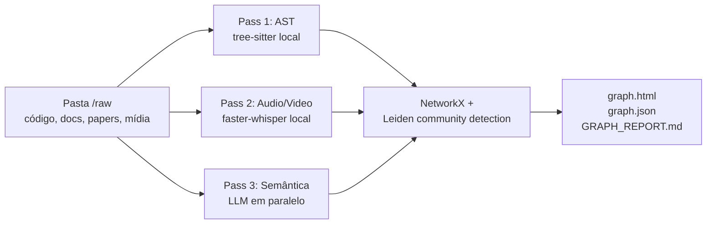

# graphify

> [!abstract] TL;DR
> `graphify` (`github.com/graphify-labs/graphify`) transforma uma pasta `/raw` — código, docs, papers, imagens, áudio e vídeo — em um **knowledge graph queryable**. Descrito pelo autor como "the answer to Karpathy's `/raw` folder", leva o pattern para substrato gráfico em vez de markdown: em vez de compilar uma wiki legível, constrói um grafo `NetworkX` clusterizado com Leiden community detection. O diferencial é o **substrato**, não a extração em si — a pergunta deixa de ser "qual artigo cobre isso?" e vira "qual caminho no grafo conecta A a B?", o que abre multi-hop reasoning (`shortest_path`, `get_neighbors`) impossível em markdown puro. Integra como skill/hook em Claude Code, Codex, Cursor, Gemini CLI e mais de 15 outras plataformas via slash command `/graphify .`. Saídas: `graph.html` (vis.js), `graph.json` (queryable) e `GRAPH_REPORT.md` (sumário de god nodes e comunidades). Promete cerca de **71,5x menos tokens por query** vs ler arquivos brutos — número auto-reportado, não auditado; e o hook que injeta o grafo antes de cada busca é conveniente mas também o ponto onde um grafo desatualizado engana o assistente com confiança.

> [!question]- Dúvidas e lacunas desta nota
> - Dúvida gerada pelo conteúdo: O Leiden community detection é aplicado sobre o grafo completo após o semantic pass, ou de forma incremental a cada arquivo processado? Isso afeta diretamente o custo de rebuild no watch mode.
> - Lacuna potencial: A nota menciona que `graphify merge-graphs` combina grafos cross-repo, mas não explica como conflitos de nós com mesmo nome em repos diferentes são resolvidos — por merge de arestas, por prefixo de origem ou por escolha do usuário.

## O que é

Imagina uma pasta `/raw` depois de seis meses de uso real: 40 papers em PDF, uma dúzia de screenshots de tweets, transcrições de podcast, e um monorepo com centenas de arquivos Python e TypeScript — tudo largado ali sem estrutura, do jeito que Karpathy descreve a própria pasta no gist original. Uma pergunta simples como "o que esse projeto usa pra autenticação, e isso conecta com o que o paper 3 dizia sobre rate limiting?" exige que o assistente abra dezenas de arquivos, um a um, pra montar a resposta na cabeça — cada leitura consome tokens e o contexto se esvai antes de chegar à segunda metade da pergunta.

É esse o problema que o `graphify` ataca. Em vez de compilar uma wiki em markdown a partir do `/raw`, como [[10 - LLM-knowledge-base (Wendel) — direto do gist|LLM-knowledge-base]] faz, o repositório constrói um grafo `NetworkX`, clusteriza com **Leiden community detection** e exporta artefatos consumíveis pelo assistente de código. A pergunta acima vira uma chamada `shortest_path("AuthService", "rate_limiting")` — o assistente não relê o corpus, consulta o caminho já extraído. O posicionamento como sucessor explícito do `/raw` aparece literalmente no README — "Andrej Karpathy keeps a `/raw` folder where he drops papers, tweets, screenshots, and notes. graphify is the answer to that problem". É uma versão **graph-based** do [[06 - O LLM Wiki Pattern (gist do Karpathy)|LLM Wiki Pattern]].

O foco é **mixed-media**, não só markdown: código (extração AST via tree-sitter em cerca de 25 linguagens), documentos, papers, imagens (Claude vision), áudio e vídeo (transcritos localmente com `faster-whisper`). É instalado como **skill** do assistente de código — `/graphify` no [[Dicionário de IA#Claude Code|Claude Code]]/Cursor/Gemini CLI/Aider/Antigravity, `$graphify` no Codex — e roda em cima de qualquer pasta. Licença MIT, pacote PyPI `graphifyy` (com duplo y; o pacote `graphify` no PyPI é de outro projeto).

## Por que importa

- **Mostra que o LLM Wiki Pattern não precisa ser só markdown.** O substrato pode ser knowledge graph; a pergunta deixa de ser "qual artigo da wiki cita isso?" e vira "qual caminho no grafo conecta A a B?".
- **Eficiência de token é argumento concreto para escala.** O autor reporta cerca de 71,5x menos tokens por query vs ler arquivos brutos. Sinal, não número auditado, mas em codebases grandes muda a economia de uso do assistente.
- **Integração nativa com IDEs traz o pattern para o workflow diário.** `graphify` se instala como skill com hook que dispara antes de cada `Glob`/`Grep` no Claude Code, antes de cada Bash no Codex, antes de cada leitura no Gemini CLI. Quando existe `graphify-out/`, o assistente é instruído a consultar o grafo em vez de varrer arquivos.
- **Confidence tagging explícito.** Cada relação é rotulada `EXTRACTED`, `INFERRED` ou `AMBIGUOUS` — responde à crítica recorrente de KGs gerados por LLM ("o que foi visto vs inventado") sem esconder o problema.

### Por que knowledge graph em vez de markdown?

A mudança de substrato de markdown para grafo não é estética — ela muda o que é possível perguntar ao sistema:

| Tipo de consulta | Markdown (wiki) | Knowledge graph |
|-----------------|-----------------|-----------------|
| "O que é X?" | Ótimo (artigo dedicado) | Bom (nó com atributos) |
| "Como X e Y estão relacionados?" | Razoável (links manuais) | Ótimo (path no grafo) |
| "Quais conceitos são mais centrais?" | Ruim (exige leitura humana) | Ótimo (grau dos nós = god nodes) |
| "Quais arquivos implementam X?" | Ruim (sem AST) | Ótimo (AST pass → call graph) |
| "O que conecta áudio e código no corpus?" | Inexistente | Possível (cross-modal edges) |
| "Leitura humana do resultado" | Ótimo | Ruim (JSON/HTML, não texto) |
| "Edição manual de conteúdo" | Fácil | Frágil (editar JSON de grafo é perigoso) |

O graphify aposta que, para casos de uso orientados a assistente de código — onde a consulta é feita pela máquina, não pelo humano lendo — a troca de legibilidade humana por eficiência de máquina vale a pena. Para casos onde a wiki é também um produto legível por humanos (documentação, Obsidian pessoal, blog), o custo da ilegibilidade do grafo é alto demais.

### Anatomia do confidence tagging

Cada aresta do grafo `graph.json` carrega três campos-chave:

```json
{
  "source": "AuthService",
  "target": "UserRepository",
  "relation": "depends_on",
  "confidence": "EXTRACTED",
  "confidence_score": 1.0,
  "evidence": "AuthService.__init__ importa UserRepository em auth.py linha 12"
}
```

```json
{
  "source": "AuthService",
  "target": "SecurityPolicy",
  "relation": "semantically_similar_to",
  "confidence": "INFERRED",
  "confidence_score": 0.72,
  "evidence": "Ambos tratam de controle de acesso segundo contexto semântico"
}
```

A distinção importa em pipelines automáticos: filtrar para `confidence == "EXTRACTED"` antes de usar arestas em decisão técnica é prudência básica. A tag `AMBIGUOUS` sinaliza que o LLM detectou relação mas não conseguiu categorizar com confiança — vale revisão manual antes de promover a inferência.

## Como funciona — 3-pass processing



O README descreve o pipeline em três passes:

1. **AST pass — determinístico, local, sem [[Dicionário de IA#LLM (Large Language Model)|LLM]].** `tree-sitter` extrai estrutura de código: classes, funções, imports, call graph (cross-file em todas as linguagens suportadas), docstrings e comentários de rationale. Instantâneo, não consome tokens.
2. **Audio/video pass — local.** Vídeos e áudios são transcritos com `faster-whisper`, usando *prompt* domain-aware derivado dos *god nodes* do corpus (segundo o README, melhora reconhecimento de termos técnicos). Transcrições ficam em cache em `graphify-out/transcripts/`. Áudio nunca sai da máquina.
3. **Semantic pass — LLM em paralelo.** Subagentes (Claude por padrão, ou outro modelo conforme a plataforma) processam docs, papers, imagens e transcrições para extrair conceitos, relacionamentos e design rationale. Os resultados são fundidos em um grafo `NetworkX`, clusterizado com **Leiden community detection** e exportado.

O clustering é **topológico, não baseado em [[Dicionário de IA#embedding|embeddings]]** — o README é explícito: "Clustering is graph-topology-based — no embeddings". Edges semânticas (`semantically_similar_to`) extraídas pelo LLM e marcadas `INFERRED` já estão no grafo e influenciam a detecção de comunidade diretamente, eliminando dependência de [[Dicionário de IA#vector database|vector DB]].

### O que é um god node e por que importa

Um **god node** é um nó com grau de conectividade muito acima da média — a entidade que aparece referenciada por dezenas ou centenas de outras no corpus. Em uma codebase Python, `BaseModel` ou `session` podem ser god nodes. Em um corpus de papers sobre IA, `attention mechanism` ou `transformer` provavelmente são.

O `GRAPH_REPORT.md` gerado pelo graphify lista os god nodes explicitamente porque eles têm duplo papel: são os conceitos mais influentes do corpus (útil para entender o domínio) e são os pontos de falha mais perigosos para o raciocínio do agente (um god node mal extraído propaga erro para todos os nós conectados). Ver os god nodes na primeira execução do graphify é o equivalente a ler os módulos mais importados de uma codebase — diz muito sobre a arquitetura antes de mergulhar nos detalhes.

### Integração IDE — como o hook PreToolUse funciona na prática

A integração mais diferenciada do graphify é o hook `PreToolUse` no Claude Code. Quando instalado (`graphify hook install`), ele injeta uma instrução em `CLAUDE.md` que diz ao assistente: "antes de usar `Glob` ou `Grep` para procurar código, consulte o `GRAPH_REPORT.md` e `graph.json` se estiverem disponíveis."

O resultado prático é:

```
Sem graphify:
  Pergunta: "Qual classe implementa autenticação?"
  Assistente: Glob("**/*.py") → lê dezenas de arquivos → responde

Com graphify atualizado:
  Pergunta: "Qual classe implementa autenticação?"
  Assistente: lê GRAPH_REPORT.md → encontra nó "AuthService" com
  tipo EXTRACTED → confirma com get_node("AuthService") → responde
  sem varrer o filesystem
```

O ganho reportado de ~71,5x menos tokens vem exatamente desse atalho: em vez de ler N arquivos para encontrar uma informação, o assistente lê o nó relevante do grafo. O risco, como discutido nas armadilhas, é que o ganho inverte quando o grafo está desatualizado.

### Fluxo completo de uso — primeiro setup e uso cotidiano

**Primeira execução:**

```bash
# Instalar (duplo "y" é obrigatório)
uv tool install graphifyy

# Rodar no projeto (processa tudo)
graphify ./meu-projeto

# Instalar hook no Claude Code
graphify hook install

# Verificar outputs gerados
ls graphify-out/
# graph.html  graph.json  GRAPH_REPORT.md  cache/  transcripts/
```

**Uso cotidiano:**

```bash
# Watch mode para rebuild incremental
graphify watch ./src

# Consultar via MCP server (em outro terminal)
python -m graphify.serve graph.json

# Cross-repo (combinar grafos)
graphify merge-graphs projeto-a/graph.json projeto-b/graph.json \
  --output merged.json

# Clonar e indexar repo público
graphify clone https://github.com/algum-repo/projeto
```

**Em entrevista técnica, o diferencial para apresentar:**

O graphify resolve o problema de "o assistente de código não sabe o que está no monorepo sem ler tudo" de forma estrutural — não prompt engineering, mas indexação prévia que amortiza o custo de entendimento do corpus. O confidence tagging (`EXTRACTED`/`INFERRED`/`AMBIGUOUS`) é a resposta defensável à pergunta "como você garante que o grafo não alucinaria relacionamentos?".

**Exemplo de query via MCP server:**

```python
# MCP server expõe 4 ferramentas principais
# query_graph — busca semântica no grafo
# get_node — detalhes de um nó específico
# get_neighbors — vizinhos diretos de um nó
# shortest_path — caminho mais curto entre dois nós

# Exemplo de uso via agente com MCP
resultado = mcp.query_graph("autenticação e autorização")
caminho = mcp.shortest_path("AuthService", "AuditLog")
vizinhos = mcp.get_neighbors("UserRepository", depth=2)
```

Isso permite que um agente faça multi-hop reasoning sem carregar arquivos: "qual é o caminho de dependência entre AuthService e AuditLog?" vira uma chamada `shortest_path`, não uma varredura de imports.

## Anatomia técnica

Os itens abaixo refletem o estado público do README de `graphify-labs/graphify` (antes `safishamsi/graphify` — o repositório foi transferido para a organização Graphify-Labs) em julho de 2026. Nesta revisão (default branch `v8`, ~79 mil estrelas), a contagem de linguagens e a integração com plataformas já haviam crescido em relação à nota original de abril; ver ressalvas em cada item abaixo. O repositório segue ativo (push no dia da checagem), portanto vale revisitar a fonte primária antes de decisões críticas.

- **Construção do grafo.** `NetworkX` para representação; **Leiden community detection** para clustering por densidade de aresta, sem embeddings nem vector DB externo. A similaridade semântica entra como aresta `INFERRED` extraída no semantic pass, não como busca em espaço vetorial.
- **Visualização.** `graph.html` é gerado com `vis.js`, abrível em qualquer browser, com clique em nó, busca e filtro por comunidade.
- **Linguagens suportadas.** ⚠ Cresceu desde a checagem original: já são **36 gramáticas tree-sitter** (README fala em cross-file links resolvidos em "~40 linguagens", contando variantes que reaproveitam gramática — `.mts`/`.cts` reusam TypeScript, `.cc`/`.cxx`/CUDA/`Metal` reusam C++), ante as ~25 registradas em abril de 2026. Além do conjunto original (Python, JS/TS, Go, Rust, Java, C/C++, Ruby, C#, Kotlin, Scala, PHP, Swift, Lua, Zig, PowerShell, Elixir, Objective-C, Julia, Verilog/SystemVerilog, Vue, Svelte, Dart), README atual lista SQL, Fortran, Delphi/Pascal, Groovy/Gradle, shell, JSON e formatos de projeto .NET (`.csproj`, `.xaml`, `.razor`). Java mantém extração extra de `extends`/`implements`. Call graph é cross-file em todas.
- **Outputs canônicos.** `graphify-out/graph.html` (visualização interativa), `graph.json` (grafo persistido, queryable em sessões futuras), `GRAPH_REPORT.md` (sumário de god nodes, comunidades, conexões surpreendentes e perguntas sugeridas) e `cache/` (cache SHA256 — re-runs só processam arquivos alterados).
- **Integração com IDEs — slash command + always-on.** ⚠ Confirmado ainda válido, com a lista de plataformas ampliada: `/graphify .` (ou `$graphify .` no Codex) roda em qualquer assistente compatível — o README atual soma "Claude Code, Cursor, Codex, Gemini CLI, GitHub Copilot, e 15+ mais". Para deixar a integração *always-on*, comandos de plataforma injetam regras: Claude Code escreve seção em `CLAUDE.md` e instala **PreToolUse hook** que dispara antes de `Glob`/`Grep`/leitura de arquivo; Codex usa `AGENTS.md` + PreToolUse hook em `.codex/hooks.json` (disparando antes de todo `Bash`); OpenCode usa plugin `tool.execute.before`; Cursor escreve `.cursor/rules/graphify.mdc` com `alwaysApply: true` (sem hook); Gemini CLI usa `GEMINI.md` + `BeforeTool` hook. CodeBuddy replica o mecanismo do Claude Code (`CODEBUDDY.md` + PreToolUse hook); Factory Droid e Trae usam o próprio `Task`/Agent tool para dispatch paralelo — Trae não suporta `PreToolUse`, ficando só com `AGENTS.md`. OpenClaw e Aider ainda fazem extração sequencial (suporte a agente paralelo é recente nessas plataformas) e dependem de `AGENTS.md` como mecanismo always-on.
- **Confidence tagging.** Cada aresta é rotulada como `EXTRACTED` (encontrada literalmente), `INFERRED` (inferência razoável, com confidence score) ou `AMBIGUOUS` (sinalizada para revisão). O README enfatiza: "You always know what was found vs guessed".
- **Watch mode.** `graphify watch ./src` faz auto-rebuild conforme arquivos mudam. Para código, AST é instantâneo; para docs/papers, o sistema notifica que há re-pass semântico pendente — o disparo do LLM fica explícito. `graphify hook install` adiciona git hook que rebuilda no commit e no branch switch.
- **Token efficiency claim.** "**71.5x fewer tokens per query vs reading raw files**" — citação direta do README, **auto-reportada** pelo autor. Útil como ordem de grandeza, não como número auditado.
- **Team-friendly.** `graphify-out/` é projetado para commit no repositório — um teammate roda `/graphify .`, comita, e os outros recebem `GRAPH_REPORT.md` no `git pull`. `.graphifyignore` (sintaxe de `.gitignore`) exclui paths. O README sugere `.gitignore` para `manifest.json` (mtime-based, inválido pós-clone) e `cost.json` (tracking local).
- **Comandos avançados.** `graphify clone <github-url>` clona repo público e roda pipeline; `graphify merge-graphs g1.json g2.json ...` combina grafos cross-repo, taggeando cada nó pela origem; `graphify --mcp` ou `python -m graphify.serve graph.json` expõe [[Dicionário de IA#MCP (Model Context Protocol)|MCP]] server com `query_graph`, `get_node`, `get_neighbors`, `shortest_path`. Exportação para Neo4j via `--neo4j`.
- **Stack e licença.** Python 3.10+, MIT, via `uv tool install graphifyy`, `pipx install graphifyy` ou `pip install graphifyy`. Extras `[video]`, `[office]`, `[ocr]`.

## Quando usar / quando não usar

**Quando vale considerar:**

- Corpus **misturado** — codebase grande + papers + slides + vídeos + screenshots — onde nenhum substrato puramente textual cobre tudo bem. É o ponto onde graphify se diferencia de basic-memory ou LLM-knowledge-base.
- Workflow já em IDE com slash commands — Claude Code, Cursor, Codex, Gemini CLI. A integração via PreToolUse/BeforeTool/rules é a parte mais polida do projeto.
- Multi-hop reasoning sobre relações importa mais que leitura humana do conteúdo. Knowledge graph responde "o que conecta X a Y via 3 saltos?" muito melhor que markdown.
- Ganho de tokens em escala é argumento concreto. Em codebase com centenas de arquivos consultados repetidamente, mesmo metade do número reportado já é material.
- Licença permissiva é requisito — MIT é mais leve que AGPL-3.0 de basic-memory ou LLM-knowledge-base.

**Quando NÃO vale:**

- Conteúdo majoritariamente markdown puro. [[10 - LLM-knowledge-base (Wendel) — direto do gist|LLM-knowledge-base]] ou basic-memory são mais simples e mais legíveis para humanos.
- Workflow não passa por Claude Code, Cursor, Codex ou outro assistente compatível. Sem a integração, sobra um CLI Python comum.
- Q&A simples sobre poucos docs. RAG tradicional ou Claude Project com `CLAUDE.md` resolve com menos infraestrutura.
- Requisito é manter contexto **humano-revisável** com edição manual constante. `graph.json` é estrutura de dados, não documento — menos legível que markdown e frágil a edição manual.
- Domínio exige auditoria forte de cada inferência. As tags `INFERRED`/`AMBIGUOUS` ajudam, mas auditar manualmente cada aresta de um grafo grande é proibitivo.

## Armadilhas comuns

> [!warning] "71,5x menos tokens" é claim do autor, não auditoria
> O número está no README e é repetido em divulgação do projeto. Não há, na data desta nota, benchmark público auditado externamente que reproduza a métrica. Em escolha técnica séria, validar com pipeline próprio antes de citar como fato. Tratar como ordem de grandeza, não como medida fechada.

> [!warning] Hook PreToolUse com grafo desatualizado inverte o benefício
> O ganho de eficiência do graphify depende de `GRAPH_REPORT.md` e `graph.json` estarem sincronizados com o estado atual do corpus. Se o PreToolUse hook estiver ativo e o grafo estiver desatualizado — porque novos arquivos foram adicionados sem rodar `graphify` de novo — o assistente vai ler o grafo antigo com confiança, perdendo contexto novo e potencialmente respondendo com informação obsoleta. `graphify watch` e `graphify hook install` ajudam, mas não eliminam a janela de desatualização entre um commit e o próximo rebuild.

> [!warning] `graph.json` no repositório pode crescer e dificultar diffs
> O README recomenda commitar `graphify-out/` para que teammates recebam o grafo via `git pull`. Em corpus grandes ou com muitos arquivos de mídia transcritos, `graph.json` pode passar de MBs rapidamente. Diffs de JSON estruturado em Git são praticamente ilegíveis e aumentam o tamanho do repositório. Vale avaliar `.gitignore` específico para `graph.json` com geração automatizada no CI, ou usar `graphify-out/GRAPH_REPORT.md` (texto legível) como o único artefato commitado.

- **Knowledge graph parece mais "smart" do que é.** Leiden é heurística topológica — encontra comunidades por densidade de aresta. Não há "compreensão" embutida; clusterização é tão boa quanto a qualidade das arestas extraídas pelo semantic pass. Lixo entrando, comunidade gerada vira lixo etiquetado bonito.
- **`graph.json` no repositório pode crescer rápido.** Watch mode + commits frequentes + corpus grande inflam o arquivo, e diff em git de JSON estruturado é ruim. Avaliar `.gitignore` específico ou regeneração no CI antes de aceitar o padrão recomendado pelo README.
- **`INFERRED` em produção é pegadinha.** A tag indica "inferência razoável" — o que parece ok em exploração pode estar errado em decisão técnica. Em pipelines automáticos, considerar filtrar para só `EXTRACTED`.
- **Hook PreToolUse é invasivo por design.** O ganho depende de `GRAPH_REPORT.md` estar atualizado. Grafo desatualizado + hook ativo = assistente lendo informação obsoleta com confiança. `graphify hook install` ajuda mas não elimina o risco.
- **Pacote PyPI tem nome confundível.** Oficial é `graphifyy` (dois "y"). `graphify` no PyPI é de outro projeto. Erro de digitação instala software errado.
- **AST pass não cobre tudo.** Cerca de 25 linguagens é amplo, mas não universal. Erlang/OCaml/Haskell/Clojure/Nim ou DSLs internas ficam fora — viram texto bruto no semantic pass, perdendo a precisão do AST.
- **Custo de LLM no semantic pass cresce com o corpus.** Cache SHA256 ajuda em re-runs, mas a primeira indexação de corpus grande é cara. `--update` re-extrai só arquivos alterados; vale planejar antes de rodar em monorepo.

## Como explicar em inglês

> [!tip] Interview quote
> "graphify converts a raw folder — code, docs, papers, audio, and video — into a queryable knowledge graph using three passes: deterministic AST extraction via tree-sitter, local audio transcription via faster-whisper, and parallel LLM semantic extraction. The result is a NetworkX graph with Leiden community detection, where every edge is tagged as EXTRACTED, INFERRED, or AMBIGUOUS — so you always know what was found versus what was guessed."

| Português | Inglês |
|-----------|--------|
| grafo de conhecimento | knowledge graph |
| detecção de comunidade | community detection |
| aresta do grafo | graph edge |
| nó do grafo | graph node |
| god node | god node (nó de alta centralidade) |
| confiança da inferência | inference confidence |
| tag de confiança | confidence tag |
| passe semântico | semantic pass |
| extração de AST | AST extraction |
| call graph entre arquivos | cross-file call graph |
| substrato gráfico | graph substrate |
| integração com IDE | IDE integration |
| hook de pré-ferramenta | pre-tool use hook |
| modo de observação | watch mode |
| servidor MCP | MCP server |
| detecção topológica de comunidades | topology-based community detection |
| corpus heterogêneo | heterogeneous corpus / mixed-media corpus |
| rebuild incremental | incremental rebuild |
| cache de transcrição | transcription cache |
| aresta semântica | semantic edge |
| path no grafo | graph path |
| centralidade do nó | node centrality |
| grafo cross-repo | cross-repo graph |
| pipeline de três passes | three-pass pipeline |

**Frases úteis para contextualizar em entrevista:**

- *"graphify is positioned as 'the answer to Karpathy's `/raw` folder' — instead of compiling a markdown wiki, it builds a knowledge graph, which shifts the query paradigm from 'which wiki article covers this?' to 'what path in the graph connects these two concepts?'"*
- *"The three-pass pipeline separates deterministic from stochastic work: AST is local and free, audio transcription is local but slow, and semantic extraction costs LLM tokens but is cached via SHA256."*
- *"The confidence tagging system — EXTRACTED, INFERRED, AMBIGUOUS — is a direct response to the criticism that LLM-generated knowledge graphs hallucinate relationships. It doesn't eliminate the problem, but it makes the uncertainty visible."*
- *"Leiden community detection is topology-based — it finds dense clusters of nodes without embeddings. The semantic similarity edges extracted by the LLM in the semantic pass are what feed the topological structure, so the quality of clustering depends on the quality of the LLM extraction, not on any vector representation."*
- *"The integration story is the most polished part: graphify installs as a PreToolUse hook in Claude Code, a BeforeTool hook in Gemini CLI, and an AGENTS.md rule everywhere else — meaning the assistant consults the graph before scanning files, which is where the token efficiency claim comes from."*

## O que vem a seguir

A nota 12 fecha o trio das implementações Karpathy-inspired que apostam em substrato diferente: do markdown fiel ao gist (nota 10), passando por markdown com PageIndex para documentos longos (nota 11), até o knowledge graph mixed-media (nota 12). As três notas juntas respondem a pergunta "como o LLM Wiki Pattern vira código?" com três respostas diferentes — e a escolha entre elas depende do corpus, do workflow e de quanto se valoriza legibilidade humana versus eficiência de máquina.

A próxima nota do galho introduce o **basic-memory**, que abandona a proposta de compilação periódica e adota uma abordagem reativa: em vez de construir uma wiki a partir de documentos brutos, basic-memory persiste fatos extraídos de conversas diretamente em markdown, servidos como contexto de agente via protocolo MCP nativo no Obsidian. É a inversão da direção: onde graphify vai do corpus para o grafo, basic-memory vai da conversa para a nota — e a memória cresce incrementalmente a cada turno, não em batch.

O contraste entre os dois modelos — batch compilation vs. incremental conversation — é o eixo conceitual mais importante para decisões de arquitetura de memória de agentes. Entender os dois antes de escolher é o que separa uma decisão técnica informada de uma preferência de ferramenta.

## Veja também

- [[06 - O LLM Wiki Pattern (gist do Karpathy)]] — pattern original que `graphify` estende em substrato gráfico
- [[09 - Panorama de implementações (abril 2026)|09 - Panorama]] — onde graphify se posiciona na família Karpathy-inspired
- [[10 - LLM-knowledge-base (Wendel) — direto do gist|10 - LLM-knowledge-base]] — alternativa markdown-based ao mesmo problema
- [[16 - Zep e Graphiti — knowledge graph temporal|16 - Zep e Graphiti]] — outro KG, com foco em raciocínio temporal em vez de mixed-media
- [[19 - A-MEM — Zettelkasten dinâmico]] — KG acadêmico com Zettelkasten dinâmico
- [[23 - Guia de implementação do zero]] — como integrar `graphify` em um sistema próprio

## Referências

- **Repositório oficial** — `https://github.com/graphify-labs/graphify` (transferido de `safishamsi/graphify` para a organização Graphify-Labs) — licença MIT, default branch `v8` em julho de 2026 (era `v5` em abril). Metadados reverificados via `gh api repos/Graphify-Labs/graphify` e README oficial reinspecionado em julho de 2026 para atualizar os claims técnicos desta nota (contagem de linguagens, lista de plataformas).
- **Site oficial** — `https://graphifylabs.ai/` (linkado no README).
- **Pacote PyPI** — `https://pypi.org/project/graphifyy/` (duplo "y"). O CLI e o slash command continuam sendo `graphify`.
- **Karpathy gist do LLM Wiki Pattern** — pattern que graphify cita explicitamente como motivação. Detalhado em [[06 - O LLM Wiki Pattern (gist do Karpathy)]].
- **`tree-sitter`** (`https://tree-sitter.github.io/`) e **`faster-whisper`** (`https://github.com/SYSTRAN/faster-whisper`) — bibliotecas usadas, respectivamente, no AST pass e no audio/video pass.
- **Leiden community detection** — Traag, Waltman & van Eck (2019), *From Louvain to Leiden: guaranteeing well-connected communities*. Algoritmo usado para clustering topológico do grafo.
