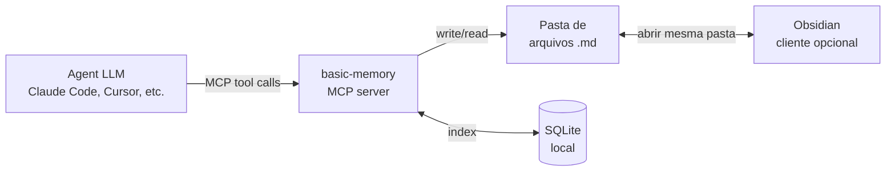

# basic-memory

> [!abstract] TL;DR
> `basic-memory` (`github.com/basicmachines-co/basic-memory`) é um **[[Dicionário de IA#MCP server|MCP server]]** mantido pela basicmachines-co que mantém uma memória persistente de agentes em **arquivos `.md` numa pasta local**, com **SQLite** indexando estrutura e busca em background. A integração com Obsidian é por **compatibilidade de formato**, não por plugin: como ambos consomem markdown, abrir a mesma pasta no Obsidian permite leitura e edição humana do conteúdo escrito pelo agent. **Não é um plugin Obsidian** — o Obsidian não foi modificado, extendido ou estendido; é cliente opcional do mesmo diretório. O servidor padroniza convenções de markdown — frontmatter com `permalink`, observações estruturadas tipo `- [tipo] conteúdo #tag (contexto)` e relações `- relacao [[outra-nota]]` — para que o markdown vire grafo traversable. Licença AGPL-3.0, Python 3.12+, distribuído via PyPI e imagem Docker.

> [!question]- Dúvidas e lacunas desta nota
> - Dúvida gerada pelo conteúdo: Como o basic-memory lida com conflitos de edição quando um humano e um agente editam o mesmo arquivo markdown simultaneamente? O SQLite tem algum mecanismo de lock?
> - Lacuna potencial: A nota poderia detalhar mais sobre as convenções específicas de `Observations` e `Relations` com exemplos concretos de markdown gerado pelo agente, incluindo como o grafo traversable funciona na prática com `memory://` URLs.

## O que é

Toda sessão nova com um agente de IA começa do zero. Você passa a tarde de sexta decidindo, junto com o Claude Code, a arquitetura de um módulo — e na segunda-feira o agente não lembra de nada: nem a decisão, nem o porquê dela. Colar o histórico inteiro a cada sessão não escala, e um resumo manual perde nuance. O problema de fundo é onde guardar essa memória entre sessões de um jeito que sobreviva à troca de ferramenta, seja auditável por um humano e não prenda o usuário a um formato proprietário. `basic-memory` responde com a opção mais simples possível: em vez de um banco vetorial opaco que só o agente consegue ler, a memória vira **arquivos `.md` numa pasta comum** — legíveis em qualquer editor, versionáveis em git, portáveis para qualquer outro sistema sem migração. É um **servidor [[Dicionário de IA#MCP (Model Context Protocol)|MCP]]** que dá essa memória persistente a [[Dicionário de IA#LLM (Large Language Model)|LLMs]] compatíveis (Claude Desktop, Claude Code, Cursor, VS Code com MCP, etc.), gravando o conteúdo das conversas em arquivos markdown locais. O servidor expõe um conjunto de ferramentas — `write_note`, `read_note`, `search_notes`, `edit_note`, `build_context`, entre outras — que o LLM invoca via MCP para criar, ler, editar, mover ou deletar notas. Cada nota é um arquivo `.md` na pasta configurada (por padrão `~/basic-memory`), com frontmatter padronizado e corpo seguindo convenções semânticas explícitas.

A persistência acontece em duas camadas: o markdown é a **fonte da verdade** legível por humano e por qualquer editor, e o **SQLite local** (em `~/.basic-memory/`) indexa o conteúdo para busca rápida — full-text e, a partir de v0.19.0, [[Dicionário de IA#hybrid search|busca vetorial híbrida]] com [[Dicionário de IA#embedding|embeddings]] via FastEmbed. O índice é derivado dos arquivos: apagar o SQLite reconstrói; perder os arquivos perde tudo. O substrato canônico é o markdown ([[07 - Por que Obsidian e markdown como substrato]]), o SQLite é cache. A relação com Obsidian é estritamente de **compartilhamento de pasta**: o usuário aponta o Obsidian para a pasta `basic-memory` (ou vice-versa) e ambos leem e escrevem nos mesmos arquivos.

A escolha arquitetural mais importante do basic-memory é que **nenhum dado fica exclusivamente no banco**. Qualquer nota pode ser copiada para outro computador, aberta em qualquer editor de texto, versionada em git, ou migrada para outro sistema de memória. A dependência do SQLite é zero em termos de portabilidade — ele só existe para velocidade de busca. Isso contrasta diretamente com sistemas como Mem0 (vector store) ou Letta (PostgreSQL com pgvector), onde o substrato é o banco e a legibilidade humana é opcional ou secundária.

> [!warning] "MCP nativo Obsidian" é apelido, não descrição técnica
> O título desta nota mantém o slug original porque já é referenciado em wikilinks de outras notas da trilha. Tecnicamente, **`basic-memory` não é plugin Obsidian e não tem dependência do Obsidian**. É um servidor MCP cujos arquivos `.md` são, por consequência do formato, legíveis em qualquer editor de markdown — Obsidian, VS Code, vim. A "integração" é abrir a mesma pasta. Quem cita esta nota em texto público deve preferir a formulação "compatível com Obsidian" em vez de "nativo Obsidian".

> [!info] Como as ferramentas MCP se relacionam com o grafo
> As MCP tools do basic-memory não são apenas CRUD sobre arquivos. `build_context("memory://topico-x/")` é análogo a "me dê tudo que está semanticamente conectado a este tópico, seguindo os wikilinks" — uma navegação no grafo implícito formado pelas notas e suas relações. O agente usa isso para montar contexto antes de responder, sem precisar carregar todos os arquivos no prompt. É a diferença entre "ler a enciclopédia inteira" e "seguir os hiperlinks relevantes".

## Por que importa

- **Maior consenso prático em "memória de agente em markdown" no início de 2026.** Repositório com mais de 3.300 estrelas (3.385 em julho/2026, era 2.929 em abril), ativo, com governance em empresa (basicmachines-co) — sinal de que o esforço não evapora amanhã. É a referência adulta da família "Karpathy-inspired" em [[09 - Panorama de implementações (abril 2026)|09 - Panorama]].
- **Resolve "agent escreve markdown sem schema".** O problema clássico do [[06 - O LLM Wiki Pattern (gist do Karpathy)|LLM Wiki Pattern]] aplicado a agents é que markdown livre vira lixo. `basic-memory` impõe **convenções mínimas** — frontmatter com `permalink`, observações `- [categoria]`, relações `- relacao [[link]]` — que tornam cada nota uma `Entity` com `Observations` e `Relations`, formando grafo navegável.
- **Compatibilidade com Obsidian é o killer feature.** Vault Obsidian existente vira memória de agente sem migração: aponte o `basic-memory` para a pasta do vault e os arquivos já são markdown padrão — sem lock-in, sem export.
- **Local-first como default, cloud opcional.** A versão open-source roda 100% local; a Cloud paga (v0.19.x) é opt-in para sync entre dispositivos. Para casos que exigem privacidade hard, local-first elimina a discussão.

### Por que markdown e não banco de dados?

A escolha de markdown como substrato primário — em vez de uma base SQL ou um grafo estruturado — reflete uma filosofia clara: **a legibilidade humana é um requisito de primeira classe, não um nice-to-have**. Quando o agente escreve memórias num banco opaco, o humano perde visibilidade sobre o que está sendo retido; quando escreve em markdown, a auditoria é trivial — `cat nota.md` resolve.

Há também um argumento de longevidade: markdown como formato existe desde 2004 e é interpretado por praticamente todo editor de texto do planeta. Um banco de dados proprietário pode ser descontinuado ou mudar de schema; um arquivo `.md` vai ser legível daqui a 20 anos. Para memórias que precisam durar mais do que a vida de um framework, substrato simples é aposta mais segura.

O custo dessa escolha é a performance em escala. Full-text search em arquivos markdown não tem a eficiência de um índice vetorial dedicado — por isso o SQLite e, a partir de v0.19.0, os embeddings via FastEmbed. O SQLite é justamente o amortecedor que torna a experiência de busca aceitável sem abrir mão do substrato markdown.

## Como funciona

A metáfora mais útil para entender o basic-memory é a de um **bibliotecário compartilhado**: tanto o agente quanto o humano têm acesso à mesma biblioteca (a pasta de arquivos), mas o bibliotecário (o SQLite + o servidor MCP) sabe onde está cada coisa e consegue responder perguntas rapidamente sem precisar ler tudo do zero a cada vez.



Fluxo típico:

1. **Setup.** O usuário configura o servidor MCP no cliente apontando para `uvx basic-memory mcp`. Pasta-alvo é `~/basic-memory` por padrão, ou um diretório específico via `--project`.
2. **Escrita pelo agent.** Durante uma conversa, o agent invoca `write_note(title, content, folder, tags)` via MCP. O servidor cria o `.md` no diretório com frontmatter padronizado e corpo nas convenções de observations/relations.
3. **Indexação.** SQLite atualizado em background; entidades, observações e relações são extraídas do markdown. `basic-memory sync --watch` faz sincronização em tempo real.
4. **Leitura humana paralela.** Se o Obsidian está aberto na mesma pasta, o usuário vê o arquivo aparecer instantaneamente, edita, adiciona links — e na próxima query do agent o conteúdo editado já reflete.
5. **Recuperação.** O agent invoca `search_notes(query, ...)` ou `build_context(memory://...)`; o servidor consulta o SQLite e o agent navega o grafo seguindo `[[wikilinks]]` se necessário.

Operação **bi-direcional e simétrica**: humano e agent são clientes do mesmo conjunto de arquivos.

### Setup rápido em 3 comandos

Para quem quer verificar concretamente como é a instalação antes de mergulhar na anatomia técnica:

```bash
# 1. Instalar via uv (recomendado — isola em ambiente virtual)
uv tool install basic-memory

# 2. Iniciar o servidor MCP apontando para o vault
uvx basic-memory mcp --project ~/meu-vault

# 3. Sincronizar a pasta com o índice SQLite (opcional, automático no servidor)
basic-memory sync ~/meu-vault
```

No Claude Desktop ou Claude Code, o cliente precisa ser configurado para falar com o servidor MCP antes do primeiro uso. A documentação oficial em `docs.basicmemory.com` tem o JSON de configuração exato para cada cliente. Depois disso, as tools aparecem automaticamente no contexto do agente — sem nenhum código adicional.

## Anatomia técnica

Os itens abaixo refletem o estado público do repositório em abril de 2026, **revalidados em julho de 2026** (verificados via API do GitHub, README oficial e conteúdo do diretório `src/basic_memory/mcp/tools`). Entre as duas datas o projeto saltou de v0.19.x para **v0.22.1** (publicada em 13/06/2026), com dezenas de releases no intervalo — o ritmo de shipping é alto. Portanto vale revisitar a fonte primária antes de qualquer decisão crítica.

- **Tipo.** MCP server — Model Context Protocol. O servidor é processo separado que o [[Dicionário de IA#MCP client|cliente LLM]] (Claude Desktop, VS Code, Cursor, [[Dicionário de IA#Claude Code|Claude Code]]) invoca via stdio ou HTTP/SSE.
- **Substrato.** Arquivos `.md` em pasta local (default `~/basic-memory`) + índice SQLite local (default em `~/.basic-memory/`). Markdown é fonte da verdade; SQLite é cache reconstruível. A partir de v0.19.0, busca vetorial híbrida via FastEmbed embeddings (full-text + similaridade semântica).
- **Ferramentas MCP expostas.** Verificadas no diretório `src/basic_memory/mcp/tools` do repositório:
    - **Content management:** `write_note`, `read_note`, `read_content`, `view_note`, `edit_note`, `move_note`, `delete_note`
    - **Knowledge graph navigation:** `build_context` (navega via URLs `memory://`), `recent_activity`, `list_directory`
    - **Search & discovery:** `search_notes` (com filtros por tag, tipo, data, metadata) e `search`
    - **Project management:** `list_memory_projects`, `create_memory_project`, `get_current_project`, `sync_status`
    - **Visualização:** `canvas` (gera visualizações de knowledge graph)
    - **Schema (adicionado após abril/2026):** `schema_infer`, `schema_validate`, `schema_diff` — inferência e validação de schema sobre as notas, endereçando parte da Armadilha 4 abaixo (categorias `[tipo]` sem validação)
    - **Cloud (adicionado após abril/2026):** `cloud_info`, `release_notes` — consulta de estado da Cloud e changelog diretamente via MCP, sem sair do cliente
- **Convenções de markdown.** Cada arquivo segue:
    - **Frontmatter** com `title`, `type`, `permalink` (slug URI usado em `memory://`), e metadata opcional como `tags`
    - **Observações estruturadas:** `- [categoria] conteúdo #tag (contexto opcional)` — cada bullet vira uma `Observation` indexada
    - **Relações:** `- tipo_relacao [[Outra Nota]] (contexto opcional)` — cada bullet vira uma aresta no grafo, com tipo nomeado
- **URLs `memory://`.** O servidor expõe um esquema de URI próprio para referenciar entidades em prompts e tools, permitindo que o agent navegue o grafo entre invocações.
- **Sincronização Obsidian.** Não existe plugin. A "integração" é apontar o Obsidian para a mesma pasta que o `basic-memory` usa (ou vice-versa). Como ambos só consomem markdown e respeitam frontmatter, a coexistência é imediata. Edições em qualquer dos lados são vistas pelo outro na próxima leitura — ou em tempo real, se `basic-memory sync --watch` está rodando.
- **Linguagem.** Python 3.12+ (verificado em README e badges).
- **Distribuição.** PyPI (`pip install basic-memory`, `uv tool install basic-memory`, `uvx basic-memory mcp`), Homebrew, e imagem Docker (existe `Dockerfile`, `docker-compose.yml` e `docker-compose-postgres.yml` no repositório — o backend suporta SQLite ou Postgres).
- **Licença.** AGPL-3.0 (verificado via API do GitHub).
- **Auto-update e telemetria.** CLI tem auto-update default-on (24h, configurável). Telemetria anônima de funil cloud (sem conteúdo de notas, sem PII, sem per-tool-call); opt-out via `BASIC_MEMORY_NO_PROMOS=1`.
- **Fonte de inspiração.** O posicionamento na família "Karpathy-inspired" vem de literatura comparativa de mercado ([[09 - Panorama de implementações (abril 2026)|09 - Panorama]]); o README oficial **não cita Karpathy nominalmente**. A filiação ao [[06 - O LLM Wiki Pattern (gist do Karpathy)|LLM Wiki Pattern]] é interpretativa — mesma filosofia (markdown como substrato), não implementação reivindicada do gist.

### Projetos múltiplos (--project flag)

A partir de determinada versão, o basic-memory suporta múltiplos projetos — contextos de memória isolados dentro da mesma instalação. O flag `--project <nome>` no CLI e na configuração MCP define qual pasta o servidor usa. Isso permite ter projetos separados para diferentes clientes ou áreas de trabalho, com índices SQLite independentes, sem misturar memórias.

Exemplo: `uvx basic-memory mcp --project cliente-a` aponta para a pasta `~/basic-memory/cliente-a/`, mantendo isolamento total em relação a `~/basic-memory/cliente-b/`. O agente opera em apenas um projeto por vez (por instância de servidor), o que simplifica controle de escopo.

### Diferenças entre versão 0.18.x e 0.19.x

A partir da versão **v0.19.0**, o basic-memory adicionou **busca vetorial híbrida** via FastEmbed embeddings — combinando full-text search (SQLite FTS5) com similaridade semântica (embeddings locais, sem chamada a API externa). Antes da v0.19.0, a busca era puramente léxica: eficaz para termos exatos, mas sem capacidade de capturar paráfrase ou contexto semântico.

Isso tem implicações práticas para quem está adotando:

- Versões anteriores à v0.19.0: busca rápida e leve, mas léxica. Ideal para quem tem recursos computacionais limitados ou quer minimize em dependências.
- v0.19.0+: busca semântica local sem custo de API externa. Requer modelo de embedding carregado em memória — custo de RAM (~400MB para modelos BGE-small), mas sem latência de rede e sem custo por query.

A Cloud adiciona sync entre dispositivos sobre o mesmo substrato, mantendo markdown como fonte da verdade. O modelo é opt-in: sem configurar Cloud, tudo fica local. Entre abril e julho de 2026 a Cloud ganhou o produto **Basic Memory Teams** — um workspace compartilhado onde qualquer nota escrita por um membro do time fica imediatamente visível para os outros — além de snapshots, backup e restore point-in-time. Isso não muda o substrato (ainda é markdown + SQLite/Postgres local por workspace), mas amplia o caso de uso de "indivíduo" para "time pequeno", o que reduz parcialmente a ressalva de "volume alto ou multi-user concorrente" na seção "Quando NÃO vale" — vale reavaliar aquela seção à luz desta mudança antes de descartar basic-memory por esse motivo.

## Exemplo de nota gerada pelo basic-memory

Para tornar concreto o que o agente produz, aqui está um exemplo de arquivo `.md` típico escrito pelo `basic-memory` durante uma sessão de trabalho:

```markdown
---
title: "Reunião com cliente Acme — produto X"
type: note
permalink: reuniao-acme-produto-x
tags: [acme, produto-x, reuniao]
created: 2026-04-10
---

## Observações

- [decisao] MVP aprovado para lançamento em junho #mvp (cliente confirmou orçamento)
- [acao] Josenaldo vai preparar proposta técnica até 2026-04-17 #acao
- [contexto] Cliente prefere stack Python + FastAPI #preferencia (mencionado na primeira reunião)

## Relações

- relacao [[Cliente Acme]] (reunião de kick-off do produto)
- relacao [[Produto X — Backlog]] (itens discutidos nesta reunião)
```

Notar a estrutura: frontmatter com `permalink` (serve como URI para o esquema `memory://`), seção de observações com `[categoria]` explícita, e seção de relações com wikilinks tipados. O SQLite extrai cada bullet como uma `Observation` indexada e cada relação como uma aresta no grafo.

## Quando usar / quando não usar

**Quando vale:**

- O usuário **já usa Obsidian** ou outro editor de markdown e quer dar memória ao agent sobre o vault sem migração de formato.
- Markdown como substrato é requisito — legibilidade humana, portabilidade, ausência de lock-in proprietário ([[07 - Por que Obsidian e markdown como substrato]]).
- O caso requer simplicidade — pasta + SQLite resolve sem infra extra. Não há vector DB externo, não há serviço a hospedar, não há cluster Kubernetes.
- Workflow é local-first — o conteúdo é sensível, ou a operação precisa funcionar offline, ou a privacidade é hard requirement.
- O cliente é compatível com MCP — Claude Desktop, Claude Code, VS Code com MCP, Cursor, etc.
- O time tem 1-3 pessoas e a memória é essencialmente individual. Para uso pessoal ou de pequenas equipes, o custo de operação é praticamente zero.

**Quando NÃO vale:**

- **Enterprise com governance e audit trail formal.** Não há ACL granular, logs imutáveis nem pipeline de compliance. Para isso, [[16 - Zep e Graphiti — knowledge graph temporal|Zep]] ou Letta ([[09 - Panorama de implementações (abril 2026)|09 - Panorama]]) servem melhor.
- **Volume alto ou multi-user concorrente.** Design single-user oriented; SQLite local não escala para concorrência pesada. Cloud paga ajuda com sync entre devices, mas não resolve multi-user nativamente.
- **Knowledge graph rigoroso.** As relations são wikilinks tipados em markdown — leves, mas sem a expressividade de Cypher ou a precisão temporal de Graphiti. Para multi-hop reasoning sobre grafos densos, [[12 - graphify — knowledge graph de raw|graphify]] ou Zep/Graphiti são mais especializadas.
- **Cliente não-MCP.** Sem suporte a MCP no ambiente (LangChain puro, scripts diretos contra a API), `basic-memory` não acopla. Para esses casos, [[10 - LLM-knowledge-base (Wendel) — direto do gist|LLM-knowledge-base]] (Python direto) é mais natural.
- **Benchmark de retrieval é requisito.** basic-memory não publicou scores em LongMemEval — se a decisão é baseada em número comparável, frameworks como Mem0 ou Zep têm evidências públicas (embora com ressalvas; ver [[21 - Comparativo crítico (LongMemEval)|21 - Comparativo]]).

## Armadilhas comuns

> [!warning] Armadilha 1: Confundir "compatível com Obsidian" com "plugin Obsidian"
> É a confusão central. O Obsidian não foi modificado, não há plugin oficial, não há API hooks no Obsidian usados pelo `basic-memory`. Os dois projetos só compartilham um formato — markdown — e uma pasta. A frase correta é "basic-memory é compatível com Obsidian"; "basic-memory é nativo Obsidian" ou "plugin Obsidian" é incorreto. (O título desta nota usa "MCP nativo Obsidian" porque o slug já é referenciado em wikilinks da trilha; o framing preciso é o desta seção.)

> [!warning] Armadilha 2: Convenções de markdown precisam ser respeitadas pelo agent
> Sem schema enforcement em runtime, observações desestruturadas viram lixo no índice — bullets soltos sem `[categoria]` não são extraídos como `Observation`. O hábito do agent de seguir o formato é parte do design; system prompts e exemplos curados ajudam a sustentar. Cada vez que o agente "improvisa" o formato, o grafo fica com buracos.

> [!warning] Armadilha 3: SQLite local em multi-user e AGPL-3.0 em contexto comercial
> O substrato é single-user por construção — locking, sync entre máquinas, backup e conflitos são dores reais em uso multi-device. Para multi-user real, o caso é outro framework. Além disso, embutir `basic-memory` num SaaS proprietário pode forçar abertura de código por copyleft estrito da AGPL. Verificar com jurídico antes de incorporar em produto comercial fechado é obrigatório.

> [!warning] Armadilha 4: Auto-update default-on pode quebrar ambientes pinados
> O CLI checa atualizações a cada 24h por padrão. Em ambientes que exigem versão pinada (CI, build reproduzível), desativar via `"auto_update": false` em `~/.basic-memory/config.json` evita surpresas. MCP só funciona em clients compatíveis — trocar Claude Desktop por uma ferramenta sem MCP exige adaptação.

## Como explicar em inglês

> [!tip] Interview quote
> "basic-memory is an MCP server that gives AI agents persistent memory by reading and writing structured markdown files locally — think of it as a shared folder where both the agent and the human can read and edit the same notes, with SQLite providing fast search in the background."

| Português | Inglês |
|-----------|--------|
| Servidor MCP | MCP server |
| Memória persistente | Persistent memory |
| Arquivos markdown locais | Local markdown files |
| Índice SQLite | SQLite index |
| Compatível com Obsidian | Obsidian-compatible |
| Grafo traversável | Traversable knowledge graph |
| Busca híbrida vetorial | Hybrid vector search |
| Ferramenta local-first | Local-first tool |
| Convenções de observação | Observation conventions |
| Licença copyleft | Copyleft license |

## O que vem a seguir

Com o basic-memory, temos a perspectiva "markdown-first" de memória de agentes: simples, local, legível por humano. A próxima nota explora o extremo oposto dessa escolha arquitetural — **Letta (ex-MemGPT)** — que trata o agente como um sistema operacional completo, com memória hierárquica em camadas (RAM/disco), agent stateful persistente e a metáfora acadêmica do "LLM as OS" vinda diretamente do paper do UC Berkeley. Onde basic-memory é feijão-com-arroz para uso individual, Letta é o framework de produção para quem precisa de controle fino sobre o que o agente retém, move e descarta entre sessões.

## Veja também

- [[06 - O LLM Wiki Pattern (gist do Karpathy)]] — pattern original que a família resolve
- [[07 - Por que Obsidian e markdown como substrato]] — justificativa do substrato
- [[09 - Panorama de implementações (abril 2026)|09 - Panorama]] — onde basic-memory se posiciona no mercado
- [[10 - LLM-knowledge-base (Wendel) — direto do gist|10 - LLM-knowledge-base]] — alternativa Python sem MCP
- [[12 - graphify — knowledge graph de raw|12 - graphify]] — alternativa graph-based, mixed-media
- [[14 - Letta (ex-MemGPT)]] — próximo framework na trilha, radicalmente mais sofisticado
- [[16 - Zep e Graphiti — knowledge graph temporal|16 - Zep e Graphiti]] — alternativa enterprise / temporal
- [[23 - Guia de implementação do zero|23 - Guia de implementação]] — onde basic-memory aparece como ferramenta default sugerida
- [[MCP]] — protocolo que `basic-memory` usa como ponto de integração

## Padrões de uso observados

Com base em tutoriais e relatos públicos em comunidades de PKM (Obsidian Forums, Reddit r/ObsidianMD, Substack), três padrões de uso aparecem com frequência:

### 1. Segundo cérebro aumentado pelo agente
O usuário tem um vault Obsidian pessoal com notas de projetos, leituras e reuniões. Aponta o `basic-memory` para o mesmo vault. O agente passa a "saber" sobre os projetos em andamento, as referências lidas e as decisões tomadas — sem nenhuma migração de dados. As novas anotações do agente ficam visíveis no Obsidian como qualquer outra nota.

### 2. Log de projetos consultável
Um desenvolvedor solo usa Claude Code para codificar e `basic-memory` para manter log das decisões arquiteturais do projeto. A cada sessão, o agente lê o contexto anterior (`build_context("memory://projeto-x/")`), entende o estado atual, e ao final da sessão grava as decisões tomadas em novas notas. O histórico fica versionado em git — auditável e revertível.

### 3. Pesquisa acumulativa
Um pesquisador coloca papers e notas de reunião em `raw/`, aponta o basic-memory para `wiki/` e usa Claude para extrair conceitos e criar páginas interlinkadas. A cada paper novo, o agente atualiza as notas existentes com novas citações e conexões. É o [[06 - O LLM Wiki Pattern (gist do Karpathy)|LLM Wiki Pattern]] em operação real, com basic-memory como motor.

## Limitações reconhecidas e roadmap

O basic-memory é open-source e transparente sobre suas limitações. Algumas que aparecem consistentemente em discussões públicas e no issue tracker do repositório:

- **Sem suporte nativo a multimodalidade.** Imagens, áudios e PDFs não são indexados semanticamente — só texto markdown. Para memória que inclui mídia, há necessidade de camada adicional de conversão.
- **Sem reranking avançado.** A busca híbrida (FTS + vetorial) é boa, mas não há reranker de segunda etapa (cross-encoder) que poderia melhorar ranking final. Sistemas como Mem0 adicionam uma camada extra de LLM reranking que basic-memory não tem nativamente.
- **Sem forget policy formal.** Não há mecanismo nativo para aposentadoria de notas antigas ou deduplicação automática. Curadoria é manual ou via script externo. Para sistemas com longevidade de meses a anos, isso se torna dívida de manutenção.
- **API de observações não tipada fortemente.** As categorias `[tipo]` em bullets são string livre — não há schema validation. O agente pode usar `[decisao]`, `[decisão]` ou `[dec]` de forma inconsistente, fragmentando o índice. Boas práticas de system prompt ajudam, mas não há garantia.

Esses pontos não desqualificam o basic-memory para os casos onde se encaixa — apenas delimitam onde o uso termina e onde um framework mais sofisticado começa.

## Contexto no ecossistema de memória de agentes

O basic-memory ocupa um nicho bem definido no mapa de implementações de memória para agentes: é a escolha **quando markdown-first e local-first são requisitos**, não preferências. Comparado com os outros frameworks desta trilha:

- Versus [[14 - Letta (ex-MemGPT)]]: Letta é framework de produção com hierarquia de memória sofisticada (RAM/disco), SDKs Python e TypeScript, e PostgreSQL como backend. basic-memory é dezenas de vezes mais simples de operar — uma pasta e um processo.
- Versus [[15 - Mem0 — vetorial + grafo|Mem0]]: Mem0 extrai fatos salientes via LLM, armazena em vector store, e tem 24 integrações de framework. basic-memory pula a etapa de extração e armazena tudo em markdown — mais transparente, mais lento em retrieval semântico.
- Versus [[16 - Zep e Graphiti — knowledge graph temporal|Zep/Graphiti]]: Zep é solução enterprise com modelo bi-temporal e Neo4j. basic-memory é local-first sem governança formal — universos de complexidade operacional separados.

A posição do basic-memory no panorama geral está em [[09 - Panorama de implementações (abril 2026)|09 - Panorama]]: é a "referência adulta" da família markdown-first, com mais tração e maturidade que as alternativas do mesmo nicho ([[10 - LLM-knowledge-base (Wendel) — direto do gist|LLM-knowledge-base]] e [[12 - graphify — knowledge graph de raw|graphify]]), mas deliberadamente mais simples que os frameworks de produção.

## Decisão de adoção: checklist rápido

Antes de adotar o basic-memory em um projeto real, as perguntas práticas que reduzem arrependimentos posteriores:

1. **O cliente LLM que uso suporta MCP?** (Claude Desktop, Claude Code, VS Code com MCP, Cursor — sim; LangChain puro, chamadas diretas à API — não)
2. **O conteúdo precisa ser legível por humanos em paralelo ao agente?** (se sim: basic-memory; se não importa: Mem0 ou Letta resolvem com mais features)
3. **Vou precisar de compliance formal ou audit trail?** (se sim: Zep é mais adequado)
4. **Quantas pessoas vão usar simultaneamente?** (1-2: basic-memory; 3+: considerar Mem0 cloud ou Zep)
5. **A licença AGPL-3.0 é problema para o projeto?** (produto comercial fechado: consultar jurídico; uso interno: geralmente não é problema)
6. **O volume de notas esperado em 12 meses é razoável?** (< 5.000 arquivos: SQLite resolve confortavelmente; > 10.000: monitorar performance da busca)

Se as respostas a 1, 2 forem "sim" e 3, 4, 5, 6 não forem problemas, basic-memory é uma escolha sólida e de baixo risco operacional.

> [!example] Caso de uso ideal
> Um consultor independente de tecnologia usa Claude Code como ferramenta principal de trabalho, mantém um vault Obsidian com notas de clientes, e quer que o Claude "lembre" de detalhes de projetos anteriores sem precisar repassar contexto a cada sessão. Setup: instala `basic-memory`, aponta para o vault existente, configura MCP no Claude Code. A partir daí, o Claude consulta automaticamente o vault antes de responder perguntas sobre projetos específicos. Tempo de setup: 15 minutos. Custo adicional de infra: zero.

> [!info] Posição na progressão do aprendizado desta trilha
> Esta é a nota 13 da trilha Memória de Agentes. O percurso até aqui foi: (01-09) fundamentos conceituais → (10-12) implementações minimalistas do LLM Wiki Pattern → (13) basic-memory, a primeira implementação com servidor MCP e maturidade de produção. O salto da nota 12 para esta é de complexidade e maturidade: `graphify` e `LLM-knowledge-base` são projetos solo/experimentais; basic-memory tem empresa por trás, releases regulares, documentação oficial e comunidade ativa. As notas 14-17 dão mais um salto, entrando em frameworks com papers acadêmicos, hierarquia de memória formal e benchmarks comparáveis.

## Referências

- Repositório oficial — `https://github.com/basicmachines-co/basic-memory` (verificado via API do GitHub em abril/2026: 2.929 estrelas, último push em 23/04/2026; **revalidado em julho/2026: 3.385 estrelas, último push em 07/07/2026, versão atual v0.22.1 (publicada 13/06/2026)**, default branch `main`, licença AGPL-3.0, linguagem Python, topics incluem `mcp`, `obsidian`, `markdown`, `local-first`)
- README oficial (verificado): `https://github.com/basicmachines-co/basic-memory#readme`
- Documentação oficial: `https://docs.basicmemory.com/` — inclui guia de instalação, configuração MCP e referência de todas as tools expostas
- Site: `https://basicmemory.com`
- Karpathy gist do LLM Wiki Pattern (3 de abril de 2026) — referência ao pattern que motiva a família, ver [[06 - O LLM Wiki Pattern (gist do Karpathy)]]. **Nota:** o README de `basic-memory` não cita Karpathy nominalmente; a filiação à família "Karpathy-inspired" é interpretativa, baseada em literatura comparativa do mercado (ver [[09 - Panorama de implementações (abril 2026)|09 - Panorama]]).
- Diretório de tools MCP no repositório: `src/basic_memory/mcp/tools/` (verificado para conferência dos nomes exatos das ferramentas expostas).
- Changelog público em GitHub Releases — fonte para rastrear quando busca vetorial híbrida foi adicionada (v0.19.0) e quais tools foram adicionadas/removidas em cada versão.
- Issues abertas e discussões no GitHub — fonte secundária para limitações conhecidas, bugs em aberto e direction do projeto. Útil para avaliar maturidade antes de adoção em projeto crítico.
- Comunidade Obsidian Forum (forum.obsidian.md) — onde a maioria dos relatos de uso real de basic-memory + Obsidian aparece; fonte de padrões de uso observados nesta nota.
- Documentação de FastEmbed (Qdrant) — `https://github.com/qdrant/fastembed` — biblioteca de embeddings local usada pela v0.19.0+ do basic-memory para busca vetorial sem chamadas à API externa.
- Pricing da Cloud: `https://basicmemory.com/pricing` — verificar data de acesso; preços e tiers mudam com frequência em projetos em crescimento.
