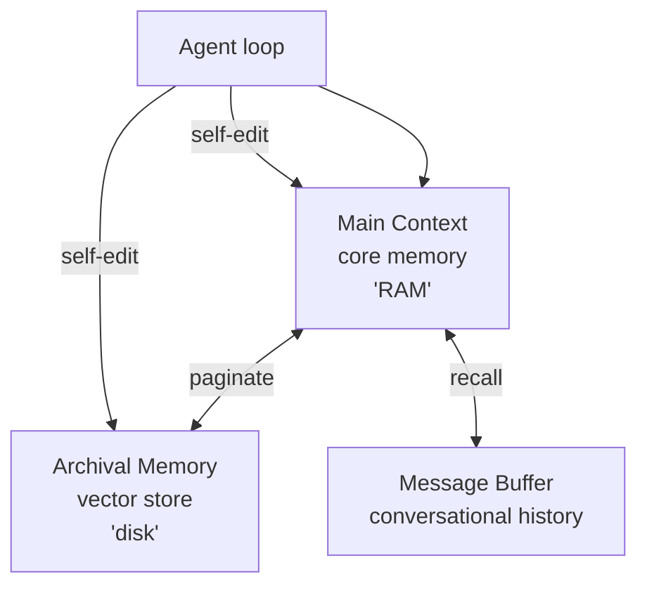
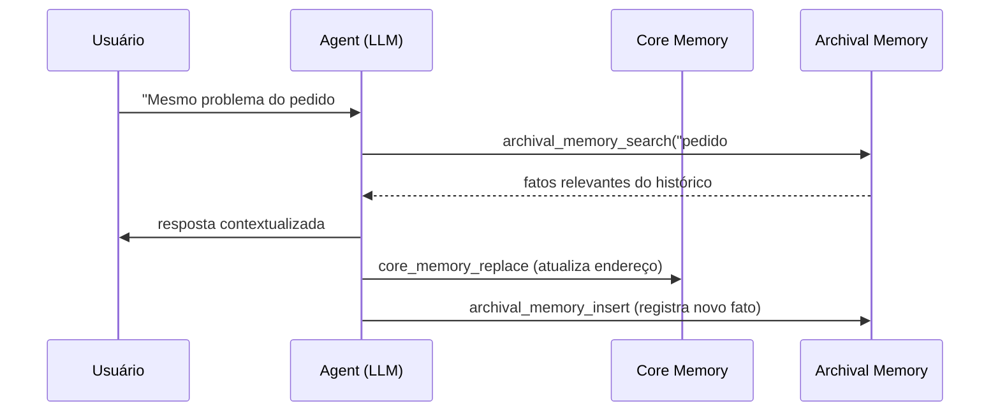

# Letta (ex-MemGPT)

> [!abstract] TL;DR
> **Letta** (`github.com/letta-ai/letta`) é o framework de produção sucessor do projeto **MemGPT** — paper de UC Berkeley apresentado por Packer et al. em outubro de 2023 (arxiv 2310.08560). O posicionamento canônico é **"LLM as OS"**: o agent gerencia hierarquicamente sua própria memória, com analogia explícita a sistemas operacionais — *core memory* sempre presente no contexto (RAM), *archival memory* fora do contexto e recuperada por busca (disco), e histórico de mensagens com paginação. A memória é **self-editing**: o agent decide o que mover entre tiers via tools como `core_memory_append`, `core_memory_replace`, `archival_memory_insert` e `archival_memory_search`. Open-source Apache-2.0 com self-host gratuito; cloud paga em modelo freemium. **Letta não publicou score em LongMemEval** — ponto a notar quando transparência de benchmark importa.

> [!question]- Dúvidas e lacunas desta nota
> - Dúvida gerada pelo conteúdo: Se o agent controla sua própria memória via tools, o que acontece quando o LLM "alucina" uma chamada incorreta a `core_memory_replace` e apaga informação crítica de forma irreversível? Existe rollback ou versionamento de memória no Letta?
> - Lacuna potencial: A nota não explora como o **sleep-time agent** do Letta funciona — esse mecanismo de consolidação assíncrona de memória fora do loop ativo é um diferencial relevante que merece atenção.

## O que é

Imagine que você precisa construir um agent de suporte que atende o mesmo cliente por semanas. Cada sessão nova é uma janela de contexto fresca — o agent não lembra o que resolveu ontem, a menos que **alguém decida, com código, o que vale a pena persistir e o que descartar**. É esse "alguém" que costuma virar dor de cabeça: escrever heurísticas manuais de retenção (o que vai pro banco? quando resumir? quando esquecer?) é trabalho de engenharia que cresce junto com o produto, e erra silenciosamente — decisões importantes do usuário somem porque a heurística de corte não previu aquele caso.

Letta ataca esse problema virando a pergunta de cabeça para baixo: em vez do desenvolvedor decidir o que persistir, **o próprio agent decide**. Letta é um framework para construir **agents stateful** com memória persistente entre sessões. Em vez de tratar o [[Dicionário de IA#LLM (Large Language Model)|LLM]] como função sem estado e tratar a memória como camada externa (caso típico de [[Dicionário de IA#RAG (Retrieval-Augmented Generation)|RAG]] simples), Letta posiciona o LLM como **kernel de um sistema operacional** que gerencia sua própria memória — herança direta da metáfora apresentada no paper original do MemGPT. O agent não é um wrapper sobre prompts; é um processo persistente, com identidade, com estado salvo em banco de dados, que continua existindo entre invocações.

A linhagem do projeto é importante: o **MemGPT** (Packer, Wooders, Lin, Fang, Patil, Stoica, Gonzalez — UC Berkeley AI Research, outubro/2023) propôs **virtual context management** como solução para a limitação fundamental de [[Dicionário de IA#Context window|janelas de contexto]] fixas (ver [[02 - O problema das janelas de contexto]]). Em **setembro de 2024**, o projeto foi spun out como startup chamada **Letta**, fundada por Charles Packer e Sarah Wooders, e o framework open-source foi rebranded de `memgpt` para `letta` em consequência. O pattern conceitual permanece o mesmo do paper; o framework de produção amadureceu em torno dele com SDKs em Python e TypeScript, persistência formal, ADE (Agent Development Environment) e Letta Cloud.

## Por que importa

- **Pioneirou virtual context management como vocabulário.** A analogia OS — RAM/disco com paginação — não era óbvia em 2023 e virou referência comum para discutir hierarquia de memória em LLM agents. Mesmo trabalhos posteriores que **não** adotam Letta usam o vocabulário herdado do MemGPT.
- **Self-editing memory é diferencial real.** Em vez de o desenvolvedor escrever heurísticas para decidir o que armazenar, **o próprio agent invoca** as tools de memória durante o loop. Isso transfere uma decisão arquitetural ("o que vai para archival?") para a inteligência do modelo, com prós (autonomia) e contras (custo extra de tokens, comportamento menos previsível).
- **Em 2026 é uma das poucas opções open-source production-grade para agents stateful.** O repositório passa dos 23,7 mil stars (julho/2026, subindo de ~22 mil em abril), é Python puro, Apache-2.0, com SDKs em Python e TypeScript. Lock-in de plataforma é baixo via self-host — quem não quer usar Letta Cloud sobe um servidor com PostgreSQL e desliga o restante.
- **Linhagem acadêmica clara.** Diferente de frameworks que aparecem como produtos sem paper de fundação, Letta tem trabalho peer-review-quality como ponto de partida (arxiv 2310.08560), com autores ainda envolvidos.

## Como funciona — hierarchical memory



O design hierárquico do MemGPT/Letta organiza a memória em três camadas, todas acessíveis ao agent mas com papéis diferentes:

1. **Main context** — também chamado de **core memory** na documentação atual. É o pedaço de memória que está **sempre dentro do prompt** do LLM, dentro da janela de contexto. Tipicamente carrega informação crítica e estável: persona do agent, fatos centrais sobre o usuário, instruções operacionais. É a "RAM" — pequena, rápida, sempre disponível, mas limitada.
2. **Archival memory** — **[[Dicionário de IA#vector store|vector store]]** externo ao prompt, recuperado por **semantic search** quando o agent invoca a tool de busca. É o "disco" — grande, persistente, fora do contexto imediato, acessado por demanda. É onde o agent guarda observações de longo prazo, fatos que não cabem em core memory, conhecimento acumulado.
3. **Message buffer** (também referido como histórico de conversa) — sequência de mensagens da sessão. Quando o buffer cresce além do limite, mensagens antigas são paginadas para armazenamento de longo prazo, deixando o contexto livre. O agent ainda pode recuperá-las por busca.

A operação central é **self-editing**: o agent invoca tools de memória como qualquer outra tool. As principais, verificadas na documentação oficial (`docs.letta.com/advanced/memory-management/` e `docs.letta.com/guides/ade/core-memory/`):

- `core_memory_append` — anexa conteúdo a um bloco da core memory.
- `core_memory_replace` — substitui conteúdo dentro de um bloco da core memory; recebe `old_content` (match exato) e `new_content`. Para deletar, passa-se string vazia.
- `archival_memory_insert` — grava um item na archival memory (vetorial).
- `archival_memory_search` — recupera itens da archival memory por similaridade semântica.

A diferença importante face a sistemas onde a memória é gerida por código externo: aqui o **LLM decide**. Cada vez que o agent percebe um fato que vale a pena reter, **ele próprio** chama `archival_memory_insert`; cada vez que precisa puxar contexto antigo, **ele próprio** chama `archival_memory_search`. O custo disso é o token e a chamada extra; o benefício é não precisar codificar a heurística "quando salvar".

### O ciclo completo em uma sessão típica

Para tornar o mecanismo concreto, considere um agent de suporte ao cliente:

1. Usuário diz: *"Preciso de ajuda com o pedido #12345, o mesmo problema de semana passada."*
2. O agent, antes de responder, invoca `archival_memory_search("pedido #12345 problema")`.
3. Recupera de semanas atrás: *"Usuário João, pedido #12345, problema de entrega no endereço X"*.
4. Inclui esse contexto no prompt e responde de forma personalizada.
5. Ao final, se surgiu novo fato relevante ("João confirmou novo endereço Y"), o agent chama `core_memory_replace` para atualizar o bloco ou `archival_memory_insert` para preservar o histórico.



## Anatomia técnica

Os itens abaixo refletem o estado público do projeto em julho de 2026, verificados via GitHub e documentação oficial em `docs.letta.com`. O ecossistema está ativo — release `v0.16.8` publicada em maio/2026, pushes recentes — então vale revisitar a fonte primária antes de qualquer decisão crítica.

- **Tipo.** Framework open-source para agents stateful, distribuído como servidor + SDKs (Python e TypeScript). Roda como processo persistente que mantém estado em banco de dados.
- **Linguagem.** Python (cerca de 99,5% do código, segundo a API do GitHub). SDKs cliente também em TypeScript.
- **Licença.** Apache-2.0 (verificada via API do GitHub). Diferente de [[13 - basic-memory — MCP nativo Obsidian|basic-memory]], que usa AGPL-3.0, Letta tem licença permissiva — embutir em produto comercial fechado é menos friccionoso do ponto de vista jurídico.
- **Componentes principais.**
    - **Letta Server** — processo que executa os agents, mantém estado, roteia chamadas a LLMs. Pode rodar local (self-host) ou na cloud gerenciada.
    - **Letta SDKs** — `pip install letta-client` (Python) e `npm install @letta-ai/letta-client` (TypeScript/Node).
    - **ADE (Agent Development Environment)** — interface visual para inspecionar e editar prompts, blocos de core memory e archival memory, observar o loop do agent, debugar tools.
    - **Letta Cloud** — versão hospedada, acessada via `app.letta.com`, com plano gratuito e tiers pagos.
- **Modelos suportados.** Posicionado como **model-agnostic**. Em julho de 2026, a documentação **não nomeia mais modelos específicos** como recomendação fixa — orienta a consultar `leaderboard.letta.com` para comparar desempenho e escolher o modelo base, e recomenda apenas "usar um frontier model grande" na primeira experiência, já que modelos mais fracos produzem comportamento imprevisível no agent loop. Endpoints OpenAI, Anthropic e provedores compatíveis com OpenAI funcionam; suporte a modelos locais (via Ollama, vLLM, etc.) é parte do desenho. Lista exata e estado de cada provider vale conferir no docs antes de comprometer.
- **Persistência.** Estado completo do agent — memórias, mensagens, reasoning steps, tool calls — é serializado em banco. A documentação oficial é explícita: *"all state, includes memories, user messages, reasoning, tool calls, are all persisted in a database"*. PostgreSQL com pgvector é o backend canônico para deploy de produção (necessário para vector search em archival memory); SQLite é usado em setups de desenvolvimento. **Vale conferir o repositório atual** antes de assumir versões e extensões obrigatórias.
- **API.** REST (servidor Letta), Python SDK (`letta-client`), TypeScript SDK (`@letta-ai/letta-client`).
- **Raízes MemGPT.** O pattern hierárquico de memória implementado em Letta é **o mesmo descrito no paper original** (Packer et al., 2023). A documentação reconhece a herança e mantém a categoria *MemGPT Agents (Legacy)* — o agente memgpt original ainda está acessível, e o framework moderno generalizou o conceito (memory blocks, sleep-time agents etc.) sem abandonar a base.
- **Pricing tiers em julho de 2026** (verificado em `docs.letta.com/guides/api/plans` — pode mudar de novo):
    - **Self-host:** gratuito (open-source Apache-2.0).
    - **Free** (Letta Cloud/Constellation): US$ 0/mês — até 3 agents com estado gerenciado, quota limitada de Letta Auto.
    - **Pro:** US$ 20/mês — uso pessoal, quota semanal/mensal de Letta Auto com pay-as-you-go acima do limite, até 20 stateful agents.
    - **API Plan:** US$ 20/mês de plataforma — para times/organizações construindo sobre a API com workloads automatizados, cobrança usage-based: US$ 0,10 por agent ativo/mês, US$ 0,00015/segundo de execução de tool, mais consumo LLM repassado ao custo do provider.
    - **Enterprise:** pricing customizado — rates por volume, quotas maiores, RBAC, SSO (SAML/OIDC), suporte dedicado.
    - Os tiers **Max Lite** (US$ 100/mês) e **Max** (US$ 200/mês), documentados em abril/2026, **saíram da página de pricing** em julho/2026 — mais um exemplo de instabilidade dos tiers (ver Armadilha 6). O caminho para uso de maior escala hoje é API Plan ou Enterprise via contato comercial.
- **Funding.** Letta saiu do stealth em **setembro de 2024** com **seed round de US$ 10 milhões** liderado por Felicis, com participação de Sunflower Capital e Essence VC, em valuation post-money de US$ 70 milhões. Cobertura primária em HPCwire/BigDATAwire, TechCrunch e PRNewswire. Como spin-out do **UC Berkeley AI Research Lab**, ancora a posição acadêmica do projeto na arquitetura institucional.

> [!info] Sobre LongMemEval
> Em abril de 2026, **Letta não publicou score oficial em LongMemEval** (ver [[21 - Comparativo crítico (LongMemEval)|21 - Comparativo crítico]]). Isso é **um sinal a notar**, não um veredicto: o framework existe há mais tempo que o benchmark e se posiciona como infraestrutura, não como otimizador para um teste. Mas em decisões enterprise onde transparência de benchmark importa, a ausência conta. Compare com [[15 - Mem0 — vetorial + grafo|Mem0]] (auto-reportado ≈ 93,4%) ou [[16 - Zep e Graphiti — knowledge graph temporal|Zep]] (+ 18,5% sobre full-context com GPT-4o) — números com convenções diferentes, ainda assim presentes.

## Quando usar / quando não usar

**Quando vale:**

- O caso pede **agent stateful com memória self-editing** e o desenvolvedor quer transferir a heurística de retenção para o próprio modelo.
- Importa **controle fino** sobre quais blocos da core memory existem, o que entra em archival, como a paginação acontece — Letta expõe isso.
- O setup tolera (ou prefere) **self-host** com PostgreSQL + pgvector. Para quem já roda esse stack, integrar Letta é incremental.
- Já existe investimento em "agent platform" e o time quer um SDK maduro com ecossistema (ADE, cloud opcional, comunidade).
- Linhagem acadêmica e licença permissiva (Apache-2.0) são requisitos — Letta atende ambos.

**Quando NÃO vale:**

- Quer **simplicidade** acima de tudo. [[13 - basic-memory — MCP nativo Obsidian|basic-memory]] é mais leve: pasta de markdown e SQLite, sem servidor formal, sem Postgres. Para um vault pessoal de notas, Letta é overkill.
- Workflow é **Obsidian-first** ou markdown-first. Letta não tem integração nativa com vault de markdown; o substrato natural é banco. Quem quer abrir o conteúdo no Obsidian usa basic-memory ou [[10 - LLM-knowledge-base (Wendel) — direto do gist|LLM-knowledge-base]].
- Transparência de **benchmark** é requisito formal. Sem score público em LongMemEval, comparações ficam por terra menos firme — alternativas com números publicados são mais defensáveis em auditoria.
- Cliente regulado precisa de **audit trail temporal** robusto (mudanças versionadas, raciocínio temporal sobre fatos). [[16 - Zep e Graphiti — knowledge graph temporal|Zep/Graphiti]] foram desenhadas para esse caso.
- Volume é tão baixo que **markdown puro + system prompt** já resolve. Quando a memória cabe num arquivo curto que o agent lê a cada chamada, qualquer framework é overhead.

## Armadilhas comuns

> [!warning] Armadilha 1: Confundir Letta com MemGPT
> São coisas relacionadas mas distintas: **MemGPT é o paper e o pattern** (Packer et al., 2023); **Letta é o framework concreto** que sucedeu o projeto open-source de mesmo nome em 2024. Em texto técnico vale ser preciso — "implementa o pattern do MemGPT" e "usa o framework Letta" são afirmações diferentes e implicam trade-offs distintos ao auditar documentação.

> [!warning] Armadilha 2: Achar que "self-editing memory" funciona sozinha
> O agent só armazena ou move conteúdo se as **tools forem expostas e os prompts orientarem o uso**. Sem system prompt e exemplos sólidos, o LLM ignora `archival_memory_insert` na maioria dos turnos. A engenharia de prompt continua sendo trabalho humano — o framework não elimina essa camada.

> [!warning] Armadilha 3: Subestimar o custo de tokens da hierarquia
> Cada vez que o agent decide invocar uma tool de memória, é uma chamada LLM com tokens de input e output. Em loops longos isso acumula — o "free lunch" da metáfora OS é parcial. Em produção com alto volume de sessões longas, modelar o custo de tokens antes de comprometer é obrigatório.

> [!warning] Armadilha 4: Tratar PostgreSQL + pgvector como trivial em produção
> Self-host com Postgres exige operação real: backup, replicação, monitoramento, scaling de pgvector. Nada disso vem "grátis" com `docker compose up`. Para casos sérios, a operação do banco é parte do TCO; ignorar isso é a armadilha clássica de "open-source é grátis" aplicada ao substrato de dados.

> [!warning] Armadilha 5: Citar Letta como "comparativamente superior" sem qualificação
> Sem score LongMemEval público, comparações com [[15 - Mem0 — vetorial + grafo|Mem0]], MemPalace e outros que reportam números ficam, no mínimo, assimétricas. Não é argumento para descartar Letta, mas é argumento para não afirmar superioridade quantitativa em auditoria técnica ou proposta comercial.

> [!warning] Armadilha 6: Assumir pricing estável
> Os tiers atuais (Pro, Max Lite, Max, API Plan) **não são** os mesmos descritos em material de 2024–2025 (que mencionavam Free 50 premium / 500 standard, Pro $20, Scale $750, Enterprise custom). Antes de citar valores em texto público, abrir `letta.com/pricing` na data corrente é obrigatório.

> [!warning] Armadilha 7: Transferir restrições da AGPL para a Apache-2.0
> Para quem está acostumado com [[13 - basic-memory — MCP nativo Obsidian|basic-memory]] (AGPL-3.0), assumir as mesmas restrições com Letta é erro: a licença permissiva permite embutir em produto comercial fechado sem obrigação de abrir código derivado. O trade-off inverso também existe — o ecossistema Letta pode ser embarcado por concorrentes sem reciprocidade.

## Sleep-time agents: computação fora do loop

A feature mais distinta do Letta em relação a outros frameworks é o conceito de **sleep-time agents** — agents que executam **entre sessões**, sem um usuário aguardando resposta.

A metáfora do OS vai até aqui: assim como um sistema operacional realiza manutenção em background (defragmentação, caches, indexação), um sleep-time agent do Letta pode consolidar memórias, resolver contradições, atualizar fatos obsoletos, e reorganizar archival memory durante períodos de baixa demanda.

Em termos práticos:

- O agent principal atende o usuário em tempo real, acumulando fatos em archival memory.
- Um sleep-time agent separado roda de forma assíncrona — por cron, por evento, ou manualmente — e realiza operações como `archival_memory_search` + `archival_memory_delete` + `archival_memory_insert` para deduplicar, consolidar, ou re-sumarizar.
- A core memory do agent principal é atualizada como resultado, refletindo o trabalho do sleep agent sem que o usuário tenha esperado por isso.

Esse pattern é relevante em casos onde a frequência de interação é alta o suficiente para a archival memory acumular ruído ao longo do tempo — sem algum mecanismo de consolidação, retrieval degrada.

> [!info] Rollback e versionamento de core memory
> A documentação do Letta menciona que o estado do agent é persistido em banco e cada operação de memória é registrada. Na prática, isso habilita rollback para um snapshot anterior se uma edição de core memory introduzir um valor incorreto — o ADE expõe o histórico de modificações. Vale verificar no docs da versão corrente quais operações são auditáveis e quais são apenas atualizações destrutivas antes de depender desse mecanismo em produção.

## O ADE em prática

O ADE (Agent Development Environment) é a interface que separa Letta de frameworks similares em termos de observabilidade. Em vez de depurar um agent via logs de texto ou prompts em raw, o ADE mostra:

- **Core memory em tempo real**: os blocos `human` e `persona` (ou os blocos customizados) exibidos e editáveis enquanto o agent roda.
- **Archival memory browser**: visualização e busca de entradas arquivadas, com possibilidade de inserção e remoção manual.
- **Agent loop trace**: cada passo do reasoning — tool calls, respostas de LLM, updates de memória — exibido sequencialmente.
- **Comparison mode**: execução de dois agents com configs diferentes no mesmo input, útil para A/B de prompts ou estratégias de memória.

Para quem vem de LangChain ou plain API calls, o ADE é a diferença entre "eu sei o que o agent pensou" e "eu tenho logs de stdout". Em projetos de médio prazo, a facilidade de inspecionar core memory sem SQL queries vale o overhead de rodar um servidor a mais.

## Exemplo de sessão: core memory em ação

Para tornar concreto o que significa "self-editing memory", considere um assistente de escrita que precisa lembrar o estilo preferido do usuário ao longo de semanas:

```python
from letta_client import Letta

client = Letta(token="<API_KEY>")

# Criação do agent com core memory inicial
agent = client.agents.create(
    name="writing-assistant",
    memory_blocks=[
        {"label": "human", "value": "O usuário prefere textos diretos, sem jargão técnico."},
        {"label": "persona", "value": "Sou um assistente de escrita especializado em clareza."},
    ],
    model="openai/gpt-4o",
)

# Após várias sessões, o agent pode ter invocado core_memory_replace automaticamente
# para atualizar: "O usuário prefere textos diretos, sem jargão técnico. Exceção: conteúdo
# técnico para devs, onde termos específicos são esperados."
```

O ponto central: quem fez essa atualização foi o próprio LLM, não o desenvolvedor. O developer pode inspecionar o estado atual via ADE ou `client.agents.get_memory(agent_id)` — mas não precisou codificar a regra de atualização.

Esse contrast com [[13 - basic-memory — MCP nativo Obsidian|basic-memory]] é revelador: no basic-memory, o developer escreve a nota e a ferramenta apenas lê. No Letta, o agent escreve a memória — e o developer inspeciona o resultado.

## Checklist de adoção

Antes de comprometer Letta em produção, vale responder:

- [ ] O agent precisa de memória **self-editing** — ou memória read-only (injetada no prompt) bastaria?
- [ ] A equipe tem capacidade de operar PostgreSQL com pgvector em produção?
- [ ] O caso de uso tolera a ausência de score LongMemEval público — ou isso é bloqueante para compliance/auditoria?
- [ ] O volume de sessões simultâneas está dimensionado contra o modelo de pricing (API Plan vs self-host)?
- [ ] Algum requisito de **audit trail temporal** exige timestamps de validade nos fatos — se sim, considere [[16 - Zep e Graphiti — knowledge graph temporal|Zep/Graphiti]].
- [ ] O team explorou o ADE em ambiente de dev antes de assumir que a curva de aprendizado é trivial?

## Como explicar em inglês

> [!tip] Interview quote
> "Letta implements a hierarchical memory model inspired by operating systems: core memory lives in-context like RAM, archival memory is retrieved on-demand like disk, and the agent itself decides what to store or recall via memory-editing tools."

| Português | Inglês |
|-----------|--------|
| memória hierárquica | hierarchical memory |
| memória de núcleo (sempre no contexto) | core memory (always in-context) |
| memória de arquivo (busca vetorial) | archival memory (vector search) |
| memória auto-editável | self-editing memory |
| agent persistente com estado | stateful agent |
| paginação do buffer de mensagens | message buffer pagination |
| hospedagem própria | self-host |
| loop do agent | agent loop |
| invocação de ferramenta de memória | memory tool call |

## O que vem a seguir

Letta representa o extremo do controle explícito: o developer vê cada bloco de core memory, o agent é responsável por suas próprias invocações de tool, e a hierarquia RAM/disco é visível no ADE. O próximo passo natural é conhecer a abordagem oposta — a de uma **memory layer transparente** que se encaixa em qualquer framework sem exigir que o agent conheça suas próprias ferramentas de memória. É exatamente o que o [[15 - Mem0 — vetorial + grafo|Mem0]] propõe: em vez de o agent chamar `archival_memory_insert`, o pipeline de extração roda invisível no `memory.add`, e o desenvolvedor ganha persistência sem reescrever o loop do agent. As diferenças de posicionamento, custo e benchmarks entre Letta e Mem0 são a primeira grande bifurcação de decisão no mercado de memória de produção.

## Veja também

- [[06 - O LLM Wiki Pattern (gist do Karpathy)]] — abordagem alternativa, markdown-led em vez de hierarchical
- [[08 - Arquitetura de um sistema de memória]] — hierarchical é um dos mecanismos canônicos
- [[09 - Panorama de implementações (abril 2026)|09 - Panorama]] — onde Letta se posiciona no mapa
- [[13 - basic-memory — MCP nativo Obsidian|13 - basic-memory]] — alternativa leve, markdown-first
- [[15 - Mem0 — vetorial + grafo|15 - Mem0]] — outra opção production, com benchmark publicado
- [[16 - Zep e Graphiti — knowledge graph temporal|16 - Zep e Graphiti]] — alternativa enterprise/temporal
- [[21 - Comparativo crítico (LongMemEval)|21 - Comparativo crítico]] — onde a ausência de score de Letta aparece
- [[02 - O problema das janelas de contexto]] — a dor que MemGPT propôs resolver

## Posicionamento no ecossistema (abril 2026)

O mapa mental de onde Letta se encaixa em 2026:

```
Memória de agentes
├── Frameworks "transparentes" (a memória é invisível para o agent)
│   ├── Mem0 — extração automática via LLM, vector store
│   ├── Zep/Graphiti — KG bi-temporal, audit trail rico
│   └── basic-memory — markdown/SQLite, substrato legível
│
└── Frameworks "explícitos" (o agent opera a própria memória)
    └── Letta — hierarquia RAM/disco, self-editing, sleep agents
```

Letta é o único framework maduro da segunda categoria em produção em abril de 2026. O trade-off é claro: máximo controle, máxima curva de aprendizado. Isso o torna referência insubstituível para qualquer discussão sobre o "extremo explícito" da memória de agentes — não porque seja superior, mas porque é o único representante bem documentado desse quadrante.

Para quem debate arquitetura de memória em entrevistas, conhecer Letta é saber o que existe no polo oposto ao Mem0: onde um abstrai tudo, o outro expõe tudo.

## Referências

- Repositório oficial: `https://github.com/letta-ai/letta` — verificado (descrição "Letta is the platform for building stateful agents", licença Apache-2.0, default branch `main`, linguagem Python ~99,5%, 23,7 mil stars e release `v0.16.8` em julho/2026, organização `letta-ai`).
- Paper original — Packer, Wooders, Lin, Fang, Patil, Stoica, Gonzalez. **MemGPT: Towards LLMs as Operating Systems** (UC Berkeley AI Research, outubro de 2023; revisão fevereiro de 2024). `https://arxiv.org/abs/2310.08560`.
- Site oficial: `https://letta.com/` — institucional.
- Página de pricing: `https://docs.letta.com/guides/api/plans` — tiers atuais Free / Pro ($20) / API Plan ($20 + usage) / Enterprise (custom). Verificada em julho/2026 — os tiers Max Lite ($100) e Max ($200) de abril/2026 não aparecem mais.
- Leaderboard de modelos: `https://leaderboard.letta.com/` — última atualização pública em março/2026; usado pela documentação como referência para escolha de modelo base em vez de nomear modelos fixos.
- Documentação: `https://docs.letta.com/` — referência de tools, conceitos e SDK. Páginas usadas para verificação: `docs.letta.com/advanced/memory-management/`, `docs.letta.com/guides/ade/core-memory/`, `docs.letta.com/guides/ade/archival-memory/`, `docs.letta.com/guides/agents/memory/`, `docs.letta.com/guides/agents/base-tools/`.
- Cobertura de funding (US$ 10M seed liderado por Felicis, valuation post-money US$ 70M, set/2024):
    - HPCwire / BigDATAwire — *Letta Emerges from Stealth with $10M to Build AI Agents with Advanced Memory*: `https://www.hpcwire.com/bigdatawire/this-just-in/letta-emerges-from-stealth-with-10m-to-build-ai-agents-with-advanced-memory/`
    - TechCrunch — *Letta, one of UC Berkeley's most anticipated AI startups, has just come out of stealth*: `https://techcrunch.com/2024/09/23/letta-one-of-uc-berkeleys-most-anticipated-ai-startups-has-just-come-out-of-stealth/`
    - PRNewswire — *Berkeley AI Research Lab Spinout Letta Raises $10M Seed Financing Led by Felicis*.
- SDKs: `pip install letta-client` (Python), `npm install @letta-ai/letta-client` (TypeScript/Node.js).
- ADE (Agent Development Environment): acessível via Letta Cloud em `app.letta.com` ou localmente ao rodar o servidor self-hosted.
- Repositório de exemplos e tutoriais: `https://docs.letta.com/guides/` — casos de uso documentados incluem assistentes pessoais, chatbots de suporte com memória por usuário, e agents de pesquisa de longo prazo.
- Discord oficial da comunidade Letta: canal primário de suporte e discussão técnica para self-hosters; link disponível via `letta.com` (verificar na página principal).
- Paper MemGPT original com code release: `https://arxiv.org/abs/2310.08560` — inclui link para repositório original antes da bifurcação Letta; útil para rastrear o estado da implementação no momento da publicação.
