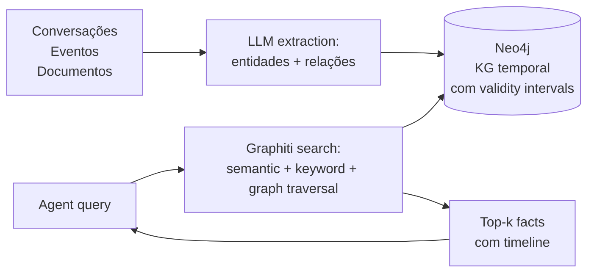
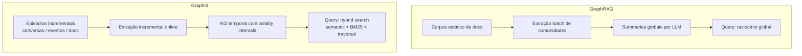

# Zep e Graphiti

> [!abstract] TL;DR
> **Graphiti** (`github.com/getzep/graphiti`) é a engine open-source para **knowledge graph temporal** mantida pela getzep — Apache-2.0, Python, backed por Neo4j (e outros backends como FalkorDB, Kuzu e Neptune). **Zep** (`getzep.com`) é o produto comercial construído em cima do Graphiti: managed service com governança, SDKs em Python/TypeScript/Go, dashboard e SLAs enterprise. Diferencial central: **bi-temporal model** — o grafo guarda tanto quando um fato passou a ser verdade no mundo quanto quando o sistema soube dele, com **validity intervals** em cada edge. Paper de fundação (Rasmussen et al., arxiv 2501.13956, janeiro/2025) reporta **94,8% no DMR** (vs 93,4% do MemGPT) e **+18,5% sobre baseline full-context no LongMemEval com GPT-4o** (Zep 71,2% vs full-context 60,2%), com tokens caindo de **115k → 1,6k** e latência média de **28,9s → 2,58s** no mesmo cenário.

> [!question]- Dúvidas e lacunas desta nota
> - Dúvida gerada pelo conteúdo: se o modelo bi-temporal exige que o dado de entrada traga a marca de *event time* explícita, o que acontece na prática quando conversas de chat não têm timestamps estruturados — o sistema usa a hora de ingestão como fallback ou há algum mecanismo de inferência heurística?
> - Lacuna potencial: a nota cobre Neo4j, FalkorDB, Kuzu e Neptune como backends, mas não compara o custo operacional e as limitações de escala de cada um — explorar quando FalkorDB (mais leve) supera o overhead do Neo4j para cenários menores seria útil aqui.

## O que é

**Graphiti** é um framework para construir e consultar **temporal context graphs** para agents — grafos onde entidades, relações e fatos têm janelas de validade explícitas e onde cada item derivado mantém *provenance* até a episódio (raw data) que o produziu. O posicionamento do README oficial é direto: diferentemente de [[Dicionário de IA#RAG (Retrieval-Augmented Generation)|RAG]] tradicional, que retorna chunks estáticos, Graphiti integra continuamente conversas, dados estruturados e não estruturados em um grafo único, atualizado de forma **incremental** (sem recompilar o grafo inteiro a cada ingestão).

**Zep** é a camada comercial em cima do Graphiti: a empresa **getzep** mantém Graphiti como engine open-source e oferece o Zep como managed service com governança enterprise (audit trail, SLAs, dashboards, performance sub-200ms reportada em escala). O paper de fundação — *Zep: A Temporal Knowledge Graph Architecture for Agent Memory*, Rasmussen, Paliychuk, Beauvais, Ryan e Chalef (arxiv:2501.13956, janeiro de 2025) — descreve Graphiti como o **componente central** do Zep. A distinção é importante: **Graphiti é a engine, Zep é o produto**.

O diferencial estrutural está no **modelo bi-temporal**, herdado da literatura de databases temporais: cada fato tem dois eixos de tempo — *event time* (quando o fato passou a ser verdade no mundo) e *ingestion time* (quando o sistema o aprendeu) — e cada edge carrega um **validity interval** que delimita até quando aquele fato vale. Quando uma nova informação contradiz a anterior, Graphiti **invalida** o fato antigo em vez de apagar; o histórico permanece consultável por timeline.

Para visualizar: imagine que um sistema de CRM aprende em janeiro que o cliente João é diretor de TI da empresa X. Em março, João muda de cargo para VP. Um vector store convencional simplesmente sobrescreveria o embedding com a nova informação — o fato "era diretor em janeiro" desaparece. No Graphiti, o edge "João → é → Diretor de TI" recebe `valid_to = março` e um novo edge "João → é → VP" nasce com `valid_from = março`. Perguntar "qual era o cargo de João em fevereiro?" retorna a resposta correta porque o intervalo de validade está explícito no grafo.

## Por que importa

- **Casos enterprise exigem audit trail temporal.** Compliance, regulatory e qualquer cenário onde "qual era o estado em t1?" é pergunta legítima — diagnóstico médico, contrato em vigor, política aplicada — pedem exatamente o que o modelo bi-temporal entrega.
- **Conhecimento real evolui.** Endereços mudam, contratos são renovados, preferências são corrigidas. KG temporal trata mudança como sinal de primeira classe, sem perder histórico — diferente de vector stores, onde upsert sobre o mesmo embedding apaga o passado.
- **Multi-hop reasoning é o que graphs habilitam.** Travessia "entidade → relação → entidade → relação" é cara ou impossível de representar em vector store puro; em grafos é o caminho natural. Quando a query é "quais clientes do produto X foram afetados pela mudança Y entre março e abril?", graph traversal é a forma econômica de responder.
- **Reduções reportadas são argumentos concretos para escala.** No paper, Zep reduziu o contexto enviado ao LLM de **115k tokens para 1,6k** (cerca de 1,4% do baseline) com **+18,5% relativo de ganho de acurácia (11 pontos absolutos)** sobre full-context com GPT-4o no LongMemEval. Para casos enterprise rodando milhões de queries, a economia composta é material.
- **Open-core com adoção crescente.** Graphiti é Apache-2.0; quem não quer cloud paga rebaixa para self-host, ainda que assumindo o custo operacional do Neo4j (ou outro backend).

## Como funciona



O fluxo divide-se em duas fases:

1. **Ingestion.** Conversas, mensagens estruturadas (JSON) ou documentos chegam como **episodes** — a unidade de raw data que Graphiti preserva como provenance. Um [[Dicionário de IA#LLM (Large Language Model)|LLM]] (por padrão OpenAI; suporta também Gemini, Anthropic e Groq) extrai entidades e relações tipadas dessa entrada e produz triplets *(entidade → relação → entidade)*. Graphiti faz **incremental update** sobre o grafo existente: novas afirmações são integradas; afirmações que contradizem fatos anteriores **invalidam** o fato antigo (marca o `valid_to` do edge antigo) e criam um novo edge com `valid_from` no presente. O grafo nunca é recompilado por inteiro.
2. **[[Dicionário de IA#retrieval|Retrieval]].** Quando o agent consulta, Graphiti executa [[Dicionário de IA#hybrid search|hybrid search]] combinando três sinais: **semantic** ([[Dicionário de IA#embedding|embeddings]] sobre nodes e edges), **keyword** ([[Dicionário de IA#BM25|BM25]] sobre texto literal) e **graph traversal** (caminhos no grafo a partir dos nodes mais relevantes). O resultado é uma lista de fatos ranqueados, cada um com seu validity interval — o agent recebe não só "o que vale", mas "desde quando" e "até quando".

A escolha de combinar três sinais é deliberada: semantic captura paráfrase, BM25 ancora termos exatos (nomes próprios, códigos), e graph traversal expande para fatos relacionados que isoladamente não casariam com a query. O paper documenta essa hibridização como parte do desempenho reportado.

### O modelo bi-temporal em detalhe

O conceito de bi-temporalidade veio da literatura de bancos de dados relacionais temporais (SQL:2011), mas Graphiti o adapta para grafos de conhecimento. A ideia-chave é separar dois eixos que na prática colapsam com frequência:

- **Event time (tempo do evento):** quando o fato passou a ser verdade no mundo. "João virou VP em 10 de março." Se a empresa registra contratos retroativamente, pode haver discrepância entre quando algo aconteceu e quando o sistema soube.
- **Ingestion time (tempo de ingestão):** quando o sistema processou a informação. Se João mudou de cargo em março mas o sistema só soube em junho, o ingestion time é junho.

A distinção importa em cenários de auditoria: "o que o agent sabia em abril sobre João?" usa o eixo de ingestion time para responder com precisão. Um sistema mono-temporal (apenas timestamps de criação do registro) não consegue separar os dois eixos.

## Anatomia técnica

Os itens abaixo foram verificados em `github.com/getzep/graphiti` (README e LICENSE), no paper arxiv 2501.13956 e no blog *State of the Art Agent Memory* da getzep, em abril de 2026.

- **Componentes da família:**
  - **Graphiti** — engine open-source de context graph temporal (Apache-2.0).
  - **Zep Cloud** — managed service comercial em cima do Graphiti, com governança e SLAs.
  - **MCP server para Graphiti** — exposto pelo próprio repositório (`mcp_server/`), permite que clientes MCP (Claude, Cursor) consumam o grafo como memória.
- **Linguagem da engine:** Python 3.10+ (`pip install graphiti-core`). Zep oferece SDKs adicionais em Python, TypeScript e Go.
- **Backends de grafo suportados pelo Graphiti:** Neo4j 5.26+, FalkorDB 1.1.2, Kuzu 0.11.2, Amazon Neptune (Database Cluster ou Analytics Graph) com OpenSearch Serverless como full-text backend. Padrão recomendado é Neo4j; FalkorDB tem quickstart via Docker.
- **Modelo bi-temporal:** cada edge carrega *event time* (quando o fato passou a ser verdade) e *ingestion time* (quando o sistema soube), com **validity windows** explícitos. Mudanças invalidam fatos antigos em vez de apagar — histórico permanece consultável.
- **Estrutura do context graph:** **entities** (nodes com summaries que evoluem), **facts/relationships** (edges triplet com validity windows), **episodes** (raw data com provenance até a fonte) e **custom types** (entity e edge types definidos pelo desenvolvedor via Pydantic).
- **Search:** híbrido — semantic embeddings (BGE-m3 no paper; configurável) + keyword BM25 + graph traversal. Sem dependência de LLM-summarization para retrieval, ao contrário de GraphRAG.
- **Ingestão incremental:** novos episodes integram em tempo real; sem recomputação do grafo. Provenance até o episode é mantida em cada derived fact.
- **Performance reportada (paper, LongMemEval$_s$, ~115k tokens por conversa):**
  - **DMR:** Zep **94,8%** (gpt-4-turbo) e **98,2%** (gpt-4o-mini), vs **MemGPT 93,4%** e full-conversation 94,4% / 98,0%.
  - **LongMemEval com gpt-4o-mini:** Zep **63,8%** vs full-context 55,4% (**+15,2% relativo (8,4 pontos absolutos)**); latência mediana 3,20s vs 31,3s; tokens 1,6k vs 115k.
  - **LongMemEval com gpt-4o:** Zep **71,2%** vs full-context 60,2% (**+18,5% relativo** = +11 pontos absolutos sobre o baseline com GPT-4o (60,2% → 71,2%)); latência mediana 2,58s vs 28,9s; tokens 1,6k vs 115k.
  - **Performance enterprise reportada (site):** sub-200ms de latência de retrieval em escala (claim de produto, separado do paper).
- **Licença Graphiti:** Apache-2.0 (verificado no LICENSE do repositório).
- **API:** REST (Zep Cloud), Python SDK, TypeScript SDK, Go SDK (Zep). Graphiti core é Python-only.
- **Pricing Zep Cloud:** modelo comercial publicado em `getzep.com` — verificar a página oficial para faixas atualizadas. Self-host de Graphiti é gratuito sempre.
- **LLM requirements:** o paper e o README recomendam modelos com **Structured Output** confiável (OpenAI, Gemini); modelos menores costumam falhar na extração de schema.

## Quando usar / quando não usar

**Quando vale:**

- Caso **enterprise com requisito de audit trail temporal** — compliance, regulatory, cenários "qual era o estado em t1?".
- Conhecimento que **evolui temporalmente** — relações que mudam, fatos que são corrigidos, contratos que são renovados.
- **Multi-hop reasoning** é central — raciocínio que atravessa rede de entidades em vez de match isolado.
- Há **capacidade operacional para Neo4j** (ou FalkorDB, Kuzu, Neptune) — DBA, backup, replicação, monitoramento.
- Quando a comparação relevante é "full-context vs memory layer" e a economia de tokens em escala importa — o paper documenta 1,6k vs 115k tokens com ganho de acurácia.

**Quando NÃO vale:**

- **Q&A simples sobre docs estáticos** — RAG tradicional basta e custa muito menos.
- **Workflow Obsidian-first / markdown-first** — Zep não persiste em markdown legível por humano; quem precisa de revisão manual da memória deve preferir [[13 - basic-memory — MCP nativo Obsidian|basic-memory]] ou seguir o [[06 - O LLM Wiki Pattern (gist do Karpathy)|gist do Karpathy]].
- **Volume baixo demais** para justificar Neo4j em produção — cluster, replicação e backup têm custo fixo que só se amortiza em escala.
- **Self-host caseiro sem time de DBA** — Neo4j em produção é compromisso operacional sério; a alternativa é assumir o Zep Cloud (e o vendor lock-in que vem junto).
- Caso onde **transparência total da extração** é requisito — a etapa de LLM-extraction é parcialmente opaca, e mudanças no modelo subjacente alteram resultados sem aviso.
- Quando o time **não vai consultar o grafo por timeline** — pagar o custo de bi-temporal sem usar a vantagem é overengineering.

## Armadilhas comuns

> [!warning] Armadilha 1: Confundir Graphiti com Zep
> Graphiti é open-source (Apache-2.0); Zep é o produto comercial construído em cima dele. Em discussões técnicas, a confusão produz expectativas erradas — alguém pede "Graphiti com SLA" sem perceber que SLA é Zep Cloud. A distinção também importa no orçamento: self-host do Graphiti é gratuito (você paga o Neo4j), enquanto Zep Cloud tem pricing por usage. Ao recomendar a solução, deixe claro qual camada você está descrevendo.

> [!warning] Armadilha 2: Bi-temporal não é mágica sem input estruturado
> Para o eixo *event time* funcionar, é preciso convenção rigorosa de "quando o fato passou a ser verdade" no input. Se a entrada não traz essa marca temporal, Graphiti usa o tempo de ingestão como aproximação — e a vantagem bi-temporal degrada para timestamp simples. Sistemas que alimentam Graphiti com texto livre de chat sem timestamps estruturados não vão extrair o benefício diferencial do modelo bi-temporal. A convenção de input precisa ser definida antes da adoção.

> [!warning] Armadilha 3: Generalizar o +18,5% além do contexto do paper
> O ganho de +18,5% relativo sobre baseline é métrica única: **GPT-4o no LongMemEval com gpt-4o como modelo de retrieval**. Com gpt-4o-mini o ganho é menor (+15,2% relativo), e o paper observa que a performance escala com a capacidade do modelo. Citar "+18,5%" sem qualificar o contexto (modelo, benchmark, cenário) é extrapolação que induz decisões erradas. Outros modelos e domínios vão variar — o número é sinal, não garantia.

> [!warning] Armadilha 4: Subestimar o custo operacional do Neo4j
> Neo4j em produção exige cluster, replicação, backup, monitoramento e, para features avançadas, potencialmente licença Enterprise. ROI exige volume; para cenário pequeno, FalkorDB (Docker em minutos) ou Zep Cloud (zero ops) são caminhos mais leves. Equipes que adotam Graphiti por ser Apache-2.0 sem contabilizar o TCO do Neo4j frequentemente redescobrem o custo operacional depois do deploy.

> [!warning] Armadilha 5: Confundir DMR com LongMemEval
> **DMR (94,8%)** e **LongMemEval (71,2% com GPT-4o)** são benchmarks diferentes com complexidade radicalmente distinta. DMR tem ~60 mensagens por conversa; LongMemEval$_s$ tem ~115k tokens por conversa. Citar "Zep = 94,8% no LongMemEval" é erro frequente que superestima a performance no benchmark mais exigente. Sempre verificar qual benchmark está sendo citado antes de comparar números.

> [!warning] Armadilha 6: Tratar o MCP server como API estável
> O `mcp_server/` no repositório expõe Graphiti como memória para clientes MCP (Claude, Cursor). Esse é caminho recente — tratá-lo como API estável sem ler o estado atual do código pode surpreender com breaking changes. Verificar o changelog antes de pinning em produção.

## Exemplo prático: agent de CRM com Graphiti

Considere um agent que gerencia relacionamentos com clientes. Sem memória persistente, cada sessão começa do zero — o agent não sabe que João mudou de cargo, que a empresa X renovou o contrato em condições diferentes, ou que houve uma reclamação em fevereiro que foi resolvida em março. Com Graphiti, o fluxo seria assim:

**Ingestão de episódios:**

```python
from graphiti_core import Graphiti

g = Graphiti(neo4j_uri, neo4j_user, neo4j_password)

# Episódio 1: onboarding de cliente (janeiro)
await g.add_episode(
    name="cliente_joao_onboarding",
    episode_body="João Silva assumiu como Diretor de TI na empresa Acme Corp em 15 de janeiro de 2025.",
    source_description="CRM onboarding",
    reference_time=datetime(2025, 1, 15)
)

# Episódio 2: mudança de cargo (março)
await g.add_episode(
    name="cliente_joao_promocao",
    episode_body="João Silva foi promovido a VP de Tecnologia na Acme Corp em 10 de março de 2025.",
    source_description="LinkedIn atualizado",
    reference_time=datetime(2025, 3, 10)
)
```

Após a ingestão do episódio 2, o Graphiti **invalida** o edge "João → é → Diretor de TI" (marca `valid_to = 10/03/2025`) e cria novo edge "João → é → VP de Tecnologia" com `valid_from = 10/03/2025`. O histórico do cargo de janeiro permanece consultável.

**Retrieval contextualizado:**

```python
# Query no presente: retorna "VP de Tecnologia"
results = await g.search("Qual é o cargo atual de João Silva?")

# Query temporal: retorna "Diretor de TI" (February está entre jan e mar)
results = await g.search(
    "Qual era o cargo de João Silva?",
    reference_time=datetime(2025, 2, 1)
)
```

Esse padrão é especialmente poderoso quando combinado com o MCP server: o agent Claude pode chamar ferramentas do Graphiti diretamente em conversas, recuperando contexto histórico sem precisar carregar transcripts inteiros no prompt.

## Graphiti vs GraphRAG: diferenças conceituais

É comum ver Graphiti sendo comparado ao GraphRAG (Microsoft), mas as abordagens têm objetivos diferentes:



| Dimensão | GraphRAG | Graphiti |
|----------|----------|----------|
| Modelo de ingestão | batch (full recompile) | incremental (online) |
| Tipo de knowledge | comunidades em corpus estático | fatos temporais em fluxo contínuo |
| Retrieval | raciocínio global + local | hybrid search + traversal |
| Temporalidade | não tem (sem validity intervals) | bi-temporal (event time + ingestion time) |
| Custo de atualização | reprocessar o corpus inteiro | adicionar episódio incremental |
| Caso de uso ideal | análise de corpus fixo grande | memória de agent em produção |

O tradeoff central: GraphRAG é superior para raciocínio global sobre corpus estático (ex: "resuma os temas principais de 10.000 documentos"). Graphiti é superior para memória de agent onde o conhecimento evolui continuamente e consultas temporais são necessárias.

## Como explicar em inglês

> [!tip] Interview quote
> "Graphiti is the open-source engine behind Zep — it maintains a temporal knowledge graph where every fact has explicit validity windows, so the system can answer not just 'what is true now' but 'what was true at a given point in time.' That bi-temporal model is the key differentiator over standard vector stores."

| Português | Inglês |
|-----------|--------|
| grafo de conhecimento temporal | temporal knowledge graph |
| janela de validade | validity window / validity interval |
| tempo de evento | event time |
| tempo de ingestão | ingestion time |
| invalidar fato | invalidate fact / mark as expired |
| travessia de grafo | graph traversal |
| recuperação híbrida | hybrid search / hybrid retrieval |
| raciocínio multi-salto | multi-hop reasoning |
| trilha de auditoria | audit trail |
| proveniência | provenance |

## Configuração mínima para experimentar

Para desenvolvedores que querem avaliar Graphiti sem montar Neo4j completo, FalkorDB é o caminho mais rápido:

```bash
# 1. FalkorDB via Docker (substituto leve do Neo4j)
docker run -p 6379:6379 falkordb/falkordb:latest

# 2. Instalar graphiti-core
pip install graphiti-core

# 3. Instalar graphiti com FalkorDB backend
pip install graphiti-core[falkordb]
```

```python
from graphiti_core import Graphiti
from graphiti_core.nodes import EpisodeType
from datetime import datetime

# Inicializar com FalkorDB
g = Graphiti(
    "bolt://localhost:6379",  # FalkorDB endpoint
    "",  # sem autenticação em dev
    "",
    llm_client=your_llm_client  # OpenAI / Anthropic / etc.
)

# Construir índices na primeira execução
await g.build_indices_and_constraints()

# Adicionar primeiro episódio
await g.add_episode(
    name="episodio_01",
    episode_body="Carlos é engenheiro sênior na empresa Omega desde janeiro de 2024.",
    source_description="Conversa de onboarding",
    episode_type=EpisodeType.message,
    reference_time=datetime.now()
)

# Buscar
results = await g.search("Qual é o cargo de Carlos?")
for r in results:
    print(r.fact, r.valid_from, r.valid_to)
```

Para Neo4j em produção, o padrão muda apenas a URI de conexão (`neo4j://...`) e requer autenticação. A interface do Graphiti permanece idêntica — o backend é pluggable via configuração de driver, não via mudança de API.

### Custo operacional: FalkorDB vs Neo4j vs Zep Cloud

| Opção | Setup | Custo | Escala | Indicado para |
|-------|-------|-------|--------|---------------|
| FalkorDB local | Docker run | Gratuito | Dev / PoC | Experimentação, protótipo |
| Neo4j Community | Servidor próprio | Gratuito (limitado) | Médio | Self-host com volume moderado |
| Neo4j Enterprise | Licença | Pago | Alto | Produção enterprise, HA, clustering |
| Zep Cloud | Managed | Por uso | Escala automática | Produção sem ops, SLA garantido |

A decisão entre self-host Graphiti e Zep Cloud costuma ser: "nossa equipe tem DBA para operar Neo4j em produção?" Se sim, self-host pode sair mais barato em volume. Se não, Zep Cloud elimina o overhead operacional ao custo de vendor lock-in.

## O que vem a seguir

A próxima nota, [[17 - MemPalace (Milla Jovovich)]], leva a discussão para um território radicalmente diferente: onde Zep/Graphiti apostam em Neo4j, temporalidade bi-axial e infraestrutura enterprise, MemPalace aposta em SQLite local, hierarquia espacial (wings/rooms/drawers) e integração MCP-native sem dependências de cloud. É o mesmo problema — persistência de memória contextual para agents — com filosofias opostas sobre onde o dado mora e quem opera a infraestrutura. Comparar as duas abordagens é exercício útil para decidir qual tradeoff é aceitável em cada contexto.

## Veja também

- [[06 - O LLM Wiki Pattern (gist do Karpathy)]] — abordagem alternativa, markdown-led, sem grafo formal
- [[08 - Arquitetura de um sistema de memória]] — KG temporal como um dos padrões arquiteturais
- [[09 - Panorama de implementações (abril 2026)|09 - Panorama]] — onde Zep/Graphiti se posicionam
- [[12 - graphify — knowledge graph de raw|12 - graphify]] — outro KG, mas sem dimensão temporal
- [[14 - Letta (ex-MemGPT)]] — alternativa hierarchical, stateful agent
- [[15 - Mem0 — vetorial + grafo|15 - Mem0]] — alternativa vector + entity linking
- [[21 - Comparativo crítico (LongMemEval)|21 - Comparativo crítico]] — onde os scores aparecem em contexto comparado

## Referências

- Rasmussen, P.; Paliychuk, P.; Beauvais, T.; Ryan, J.; Chalef, D. *Zep: A Temporal Knowledge Graph Architecture for Agent Memory*. arXiv:2501.13956, janeiro de 2025. `https://arxiv.org/abs/2501.13956`
- Repositório oficial Graphiti — `https://github.com/getzep/graphiti` (Apache-2.0).
- Site Zep — `https://www.getzep.com/`
- Blog oficial — *State of the Art Agent Memory* (getzep, janeiro de 2025): `https://blog.getzep.com/state-of-the-art-agent-memory/`
- README do Graphiti — descrição de context graph, ontologia prescribed/learned, comparativo Graphiti vs GraphRAG e Zep vs Graphiti.
- Documentação Zep — `https://help.getzep.com/concepts` (Context field, retrieval API).
