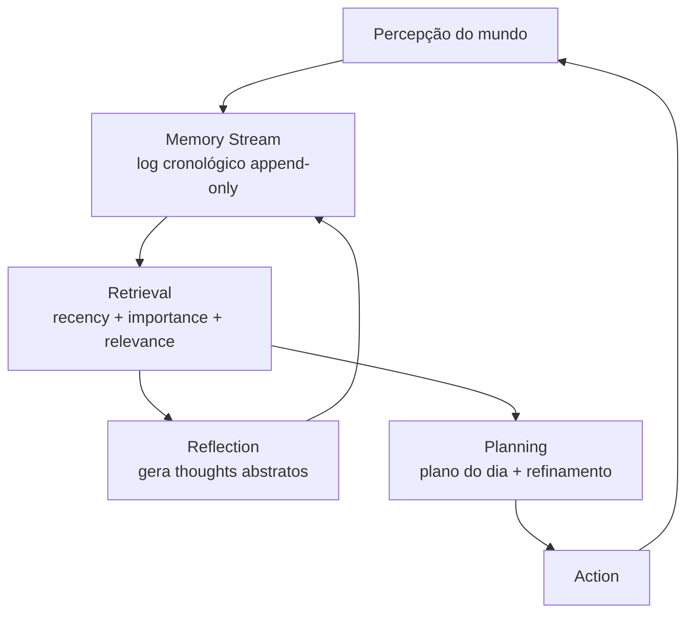
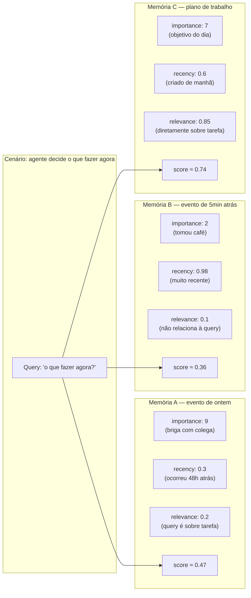
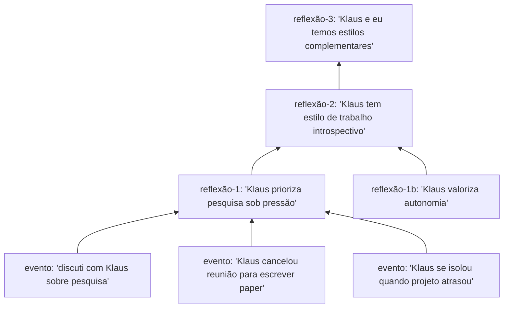
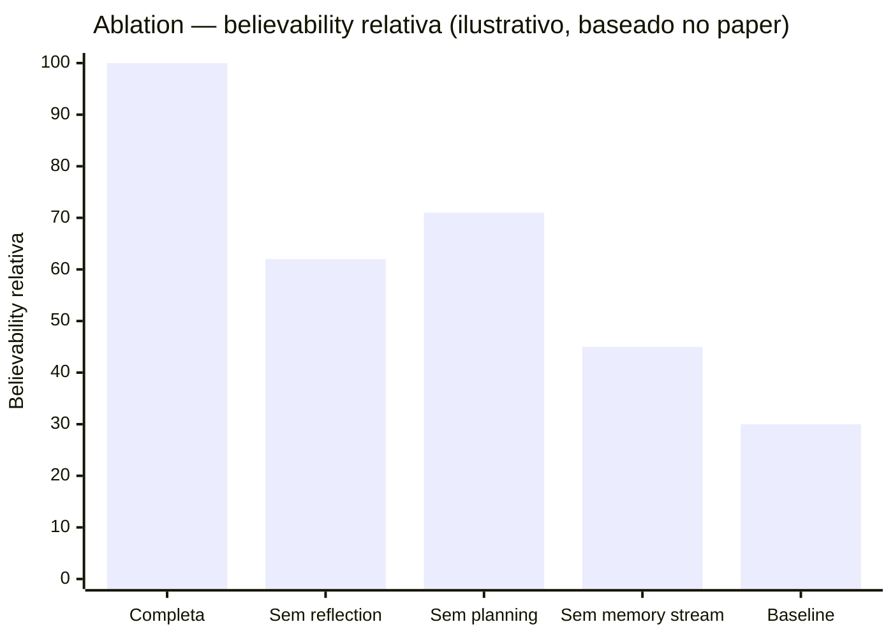
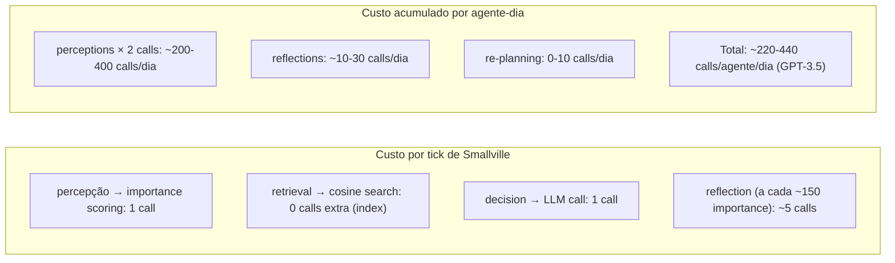

# Generative Agents (Park, Stanford 2023)

> [!abstract] TL;DR
> Paper foundational do campo de memória de agentes, publicado no UIST 2023 por Park et al. (Stanford + Google Research). Os autores simularam 25 agents num sandbox tipo The Sims e mostraram que três componentes — **memory stream, reflection trees e planning** — produzem comportamento social crível e emergente em LLMs. O artigo cunhou o vocabulário arquitetural (memory stream, retrieval scoring com **recency + importance + relevance**) que praticamente toda a literatura subsequente de agentic memory adotou e estendeu. É o ponto de partida obrigatório para quem quer entender por que agents precisam de mais do que um context window.

> [!question]- Dúvidas e lacunas desta nota
> - Dúvida gerada pelo conteúdo: O threshold de importance (~150) para disparar reflexão foi calibrado empiricamente para Smallville — como esse valor se comporta em domínios mais densos (agente de suporte ao cliente com dezenas de interações por hora)?
> - Lacuna potencial: A nota não detalha o custo exato por agent-day em tokens (apenas diz "significativo") — uma estimativa quantitativa ajudaria a dimensionar o problema de escalabilidade para sistemas de produção.

## Metadados

- **Autores:** Joon Sung Park, Joseph C. O'Brien, Carrie J. Cai, Meredith Ringel Morris, Percy Liang, Michael S. Bernstein
- **Afiliação:** Stanford University + Google Research
- **Venue:** UIST '23 (ACM Symposium on User Interface Software and Technology), October 2023
- **arXiv:** [2304.03442](https://arxiv.org/abs/2304.03442)
- **Código:** [github.com/joonspk-research/generative_agents](https://github.com/joonspk-research/generative_agents)

## Problema

Como agents podem exibir comportamento social crível ao longo de muitas interações? LLMs sozinhos não conseguem sustentar continuidade — o context window é finito e, mesmo dentro dele, não há mecanismo para distinguir o que importa do que é ruído. Pedir a um agent que "se lembre" de eventos relevantes de horas ou dias atrás esbarra em duas dificuldades: o histórico bruto não cabe no contexto, e cabendo, o [[Dicionário de IA#LLM (Large Language Model)|LLM]] não consegue priorizar — trata tudo de forma uniforme.

Mesmo soluções de retrieval simples (busca por similaridade vetorial sobre um log de interações passadas) falham em capturar o que torna um comportamento "vivo". Park et al. argumentam que falta a "alma" — a capacidade de **refletir** sobre o passado para extrair padrões abstratos, e de **planejar** o futuro a partir desses padrões. Sem reflexão, o agent é reativo; sem planejamento, é desorganizado. O paper propõe que a combinação dos três (memória, reflexão, planejamento) é o que produz believability.

## Contribuição

A contribuição central é uma **arquitetura cognitiva em três partes** que opera sobre LLMs prontos (no caso original, GPT-3.5):

1. **Memory stream.** Um log cronológico de tudo que o agent percebe — observações do mundo, ações próprias, falas trocadas com outros agents. Cada entrada carrega timestamp, descrição em linguagem natural, score de **importance** atribuído pelo LLM (escala 1-10, dado em tempo de ingestão) e timestamp de último acesso. É um substrato denso, append-only, em texto.
2. **Reflection.** Periodicamente, o agent gera "thoughts" de alto nível a partir de memórias recentes. Reflexões viram novas entradas no memory stream — recursivamente, podem ser fonte para reflexões futuras, formando uma **árvore de abstração**. Reflexão é o mecanismo que transforma fatos brutos em insights generalizáveis ("Klaus tende a focar em pesquisa quando está estressado").
3. **[[Dicionário de IA#planning|Planning]].** O agent planeja o dia em alto nível ao acordar (granularidade de horas) e refina recursivamente em planos mais finos (minutos, ações concretas) ao longo do tempo. Re-planeja em resposta a eventos que invalidam o plano vigente.

A combinação desses três componentes, mediada por um mecanismo de **retrieval scoring** sofisticado, produz agents que mantêm consistência longitudinal sem precisar de fine-tuning ou modelos especializados — apenas LLM calls coreografados.

## Como funciona



### Retrieval scoring é a chave

O coração técnico do paper está em como decidir, num dado instante, **quais memórias trazer ao contexto** para informar a próxima ação. Park et al. combinam três sinais ortogonais:

- **Recency.** Decay exponencial sobre o tempo desde o último acesso. Eventos recentes pesam mais — modela a intuição de que memórias frescas são mais salientes.
- **Importance.** Score 1-10 atribuído pelo LLM no momento da ingestão. Eventos mundanos ("comi cereal") recebem nota baixa; eventos significativos ("rompi com meu parceiro") recebem nota alta. Esse score é fixo após criação.
- **Relevance.** Cosine similarity entre o [[Dicionário de IA#embedding|embedding]] da memória e o embedding da query atual (o que o agent está tentando fazer agora).

O score final é a soma ponderada dos três (normalizados). Formalmente, para uma memória `m` e query `q` no instante `t`:

```
score(m, q, t) = α · recency(m, t) + β · importance(m) + γ · relevance(m, q)
```

Onde `recency(m, t) = decay^(t - last_access(m))` com `decay ≈ 0.995` por hora no paper original, `importance(m) ∈ [1,10]` normalizado para [0,1], e `relevance(m, q) = cosine(embed(m), embed(q))`. Os pesos `α, β, γ` são hiperparâmetros; os autores usam 1/3 para cada um na ablation principal.

O agent recupera as top-N memórias por esse score combinado e as injeta no prompt da próxima decisão. A elegância está no fato de que cada sinal isoladamente é fraco — recency sozinha esquece o que importou ontem; importance sozinha ignora contexto situacional; relevance sozinha não diferencia novo de antigo. Combinados, capturam algo próximo do que humanos chamam de "memória contextual".

### Retrieval scoring na prática

Uma forma de visualizar por que a combinação importa:



Memória C vence — é o plano de trabalho, que tem importance moderada, recency razoável e alta relevância para "o que fazer agora". Memória A (briga com colega) entra no contexto se a query for social; Memória B (tomou café) dificilmente entra em qualquer query razoável.

### Reflection trigger e árvore de abstração

A reflexão não acontece a cada tick. Os autores definem um threshold: quando a soma de importance dos eventos recentes ultrapassa um valor (~150 no paper), o agent dispara um ciclo de reflexão. O mecanismo é em duas etapas:

1. O LLM olha o memory stream recente e gera as 3 perguntas mais salientes que poderia fazer sobre si mesmo.
2. Para cada pergunta, recupera memórias relevantes via o scoring acima e gera "insights" — afirmações abstratas com referência às memórias originais que as suportam.

Esses insights entram no memory stream como entradas com type `reflection`, e podem ser recuperados pelo mesmo mecanismo. O que torna isso poderoso é a **recursividade**: reflexões podem ser fonte de novas reflexões, formando uma árvore de abstração cada vez mais profunda.



Na prática, reflexões de primeiro nível são muito específicas ("Klaus trabalha bem sob pressão"); reflexões de terceiro nível chegam a traços de personalidade generalizáveis ("Klaus e eu formamos uma equipe eficaz porque nossos estilos se complementam"). É exatamente a transição de memória episódica para semântica descrita em [[03 - Taxonomia da memória (episódica, semântica, procedural)]].

### Planning e re-planning

O agent gera um plano grosso para o dia ao acordar (5-8 itens), traduzido em linguagem natural ("9-10am: write a research proposal"). Esse plano é decomposto recursivamente em planos mais finos conforme o tempo avança:

```
Plano do dia:
  9:00-10:00 — escrever proposta de pesquisa
    9:00-9:20 — revisar notas de literatura
    9:20-9:50 — rascunhar introdução
    9:50-10:00 — revisar e ajustar
  10:00-11:00 — reunião com orientador
    ...
```

Quando uma observação inesperada invalida o plano (p.ex., um colega convida para almoço), o agent re-planeja a partir do ponto atual — mas só se o evento tiver importance alta o suficiente para justificar a quebra. Um convite de almoço de um amigo próximo → re-planning; um carro passando na rua → ignorado.

## Resultados

- **Sandbox.** O experimento principal roda 25 agents num "small town" virtual (Smallville) com 12 cômodos públicos e 25 espaços residenciais. Cada agent tem identidade inicial textual de poucas frases (nome, traços, relacionamentos, ocupação).
- **Comportamento emergente.** O resultado mais citado: uma única sugestão dada a um único agent — "organize uma festa de Valentine's Day" — propagou organicamente. Convites foram feitos, datas combinadas, locais escolhidos, e no dia da festa houve atendimento coordenado. Nada disso foi programado — emergiu do mecanismo de memória + reflexão + planejamento.
- **Avaliação humana.** Os autores conduziram avaliação humana comparando a arquitetura completa contra ablations. Avaliadores ranqueavam respostas dos agents em entrevistas estruturadas sobre dimensões como "self-knowledge", "memory", "plans", "reactions", "reflections". A arquitetura completa superou consistentemente: memory only, planning only e reflection only — todos degradam significativamente. Os três componentes são individualmente críticos e sinergéticos.
- **Believability.** O construto-chave da avaliação é "believability" — quão crível é o comportamento como o de uma pessoa. Não é uma métrica de tarefa convencional; é qualitativa, com inter-rater agreement reportado. Park et al. argumentam que esse é o framing certo para agents sociais, e o framing pegou na literatura subsequente.



## Limitações reconhecidas pelos autores

- **Custo computacional alto.** Cada percepção é uma LLM call (importance scoring), cada retrieval é uma LLM call indireta (decisão), cada reflexão é várias LLM calls. Para 25 agents num dia simulado, o custo experimental foi significativo. Os autores reconhecem que escalonar para centenas de agents ou ambientes ricos exige otimizações que o paper não aborda.
- **Sandbox simples.** Smallville é deliberadamente pequeno e bem-definido. A generalização para domínios complexos (multi-modal, com ferramentas reais, com stakes de mundo real) não é trivial — os autores admitem que o experimento é prova de conceito.
- **Hallucination persiste.** Mesmo com o memory stream, agents ocasionalmente "inventam" memórias inconsistentes ou fabricam relacionamentos que não existem. O memory stream reduz mas não elimina o problema.
- **Avaliação longitudinal limitada.** A simulação principal cobre 2 dias virtuais. Os autores reconhecem que comportamentos crônicos (relacionamentos que se desgastam ao longo de meses, hábitos que mudam) não foram testados.

## Crítica externa

- **Recepção.** O paper detonou uma explosão de trabalhos de "agentic memory" subsequentes. [[19 - A-MEM — Zettelkasten dinâmico|A-MEM]], MemGPT, Mem0, Memary, e várias frameworks comerciais citam Park et al. como referência fundacional. O artigo virou base citacional do campo e o termo "memory stream" entrou no léxico padrão.
- **Críticas comuns.** A escalabilidade de custo é o calcanhar de Aquiles mais frequentemente apontado — em produção, fazer LLM call para scoring de importance de cada percepção é proibitivo. Trabalhos posteriores (notavelmente A-MEM e abordagens com memory consolidation) propõem alternativas mais baratas. Outra crítica recorrente é que algumas ablations específicas têm reproducibilidade variável — o efeito agregado é robusto, mas decompor exatamente quanto cada componente contribui depende muito do prompt e do modelo base.
- **Reproduções independentes.** O repositório oficial é completo o suficiente para que múltiplas equipes tenham reproduzido o efeito de believability. Reviews públicas (notavelmente análises detalhadas em Medium por Andrew Lukyanenko e na newsletter gonzoml no Substack) confirmam que o comportamento emergente é real e não artefato do paper original. O efeito é robusto.

## Implicações práticas para sistemas de produção

O paper foi concebido como prova de conceito acadêmica, mas suas ideias migraram rapidamente para sistemas de produção. Algumas lições práticas que a comunidade destilou ao longo do tempo pós-publicação:

**1. Scoring de importance não precisa ser LLM call separada.**
A abordagem original do paper usa uma LLM call dedicada para perguntar ao modelo "em escala de 1-10, qual a importância deste evento?". Em produção, isso é caro. Alternativas viáveis incluem: usar heurísticas baseadas em tipo de evento (mensagem direta = 8, observação de ambiente = 3), delegar ao mesmo LLM que gera a observação (em um único prompt), ou treinar um classificador leve que aproxma o score do LLM maior com uma fração do custo.

**2. Top-N de retrieval é sensível ao N.**
Os autores usam N=25 como padrão no paper. Em produção, N muito pequeno faz o agent perder contexto relevante; N muito grande polui o prompt com memórias de baixa qualidade e aumenta custo. N adaptativo — baseado no espaço de contexto disponível e na entropy do scoring — é uma melhoria óbvia que o paper não aborda.

**3. Memory stream sem TTL acumula indefinidamente.**
O paper simula 2 dias virtuais. Um chatbot de atendimento com o mesmo design, sem expiração ou consolidação de memórias, acumula meses de histórico. O custo de retrieval cresce com o tamanho do índice de embeddings. A solução usual é alguma forma de **summarization periódica**: agrupar memórias antigas em resumos compactos, substituindo n entradas por 1. É o que o mecanismo de reflexão faz implicitamente, mas sem descartar as memórias originais.

**4. Re-planning tem custo oculto.**
Cada re-planning é uma sequência de LLM calls para decompor o novo plano e alinhar com memórias relevantes. Em Smallville, eventos inesperados são raros. Em produção (um agente de calendário, por exemplo), eventos inesperados são o caso normal — re-planning frequente pode dominar o custo operacional.



A estimativa acima é ilustrativa, não extraída diretamente do paper (os autores não publicaram breakdown detalhado de custo por agente-dia). A ordem de magnitude, porém, é consistente com reproduções independentes.

## A arquitetura em contexto histórico

Para entender o impacto real do paper, vale posicioná-lo no tempo. Em abril de 2023, quando o preprint saiu no arXiv, o GPT-4 tinha acabado de ser lançado (março de 2023), LangChain tinha menos de seis meses de existência, e a ideia de "agente autônomo" baseado em LLM era experimental. O paper chegou num momento em que a comunidade de ML estava começando a perguntar "o que vem depois do chatbot?" e forneceu uma resposta concreta: agentes com memória, reflexão e planejamento.

A comparação mais direta da época era com AutoGPT (lançado também em abril de 2023), que atacava o problema de agência com loops de ação + revisão, sem mecanismo de memória sofisticado. Generative Agents seguiu uma direção diferente: não maximizar capacidade de ação, mas maximizar **coerência longitudinal** — o agente que se lembra de quem é, o que fez, o que planeja. Essa é uma distinção fundamental que se mantém relevante: a literatura de agentic memory descende diretamente dessa escolha de Park et al.

## Armadilhas comuns

> [!warning] Armadilha 1: usar recency ou importance isoladamente
> É tentador simplificar o retrieval usando apenas recency (pegar as N memórias mais recentes) ou apenas importance (pegar as N memórias com score mais alto). Recency sozinha faz o agente esquecer tudo que aconteceu ontem — ruinoso para tarefas que exigem continuidade. Importance sozinha ignora o contexto situacional: uma memória "importante" sobre um conflito pessoal polui o raciocínio quando o agent está tentando decidir o que cozinhar para o jantar. O scoring combinado existe precisamente porque os três sinais são ortogonais e cada um captura algo que os outros não capturam.

> [!warning] Armadilha 2: disparar reflexão com frequência excessiva
> Reflexão é uma operação cara — várias LLM calls. Disparar reflexão a cada percepção nova, em vez de usar o threshold de importance acumulada (~150), produz reflexões prematuras baseadas em poucos dados e custa ordens de magnitude mais do que o necessário. O threshold existe como válvula de controle de custo e de qualidade: reflexões sobre eventos suficientemente acumulados são mais informativas e mais baratas por insight gerado.

> [!warning] Armadilha 3: confundir believability com task performance
> O experimento de Smallville não é uma prova de que agentes com memory stream executam tarefas melhor (mais rápido, com menos erros). O construto avaliado é **believability** — crença de observadores humanos de que o comportamento é humano-like. Tentar aplicar a arquitetura Generative Agents a tarefas de produção que exigem throughput alto, latência baixa e accuracy verificável (support bot, coding assistant) sem adaptar o design é um erro de categoria: os trade-offs de Smallville não são os trade-offs de produção.

> [!warning] Armadilha 4: ignorar o custo de memory stream em escala
> Um único agente com 2 dias de memória no sandbox de Smallville acumula centenas de entradas. Em produção, um agente de suporte ao cliente pode acumular dezenas de interações por dia durante meses. Sem mecanismo de **forgetting** ou consolidação (que Park et al. não implementam), o memory stream cresce linearmente e o custo de retrieval (especialmente o scoring) cresce junto. A-MEM e outros trabalhos posteriores atacam exatamente esse gap — mas o paper original não oferece solução.

## Por que importa para a trilha

- **Cunhou o vocabulário** que toda a literatura subsequente usa: memory stream, reflection, retrieval com recency + importance + relevance, believability como métrica. Sem esse vocabulário, é impossível ler a literatura recente de agentic memory.
- **Conexão direta com [[03 - Taxonomia da memória (episódica, semântica, procedural)]].** O memory stream é uma instância clara de [[Dicionário de IA#episodic memory|memória episódica]] de longo prazo — log de eventos com timestamps. As reflexões são o mecanismo de **transição** de episódica para [[Dicionário de IA#semantic memory|semântica]]: extraem padrões generalizáveis a partir de eventos concretos. O paper antecipa, na prática, a divisão taxonômica que a literatura formalizaria depois.
- **Inspiração arquitetural para [[19 - A-MEM — Zettelkasten dinâmico]].** A-MEM evolui o conceito ampliando para um Zettelkasten dinâmico — em vez de log + reflexão, propõe uma estrutura de notas interlinkadas que se reorganizam. A relação direta de descendência intelectual está reconhecida no próprio paper do A-MEM.
- **Compara com [[06 - O LLM Wiki Pattern (gist do Karpathy)|06 - LLM Wiki Pattern]].** Park ataca o problema de memória com **simulação social** — agents num mundo virtual, mecanismo de retrieval probabilístico. [[Andrej Karpathy|Karpathy]] ataca o mesmo problema com **pragmatismo de wiki** — markdown interlinkado, schema explícito, humano na curadoria. Ambos resolvem o gap "LLM esquece"; estilos arquiteturais radicalmente diferentes. Lê-los em sequência ilumina o espaço de design.
- **Ponte para [[08 - Arquitetura de um sistema de memória]].** O vocabulário arquitetural usado nessa nota da trilha é informado diretamente por Park et al. — entender o paper original deixa a arquitetura genérica muito mais legível.

## Como explicar em inglês

> [!tip] Interview quote
> "Generative Agents introduced a three-layer memory architecture — memory stream, reflection trees, and planning — where retrieval combines recency, importance, and relevance to surface contextually appropriate memories at each decision point."

| Português | Inglês |
|-----------|--------|
| Fluxo de memória | Memory stream |
| Pontuação de recuperação | Retrieval scoring |
| Decaimento exponencial | Exponential decay |
| Reflexão (abstração de fatos) | Reflection / reflection tree |
| Planejamento e re-planejamento | Planning and re-planning |
| Crença/credibilidade do comportamento | Believability |
| Importância (score LLM) | Importance score |
| Similaridade por cosseno | Cosine similarity |
| Memória episódica | Episodic memory |
| Threshold de disparo | Trigger threshold |

## O que vem a seguir

Generative Agents demonstrou que a tríade memória + reflexão + planejamento é suficiente para produzir comportamento social emergente, mas deixou em aberto o problema de como **organizar** essa memória ao longo do tempo sem crescimento linear de custo. A próxima nota, [[19 - A-MEM — Zettelkasten dinâmico]], responde a essa pergunta com uma inspiração inesperada: o sistema de fichas de Niklas Luhmann. Em vez de um log append-only, A-MEM propõe uma rede de notas estruturadas que se reorganizam dinamicamente — onde inserir uma memória nova pode atualizar memórias antigas, em vez de apenas empilhar mais entradas num stream crescente.

A mudança de paradigma é significativa: Park et al. modelam memória como **história** (o que aconteceu, em ordem cronológica); A-MEM modela memória como **conhecimento** (o que sabemos, organizado por relações semânticas). São metáforas diferentes para o mesmo problema, e entender ambas lado a lado revela qual tipo de tarefa favorece cada abordagem. É a evolução direta do que Park et al. abriram.

## Perguntas para levar para a próxima nota

Ao terminar este paper, algumas perguntas naturalmente ficam em aberto — e a próxima nota ([[19 - A-MEM — Zettelkasten dinâmico]]) responde pelo menos duas delas:

1. **O memory stream precisa ser append-only?** Park et al. nunca atualizam uma memória existente — apenas adicionam. É a decisão mais simples possível. A-MEM questiona essa escolha e propõe que memórias antigas possam ser *revisadas* à luz de novas informações.
2. **Como expressar relações entre memórias?** O scoring de Park et al. captura relevância de memória individual para uma query, mas não relações entre memórias — duas memórias relacionadas são recuperadas independentemente, e o LLM tem que inferir a conexão. A-MEM materializa essas relações como links explícitos, tornando a estrutura navegável.
3. **Há limite de escala?** O paper usa 25 agents e 2 dias. O que acontece com 1000 agents e 1 ano? A questão de escalabilidade fica em aberto e é o que surveys como [[20 - Surveys e estado da arte 2026]] começam a sistematizar.

## Veja também

- [[03 - Taxonomia da memória (episódica, semântica, procedural)|03 - Taxonomia]] — onde memory stream encaixa
- [[06 - O LLM Wiki Pattern (gist do Karpathy)|06 - LLM Wiki Pattern]] — abordagem complementar
- [[08 - Arquitetura de um sistema de memória]] — vocabulário arquitetural
- [[19 - A-MEM — Zettelkasten dinâmico]] — evolução acadêmica direta
- [[20 - Surveys e estado da arte 2026]] — campo formalizado como subárea
- [[04 - RAG vs memória de longo prazo]] — contraste com retrieval puro sem scoring de importance
- [[15 - Mem0 — vetorial + grafo]] — sistema de produção que herda ideias do paper

## Referências

- Park, J. S., O'Brien, J. C., Cai, C. J., Morris, M. R., Liang, P., & Bernstein, M. S. (2023). _Generative Agents: Interactive Simulacra of Human Behavior._ UIST '23 — [arxiv.org/abs/2304.03442](https://arxiv.org/abs/2304.03442)
- Repositório oficial de código — [github.com/joonspk-research/generative_agents](https://github.com/joonspk-research/generative_agents)
- Stanford HAI — página institucional do projeto (Stanford Human-Centered AI Institute)
- Lukyanenko, A. — review detalhada em Medium sobre Generative Agents
- gonzoml (Substack) — análise crítica do paper e impacto no campo
- Schick, T. et al. (2023). _Toolformer: Language Models Can Teach Themselves to Use Tools._ — paper contemporâneo que contextualiza a discussão sobre agentes com ação vs. agentes com memória
- Significant-Gravitas/AutoGPT — repositório do AutoGPT (abril 2023), contemporâneo do paper, abordagem contrastante focada em ação autônoma sem memory stream sofisticado
- Weng, L. (2023). _LLM-powered Autonomous Agents._ Lilianweng.github.io — survey de agentes que sistematiza o vocabulário do paper numa referência amplamente citada pela comunidade
- Xu, W. et al. (2025). _A-MEM: Agentic Memory for LLM Agents._ NeurIPS 2025 — successor direto que estende e critica as limitações do memory stream
