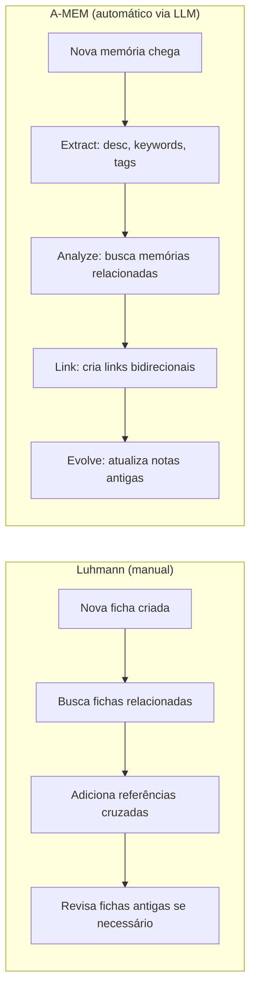
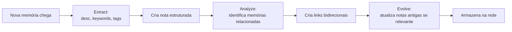
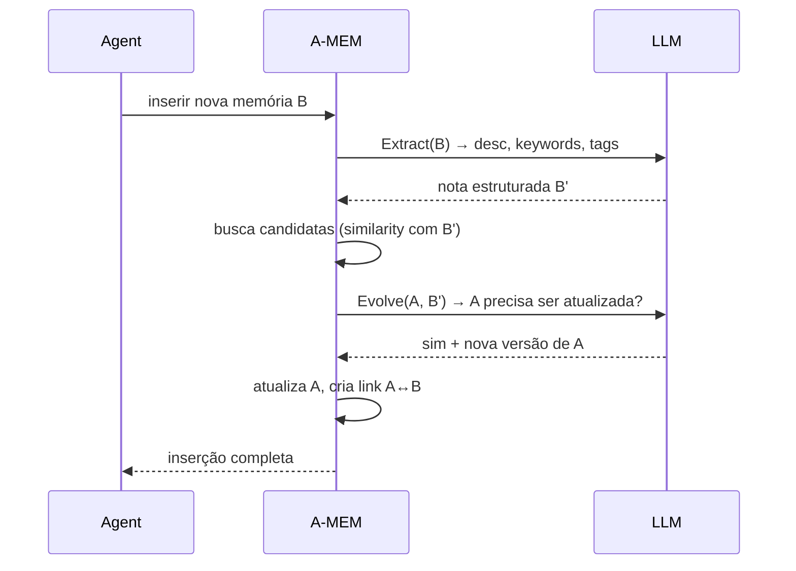

# A-MEM — Zettelkasten dinâmico

> [!abstract] TL;DR
> A-MEM (Agentic Memory) aplica princípios do **Zettelkasten** de Niklas Luhmann a sistemas de memória para LLM agents. Cada nova memória vira uma "nota" com atributos estruturados (contextual description, keywords, tags); o sistema **automaticamente identifica conexões com memórias anteriores e pode atualizar notas antigas** — *memory evolution* — quando um contexto novo chega. A proposta deixa de tratar memória como pilha que cresce e passa a tratá-la como rede que se reorganiza. Aceito em **NeurIPS 2025**.

> [!question]- Dúvidas e lacunas desta nota
> - Dúvida gerada pelo conteúdo: A etapa de *evolve* decide atualizar uma nota antiga com base em quê exatamente — threshold de similarity, prompt específico, ou o LLM decide livremente? O paper descreve o mecanismo em alto nível mas não detalha o critério de ativação do *evolve* por nota.
> - Lacuna potencial: A nota não compara A-MEM com MemGPT (que usa hierarquia de memória main context / archival) nem com Mem0 (grafo + vetorial) em termos de custo por inserção e qualidade de retrieval — uma tabela comparativa seria valiosa para quem precisa escolher entre eles.

## Metadados

- **Autores:** Wujiang Xu, Zujie Liang, Kai Mei, Hang Gao, Juntao Tan, Yongfeng Zhang
- **Afiliação:** Rutgers University (o e-mail de contato do primeiro autor é `wujiang.xu@rutgers.edu`; o grupo é frequentemente associado ao laboratório AGI Research, da própria Rutgers)
- **Venue:** NeurIPS 2025 — *Advances in Neural Information Processing Systems*
- **arXiv:** [2502.12110](https://arxiv.org/abs/2502.12110)
- **Código (sistema de memória):** [github.com/agiresearch/A-mem](https://github.com/agiresearch/A-mem)
- **Código (reprodução dos experimentos do paper):** [github.com/WujiangXu/AgenticMemory](https://github.com/WujiangXu/AgenticMemory) — apontado pelo próprio README do agiresearch como o repositório canônico para reproduzir os resultados

## Problema

Sistemas de memória anteriores tratam o histórico do agente de duas formas dominantes, e ambas têm limites claros. A primeira é o *memory stream* descrito em [[18 - Generative Agents (Park, Stanford 2023)|18 - Generative Agents]]: memórias são adicionadas em sequência, recuperadas por uma combinação de *recency*, importância e similarity, e nunca se reorganizam. A segunda é o [[Dicionário de IA#RAG (Retrieval-Augmented Generation)|RAG]] vetorial puro discutido em [[04 - RAG vs memória de longo prazo]] e em [[05 - Beyond RAG - quando RAG não basta]]: cada memória vira um vetor isolado em um índice, e a relação entre elas só existe implicitamente, no espaço de embeddings.

O que falta nas duas abordagens é **organização emergente**. Não há mecanismo para que duas memórias reconheçam uma à outra como parte de um mesmo tópico, nem para que uma memória antiga seja *atualizada* quando uma observação posterior muda o que ela significa. A-MEM ataca exatamente esse vácuo.

A pergunta central do paper pode ser formulada assim: se um humano que usa Zettelkasten consegue construir, ao longo de décadas, uma rede de notas que se auto-organiza e gera insights novos, por que não automatizar esse processo para um LLM agent?

## O Zettelkasten de Luhmann — a inspiração

Niklas Luhmann (1927-1998) foi um sociólogo alemão prolífico que produziu mais de 70 livros e 400 artigos acadêmicos. Seu método de trabalho era baseado num sistema físico de fichas interligadas chamado Zettelkasten (caixa de fichas, em alemão). Cada ficha continha uma ideia atômica com um identificador único; ao criar uma ficha nova, Luhmann explicitamente buscava fichas anteriores relacionadas e adicionava referências cruzadas.

O que tornava o Zettelkasten poderoso não era o tamanho (ele chegou a 90.000 fichas), mas a **estrutura de links**: ao navegar pela rede de referências cruzadas, combinações inesperadas de ideias emergiam — combinações que Luhmann não havia planejado explicitamente ao criar as fichas individuais. Ele descreveu o Zettelkasten como um "parceiro de conversação" que surpreendia com associações novas.

A-MEM automatiza exatamente esse processo:



A diferença crucial é que Luhmann fazia isso manualmente, nota por nota, ao longo de décadas. A-MEM faz em milissegundos, via LLM calls, a cada nova memória inserida.

## Contribuição

O paper propõe um sistema que combina três ideias:

1. **Estrutura Zettelkasten para cada memória.** Em vez de armazenar o conteúdo bruto, o sistema gera, via [[Dicionário de IA#LLM (Large Language Model)|LLM]], uma nota estruturada com atributos: *contextual description*, *keywords*, *tags*, *category* e *timestamp*. Isso é diretamente análogo ao formato fichado que Luhmann usava em suas caixas de fichas (*Zettelkästen*).
2. **Linkagem dinâmica baseada em similarity semântica.** Ao inserir uma nota nova, o sistema analisa o conjunto existente, identifica notas relacionadas e cria links explícitos entre elas. A rede de memória cresce como um grafo, não como uma lista.
3. ***Memory evolution*.** Esta é a contribuição mais distinta. Inserir uma nota nova pode disparar **atualização das representações de notas antigas** — descrição, keywords ou tags são reescritas à luz do novo contexto. A memória deixa de ser *append-only* e passa a ser *revisable*.

A combinação dos três permite chamar A-MEM, no vocabulário do paper, de "agentic memory": uma memória que não só registra, mas se organiza ativamente.

## Como funciona



Cada nota segue, segundo o repositório de referência, um schema próximo de:

```text
(content, contextual_description, keywords, tags, category,
 timestamp, links_to_other_notes, last_evolved_at)
```

O fluxo de inserção tem quatro etapas, todas mediadas por LLM:

- **Extract** — a partir do conteúdo bruto, o modelo gera descrição contextual, keywords e tags.
- **Analyze** — o sistema busca, no índice existente, memórias semanticamente próximas e identifica candidatas a link.
- **Link** — links bidirecionais são materializados entre a nova nota e as candidatas selecionadas.
- **Evolve** — para cada nota antiga ligada, o modelo decide se há razão para reescrever campos da nota antiga (por exemplo, expandir a descrição ou refinar as tags). É aqui que A-MEM se distingue de tudo que existia antes.

A recuperação, na hora da consulta, combina similarity de [[Dicionário de IA#embedding|embeddings]] com travessia dos links — semelhante ao que se faz em grafos de conhecimento, mas com a estrutura sendo construída pelo próprio agente em runtime.

**Inspiração explícita em Luhmann.** O paper cita Niklas Luhmann e o Zettelkasten como referência central. A novidade declarada não é o formato fichado em si — Luhmann já usava algo equivalente em papel —, mas **automatizar via LLM o trabalho de linkagem e revisão** que ele fazia manualmente, fichinha por fichinha, ao longo de décadas.

## Memory evolution em detalhe

O *memory evolution* é a peça mais inovadora do sistema e vale detalhar o mecanismo. Considere um cenário concreto:

**Memória A** (inserida na semana passada):
- content: "usuário prefere respostas curtas e diretas"
- keywords: [preferência, brevidade, comunicação]
- contextual_description: "usuário valoriza concisão nas respostas"

**Memória B** (inserida hoje):
- content: "usuário pediu mais detalhes sobre o mecanismo de atenção do transformer"
- keywords: [transformer, atenção, detalhes técnicos]

Durante o Evolve, o LLM analisa A à luz de B e pode reescrever A:

**Memória A (evoluída)**:
- keywords: [preferência, brevidade, comunicação, contexto-dependente]
- contextual_description: "usuário valoriza concisão no geral, mas prefere detalhes em tópicos técnicos avançados"

Esse tipo de refinamento é impossível num sistema append-only — a memória A original seria recuperada junto com B, e o LLM teria que inferir a nuance durante a geração. Com *evolution*, a nuance está capturada na própria estrutura da memória.



## Custo de LLM calls por inserção

Uma das críticas mais diretas ao A-MEM é o custo de LLM calls. Vale mapear o custo mínimo e máximo por inserção:

| Etapa | Calls mínimas | Calls máximas |
|-------|---------------|---------------|
| Extract | 1 | 1 |
| Analyze (busca candidatas) | 0 (cosine search) | 0 (cosine search) |
| Link (decide quais linkar) | 1 | 1 |
| Evolve (por nota candidata) | 0 (sem candidatas) | N (uma por candidata) |
| **Total** | **2** | **2 + N** |

Onde N é o número de notas candidatas a serem evoluídas. Em casos típicos, N ≈ 1-3; em casos de memória densa sobre um único tópico, N pode chegar a 10+. Isso significa que inserir uma memória nova num sistema maduro pode custar 12+ LLM calls — comparado a 1-2 calls num memory stream simples.

O paper mitiga esse custo argumentando que a qualidade de retrieval melhora substancialmente, reduzindo o número de memórias irrelevantes injetadas no contexto de geração. O trade-off: mais custo na inserção, menos custo e menos ruído na inferência.

## Resultados

- Avaliação em **seis foundation models** (segundo o paper; a lista exata varia entre famílias open e closed source).
- Benchmark principal: **LoCoMo**, com cinco categorias de pergunta — *multi-hop*, *temporal*, *open-domain*, *single-hop* e *adversarial*.
- Os autores reportam ganhos sobre baselines SOTA de memória de agentes nos seis modelos, com vantagem particularmente clara em tarefas de **multi-hop reasoning** — exatamente o regime em que a estrutura de links bidirecionais ajuda.
- Números específicos por categoria devem ser consultados diretamente na tabela do paper; aqui mantenho o resumo qualitativo para evitar afirmações que não consegui verificar linha a linha.

## A-MEM vs. memory stream: diferença de metáfora

A distinção entre A-MEM e o memory stream de Generative Agents não é apenas técnica — é uma diferença de **metáfora fundamental** sobre o que memória significa.

O memory stream trata memória como **história**: uma linha do tempo de eventos que aconteceram, acessíveis por relevância e recência. A pergunta implícita é "o que aconteceu que é relevante agora?". A estrutura é linear (log), o acesso é por scoring, e o passado é imutável.

A-MEM trata memória como **conhecimento**: uma rede de fatos, conceitos e relações que o agente construiu, acessível por travessia semântica. A pergunta implícita é "o que sei que é relevante aqui?". A estrutura é um grafo, o acesso é por similarity + travessia, e o passado pode ser revisado à luz do presente.

Essas duas metáforas correspondem, curiosamente, à distinção clássica entre memória episódica e semântica da psicologia cognitiva (ver [[03 - Taxonomia da memória (episódica, semântica, procedural)]]):

| Conceito | Memory stream | A-MEM |
|----------|--------------|-------|
| Metáfora | Diário / jornal | Enciclopédia viva |
| Tipo cognitivo | Memória episódica | Memória semântica |
| Organização | Cronológica | Temática / relacional |
| Mutabilidade | Imutável | Revisável |
| Retrieval | Score combinado (recency + importance + relevance) | Cosine + travessia de links |
| Força | Continuidade temporal | Raciocínio multi-hop |
| Fraqueza | Sem estrutura relacional | Custo de inserção alto |

O insight prático: para agents que precisam responder perguntas como "o que eu sei sobre o usuário X?" (temático), A-MEM é superior. Para agents que precisam raciocinar sobre sequências temporais ("o que aconteceu antes de Y?"), memory stream preserva essa estrutura nativamente.

## Comparação com sistemas anteriores

| Dimensão | Memory Stream (Park 2023) | RAG vetorial puro | A-MEM |
|----------|--------------------------|-------------------|-------|
| Estrutura da memória | Log cronológico (lista) | Índice de vetores | Grafo de notas estruturadas |
| Relacionamentos entre memórias | Implícito (via cosine) | Implícito (via cosine) | Explícito (links bidirecionais) |
| Memórias antigas são atualizadas? | Não (append-only) | Não (append-only) | Sim (memory evolution) |
| Custo de inserção | Alto (importance scoring por LLM) | Baixo (só embedding) | Alto (3 etapas LLM) |
| Custo de retrieval | Médio (scoring combinado) | Baixo (cosine search) | Médio (cosine + travessia de links) |
| Esquecimento explícito | Não | Não | Não |
| Multi-hop reasoning | Fraco (requer inferência do LLM) | Fraco | Forte (links explícitos) |

## Limitações reconhecidas pelos autores

- **Custo de LLM call por inserção.** Cada nova memória dispara, no mínimo, três chamadas (extract, analyze, evolve). Em produção isso multiplica custo e latência por turno de conversação.
- **Qualidade dos links depende do modelo de embeddings.** Modelos fracos produzem links ruins, e links ruins propagam ruído via *evolve*.
- **Não trata *forgetting* explicitamente.** O ciclo é *add* + *evolve*; não há mecanismo formal para descartar memórias obsoletas, o que pode levar a inchaço da rede em horizontes longos.

## Crítica externa

A análise da QvickRead no Medium ("A-MEM: Pros and Cons of a New Memory System for LLM Agents") sintetiza bem o consenso informal da comunidade:

- ***Memory evolution* é genuinamente nova.** É a peça que faltava na literatura; outros sistemas pré-A-MEM tratavam memória como log imutável.
- **O custo é a maior crítica em produção.** Cada interação multiplica chamadas a LLM, e o trade-off "qualidade de organização vs. latência/preço" não é trivial.
- **A inspiração em Luhmann é também um *marketing point*.** Zettelkasten é tema querido em comunidades de PKM (Personal Knowledge Management), o que ajudou o paper a circular muito além do circuito acadêmico estrito.

## Armadilhas comuns

> [!warning] Armadilha 1: confundir memory evolution com simples atualização de registro
> Memory evolution não é apenas "reescrever o campo de descrição da nota antiga". O processo envolve o LLM raciocinar sobre a *relação semântica* entre a nota nova e a antiga, e decidir *se* e *como* a representação da nota antiga deve mudar. Implementações que fazem override automático (sobrescrever sempre que similarity > threshold) destroem informação ao invés de enriquecê-la. A evolução precisa ser condicional e contextual — dois campos distintos.

> [!warning] Armadilha 2: usar A-MEM onde a latência de inserção é crítica
> Em sistemas onde cada turno de conversação precisa ser respondido em menos de 1-2 segundos, o custo de 3-12 LLM calls na inserção de memória é proibitivo. A-MEM foi avaliado em benchmarks de qualidade de retrieval, não em latência de throughput. Para sistemas de suporte ao cliente em tempo real, chatbots de alta frequência ou qualquer aplicação onde o usuário espera resposta imediata, a arquitetura precisa ser adaptada — por exemplo, inserção assíncrona (anotar primeiro, evoluir em background) ou batching de evoluções.

> [!warning] Armadilha 3: assumir que links bidirecionais eliminam o problema de multi-hop
> Os links do A-MEM melhoram significativamente o multi-hop reasoning (como os resultados no LoCoMo mostram), mas não o eliminam. A qualidade dos links depende da qualidade dos embeddings e da decisão do LLM durante Analyze — que pode errar. Em cadeias de raciocínio com 4+ hops, mesmo links corretos podem não ser suficientes se o retrieval não trouxer o subgrafo correto ao contexto. A-MEM ajuda, mas não é uma solução completa para reasoning complexo.

> [!warning] Armadilha 4: negligenciar o crescimento da rede sem forgetting
> A-MEM resolve organização, mas não resolve escala temporal. Uma memória de agente com 6 meses de interações densas acumula milhares de notas e dezenas de milhares de links. Sem mecanismo de consolidação ou expiração, o grafo cresce indefinidamente, o custo de Analyze cresce com o índice, e links antigos e obsoletos começam a introduzir ruído. Qualquer deploy de produção sério de A-MEM precisa de uma política de forgetting ou summarization que o paper não especifica.

## Adoção e influência pós-publicação

A-MEM foi publicado no arXiv em fevereiro de 2025 e aceito no NeurIPS 2025 — um intervalo rápido, o que indica que a contribuição foi bem recebida pelo comitê de revisão. No período entre preprint e publicação, o repositório do sistema de memória (`agiresearch/A-mem`) acumulou centenas de estrelas no GitHub, e o paper foi citado por trabalhos subsequentes sobre memória de agentes.

A influência mais clara é no vocabulário: os termos "memory evolution" e "agentic memory" (como substantivo para sistemas que organizam ativamente) passaram a circular na literatura após o paper. Sistemas de produção como Mem0 ([[15 - Mem0 — vetorial + grafo]]) incorporaram ideias semelhantes de linkagem dinâmica — embora com implementações diferentes, sem necessariamente citar A-MEM diretamente.

Um efeito colateral interessante é a penetração do paper em comunidades de PKM (Personal Knowledge Management) e produtividade, graças à referência ao Zettelkasten. O paper circulou extensamente em fóruns de ferramentas como Obsidian e Roam Research, cujos usuários reconheceram imediatamente a analogia com seus próprios sistemas manuais. Isso gerou discussões fora do circuito acadêmico sobre "o que seria um Obsidian com memory evolution?".

## Por que importa para a trilha

- A-MEM representa a **ala acadêmica** do mesmo problema que o LLM Wiki Pattern resolve pragmaticamente. Ambos perguntam "como organizar memória que evolui", mas chegam por caminhos opostos: research-led, com taxonomia formal e benchmarks, no caso do A-MEM; engineering-led, com arquivos markdown e wikilinks, no caso do gist do [[Andrej Karpathy|Karpathy]] ([[06 - O LLM Wiki Pattern (gist do Karpathy)]]).
- **Linkagem dinâmica** e ***memory evolution*** já aparecem como ideias emprestadas em sistemas de produção como Mem0 ([[15 - Mem0 — vetorial + grafo]]) — o vocabulário do paper rapidamente virou linguagem comum no campo.
- Para o vault em si, a coincidência com Zettelkasten é instrutiva: a [[03-Dominios/Tecnologia/IA/Memória de Agentes/index]] inteira é construída como um Zettelkasten humano, e A-MEM mostra como esse mesmo padrão pode ser delegado, em parte, a um agente.
- **Bridge para a taxonomia cognitiva.** A divisão entre memory stream (episódico) e A-MEM (semântico) é uma instância concreta da distinção abstrata de [[03 - Taxonomia da memória (episódica, semântica, procedural)]] — o paper exemplifica a transição e mostra que sistemas reais geralmente escolhem um dos lados, não os dois simultaneamente.
- **Ponto de contraste para avaliação.** Quando [[21 - Comparativo crítico (LongMemEval)]] apresentar resultados de benchmark cruzado, A-MEM será um dos pontos de referência centrais. Entender suas forças (multi-hop reasoning) e fraquezas (custo de inserção, sem forgetting) prepara o leitor para interpretar os números do comparativo com olho crítico.
- **O vault como instância do padrão.** Este galho de notas sobre memória de agentes é ele próprio construído como um Zettelkasten — cada nota tem links explícitos para notas relacionadas, e novas notas (como esta) referenciam e contextualizam as anteriores. A-MEM propõe automatizar exatamente isso para um LLM; o que este vault faz manualmente, o paper tenta delegar ao agente. É uma das coincidências mais instrutivas de toda a trilha.

## Como explicar em inglês

> [!tip] Interview quote
> "A-MEM treats agent memory as a dynamic Zettelkasten: each new memory is structured into a note with keywords and tags, linked to related past notes, and can trigger updates to older notes — so memory evolves rather than just accumulates."

| Português | Inglês |
|-----------|--------|
| Evolução de memória | Memory evolution |
| Nota estruturada | Structured note |
| Linkagem dinâmica | Dynamic linking |
| Links bidirecionais | Bidirectional links |
| Atributos da nota | Note attributes |
| Descrição contextual | Contextual description |
| Sistema append-only | Append-only system |
| Rede que se reorganiza | Self-organizing network |
| Travessia de grafo | Graph traversal |
| Custo de inserção | Insertion cost |

## O que vem a seguir

A-MEM representa o estado da arte acadêmico em memória estruturada para agentes, mas é um sistema isolado — avaliado em benchmarks específicos, sem contextualização ampla do campo. A próxima nota, [[20 - Surveys e estado da arte 2026]], eleva o olhar: em vez de um paper específico, apresenta os surveys mais abrangentes que catalogaram o espaço de memória para LLM agents como subárea formal da IA. Ali ficará claro como A-MEM se posiciona em relação a dezenas de outros sistemas — MemGPT, Mem0, Memary, ReadAgent — e quais dimensões de design (tipo de armazenamento, mecanismo de retrieval, política de forgetting) organizam o campo como um todo.

Dois problemas abertos que A-MEM deixa para a literatura seguinte responder: como tratar *forgetting* sem perder informação valiosa, e como balancear o custo de *evolve* com a latência aceitável em produção. Os surveys da próxima nota catalogam as tentativas de resposta que surgiram entre 2023 e 2026.

## Veja também

- [[06 - O LLM Wiki Pattern (gist do Karpathy)]] — abordagem pragmática complementar ao mesmo problema
- [[18 - Generative Agents (Park, Stanford 2023)|18 - Generative Agents]] — antecedente direto, com memory stream sem evolução
- [[20 - Surveys e estado da arte 2026]] — onde o campo é formalizado como subárea
- [[15 - Mem0 — vetorial + grafo]] — sistema de produção que toma ideias emprestado
- [[21 - Comparativo crítico (LongMemEval)|21 - Comparativo crítico]] — onde A-MEM aparece em benchmark cruzado
- [[03 - Taxonomia da memória (episódica, semântica, procedural)]] — A-MEM atua principalmente sobre memória episódica/semântica, com o *evolve* aproximando-se de consolidação semântica
- [[04 - RAG vs memória de longo prazo]] — contraste com RAG vetorial puro
- [[05 - Beyond RAG - quando RAG não basta]] — motivação para estruturas além do índice vetorial plano
- [[08 - Arquitetura de um sistema de memória]] — onde A-MEM se encaixa como campa de memória estruturada num sistema maior

## Referências

- Xu, W., Liang, Z., Mei, K., Gao, H., Tan, J., Zhang, Y. (2025). *A-MEM: Agentic Memory for LLM Agents*. arXiv preprint — `https://arxiv.org/abs/2502.12110`
- Repositório do sistema de memória — `https://github.com/agiresearch/A-mem`
- Repositório de reprodução dos experimentos — `https://github.com/WujiangXu/AgenticMemory` (apontado como canônico pelo README do agiresearch)
- QvickRead, *A-MEM: Pros and Cons of a New Memory System for LLM Agents* (AdvancedAI, Medium) — análise crítica externa
- Luhmann, N. — referência conceitual ao método Zettelkasten, citada explicitamente pelos autores
- Ahrens, S. (2017). *How to Take Smart Notes.* — livro que popularizou o Zettelkasten em comunidades de PKM e que contextualiza a inspiração do paper
- Park, J. S. et al. (2023). *Generative Agents.* UIST '23 — predecessor direto criticado e estendido pelo A-MEM
- Packer, C. et al. (2023). *MemGPT: Towards LLMs as Operating Systems.* — sistema alternativo de memória hierárquica (main context + archival), ponto de comparação frequente com A-MEM
- LoCoMo Benchmark — dataset de avaliação de memória de longo prazo para conversação, usado como benchmark principal no paper do A-MEM; disponível em Hugging Face
- Weng, L. (2023). *LLM-powered Autonomous Agents.* Lilianweng.github.io — survey que contextualiza o espaço de soluções de memória onde A-MEM se insere
- Zhang, Y. et al. (2024). *A Survey on the Memory Mechanism of Large Language Model based Agents.* arXiv — survey que categoriza A-MEM junto a outros sistemas de memória estruturada
- Hatalis, K. et al. (2023). *Memory Matters: The Need to Improve Long-Term Memory in LLM-Agents.* AAAI Workshop — trabalho que antecipou a limitação do append-only e motivou sistemas como A-MEM
