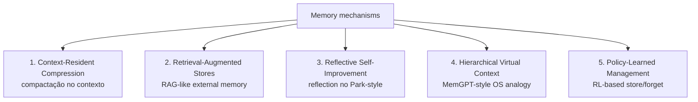

# Surveys e estado da arte 2026

> [!abstract] TL;DR
> O campo de memória de agentes atingiu **maturidade institucional** em 2026: surveys formais, taxonomias consolidadas e o primeiro workshop dedicado em venue top-tier — o ICLR 2026 ("MemAgents"), realizado em 27 de abril em Rio de Janeiro com mais de 110 submissões — comprovam que o tema deixou de ser lateral em workshops de agents-em-geral e virou linha de pesquisa própria. Esta nota organiza os principais surveys publicados entre 2024 e o início de 2026 e extrai o framework teórico que eles compartilham, com vocabulários diferentes: um consenso em torno de **cinco mecanismos arquiteturais** — compressão residente no contexto, retrieval-augmented stores, reflective self-improvement, hierarchical virtual context e policy-learned management — que cobrem praticamente toda implementação concreta do campo. Um segundo eixo, igualmente reforçado pelos cinco surveys, é a distinção entre **agent memory** (camada de runtime, auditável, atualizável em milissegundos) e **LLM memorization** (retenção paramétrica opaca do pretraining) — confusão recorrente em discussões fora da academia. Material essencial para discurso público fundamentado e para localizar criticamente qualquer implementação concreta dentro do campo.

> [!question]- Dúvidas e lacunas desta nota
> - Dúvida gerada pelo conteúdo: os cinco mecanismos de Du (2026) são mutuamente excludentes na prática ou todo sistema real de produção sempre combina ao menos dois? Existe evidência de que algum mecanismo sozinho já seja suficiente para uso real?
> - Lacuna potencial: a nota descreve os surveys mas não avalia a qualidade metodológica de cada um — quais passaram por peer review formal, quais são preprints sem revisão, quais têm viés de autor (frameworks dos próprios autores aparecem como "estado da arte")?

## Os principais surveys

A literatura de memória de agentes saiu, entre 2024 e início de 2026, de um conjunto disperso de papers para um corpo organizado, com surveys que se complementam mais do que competem. Cinco trabalhos cobrem hoje o grosso do campo.

### 1. Du (2026) — *Memory for Autonomous LLM Agents: Mechanisms, Evaluation, and Emerging Frontiers*

Survey de autor único (Pengfei Du), publicado em arXiv em março de 2026 sob o identificador `arXiv:2603.07670`. Cobre o intervalo de 2022 ao início de 2026. O formalismo central é tratar memória como um **write–manage–read loop tightly coupled with perception and action** — um ciclo de escrita, gerenciamento e leitura acoplado ao laço sensoriomotor do agente.

O que torna o formalismo de Du especialmente útil é a estrutura de três verbos: *write* (registrar uma observação relevante), *manage* (manter o store consistente, resolver contradições, compactar ou descartar entradas obsoletas) e *read* (recuperar o trecho certo na hora certa). Cada sistema de memória pode ser caracterizado pelas escolhas que faz em cada um desses três momentos — tornando a taxonomia uma ferramenta de análise, não apenas de catalogação.

A partir desse formalismo, o autor identifica **cinco famílias de mecanismos** (detalhadas mais adiante) e propõe uma taxonomia tridimensional para classificar implementações. O paper discute também desafios de engenharia (filtragem de write-path, tratamento de contradições, restrições de latência, privacidade) e questões abertas (consolidação contínua, retrieval causalmente fundamentado, mecanismos de esquecimento aprendido). É a referência mais conveniente quando o objetivo é citar um único trabalho que cubra tanto os mecanismos quanto a avaliação do campo.

### 2. *Memory in the Age of AI Agents: A Survey* (Hu et al., 2025)

Survey publicada em arXiv sob o identificador `arXiv:2512.13564`, com Yuyang Hu como primeiro autor e mais de quatro dezenas de co-autores. O framework analítico tem três dimensões: **Forms** (token-level, parametric, latent), **Functions** (factual, experiential, contextual) e **Dynamics** (formação, consolidação, retrieval).

O que distingue esta survey é a escala de cobertura — mais de quarenta co-autores significa que a coleção de papers citados é a mais abrangente disponível. O companion paper-list é mantido por Shichun Liu em `github.com/Shichun-Liu/Agent-Memory-Paper-List` — repositório frequentemente atualizado e com tração visível na comunidade, que funciona na prática como o índice mais útil do campo: quando uma referência é citada num paper recente, costuma estar listada lá com link direto. Vale acompanhar como termômetro do que circula em arXiv.

### 3. *From Storage to Experience: A Survey on the Evolution of LLM Agent Memory Mechanisms*

Disponível em OpenReview (`openreview.net/forum?id=l9Ly41xxPb`) e como preprint em Preprints.org, com versão pública em março de 2026. A contribuição distintiva é um **framework evolutivo em três estágios**: *Storage* (preservação de trajetórias), *Reflection* (refinamento de trajetórias) e *Experience* (abstração de trajetórias).

A metáfora dos três estágios carrega peso explicativo real. Um sistema de Storage puro registra o que aconteceu — como um log de aplicação. Um sistema de Reflection processa esse log, extrai padrões e cria abstrações — como um engenheiro que lê logs e escreve um post-mortem. Um sistema de Experience vai além: usa os post-mortems para construir intuições transferíveis, que o agente aplica em situações *novas* sem consultar os logs originais. A leitura proposta é diacrônica — sistemas mais antigos seriam Storage-bound, sistemas como Generative Agents introduziram Reflection, e a frontier (em 2026) está em Experience, com mecanismos de *proactive exploration* e *cross-trajectory abstraction*. É útil para classificar maturidade de implementações concretas: dada uma framework qualquer, em que estágio ela opera?

### 4. *LLM Agent Memory: A Survey from a Unified Representation–Management Perspective*

Survey em OpenReview (`openreview.net/forum?id=KPs1EgGKcT`), publicada em março de 2026. A proposta é uma taxonomia bidimensional que separa **representação** de **management**. Em representação, organiza memórias em três paradigmas: *natural language tokens*, *intermediate representations* e *parameters*. Em management, identifica três estágios operacionais: *construction*, *update* e *query*.

A distinção representação × management é especialmente útil para engenheiros que precisam tomar decisões de arquitetura: posso usar representação em linguagem natural (mais interpretável, mais cara em tokens) ou representação paramétrica (mais densa, menos auditável)? Independentemente da resposta à primeira pergunta, como vou gerenciar updates quando um fato mudar — full rewrite do store, update pontual, versionamento? O framework é avaliado aplicando-se a treze agents state-of-the-art e mostrando que a maior parte dos sistemas se encaixa cleanly numa célula da matriz representação × management — um teste de adequação razoavelmente bem-sucedido. É a referência preferida quando o ponto é discutir **operações** sobre memória, não conteúdo.

### 5. ACM TOIS — *A Survey on the Memory Mechanism of LLM-based Agents*

Versão journal (ACM Transactions on Information Systems, DOI `10.1145/3748302`), de Zhang et al., evoluída a partir do preprint `arXiv:2404.13501` e com repositório companheiro em `github.com/nuster1128/LLM_Agent_Memory_Survey`. É a primeira survey peer-reviewed em journal de prestígio dedicada exclusivamente ao tópico. O escopo é mais sistemático: define formalmente o módulo de memória, justifica sua necessidade, taxonomiza desenhos e avaliações, exibe aplicações típicas e discute limitações e direções futuras. Por estar em venue tradicional e ter passado por revisão formal, é a referência preferida em contextos acadêmicos e em qualquer texto que precise de rigor citacional.

> [!note] Outros materiais úteis (não-survey)
> Além das cinco surveys acima, dois recursos complementam o mapa: o **Awesome-GraphMemory** (`github.com/DEEP-PolyU/Awesome-GraphMemory`), que cataloga sistemas, benchmarks e papers especificamente da família grafo-de-conhecimento; e o **Awesome-Agent-Memory** (`github.com/TeleAI-UAGI/Awesome-Agent-Memory`), com escopo mais largo. Não são surveys formais, mas funcionam como índices curados.

## Os 5 mecanismos arquiteturais (consenso emergente)

A taxonomia mais útil para navegar o campo é a de **cinco famílias de mecanismos**, formalizada por Du (2026) e parcialmente recoberta pelos demais surveys com nomes diferentes. Toda implementação concreta cabe em uma ou mais dessas famílias.

### 1. Context-Resident Compression

A memória vive *dentro* do [[Dicionário de IA#Context window|context window]], mas comprimida — sumarizações, ablações, soft prompts ou tokens latentes que condensam histórico em menos tokens.

Imagine que você tem uma conversa de 40 mensagens com um assistente. Sem compressão, cada turno carrega a conversa inteira no contexto. Com Context-Resident Compression, o sistema periodicamente reescreve o histórico: em vez de 40 mensagens verbatim, o contexto passa a conter um sumário de "o que discutimos até agora" mais as últimas 5-10 mensagens em full-detail. O sumário ocupa menos tokens; as mensagens recentes ficam intactas para referência de curto prazo.

A limitação fundamental é a janela de contexto como teto. Quando o histórico cresce muito — semanas ou meses de conversas — mesmo o sumário começa a exceder o que cabe. Além disso, sumarização com perda é irreversível: se o LLM sumariou errado, a informação errada fica no contexto e não há como recuperar a original.

### 2. Retrieval-Augmented Stores

Memória externa indexada (vetorial, lexical, grafo ou híbrida) consultada a cada turno via retrieval. É a família dominante em produção — [[Dicionário de IA#RAG (Retrieval-Augmented Generation)|RAG]] aplicado a histórico do agente, com ou sem preprocessing.

A estrutura conceitual é simples: toda entrada relevante é encodada e indexada fora do contexto. A cada turno, o agente formula uma query (explícita ou implícita) e recupera os trechos mais relevantes, que então aparecem no contexto junto à mensagem atual. O agente "vê" apenas o relevante — não o histórico inteiro.

A vantagem é escala ilimitada: o store pode ter anos de histórico sem impacto na latência por turno. A desvantagem é a qualidade do retrieval: se o encoder não captura bem a semântica da query, informação relevante é perdida; se o store acumula contradições sem atualização, o retrieval traz ruído junto com sinal. Cobre desde o RAG ingênuo até sistemas como [[15 - Mem0 — vetorial + grafo|Mem0]] e [[16 - Zep e Graphiti — knowledge graph temporal|Zep/Graphiti]].

### 3. Reflective Self-Improvement

O agente periodicamente reflete sobre memórias recentes e gera abstrações de mais alto nível, que viram novas entradas no próprio store.

O pattern surge de Generative Agents (Park et al., 2023): os agentes simulados acumulavam "memories" granulares e, a cada certo intervalo, pediam ao LLM que sintetizasse as memorias recentes em "reflections" — observações de ordem mais alta como "Klaus tende a ficar ansioso quando há prazo próximo". Essas reflections eram então armazenadas no mesmo store e participavam do retrieval futuro, criando um processo de destilação contínua.

A implicação prática é importante: o sistema melhora com o tempo sem fine-tuning. Cada ciclo de reflection produz abstrações que tornam o retrieval futuro mais preciso e semânticamente rico. O custo é o LLM call de reflection, que ocorre mesmo quando não há consulta do usuário. É o padrão inaugurado por [[18 - Generative Agents (Park, Stanford 2023)|Generative Agents]] e refinado em sistemas como [[19 - A-MEM — Zettelkasten dinâmico|A-MEM]].

### 4. Hierarchical Virtual Context

Analogia de sistema operacional: memória organizada em níveis (RAM rápida, disco lento) com paginação explícita gerenciada pelo próprio [[Dicionário de IA#LLM (Large Language Model)|LLM]].

MemGPT (2023) introduziu a ideia: o LLM age como uma CPU que gerencia sua própria memória. O contexto imediato é a "RAM" — rápido, mas limitado. Um store externo é o "disco" — ilimitado, mas com latência de acesso. O próprio LLM decide quando fazer um "page-in" (trazer algo do disco para o contexto) ou "page-out" (salvar no disco algo que estava no contexto). Essa decisão é parte explícita do loop de geração: o LLM emite chamadas de ferramenta para ler e escrever no store.

A elegância da abordagem é que a paginação é dirigida pela cognição do agente — ele decide o que precisa consultar, não uma heurística externa. A fragilidade é que o LLM pode tomar decisões ruins de paging, especialmente em domínios onde o relevante não é obviamente antecipável. Inaugurada pelo MemGPT e continuada em [[14 - Letta (ex-MemGPT)|Letta]].

### 5. Policy-Learned Management

Em vez de regras fixas para escrever/atualizar/esquecer, treina-se uma policy (geralmente via RL) que aprende quando registrar, sumarizar ou descartar.

Os quatro mecanismos anteriores compartilham uma característica: as regras de escrita, atualização e descarte são definidas pelo engenheiro — heurísticas, thresholds, triggers. Policy-Learned Management inverte isso: essas regras emergem do treinamento. Um agente que recebe recompensa por lembrar corretamente de interações relevantes aprende, implicitamente, quais interações valem a pena registrar.

É a família mais frontier — apareceu em força em 2025-2026 com trabalhos como Agentic Memory e propostas de *learned forgetting*. O custo de treinamento é alto, e os requisitos de dados são não-triviais. Mas a promessa é que a policy aprende a fazer tradeoffs ótimos específicos para o domínio, em vez de depender de intuições do engenheiro sobre o que "merece ser lembrado".

Sistemas reais combinam famílias. [[17 - MemPalace (Milla Jovovich)|MemPalace]], por exemplo, mistura retrieval-augmented com hierarchical virtual context. A taxonomia é descritiva, não prescritiva — serve para localizar e comparar, não para forçar implementações em caixinhas exclusivas.

## ICLR 2026 Workshop "MemAgents"

O sinal mais claro de maturidade institucional do campo foi o primeiro workshop dedicado em venue top-tier: **Workshop on Memory for LLM-Based Agentic Systems** (URL: `sites.google.com/view/memagent-iclr26/`), realizado em **27 de abril de 2026**, em **Rio de Janeiro**, em formato híbrido.

**Por que importou.** Workshops em conferências como ICLR são o ritual pelo qual subáreas emergentes ganham reconhecimento como linha de pesquisa autônoma. A realização do MemAgents marcou o momento em que "memória de agentes" deixou de ser um tema lateral em workshops de agents-em-geral e passou a ter espaço próprio. Para a comunidade, é o sinal de que funding agencies, labs e companies passam a enxergar o tópico como digno de investimento específico — o que, por sua vez, acelera a produção de papers, benchmarks e toolkits.

**Topics oficiais.** Memory architectures (episódica, semântica, working, parametric); systems & evaluation (estruturas de dados, retrieval pipelines, benchmarks); abordagens neuroscience-inspired (complementary learning systems, consolidação hipocampo-cortical); lifelong learning e consolidação; abordagens human-centric; explicit vs. parametric memory.

**O que aconteceu no evento.** O workshop recebeu mais de **110 submissões**, número que por si só sinaliza o apetite da comunidade pelo tema. O line-up de keynotes incluiu Volker Tresp, Chelsea Finn, Jeff Clune, Mengye Ren, Aditi Raghunathan, Weiwen Liu, Fred Sala e Jeff Pan, cobrindo desde memória de longo prazo até agentes auto-evolutivos e abordagens data-centric. Um destaque citado por participantes foi a keynote de Aditi Raghunathan, "Architecting Controllable Parametric Memory in Language Models", que introduziu os conceitos de *Memorization Sinks* (MemSinks) e *Natively Unlearnable LLMs* (NULLs) — uma ponte direta com a distinção agent memory × LLM memorization discutida nesta nota. Entre os papers aceitos publicamente disponíveis estão *Adaptive Memory Admission Control for LLM Agents* (`arxiv.org/abs/2603.04549`) e *Evaluating Memory Structure in LLM Agents* (OpenReview `id=a9vY2sJkf4`).

O fato de a ICLR 2026 ter ocorrido no Brasil — primeira vez no hemisfério sul — e o workshop MemAgents ter sido um de seus eventos satélite teve relevância para comunidades de pesquisa fora dos EUA/Europa: tornou o campo fisicamente acessível a pesquisadores de América Latina, que de outra forma teriam que cruzar o Atlântico ou o Pacífico para participar de conferências tier-1.

## Distinção crítica do campo (consensual)

Um ponto que **todos os cinco surveys reforçam**, com variações de vocabulário, é que **agent memory ≠ LLM memorization**. A confusão é recorrente em discussões públicas e até em artigos divulgativos: "o LLM já tem memória, é só a gente fazer fine-tuning". Os surveys deixam claro que se trata de coisas operacionalmente distintas, em três dimensões.

| Dimensão | Agent memory | LLM memorization |
|---|---|---|
| Quando aprende | Online, durante interação | Pretraining (offline) |
| Onde vive | Híbrido externo + parametric | Primarily parametric |
| Como é gerida | Explicit write/forget policies | Opaque parametric retention |
| Auditável? | Sim — store é inspecionável | Não — pesos são opacos |
| Revisável? | Sim — delete/update no store | Não sem retraining |
| Latência de update | Milissegundos | Horas/dias (fine-tuning) |

Em outras palavras: *agent memory* é uma camada de runtime, observável, auditável e gerenciada por políticas explícitas; *LLM memorization* é o que ficou nos pesos depois do treinamento, opaco e dificilmente revisável sem retraining. Um agente que precisa lembrar do que o usuário falou ontem **não consegue** resolver isso via memorização — porque "ontem" não existia no pretraining. Confundir os dois leva a soluções erradas: tentar resolver problemas de [[Dicionário de IA#episodic memory|memória episódica]] com fine-tuning, ou esperar que prompt engineering substitua um store externo.

Uma analogia útil: LLM memorization é como educação formal — o que uma pessoa aprendeu na escola está nos seus neurônios e não muda facilmente. Agent memory é como uma agenda ou CRM — dados que a pessoa consulta ativamente e pode atualizar a qualquer momento, independentemente do que "aprendeu" antes.

## Tendências emergentes em 2026

A interseção entre os cinco surveys aponta cinco tendências que dominam a frontier do campo em 2026:

### 1. Continual learning sem catastrophic forgetting

Como atualizar memória a longo prazo sem que adições novas degradem o que já foi consolidado? Aparece em todos os surveys como questão aberta; soluções em circulação envolvem consolidação seletiva e *learned forgetting*.

O problema é análogo ao que redes neurais enfrentam em *continual learning*: aprender uma nova tarefa sem "esquecer" as anteriores. Em stores externos, a questão é: quando um fato muda (o usuário mudou de cidade), como o sistema atualiza sem perder contexto de quando o fato anterior era verdadeiro? A resposta trivial — apagar e reescrever — destrói o histórico temporal; a resposta de append-only — nunca apagar — gera store cheio de contradições. Soluções intermediárias (versionamento, bitemporalidade, consolidação periódica com archiving) são as que os surveys identificam como mais promissoras.

### 2. Multi-agent shared memory

Memória compartilhada entre múltiplos agents que cooperam — protocolos de leitura/escrita, controle de acesso, resolução de contradições. Crescente em 2025-2026 com o avanço de orquestração multi-agent.

Quando dois agents operam em paralelo e um lê memória enquanto o outro escreve, há risco de inconsistência. Quando agents têm papéis diferentes (planner, executor, critic), o que um deve ter acesso de leitura ao histórico do outro? E quando dois agents chegam a conclusões contraditórias sobre o mesmo fato, quem tem autoridade para escrever no store compartilhado? Esses são os problemas de consistência de dados que o campo está começando a endereçar com protocolos específicos.

### 3. Memória multimodal

Texto, imagem e áudio coexistindo num único store. Mais difícil que parece: representações unificadas, retrieval cross-modal, evolução temporal de mídias diferentes. Du (2026) destaca como uma das frontiers menos consolidadas.

O problema central é a representação: imagens e texto vivem em espaços vetoriais diferentes. Para fazer retrieval cross-modal funcionar (o usuário descreve em texto uma imagem que o sistema deve recuperar), é preciso ou embeddings multimodais alinhados (como CLIP) ou um camada de tradução que converte a query textual em representação compatível com o que foi indexado. Para áudio, a complexidade aumenta: transcrição introduz erros que contaminam o índice; manter o áudio original indexável sem transcrição ainda é research-grade.

### 4. Privacy-preserving memory

Encryption, federated learning e differential privacy aplicados a stores de memória. Particularmente relevante quando memória pessoal é armazenada por longos períodos — questão regulatória e ética, não só técnica. Em domínios como saúde e finanças, o store de memória pode conter informações altamente sensíveis; os surveys identificam isso como requisito que poucos frameworks endereçam explicitamente.

O problema concreto: se o store de memória de um assistente de saúde contém histórico de consultas de vários pacientes, uma vulnerabilidade no retrieval pode expor dados de um paciente em resposta a query de outro. Encryption at rest resolve confidencialidade em repouso, mas retrieval exige decriptação — abrindo janela de exposição. Differential privacy pode ser aplicada ao processo de indexação, mas a um custo de precisão de retrieval que pode ser inaceitável. É um campo onde a solução engenharia ainda não chegou à maturidade que o problema ético exige.

### 5. Avaliação rigorosa

**LongMemEval**, **LoCoMo**, **MemBench**, **MemoryAgentBench** e **MemoryArena** apareceram em rápida sucessão em 2025-2026. O campo passou de "olhar exemplos qualitativos" para benchmarks com métricas comparáveis. Discussão detalhada em [[21 - Comparativo crítico (LongMemEval)|21 - Comparativo crítico]].

A proliferação de benchmarks é sinal de maturidade — mas também cria um problema: sem uma régua única, sistemas diferentes escolhem o benchmark que os favorece. LongMemEval (ICLR 2025) está emergindo como o candidato a padrão, por ter sido aceito em venue tier-1 e adotado por múltiplos papers subsequentes como referência. Mas a coexistência com LoCoMo (para conversas longas) e benchmarks de domínio específico é esperada — benchmarks genéricos raramente capturam o que importa em domínios especializados.

## Armadilhas comuns

> [!warning] Armadilha 1: tratar survey como verdade absoluta sobre qual mecanismo é "melhor"
> Surveys descrevem e classificam — não prescrevem. Quando Du (2026) identifica Policy-Learned Management como a "família mais frontier", isso não significa que seja a melhor escolha para um sistema em produção hoje. Na prática, fronteira = não-maduro = alto custo de adoção. Sempre separar o que os surveys dizem sobre a posição relativa dos mecanismos no espectro de pesquisa do que faz sentido para o contexto de engenharia atual.

> [!warning] Armadilha 2: citar "os cinco mecanismos" como se fossem a única taxonomia válida
> Du (2026) é conveniente e bem construído, mas as outras quatro surveys usam frameworks diferentes. A survey de Hu et al. organiza por Forms/Functions/Dynamics; a de OpenReview separa representação de management. Dependendo do ângulo da discussão, outro framework pode ser mais adequado. Conhecer os cinco mecanismos sem saber que existem outras grades de análise é saber metade do mapa.

> [!warning] Armadilha 3: confundir "maturidade do campo" com "maturidade das implementações"
> Ter surveys formais e workshop no ICLR significa que o campo de *pesquisa* está maduro. Não significa que as implementações de produção estão maduras. Em abril de 2026, a maioria dos sistemas não publicou scores em benchmarks independentes, documentação de produção é esparsa, e breaking changes em APIs são frequentes. Maturidade acadêmica e maturidade de engenharia são curvas distintas.

## Panorama dos benchmarks em 2026

Uma das contribuições mais concretas dos surveys de 2026 é sistematizar os benchmarks disponíveis. A tabela abaixo resume os principais, com foco, venue de publicação e link canônico:

| Benchmark | Foco principal | Venue | Link |
|-----------|---------------|-------|------|
| **LongMemEval** | Multi-session QA, abstention, temporal | ICLR 2025 | `github.com/xiaowu0162/LongMemEval` |
| **LoCoMo** | Conversas longas, narrativa contínua | EMNLP 2024 | `github.com/snap-stanford/locomo` |
| **MemBench** | Evaluation holístico de módulos de memória | arXiv 2025 | arXiv |
| **MemoryAgentBench** | Tasks agentic com dependência de memória | arXiv 2025 | arXiv |
| **MemoryArena** | Human preferences em memória pessoal | 2026 | arXiv |

O que unifica esses benchmarks é a intenção de ir além de QA estático — todos envolvem, de alguma forma, a dimensão temporal: perguntas que só fazem sentido se o sistema lembra de interações anteriores. A diferença está no protocolo: LongMemEval usa pares sessão-pergunta sintéticos; LoCoMo usa transcrições reais de conversas; MemoryArena usa avaliação por humanos em vez de métrica automática.

Para a decisão arquitetural prática, o ponto mais importante é: se um sistema não publicou score em nenhum desses benchmarks, **a evidência quantitativa simplesmente não existe** — e a decisão de adotar precisa ser baseada em outros critérios (auditoria de código, casos de uso reportados pela comunidade, testes internos).

## Como ler os surveys em sequência

Os cinco surveys não são intercambiáveis — cada um abre um ângulo diferente e serve a um propósito diferente na leitura. Uma sequência produtiva para quem quer dominar o campo em profundidade:

**1. Começar pelo ACM TOIS (Zhang et al.)**, por ser o único peer-reviewed em journal e ter o escopo mais sistemático. Ele fornece a terminologia de base e a justificativa formal para o módulo de memória. Leva mais tempo, mas cria o vocabulário compartilhado que os demais papers assumem.

**2. Ler Du (2026) para os cinco mecanismos.** Com o vocabulário do ACM TOIS, a taxonomia de Du faz sentido imediato. É aqui que surgem os nomes context-resident compression, retrieval-augmented stores, etc. É a leitura mais eficiente se o objetivo é ter uma grade de análise para avaliar implementações.

**3. Usar Hu et al. como repositório de referências.** A survey tem mais de quarenta co-autores e cobre uma amplitude que nenhuma outra cobre. Não é necessário lê-la de capa a capa — mas o companion paper-list em GitHub é indispensável como índice do campo. Sempre que um paper novo aparecer em arXiv sobre memória de agentes, checar se já está listado lá.

**4. Usar OpenReview (Storage-Experience e Representation-Management) conforme o ângulo.** Se a questão é maturidade de um sistema específico, o framework Storage-Reflection-Experience responde melhor. Se a questão é design de operações sobre memória, o framework representação × management é mais preciso.

**5. Retornar ao ACM TOIS para revisão formal.** Após ter contato com as outras surveys, relê o TOIS revela nuances que passaram despercebidas na primeira leitura. É também onde as limitações conhecidas e direções futuras são discutidas com mais rigor citacional.

> [!tip] Dica de leitura eficiente
> Nenhum dos cinco surveys precisa ser lido de capa a capa na primeira passagem. Uma estratégia eficiente: leia o abstract e a seção de taxonomia/classificação de cada um (~15 minutos por survey). Com isso você tem o mapa de cada framework. Mergulhe fundo apenas no paper que mais se alinha com a decisão ou questão que você precisa responder agora. Os demais ficam disponíveis como referência cruzada quando surgir uma dúvida específica.

## Por que importa para a trilha

- Esta nota é **a fundamentação acadêmica** que sustenta o resto da trilha. Quando notas anteriores afirmam que A-MEM é "estado da arte" ou que o LLM Wiki Pattern "se alinha com a literatura recente", são estes os surveys que justificam tais afirmações.
- Fornece **vocabulário rigoroso** para discutir o campo sem cair em hype: termos como *write-manage-read loop*, *context-resident compression*, *policy-learned management* têm significado técnico preciso e vêm direto da literatura. Discurso público mal calibrado tende a usar "memória" como guarda-chuva sem distinguir os mecanismos por baixo.
- É **material de apoio para discurso profissional**: entrevistas técnicas, conversas com stakeholders, posicionamento em projetos. Saber citar Du (2026) ou o ACM TOIS para fundamentar uma decisão arquitetural sinaliza maturidade no campo. Separa quem leu sobre o tema na semana passada de quem acompanha a literatura.

Um detalhe prático: em conversas profissionais sobre IA, é comum ouvir afirmações como "o GPT-4 lembra de tudo" ou "é só dar o histórico no prompt". Com o mapa dos surveys em mão, você consegue localizar exatamente onde essa afirmação está errada — se está falando de contexto-residente (funciona mas tem limite de janela), memorização do LLM (não é o que a pessoa pensa que é) ou retrieval externo (que exige infra específica). A precisão não é pedantismo — é o que separa decisões arquiteturais boas de más.

Outro uso concreto: ao avaliar um novo framework de memória que aparece no radar, os surveys funcionam como checklist de perguntas. Que mecanismo(s) da taxonomia de Du ele implementa? Em que estágio do framework Storage-Reflection-Experience ele opera? Qual é a escolha de representação (tokens, intermediate, parameters) e como ele gerencia updates? Um framework que não responde a essas perguntas na documentação ainda não está pronto para uso crítico.

## Como explicar em inglês

> [!tip] Interview quote
> "Agent memory is a runtime layer — observable, auditable, and policy-managed. It's fundamentally different from what the LLM memorized during pretraining: you can read it, update it, and delete from it at millisecond speed without any retraining."

| Português | Inglês |
|-----------|--------|
| Mecanismos arquiteturais | Architectural mechanisms |
| Compressão residente no contexto | Context-resident compression |
| Store aumentado por retrieval | Retrieval-augmented store |
| Melhoria reflexiva | Reflective self-improvement |
| Contexto virtual hierárquico | Hierarchical virtual context |
| Gerenciamento aprendido por política | Policy-learned management |
| Laço escrita-gerenciamento-leitura | Write-manage-read loop |
| Memorização do LLM | LLM memorization |
| Esquecimento aprendido | Learned forgetting |
| Abstração cross-trajetória | Cross-trajectory abstraction |
| Estado da arte | State of the art |
| Consolidação contínua | Continual consolidation |

**Framing para entrevista em inglês:** when asked about agent memory systems, anchor the answer in the write-manage-read loop. "Any memory system makes three kinds of decisions: *what* to write, *how* to keep it consistent over time, and *what* to retrieve at query time. The five architectural families in the 2026 literature differ primarily in *who* makes those decisions and *where* the result lives."

**Sobre os surveys em inglês:** if the interviewer asks "what's the academic state of the art on agent memory?", a solid answer is: "As of 2026, the field has five complementary surveys — the most convenient single reference is Du 2026 on arXiv, which formalizes the write-manage-read loop and identifies five mechanism families. There's also a dedicated workshop at ICLR 2026 called MemAgents, which signals that the sub-field has matured enough for its own institutional home." This shows you follow primary literature, not just blog posts.

**Frases úteis para technical writing:**
- "Following the taxonomy proposed by Du (2026), this system falls under the *retrieval-augmented stores* family..."
- "The survey literature consistently distinguishes agent memory from LLM memorization: the former is an explicit, auditable runtime layer; the latter is opaque parametric retention."
- "As Zhang et al. (ACM TOIS) note, the memory module justification rests on three pillars: extending effective context, enabling continual learning, and supporting auditability."

## O que vem a seguir

Com os surveys como mapa conceitual, o passo natural é descer do nível teórico para o nível empírico: como os sistemas concretos se comparam quando submetidos a um benchmark rigoroso? A nota [[21 - Comparativo crítico (LongMemEval)|21 - Comparativo crítico]] responde essa pergunta usando o LongMemEval como régua.

O que você vai encontrar lá é, deliberadamente, a tensão entre o que os surveys prometem e o que os números reais entregam. Nenhum sistema cobre todos os cinco mecanismos com excelência medida. Os que publicaram scores revelam trade-offs que a taxonomia teórica não captura sozinha: MemPalace tem o score mais alto mas passa por questionamento metodológico; Zep tem score mais baixo mas brilha em casos específicos de temporal reasoning; Mem0 publica o próprio número sem reprodutibilidade independente plena. Letta, que vem diretamente do paper original do Hierarchical Virtual Context (MemGPT), não publicou score algum.

Essa tensão entre mapa teórico e números reais é o ponto de inflexão da trilha. Os surveys ensinam a linguagem; o comparativo ensina a ler os números sem se deixar enganar pelo marketing. A leitura conjunta das duas notas fecha o ciclo: teoria organiza, benchmark revela, e o repertório construído até aqui permite navegar as críticas e limitações da nota seguinte com olhos abertos.

## Veja também

> [!note] Posição desta nota na trilha
> Esta é a nota 20 de 23 do galho Memória de Agentes. Ela funciona como ancoragem acadêmica para todo o galho: os mecanismos e vocabulário apresentados aqui são usados implicitamente nas notas 10-19 (implementações concretas). A partir desta nota, a trilha entra na fase de avaliação crítica e síntese — benchmarks (21), limitações (22) e guia de implementação (23).

- [[03 - Taxonomia da memória (episódica, semântica, procedural)|03 - Taxonomia]] — vocabulário fundamental, cognitivo, anterior aos surveys
- [[08 - Arquitetura de um sistema de memória]] — onde os 5 mecanismos encaixam num desenho concreto
- [[18 - Generative Agents (Park, Stanford 2023)|18 - Generative Agents]] — paper foundational citado por todos os surveys
- [[19 - A-MEM — Zettelkasten dinâmico]] — paper recente, instância de Reflective Self-Improvement
- [[21 - Comparativo crítico (LongMemEval)|21 - Comparativo crítico]] — onde os benchmarks da tendência (5) aparecem em ação
- [[22 - Críticas, limitações e armadilhas]] — auditoria honesta do campo, complemento crítico desta nota

## Referências

- Du, P. (2026). *Memory for Autonomous LLM Agents: Mechanisms, Evaluation, and Emerging Frontiers*. arXiv preprint — `https://arxiv.org/abs/2603.07670`
- Zhang, Z., Bo, X., Ma, C., Li, R., Chen, X., Dai, Q., Zhu, J., Dong, Z., Wen, J.-R. *A Survey on the Memory Mechanism of Large Language Model-based Agents*. ACM Transactions on Information Systems — `https://dl.acm.org/doi/10.1145/3748302` (preprint em `https://arxiv.org/abs/2404.13501`; repositório em `https://github.com/nuster1128/LLM_Agent_Memory_Survey`)
- *From Storage to Experience: A Survey on the Evolution of LLM Agent Memory Mechanisms*. OpenReview — `https://openreview.net/forum?id=l9Ly41xxPb`
- *LLM Agent Memory: A Survey from a Unified Representation–Management Perspective*. OpenReview — `https://openreview.net/forum?id=KPs1EgGKcT`
- Hu, Y. et al. (2025). *Memory in the Age of AI Agents: A Survey*. arXiv `2512.13564` — `https://arxiv.org/abs/2512.13564`
- *Agent-Memory-Paper-List* — companion paper-list mantido por Shichun Liu em `https://github.com/Shichun-Liu/Agent-Memory-Paper-List`
- ICLR 2026 Workshop on Memory for LLM-Based Agentic Systems ("MemAgents") — `https://sites.google.com/view/memagent-iclr26/`
- *Adaptive Memory Admission Control for LLM Agents*. ICLR 2026 Workshop MemAgents — `https://arxiv.org/abs/2603.04549`
- *Evaluating Memory Structure in LLM Agents*. ICLR 2026 Workshop MemAgents, OpenReview — `https://openreview.net/pdf?id=a9vY2sJkf4`
- *Awesome-GraphMemory* — `https://github.com/DEEP-PolyU/Awesome-GraphMemory` (catálogo curado de sistemas grafo-baseados)
- *Awesome-Agent-Memory* (TeleAI-UAGI) — `https://github.com/TeleAI-UAGI/Awesome-Agent-Memory` (catálogo curado complementar)
- Park, J.S. et al. (2023). *Generative Agents: Interactive Simulacra of Human Behavior*. arXiv `2304.03442` — fundação do mecanismo Reflective Self-Improvement
- *LoCoMo benchmark* — `https://github.com/snap-stanford/locomo` — benchmark de conversas longas usado pelo A-MEM
