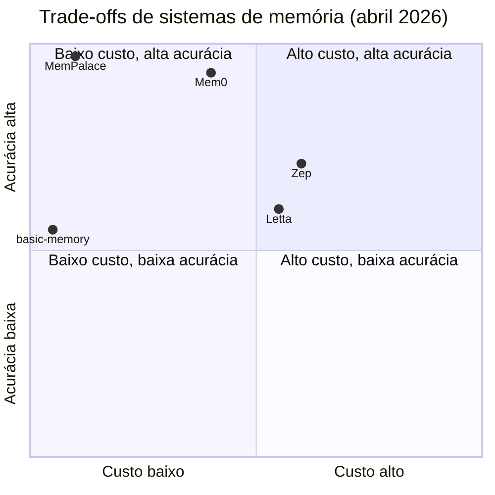

# Comparativo crítico (LongMemEval)

> [!abstract] TL;DR
> **LongMemEval** (ICLR 2025) virou o benchmark padrão de facto para medir memória de longo prazo em chat assistants — multi-session, retrieval consistente, abstention. Em abril de 2026, os números públicos são: **MemPalace 96,6% raw / 98,4% no modo hybrid v4**, **Mem0 ~93,4% (auto-reportado)** e **Zep 63,8% com gpt-4o-mini / 71,2% com gpt-4o** — não 85%, como circula em algumas coberturas. **Letta, Cognee, LangMem e SuperMemory não publicaram score**. **A-MEM usa LoCoMo, não LongMemEval**, então não entra na comparação direta. Esta nota organiza os números corrigidos, expõe trade-offs (acurácia × custo × latência × modelo base × versão) e dá recomendações por caso de uso, lembrando que score alto não implica best fit.

> [!question]- Dúvidas e lacunas desta nota
> - Dúvida gerada pelo conteúdo: o score de Mem0 (93,4%) é auto-reportado — existe alguma auditoria independente que confirme ou refute esse número? A reprodutibilidade parcial mencionada é suficiente para confiar na comparação com MemPalace?
> - Lacuna potencial: a nota compara sistemas em LongMemEval mas não mostra como rodar o benchmark você mesmo num sistema customizado — um passo a passo de reprodução tornaria esta nota um guia prático além de um comparativo de resultados.

## O que é o LongMemEval

Imagine comparar três candidatos a fornecer memória de longo prazo para o seu assistente: um deles anuncia "96,6% de acurácia", outro "93,4%", um terceiro "71,2%". Qual é o melhor? A pergunta parece trivial, mas esconde uma armadilha — cada número pode ter sido medido num benchmark diferente, com um modelo base diferente, num modo de avaliação diferente (raw ou hybrid). Comparar os três lado a lado sem saber isso é como comparar tempos de corrida sem saber se foram 100m ou maratona. É exatamente esse problema — medir sistemas de memória de agentes numa régua comum, comparável — que o **LongMemEval** existe para resolver.

[LongMemEval](https://github.com/xiaowu0162/LongMemEval) é um benchmark publicado em ICLR 2025 (Wu et al.) projetado para avaliar memória de longo prazo em **chat assistants** ao longo de múltiplas sessões. Cobre cinco-plus categorias: *single-hop reasoning*, *multi-hop reasoning*, *temporal reasoning*, *abstention* (saber quando dizer "não sei") e *knowledge-intensive QA*. As métricas mais reportadas são *Recall@5* (R@5) — proporção em que o trecho relevante aparece nos top-5 retrieved — e acurácia de resposta condicionada à recuperação.

O que torna LongMemEval especialmente útil para comparação é a estrutura do cenário de teste. O benchmark simula um usuário que teve **múltiplas sessões de chat** com o assistente ao longo do tempo — dias ou semanas de conversas fictícias. As perguntas de avaliação então requerem que o assistente se lembre de informações mencionadas em sessões *anteriores*, às vezes combinando fatos de sessões diferentes (multi-hop), às vezes com contradições temporais ("você disse X semana passada, mas agora você disse Y — qual é correto?"), e às vezes perguntando sobre algo que simplesmente nunca foi mencionado (abstention).

A relevância do benchmark é dupla. Primeiro, ele captura o cenário real em que sistemas de memória são usados: conversas longas, com referências cruzadas a sessões anteriores, e a necessidade de não alucinar quando a informação não está disponível. Segundo, por ter sido aceito em ICLR 2025 e adotado por papers subsequentes (Mem0, Zep) como referência, tornou-se o **padrão de facto da indústria** — quem publica score em LongMemEval está participando de uma conversa pública mensurável; quem não publica obriga o leitor a tomar decisões com menos evidência.

## Como ler os scores — metodologia

Antes da tabela de números, é essencial entender o que os scores medem e o que eles *não* medem. Scores de LongMemEval não são intercambiáveis sem contexto.

**O que Recall@5 mede.** R@5 pergunta: dado o trecho relevante para responder a pergunta, ele aparece nos 5 primeiros resultados do retrieval? Um sistema com R@5 de 96% encontra o trecho certo nas 5 primeiras posições em 96% dos casos. O que R@5 *não* mede: se o LLM depois usa corretamente o trecho recuperado para gerar a resposta. Um sistema pode ter R@5 alto mas ainda errar a resposta se o LLM falha na síntese.

**O que acurácia de resposta mede.** A métrica de resposta final avalia se o sistema produziu a resposta correta end-to-end — retrieval + geração. É a métrica mais próxima da experiência do usuário, mas é também mais ruidosa: ela confunde erros de retrieval com erros do LLM gerador.

**Dois modos: raw e hybrid.** Raw = retrieval direto do store, sem pós-processamento. Hybrid = retrieval + reranking com LLM, ou fusão com keyword search. O modo hybrid quase sempre melhora o score, mas adiciona latência e custo. Comparar raw de um sistema com hybrid de outro é comparação injusta.

## Por que importa

Sem um benchmark padrão, comparações entre sistemas de memória viram anedota: cada framework reporta sua própria métrica, em seu próprio cenário, com seu próprio modelo base — e nada é comparável. LongMemEval resolve parte desse problema, mas adiciona um problema novo: **agora todo mundo cita LongMemEval, e os números viram bullet point de marketing**, frequentemente sem o contexto necessário (qual modelo, qual versão, raw ou hybrid).

A consequência prática é que o **score sozinho não basta**. Precisa vir acompanhado de:

- **Modelo base usado** (gpt-4o-mini, gpt-4o, Claude Sonnet, etc.)
- **Modo de avaliação** (raw retrieval × hybrid com [[Dicionário de IA#reranking|reranking]])
- **Versão do benchmark** (v3, v4, etc.)
- **Quem reportou** (autoria do paper × terceiro independente)
- **Reprodutibilidade** (existe scaffolding público para reexecutar?)

Mais: a **ausência de score também é informação**. Letta, Cognee, LangMem e SuperMemory não publicaram resultado em LongMemEval em abril de 2026. Isso não é condenação automática — pode significar foco em outro tipo de workload, prioridade comercial sobre publicação, ou simplesmente que o benchmark não captura o que o sistema otimiza. Mas é um ponto a registrar quando a decisão é "qual ferramenta adotar".

## Como funciona — tabela rigorosa

A tabela abaixo consolida os números públicos em abril de 2026, com os ajustes feitos a partir da leitura direta dos READMEs oficiais e papers (em vez dos números marketing-flavored que circulam em coberturas secundárias).

| Sistema | LongMemEval (raw) | LongMemEval (hybrid) | Latência | Custo | Substrate | Open source? |
| --- | --- | --- | --- | --- | --- | --- |
| **MemPalace** | 96,6% R@5 | **98,4% v4** ¹ | low (≈170-token startup) | grátis local | spatial palace + SQLite + ChromaDB | sim (MIT) |
| **Mem0** | 93,4% (auto-reportado) | — | 91% lower vs full-context | $-$$ | vetor + grafo (Mem0g) | sim (Apache 2.0, lib) |
| **Zep** | 63,8% (gpt-4o-mini) / **71,2% (gpt-4o)** | — | tokens 115k→1,6k; latência 30s→3s | $$ | KG temporal (Neo4j) | engine sim (Graphiti, Apache 2.0); cloud não |
| **Letta** | **NÃO publicado** | — | — | $20-$200/mês ou self-host | hierarchical (RAM/disk) | sim (Apache 2.0) |
| **Cognee** | NÃO publicado | — | — | varia | KG + vetor | sim |
| **LangMem** | NÃO publicado | — | — | varia | namespaces sobre LangGraph | sim |
| **SuperMemory** | NÃO publicado | — | — | varia | proprietário | parcialmente |
| **A-MEM** | **Usa LoCoMo (não LongMemEval)** | — | — | research | Zettelkasten links | sim (research) |
| **basic-memory** | NÃO publicado (foco MCP/Obsidian) | — | low (markdown local) | grátis | markdown + SQLite FTS | sim (Apache 2.0) |
| **graphify** | NÃO publicado | — | — | grátis | KG sobre raw markdown | sim |
| **LLM-knowledge-base (Wendel)** | NÃO publicado (gist-grade) | — | low | grátis | markdown + SQLite | sim (gist) |

¹ MemPalace 98,4% é o número auditado a partir do README oficial (`github.com/milla-jovovich/mempalace`); coberturas externas reportam até ≈99-100%, e o **paper crítico arxiv 2604.21284** argumenta que o ganho real do modo hybrid vem de armazenamento verbatim + ChromaDB, não da hierarquia espacial. Auditoria externa em `lhl/agentic-memory/blob/main/ANALYSIS-mempalace.md` encontrou **20 MCP tools efetivamente implementadas** (não 29 como circulou em material de marketing) e um drop de 12,4 pontos percentuais (AAAK) em workloads adversariais. Análise completa em [[22 - Críticas, limitações e armadilhas]].

## Detalhes contextuais sobre os scores

Quatro detalhes operacionais explicam a maior parte das discrepâncias quando se compara scores entre sistemas.

**Score depende fortemente do modelo base.** O caso Zep é o exemplo canônico: o paper `arxiv:2501.13956` §4.3.2 Tabela 2 reporta **63,8% com gpt-4o-mini** e **71,2% com gpt-4o** — quase oito pontos absolutos só pela troca de modelo, sem mudança no sistema de memória. Comparar Zep-com-gpt-4o-mini contra Mem0-com-gpt-4o (ou contra MemPalace, que reporta com modelos mais capazes) é, literalmente, *apples to oranges*. O ganho relativo do Zep sobre o baseline gpt-4o sem memória é de **+18,5% relativo (≈11 pontos absolutos)** — número que vale a pena memorizar para evitar a confusão com a métrica absoluta.

**Score depende do modo: raw vs hybrid.** "Raw" refere-se a retrieval direto do store. "Hybrid" envolve uma camada extra ([[Dicionário de IA#LLM (Large Language Model)|LLM]] reranking, expansão de query, fusão com keyword search). O salto MemPalace 96,6% → 98,4% é precisamente esse: ativando o pipeline hybrid v4. Não é necessariamente trapaça — é uma escolha arquitetural válida — mas comparar 98,4% hybrid de um sistema com 93,4% raw de outro embute uma comparação injusta.

**Score depende da versão do benchmark.** "v4" do MemPalace difere do conjunto de queries usado em reports anteriores. LongMemEval, como qualquer benchmark vivo, recebe atualizações; ler o número sem o sufixo de versão é arriscado.

**Quem não publicou também diz algo.** Letta (ex-MemGPT), Cognee, LangMem e SuperMemory não publicaram score em LongMemEval em abril de 2026. Para cada um há uma leitura plausível: Letta otimiza para *agentic loop* mais que para QA multi-session; Cognee aposta em pipelines de KG configuráveis e foca em casos enterprise específicos; LangMem é uma camada sobre LangGraph e o score ficaria condicionado ao agent que usa; SuperMemory tem componente proprietário. Nenhuma dessas leituras é desabono — mas o ponto de transparência fica.

**A-MEM usa LoCoMo, não LongMemEval.** A-MEM (NeurIPS 2025) reporta scores em [LoCoMo](https://github.com/snap-stanford/locomo), benchmark com cobertura sobreposta mas não idêntica. LoCoMo enfatiza *long conversation memory* com narrativas mais longas; LongMemEval cobre mais casos de abstention e temporal. Comparar A-MEM diretamente com MemPalace pelo número agregado é leitura preguiçosa.

> [!note] Sobre o número "85% do Zep" que circula
> Algumas coberturas secundárias atribuem ~85% ao Zep, frequentemente confundindo o score absoluto com o ganho relativo (+18,5%) ou misturando resultados de outro benchmark (DMR — Deep Memory Retrieval). **O paper original reporta 63,8% / 71,2% em LongMemEval. 85% não é o número.** Sempre que aparecer, vale rastrear até a fonte primária.

## Trade-off matrix: acurácia × custo × latência × governança

Pensar em sistemas de memória apenas pelo eixo de acurácia é uma leitura incompleta. Na prática, quatro dimensões importam simultaneamente:

O diagrama acima é ilustrativo (posições de Letta e basic-memory são estimativas sem score publicado), mas captura a lógica central: MemPalace é o ponto ótimo em custo × acurácia se a configuração local-first funcionar para o caso de uso; Mem0 é o segundo melhor; Zep sacrifica acurácia absoluta mas entrega governança temporal que os outros não têm.

**Latência** adiciona uma terceira dimensão. Zep reduz 115k tokens para 1,6k no contexto, mas o processamento do KG adiciona latência upfront (o paper cita 30s → 3s na geração de resposta, mas com custo de indexação). MemPalace tem startup de ≈170 tokens, latência baixa em retrieval. Mem0 reporta 91% de redução de latência vs full-context — número absoluto não publicado, mas o ganho relativo é consistente com a arquitetura.

**Governança** é a dimensão menos capturada por benchmarks. Para domínios regulados, a capacidade de auditar — "por que o sistema disse isso?" — é tão importante quanto a acurácia. Zep com KG temporal oferece trilha de auditoria explícita (cada fato tem timestamp de when-was-true e when-was-known). MemPalace com SQLite local oferece inspecionabilidade do store, mas sem bitemporalidade estruturada. Mem0 com grafo (Mem0g) tem alguma rastreabilidade, mas a documentação de auditoria é menos detalhada.

## Como rodar LongMemEval você mesmo

Para quem quer ir além dos scores publicados e benchmarkar um sistema próprio, o LongMemEval está disponível em `github.com/xiaowu0162/LongMemEval` com scaffolding público. O fluxo básico:

1. **Clonar o repo** e instalar dependências (Python + OpenAI SDK ou equivalente).
2. **Preparar o sistema de memória** expondo uma interface de read/write compatível com o protocolo esperado pelo harness.
3. **Executar a ingestão de sessões**: o benchmark fornece as sessões de chat histórico que devem ser indexadas no store antes da avaliação.
4. **Executar as queries de avaliação**: o harness faz perguntas ao sistema integrado e coleta respostas.
5. **Calcular métricas**: o script de avaliação produz R@5 e acurácia de resposta, com breakdown por categoria (single-hop, multi-hop, temporal, abstention).

O ponto crítico é a etapa de integração — o sistema precisa expor o retrieval de forma que o harness consiga fazer queries estruturadas. Sistemas com API well-defined (Mem0, Zep) são mais fáceis de integrar; sistemas mais artesanais (Wendel gist, graphify) requerem wrapper customizado.

Rodar o benchmark próprio tem o benefício de comparar **exatamente** no mesmo modelo base, mesma versão, mesmo hardware — eliminando as principais fontes de incomparabilidade dos scores publicados.

**Armadilha na execução própria.** Se você rodar LongMemEval com gpt-4o numa máquina e depois com Claude Sonnet noutra, os resultados ainda não são comparáveis — o modelo de geração de resposta influencia tanto a acurácia final quanto o modelo de retrieval. A prática correta é fixar todos os parâmetros exceto o sistema de memória que está sendo testado, e executar todas as comparações na mesma rodada.

**Custo de rodar.** LongMemEval tem centenas de sessões de avaliação. Rodar com gpt-4o como modelo de julgamento pode custar dezenas de dólares por execução completa. Uma estratégia comum é rodar na versão "mini" do benchmark (subconjunto de queries) para triagem inicial, e só executar o benchmark completo nos finalistas.

## Leitura crítica: o que os números escondem

Os scores publicados são pontos de dado, não veredictos. Quatro perguntas que todo engenheiro deve fazer antes de citar um número de LongMemEval:

**1. O sistema foi avaliado em condições que representam meu workload?** LongMemEval usa conversas fictícias de usuário simulado. Se o seu caso de uso envolve documentação técnica densa, histórico de código, ou domínio altamente especializado, o benchmark pode não capturar o que importa.

**2. O sistema de memória foi testado com retrieval externo ou com full-context?** Alguns papers comparam memória contra o baseline de "jogar tudo no contexto". Esse baseline é válido para janelas pequenas, mas com modelos de 1M tokens, o argumento muda. Um sistema com 93% em LongMemEval pode perder para "tudo no contexto com Claude" se o documento histórico couber na janela.

**3. O score de abstention foi reportado separadamente?** Sistema que tem 95% de acurácia geral mas alucina 40% das vezes quando deveria dizer "não sei" é perigoso em produção. O número agregado esconde essa característica — que pode ser criticamente importante dependendo do domínio.

**4. Existe um commit hash ou versão de código associada ao score?** Sistemas open source evoluem rápido. Um score reportado no paper pode ser de uma versão que não existe mais. Sem a versão específica do código, não há como reproduzir.

Essas perguntas não invalidam LongMemEval — validam o uso criterioso de um instrumento de medição bom mas imperfeito.

## Recomendações por caso de uso

Recomendar pelo score puro é o erro mais comum. As recomendações abaixo são por **caso de uso real**.

**Consultor solo / freelancer / knowledge worker que já vive no Obsidian.** [[13 - basic-memory — MCP nativo Obsidian|basic-memory]] (vault Obsidian, MCP nativo) ou [[17 - MemPalace (Milla Jovovich)|MemPalace]] (local-first, ChromaDB embarcado). Score alto onde foi medido, custo zero, dados na própria máquina. Para fluxo Obsidian puro, basic-memory é menos invasivo; para fluxo Claude Code com workload de retrieval mais agressivo, MemPalace.

**Startup early-stage que precisa de memória "que funciona" ontem.** [[15 - Mem0 — vetorial + grafo|Mem0]]. Lib open source (Apache 2.0), integrações com cerca de 24 frameworks, score auto-reportado de 93,4% em LongMemEval, latência reduzida em ≈91% vs full-context. Trade-off: o número é auto-reportado; reprodutibilidade externa é aceitável mas não comparável a um peer-reviewed completo.

**Enterprise regulado (banking, healthcare, gov).** [[16 - Zep e Graphiti — knowledge graph temporal|Zep/Graphiti]] pelo *audit trail temporal* embutido no KG (Neo4j) — caso clássico de *temporal reasoning* (saber não só o fato, mas quando ele passou a valer e quando deixou de valer). Score absoluto mais baixo (71,2% com gpt-4o), mas o ganho de governança compensa em domínio regulado. Alternativa: [[14 - Letta (ex-MemGPT)|Letta]] (Apache 2.0, self-host on-prem fácil, sem score público mas com hierarquia clara RAM/disk e *core memory blocks*).

**Pesquisador acadêmico.** [[19 - A-MEM — Zettelkasten dinâmico|A-MEM]] (paper NeurIPS 2025 + repo) como base experimental, **rodando LongMemEval e LoCoMo em paralelo** para benchmark próprio. A vantagem é que A-MEM expõe os hooks de Zettelkasten dinâmico, ideais para experimentar variações de write-path e linking automático.

**Quem quer dominar o pattern antes de adotar framework.** [[10 - LLM-knowledge-base (Wendel) — direto do gist|LLM-knowledge-base (Wendel)]] + [[06 - O LLM Wiki Pattern (gist do Karpathy)|gist do Karpathy]]. Score nenhum publicado (não é o foco), mas a clareza didática é máxima — entende-se o esqueleto do pattern, e depois qualquer framework "sofisticado" vira uma variação compreensível.

**Quem precisa de KG com pipeline customizável.** [[12 - graphify — knowledge graph de raw|graphify]] ou Cognee. Sem score público em LongMemEval, mas KG é forte em multi-hop e integridade referencial, áreas onde benchmarks de QA puro nem sempre brilham.

## Análise por categoria do benchmark

Uma das contribuições mais subutilizadas do LongMemEval é o breakdown por categoria — os sistemas não são igualmente bons em tudo. Entender onde cada sistema brilha e onde falha é mais útil que o número agregado.

**Single-hop reasoning** é a categoria mais fácil — pegar um fato mencionado em sessão anterior e usá-lo diretamente. Sistemas com bom retrieval básico geralmente se saem bem aqui. MemPalace, Mem0 e Zep têm desempenho aceitável nessa categoria.

**Multi-hop reasoning** exige combinar fatos de sessões diferentes. "Você me disse que sua empresa tem 50 funcionários e que vocês usam Python — considerando isso, que biblioteca de testes eu recomendo?" Sistemas que armazenam fatos isolados sem contexto de ligação (como RAG ingênuo) tendem a falhar aqui. Sistemas com grafo de conhecimento (Zep/Graphiti) têm vantagem estrutural nessa categoria.

**Temporal reasoning** é onde Zep tem vantagem competitiva apesar do score absoluto mais baixo. Perguntas como "você me disse que ia sair da empresa — isso ainda é verdade?" exigem saber não só o fato mas *quando* ele foi relevante. O KG temporal do Zep (com Neo4j como substrato) mantém bitemporalidade explícita — um diferencial que o número agregado de LongMemEval não captura adequadamente.

**Abstention** é a categoria onde mais sistemas falham catastroficamente. "Você já me disse qual é o seu time favorito de futebol?" — quando a resposta é "não" (porque o usuário nunca mencionou isso), o sistema ideal responde "não tenho essa informação". Sistemas que alucinam fatos fictícios ao invés de admitir ausência de informação são perigosos em produção. Esta categoria é o melhor indicador de confiabilidade real do sistema.

**Knowledge-intensive QA** combina recuperação de memória com raciocínio factual. Exige que o sistema saiba quando usar o que foi dito pelo usuário versus o que está no conhecimento parametric do LLM — uma distinção sutil que nenhum sistema resolve perfeitamente.

## Quando NÃO confiar em LongMemEval

LongMemEval é melhor que nada — mas é benchmark, não oráculo. Há cenários em que o score não deve dirigir a decisão.

- **Workload muito específico** (financeiro real-time, código, multimodal): rodar **benchmark próprio** com queries do domínio é mais informativo que qualquer score genérico.
- **Casos multimodal**. LongMemEval é text-only. Se o sistema vai indexar imagens, áudio ou vídeo, o score não captura o caso.
- **Casos que exigem temporal reasoning específico**. Zep "perde" no número agregado mas brilha em temporal — workloads com bitemporalidade pesada (when-was-true × when-was-known) escolhem Zep apesar do score.
- **Q&A sobre docs estáveis**. Se o caso é literalmente "responder perguntas sobre uma base de documentação que não muda", **[[Dicionário de IA#RAG (Retrieval-Augmented Generation)|RAG]] bem feito basta** (ver [[04 - RAG vs memória de longo prazo|04]]) — não há razão para adicionar memória de agente.
- **Conversas curtas**. LongMemEval mede *long-term*. Em chat de janela única, o benchmark não diferencia bem os sistemas.

## Armadilhas comuns

> [!warning] Armadilha 1: score alto implica best fit
> O score mais alto (MemPalace 98,4%) é em modo hybrid, com modelo capaz, em condições de teste controladas. Workload real diverge: latência adicional do hybrid pode ser inaceitável em tempo real; ChromaDB local não escala para dados de múltiplos usuários; o spatial palace add overhead de manutenção. Score é condição necessária mas não suficiente para escolha de sistema.

> [!warning] Armadilha 2: comparar hybrid de um sistema com raw de outro
> O salto raw→hybrid de MemPalace (96,6% → 98,4%) levantou suspeita o suficiente para gerar paper crítico (arxiv 2604.21284). Não significa que hybrid é "trapaça" — é uma escolha arquitetural válida. Mas comparar 98,4% hybrid de MemPalace com 93,4% raw de Mem0 é comparação injusta — ambos no mesmo modo, a diferença seria provavelmente menor. Sempre identificar o modo antes de comparar.

> [!warning] Armadilha 3: tratar score auto-reportado como equivalente a auditoria independente
> Mem0 e MemPalace reportam os próprios números. Reprodutibilidade externa parcialmente existe mas não atingiu a cobertura de uma auditoria independente completa. O grau de confiança num score auto-reportado deve ser menor que num score confirmado por terceiro ou por paper peer-reviewed. No processo de decisão, marcar explicitamente a distinção entre "score auto-reportado" e "score verificado" antes de recomendar.

> [!warning] Armadilha 4: ignorar que modelo base pesa tanto quanto sistema de memória
> Zep com gpt-4o-mini (63,8%) versus Mem0 com gpt-4o (93,4%) não é comparação válida — modelos diferentes, mesmo benchmark, resultados não comensuráveis sem normalização. O delta do modelo (gpt-4o-mini → gpt-4o) pode facilmente ser de 10-20 pontos em tarefas de raciocínio. Qualquer comparação que misture modelos diferentes precisa de normalização explícita ou deve ser descartada.

> [!warning] Armadilha 5: confundir LoCoMo com LongMemEval
> A-MEM usa LoCoMo (EMNLP 2024), não LongMemEval. Os benchmarks têm cobertura parcialmente sobreposta — ambos medem memória em conversas longas — mas diferem em protocolo, tipos de pergunta e dataset. Comparar o score de A-MEM em LoCoMo diretamente com o score de Mem0 em LongMemEval é comparar maçãs e laranjas com etiqueta de maçã.

## Como explicar em inglês

> [!tip] Interview quote
> "When evaluating memory systems, the score alone is never enough. You need to know the baseline model, the evaluation mode (raw vs. hybrid retrieval), the benchmark version, and who reported it. The same system can swing 8 points just by changing the underlying LLM — as Zep's paper shows with gpt-4o-mini versus gpt-4o."

| Português | Inglês |
|-----------|--------|
| Benchmark de referência | Reference benchmark / de facto standard |
| Recall nos top-5 resultados | Recall@5 (R@5) |
| Modo de avaliação raw | Raw retrieval mode |
| Modo híbrido (com reranking) | Hybrid mode (with reranking) |
| Score auto-reportado | Self-reported score |
| Auditoria independente | Independent audit / third-party verification |
| Modelo base | Underlying model / base model |
| Abstention (não responder quando não sabe) | Abstention / know-when-to-say-I-don't-know |
| Raciocínio temporal | Temporal reasoning |
| Raciocínio multi-hop | Multi-hop reasoning |
| Reprodutibilidade | Reproducibility |
| Benchmark personalizado | Custom benchmark / domain-specific benchmark |

**Framing para entrevista em inglês:** "LongMemEval became the de facto standard for memory benchmarking after ICLR 2025. The key numbers in April 2026: MemPalace at 96.6% raw (98.4% hybrid), Mem0 at 93.4% self-reported, and Zep at 63.8%/71.2% depending on the base model. But the real skill is reading those numbers critically — hybrid vs. raw, which model, who reported it, and whether the benchmark scenario matches your actual workload."

**Expandindo para entrevista de system design:** "If I were choosing a memory system for production, I'd weight four dimensions: accuracy (where LongMemEval gives signal), latency (Mem0 claims 91% reduction, Zep shows dramatic context compression), cost (MemPalace is free local, others have cloud pricing), and governance (Zep's temporal KG gives you auditability that matters in regulated domains). The benchmark only covers the first one directly. I'd always prototype with my actual workload before committing."

**Sobre abstention em inglês:** "One underrated metric in LongMemEval is abstention — can the system correctly say 'I don't have that information' instead of hallucinating? In production, a system that gets 95% of factual recalls right but hallucinates answers for unknown facts is dangerous. I always ask vendors specifically about their abstention performance, not just the aggregated score."

## Síntese: o que usar em abril de 2026

Depois de toda a análise, uma síntese para quem precisa de uma recomendação agora:

| Cenário | Sistema recomendado | Razão principal |
|---------|--------------------|--------------| 
| Local-first, privacy, baixo custo | MemPalace | Score alto, gratuito, dados locais |
| Produção rápida, startup | Mem0 | Integrações amplas, API simples |
| Enterprise regulado | Zep/Graphiti | Temporal reasoning, audit trail |
| Self-host enterprise | Letta | Apache 2.0, hierarquia clara |
| Integração Obsidian/MCP | basic-memory | Sem overhead, nativo |
| Pesquisa/experimentação | A-MEM | Hooks expostos, paper acadêmico |
| Aprender o padrão | Wendel gist | Sem abstração, máxima clareza |

Nenhuma dessas recomendações é permanente. O campo muda rapidamente — MemPalace era praticamente desconhecido em 2025, e Letta pode publicar um score de LongMemEval em qualquer momento. A habilidade que dura não é "saber qual sistema usar" mas "saber como avaliar um sistema novo" — que é exatamente o que esta nota treina.

## O que vem a seguir

Com os scores em mãos e as armadilhas mapeadas, o passo natural é questionar o próprio campo: e quando o benchmark está errado, ou quando o sistema que "ganhou" tem problemas que o número não captura?

A nota [[22 - Críticas, limitações e armadilhas]] faz exatamente isso. Ela expõe o paper crítico (arXiv 2604.21284) que questiona especificamente o score de MemPalace, argumentando que o ganho do modo hybrid vem de armazenamento verbatim mais ChromaDB — não da hierarquia espacial que é o claim central da arquitetura. A análise independente `lhl/agentic-memory/ANALYSIS-mempalace.md` encontrou 20 MCP tools implementadas (não 29), e um drop de 12,4 pontos percentuais em workload adversarial.

Mais além, a nota 22 discute os limites estruturais dos benchmarks existentes: o que acontece quando o workload real diverge do benchmark sintético? Quais problemas de memória nenhum sistema resolveu até 2026 — catastrophic forgetting, multi-agent consistency, privacidade robusta? Essa é a leitura de quem quer sair de "qual sistema tem o maior score" para "que perguntas o campo ainda não sabe responder" — que é, invariavelmente, a conversa que acontece em entrevistas técnicas seniores.

## Veja também

> [!note] Posição desta nota na trilha
> Esta é a nota 21 de 23 do galho Memória de Agentes. Segue imediatamente [[20 - Surveys e estado da arte 2026|20 - Surveys]] (que fornece o framework teórico) e precede [[22 - Críticas, limitações e armadilhas]] (que questiona o próprio campo). A leitura das três em sequência cobre o ciclo teoria → evidência → crítica.

- [[09 - Panorama de implementações (abril 2026)|09 - Panorama]] — overview do mercado e contextualização
- [[10 - LLM-knowledge-base (Wendel) — direto do gist]] até [[17 - MemPalace (Milla Jovovich)|17 - MemPalace]] — implementações detalhadas, uma a uma
- [[18 - Generative Agents (Park, Stanford 2023)|18 - Generative Agents]] — fundação histórica do reflection loop
- [[19 - A-MEM — Zettelkasten dinâmico]] — usa LoCoMo, não LongMemEval
- [[20 - Surveys e estado da arte 2026|20 - Surveys]] — fundamentação acadêmica e cinco mecanismos arquiteturais
- [[22 - Críticas, limitações e armadilhas]] — auditoria do campo, paper crítico de MemPalace, leitura crítica do hybrid score
- [[23 - Guia de implementação do zero]] — escolha aplicada, com checklist de decisão
- [[04 - RAG vs memória de longo prazo|04 - RAG vs memória]] — quando RAG básico basta e quando precisa de sistema de memória dedicado

## Referências

> [!note] Sobre verificação de fontes
> Todos os scores reportados nesta nota foram verificados contra a fonte primária indicada (paper, README oficial, ou análise independente). Scores que circulam em blogs ou posts de redes sociais sem rastreabilidade até fonte primária não foram incluídos. Se um número aqui discordar de uma cobertura que você leu, a regra é: ir até o paper ou README e conferir a tabela original. Coverages secundárias cometem erros de atribuição com frequência surpreendente neste campo.

1. **LongMemEval — repo oficial e paper ICLR 2025**: `https://github.com/xiaowu0162/LongMemEval`. Wu et al., *LongMemEval: Benchmarking Chat Assistants on Long-Term Interactive Memory*, ICLR 2025.
2. **Zep paper**: `https://arxiv.org/abs/2501.13956`. Rasmussen et al., *Zep: A Temporal Knowledge Graph Architecture for Agent Memory*, 2025. §4.3.2 Tabela 2 traz os números 63,8% / 71,2%.
3. **Mem0 paper**: `https://arxiv.org/abs/2504.19413`. Mem0 team, *Mem0: Building Production-Ready AI Agents with Scalable Long-Term Memory*, 2025. Score auto-reportado 93,4%; também `mem0.ai/research` e blog *State of AI Agent Memory 2026*.
4. **Paper crítico MemPalace**: `https://arxiv.org/abs/2604.21284`. Questiona origem do ganho hybrid; propõe que o ganho real vem de armazenamento verbatim + ChromaDB, não da hierarquia espacial.
5. **Análise externa MemPalace** (auditoria de MCP tools e robustez): `https://github.com/lhl/agentic-memory/blob/main/ANALYSIS-mempalace.md`. Encontrou 20 tools efetivamente implementadas e drop de 12,4pp em workload adversarial (AAAK).
6. **READMEs oficiais** das implementações: `github.com/milla-jovovich/mempalace`, `github.com/mem0ai/mem0`, `github.com/getzep/zep` e `github.com/getzep/graphiti`, `github.com/letta-ai/letta`, `github.com/basicmachines-co/basic-memory`.
7. **A-MEM (LoCoMo, não LongMemEval)**: NeurIPS 2025; ver [[19 - A-MEM — Zettelkasten dinâmico|18]] para detalhes de benchmark.
8. **LoCoMo benchmark**: `https://github.com/snap-stanford/locomo`. Jang et al., *EMNLP 2024*. Benchmark de conversas longas com narrativa contínua.
9. **Mem0g (Mem0 com grafo)**: `https://github.com/mem0ai/mem0`. Versão graph-enhanced do Mem0; pipeline vetor + grafo que melhora multi-hop reasoning.
10. **Graphiti (core do Zep)**: `https://github.com/getzep/graphiti`. Engine de KG temporal open source (Apache 2.0); usável independentemente do Zep cloud.
11. **lhl/agentic-memory**: `https://github.com/lhl/agentic-memory`. Repositório de análises independentes de sistemas de memória de agentes, incluindo a auditoria de MemPalace.
12. **State of AI Agent Memory 2026** (Mem0 blog): `https://mem0.ai/research`. Análise do mercado com números auto-reportados da própria Mem0; útil mas deve ser lido com essa ressalva em mente.
