# Modelo de Maturidade AI - Steve Yegge

> [!abstract] TL;DR
> O modelo de maturidade de Steve Yegge descreve como devs evoluem de resistência à IA até orquestrar frotas de agentes autônomos — mas o eixo real da progressão não é "escrever menos código", é aumentar a unidade de trabalho que dá pra delegar sem perder controle de qualidade. Esta nota adapta o framework de Yegge (que no ensaio original é medido em permissões/IDE-vs-CLI/nº de agentes, não em "papel do humano") pra um eixo mais didático — ver o callout de comparação abaixo. Desde a publicação, Yegge transformou a metáfora "Gas Town" num toolkit open-source real (jan/2026) e depois na SDK "Gas City" (abr/2026), com recepção dividida entre "ficção especulativa provocativa" e "projeto vibecoded que só ele consegue operar".

Duas devs sênior, mesma empresa, mesmo nível de senioridade formal. Uma ainda copia a mensagem de erro pro ChatGPT e cola a resposta de volta no editor — um fluxo que não mudou desde 2023. A outra abre o terminal, dispara quatro agentes em paralelo (um investiga o bug, outro escreve o fix, outro roda os testes, outro atualiza a doc) e revisa só os diffs finais antes do merge. As duas "usam IA". Mas a diferença de produtividade entre elas não é sutil — é de ordem de grandeza.

É essa diferença que Steve Yegge (ex-Google, ex-Amazon, Sourcegraph) tenta capturar com seu modelo de maturidade de IA: uma escala de 8 estágios que descreve a evolução da relação entre engenheiros de software e IA generativa, de rejeição defensiva, passando por autocomplete e chat, até workflows agênticos onde o humano especifica intenção, valida qualidade e coordena execução.

O ponto central não é que "a IA substitui programadores", mas que o locus do trabalho muda. O desenvolvedor deixa de ser principalmente operador de sintaxe e passa a ser designer de problemas, curador de contexto, avaliador de qualidade e orquestrador de sistemas parcialmente autônomos.

> [!important] Correção de leitura
> A nota inicial tratava o framework como 8 níveis numerados de 0 a 7. Em *Welcome to Gas Town*, Yegge apresenta a escala como **8 estágios numerados de 1 a 8**. A estrutura abaixo preserva o espírito da versão anterior, mas corrige a numeração e explicita melhor as transições.

> [!info] Estágios originais de Yegge vs. adaptação desta nota
> O ensaio-fonte ("Welcome to Gas Town", 1º/jan/2026) numera os 8 estágios por **modo operacional** — IDE vs. CLI, permissões ligadas/desligadas, número de agentes simultâneos — não por "papel do humano". Verbatim da Figura 2 do ensaio ("The Evolution of the Programmer, 2024–2026"):
>
> 1. Zero or Near-Zero AI — completions ocasionais, perguntas soltas pro Chat
> 2. Coding agent in IDE, permissions on — agente estreito na sidebar, pede permissão pra rodar ferramentas
> 3. Agent in IDE, YOLO mode — confiança sobe, permissões desligadas, agente ganha alcance
> 4. In IDE, wide agent — agente cresce até preencher a tela, código vira só diff
> 5. CLI, single agent, YOLO — diffs passam rápido, revisão é opcional
> 6. CLI, multi-agent, YOLO — 3 a 5 instâncias paralelas regularmente
> 7. 10+ agentes, hand-managed — no limite do que dá pra gerenciar à mão
> 8. Building your own orchestrator — automação na fronteira
>
> Os "8 Estágios" descritos abaixo nesta nota são uma **releitura didática** desse eixo, cruzada com os outros três ensaios da genealogia (Death of the Stubborn Developer, Revenge of the Junior Developer, Welcome to Gas City) — trocam "que ferramenta, quantos agentes" por "que papel o humano assume". As duas leituras são compatíveis (a mesma progressão de resistência → delegação → orquestração), mas não são a mesma tabela. Se for citar Yegge literalmente, use a lista acima; se quiser o eixo didático, siga a nota.

## Tese

Yegge argumenta que a indústria está entrando numa fase em que a produtividade diferencial entre desenvolvedores não depende só de "saber programar", mas de saber **programar através de IA**. O programador maduro não terceiriza julgamento; ele terceiriza trabalho mecânico, exploração inicial, geração de alternativas e execução controlada.

Esse modelo conversa com três mudanças maiores:

- **De edição para direção:** o valor migra de escrever cada linha para descrever comportamento, restrições, testes e arquitetura.
- **De prompt para contexto:** o resultado depende menos de frases mágicas e mais de arquivos, testes, documentação, histórico, convenções e artefatos que o agente consegue ler.
- **De assistente para agente:** a IA deixa de apenas responder e passa a navegar no repositório, chamar ferramentas, rodar testes, modificar arquivos e iterar.

## Genealogia do Argumento

Yegge desenvolveu a tese em uma sequência de posts:

- **The Death of the Stubborn Developer**: alerta contra o desenvolvedor que rejeita IA por orgulho, identidade profissional ou apego ao modo antigo de trabalhar.
- **Revenge of the Junior Developer**: inverte a narrativa de que IA mata juniors; juniors adaptáveis podem ganhar alavancagem rapidamente porque têm menos identidade presa ao velho workflow.
- **Welcome to Gas Town**: apresenta a escala de maturidade em 8 estágios e descreve a passagem de chat/autocomplete para workflows agenticos.
- **Welcome to Gas City**: expande a visão para um ecossistema maior de desenvolvimento mediado por IA, no qual tools, agents, memória, contexto e infraestrutura moldam a nova prática.

## Do Ensaio ao Produto — Gas Town Virou Ferramenta Real

"Welcome to Gas Town" não ficou só na metáfora. Em 1º/jan/2026 Yegge abriu o código de **Gas Town**, um toolkit open-source pra orquestrar agentes de código, construído sobre um ledger próprio chamado **Beads**. Em 25/abr/2026 lançou **Gas City**: Gas Town reescrito do zero como SDK, pra montar seu próprio orquestrador em qualquer topologia (não só a forma fixa do Gas Town original), com release v1.0.0. A progressão do próprio Yegge — Beads → Gas Town → Wasteland → Gas City, cada um alguns meses depois do anterior — é, na prática, uma demonstração ao vivo dos estágios 7 e 8 do modelo: sair de "10+ agentes hand-managed" pra "construir seu próprio orquestrador".

Ele mesmo recomenda cautela: Gas Town só é indicado pra quem já está em Estágio 7, ou "Estágio 6 e muito corajoso" — não é ferramenta de entrada.

## Os 8 Estágios

```mermaid
flowchart LR
    classDef destaque fill:#FFAA0024,stroke:#FFAA00,color:#E9ECF2
    classDef neutro fill:#1B2029,stroke:#4E5666,color:#C6CCD8
    classDef marca fill:#8855DF33,stroke:#8855DF,color:#E9ECF2
    E1["1. Cético<br/>rejeita IA"] --> E2["2. Autocomplete<br/>aceita sugestões inline"]
    E2 --> E3["3. Chat/Stack Overflow<br/>consulta interativa"]
    E3 -. A Grande Fenda .-> E4["4. Delegador de Código<br/>pede unidades completas"]
    E4 --> E5["5. Diretor por Spec<br/>define comportamento/testes"]
    E5 --> E6["6. Operador de Agente<br/>conduz loop agêntico"]
    E6 --> E7["7. Orquestrador Multi-Agent<br/>coordena paralelo"]
    E7 --> E8["8. Arquiteto AI-Native<br/>desenha o sistema de trabalho"]

    class E1 marca
    class E2 destaque
    class E3 destaque
    class E4 destaque
    class E5 marca
    class E6 marca
    class E7 neutro
    class E8 marca
```



O corte tracejado entre os estágios 3 e 4 marca "A Grande Fenda" (ver callout mais abaixo): antes dela você consome respostas prontas; depois, você define a tarefa e delega a execução inteira. Estágios 1-3 são consumo passivo de IA; 4-5 são delegação de unidades de trabalho cada vez maiores; 6-8 são operação de sistemas autônomos.

### Estágio 1: O Cético

O desenvolvedor vê IA como hype, brinquedo, risco jurídico ou ameaça ao ofício. Pode até ter bons argumentos sobre alucinação, segurança e qualidade, mas usa esses riscos como justificativa para não experimentar.

**Sinal típico:** "isso só serve para código ruim".

**Limite:** a crítica pode estar correta em casos específicos, mas sem prática real ela não vira discernimento; vira distância.

### Estágio 2: O Usuário de Autocomplete

A IA aparece como sugestão inline no editor. O fluxo mental ainda é tradicional: o humano decide a próxima linha, a IA acelera digitação e boilerplate.

**Ferramentas típicas:** GitHub Copilot em modo completion, autocomplete do Cursor, sugestões de IDE.

**Ganho:** reduz fricção em código local, nomes, blocos repetitivos e APIs familiares.

**Limite:** melhora velocidade de digitação, mas não muda muito a unidade de trabalho.

### Estágio 3: O Chat como Stack Overflow

O desenvolvedor usa chat para tirar dúvidas, gerar snippets, explicar erros e comparar abordagens. A IA vira um mecanismo de consulta interativo.

**Sinal típico:** "explique esse erro", "como faço X em framework Y?", "me dê um exemplo".

**Ganho:** acelera aprendizado e reduz tempo de busca.

**Limite:** o contexto do projeto ainda fica majoritariamente fora da conversa. O humano copia, cola, adapta e integra manualmente.

> [!warning] A Grande Fenda
> A transição crítica é entre usar IA como **oráculo** e usá-la como **executor delegado**. Antes da fenda, você pede respostas. Depois dela, você define tarefas, critérios e contexto.

### Estágio 4: O Delegador de Código

O desenvolvedor começa a pedir unidades completas de código: funções, testes, componentes, scripts, migrações pequenas. Ainda há muito micromanagement, mas a IA já produz artefatos que entram no repositório.

**Sinal típico:** "implemente essa função", "escreva os testes para esse caso", "refatore esse bloco".

**Ganho:** a unidade de delegação passa de linha/snippet para tarefa pequena.

**Limite:** sem contexto suficiente, a IA tende a produzir código plausível porém desalinhado com convenções locais.

### Estágio 5: O Diretor por Especificação

O desenvolvedor muda o centro do trabalho: em vez de pedir implementação diretamente, descreve comportamento, invariantes, casos de teste, interfaces e critérios de aceite.

**Prática-chave:** [[03-Dominios/Tecnologia/IA/Spec-Driven Development/index|Spec-Driven Development]] e testes como contrato executável.

**Sinal típico:** "a feature deve passar estes testes", "preserve estes invariantes", "não altere este contrato público".

**Ganho:** a IA recebe um alvo verificável, e o humano pode avaliar resultado por comportamento, não por leitura linha a linha.

**Limite:** especificações ruins geram automação ruim. O estágio exige clareza de produto e arquitetura.

### Estágio 6: O Operador de Agente

A IA ganha acesso ao repositório e a ferramentas: ler arquivos, editar, rodar testes, investigar falhas, consultar docs, produzir diffs. O desenvolvedor deixa de interagir apenas por chat e passa a conduzir um [[Dicionário de IA#agentic loop|loop agentico]].

**Ferramentas típicas:** [[Dicionário de IA#Claude Code|Claude Code]], [[Dicionário de IA#Cursor|Cursor]] agent mode, GitHub Copilot Agents, Codex CLI, [[Dicionário de IA#Aider|Aider]], OpenCode.

**Conexões internas:** [[03-Dominios/Tecnologia/IA/Agentes de Codificação/index|Agentes de Codificação]], [[03-Dominios/Tecnologia/IA/Anatomia de Agents/index|Anatomia de Agents]], [[03-Dominios/Tecnologia/IA/MCP/index|MCP]].

**Ganho:** o agente pode fechar o ciclo `planejar -> agir -> observar -> corrigir`.

**Limite:** a autonomia amplia tanto produtividade quanto blast radius. Permissões, sandboxing, revisão e testes deixam de ser opcionais.

### Estágio 7: O Orquestrador Multi-Agent

O desenvolvedor coordena múltiplos agentes, modelos ou sessões em paralelo: um investiga, outro implementa, outro revisa, outro escreve testes, outro atualiza documentação.

**Sinal típico:** dividir trabalho por ownership de arquivos, módulos ou hipóteses independentes.

**Ganho:** paralelismo cognitivo e operacional. O humano age como tech lead de trabalhadores digitais.

**Limite:** sem contratos claros, agentes entram em conflito, duplicam trabalho ou geram mudanças incompatíveis.

### Estágio 8: O Arquiteto de Sistemas AI-Native

O foco principal passa a ser desenhar o sistema de trabalho: contexto persistente, documentação viva, specs, avaliações, guardrails, memória, permissões, pipelines de revisão, métricas e integração com ferramentas.

**Sinal típico:** o repositório é organizado para ser legível tanto por humanos quanto por agentes.

**Ganho:** a equipe cria um ambiente em que agentes conseguem trabalhar com previsibilidade.

**Limite:** este estágio exige senioridade real. Quando o humano não entende arquitetura, segurança e produto, ele não consegue avaliar a produção da IA.

## Mapa Resumido

| Estágio | Papel da IA | Papel do humano | Unidade de trabalho |
| --- | --- | --- | --- |
| 1 | Ameaça ou hype | Rejeitar | Nenhuma |
| 2 | Autocomplete | Escrever código | Linha |
| 3 | Chat de consulta | Perguntar e adaptar | Snippet |
| 4 | Gerador de código | Delegar pequenas tarefas | Função/teste/componente |
| 5 | Executor guiado por spec | Definir comportamento | Feature pequena |
| 6 | Agente com ferramentas | Conduzir loop agentico | Issue/refactor/debug |
| 7 | Múltiplos agentes | Coordenar e integrar | Workstream paralelo |
| 8 | Substrato operacional | Arquitetar o sistema de trabalho | Organização inteira |

## Casos práticos

**Caso 1 — Squad de billing sobe de 4 para 6 em três meses.** Um time de pagamentos vivia no Estágio 4: pedia "implemente o cálculo de proration do plano X" e revisava linha a linha porque o agente errava convenções internas com frequência. A virada começou quando o tech lead passou a escrever a spec antes de acionar o agente — comportamento esperado, casos de borda, contrato de API — e cobrar testes como critério de aceite (Estágio 5). Depois de um mês, o mesmo lead começou a rodar o agente com acesso a ler o repositório inteiro e executar a suíte de testes sozinho, só revisando o diff final (Estágio 6). A métrica que mudou não foi "linhas de código por dia"; foi número de PRs que voltavam pra retrabalho depois do primeiro review, que caiu à metade.

**Caso 2 — Time trava no Estágio 3 por dois anos.** Uma equipe de plataforma interna usa chat de IA há dois anos só pra tirar dúvida ("como faço X nessa lib interna?", "por que esse erro acontece?"). Tentaram adotar um agente de código duas vezes e desistiram nas duas: o repositório não tem `README` de arquitetura, os testes são fracos e as convenções vivem na cabeça de duas pessoas sênior. O agente produzia código plausível que quebrava integração com sistemas vizinhos, e cada tentativa de delegar uma tarefa maior virava mais trabalho de correção do que economia. O gargalo não é ferramenta — é que o repositório não tem o contexto mínimo (spec, testes, docs) que sustenta o Estágio 4 em diante. Ver [[03-Dominios/Tecnologia/IA/Context Engineering/index|Context Engineering]].

## O Que Muda na Engenharia

### 1. Expertise fica mais importante, não menos

Quanto mais você delega execução, mais precisa saber avaliar resultado. A IA reduz o custo de produzir código, mas aumenta o custo relativo de:

- definir o problema correto;
- reconhecer código plausível porém errado;
- proteger invariantes arquiteturais;
- decidir quando refazer em vez de remendar;
- saber quais testes e checks são evidência suficiente.

Esse é o paradoxo do modelo: iniciantes ganham velocidade, mas senioridade vira o gargalo de qualidade.

### 2. Testes viram linguagem de delegação

Em estágios altos, testes não são só rede de segurança. Eles são uma forma de escrever instruções executáveis para humanos e agentes.

Um bom teste:

- reduz ambiguidade;
- impede regressões invisíveis;
- permite que o agente se auto-corrija;
- torna revisão humana mais objetiva;
- cria memória persistente do comportamento esperado.

Ver [[03-Dominios/Tecnologia/IA/Spec-Driven Development/index|Spec-Driven Development]] e [[03-Dominios/Tecnologia/IA/Segurança e Guardrails/09 - Testes imutáveis — a barreira que o agente não pode reescrever|Testes imutáveis — a barreira que o agente não pode reescrever]].

### 3. Context engineering substitui prompt heroico

O prompt isolado perde importância quando o agente trabalha em codebase real. O que importa é o pacote completo de contexto:

- `README`, `AGENTS.md`, `CLAUDE.md`, docs de arquitetura;
- issues com escopo claro;
- testes e fixtures;
- ADRs e decisões registradas;
- exemplos de código canônico;
- scripts de verificação;
- permissões e limites operacionais.

Ver [[03-Dominios/Tecnologia/IA/Context Engineering/index|Context Engineering]].

### 4. Code review muda de natureza

Revisar código AI-generated não é apenas procurar estilo ruim. É validar uma cadeia de delegação:

- a tarefa estava bem especificada?
- o agente leu os arquivos certos?
- a solução respeita contratos existentes?
- os testes cobrem o comportamento novo?
- houve alteração oportunista fora do escopo?
- dependências, licenças e segurança foram consideradas?

Ver [[03-Dominios/Tecnologia/IA/Segurança e Guardrails/08 - Code review de código AI — o que muda|Code review de código AI — o que muda]].

### 5. O risco se desloca para workflow

Em estágios baixos, o risco está em aceitar uma resposta errada. Em estágios altos, o risco está em deixar um sistema autônomo operar sem limites suficientes.

Riscos recorrentes:

- **[[Dicionário de IA#Hallucination|alucinação]] de APIs e dependências**;
- **alterações fora do escopo**;
- **testes que confirmam implementação errada**;
- **remoção silenciosa de guardrails**;
- **exposição de segredos ou dados sensíveis**;
- **rework invisível por falta de critérios de aceite**.

Ver [[03-Dominios/Tecnologia/IA/Segurança e Guardrails/index|Segurança e Guardrails]].

## Como Subir de Estágio

### De 2 para 3

Use chat para acelerar aprendizado, mas sempre peça explicação de tradeoffs, não só respostas. Bons prompts nessa fase:

- "Explique o erro e liste as 3 causas mais prováveis."
- "Compare duas abordagens para este problema no contexto de Spring/React/etc."
- "Mostre um exemplo mínimo e diga onde ele quebraria em produção."

### De 3 para 4

Pare de pedir "como fazer" e comece a pedir "faça esta unidade pequena". Dê arquivo, escopo e critério de aceite.

Exemplo:

```text
Implemente a função X em src/foo.ts.
Preserve a API pública.
Adicione testes para casos A, B e C.
Não altere arquivos fora de src/foo.ts e src/foo.test.ts.
```

### De 4 para 5

Escreva primeiro a especificação ou teste. O agente implementa contra o contrato.

Exemplo de mudança mental:

- Fraco: "adicione suporte a cupom".
- Forte: "um cupom válido aplica 10% antes do imposto; cupom expirado retorna erro X; cupom já usado retorna erro Y; preserve idempotência; adicione testes unitários e de integração".

### De 5 para 6

Use agent mode em um projeto real, mas com limites:

- trabalhe em branch separada;
- peça plano antes de edição grande;
- exija testes;
- revise diff antes de aceitar;
- mantenha permissões restritas;
- prefira tarefas com verificação objetiva.

### De 6 para 7

Divida por ownership claro:

- agente A investiga causa raiz;
- agente B implementa em módulo isolado;
- agente C escreve testes;
- agente D revisa segurança ou documentação.

O humano integra os resultados e resolve conflitos conceituais.

### De 7 para 8

Construa infraestrutura de maturidade:

- templates de issue e PR;
- instruções de agente versionadas;
- specs e ADRs;
- suite de testes confiável;
- linters, typecheck, SAST e SCA;
- ambientes sandbox;
- métricas de defeitos, retrabalho e custo de tokens;
- documentação voltada para humanos e agentes.

## Armadilhas comuns

> [!warning] Usar o estágio pra ranquear pessoas
> O modelo mede **hábito de trabalho num contexto específico**, não competência. Um sênior em repositório sem testes nem docs pode operar em Estágio 3; o mesmo sênior num repositório bem instrumentado chega a Estágio 6 em semanas. Usar o número do estágio como proxy de "quem é melhor engenheiro" é medir a ferramenta, não a pessoa — ver "Depende muito do ambiente" abaixo.

> [!warning] Achar que subir de estágio é sempre progresso
> Delegar mais só compensa quando a tarefa tem critério de aceite verificável. Forçar Estágio 6 (agente com acesso amplo) numa tarefa ambígua — decisão de produto, incidente em produção, sistema legado sem testes — troca controle por velocidade aparente, e o retrabalho invisível come o ganho. Subir de estágio sem que o contexto (specs, testes, docs) acompanhe é o mesmo erro do Caso 2 acima.

> [!warning] Confundir "usar Gas Town" com "estar em estágio avançado"
> Gas Town e Gas City são ferramentas de orquestração — não são pré-requisito nem prova de maturidade. O próprio Yegge recomenda não tocar em Gas Town antes do Estágio 6/7; usar a ferramenta sem o hábito de trabalho correspondente (revisão de diff, testes como contrato, permissões limitadas) reproduz os mesmos riscos do "vibe coding ingênuo" em escala maior — só que com mais agentes rodando em paralelo.

> [!warning] Tratar o modelo como escala universal de indústria
> A escala foi desenhada a partir da experiência de Yegge com codebases próprias e de clientes de consultoria — bem instrumentadas, com boa cultura de testes. Em domínios regulados, sistemas legados sem suíte de testes ou times sem autonomia pra mudar processo, o teto prático de estágio alcançável é mais baixo, e isso não é falha do time — é característica do ambiente.

## Relação com Vibe Coding

O termo "[[Dicionário de IA#vibe coding|vibe coding]]", popularizado por [[Andrej Karpathy]], descreve um modo de programar em que o humano guia a IA por intenção, aceita sugestões e deixa o modelo carregar boa parte da implementação. Isso se conecta ao modelo de Yegge, mas há uma diferença importante:

- **vibe coding ingênuo:** confiar no fluxo, aceitar patches plausíveis e corrigir por tentativa;
- **vibe coding disciplinado:** usar IA intensamente, mas com specs, testes, revisão, contexto e guardrails.

O objetivo não é abandonar disciplina de engenharia. É tornar a disciplina mais explícita, porque ela vira a interface de controle dos agentes.

Ver [[03-Dominios/Tecnologia/IA/Agentes de Codificação/02 - Vibe coding vs engenharia disciplinada|Vibe coding vs engenharia disciplinada]].

## Críticas e Limites do Modelo

### Pode superestimar produtividade universal

Ganhos de 5x ou mais podem ocorrer em tarefas com escopo claro, boa testabilidade e baixo acoplamento. Em sistemas legados, domínios regulados, incidentes de produção e decisões de produto ambíguas, o ganho é menor e o custo de revisão sobe.

### Pode romantizar multi-agent

Múltiplos agentes não são automaticamente melhores. Eles exigem decomposição correta, contratos e integração. Sem isso, apenas multiplicam ruído.

### Pode invisibilizar trabalho de manutenção

Código gerado rapidamente ainda precisa ser operado, monitorado, migrado, auditado e explicado. Produtividade de escrita não equivale a produtividade de ciclo de vida.

### Pode criar falsa senioridade

Um junior com IA pode produzir artefatos com aparência sênior. Isso é útil para aprendizado, mas perigoso se a organização confunde output com julgamento.

### Depende muito do ambiente

O mesmo desenvolvedor pode parecer estágio 6 em uma codebase com testes e docs, e estágio 3 em uma codebase opaca, sem scripts e sem convenções.

## Recepção da Comunidade (2026)

Quando Gas Town saiu do papel e virou ferramenta de verdade, o debate deixou de ser só sobre o modelo de maturidade e passou a incluir a prova de conceito. A discussão foi longa e dividida no Hacker News, com argumentos técnicos dos dois lados — vale separar o que critica o **produto** do que critica o **modelo de estágios** em si, porque são coisas diferentes.

**Argumentos a favor:**
- O modelo captura algo real: a diferença de produtividade entre quem delega por spec/teste e quem só copia-e-cola de um chat é observável, não é hype.
- Mesmo quem acha Gas Town impraticável como produto reconhece valor nele como "ficção especulativa" — um experimento que força a pergunta "como seria orquestrar dezenas de agentes de verdade?" antes que a maioria das equipes precise responder isso.
- A ideia de medir maturidade por "unidade de trabalho delegável com segurança" é mais operacional do que alternativas vagas tipo "adoção de IA".

**Argumentos contra:**
- Gas Town foi descrito como "desenhado pro formato do cérebro do Yegge, e de mais ninguém" — decisões de design pouco documentadas, difíceis de generalizar pra outro time.
- Como projeto público, foi classificado por parte da comunidade como majoritariamente "vibecoded" — soluções feitas às pressas, sem revisão equivalente ao rigor que o próprio modelo prega para estágios altos.
- Custo operacional alto: rodar múltiplos agentes em paralelo (estágios 6-8) consome milhares de dólares por mês em chamadas de API, o que limita quem consegue de fato validar o topo da escala.
- Uma crítica mais afiada nota a ironia: um modelo que recomenda testes como "linguagem de delegação" e revisão de diff como não-negociável foi usado, na prática, pra construir uma ferramenta com pouco desse rigor visível publicamente.

Um jeito honesto de ler essa divisão: os argumentos contra miram principalmente a **qualidade de engenharia do Gas Town como projeto**, não o modelo de 8 estágios em si — que continua sendo citado e adaptado por terceiros (inclusive por guias que reescrevem os estágios em linguagem mais didática, como esta nota) independente da opinião sobre o software.

> [!tip] Podcast — Gas Town, Beads e a ascensão do desenvolvimento agêntico
> [Software Engineering Daily entrevista Steve Yegge](https://softwareengineeringdaily.com/2026/02/12/gas-town-beads-and-the-rise-of-agentic-development-with-steve-yegge/) (12/fev/2026) sobre a origem do Beads, a construção do Gas Town e a visão de desenvolvimento coordenado por múltiplos agentes — boa forma de ouvir o raciocínio direto de Yegge, sem a camada de paráfrase de terceiros.

## Aplicação Pessoal

Para avaliar sua própria maturidade, observe comportamento real, não opinião:

- Quantas tarefas por semana você delega de ponta a ponta?
- Quantas têm critério de aceite antes da implementação?
- Você deixa o agente rodar testes e corrigir falhas?
- Você consegue revisar arquitetura sem reler cada linha?
- Seu repositório tem contexto persistente para agentes?
- Você mede retrabalho, defeitos e custo?
- Você sabe quando impedir a IA de continuar?

## Heurística

> [!tip] Regra prática
> Subir no modelo não significa "editar menos código" por vaidade. Significa **aumentar a unidade de delegação sem reduzir a qualidade do julgamento**.

## Como explicar em inglês

Se você precisa apresentar esse modelo em inglês — numa entrevista, num post interno, num RFC — três ideias carregam o peso do argumento:

- **"The unit of delegation grows with maturity."** Não é sobre escrever menos código; é sobre o tamanho da unidade de trabalho que você consegue entregar pra IA com segurança — de uma linha (autocomplete) até "arquitete esse sistema" (Estágio 8).
- **"The crux is The Great Divide: oracle vs. delegated executor."** Antes dela você pede respostas (oracle); depois, você define tarefa, critério de aceite e contexto, e deixa o agente executar (delegated executor). É a linha que separa Estágios 1-3 de 4-8.
- **"Judgment doesn't get automated away — it gets more expensive."** Quanto mais você delega execução, mais caro fica errar na definição do problema. Isso resolve a objeção mais comum em entrevista ("então a IA vai substituir vocês?") sem soar defensivo nem ingênuo.

## Tabela PT↔EN

| Português | English |
| --- | --- |
| Modelo de maturidade | Maturity model |
| Cético | Skeptic |
| Delegador de código | Code delegator |
| Diretor por especificação | Spec-driven director |
| Operador de agente | Agent operator |
| Orquestrador multi-agente | Multi-agent orchestrator |
| Arquiteto de sistemas AI-native | AI-native systems architect |
| A Grande Fenda | The Great Divide |
| Loop agêntico | Agentic loop |
| Unidade de delegação | Unit of delegation |
| Contexto persistente | Persistent context |

## O que vem a seguir

O modelo de Yegge descreve *o quê* muda (papel do humano, unidade de delegação); ele não ensina *como* operar em cada estágio. Pra sair da teoria e praticar os estágios 4-5 (delegar por spec e critério de aceite verificável), o próximo passo natural é [[03-Dominios/Tecnologia/IA/Spec-Driven Development/index|Spec-Driven Development]]. Se o seu bloqueio é mais no Estágio 6 (operar um agente com acesso amplo sem perder controle), vá direto pra [[03-Dominios/Tecnologia/IA/Agentes de Codificação/02 - Vibe coding vs engenharia disciplinada|Vibe coding vs engenharia disciplinada]] — que é essencialmente o mesmo eixo (disciplina vs. improviso), olhado de outro ângulo.

## Referências

- Steve Yegge — [Welcome to Gas Town](https://steve-yegge.medium.com/welcome-to-gas-town-4f25ee16dd04)
- Steve Yegge — [Welcome to Gas City](https://steve-yegge.medium.com/welcome-to-gas-city-57f564bb3607)
- Steve Yegge — [The Death of the Junior Developer](https://webflow.sourcegraph.com/blog/the-death-of-the-junior-developer)
- Steve Yegge — [The Death of the Stubborn Developer](https://sourcegraph.com/blog/the-death-of-the-stubborn-developer)
- Steve Yegge — [Revenge of the Junior Developer](https://sourcegraph.com/blog/revenge-of-the-junior-developer)
- Steve Yegge — [The Future of Coding Agents](https://steve-yegge.medium.com/the-future-of-coding-agents-e9451a84207c)
- Andrej Karpathy — [vibe coding](https://x.com/karpathy/status/1886192184808149383)
- Software Engineering Daily — [Gas Town, Beads, and the Rise of Agentic Development with Steve Yegge](https://softwareengineeringdaily.com/2026/02/12/gas-town-beads-and-the-rise-of-agentic-development-with-steve-yegge/) (12/fev/2026)
- Hacker News — [Welcome to Gas Town (discussão)](https://news.ycombinator.com/item?id=46462147)
- Hacker News — [Gas Town's agent patterns, design bottlenecks, and vibecoding at scale (discussão)](https://news.ycombinator.com/item?id=46734302)
- Maggie Appleton — [Gas Town's Agent Patterns, Design Bottlenecks, and Vibecoding at Scale](https://maggieappleton.com/gastown)
- The New Stack — [Steve Yegge's AI agent orchestration project Gas Town comes to the cloud](https://thenewstack.io/steve-yegges-ai-agent-orchestration-project-gas-town-comes-to-the-cloud-and-brings-the-wasteland-with-it/)

## Veja também

- [[03-Dominios/Tecnologia/IA/Agentes de Codificação/index|Agentes de Codificação]]
- [[03-Dominios/Tecnologia/IA/Agentes de Codificação/02 - Vibe coding vs engenharia disciplinada|Vibe coding vs engenharia disciplinada]]
- [[03-Dominios/Tecnologia/IA/Agentes de Codificação/12 - Multi-agent — workflows com múltiplos agentes|Multi-agent — workflows com múltiplos agentes]]
- [[03-Dominios/Tecnologia/IA/Agentes de Codificação/17 - Human-in-the-loop — quando (não) confiar|Human-in-the-loop — quando (não) confiar]]
- [[03-Dominios/Tecnologia/IA/Anatomia de Agents/index|Anatomia de Agents]]
- [[03-Dominios/Tecnologia/IA/Context Engineering/index|Context Engineering]]
- [[03-Dominios/Tecnologia/IA/Spec-Driven Development/index|Spec-Driven Development]]
- [[03-Dominios/Tecnologia/IA/Segurança e Guardrails/index|Segurança e Guardrails]]
- [[03-Dominios/Tecnologia/IA/Economia de Tokens/index|Economia de Tokens]] -
