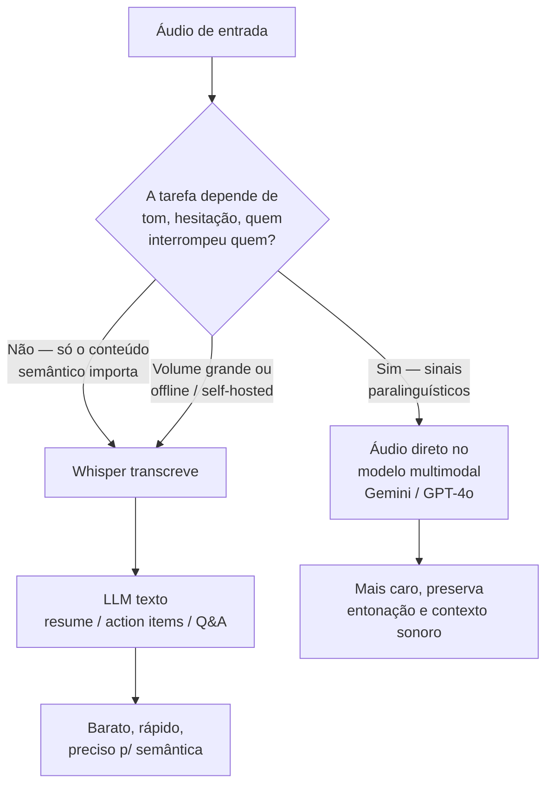

# 04 - Áudio e vídeo — Whisper, Gemini Live e geração

> [!abstract] TL;DR
> Áudio tem dois caminhos: transcrever com Whisper (barato, robusto, é o baseline padrão pra podcast/reunião) ou enviar direto pro modelo multimodal com input de áudio nativo (Gemini Pro, GPT-4o — mais caro, preserva entonação e contexto sonoro). Vídeo é dominado pelo Gemini (até ~2h em alguns tiers, frames + áudio integrados). Geração de vídeo (Sora, Veo, Runway) aparece só pra fechar o panorama — o foco da nota é input. Tempo real (voz/vídeo bidirecional) usa APIs separadas: Gemini Live e GPT-4o Realtime. A voz da Anthropic (app Claude, Voice Mode do Claude Code) é **input-only/ditado**, não uma API de áudio programática — não entra no pipeline batch nem no realtime bidirecional. Use cases: resumo de reunião, Q&A em podcast, análise de code walkthrough, tutorial review.

> [!question]- Para uma reunião gravada de 1 hora, vale a pena mandar o áudio direto ao Gemini ou usar Whisper + Claude texto?
> Depende da tarefa. Para extração de action items, resumo por tópico, ou Q&A textual — Whisper + Claude texto funciona igualmente bem e é mais barato: Whisper custa ~$0.36/hora de áudio; a chamada texto ao Claude com transcrição soma mais ~$0.20 dependendo do tamanho — total ~$0.56. Gemini 2.x Pro com áudio direto de 1h gasta ~115k tokens de input, que pode custar $1.15-$3.45 dependendo do plano. A diferença é que Gemini captura tom, hesitação, quem interrompeu quem — sinais que a transcrição textual não preserva. Use Gemini áudio direto quando a tarefa exige análise de comunicação (reunião de negociação, entrevista de UX, análise de pitch) e Whisper + texto para tudo que precisa apenas do conteúdo semântico.

Chega na sua mesa uma reunião de negociação gravada: 58 minutos, três participantes, um cliente irritado. O PM quer duas coisas — a lista de action items e uma leitura de "quem estava desconfortável quando o preço foi mencionado". A primeira pergunta é sobre **conteúdo**; a segunda é sobre **tom**. E aqui está a armadilha: se você resolver as duas do mesmo jeito, ou paga caro à toa ou perde o sinal que interessa. Mandar a hora inteira de áudio pro modelo multimodal mais caro cobre tom mas queima orçamento no que era só transcrição; transcrever com Whisper e mandar o texto resolve os action items por centavos mas apaga a hesitação na voz. Áudio e vídeo obrigam essa decisão a cada tarefa — e ela quase nunca é "use sempre o modelo mais poderoso".

A regra que organiza a nota inteira: **transcreva quando você só precisa do que foi dito; escute (áudio direto no modelo) quando importa como foi dito.** Vídeo tem sua própria pegada de custo — imagem e som juntos, contados por frame — e por isso ganha seção à parte.



## Áudio — dois caminhos

### Caminho 1 — Whisper como baseline

Whisper (OpenAI) é o tokenizador de áudio do mercado em 2026: barato, robusto a sotaque e ruído, multilíngue (~100 idiomas). Continua sendo o default pra:

- Transcrição de podcast / reunião / webinar
- Subtitulagem
- Pipeline batch onde você só quer o texto

Preço típico (2026): ~$0.006 por minuto. Para uma reunião de 1h, ~$0.36. Modelos open-weight (Whisper-large-v3, distil-whisper) rodam local de graça.

```python
from openai import OpenAI

client = OpenAI()

with open("reuniao.mp3", "rb") as f:
    transcript = client.audio.transcriptions.create(
        model="whisper-1",
        file=f,
        language="pt",
        response_format="verbose_json",   # inclui timestamps
        timestamp_granularities=["segment"],
    )

print(transcript.text)
for seg in transcript.segments:
    print(f"[{seg.start:.1f}s] {seg.text}")
```

`verbose_json` com `timestamp_granularities=["segment"]` ou `["word"]` retorna timestamps — essenciais pra "qual minuto fulano falou X".

Pipeline típico: Whisper transcreve → LLM texto (Claude/GPT/Gemini) resume, extrai action items, gera Q&A.

### Caminho 2 — Áudio direto no modelo

Modelos multimodais aceitam áudio como input nativo. Diferença pra Whisper + texto: o modelo "escuta" — não só lê a transcrição. Captura entonação, hesitação, sobreposição de vozes, sons de fundo.

- **Gemini 2.x Pro / Flash** — áudio até ~8h em alguns tiers; cobra ~32 tokens por segundo (Pro) ou menos em Flash.
- **GPT-4o** — áudio nativo via Realtime API ou chat completions com input de áudio.
- **Claude voice (Anthropic)** — voz existe nos produtos Anthropic (app Claude web/mobile e, desde março/2026, o [Voice Mode do Claude Code](https://www.anthropic.com/news)), mas é **input-only**: fala vira transcrição e o Claude responde em texto — é ditado, não escuta paralinguística nem áudio-como-mídia. A API do Claude **não** tem input de áudio nativo comparável ao do Gemini/GPT-4o até a data desta nota. Pra pipeline programático com áudio, siga com Whisper + Claude texto, ou use Gemini/GPT-4o (que aceitam áudio nativo).

Quando faz sentido pular Whisper:

- Pergunta exige tom/emoção (entrevista de UX, análise de pitch comercial).
- Áudio curto (<10min) onde a sobrecarga de transcrever + chamar texto não compensa.
- Multilíngue com troca de idioma no meio (Whisper às vezes erra a virada).

Quando Whisper segue ganhando:

- Volume grande (podcasts em massa, archive).
- Precisão de transcrição importa mais que análise (subtitulagem).
- Pipeline offline ou self-hosted (custo zero com Whisper local).

### Code — Gemini com áudio direto

```python
from google import genai
from google.genai import types
from pathlib import Path

client = genai.Client()

# Upload via Files API para áudios maiores
audio_file = client.files.upload(file="podcast.mp3")

response = client.models.generate_content(
    model="gemini-2.5-pro",
    contents=[
        audio_file,
        (
            "Este é um episódio de podcast sobre arquitetura de software. "
            "Liste os 5 principais argumentos do convidado e, para cada um, "
            "indique se ele defendeu com convicção ou com hesitação. "
            "Cite o minuto de cada argumento."
        ),
    ],
)

print(response.text)
```

O modelo escuta tom de voz, hesitação, pausas — sinais que a transcrição textual perderia.

## Tempo real — voz e vídeo bidirecionais

Pra casos onde latência <300ms é requisito (assistente de voz, tutor que conversa, copiloto que ouve enquanto você fala):

- **Gemini Live API** — WebSocket bidirecional, áudio e vídeo combinados, vozes nativas.
- **OpenAI Realtime API** — sucessor do "assistant voice", WebSocket, integração com tools em tempo real.
- **Anthropic voice mode** — existe nos produtos Claude (app e Claude Code), mas é **input-only** (fala→texto): não é bidirecional em tempo real como Gemini Live / OpenAI Realtime, e não expõe API de voz programática. Não é uma opção pra UX conversacional voz-a-voz via API.

Esses não substituem Whisper + LLM em pipeline batch — são pra UX conversacional. Custo por minuto é significativamente maior que Whisper + chamada de texto.

Esqueleto Gemini Live (Python):

```python
from google import genai
import asyncio

client = genai.Client()

async def main():
    async with client.aio.live.connect(
        model="gemini-2.5-flash-live",
        config={"response_modalities": ["AUDIO"]},
    ) as session:
        # Envia áudio do mic em chunks
        await session.send_realtime_input(audio=mic_chunk)
        # Recebe áudio de volta em streaming
        async for response in session.receive():
            if response.data:
                play(response.data)

asyncio.run(main())
```

Detalhes de captura de mic e playback ficam fora — varia por plataforma.

## Vídeo — Gemini como referência

Gemini é o player dominante em vídeo de input em 2026:

- **Gemini 2.x Pro** — até ~2h de vídeo em alguns tiers, processado como frames + áudio.
- **Gemini 2.x Flash** — vídeos menores, mais rápido.

Tokenização: ~258 tokens por frame (Gemini extrai ~1 frame por segundo por default) + áudio. Vídeo de 10 minutos ≈ 600 frames ≈ 155k tokens.

```python
from google import genai
from google.genai import types

client = genai.Client()

video_file = client.files.upload(file="tutorial.mp4")

# Aguardar processamento (vídeo demora a indexar)
import time
while video_file.state == "PROCESSING":
    time.sleep(2)
    video_file = client.files.get(name=video_file.name)

response = client.models.generate_content(
    model="gemini-2.5-pro",
    contents=[
        video_file,
        (
            "Este é um tutorial de Vim. Liste os comandos demonstrados, "
            "na ordem em que aparecem, com o timestamp de cada um. "
            "Se o instrutor mostra um comando mas não explica, marque [não explicado]."
        ),
    ],
)

print(response.text)
```

Para vídeo curto (<20 MB), `Part.from_bytes(data=video_bytes, mime_type="video/mp4")` inline também funciona.

OpenAI e Anthropic, em 2026, dependem de extração de frames externa (você extrai N frames com ffmpeg, manda como sequência de imagens). É possível, mas perde sincronia com áudio.

## Geração de vídeo (Sora, Veo, Runway)

Modelos como Sora (OpenAI), Veo (Google), Runway Gen-3 e Pika geram vídeo a partir de texto ou imagem. Fora do escopo desta nota (esta trilha é sobre **input**), mas afeta as decisões aqui:

- Vídeo gerado precisa de QA — você manda o vídeo de volta pra um modelo multimodal pra avaliar fidelidade ao prompt, artifacts, consistência temporal.
- Edição assistida — modelo lê o vídeo gerado e sugere ajustes textuais pra próxima rodada.

## Use cases comuns

### Resumo de reunião

Pipeline padrão: Zoom → MP3 → Whisper (`verbose_json`) → Claude/GPT com transcrição + timestamps → action items por participante. Custo ~$0.50 por reunião de 1h.

### Q&A em podcast

Whisper transcreve, modelo texto responde com citação de timestamp. Pra podcast onde tom importa (entrevistas, debate), Gemini áudio direto.

### Análise de code walkthrough

Vídeo de dev no IDE narrando bug → Gemini lê tela + áudio, identifica linha do bug, sugere fix. Pipeline texto sozinho perderia o que está sendo apontado visualmente.

### Tutorial review

Vídeo educacional → Gemini lista os tópicos cobertos, conceitos não explicados, ordem didática. Útil pra curadoria de conteúdo.

### Suporte por voz

Realtime API (OpenAI ou Gemini Live) com tools integradas — usuário fala, modelo escuta, chama API interna, responde por voz.

## Limites e custos

| Modalidade | Provider | Limite típico | Custo de input |
|---|---|---|---|
| Áudio | Whisper | sem limite (chunked) | ~$0.006/min |
| Áudio | Gemini 2.x Pro | ~8h por arquivo | ~32 tokens/s |
| Áudio | GPT-4o (realtime) | streaming | ~$100/1M tokens áudio in |
| Vídeo | Gemini 2.x Pro | ~2h | ~258 tokens/frame + áudio |
| Vídeo | Gemini 2.x Flash | menor | barato |
| Vídeo bidirecional | Gemini Live | streaming | tier-específico |

Esses números mudam frequentemente. Confira o doc do provider antes de bater orçamento.

## Boas práticas

- **Use Whisper como baseline.** Só pule pra áudio direto se a tarefa exige tom/contexto sonoro.
- **Peça timestamps no prompt.** "Cite o minuto/segundo" — sem isso o modelo invoca "no início" / "no final".
- **Pré-corte vídeo longo.** Mande só os 10min relevantes em vez do vídeo inteiro de 1h.
- **Áudio em mono, 16kHz pra Whisper.** Estéreo e 48kHz não dão ganho de acurácia, dobram o tamanho.
- **Cache de upload (Files API).** Reuse o mesmo `file_id` em múltiplas perguntas sobre o mesmo arquivo.
- **Aguarde o processamento de vídeo antes de fazer queries.** Gemini Files API tem estado `PROCESSING` → `ACTIVE`; poll até `ACTIVE` antes de chamar `generate_content`.
- **Diarização manual quando precisar de "quem disse o quê":** Whisper não diariza de fábrica — use `pyannote.audio` ou `deepdiar` antes de transcrever, marcando `[Speaker A]`, `[Speaker B]` na transcrição. Passe a transcrição diarizada pra o LLM texto pra analysis de "quem concordou / quem discordou".
- **Para idioma português, passe `language="pt"` no Whisper.** Sem esse hint, o modelo detecta automaticamente mas pode confundir com espanhol em trechos curtos ou sotaque forte.

## Armadilhas comuns

> [!warning] Mandar vídeo de 1h quando só 10 minutos importam — custo absurdo sem ganho
> 10 minutos de vídeo no Gemini 2.x Pro ≈ 155k tokens de input; 1 hora ≈ 930k tokens. Se a pergunta é sobre os últimos 10 minutos, pagar por toda a hora é desperdício puro. Pré-corte com ffmpeg é operação de segundos: `ffmpeg -i video.mp4 -ss 00:50:00 -to 01:00:00 -c copy trecho.mp4`. Use vídeo inteiro só quando a pergunta pode se referir a qualquer parte sem você saber qual — e mesmo assim considere dividir em chunks de 15-20 minutos.

> [!warning] Esquecer de pedir timestamp — modelo situa eventos no tempo com "no início" / "no final" e você não consegue verificar
> "Quais foram os pontos de discordância na reunião?" retorna pontos de discordância sem dizer quando. "Cite o minuto de cada ocorrência" é fundamental. Whisper com `verbose_json` e `timestamp_granularities: ["segment"]` entrega timestamps automáticos — passe-os no prompt pra LLM de análise. Gemini com áudio/vídeo direto gera timestamps quando pedidos explicitamente no prompt. Sem timestamp, você não consegue auditar nem navegar até o momento relevante.

> [!warning] Usar Realtime API pra tarefas batch — latência baixa com custo alto, desnecessário
> Gemini Live e OpenAI Realtime são projetados para UX conversacional em tempo real — latência <300ms é o diferencial. O custo por token é significativamente mais alto que o caminho batch (upload + generate). Usar Realtime pra processar 50 podcasts em paralelo é pagar latência conversacional sem precisar dela. Use Realtime só quando o caso exige bidirecionalidade (usuário fala, modelo responde enquanto ouve) ou latência percebida (assistente de voz no app). Para tudo batch, use Files API + generate_content.

## Como explicar em inglês

**Interview quote:** *"For audio pipelines in 2026, our default is Whisper for transcription plus a text LLM for analysis — it's cheap, fast, and accurate for semantic tasks. We switch to direct audio input via Gemini when the task needs paralinguistic signals: tone, hesitation, interruptions. For video, Gemini is the only real option with native support; OpenAI and Anthropic require external frame extraction."*

| Português | Inglês |
|---|---|
| Transcrição de áudio | Audio transcription |
| Granularidade de timestamp (por segmento / por palavra) | Timestamp granularity (by segment / by word) |
| Áudio direto no modelo (sem transcrever) | Direct audio input (without transcription) |
| Entonação e hesitação | Tone and hesitation / paralinguistic signals |
| Vídeo — frames + áudio integrados | Video with integrated frames and audio |
| Reunião de 1h em processamento batch | 1-hour meeting in batch processing |
| API bidirecional em tempo real | Bidirectional real-time API |
| Upload via Files API pra reutilização | Files API upload for reuse |
| Custo por minuto de áudio | Cost per minute of audio |

## O que vem a seguir

Com áudio e vídeo cobertos, a nota 05 entra em **tabelas e spreadsheets** — um caso especial de input estruturado onde a escolha entre CSV/JSON via texto e screenshot/imagem é menos óbvia do que parece, e onde formato de entrega do dado (inline no prompt vs anexo) muda a qualidade do raciocínio.

## Fontes

- **@hooeem** — *Become an AI Engineer*, cap #17.
- **OpenAI** — *Whisper / speech-to-text* ([docs](https://platform.openai.com/docs/guides/speech-to-text)). Modelos, formatos, timestamps.
- **OpenAI** — *Realtime API* ([docs](https://platform.openai.com/docs/guides/realtime)). Voz bidirecional.
- **Google** — *Gemini API — Audio* ([docs](https://ai.google.dev/gemini-api/docs/audio)). Tokenização e limites.
- **Google** — *Gemini API — Video* ([docs](https://ai.google.dev/gemini-api/docs/vision#video)). Frame rate, duração.
- **Google** — *Live API* ([docs](https://ai.google.dev/gemini-api/docs/live)). Streaming bidirecional.

## Identificação de falante — diarização

Um ponto que a nota deixa implícito mas merece destaque: Whisper transcreve o que é dito mas não diz *quem* disse. Em reunião com múltiplos participantes, o output é uma sequência de segmentos sem speaker label — "Fulano concordou com isso" fica invisível pra o LLM de análise.

Para diarização:
- **pyannote.audio** — modelo open-weight, roda local, retorna segmentos `{speaker, start, end}`.
- **Deepgram, AssemblyAI** — SaaS com diarização + transcrição integrados; mais fácil de integrar, custo por minuto.
- **Gemini** — com áudio direto, infere falantes distintos pela voz mas sem label consistente entre chamadas; o modelo diz "o segundo participante" e não "João".

Para reuniões onde atribuição importa, a stack que funciona melhor: pyannote + Whisper (diarização precisa + transcrição em português) → merge de segmentos → LLM análise com contexto de "Falante A disse X, Falante B respondeu Y".

## Veja também

- [[02 - Imagens como input — screenshots, charts, mockups]] — frames de vídeo são imagens
- [[03 - PDFs e documentos — extração e análise]] — PDF é outro doc longo com lógica análoga
- [[06 - Como dizer ao modelo o tipo de leitura]] — "transcreva" vs "resuma" vs "extraia action items" muda muito
- [[07 - Limites e armadilhas multimodais]] — onde transcrição e leitura de vídeo falham
- [[Economia de Tokens/01 - O problema — por que tokens custam dinheiro]] — áudio (~32 tok/s) e vídeo (~258 tok/frame) estouram orçamento rápido; a decisão transcrever-vs-escutar é, no fundo, uma decisão de custo
