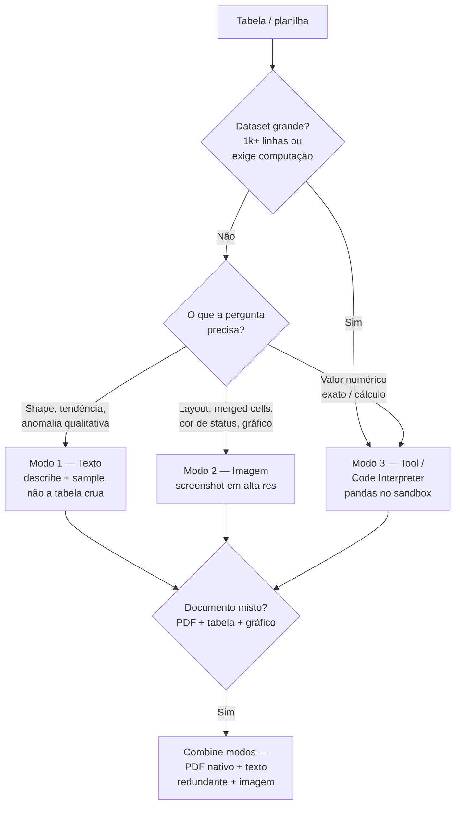

# 05 - Tabelas e spreadsheets como input estruturado

> [!abstract] TL;DR
> Tabela pro LLM tem três modos: como texto (CSV/Markdown colado no prompt — o modelo parsea), como imagem (screenshot — boa pra tabelas com merged cells, charts, layout visual) e como ferramenta (modelo lê arquivo via code interpreter, pandas, ou tool customizado). Texto ganha em precisão de valor; imagem ganha em layout e gráfico; ferramenta ganha em dataset grande onde computação importa. Pra dataset grande, pattern padrão: pandas `describe()` + sample de 10 linhas = contexto suficiente sem mandar 1M de células. Tabela é onde mais se ganha combinando modalidades — relatório financeiro com texto + tabela + gráfico merece todos os três caminhos juntos.

> [!question]- Para uma planilha financeira com 500 linhas e 20 colunas, qual é o melhor modo de input?
> Depende da pergunta. Se a pergunta é qualitativa ("qual tendência essa planilha mostra?", "há anomalias?"), um resumo textual eficiente — `pandas describe()` + amostra de 10 linhas + lista de colunas — é suficiente, cabe em ~2k tokens e o modelo raciocina bem. Se a pergunta exige operação numérica ("qual a soma de revenda no Q3?", "calcule o CAGR das 5 maiores categorias"), texto pode induzir alucinação de cálculo — use Code Interpreter ou ferramenta com pandas. Se a planilha tem gráfico embutido ou formatação condicional que é parte da informação, mande como imagem em complemento ao texto. O padrão que não funciona é colar as 500 linhas raw no prompt — o modelo perde precisão de valor em contexto longo e o custo sobe desnecessariamente.

Você recebe uma planilha de vendas com 500 linhas e 20 colunas e a pergunta "essa base mostra alguma anomalia?". Três reflexos disputam o teclado: colar as 500 linhas direto no prompt, tirar um print e mandar a imagem, ou subir o arquivo pro Code Interpreter. Os três "funcionam" — e três levam a resultados diferentes, com custos e riscos diferentes. Colar tudo gasta contexto e faz o modelo alucinar somas plausíveis. O print perde precisão numérica no OCR. O Code Interpreter é preciso mas adiciona latência e setup. A escolha errada não dá erro — dá uma resposta confiante e sutilmente errada, que é pior. Esta nota existe pra você fazer essa escolha de propósito, não por reflexo.

O eixo que decide quase tudo: **a pergunta é sobre o shape/tendência do dado, sobre um número exato, ou sobre o layout visual?** Cada resposta puxa um modo diferente — e datasets grandes quase nunca vão inteiros pro prompt.



## Os três modos

### Modo 1 — Texto (CSV, Markdown, JSON)

Cola a tabela formatada no prompt. O modelo parsea internamente.

**Quando ganha:**
- Dataset pequeno (até ~100 linhas).
- Você precisa de valores exatos preservados (financeiro, datas, IDs).
- O ganho de layout visual é zero (tabela retangular simples).

**Quando perde:**
- Tabela com merged cells, hierarquia visual, cores de status.
- Dataset grande (1k+ linhas consomem contexto).
- Há gráficos junto que importam pro raciocínio.

Formato no prompt:

```
| Cliente | Faturamento | Status   |
|---------|-------------|----------|
| Acme    | 120000      | ativo    |
| Globex  | 87000       | inativo  |
| Initech | 95000       | ativo    |
```

Markdown é mais legível pro modelo que CSV puro, mas ambos funcionam. Para JSON estruturado:

```python
import json

data = [
    {"cliente": "Acme", "faturamento": 120000, "status": "ativo"},
    {"cliente": "Globex", "faturamento": 87000, "status": "inativo"},
]

prompt = f"""Analise os clientes abaixo (JSON):

{json.dumps(data, indent=2, ensure_ascii=False)}

Liste os clientes inativos com faturamento acima da mediana dos ativos."""
```

### Modo 2 — Imagem (screenshot)

Mande print da planilha ou PDF renderizado.

**Quando ganha:**
- Tabela com merged cells, células coloridas, hierarquia de header complexa.
- Gráfico embutido (barra, pizza, linha) que importa pra resposta.
- Documento original tem layout (relatório anual, dashboard).
- Você precisa que o modelo "veja" formatação condicional (status verde/vermelho).

**Quando perde:**
- Precisão numérica fina (modelo pode ler "12345" como "1234s" em imagem ruim).
- Tabela muito densa (texto pequeno deteriora extração).

Pra screenshot de planilha, prefira PNG em alta resolução, com zoom razoável (linhas legíveis a olho nu).

### Modo 3 — Tool / code interpreter

Modelo executa código (geralmente Python com pandas/polars) sobre o arquivo. Pra isso usa:

- **OpenAI** — Code Interpreter (Assistants/Responses API) ou tool customizado que executa `pandas`.
- **Anthropic** — tool customizado executando Python (sandbox seu).
- **Gemini** — Code Execution tool nativa.

**Quando ganha:**
- Dataset grande (10k+ linhas).
- Tarefa exige computação (agregação, join, groupby, regressão).
- Quer reproducibilidade — código é evidência da resposta.

**Quando perde:**
- Tarefa não envolve computação ("explique essa coluna").
- Dataset pequeno onde texto direto resolve.
- Quer baixa latência (executar código adiciona tempo).

## Pattern padrão pra dataset grande — describe + sample

Quando o dataset é grande mas você só precisa que o modelo entenda o **shape**, não que processe cada linha:

```python
import pandas as pd

df = pd.read_csv("vendas_2025.csv")  # 250k linhas

# Resumo estatístico de cada coluna
summary = df.describe(include="all").to_markdown()

# Amostra estratificada
sample = df.sample(10, random_state=42).to_markdown(index=False)

prompt = f"""Esta é uma tabela de vendas de 2025 com 250k linhas.

Resumo estatístico das colunas:
{summary}

Amostra de 10 linhas:
{sample}

Pergunta: existe sazonalidade clara? Quais hipóteses você teria sobre os outliers
de faturamento?
"""
```

Esse pattern entrega ~50-100 linhas de contexto pro modelo, contra 250k linhas brutas. O modelo "vê" o dataset sem ler cada célula. Use code interpreter / tool pra verificar hipóteses depois.

Variante com mais sinal: junte `describe()` + top-5 valores únicos por coluna categórica + 10 linhas de exemplo.

## Code — três providers, três modos

### Anthropic — tabela como imagem

```python
import anthropic
import base64
from pathlib import Path

client = anthropic.Anthropic()

# Screenshot do dashboard do Looker
img_b64 = base64.standard_b64encode(Path("dashboard.png").read_bytes()).decode()

response = client.messages.create(
    model="claude-sonnet-4-6",
    max_tokens=2048,
    messages=[{
        "role": "user",
        "content": [
            {
                "type": "image",
                "source": {
                    "type": "base64",
                    "media_type": "image/png",
                    "data": img_b64,
                },
            },
            {
                "type": "text",
                "text": (
                    "Esta é uma página de relatório financeiro. Extraia em JSON: "
                    "os 3 KPIs do topo (nome, valor, variação YoY), e os dados "
                    "exatos do gráfico de barras (mês, valor). Cite formatação "
                    "condicional (verde/vermelho) quando aparecer."
                ),
            },
        ],
    }],
)

print(response.content[0].text)
```

### OpenAI — Code Interpreter rodando pandas

```python
from openai import OpenAI

client = OpenAI()

# Upload do arquivo
file = client.files.create(
    file=open("vendas_2025.csv", "rb"),
    purpose="assistants",
)

response = client.responses.create(
    model="gpt-5",
    tools=[{"type": "code_interpreter", "container": {"type": "auto"}}],
    input=[{
        "role": "user",
        "content": [
            {"type": "input_file", "file_id": file.id},
            {
                "type": "input_text",
                "text": (
                    "Carregue este CSV de vendas com pandas. Mostre describe() das "
                    "colunas numéricas, conte valores únicos das categóricas, e "
                    "identifique outliers de faturamento (>2 desvios da média). "
                    "Retorne um gráfico de boxplot por categoria."
                ),
            },
        ],
    }],
)

print(response.output_text)
```

O modelo escreve código, executa no sandbox, lê o resultado e responde.

### Gemini — tabela como texto Markdown

```python
from google import genai

client = genai.Client()

# Tabela pequena via texto Markdown
table_md = """
| Mês | Receita | Custo  | Margem |
|-----|---------|--------|--------|
| Jan | 120000  | 85000  | 29%    |
| Fev | 135000  | 92000  | 32%    |
| Mar | 118000  | 89000  | 25%    |
| Abr | 142000  | 88000  | 38%    |
""".strip()

response = client.models.generate_content(
    model="gemini-2.5-flash",
    contents=[
        f"Tabela trimestral:\n\n{table_md}",
        (
            "1. Qual mês teve a melhor margem percentual? "
            "2. Se o custo de Abril seguisse o padrão dos meses anteriores "
            "(média Jan-Mar), qual teria sido a margem?"
        ),
    ],
)

print(response.text)
```

## Caso composto — relatório financeiro

Cenário real: relatório trimestral em PDF, com texto narrativo, tabelas, gráficos. Como mandar pro modelo?

Combinação que funciona em 2026:

1. **Capa e narrativa** → PDF nativo (ver [[03 - PDFs e documentos — extração e análise]]).
2. **Tabelas críticas com valores que importam** → também via texto Markdown, redundante mas mais preciso.
3. **Gráficos** → o PDF nativo já cobre, mas se quiser análise específica, mande o screenshot do gráfico isolado em high detail.
4. **Dataset bruto subjacente (se tiver acesso)** → CSV via code interpreter pra validar números.

Mistura assim:

```python
response = client.messages.create(
    model="claude-sonnet-4-6",
    max_tokens=4096,
    messages=[{
        "role": "user",
        "content": [
            {"type": "document", "source": {"type": "base64",
                "media_type": "application/pdf", "data": pdf_b64}},
            {"type": "text", "text":
                "Tabela 4 (em texto, valores exatos):\n\n" + tabela_md},
            {"type": "image", "source": {"type": "base64",
                "media_type": "image/png", "data": grafico_b64}},
            {"type": "text", "text":
                "Analise: a narrativa do PDF é consistente com os números da "
                "Tabela 4 e o gráfico? Sinalize discrepâncias com a página/seção."
            },
        ],
    }],
)
```

Vale o custo de token extra quando a resposta precisa ser auditável.

## Comparativo dos três modos

| Critério | Texto | Imagem | Tool |
|---|---|---|---|
| Precisão numérica | Alta | Média | Alta |
| Captura layout | Não | Sim | Não |
| Captura gráfico | Não | Sim | Sim (gera) |
| Dataset grande | Ruim | Ruim | Ótimo |
| Setup | Trivial | Trivial | Médio |
| Custo | Baixo | Médio-alto | Alto |
| Auditável | Sim | Não tanto | Sim (código) |

## Boas práticas

- **Default = texto Markdown.** Só vá pra imagem ou tool quando o caso justifica.
- **Não cole 10k linhas.** Use `describe()` + sample. Se precisar processar, use tool.
- **Combine quando o documento é misto.** Relatório financeiro merece PDF + texto + imagem.
- **Numere as tabelas no prompt.** "Tabela 1", "Tabela 2" facilita referência cruzada.
- **Cuidado com CSV de português.** Vírgula como separador decimal quebra parsing — converta antes pra `.` ou explicite no prompt.

## Código-com-falha — o CSV brasileiro que quebra em silêncio

A armadilha mais cara desta nota não é o modelo alucinando: é o **pandas** entregando um DataFrame errado sem reclamar, e você mandar esse lixo pro prompt. Planilha exportada de Excel em português vem, por padrão, com **`;` como separador de campo e `,` como separador decimal** (`Café;12,50`). O `read_csv` default espera `,` como separador de campo e `.` como decimal. Repare no que acontece — a saída abaixo é real (pandas 3.0):

```python
import pandas as pd
# vendas.csv (export Excel BR):
#   produto;preco
#   Café;12,50
#   Açúcar;4,90

# ❌ Tentativa 1 — defaults
df = pd.read_csv("vendas.csv")
print(df.columns.tolist())   # ['produto;preco']  ← UMA coluna só; o ';' não foi separado
print(df.shape)              # (2, 1)
# Nenhum erro. df["preco"] → KeyError lá na frente, longe da causa.

# ❌ Tentativa 2 — acertou o separador, esqueceu o decimal
df = pd.read_csv("vendas.csv", sep=";")
print(df["preco"].dtype)     # str  ← "12,50" virou texto, não número
print(df["preco"].sum())     # '12,504,90'  ← concatenação de string, SEM erro
# df["preco"].mean() aí sim levanta TypeError — mas .sum() passa batido e vira relatório errado.

# ✅ Correto
df = pd.read_csv("vendas.csv", sep=";", decimal=",")
print(df["preco"].dtype)     # float64
print(df["preco"].sum())     # 17.4
```

A lição: o erro **não** aparece como `ParserError` no `read_csv` — ele aparece (quando aparece) muito depois, como `KeyError` de coluna inexistente ou como um total sem sentido. Uma soma que concatena strings não solta exceção nenhuma. Por isso: sempre `print(df.dtypes)` e `df.head()` **antes** de mandar qualquer coisa pro modelo — se uma coluna numérica está como `object`/`str`, o dado já está corrompido na origem, e nenhum prompt bem escrito conserta isso.

## Armadilhas comuns

> [!warning] Colar o CSV inteiro quando o dataset tem mais de 50 linhas — modelo perde precisão e gasta contexto
> Um CSV de 500 linhas ocupa facilmente 5k-10k tokens de contexto. O modelo lê o texto inteiro mas sua capacidade de "lembrar" valores exatos no início da tabela decresce enquanto avança no contexto. Se a pergunta requer cálculo ou comparação de valores, o modelo frequentemente produz números plausíveis mas incorretos. O padrão certo é resumo + amostra: `df.describe().to_markdown()` captura distribuição estatística em ~300 tokens; `df.head(10).to_markdown()` captura estrutura e exemplos em ~200 tokens; juntos cobrem a maioria das perguntas qualitativas. Para cálculo real, use Code Interpreter ou ferramenta com pandas.

> [!warning] Usar screenshot de tabela para extração de valores numéricos — OCR multimodal tem erro silencioso
> Screenshot de spreadsheet parece conveniente, mas o modelo pode ler "1,234.56" como "1.234,56", "O" como "0", ou errar casas decimais em números com compressão JPEG. Para extração de valores críticos (financeiro, contábil, médico), nunca use imagem como fonte de números — exporte o CSV/JSON e passe como texto. A imagem é útil quando o objetivo é entender o layout, a formatação condicional, ou o gráfico — não os números em si.

> [!warning] Não avisar o modelo sobre o separador decimal brasileiro — cálculos ficam errados silenciosamente
> Em datasets brasileiros, vírgula é separador decimal e ponto é separador de milhar ("1.234,56"). Modelos treinados com maioria de dados em inglês tendem a parsear "1.234,56" como string sem sentido ou como dois números separados. Antes de mandar CSV com notação BR: (1) converta para ponto decimal no pandas (`df['valor'] = df['valor'].str.replace('.', '').str.replace(',', '.').astype(float)`), ou (2) avise explicitamente no prompt: "Nesta tabela, vírgula é separador decimal e ponto é separador de milhar." Sem isso, cálculos incorretos são gerados silenciosamente.

## Como explicar em inglês

**Interview quote:** *"For tabular data, we pick the mode based on the question: text markdown for qualitative analysis, Code Interpreter with pandas for numeric computation, image for layout and charts. We never paste raw 500-row CSVs — we send a describe-plus-sample summary. Brazilian number formatting needs explicit prompt context or pre-conversion to avoid silent calculation errors."*

| Português | Inglês |
|---|---|
| Tabela como texto (CSV/Markdown) | Table as text (CSV/Markdown) |
| Screenshot de planilha como imagem | Spreadsheet screenshot as image |
| Code Interpreter / execução de código | Code Interpreter / code execution |
| Resumo estatístico (`describe()`) | Statistical summary (`describe()`) |
| Amostra de linhas do dataset | Dataset row sample |
| Formatação condicional (verde/vermelho) | Conditional formatting |
| Células mescladas (merged cells) | Merged cells |
| Separador decimal brasileiro | Brazilian decimal separator |
| Precisão numérica em contexto longo | Numerical precision in long context |

## O que vem a seguir

Com tabelas e spreadsheets cobertos, a nota 06 trata de algo transversal a todas as modalidades: **como dizer ao modelo que tipo de leitura fazer**. A mesma planilha financeira analisada com "descreva" vs "extraia" vs "compare com o trimestre anterior" entrega outputs radicalmente diferentes — e a próxima nota dá o framework de seis tipos de leitura + template de quatro slots para qualquer input multimodal.

## Fontes

- **@hooeem** — *Become an AI Engineer*, cap #17.
- **Pandas** — `DataFrame.describe()`, `to_markdown()`. Ferramenta padrão pra contexto compacto.
- **OpenAI** — *Code Interpreter* ([docs](https://platform.openai.com/docs/assistants/tools/code-interpreter)). Tool rodando pandas dentro do modelo.
- **Google** — *Code Execution* ([docs](https://ai.google.dev/gemini-api/docs/code-execution)). Equivalente no Gemini.

## Veja também

- [[02 - Imagens como input — screenshots, charts, mockups]] — screenshot de tabela é caso particular
- [[03 - PDFs e documentos — extração e análise]] — tabela dentro de PDF nativo
- [[03-Dominios/Tecnologia/IA/Structured Outputs/02 - JSON Schema como contrato]] — pra forçar shape no output de extração
- [[06 - Como dizer ao modelo o tipo de leitura]] — "extraia" vs "analise" vs "resuma" mudam o output
- [[07 - Limites e armadilhas multimodais]] — leitura de tabela em imagem tem armadilhas próprias
