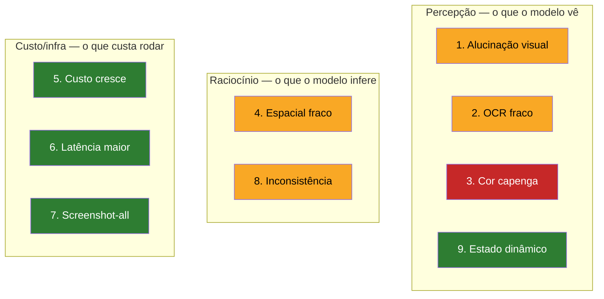

# 07 - Limites e armadilhas multimodais

> [!abstract] TL;DR
> Modelos multimodais de 2026 são bons mas têm falhas previsíveis: alucinação visual (inventam detalhes, especialmente sob pergunta tendenciosa), OCR fraco em handwriting e baixa contraste, leitura de cor pouco confiável ("é azul ou roxo?"), raciocínio espacial fraco ("o que está à esquerda?", "qual é mais alto?"), custo crescente (imagem custa muito mais que texto equivalente) e latência maior. O anti-padrão "screenshot all the things" leva a sistemas caros e frágeis. Pra cada falha, há mitigação concreta — e em alguns casos a resposta é voltar pra pipeline tradicional (OCR + extração estruturada + LLM texto). Esta nota cataloga as falhas e diz quando recuar.

> [!question]- A model de multimodal que performa bem em exemplos manuais vai ter o mesmo desempenho em produção?
> Quase sempre não — e entender por que é fundamental antes de ir pra produção. Exemplos manuais tendem a usar imagens limpas, bem iluminadas, resolução adequada, prompt cuidadosamente formulado. Produção traz variação: imagens de celular com baixa luminosidade, PDFs escaneados com skew, usuários que mandam prints de outros prints, crops que cortam parte da informação relevante. O teste real de um pipeline multimodal é a distribuição completa dos inputs de produção, não o subconjunto bonito que o dev usou no PoC. A recomendação é montar um dataset de "imagens difíceis" — baixo contraste, handwriting, layouts densos — e usar como eval pra medir onde o modelo falha antes de deployar.

Uma equipe descobre multimodal em produção e o resultado do primeiro protótipo impressiona: o modelo lê o formulário, extrai o valor da nota fiscal, resume a reunião gravada. Em poucas semanas o time reescreve metade do pipeline pra "só mandar o print" — por que extrair campos via API se o modelo já vê a tela inteira? Um mês depois, dois sinais explodem ao mesmo tempo: a fatura da API multiplica, porque cada screenshot high-detail custa o que antes custava uma chamada de texto inteira, e o suporte recebe tickets de dado errado — número de pedido trocado, campo vazio preenchido com um valor plausível, cor que muda de resposta a cada chamada. Nenhuma dessas falhas é surpresa pra quem já mapeou os modos de falha do multimodal — são categorias conhecidas, com causa e mitigação testadas. O problema não foi usar multimodal; foi usar multimodal pra tudo, sem saber onde cada falha aparece nem quanto ela custa. As nove categorias abaixo são esse mapa.

O diagrama organiza as nove falhas em dois eixos: **tipo** (o que o modelo vê, o que ele infere, ou o que custa rodar) e **mitigabilidade** (quanto dá pra reduzir com técnica conhecida):



## 1. Alucinação visual

O modelo inventa detalhes que não estão na imagem. Acontece principalmente em três situações:

- **Pergunta tendenciosa.** "Quantos cachorros aparecem nesta foto?" — se aparecem zero, o modelo tende a responder "dois". A pergunta pressupõe presença, e o modelo completa o padrão.
- **Imagem ambígua.** Foto borrada, baixa resolução, ângulo estranho. O modelo "ajusta" com conhecimento prévio.
- **Pedido de detalhe específico.** "Qual o número do telefone na placa?" — se o número é ilegível, o modelo tende a chutar um número plausível em vez de admitir.

**Mitigação:**
- Use perguntas neutras: "Há cachorros nesta foto? Se sim, quantos?" — abre opção de zero.
- Peça explicitamente: "Se não conseguir ler com clareza, responda 'ilegível'. Não invente."
- Combine com structured output forçando `null` como opção válida.
- Cross-check com segunda chamada usando outra formulação — convergência indica confiança.

## 2. OCR fraco em handwriting, baixa contraste e scripts não-latinos

Modelos multimodais leem texto digital bem. Falham em:

- **Manuscrito cursivo.** Letra de médico, anotação em quadro branco, assinatura.
- **Baixa contraste.** Texto cinza claro sobre fundo branco, texto sobre imagem complexa, marca d'água sobreposta.
- **Texto muito pequeno.** Rodapé legal de 6pt em screenshot de tela cheia.
- **Scripts não-latinos densos.** Árabe cursivo, hindi com ligaduras, kanji em baixa resolução.

**Mitigação:**
- Pré-processamento: aumente contraste, faça crop pra texto, suba DPI antes de mandar.
- Para handwriting consistente (médico, professor específico), considere fine-tuning de Whisper visual ou OCR especializado (Google Document AI, Azure Form Recognizer).
- Para scripts não-latinos, Gemini tende a ser melhor que GPT em 2026; teste antes.
- Em volume alto e crítico, OCR tradicional + revisão humana segue mais confiável que multimodal.

## 3. Leitura de cor é capenga

Modelos multimodais identificam cores principais mas:

- Confundem tons próximos ("azul royal" vs "índigo" vs "violeta").
- Têm dificuldade com formatação condicional sutil (verde claro vs verde escuro em status).
- Cor mediada por contexto cultural muda a resposta ("essa logo é da Coca-Cola" sobrescreve "vermelho que cor exatamente?").
- Não medem valores exatos (não retornam hex confiável).

**Mitigação:**
- Não pergunte "qual cor?" se o caso exige precisão. Pegue o pixel via pipeline tradicional.
- Pra design QA, use ferramentas dedicadas (Stark, Contrast Checker) — o modelo pode flaggar "contraste parece baixo" mas não substitui medição WCAG.
- Pra status visual (vermelho = erro, verde = ok), descreva em palavras o significado, não dependa do modelo decodificar a cor.

## 4. Raciocínio espacial fraco

Modelos multimodais entendem o que está numa imagem, mas raciocinar **sobre** o espaço da imagem é onde mais falham:

- "Qual elemento está à esquerda do botão?" — modelo costuma errar em layouts não-triviais.
- "Qual barra é mais alta?" — em gráficos com diferença sutil, modelo erra ou inverte.
- "Conte quantos cards aparecem em cada coluna" — modelo agrupa errado se layout for grid irregular.
- "O modal cobre o footer?" — modelo às vezes infere cobertura quando não há.

Reasoning models (o4-mini, gpt-5-thinking, Claude Sonnet com extended thinking) ajudam, mas não eliminam a falha — o gargalo está no encoder de imagem, não no raciocínio textual em cima.

**Mitigação:**
- Marque referência visual no prompt: "Refiro ao botão azul no canto superior direito."
- Para contagem, peça enumeração explícita: "Liste cada card que você consegue ver, um por linha, depois conte ao final."
- Para comparações ("mais alto", "maior"), peça o número se a imagem tem números visíveis.
- Para layout complexo, considere render anotado (com setas e labels) antes de mandar.

## 5. Custo cresce rápido

Token de imagem é mais caro que token de texto:

- Anthropic max-res ≈ 1600 tokens. Equivalente a ~1200 palavras de texto.
- OpenAI high detail em 1024×1024 ≈ 765 tokens. Equivalente a ~575 palavras.
- Gemini ≈ 258 tokens fixo. Equivalente a ~190 palavras.

Vídeo é pior: 10 minutos em Gemini ≈ 155k tokens. Uma chamada custa o que cabia em 116k palavras de texto.

**Mitigação:**
- Pré-filtre. Use modelo barato (Haiku, Flash-Lite, GPT-4.1 nano) pra triagem; modelo bom só pro que passou no filtro.
- Corte. Mande região de interesse, não a tela inteira.
- Use detail baixo onde puder. OpenAI `detail: low` é 85 tokens fixos — basta pra classificação.
- Cache. Files API do Gemini, [[03-Dominios/Tecnologia/IA/Anatomia dos LLMs/13 - Prompt caching e otimizações de API|prompt caching]] do Anthropic — reuse o mesmo arquivo em múltiplas perguntas sem pagar reingresto.

## 6. Latência maior

Modelos multimodais tendem a ser mais lentos que text-only equivalentes:

- Imagem precisa ser processada pelo encoder visual antes de virar tokens.
- Modelos com contexto longo (Gemini 2M) demoram mais a iniciar quando perto do limite.
- Vídeo é o pior caso — segundos a dezenas de segundos só pra iniciar streaming.

**Mitigação:**
- Streaming sempre que UI permite — o usuário vê resposta começar antes de terminar.
- Para vídeo, faça upload assíncrono via Files API antes da pergunta; quando o usuário pergunta, o arquivo já está indexado.
- Para imagem, comprima antes de enviar (PNG otimizado, JPG quality 85 quando não for texto).

## 7. Anti-padrão "screenshot all the things"

Quando o time descobre que multimodal funciona, surge a tentação de mandar print de tudo:

- "Vamos mandar o screenshot do form em vez de extrair os campos."
- "Vamos mandar o vídeo da reunião em vez de transcrever."
- "Vamos mandar a página inteira do dashboard em vez de a métrica relevante."

**Sintomas:**
- Custo de API explode (10x-50x do equivalente em texto).
- Latência sobe (resposta lenta degrada UX).
- Modos de falha crescem (alucinação visual, OCR ruim, etc).
- Debug fica difícil — você não sabe o que o modelo "viu".

**Princípio:** multimodal não é substituto de pipeline; é **complemento**. Use texto quando tem texto. Use API estruturada quando tem API estruturada. Use imagem só quando a evidência **é** visual.

## 8. Inconsistência entre chamadas

A mesma imagem com o mesmo prompt pode dar respostas diferentes em chamadas distintas — mais variável que texto puro. Causas:

- Encoder visual tem ruído estocástico.
- Temperature > 0 amplifica diferenças marginais na leitura visual.
- Modelos atualizados (mesmo "nome") podem mudar comportamento de leitura sem aviso.

**Mitigação:**
- `temperature: 0` quando o caso permite (extração, classificação).
- Cross-check com chamadas múltiplas; resposta consistente em 3-de-3 é mais confiável.
- Pin do modelo (use `claude-sonnet-4-6-AAAAMMDD` — Anthropic usa YYYYMMDD sem separadores, e.g. `claude-sonnet-4-6-20260415` — em vez de alias) pra reduzir mudanças silenciosas.

## 9. Falha em ler estado dinâmico

Imagem é estática. Modelo não vê:

- Tooltips que só aparecem em hover.
- Estado interativo (botão pressionado vs em repouso).
- Animação em curso.
- Conteúdo que aparece após scroll fora do print.

**Mitigação:**
- Capture o estado relevante antes do print (force o tooltip, simule hover, scroll até a região).
- Pra fluxo dinâmico, considere vídeo ou múltiplos screenshots em sequência rotulada ("antes do clique", "após o clique").

## Testando limites em produção — abordagem sistemática

Descobrir os limites num PoC é inevitável. Descobrir na produção com usuário real é custoso. A abordagem sistemática:

**1. Dataset de "casos difíceis" pra cada categoria de input:**
- Para NF/extrato: inclua scans inclinados, fundo colorido, papel envelhecido, caneta sobre texto
- Para screenshots: inclua telas escuras, alto contraste invertido, zoom extremo, notificações sobrepostas
- Para PDFs: inclua PDFs escaneados (não nativos), multi-coluna, tabelas sem linhas visíveis

**2. Eval com rubrica específica por falha:**

| Falha | Pergunta de eval | Método |
|---|---|---|
| Alucinação | O modelo inventou algo não presente na imagem? | LLM-as-judge com imagem + resposta |
| OCR | Houve erro em campos críticos (nome, valor, data)? | Comparação com ground truth |
| Espacial | O modelo identificou corretamente a posição relativa? | Ground truth anotado |
| Inconsistência | A mesma imagem + prompt deu resposta diferente em 3 chamadas? | Amostragem repetida com temperature=0 |

**3. Limiar de aceitação antes de ir pra produção:**
- Definir a falha mais cara (ex: valor de NF errado = retrabalho de 30min)
- Calcular quantas falhas são aceitáveis por 1000 documentos
- Só promover quando o eval confirmar esse limiar

Esse processo parece overhead, mas é o mesmo framework de qualquer sistema crítico — só adaptado pro domínio visual.

## Quando voltar pra pipeline tradicional

Cenários onde, em 2026, multimodal **não** é a resposta:

- **OCR de volume gigante** com texto digital limpo (e-books, jornais, faturas padronizadas) — Tesseract + cleanup é mais barato.
- **Extração de campos em form padronizado** com volume alto — template-based OCR (AWS Textract, Google Document AI) é mais consistente.
- **Indexação semântica em massa** — gere embeddings de descrição textual; multimodal só quando o usuário busca.
- **Auditoria com cadeia de custódia** — você precisa do texto extraído como artefato separado pra compliance.
- **Real-time crítico (<100ms)** — multimodal não cumpre esse SLA hoje.

## Checklist antes de mandar

Antes de enviar imagem/PDF/áudio pro modelo, pergunte:

1. A evidência **é** visual? (Se não, use texto.)
2. A região de interesse está cortada? (Se não, corte.)
3. A resolução é suficiente sem ser excessiva? (Se não, ajuste.)
4. O prompt diz o tipo de leitura? (Ver [[06 - Como dizer ao modelo o tipo de leitura]].)
5. Há tarefa que exige cor exata ou raciocínio espacial fino? (Se sim, considere falha esperada.)
6. O modelo tem opção de admitir ignorância? (Se não, alucinação esperada.)
7. O custo agregado fecha? (Se não, considere pipeline tradicional.)

## Como medir alucinação visual programaticamente

Saber que o modelo pode alucinar não é suficiente — é preciso medir. Estratégias práticas:

**Ground truth comparison (para extração de dado estruturado):**

```python
# Extração com multimodal
result = model.extract_invoice(image)

# Comparar com ground truth anotado
def check_fields(extracted, ground_truth, critical_fields):
    errors = {}
    for field in critical_fields:
        if extracted.get(field) != ground_truth.get(field):
            errors[field] = {
                "expected": ground_truth[field],
                "got": extracted[field],
            }
    return errors
```

**LLM-as-judge para alucinação de descrição:**

```python
judge_prompt = """
Você é um auditor de qualidade de IA.

Imagem: {image}
Resposta do modelo: {response}

A resposta afirma algo que NÃO está claramente visível na imagem?
Responda: {{"hallucination": true/false, "detail": "..."}}
"""
```

**Checklist de cobertura mínima de eval:**

| Caso de teste | Por que incluir |
|---|---|
| Imagem limpa + pergunta neutra | Linha de base; modelo deve acertar |
| Imagem limpa + pergunta tendenciosa | Verifica se o modelo resiste à sugestão |
| Imagem borrada + campo crítico | Verifica se responde `null` ou alucina |
| Imagem de campo vazio | Verifica se responde "ausente" ou inventa |
| Imagem rotacionada 90° | Verifica robustez a orientação |

Pra cada categoria de input do seu caso de uso, você quer pelo menos um caso de teste de "imagem difícil" que cubra a falha mais cara.

## Armadilhas comuns

> [!warning] Tratar "funcionou no PoC" como garantia de funcionamento em produção
> O PoC usa imagens escolhidas a dedo — limpas, resolução boa, sem casos edge. Produção usa o que o usuário mandar: screenshot de screenshot, câmera de celular com pouca luz, PDF escaneado com página torta. O modelo que acerta 95% no PoC pode errar 30% em produção simplesmente porque a distribuição de imagens é diferente. Antes de deployar, construa um dataset de "imagens difíceis" e rode eval. Funcionar no PoC é condição necessária, não suficiente.

> [!warning] Usar multimodal pra tudo porque "agora o modelo vê" — custo explode sem perceber
> Times que descobrem multimodal tarde tendem a converter todo pipeline pra imagem: "agora mandamos o print do form em vez de extrair os campos via API". O custo de imagem high-detail pode ser 10-50x o custo de extrair o mesmo dado via API ou texto estruturado. Um formulário que tinha 50 campos extraídos via JSON da API, mandado como screenshot high-detail no Claude, custa ~1600 tokens pra input que antes custava ~300. Em produção com milhares de requisições por dia, o impacto é significativo. Revisite o pipeline antes de converter: onde a evidência realmente é visual?

> [!warning] Não dar ao modelo a opção de admitir ignorância — alucinação é o resultado garantido
> Quando o prompt não abre espaço pra "não sei" ou "ilegível", o modelo completa o padrão com o que é estatisticamente plausível. "Qual o número do pedido?" sobre imagem borrada = o modelo chuta um número. "Quantas pessoas aparecem?" sobre imagem ambígua = modelo conta o que achar mais provável. A correção é sempre abrir a saída explicitamente: "Se não conseguir ler com clareza, responda `null`. Não invente." Pra extração, estruture o output com `null` como valor válido em cada campo. Isso converte alucinação silenciosa em falha detectável.

## Fontes

- **@hooeem** — *Become an AI Engineer*, cap #17.
- **Anthropic** — *Vision* ([docs](https://docs.anthropic.com/en/docs/build-with-claude/vision)). Seção de limites e casos de uso.
- **OpenAI** — *Vision guide* ([docs](https://platform.openai.com/docs/guides/vision)). Discussão de OCR, low/high detail.
- **Google** — *Gemini API — Vision* ([docs](https://ai.google.dev/gemini-api/docs/vision)). Limites e melhores práticas.
- **WCAG 2.2** — referência pra checagem de contraste; multimodal não substitui.

## Como explicar em inglês

**Interview quote:** *"Multimodal models have well-known failure modes: visual hallucination under suggestive prompts, weak OCR on handwriting and low contrast, unreliable color reasoning, poor spatial reasoning for relative positioning, and high token cost for images. The mitigation is explicit: neutral prompts, a null option for unreadable content, temperature zero for extraction, and a 'hard cases' eval dataset before going to production."*

| Português | Inglês |
|---|---|
| Alucinação visual | Visual hallucination |
| Pergunta tendenciosa (que pressupõe presença) | Suggestive / leading prompt |
| Raciocínio espacial fraco | Weak spatial reasoning |
| Handwriting / letra manuscrita | Handwriting |
| Inconsistência entre chamadas | Cross-call inconsistency |
| Anti-padrão "screenshot all the things" | Screenshot-everything anti-pattern |
| Dataset de casos difíceis | Hard-cases eval dataset |
| Nível de detalhe de imagem (low / high) | Image detail level (low / high) |
| Caching de arquivo (Files API) | File caching (Files API) |
| Falha detectável vs alucinação silenciosa | Detectable failure vs silent hallucination |

## O que vem a seguir

Esta nota fecha o galho Multimodal Prompting — do salto multimodal (01) às modalidades (02-05), instrução de leitura (06) e agora os limites (07). O próximo galho, Image Prompting, aprofunda especificamente a modalidade visual: como estruturar prompts para geração e manipulação de imagens, direção criativa, consistência de personagem e os modelos especializados em imagem (DALL·E, Midjourney, Stable Diffusion, Flux, Imagen).

## Veja também

- [[01 - O salto multimodal — por que isso importa]] — onde multimodal ganha
- [[02 - Imagens como input — screenshots, charts, mockups]] — custo por imagem
- [[06 - Como dizer ao modelo o tipo de leitura]] — instrução boa reduz boa parte das falhas
- [[03-Dominios/Tecnologia/IA/Anatomia dos LLMs/13 - Prompt caching e otimizações de API]] — cache de imagem reduz custo
- [[03-Dominios/Tecnologia/IA/Anatomia dos LLMs/19 - Evaluation de LLMs em produção]] — como medir as falhas listadas aqui no seu caso
