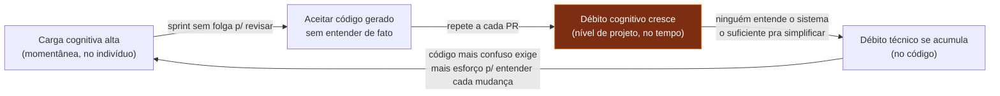

# Débito cognitivo

Segunda-feira, sprint planning. Alguém pergunta por que o serviço de billing recalcula o desconto duas vezes antes de aplicar o cupom. Ninguém no time lembra — o trecho foi gerado por um agente de IA três semanas atrás, os testes passam, o PR foi aprovado num code review de trinta segundos porque "o CI está verde". A funcionalidade funciona. Só que agora, pra mudar a regra de desconto, alguém vai ter que **reconstruir** o raciocínio do zero, porque ele nunca existiu na cabeça de ninguém — só na sessão de prompt que gerou o código, e essa sessão já foi embora.

Isso não é débito técnico: o código está limpo, formatado, com testes verdes. É outra coisa — o time perdeu o fio da meada sobre o *porquê* do sistema fazer o que faz. Esse "perder o fio" tem nome.

> [!abstract] TL;DR
> **Débito cognitivo** é a erosão progressiva do entendimento compartilhado de uma equipe sobre o que um sistema faz, por que as decisões foram tomadas e como mudá-lo. Diferente do débito técnico (que vive no código) e da carga cognitiva (momentânea), é uma propriedade de **nível de projeto**. A IA generativa o acelera: ela barateia produzir estrutura mais rápido do que o entendimento consegue estabilizar. Termo desenvolvido por Margaret-Anne Storey (2026), apoiado na tese de [[03-Dominios/Engenharia/Complexidade de Software/04 - O programa como teoria|Naur de que um programa é uma teoria]].

## O que é

Débito cognitivo é o que acontece quando um time perde, gradualmente, a [[03-Dominios/Engenharia/Complexidade de Software/04 - O programa como teoria|teoria do sistema]]: a capacidade de explicar o que o programa faz, como as intenções foram implementadas e como alterá-lo com segurança. Código limpo e testes verdes não impedem que as pessoas "percam o fio da meada".

É um conceito de **nível de projeto**, que captura como o entendimento se deteriora ao longo do tempo — não um estado momentâneo de um indivíduo.

## Débito cognitivo × débito técnico × carga cognitiva

| Conceito | Onde vive | Natureza |
| --- | --- | --- |
| **Débito técnico** | no código | atalhos estruturais que cobram juros em manutenção |
| **Carga cognitiva** | no indivíduo, no momento | esforço mental exigido por uma tarefa agora |
| **Débito cognitivo** | na mente coletiva, ao longo do tempo | erosão do entendimento compartilhado em nível de projeto |

A distinção é o ponto-chave: você pode zerar o débito técnico (código impecável, gerado por IA) e ainda assim acumular débito cognitivo, porque ninguém detém mais a teoria do que foi construído.

O diagrama abaixo mostra por que esses três conceitos não competem — eles se alimentam num ciclo. Carga cognitiva alta e crônica (sprint após sprint sem folga pra revisar de verdade) é o que empurra o time a aceitar código gerado sem entender — e é exatamente esse aceitar-sem-entender que acumula débito cognitivo ao longo do projeto:

O ponto cego é o nó C: dá pra medir débito técnico (linter, cobertura de testes) e carga cognitiva (quantas coisas na tela agora), mas débito cognitivo não aparece em métrica nenhuma — só aparece quando alguém pergunta "por que isso funciona assim?" e a resposta é silêncio.

## Por que a IA acelera

À medida que a IA reduz o atrito *técnico* de produzir código, o **entendimento compartilhado** vira o gargalo da performance. A IA baixa o custo de gerar estrutura, fazendo o sistema evoluir mais rápido do que a teoria humana consegue estabilizar. Adicionar mais agentes pode piorar: aumenta overhead de coordenação e decisões invisíveis — um eco do *Mythical Man-Month* de Brooks. **Velocidade sem entendimento não é sustentável.**

## Armadilhas comuns

Cada uma destas é um sintoma isolado — mas juntas formam o padrão de um time que já está pagando juros de débito cognitivo sem ter percebido.

> [!warning] "Ninguém quer mexer nesse módulo"
> Hesitação generalizada em mudar um trecho de código por medo de quebrar algo que ninguém entende de fato. Não é preguiça — é racionalidade: se o custo de entender supera o custo de contornar, o time contorna, e a área opaca cresce.

> [!warning] Conhecimento tribal concentrado em 1-2 pessoas
> Numa equipe que usa IA pesadamente, essa concentração é mais perigosa do que no legado tradicional: o código foi gerado rápido demais para que o conhecimento se espalhasse organicamente via pair programming ou revisão cuidadosa. Se essas 1-2 pessoas saem do time, a teoria do sistema sai com elas.

> [!warning] Onboarding cada vez mais lento
> Sintoma contraintuitivo: mais IA deveria acelerar a integração de gente nova, mas o efeito observado é o oposto — o novo integrante encontra um sistema que "funciona" mas cujas decisões ninguém no time consegue explicar, e vira arqueólogo antes de virar produtivo.

> [!warning] Caixa-preta com testes verdes
> O sistema passa em todos os testes e entrega o comportamento esperado — mas o "porquê" por trás de cada decisão se perdeu. Métricas de qualidade de código (cobertura, lint, complexidade ciclomática) não capturam esse tipo de erosão, porque ela vive nas cabeças das pessoas, não no código.

## Mitigação

- **[[03 - O comprehension gate|Comprehension gate]]:** exigir que ao menos um humano entenda cada mudança gerada por IA *antes* do merge.
- **Documentar o porquê, não só o quê:** decisões e alternativas descartadas, não apenas o que o código faz.
- **Checkpoints de reconstrução de entendimento:** code reviews, retrospectivas, sessões de knowledge-sharing.
- **Práticas que reconstroem teoria compartilhada:** pair programming, refactoring, TDD — e o *"make the hard change easy"* de Kent Beck.
- **Specs como artefatos vivos:** só funcionam se o time engaja ativamente com elas, não como documento morto.

## Casos práticos

> [!example] Incidente: o serviço de billing que ninguém sabia explicar
> Um agente de IA gerou, ao longo de várias sessões, o módulo de cálculo de desconto de um serviço de billing — cada PR individual estava limpo, testado e revisado (superficialmente) por um humano diferente. Meses depois, um bug de arredondamento em cupons combinados chega em produção. O time abre o código: os testes passam, a lógica "funciona", mas ninguém consegue explicar por que o desconto é recalculado duas vezes antes de aplicar o cupom — nem por que essa era a ordem "certa". Sem a teoria do sistema, o fix vira arqueologia: reconstruir a intenção original lendo commits e conversando com quem já não lembra, em vez de simplesmente corrigir. É o padrão do débito cognitivo: débito técnico zero (código limpo), débito cognitivo alto (ninguém entende o "porquê").

> [!example] Onboarding travado por débito acumulado
> Uma pessoa sênior entra num time que usa IA agenticamente há um ano. Espera-se que o código gerado facilite a integração — mas o efeito é o oposto: o sistema tem uma superfície grande (muitos módulos, gerados rápido) e uma teoria compartilhada pequena (poucas pessoas realmente entendem o *porquê* de cada decisão). As primeiras semanas, que deveriam ser de contribuição, viram sessões de "por que isso foi feito assim?" sem resposta — porque a resposta nunca foi documentada, só existiu na sessão de prompt que gerou o código. O onboarding lento não é falta de documentação convencional; é falta da teoria que a documentação deveria capturar.

## O que vem a seguir

Débito cognitivo é o sintoma de nível de projeto. Mas ele nasce de uma escolha feita PR a PR: aceitar ou não a saída da IA sem entendê-la de verdade. Essa escolha tem nome próprio — é a linha que separa **vibe coding** de **engenharia disciplinada com IA**, o assunto da próxima nota deste galho: [[02 - Vibe coding vs engenharia disciplinada|Vibe coding vs engenharia disciplinada]]. Antes disso, vale internalizar o vocabulário — em inglês é assim que a comunidade de engenharia discute o tema.

## Como explicar em inglês

Em conversas técnicas em inglês (code review, standup, discussão em RFC), estes são os termos que carregam o conceito:

- **Cognitive debt** — o termo cunhado por Margaret-Anne Storey: "*cognitive debt is a project-level property, capturing how a team loses understanding over time*" (débito cognitivo é uma propriedade de nível de projeto, que captura como um time perde entendimento ao longo do tempo). Não confundir com *cognitive load*, que é momentâneo e individual.
- **Comprehension gate** — a barreira de processo (normalmente no code review) que exige que pelo menos um humano entenda de fato uma mudança gerada por IA antes do merge. É a mitigação mais citada contra débito cognitivo.
- **Shared understanding** — o "entendimento compartilhado" que o débito cognitivo corrói; é o equivalente moderno da "teoria do sistema" de Naur, distribuída entre pessoas, docs, testes e (agora) agentes.

> [!tip] Assista: The Hidden Cost of AI-Generated Code: Cognitive Debt and Intent Debt
> **Canal:** Aviator | **Duração:** ~40min | **Idioma:** EN
>
> Entrevista com a própria Margaret-Anne Storey, ~16min depois do início ela conta como cunhou o termo "cognitive debt" em outubro de 2025 e diferencia de "intent debt" (a ausência de racional externalizado). Complementa a nota com o contexto de origem do conceito e a discussão ao vivo de como ele se manifesta em times usando múltiplos agentes de IA em paralelo.
>
> 🎬 [Assistir no YouTube](https://www.youtube.com/watch?v=tIPbqipc88U)

### Tabela PT↔EN

| Português | English |
| --- | --- |
| Débito cognitivo | Cognitive debt |
| Débito técnico | Technical debt |
| Carga cognitiva | Cognitive load |
| Entendimento compartilhado | Shared understanding |
| Barreira de compreensão / portão de compreensão | Comprehension gate |
| Teoria do sistema (Naur) | Theory of the program |
| Conhecimento tribal | Tribal knowledge |
| Perder o fio da meada | Losing the plot |

## Fontes

- [[02-Glosas/2026-cognitive-debt-hidden-risk-ai-driven-software-development|Cognitive debt: The hidden risk in AI-driven software development — Margaret-Anne Storey (DX)]] — [*Cognitive debt: The hidden risk in AI-driven software development*](https://newsletter.getdx.com/p/cognitive-debt-the-hidden-risk-in), Margaret-Anne Storey, Engineering Enablement / DX (abr. 2026). Artigo original que cunha e desenvolve o conceito.

## Veja também

- [[11 - Dívida cognitiva]] — **o mesmo conceito sob a lente geral/atemporal** (em [[03-Dominios/Engenharia/Complexidade de Software/index|Complexidade de Software]]); esta nota é o recorte da *aceleração por IA*
- [[03-Dominios/Engenharia/Complexidade de Software/04 - O programa como teoria]] — a base teórica (Naur): o que exatamente se perde quando há débito cognitivo
- [[03 - O comprehension gate|Comprehension gate]] — a barreira de code review que defende a teoria mudança a mudança
- [[02 - Vibe coding vs engenharia disciplinada|Vibe coding vs engenharia disciplinada]] — o contexto que gera o débito
- [[02-Glosas/2026-comprehension-debt-hidden-cost-ai-generated-code|Comprehension debt — Addy Osmani]] — conceito vizinho (gap código × entendimento)
- [[02-Glosas/2026-cognitive-surrender|Cognitive surrender — Addy Osmani]] — a postura individual que alimenta o débito
