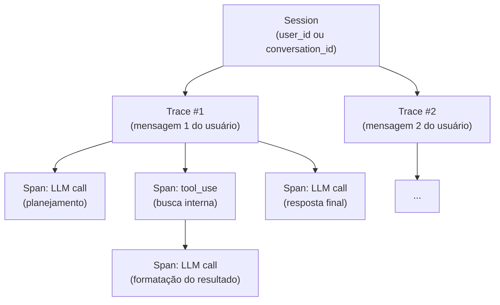

# 02 - Anatomia de um trace LLM

> [!abstract] TL;DR
> A unidade fundamental é uma hierarquia: **sessão → trace → spans**. Sessão agrupa interações de um mesmo usuário/conversa; trace representa uma "tarefa" completa (uma mensagem do usuário sendo respondida); spans são as etapas dentro da trace (LLM call, tool call, retrieval, sub-agent). O padrão emergente é **OpenTelemetry GenAI Semantic Conventions**, que define atributos como `gen_ai.system`, `gen_ai.request.model`, `gen_ai.usage.input_tokens` — adotá-los garante portabilidade entre Langfuse, Phoenix, Datadog, Grafana. Em agents multi-step, a árvore vira larga e profunda: trace raiz, span por LLM call, span por tool execution, sub-spans pra retrieval e pra sub-agents. Sem hierarquia explícita, debug em agent vira impossível.

Imagine o cenário: um agent de suporte respondeu errado pra um cliente — deu um valor de reembolso que não bate com a política da empresa. O log da aplicação mostra só a resposta final; ele não te diz *onde*, na cadeia de decisão, o erro entrou. Foi o modelo que interpretou mal a política? Foi o tool call que buscou o valor errado no banco? Foi um passo intermediário que se perdeu no meio do caminho? Sem uma hierarquia explícita de spans, você tem oito ou dez chamadas de LLM espalhadas nos logs, sem relação visível entre si — é como investigar um incidente com testemunhas que não sabem em que ordem os eventos aconteceram. A pergunta "onde exatamente isso quebrou?" só tem resposta se cada chamada carrega o mesmo `trace_id` e aponta pro seu `parent_span_id`, reconstruindo a árvore completa da tarefa. É isso que este texto explica: como modelar sessão, trace e span de um jeito que debug vire reconstrução de árvore — não arqueologia de logs soltos.

> [!question]- O que eu preciso saber antes de ler isso?
> Você entende por que LLMs precisam de observabilidade dedicada (nota 01) e o conceito básico de trace distribuído — uma sequência de eventos que representa uma operação completa em sistema distribuído. Se você já trabalhou com Jaeger, Zipkin, ou OpenTelemetry em serviços convencionais, vai reconhecer o modelo hierárquico desta nota. A diferença é que spans LLM carregam atributos extras específicos de IA: tokens, prompts, finish reasons.

## Os três níveis da hierarquia



| Nível | Granularidade | Identificador | Vida útil |
|---|---|---|---|
| Session | Conversa / usuário | `session_id`, `user_id` | Dias / semanas |
| Trace | Uma tarefa do usuário | `trace_id` (UUID v4 / 128 bits) | Segundos / minutos |
| Span | Uma operação interna | `span_id` (UUID / 64 bits) + `parent_span_id` | Milissegundos / segundos |

A regra simples: **trace é o que você mostra pro stakeholder pra explicar uma resposta**; **span é o que você abre pra debugar uma etapa específica**.

Tradução prática: se alguém pergunta "por que essa resposta foi assim?", você abre um trace — a história completa de uma tarefa. Se alguém pergunta "por que o tool call demorou 4 segundos?", você abre um span específico — a fatia da história que tem aquele detalhe.

## OpenTelemetry GenAI — convenções semânticas

OpenTelemetry (OTel) padronizou (ainda em status `experimental` em 2026, mas amplamente adotado) os atributos pra spans de IA generativa. Adotar essas convenções dá portabilidade — instrumenta uma vez, exporta pra qualquer backend OTel-compatible.

**Atributos obrigatórios em qualquer span LLM:**

```python
span.set_attribute("gen_ai.system", "anthropic")              # provider
span.set_attribute("gen_ai.request.model", "claude-sonnet-4-6") # modelo solicitado
span.set_attribute("gen_ai.response.model", "claude-sonnet-4-6") # modelo efetivamente usado
span.set_attribute("gen_ai.operation.name", "chat")           # chat | text_completion | embeddings
```

**Atributos de uso (tokens):**

```python
span.set_attribute("gen_ai.usage.input_tokens", 1500)
span.set_attribute("gen_ai.usage.output_tokens", 380)
# Não-padrão mas convencionado entre Langfuse/Phoenix:
span.set_attribute("gen_ai.usage.cache_read_input_tokens", 900)
span.set_attribute("gen_ai.usage.cache_creation_input_tokens", 100)
span.set_attribute("gen_ai.usage.reasoning_tokens", 240)
```

**Atributos de parâmetros de requisição:**

```python
span.set_attribute("gen_ai.request.max_tokens", 1024)
span.set_attribute("gen_ai.request.temperature", 0.7)
span.set_attribute("gen_ai.request.top_p", 0.95)
span.set_attribute("gen_ai.request.stop_sequences", ["</answer>"])
```

**Atributos de resposta:**

```python
span.set_attribute("gen_ai.response.id", "msg_01ABC...")       # ID do provider
span.set_attribute("gen_ai.response.finish_reasons", ["end_turn"])
```

**Eventos de span (preferir pra prompt e resposta):**

Prompts e respostas não devem ir como atributos (atributos são indexados e podem vazar PII pra logs de baixo controle). A convenção é colocá-los como **span events** — payload anexo, redactável separadamente:

```python
span.add_event("gen_ai.content.prompt", attributes={
    "gen_ai.prompt.0.role": "system",
    "gen_ai.prompt.0.content": SYSTEM_PROMPT,   # candidato a redaction
    "gen_ai.prompt.1.role": "user",
    "gen_ai.prompt.1.content": user_input,      # candidato a redaction
})

span.add_event("gen_ai.content.completion", attributes={
    "gen_ai.completion.0.role": "assistant",
    "gen_ai.completion.0.content": response_text,
    "gen_ai.completion.0.finish_reason": "end_turn",
})
```

Política de PII separada — span events podem ser droppados em export sem perder o resto do trace. Em compliance pesado (HIPAA, LGPD, GDPR), essa separação é o que permite ter traces completos internamente e exportar métricas sem dados pessoais para ferramentas SaaS.

## Hierarquia em agents multi-step

Agent que faz planejamento + retrieval + várias tool calls + síntese vira árvore profunda. Exemplo real (agent de pesquisa que responde "qual o estado da arte de fine-tuning em 2026?"):

```
Trace (id: 7f3a...) — "estado da arte de fine-tuning em 2026?"
├─ duration: 18.4s
├─ total_input_tokens: 24,580
├─ total_output_tokens: 3,240
├─ total_cost_usd: 0.42
│
├── Span: agent.plan — 1.2s
│   ├── LLM call (gen_ai)
│   │   ├─ model: claude-sonnet-4-6
│   │   ├─ input_tokens: 3,200
│   │   ├─ output_tokens: 280
│   │   └─ finish_reason: tool_use
│   └── output: plan{steps: [search_arxiv, search_blog, summarize]}
│
├── Span: tool.search_arxiv — 2.8s
│   ├── attributes: {query: "fine-tuning 2026 survey", top_k: 10}
│   ├── Span: embedding — 0.3s
│   │   └── LLM call (embeddings) — 1,200 input tokens
│   └── output: [10 papers com scores]
│
├── Span: tool.search_blog — 1.4s
│   └── output: [12 posts com scores]
│
├── Span: agent.synthesize — 12.6s
│   ├── LLM call (gen_ai)
│   │   ├─ model: claude-opus-4-7
│   │   ├─ input_tokens: 19,800 (inclui contexto recuperado)
│   │   ├─ reasoning_tokens: 1,840
│   │   ├─ output_tokens: 2,960
│   │   └─ finish_reason: end_turn
│   └── output: resposta final
│
└── attributes:
    ├── eval.score: 4.6/5
    └── user.feedback: thumbs_up
```

Cada span carrega `parent_span_id` apontando pro pai. A árvore inteira é reconstruída na UI do Langfuse/Phoenix por essa relação. Um trace sem hierarquia de spans — onde tudo aparece no mesmo nível — é tão informativo quanto um stack trace sem frames: você sabe que algo aconteceu, mas não onde.

## Required vs nice-to-have

Pra cada span LLM, divisão pragmática:

**Required (não-negociável):**
- `trace_id`, `span_id`, `parent_span_id`
- `start_time`, `end_time`
- `gen_ai.system`, `gen_ai.request.model`
- `gen_ai.usage.input_tokens`, `gen_ai.usage.output_tokens`
- `status` (ok / error)

**Strongly recommended:**
- `gen_ai.response.finish_reasons`
- `gen_ai.request.temperature`, `gen_ai.request.max_tokens`
- `gen_ai.usage.cache_read_input_tokens` (se usar caching)
- `cost_usd` calculado
- `prompt_version` (custom attribute) — qual versão do prompt foi usada
- Prompt e resposta como span events

**Nice-to-have:**
- `gen_ai.request.top_p`, `gen_ai.request.stop_sequences`
- `gen_ai.response.id` (ID do provider — útil pra cruzar com logs deles)
- `tools_schema` enviado
- `eval.score` (se rodou eval inline)
- `user.feedback` (se capturado depois)
- Métricas de retrieval (top-k, scores) em spans filhos

## Como ler um trace em debug

Quando você abre um trace na UI (Langfuse ou Phoenix), a leitura eficiente segue uma sequência:

1. **Olhe o status geral** — trace completou ou falhou? finish_reason inesperado?
2. **Veja a duração total e o custo total** — outlier? Fora do baseline?
3. **Expanda span mais demorado** — onde o tempo foi? Em qual LLM call ou tool?
4. **Olhe os input_tokens do span mais caro** — prompt inflado? Cache miss inesperado?
5. **Leia o conteúdo do prompt** (nos span events) — o prompt materializado era o que você esperava?
6. **Leia o output** — a resposta faz sentido dado o prompt e o contexto?
7. **Verifique finish_reason** — cortou por `max_tokens` em vez de `end_turn`?

Um trace que demora 3x mais que a mediana e tem finish_reason `max_tokens` já apontou o problema: budget de tokens insuficiente pra esse caso de uso.

## Status do padrão em 2026

| Item | Status |
|---|---|
| `gen_ai.*` core attributes | Stable na intenção, marcados como `experimental` na spec |
| Atributos de tool calling | Em ativo desenvolvimento; convenção ainda variável entre libs |
| Atributos de cache de prompt | Não padronizado oficialmente; Langfuse/Phoenix convergiram em `gen_ai.usage.cache_*` |
| Embeddings | Convenção separada — `gen_ai.operation.name = "embeddings"` |
| Adoção em SDKs | OpenLLMetry (community) e Langfuse SDK instrumentam Anthropic, OpenAI, Google direto |
| Backends suportados | Datadog (nativo), Grafana Tempo (nativo), Langfuse (importa OTel), Phoenix (nativo OTel) |

A direção é convergente, mas em 2026 ainda há divergência entre `gen_ai.usage.input_tokens` (OTel canônico) e `gen_ai.input_tokens` (alguns SDKs). Quando instrumentar manualmente, escolha o padrão da spec e documente.

## Como montar um span mínimo em Python

Sem framework de observability, você pode criar spans manuais com `opentelemetry-sdk`:

```python
from opentelemetry import trace
from opentelemetry.sdk.trace import TracerProvider
from anthropic import Anthropic

tracer = trace.get_tracer("my-llm-app")
client = Anthropic()

def call_with_trace(session_id: str, prompt: str) -> str:
    with tracer.start_as_current_span("llm.chat") as span:
        span.set_attribute("session.id", session_id)
        span.set_attribute("gen_ai.system", "anthropic")
        span.set_attribute("gen_ai.request.model", "claude-sonnet-4-6")
        span.set_attribute("gen_ai.request.temperature", 0.7)

        response = client.messages.create(
            model="claude-sonnet-4-6",
            max_tokens=1024,
            messages=[{"role": "user", "content": prompt}]
        )

        span.set_attribute("gen_ai.response.model", response.model)
        span.set_attribute("gen_ai.usage.input_tokens", response.usage.input_tokens)
        span.set_attribute("gen_ai.usage.output_tokens", response.usage.output_tokens)
        span.set_attribute("gen_ai.response.finish_reasons", [response.stop_reason])

        return response.content[0].text
```

Em produção real, Langfuse e OpenLLMetry instrumentam isso automaticamente — mas entender o span manual ajuda a saber o que está sendo capturado.

## Armadilhas comuns

> [!warning] Não propagar trace_id entre chamadas de agent
> Em agents que fazem múltiplas chamadas LLM em sequência, cada chamada precisa ter o mesmo `trace_id` com `parent_span_id` apontando pra span pai correta. O erro comum é criar um trace novo pra cada LLM call — isso resulta em traces fragmentados, um por chamada, sem hierarquia. No debug, você vê 8 traces separados pra uma tarefa que deveria aparecer como uma árvore coesa. Frameworks de agent como LangChain e Anthropic SDK com Langfuse SDK resolvem isso automaticamente; quando você instrumenta manualmente, precisa propagar o span context via `Context` do OpenTelemetry.

O código abaixo mostra o anti-padrão na prática — cada etapa do agent abre seu próprio span "solto", sem se conectar a um trace pai:

```python
# ANTI-PADRÃO: cada chamada cria um span novo, sem hierarquia com as demais
def agent_step(prompt: str) -> str:
    with tracer.start_as_current_span("llm.chat") as span:  # sempre "raiz" — sem parent
        span.set_attribute("gen_ai.system", "anthropic")
        span.set_attribute("gen_ai.request.model", "claude-sonnet-4-6")
        response = client.messages.create(
            model="claude-sonnet-4-6",
            max_tokens=1024,
            messages=[{"role": "user", "content": prompt}],
        )
        span.set_attribute("gen_ai.usage.input_tokens", response.usage.input_tokens)
        return response.content[0].text

# Resultado: 3 chamadas do agent viram 3 traces isolados no backend,
# sem parent_span_id em comum — a UI mostra 3 histórias soltas,
# não uma árvore de uma única tarefa.
plan = agent_step(plan_prompt)
search_result = agent_step(search_prompt)
final = agent_step(synthesize_prompt)
```

A correção é abrir **um** span pai por tarefa e deixar que os spans filhos herdem o contexto ativo — é isso que faz `parent_span_id` apontar pro lugar certo automaticamente:

```python
# CORRETO: um span pai por tarefa; os filhos herdam o trace_id do contexto ativo
with tracer.start_as_current_span("agent.task") as root_span:
    root_span.set_attribute("session.id", session_id)

    for step_name, prompt in [
        ("plan", plan_prompt),
        ("search", search_prompt),
        ("synthesize", synthesize_prompt),
    ]:
        with tracer.start_as_current_span(f"llm.{step_name}") as span:  # child do root_span
            span.set_attribute("gen_ai.system", "anthropic")
            span.set_attribute("gen_ai.request.model", "claude-sonnet-4-6")
            response = client.messages.create(
                model="claude-sonnet-4-6",
                max_tokens=1024,
                messages=[{"role": "user", "content": prompt}],
            )
            span.set_attribute("gen_ai.usage.input_tokens", response.usage.input_tokens)
```

A diferença não está em nenhum atributo novo — está em `start_as_current_span` ser chamado dentro do contexto do `root_span`. O SDK do OpenTelemetry propaga o `trace_id` automaticamente via `Context`; o erro do anti-padrão é abrir cada span "solto", fora desse contexto.

> [!warning] Colocar PII como atributo de span em vez de span event
> Atributos de span são indexados e podem ser exportados para múltiplos backends — incluindo logs de infra com menor controle de acesso. Se você coloca o conteúdo do prompt (que pode conter nome, CPF, email do usuário) como `gen_ai.prompt.content` no atributo, esse dado vai parar em todos os sistemas que consumem o trace. A prática correta é usar **span events** para o conteúdo do prompt e da resposta — eventos podem ser redactados ou droppados no exporter sem perder os atributos numéricos e de metadata. Langfuse permite configurar `mask_all_logs: true` e redaction de span events por regex.

> [!warning] Não registrar finish_reason como atributo obrigatório
> `finish_reason` parece um detalhe óbvio, mas é frequentemente omitido em implementações caseiras. O problema: quando o modelo cortou por `max_tokens` em vez de `end_turn`, o output está incompleto — mas se você não grava o finish_reason, a resposta parece normal nos traces. Em pipelines de extração estruturada, `max_tokens` no meio do JSON retornado resulta em parsing exception — rastreável se você tem o finish_reason; invisível se não tem. Adicione `gen_ai.response.finish_reasons` a todos os spans LLM. Configure alert se taxa de `max_tokens` > 3% (geralmente indica max_tokens muito baixo ou prompt inflado).

## Como explicar em inglês

Em entrevistas sobre arquitetura de sistemas LLM em produção, descrever a hierarquia de trace demonstra que você tem experiência operacional, não só de desenvolvimento:

> "In LLM systems, a trace maps to one user task — one question answered, one document processed. Within that trace, you have spans: one for the LLM call, one for each tool call, child spans for retrieval steps. The key is propagating the trace context across all calls so they form a tree, not separate isolated traces. We follow OpenTelemetry GenAI semantic conventions for the attributes — gen_ai.system, gen_ai.request.model, token counts per category, finish_reason. Prompt and completion content go in span events rather than attributes, so PII can be masked without losing the operational metrics."

| Português | Inglês |
|-----------|--------|
| trace de LLM | LLM trace |
| span filho | child span |
| span pai | parent span |
| contexto de trace propagado | propagated trace context |
| convenções semânticas | semantic conventions |
| evento de span | span event |
| razão de finalização | finish reason |
| redação de PII | PII redaction |
| exportador de trace | trace exporter |
| hierarquia de spans | span hierarchy |

## Checklist de instrumentação de trace

> [!tip] O que verificar antes de ir pra produção
> - [ ] Cada LLM call tem `trace_id`, `span_id`, `parent_span_id`
> - [ ] Tokens registrados por categoria: `input_tokens`, `output_tokens`, `reasoning_tokens`, `cache_*`
> - [ ] `finish_reason` em todos os spans
> - [ ] `model` exato (com subversão), não só o alias
> - [ ] `prompt_version` como atributo custom
> - [ ] Prompt e resposta em span events (não em atributos indexados)
> - [ ] `session_id` e `user_id` nos traces

## O que vem a seguir

Com a anatomia de trace em mãos, a nota 03 entra no Langfuse — o padrão OSS que materializa essa hierarquia em UI, datasets, e integração com eval.

Ver [[03 - Langfuse — open-source standard]].

## Fontes

- **OpenTelemetry** — [*Semantic Conventions for Generative AI*](https://opentelemetry.io/docs/specs/semconv/gen-ai/). Spec oficial.
- **OpenTelemetry** — [*GenAI metrics and events*](https://opentelemetry.io/docs/specs/semconv/gen-ai/gen-ai-events/). Convenção pra span events com prompt/completion.
- **Langfuse** — [*Tracing data model*](https://langfuse.com/docs/tracing-data-model). Trace/observation/generation explicado.
- **OpenLLMetry** — [*GitHub traceloop/openllmetry*](https://github.com/traceloop/openllmetry). Implementação OTel pra provedores populares.

## Veja também

- [[03 - Langfuse — open-source standard]] — como Langfuse materializa essa hierarquia
- [[04 - Helicone, Phoenix, OpenLLMetry — alternativas]] — outras implementações
- [[05 - Versionamento de prompts]] — `prompt_version` como atributo crítico do span
- [[Dicionário de IA#OpenTelemetry GenAI|Dicionário: OpenTelemetry GenAI]]
- [[Dicionário de IA#tracing|Dicionário: tracing]], [[Dicionário de IA#span|Dicionário: span]]
