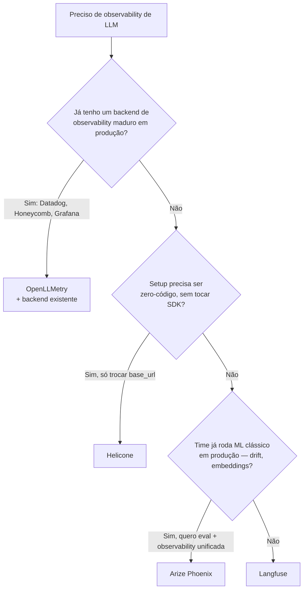

# 04 - Helicone, Phoenix, OpenLLMetry — alternativas

> [!abstract] TL;DR
> Langfuse é referência, mas três alternativas resolvem problemas específicos melhor: **Helicone** entrega tracing via proxy (mudou `base_url`, virou observability) — friction zero, OSS + cloud, ótimo quando o ganho é justamente não tocar SDK; **Arize Phoenix** vem do mundo ML (não só LLM), forte em eval e integração nativa OpenTelemetry — bom pra time que já tem ML clássico em produção; **OpenLLMetry** não é backend, é coleção de instrumentações OTel-puras (Anthropic, OpenAI, etc.) que exportam pra **qualquer** backend OTel (Datadog, New Relic, Honeycomb, Grafana Tempo) — escolha quando já tem stack OTel madura e não quer trazer mais um produto. Decisão: ferramenta segue o gargalo — friction (Helicone), eval (Phoenix), reuso de stack (OpenLLMetry). (Ecossistema muda rápido; verifique a trajetória atual de cada player antes de cravar a escolha pra greenfield.)

> [!question]- Quando faz sentido usar OpenLLMetry em vez de simplesmente adotar Langfuse?
> OpenLLMetry é a escolha certa quando o time **já tem uma plataforma de observability unificada** (Datadog, Honeycomb, Grafana) e o custo político de adicionar mais um produto é alto demais — seja por compliance, custo de licença, ou fricção com SRE. Nesse caso, OpenLLMetry injeta traces de LLM no backend já existente. Langfuse faz mais sentido quando o time de IA precisa de features específicas (prompt versioning, datasets de eval, LLM-as-judge integrado) que os backends genéricos não oferecem. Os dois também podem coexistir: OpenLLMetry → Langfuse é uma combinação válida.

## Helicone — proxy-based

**Como funciona:** você não muda código de chamada, só muda a `base_url` do cliente pra apontar pra Helicone. Todas as requisições passam pelo proxy deles, que captura tudo antes de repassar ao provider.

```python
import anthropic

client = anthropic.Anthropic(
    base_url="https://anthropic.helicone.ai/v1",
    default_headers={
        "Helicone-Auth": f"Bearer {os.environ['HELICONE_API_KEY']}",
        "Helicone-Session-Id": session_id,
        "Helicone-User-Id": user_id,
        "Helicone-Property-Feature": "research-agent",
    },
)
response = client.messages.create(
    model="claude-sonnet-4-6",
    max_tokens=1024,
    messages=[{"role": "user", "content": user_prompt}],
)
```

**Vantagens originais:**
- Setup em 5 minutos — uma linha de código
- Custom headers viram dimensões de filtro no dashboard
- Cache semântico no edge (Cloudflare) — armazena respostas completas, redução adicional além de [[Dicionário de IA#Prompt caching|prompt caching]] do provider
- AI Gateway: load balancing entre providers, failover, rate limiting

**Tradeoffs:**
- Proxy adiciona um hop na rede — latência extra, mais um ponto de falha entre app e provider
- Modelo proxy-only limita feature surface comparado a Langfuse/Phoenix (sem prompt registry nativo nem datasets de eval no mesmo plano)
- Ecossistema de LLM observability muda rápido — confira trajetória atual (releases, atividade no GitHub, modelo de pricing) antes de cravar pra greenfield

**Quando escolher Helicone:**
- Precisa de proxy real (cache semântico no edge, failover entre providers, gateway)
- Setup precisa ser literalmente zero-código (só mexer em `base_url`)
- Time minúsculo onde nenhum SDK pode tocar (single-file Python ou Node)
- Projeto legado já integrado

**Cuidado com latência:** toda chamada passa pelo proxy de Helicone antes de chegar ao provider. Em uso normal a latência adicional é imperceptível (<20ms), mas em sistemas sensíveis a latência como voz ou autocomplete em tempo real, esse hop pode virar problema. Sempre configure fallback pra `base_url` original.

## Arize Phoenix — ML-native + OTel-first

**Como funciona:** Phoenix é OSS construído sobre OpenTelemetry desde o começo — não usa SDK proprietário, usa OTel direto. É um backend de tracing + uma plataforma de evals em cima.

```python
from phoenix.otel import register
from openinference.instrumentation.anthropic import AnthropicInstrumentor

# Inicializa tracer OTel apontando pro Phoenix
tracer_provider = register(
    project_name="research-agent",
    endpoint="http://localhost:6006/v1/traces",  # local; troca por phoenix.arize.com em cloud
)

# Instrumenta o SDK da Anthropic automaticamente
AnthropicInstrumentor().instrument(tracer_provider=tracer_provider)

# A partir daqui, qualquer messages.create() é instrumentada sem mais código
import anthropic
client = anthropic.Anthropic()
response = client.messages.create(
    model="claude-sonnet-4-6",
    max_tokens=1024,
    messages=[{"role": "user", "content": "explica MCP"}],
)
```

**Diferenciais:**
- **OpenTelemetry nativo** — sem SDK proprietário. Exporta pra Phoenix, mas também pra qualquer backend OTel
- **ML observability além de LLM** — drift detection, embedding visualization, vector store inspection — vem do background da Arize em ML clássico
- **Evals nativos** — LLM-as-judge, code checks, human annotation, custom evaluators
- **Integrações OOTB** — OpenAI Agents SDK, Claude Agent SDK, LangGraph, CrewAI, LlamaIndex, DSPy
- **Mesmo produto local e cloud** — `docker run` em dev, `phoenix.arize.com` em produção, mesma API

**Quando escolher Phoenix:**
- Time já tem ML clássico em produção (recomendação, classificação, etc.)
- Quer OTel-puro sem amarrar a SDK proprietário
- Foco principal é **eval contínua de qualidade**, não só observability
- Precisa de embedding visualization / drift detection no mesmo lugar

Phoenix Local vs Cloud: o self-hosted (`docker run arizephoenix/phoenix`) é idêntico ao Cloud em features, mas sem persistência cross-restart (por padrão os traces ficam em memória). Configure um `PHOENIX_SQL_DATABASE_URL` pra Postgres pra ter persistência real em self-host.

## OpenLLMetry — instrumentação OTel pura

**O que é (e o que NÃO é):** OpenLLMetry **não é backend**. É uma coleção de bibliotecas community-driven (Traceloop) que instrumentam SDKs de LLM (Anthropic, OpenAI, Google, Cohere, Mistral, Bedrock) seguindo as semantic conventions OTel GenAI. Os traces vão pra qualquer backend OTel.

```python
from traceloop.sdk import Traceloop

# Aponta pra qualquer backend OTel:
Traceloop.init(
    app_name="research-agent",
    api_endpoint="https://api.honeycomb.io/v1/traces",  # ou Datadog, ou Grafana Tempo
    headers={"x-honeycomb-team": HONEYCOMB_API_KEY},
)

# Pronto. Qualquer chamada LLM agora vira span no Honeycomb
import anthropic
client = anthropic.Anthropic()
response = client.messages.create(
    model="claude-sonnet-4-6",
    max_tokens=1024,
    messages=[{"role": "user", "content": "..."}],
)
```

**Decoradores opcionais pra estruturar workflows:**

```python
from traceloop.sdk.decorators import workflow, task

@workflow(name="research")
def research(question: str) -> str:
    sources = retrieve(question)
    return synthesize(question, sources)

@task(name="synthesize")
def synthesize(question: str, sources: list[str]) -> str:
    # ... chamada LLM aqui é capturada automaticamente
    ...
```

**Diferenciais:**
- **Backend-agnostic** — Datadog, Honeycomb, New Relic, Grafana, Langfuse, Phoenix, qualquer coisa que aceite OTLP
- **Zero novo produto** — se o time já tem Datadog em produção, traces de LLM aparecem no mesmo Datadog
- **Padrão emergente** — segue OTel GenAI semantic conventions sem desvio
- **Lightweight** — só instrumentação; sem UI, sem prompt registry, sem datasets

**Quando escolher OpenLLMetry:**
- Stack de observability já madura (Datadog, Honeycomb, Grafana)
- Não quer mais um backend pra operar
- Compliance/centralização exige que todos os traces fiquem na mesma plataforma
- Time de plataforma forte, time de IA pequeno

**Cuidado:** sem UI dedicada pra LLM, debug de prompt vs versão fica menos fluido que Langfuse/Phoenix. Compensa com queries customizadas no backend. O trade-off é intencional: OpenLLMetry é lib de instrumentação, não produto — ele faz uma coisa só e faz bem, deixando a UI pra quem já é bom nisso.

## OpenInference vs OpenLLMetry — detalhe de schema

Dois padrões coexistem no espaço OTel para LLM:

- **OpenInference** (Arize): especificação de atributos para spans de LLM — define nomes como `input.value`, `output.value`, `llm.model_name`, `llm.token_count.prompt`. Usada pelos instrumentadores da Arize (`openinference.instrumentation.*`).
- **OTel GenAI Semantic Conventions** (CNCF): especificação emergente oficial — define `gen_ai.system`, `gen_ai.request.model`, `gen_ai.usage.input_tokens`. Usada pelo OpenLLMetry (Traceloop) e crescendo em adoção.

Na prática: se você misturar instrumentadores de Arize com instrumentadores da Traceloop, seus spans vão ter nomes de atributos diferentes pra mesma coisa. O dashboard vai filtrar errado. Escolha um schema e use instrumentadores daquela família.

## Código-com-falha — dois jeitos de quebrar a instrumentação OTel

A parte enganosa do OpenTelemetry é que o código "errado" quase sempre roda sem exceção — ele só produz traces incompletos ou ilegíveis, silenciosamente. Dois erros recorrentes:

**1. Criar um `tracer_provider` novo por módulo, em vez de reusar um único:**

```python
# ❌ ERRADO — cada módulo chama register() de novo
# arquivo: retrieval.py
from phoenix.otel import register
tracer_provider = register(project_name="research-agent")  # cria provider #1

# arquivo: synthesis.py
from phoenix.otel import register
tracer_provider = register(project_name="research-agent")  # cria provider #2 !!
```

Cada chamada a `register()` (ou a `TracerProvider()` puro) instancia um novo provider com seu próprio exportador e seu próprio buffer de spans. Resultado: os spans de `retrieval.py` e `synthesis.py` — que deveriam ser filhos do mesmo trace — acabam em dois exportadores diferentes, às vezes com dois trace IDs raiz distintos. No dashboard, o que devia ser **um trace com duas etapas** aparece como **dois traces desconectados**. Pior: se o segundo `register()` reconfigurar o SDK global do OTel, o primeiro exportador pode parar de flushar.

```python
# ✅ CERTO — um único provider, criado uma vez, injetado onde precisar
# arquivo: observability.py
from phoenix.otel import register
tracer_provider = register(project_name="research-agent")

# arquivo: retrieval.py e synthesis.py importam o MESMO provider
from observability import tracer_provider
AnthropicInstrumentor().instrument(tracer_provider=tracer_provider)
```

**2. Misturar instrumentadores OpenInference e OTel GenAI no mesmo processo:**

```python
# ❌ ERRADO — dois instrumentadores, dois schemas, no mesmo client
from openinference.instrumentation.anthropic import AnthropicInstrumentor  # OpenInference
from traceloop.sdk import Traceloop  # OTel GenAI (Traceloop)

AnthropicInstrumentor().instrument(tracer_provider=tracer_provider)
Traceloop.init(app_name="research-agent")  # instrumenta o MESMO SDK Anthropic de novo
```

Isso não quebra com erro — os dois instrumentadores decoram o mesmo método `messages.create` do SDK da Anthropic, então a chamada gera **spans duplicados**, um com atributos `input.value`/`llm.model_name` (OpenInference) e outro com `gen_ai.prompt`/`gen_ai.request.model` (OTel GenAI). Um dashboard configurado para filtrar por `gen_ai.request.model` simplesmente não encontra os spans do OpenInference, e vice-versa — parece que metade das chamadas "sumiu", quando na verdade estão lá com outro nome de atributo.

```python
# ✅ CERTO — escolha um schema, instrumente uma vez só
from openinference.instrumentation.anthropic import AnthropicInstrumentor
AnthropicInstrumentor().instrument(tracer_provider=tracer_provider)
# não inicializa Traceloop no mesmo processo
```

A regra prática: um processo, um `tracer_provider`, uma família de instrumentadores (OpenInference **ou** OTel GenAI — nunca as duas). Se dois times/serviços usam famílias diferentes, o problema só aparece quando os traces precisam ser correlacionados no mesmo backend.

## Tabela comparativa

| Ferramenta | Hosting | Modelo de integração | Custo | Forte em | Melhor para |
|---|---|---|---|---|---|
| **Langfuse** | OSS + Cloud | SDK proprietário + OTel import | Free self-host / freemium cloud | Cobertura horizontal (trace + prompts + evals) | Time de IA dedicado, OSS sério |
| **Helicone** | Cloud + OSS | Proxy (base_url change) | Freemium | Friction zero, cache semântico edge, gateway | Setup zero-código, proxy real |
| **Arize Phoenix** | OSS (local + cloud) | OTel + auto-instrumentation | Free self-host / pago cloud | Eval nativo + ML observability + drift | Time com ML clássico em prod |
| **OpenLLMetry** | Lib (sem backend) | OTel auto-instrumentation | Free (lib) + custo do backend escolhido | Reuso de stack existente | Stack OTel madura, time plataforma forte |

## Custo — o que cada ferramenta cobra

O custo é uma dimensão frequentemente ignorada na escolha inicial e que pesa quando o volume cresce:

| Ferramenta | Free tier | Pago | Self-host |
|---|---|---|---|
| Langfuse Cloud | 50k observações/mês | ~$30-200/mês por volume | Sim — infra própria |
| Helicone Cloud | 10k requests/mês | $0.00025 por request extra | Sim (OSS) |
| Arize Phoenix | Ilimitado local | Phoenix Cloud tem free tier limitado + planos pagos | Sim (OSS) |
| OpenLLMetry | Free (lib) | Custo do backend escolhido | N/A — é uma biblioteca |

OpenLLMetry é única alternativa onde o custo de observability de LLM não existe isoladamente — você paga o que já pagava no Datadog/Honeycomb, só com mais dados. Isso pode ser vantagem (amortiza o custo geral) ou desvantagem (Datadog cobra por GB ingerido — traces LLM incluem prompts e respostas inteiros, que são verbosos).

Dica prática: configure sampling agressivo (ex: 10% das requests) no OTel exporter antes de ligar tudo no Datadog — evita surpresa na fatura.

## Como decidir — em uma pergunta

O fluxo abaixo condensa os critérios já discutidos em cada seção — não é um fato novo, é o mesmo raciocínio em forma de diagrama, pra decidir em 30 segundos em vez de reler o artigo inteiro:



| Sua situação | Escolha |
|---|---|
| "Quero OSS, tudo num lugar, dado meu" | Langfuse self-host |
| "Quero começar em 5 min sem operar nada" | Langfuse Cloud |
| "Já tenho Datadog/Honeycomb e não quero outra UI" | OpenLLMetry + seu backend |
| "Time já faz ML clássico; quero observability unificada" | Arize Phoenix |
| "Projeto legado já em Helicone" | Mantém Helicone |
| "Quero proxy de verdade (cache, failover, gateway)" | Helicone, Portkey, ou LiteLLM Gateway |

## Portkey e LiteLLM — menção honrosa

Duas ferramentas que aparecem nos mesmos contextos mas têm funções distintas:

**Portkey** é um AI Gateway gerenciado — foco em reliability (fallback, retry, load balancing entre modelos), cache, rate limiting, e observability básica. É similar a Helicone na abordagem de proxy, mas com ênfase maior em features de gateway (roteamento por custo, A/B testing de modelos). Boa escolha pra times que precisam de governance de LLM em multi-tenant SaaS.

**LiteLLM** é uma biblioteca Python (e servidor gateway) que abstrai chamadas para 100+ LLMs com uma interface unificada (`openai`-compatible). Permite trocar de `gpt-4o` pra `claude-sonnet-4-6` mudando uma linha. Tem integração básica com ferramentas de observability via OTel, mas o foco é abstração de provider, não observability. Bom pra times que querem portabilidade entre modelos sem reescrever chamadas.

A distinção importa: Portkey/LiteLLM resolvem **uniformidade de API e routing**, enquanto Langfuse/Phoenix/Helicone resolvem **visibilidade e qualidade**. Podem coexistir: LiteLLM como gateway + Langfuse como observability.

## Combinações comuns

Stack não precisa ser monolítica. Padrões que aparecem em times médios:

- **OpenLLMetry → Langfuse** — instrumentação OTel pura, backend Langfuse. Tira lock-in de SDK, ganha UI especializada
- **Langfuse + Phoenix** — Langfuse pra prompt management e tracing day-to-day; Phoenix pra eval de qualidade em datasets grandes
- **OpenLLMetry → Datadog/Honeycomb** — quando observability geral é compartilhada com SRE; LLM vira mais uma dimensão
- **LiteLLM (gateway) + Langfuse (obs)** — abstração de provider com observability especializada; popular em plataformas internas multi-tenant
- **Helicone → migração pra Langfuse** — começa no proxy pra capturar valor rápido, migra quando precisa de prompt versioning e eval integrados

**Exemplo de stack completa (fan-out via OTel Collector):** um padrão que aparece quando SRE e o time de IA têm necessidades diferentes é instrumentar a aplicação **uma única vez**, com OpenLLMetry, e deixar o roteamento pra múltiplos backends a cargo de um OTel Collector — assim nenhum time precisa reinstrumentar o código pra "adicionar mais um destino":

```
Aplicação (Anthropic SDK)
   │  instrumentado 1x com OpenLLMetry (Traceloop.init)
   ▼
OTel Collector (self-hosted)
   │  fan-out por config, sem tocar a aplicação
   ├──▶ Langfuse       (prompt management + eval, time de IA)
   └──▶ Datadog/Honeycomb (visão unificada de infra, time de SRE)
```

Na prática, isso é um `exporters:` com duas entradas no `config.yaml` do Collector — a aplicação continua enviando pra um único endpoint OTLP e nunca sabe que os spans estão sendo duplicados para dois backends. É a combinação que mais reduz lock-in: trocar ou adicionar um backend vira mudança de configuração de infra, não deploy de aplicação.

## Sinais de que é hora de mudar de ferramenta

Problemas recorrentes que indicam que a ferramenta atual virou gargalo:

**Helicone → Langfuse:** você está tentando fazer A/B testing de prompts exportando CSV manualmente, ou precisa rodar eval em batch sem escrever script do zero toda vez. Esses são features de produto, não de proxy.

**OpenLLMetry → Langfuse/Phoenix:** os engenheiros de IA estão sempre pedindo "filtrar por versão de prompt" ou "quero ver só os traces onde o modelo respondeu errado" — queries que num backend genérico exigem DSL complexo ou custom dashboard. UI especializada de LLM paga isso direto.

**Langfuse → Phoenix:** o time começa a ter modelos de ML clássico em produção além de LLMs e quer drift detection, embedding visualization, ou cobertura unificada de training vs inference. Phoenix veio do mundo Arize, que cobre exatamente isso.

**Langfuse Cloud → self-host:** custo mensal de observability ultrapassou ~$300 ou dados regulados não podem sair do VPC.

A migração raramente é cirúrgica — normalmente envolve reescrever o SDK ou redirecionar OTLP endpoint. Instrumente com isso em mente: prefira OTel-nativo desde o começo (OpenLLMetry ou Phoenix) pra tornar migrations mais baratas.

Regra de ouro: lock-in de ferramenta de observability é proporcional ao quanto você usou SDK proprietário. Se instrumentou com `@langfuse_context`, migrar é mais caro. Se instrumentou com OTel puro, trocar de backend é questão de mudar endpoint.

## Armadilhas comuns

> [!warning] Escolher ferramenta pela popularidade do README, não pelo gargalo real da equipe
> O ecossistema de LLM observability tem README excelentes e tweets entusiastas de todo lado. O erro clássico é escolher Langfuse por ser "o mais completo" quando o gargalo é simplesmente ter traces em 5 minutos — onde Helicone ganha por margem absurda. Ou escolher OpenLLMetry por ser OTel-puro sem perceber que o time de IA vai precisar de prompt registry e datasets em 3 meses. Antes de escolher, responda: qual problema vai travar a equipe nos próximos 60 dias?

> [!warning] Usar Helicone sem considerar a latência adicional de proxy
> Helicone funciona como proxy entre sua app e o provider (Anthropic, OpenAI). Em ambient normal, a latência adicional é pequena (<20ms). Mas em sistemas sensíveis a latência (streaming de voz, autocomplete em tempo real), esse hop extra pode virar problema. Além disso, o proxy é mais um ponto de falha: se Helicone tiver outage, suas requests também caem. Configure sempre um fallback pra `base_url` original ou use circuit breaker.

> [!warning] Confundir OpenLLMetry (instrumentação) com OpenInference (semântica)
> OpenLLMetry (Traceloop) e OpenInference (Arize) são duas iniciativas diferentes que resolvem problemas parecidos de formas ligeiramente distintas. OpenLLMetry é a coleção de instrumentadores; OpenInference é a especificação semântica de atributos usada pelos instrumentadores da Arize. Phoenix usa OpenInference. A confusão faz times misturarem atributos de schemas diferentes nos spans — resultado: dashboards que não filtram corretamente porque `input.value` e `llm.input_messages` não são a mesma coisa.

## Como explicar em inglês

**Interview quote:** *"We evaluated Helicone, Langfuse, and OpenLLMetry before picking a stack. Helicone was the fastest to set up, but we needed prompt versioning and offline evals, so we migrated to Langfuse after the first month. Now we instrument with OpenLLMetry so we could swap backends again without touching the application code."*

| Português | Inglês |
|---|---|
| Proxy de LLM (intercepta chamadas) | LLM proxy (intercepts requests) |
| Instrumentação automática via OTel | Auto-instrumentation via OpenTelemetry |
| Backend de observability | Observability backend |
| Cache semântico no edge | Semantic cache at the edge |
| Failover entre providers | Provider failover |
| Drift detection em modelos | Model drift detection |
| Visualização de embeddings | Embedding visualization |
| Reuso de stack OTel existente | Reusing existing OTel stack |
| Troca de backend sem tocar código | Backend swap without touching application code |
| Gateway de IA com load balancing | AI Gateway with load balancing |

## O que vem a seguir

O ecossistema de ferramentas — Langfuse, Helicone, Phoenix, OpenLLMetry — cobre o "onde logar". A nota 05 muda o ângulo: **o que logar** quando se trata de prompts — por que versionar, como fazer rollback, e como prompt versioning integra com tracing pra fechar o loop de experimentação.

## Fontes

- **Helicone** — [Documentação](https://docs.helicone.ai) · [LLM Observability blog](https://www.helicone.ai/blog/llm-observability).
- **Arize Phoenix** — [phoenix.arize.com](https://phoenix.arize.com) · [GitHub Arize-ai/phoenix](https://github.com/Arize-ai/phoenix) · [Docs](https://docs.arize.com/phoenix).
- **OpenLLMetry** — [GitHub traceloop/openllmetry](https://github.com/traceloop/openllmetry) · [Docs Traceloop](https://www.traceloop.com/docs/openllmetry/introduction).
- **OpenInference** — [GitHub Arize-ai/openinference](https://github.com/Arize-ai/openinference). Instrumentações OTel mantidas pela Arize, alternativa a OpenLLMetry pra alguns SDKs.

- **OpenInference** — [GitHub Arize-ai/openinference](https://github.com/Arize-ai/openinference). Schema alternativo aos OTel GenAI conventions, usado pelos instrumentadores da família Arize.
- **Portkey** — [docs.portkey.ai](https://docs.portkey.ai). AI Gateway gerenciado com foco em reliability e governance multi-tenant.
- **LiteLLM** — [litellm.vercel.app](https://litellm.vercel.app). Abstração de API unificada para 100+ providers; tem integração básica OTel.

## Veja também

- [[03 - Langfuse — open-source standard]] — o ponto de partida e referência OSS
- [[02 - Anatomia de um trace LLM]] — a hierarquia que todas as ferramentas materializam
- [[07 - Métricas que importam — latência, custo, qualidade]] — quais dashboards montar em qualquer backend
- [[03-Dominios/Tecnologia/IA/Economia de Tokens/04 - Monitoramento — ccusage, Langfuse, dashboards]] — ângulo de custo dessas mesmas ferramentas
- [[Dicionário de IA#Arize Phoenix|Dicionário: Arize Phoenix]], [[Dicionário de IA#OpenTelemetry GenAI|Dicionário: OpenTelemetry GenAI]]
- [[Dicionário de IA#Helicone|Dicionário: Helicone]], [[Dicionário de IA#OpenLLMetry|Dicionário: OpenLLMetry]]
- [[Dicionário de IA#LiteLLM|Dicionário: LiteLLM]], [[Dicionário de IA#Portkey|Dicionário: Portkey]]
