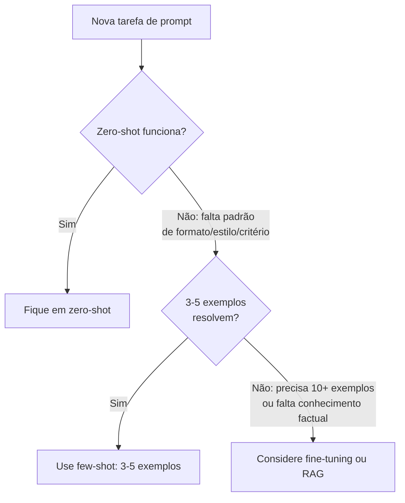

# 05 - Few-shot examples — exemplos como contrato

> [!abstract] TL;DR
> Few-shot é o ato de incluir **exemplos de input → output** no prompt antes da tarefa real. Funciona porque mostrar é semanticamente denso: o modelo extrai padrão de estilo, formato, profundidade e critério de sucesso a partir de 2-5 exemplos com muito mais precisão do que da descrição em prosa. Mas é também o lugar onde o prompt **envenena** com mais facilidade: exemplos inconsistentes entre si, exemplos que contradizem as instruções escritas, ou exemplos demais do mesmo tipo arruínam o output. Esta nota cobre por que funciona, princípios anti-poison, e um template prático.

> [!question]- O que eu preciso saber antes de ler isso?
> Você já leu [[02 - Especificidade — a primeira disciplina]] e entende que o modelo preenche lacunas com suas próprias suposições. Few-shot é a extensão direta disso: em vez de instruir com prosa o que você quer, você *mostra*. Se já sabe o que é in-context learning em termos gerais, ótimo — aqui o foco é na disciplina prática de usar exemplos sem envenenar o prompt.

## Por que exemplos batem instruções abstratas

Descrever "tom direto" é vago. Mostrar três exemplos de tom direto define **o que conta** com precisão que nenhuma instrução em prosa alcança. O modelo está treinado pra continuar padrões; few-shot dá ao modelo o padrão exato a continuar.

Três razões mais específicas:

1. **Densidade semântica.** Um exemplo curto codifica simultaneamente formato, vocabulário, profundidade, postura. Descrever esses quatro vetores em palavras leva parágrafos — e ainda fica ambíguo.
2. **In-context learning.** O modelo aprendeu, no treino, a usar exemplos no contexto pra inferir tarefa. Few-shot ativa essa habilidade diretamente. O paper *Language Models are Few-Shot Learners* (GPT-3, 2020) cunhou o termo justamente porque o efeito é desproporcional ao número de exemplos.
3. **Compressão.** Três exemplos de 100 tokens cada (300 tokens total) frequentemente sobem qualidade mais do que 500 tokens de instrução em prosa. ROI por token é altíssimo.

### Como o modelo extrai o padrão

O mecanismo interno é aproximadamente assim: o modelo lê cada exemplo como um par (contexto, continuação) e extrai o *relacionamento* que mapeia um no outro. Quando vê o input real, aplica o mesmo mapeamento. Não é memorização — é generalização por analogia estrutural.

Isso explica dois comportamentos práticos:

- **Exemplos com outputs raros ou complexos funcionam surpreendentemente bem.** O modelo não precisa ter visto aquele output no treino; ele vê o *padrão de transformação* nos exemplos e repete.
- **Exemplos contraditórios são piores que nenhum exemplo.** Se os exemplos não convergem num padrão, o modelo não generaliza — ele aproxima uma média incoerente.

## A regra prática: 3 a 5 exemplos

A literatura empírica e a prática convergem nessa faixa:

- **1 exemplo:** o modelo pode tratar como caso especial, não generalizar.
- **2-3 exemplos:** ponto de inflexão — o modelo identifica padrão sem overfit.
- **3-5 exemplos:** zona ideal pra maioria das tarefas.
- **6+ exemplos:** rendimento decrescente. Tokens caros, e variação entre exemplos vira ruído.
- **10+ exemplos:** considere fine-tuning em vez de prompt.

Exceção: tarefas de classificação com muitas classes podem precisar de exemplos por classe — aí a contagem cresce e o trade-off muda.

## Princípios anti-poison

Few-shot é o mecanismo onde o prompt envenena mais fácil. Quatro princípios pra não estragar:

### 1. Consistência entre exemplos

Todos os exemplos devem demonstrar o **mesmo** padrão. Variação inconsistente confunde o modelo: ele começa a alternar entre estilos e formatos.

```
RUIM:
Exemplo 1: bullets curtos
Exemplo 2: parágrafo único
Exemplo 3: bullets com sub-bullets

(o modelo agora não sabe se a tarefa pede bullets ou parágrafo)

BOM:
Exemplo 1: 3 bullets de uma linha
Exemplo 2: 3 bullets de uma linha
Exemplo 3: 3 bullets de uma linha

(padrão claro: 3 bullets de uma linha)
```

### 2. Exemplos não contradizendo instruções

Se o prompt diz *"sem listas numeradas"* mas dois dos três exemplos usam listas numeradas, o modelo segue os exemplos — eles são mais concretos que a instrução. **Exemplo vence prosa.** Se houver conflito, o output vai pro lado do exemplo.

Regra: depois de escrever exemplos, releia as instruções e elimine qualquer cláusula que os exemplos violem. Ou ajuste os exemplos.

### 3. Cobertura, não repetição

Os 3-5 exemplos devem cobrir **a variação esperada** dos inputs reais, não repetir o mesmo caso. Se todos os exemplos têm input curto e output curto, o modelo pode falhar com input longo.

Estratégia: pense em 2-3 *tipos* de input que vão chegar em produção. Inclua um exemplo de cada tipo.

### 4. Sem labels enviesados

Em tarefas de classificação, ordene labels aleatoriamente. Se os primeiros 3 exemplos são todos "positivo" e o quarto é "negativo", o modelo aprende uma frequência relativa que não existe na tarefa real.

## Template

Um esqueleto reutilizável:

```
Use os exemplos abaixo para aprender o padrão de estilo.
Padrão a preservar: <descrição curta do que generalizar>.
Não copie o wording dos exemplos — copie o padrão.

---
Exemplo 1
Input: <input concreto>
Output: <output desejado>
---
Exemplo 2
Input: <input concreto>
Output: <output desejado>
---
Exemplo 3
Input: <input concreto>
Output: <output desejado>
---

Agora aplique o mesmo padrão ao input real:

Input: <input real>
Output:
```

A linha *"Não copie o wording dos exemplos — copie o padrão"* é importante: sem ela, o modelo pode regurgitar frases dos exemplos no output. Com ela, o modelo é orientado a abstrair.

A linha *"Padrão a preservar"* dá ao modelo a chave de leitura — o que olhar nos exemplos. Sem ela, o modelo pode generalizar a dimensão errada (copiar comprimento quando você queria que copiasse tom).

### Variante: formato explícito

Quando o formato de output é o que importa mais (e não o estilo), os exemplos ficam mais eficazes com formatação padronizada nos delimitadores:

```
Formato de output esperado:
{
  "classificação": "...",
  "justificativa": "...",
  "confiança": "alta|média|baixa"
}

---
Exemplo 1
Input: "O produto chegou quebrado e o suporte não respondeu."
Output:
{
  "classificação": "reclamação",
  "justificativa": "menciona problema no produto e falha no suporte",
  "confiança": "alta"
}
---
Exemplo 2
Input: "Adorei a embalagem, muito criativa!"
Output:
{
  "classificação": "elogio",
  "justificativa": "sentimento positivo sobre atributo do produto",
  "confiança": "alta"
}
---

Input: {{input_real}}
Output:
```

O formato explícito tem a vantagem de forçar parsing estruturado — quando o output vai ser parseado por código, exemplos em JSON/YAML são mais confiáveis do que exemplos em prosa livre.

## Few-shot em entrevistas e design reviews

Em entrevistas de engenharia de IA, a pergunta sobre few-shot costuma aparecer de duas formas:

**Forma 1 — conceitual:** "Como você decidiria entre zero-shot, few-shot e fine-tuning?" Resposta esperada: three-way trade-off. Few-shot ganha quando a tarefa exige padrão específico não alcançado com zero-shot e o volume de dados não justifica fine-tuning. A faixa típica: 3-5 exemplos, 100-300 tokens cada.

O fluxo de decisão por trás dessa resposta, condensando os critérios já discutidos nesta nota (teste zero-shot primeiro, faixa de 3-5 exemplos, limiar de 10+ exemplos, e o limite de few-shot quando falta conhecimento factual):



**Forma 2 — prática:** "Como você debugaria um prompt few-shot que está dando outputs inconsistentes?" Checklist esperado:
1. Verificar consistência interna entre exemplos.
2. Verificar que exemplos não contradizem instruções escritas.
3. Verificar ordenação — o último exemplo não é o outlier.
4. Verificar cobertura — os exemplos cobrem a variação real do input?
5. Verificar vazamento de identificadores.

Citar o efeito de recência (ordenação importa) e o risco de one-shot (um exemplo é pior que zero) normalmente impressiona — são pontos que só aparecem na experiência prática, não em tutoriais básicos.

## Efeitos de ordenação — a ordem dos exemplos importa

O *Prompt Report* (Schulhoff et al., 2024) documenta que a **ordem dos exemplos** afeta o output de forma mensurável. Dois padrões conhecidos:

**Recência:** o modelo dá mais peso aos exemplos mais próximos do input real (os últimos). Se o último exemplo demonstra um padrão diferente dos anteriores, o output tende para esse padrão. Use isso a seu favor: o exemplo que melhor representa o caso real deve ser o último.

**Contágio de labels:** em classificação, sequências de labels iguais criam viés na próxima previsão. Três exemplos "positivo" seguidos fazem o modelo propenso a classificar o quarto como positivo, independente do input. Embaralhe as labels.

A heurística prática: coloque o exemplo mais representativo por último, embaralhe a distribuição de labels, e se houver um exemplo de caso-limite ou caso-difícil, coloque-o penúltimo (não primeiro, não último).

## Few-shot em system prompts de produto

Em produtos com uma chamada de API por interação do usuário, os exemplos geralmente ficam no system prompt — eles são fixos, custam tokens em toda chamada, e constroem o comportamento base do sistema.

Considerações específicas para esse contexto:

- **Custo por chamada.** Três exemplos de 150 tokens cada custam 450 tokens em cada chamada ao modelo. Em sistemas de alta frequência, esse custo acumula. Pese o benefício de qualidade contra o custo operacional.
- **Cache de prefixo.** Muitos provedores (Anthropic, OpenAI) oferecem cache de prompt — o prefixo do system prompt é cacheado e não é reprocessado em cada chamada. Se os exemplos ficam no início do system prompt, o custo em latência e tokens de processamento cai drasticamente.
- **Atualização sem redeployment.** Examples no system prompt podem ser atualizados sem mudar o código — só o prompt muda. Para produtos que precisam ajustar comportamento rapidamente, isso é uma vantagem sobre fine-tuning.
- **Exemplos dinâmicos via RAG.** Para inputs muito variados, exemplos fixos podem não cobrir bem. Uma alternativa é recuperar exemplos relevantes do input real e injetá-los dinamicamente — técnica que cruza few-shot com RAG. A nota sobre [[03-Dominios/Tecnologia/IA/RAG/01 - O que é RAG|RAG]] cobre esse padrão.

## Quando few-shot não é a alavanca certa

- **Quando o output precisa ser único.** Few-shot tende a homogeneizar. Para geração criativa diversa, prefira role + temperature alta.
- **Quando a tarefa muda a cada chamada.** Se cada input é radicalmente diferente, exemplos podem confundir mais do que ajudar. Use zero-shot com instrução explícita.
- **Quando o ganho não compensa o custo.** Cada exemplo entra na janela de contexto. Em chamadas de alta frequência, considere fine-tuning.
- **Quando o modelo já acerta no zero-shot.** Adicionar exemplos que o modelo não precisa cria ruído e custo desnecessário. Teste zero-shot primeiro — só adicione exemplos onde o zero-shot falha.
- **Quando o domínio exige conhecimento factual ausente do treino.** Few-shot não injeta fatos novos — só padrões. Se o modelo erra porque não sabe o conteúdo, exemplos não corrigem isso; RAG ou fine-tuning corrige.

## Few-shot vs CoT vs zero-shot — onde isso encaixa

Esta nota cobre o que faz few-shot **funcionar** em profundidade. Para a taxonomia mais larga das técnicas de prompting (zero-shot, few-shot, chain-of-thought, tree-of-thought), e quando escolher uma em vez de outra, ver [[03-Dominios/Tecnologia/IA/Context Engineering/15 - Técnicas de prompting — zero-shot, few-shot, CoT, ToT|Context Engineering — Técnicas de prompting]]. Aqui o foco é a disciplina específica: como montar exemplos que não envenenam.

Uma distinção prática: few-shot e chain-of-thought não são mutuamente exclusivos. "Few-shot CoT" é um padrão legítimo — os exemplos mostram não só o input e o output, mas também o raciocínio intermediário. Isso é especialmente útil quando o critério de sucesso depende de uma cadeia de raciocínio que o modelo pode errar sem guia. Para modelos de raciocínio (o1, R1, Gemini Thinking), o CoT é interno — few-shot pode focar só no formato do output final.

> [!tip] Regra prática de bolso
> Se você não sabe se precisa de few-shot: escreva o prompt em zero-shot, rode 5-10 vezes e olhe onde o output diverge do esperado. Se a divergência é de *formato*, few-shot resolve. Se é de *raciocínio*, CoT ou constraint resolve. Se é de *conhecimento de domínio*, não é problema de prompt — é problema de dados.

## Como escolher quais exemplos incluir

A escolha dos exemplos é onde a maioria das pessoas falha — elas incluem os mais fáceis de escrever, não os mais representativos. Um processo melhor:

1. **Mapeie a variação real do input.** Quais tipos de input vão chegar em produção? Textos curtos e longos? Em inglês e português? Com erros e sem erros? Liste as dimensões de variação.
2. **Escolha exemplos que atravessem essas dimensões.** Um por "tipo de input", não vários do tipo mais comum.
3. **Escolha outputs que mostrem a decisão difícil.** Não inclua exemplos onde o output é óbvio — inclua casos onde o modelo teria dúvida sem o exemplo.
4. **Ordene por dificuldade crescente.** Exemplo mais simples primeiro, mais complexo por último — o modelo lê em sequência.

### Testando se os exemplos funcionam

Teste de cobertura rápido: remova um exemplo de cada vez e veja se o output muda muito. Se a remoção de um exemplo não muda nada, ele não estava adicionando informação. Se a remoção de um exemplo degrada radicalmente, ele era essencial — ótimo sinal.

## Armadilhas comuns

> [!warning] Exemplo único não generaliza
> Um único exemplo (one-shot) é com frequência pior que zero exemplos. O modelo o trata como caso particular a copiar, não como padrão a generalizar. O resultado é output que parece cópia do exemplo com o input real substituído mecanicamente. Coloque pelo menos dois exemplos se vai usar few-shot.

> [!warning] Exemplos que contradizem instruções escritas
> Quando o prompt diz "sem listas" mas os exemplos usam listas, o modelo segue os exemplos. Exemplo vence prosa. Esse é um dos bugs mais silenciosos de few-shot: o prompt parece correto, os exemplos parecem corretos, mas eles se contradizem — e o comportamento resultante é imprevisível. Sempre revise a consistência entre instrução e exemplos.

> [!warning] Vazamento de identificadores nos exemplos
> Nomes, datas, IDs e valores concretos nos exemplos podem ser reaproveitados no output real. O modelo os trata como parte do padrão, não como dados descartáveis. Sanitize: substitua nomes por "User A", datas por "D-7", IDs por placeholders. Caso contrário, você arrisca o modelo incluir dados de exemplo no output de produção.

## Como explicar em inglês

Em entrevistas técnicas, few-shot prompting é um conceito que aparece tanto em perguntas sobre design de prompts quanto em perguntas sobre sistemas de IA. Uma resposta sólida:

> "Few-shot prompting means including two to five input-output examples in the prompt before the actual task. The model uses those examples to infer the transformation pattern — what format, tone, depth, and criteria the output should have. It works because the model was trained to generalize from examples in context. The key discipline is that examples must be consistent with each other and with the written instructions, and they should cover the natural variation in real inputs — not just repeat the easiest case."

| Português | Inglês |
|-----------|--------|
| exemplos no prompt | in-context examples / few-shot examples |
| aprendizado em contexto | in-context learning |
| zero exemplos | zero-shot |
| exemplo único | one-shot |
| envenenamento do prompt | prompt poisoning / prompt contamination |
| rótulos enviésados | biased labels |
| padrão a generalizar | pattern to generalize |
| template de output | output template |
| cobertura de variação | variation coverage |
| sanitizar identificadores | sanitize identifiers / strip PII from examples |

## O que vem a seguir

Few-shot resolve o *como mostrar o padrão*. A próxima nota resolve o *como dizer o que o modelo não pode fazer* — as constraints declarativas que estabelecem os limites do comportamento aceitável.

Em sistemas de produção, exemplos e constraints trabalham juntos: os exemplos definem o padrão positivo (o que bom parece), as constraints definem o perímetro negativo (o que nunca deve aparecer). A tensão entre os dois — e como resolvê-la quando um exemplo parece cruzar uma constraint — é o tema de [[06 - Constraints declarativas — boundaries como engenharia]].

## Fontes

- **@hooeem** — *Become an AI Engineer*, cap #4. Origem da framing "exemplos como contrato" e princípios anti-poison.
- **Brown et al.** — *Language Models are Few-Shot Learners* ([arxiv:2005.14165](https://arxiv.org/abs/2005.14165), 2020). Paper que cunhou o termo e demonstrou efeito desproporcional de poucos exemplos em modelos de linguagem de grande escala.
- **Schulhoff et al.** — *The Prompt Report* ([arxiv:2406.06608](https://arxiv.org/abs/2406.06608)), seção sobre few-shot e ordering effects — efeito de recência e sensibilidade à ordenação de labels.
- **Anthropic** — *Use examples (multishot prompting)* (docs.anthropic.com). Guia oficial com boas práticas e exemplos práticos para o Claude.
- **Min et al.** — *Rethinking the Role of Demonstrations: What Makes In-Context Learning Work?* ([arxiv:2202.12837](https://arxiv.org/abs/2202.12837), 2022). Investiga o que de fato os exemplos ensinam — padrão de transformação, não conteúdo factual.

## Checklist antes de publicar um prompt few-shot

Use esse checklist antes de colocar um prompt few-shot em produção ou passar para a próxima iteração. Cada item mapeia uma armadilha documentada nesta nota.

- [ ] Exemplos são internamente consistentes entre si?
- [ ] Exemplos não contradizem nenhuma instrução escrita no prompt?
- [ ] Exemplos cobrem a variação real dos inputs (não só o caso mais fácil)?
- [ ] Labels em classificação estão embaralhados (sem sequências longas do mesmo label)?
- [ ] Identificadores concretos (nomes, datas, IDs) foram sanitizados?
- [ ] O exemplo mais representativo está por último?
- [ ] Há pelo menos 2 exemplos (se vai usar few-shot)?
- [ ] O ROI por token justifica os exemplos (ou zero-shot já funciona)?

## Veja também

- [[03-Dominios/Tecnologia/IA/Context Engineering/15 - Técnicas de prompting — zero-shot, few-shot, CoT, ToT|Técnicas de prompting — taxonomia]] — onde few-shot mora dentro do catálogo maior
- [[02 - Especificidade — a primeira disciplina]] — exemplos só funcionam se a tarefa-base já é específica
- [[03 - Roles e personas — escolhendo o juízo do modelo]] — role estabelece juízo; exemplos estabelecem padrão
- [[06 - Constraints declarativas — boundaries como engenharia]] — quando exemplos contradizem constraints, constraints perdem
- [[03-Dominios/Tecnologia/IA/RAG/01 - O que é RAG|RAG — recuperação de contexto]] — few-shot dinâmico via exemplos recuperados por similaridade

