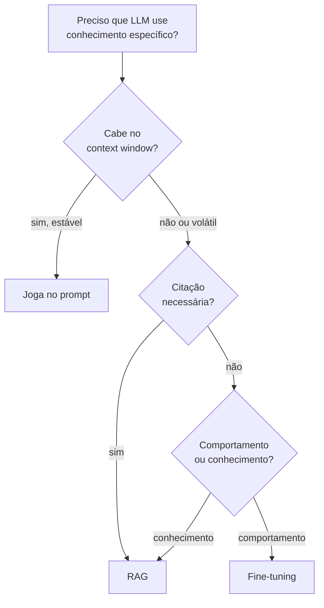
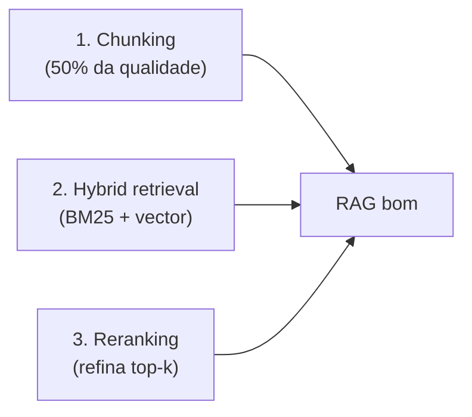

# O que é RAG e quando usar

> [!abstract] TL;DR
> **[[Dicionário de IA#RAG (Retrieval-Augmented Generation)|RAG (Retrieval-Augmented Generation)]]** combina dois passos: **[[Dicionário de IA#retrieval|retrieval]]** (busca trechos relevantes em uma base de conhecimento) + **generation** ([[Dicionário de IA#LLM (Large Language Model)|LLM]] gera resposta usando esses trechos como contexto). O resultado: LLM que "parece" conhecer seus dados em runtime, sem treinar nada. Barato, flexível, com **capacidade chave: citar fontes**. Em 2026, quase toda aplicação séria com LLM tem RAG no meio do caminho — porque LLMs conhecem muita coisa, mas não conhecem **seus dados** (docs internas, políticas, base de clientes, histórico do paciente).

## A definição operacional

```text
[User pergunta] → [Retrieval] → [trechos relevantes] ┐
                                                     ▼
                                [LLM com contexto] → [Resposta com citações]
```

Dois componentes:

1. **Retrieval:** dado uma pergunta, busca os trechos mais relevantes em uma base de conhecimento
2. **Generation:** passa esses trechos como contexto ao LLM, que gera resposta baseada neles

## Por que RAG existe

LLMs têm **knowledge cutoff** e **não conhecem seus dados**. Soluções:

| Abordagem | Custo | Frescor | Citação |
|---|---|---|---|
| **[[Dicionário de IA#fine-tuning\|Fine-tuning]]** | Alto (treino) | Stale (precisa retreinar) | ❌ |
| **Long context** | Alto (tokens) | Limitado pela janela | ⚠️ Frágil |
| **RAG** | Baixo | Atualizar = re-indexar | ✅ Direto |

RAG ganha em **flexibilidade + custo + auditabilidade**. Não substitui fine-tuning para mudar comportamento, mas substitui para **adicionar conhecimento**.

> [!question]- Por que RAG não substitui fine-tuning?
> Fine-tuning altera os **pesos** do modelo — muda como ele raciocina, seu estilo, seu vocabulário, seus comportamentos default. RAG só injeta contexto no prompt — não muda o modelo em si. Se você quer que o LLM fale como seu time de suporte, use fine-tuning. Se quer que ele conheça os tickets de suporte do mês passado, use RAG. A confusão mais comum é achar que RAG substitui fine-tuning para treinar "personalidade" ou "tom" — não substitui. RAG injeta fatos; fine-tuning reescreve instintos.

## Quando usar RAG

✅ **Use quando:**

- Base de conhecimento >context window (>200K tokens)
- Conhecimento muda com frequência (docs, FAQs, dados ao vivo)
- Citação de fonte é requisito
- Multi-tenant (cada usuário tem dados diferentes)
- Compliance exige auditoria de fontes

## Quando NÃO usar

❌ **Não use quando:**

- Dataset cabe inteiro no prompt (joga tudo no contexto)
- Tarefa é gramatical/estrutural (não factual)
- Domínio é estável e cabe em fine-tuning
- Latência crítica <500ms (RAG adiciona 2 round-trips)

## Decision tree rápido



## A capacidade-chave: citar fontes

> [!tip] Por que isso muda tudo
> Sem RAG, LLM responde com confiança alta sobre fatos que pode estar inventando.
>
> Com RAG, LLM cita o trecho específico que usou — usuário pode verificar.
>
> Em domínios regulados (medicina, legal, finance), citação não é nice-to-have — **é compliance**.

## RAG vs context-stuffing

Anti-pattern: *"vou jogar 500K tokens e deixar o modelo virar"*. Não. Quase sempre pior que RAG bem feito com 4K tokens relevantes:

- Atenção dilui ([[Context Engineering|03 - Context rot e atenção diluída]])
- Custo explode
- Latência sobe

RAG-filtered 8K tokens **vence** raw dump de 500K em quase todo benchmark, exceto refactoring codebase-wide.

## Os 3 pilares de qualidade



**RAG não é sobre vector DB** — é sobre **retrieval quality**. Vector DB virou commodity. Onde a qualidade vive: [[Dicionário de IA#chunking|chunking]], [[Dicionário de IA#hybrid search|hybrid search]], [[Dicionário de IA#reranking|reranking]].

## O que diferencia um senior em RAG

> [!tip]
> 1. Sabe que **RAG não é sobre vector DB** — é sobre retrieval quality
> 2. Nunca usa pure vector search em produção — hybrid ([[Dicionário de IA#BM25|BM25]] + vector) com reranker é o padrão
> 3. Trata chunking com seriedade — chunks ruins = RAG ruim
> 4. Mede **retrieval quality separado de generation quality**
> 5. Conhece armadilhas: tabela de conteúdos em vez de conteúdo, chunks sem metadata
> 6. Implementa **query rewriting** — pergunta do usuário raramente é a melhor query
> 7. Tem evaluation: faithfulness, relevance, context precision/recall
> 8. Sabe quando RAG ≠ resposta — devolve "não sei" ou "contexto não cobre isso"
> 9. Faz tiering: contexto pequeno e estável → joga no prompt; RAG só quando necessário
> 10. Não confunde RAG com fine-tuning — sabe escolher cada um

## Armadilhas comuns

> [!warning] Confundir RAG com "jogar docs no contexto"
> Context-stuffing (passar 200K tokens brutos no prompt) não é RAG — é anti-pattern disfarçado. Atenção do LLM dilui em janelas grandes, custo explode, e o modelo frequentemente ignora partes do contexto em contextos longos. RAG bem feito seleciona os 5-10 trechos mais relevantes; "jogar tudo" é a versão preguiçosa que funciona mal em produção.

> [!warning] Achar que trocar o LLM resolve retrieval ruim
> Quando a resposta do RAG é ruim, o instinto é trocar GPT-4 por Claude ou vice-versa. Quase nunca é o LLM — é o retrieval. Se os chunks certos não chegam no contexto, o melhor LLM do mundo vai alucinar ou responder "não sei". Antes de escalar LLM, meça retrieval precision: quantos dos top-5 chunks são realmente relevantes?

> [!warning] Usar RAG quando o dataset cabe no contexto
> Se sua base tem 50 documentos de 2 páginas cada, jogue tudo no prompt. RAG adiciona latência (2 round-trips), complexidade de infra (vector DB, pipeline de indexing) e pontos de falha. Use RAG quando necessário — não como default reflexivo para qualquer coisa com "documentos".

## Como explicar em inglês

RAG, or Retrieval-Augmented Generation, is an architectural pattern that solves the fundamental problem of LLMs not knowing your private data. Instead of baking information into model weights through fine-tuning, RAG retrieves relevant pieces of your knowledge base at query time and injects them as context. The model then generates a response grounded in those retrieved snippets.

The key insight is the separation of concerns: your knowledge base is a living, updatable index — you re-index documents when they change, without touching the model. This makes RAG dramatically cheaper and more flexible than fine-tuning for knowledge-intensive use cases. It also enables something fine-tuning can't: citing the exact source passages that informed each answer.

In production, RAG is almost never just "embed and search." Real systems add query rewriting (the user's phrasing is rarely the best search query), hybrid retrieval (BM25 for exact keyword matches plus vector search for semantic similarity), and a reranker to refine the top candidates before passing them to the LLM.

**In a technical interview**, you might say:

> "RAG separates knowledge from reasoning. The LLM reasons; the retriever knows. When a user asks a question, we run it through an embedding model, do a similarity search over our indexed knowledge base — typically hybrid BM25 plus vector — run the top results through a reranker, then pass the cleaned-up context to the LLM with an instruction to cite sources. The key metric I track isn't generation quality first — it's retrieval precision. If the right chunks aren't making it into context, no LLM will save you."

| PT | EN |
|----|-----|
| Geração aumentada por recuperação | Retrieval-Augmented Generation (RAG) |
| Recuperação / busca | Retrieval |
| Base de conhecimento | Knowledge base |
| Janela de contexto | Context window |
| Ajuste fino | Fine-tuning |
| Indexação | Indexing |
| Corte de conhecimento | Knowledge cutoff |
| Citação de fonte | Source citation |
| Busca híbrida | Hybrid retrieval |
| Auditabilidade | Auditability |

## O que vem a seguir

Saber *quando* usar RAG é só metade da batalha — a outra metade é entender *como* ele funciona por dentro. O pipeline RAG tem duas fases bem distintas (indexing e query), cada uma com seus próprios pontos de falha. Quando uma resposta vem errada, você precisa saber exatamente em qual passo do pipeline o problema se originou: foi o parse do documento? O tamanho do chunk? O modelo de embedding? A fase de retrieval? O prompt de geração?

Sem entender a anatomia do pipeline, você fica no escuro — ajustando parâmetros aleatoriamente e torcendo para melhorar. A próxima nota desmonta cada passo para que você saiba exatamente onde olhar quando as coisas derem errado.

- [[02 - Anatomia do pipeline RAG]] — os 9 passos do pipeline (indexing + query), onde cada problema vive, latência e custo típicos

## Veja também

- [[02 - Anatomia do pipeline RAG]]
- [[09 - Evaluation de RAG]]
- [[10 - RAG vs long context vs fine-tuning]]
- [[Anatomia dos LLMs|14 - Fine-tuning vs prompting vs RAG]]
- [[Context Engineering|06 - Dynamic retrieval beyond RAG]]

## Referências

- **Pinecone** — *Learn RAG* (2025+)
- **Anthropic** — *Contextual Retrieval* (2024)
- **Lewis et al.** — *Retrieval-Augmented Generation for Knowledge-Intensive NLP Tasks* (2020, paper original)
- **Eugene Yan** — *Patterns for Building LLM-based Systems* (2024)


