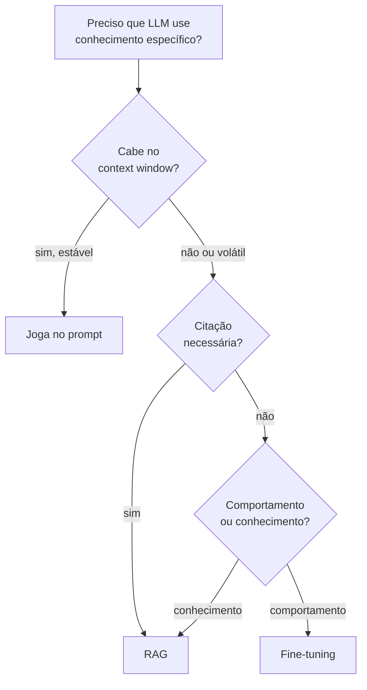
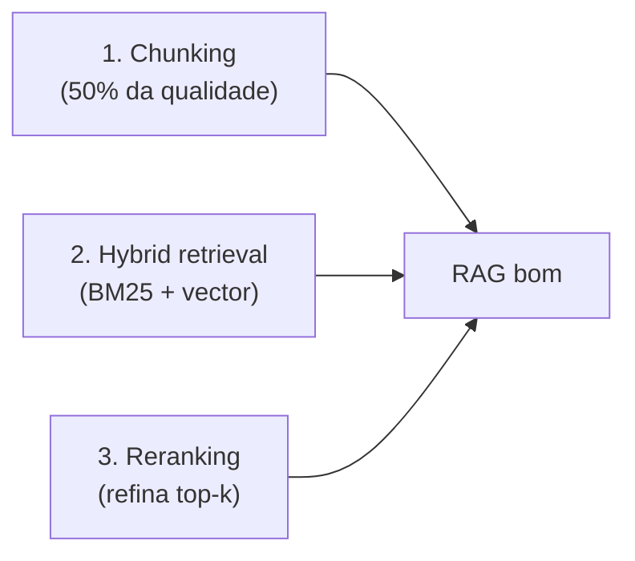

# O que é RAG e quando usar

> [!abstract] TL;DR
> **[[Dicionário de IA#RAG (Retrieval-Augmented Generation)|RAG (Retrieval-Augmented Generation)]]** combina dois passos: **[[Dicionário de IA#retrieval|retrieval]]** (busca trechos relevantes em uma base de conhecimento) + **generation** ([[Dicionário de IA#LLM (Large Language Model)|LLM]] gera resposta usando esses trechos como contexto). O resultado: LLM que "parece" conhecer seus dados em runtime, sem treinar nada. Barato, flexível, com **capacidade chave: citar fontes**. Em 2026, quase toda aplicação séria com LLM tem RAG no meio do caminho — porque LLMs conhecem muita coisa, mas não conhecem **seus dados** (docs internas, políticas, base de clientes, histórico do paciente).

Imagine um engenheiro de plantão numa segunda de manhã. Um colega pergunta no Slack: "qual é a política de reembolso pra clientes enterprise que cancelam no meio do contrato?" Ele cola a pergunta num chatbot interno construído sobre um LLM de última geração. A resposta vem fluente, confiante, bem formatada — e **errada**. O LLM não tem ideia de qual é a política da empresa; ele nunca viu esse documento. Mas como foi treinado para sempre responder algo plausível, ele **inventa** uma política que soa razoável. Ninguém percebe até um cliente citar a resposta do bot numa disputa contratual.

Esse é o problema que RAG resolve. Não é que o LLM seja "burro" — é que ele não tem acesso aos **seus dados**: as políticas internas, a base de tickets, o histórico do paciente, o catálogo de produtos atualizado ontem à tarde. O conhecimento do modelo parou de crescer no *knowledge cutoff* do treino, e mesmo dentro desse período, ele nunca leu documentos privados da sua empresa. RAG é a resposta a uma pergunta simples: **como faço o LLM responder com base em dados que ele nunca viu treinando?**

A resposta ingênua seria "treinar o modelo de novo, com os dados novos" — mas isso é caro, lento, e precisa ser repetido toda vez que um documento muda. RAG contorna esse problema por completo: em vez de ensinar o modelo, você dá a ele uma "cola" no momento da pergunta — os trechos certos, buscados na hora, injetados no prompt antes de pedir a resposta.

## A definição operacional

```text
[User pergunta] → [Retrieval] → [trechos relevantes] ┐
                                                     ▼
                                [LLM com contexto] → [Resposta com citações]
```

Dois componentes:

1. **Retrieval:** dado uma pergunta, busca os trechos mais relevantes em uma base de conhecimento
2. **Generation:** passa esses trechos como contexto ao LLM, que gera resposta baseada neles

A pergunta que costuma travar quem está aprendendo: "se o LLM já é bom em gerar texto, por que preciso de um sistema de busca separado?" Resposta curta: porque **buscar** e **raciocinar** são habilidades diferentes. Um LLM é excelente em raciocinar sobre o texto que tem na frente, mas não tem nenhum mecanismo embutido para "ir buscar" um documento que não está no prompt — ele só enxerga o que você coloca na janela de contexto. O retrieval é a peça que decide *o que* colocar ali; a geração é a peça que decide *o que fazer* com o que foi colocado. RAG nomeia essa divisão de trabalho — e a maior parte da engenharia séria em RAG vive do lado do retrieval, não do lado do LLM.

## Por que RAG existe

LLMs têm **knowledge cutoff** e **não conhecem seus dados**. Soluções:

| Abordagem | Custo | Frescor | Citação |
|---|---|---|---|
| **[[Dicionário de IA#fine-tuning\|Fine-tuning]]** | Alto (treino) | Stale (precisa retreinar) | ❌ |
| **Long context** | Alto (tokens) | Limitado pela janela | ⚠️ Frágil |
| **RAG** | Baixo | Atualizar = re-indexar | ✅ Direto |

RAG ganha em **flexibilidade + custo + auditabilidade**. Não substitui fine-tuning para mudar comportamento, mas substitui para **adicionar conhecimento**.

Pense em fine-tuning como **ensinar um funcionário novo** — leva tempo, custa caro, e uma vez que ele "aprendeu" algo errado, corrigir exige retreiná-lo do zero. RAG é mais como **dar a ele acesso a uma biblioteca atualizada** — ele não precisa decorar nada; só precisa saber consultar o livro certo na hora certa. Trocar um livro da estante (re-indexar um documento) é instantâneo e barato; reeducar o funcionário (re-treinar o modelo) não é.

> [!question]- Por que RAG não substitui fine-tuning?
> Fine-tuning altera os **pesos** do modelo — muda como ele raciocina, seu estilo, seu vocabulário, seus comportamentos default. RAG só injeta contexto no prompt — não muda o modelo em si. Se você quer que o LLM fale como seu time de suporte, use fine-tuning. Se quer que ele conheça os tickets de suporte do mês passado, use RAG. A confusão mais comum é achar que RAG substitui fine-tuning para treinar "personalidade" ou "tom" — não substitui. RAG injeta fatos; fine-tuning reescreve instintos.

## Quando usar RAG

✅ **Use quando:**

- **Base de conhecimento >context window (>200K tokens).** Se sua empresa tem 50 mil documentos, não existe janela de contexto que caiba tudo — e mesmo que coubesse, o modelo perderia atenção nos trechos do meio ([[Context Engineering|03 - Context rot e atenção diluída]]).
- **Conhecimento muda com frequência (docs, FAQs, dados ao vivo).** Uma política de reembolso que muda toda semana não pode ficar "assada" nos pesos do modelo — você re-treinaria toda semana. RAG resolve isso: você só re-indexa o documento alterado.
- **Citação de fonte é requisito.** Se o usuário (ou o regulador) precisa saber *de onde* veio a informação, RAG é praticamente a única opção — fine-tuning não deixa rastro de fonte.
- **Multi-tenant (cada usuário tem dados diferentes).** Um SaaS B2B em que o cliente A não pode ver dados do cliente B não pode fazer fine-tuning por cliente (custo inviável); RAG filtra por metadata na hora do retrieval.
- **Compliance exige auditoria de fontes.** Em setores regulados, "o modelo disse" não é resposta suficiente numa auditoria — "o modelo citou o parágrafo 4.2 da política X, versão de terça-feira" é.

## Quando NÃO usar

❌ **Não use quando:**

- **Dataset cabe inteiro no prompt.** Se sua base tem 50 documentos curtos, jogue tudo no contexto. Adicionar um pipeline de retrieval pra economizar 2K tokens é complexidade sem benefício.
- **Tarefa é gramatical/estrutural, não factual.** Corrigir a gramática de um texto ou reformatar um JSON não depende de "conhecimento externo" — é raciocínio sobre o próprio input. RAG não ajuda aqui.
- **Domínio é estável e cabe em fine-tuning.** Se você quer que o modelo sempre responda num tom específico, ou sempre siga um formato rígido, isso é comportamento — fine-tuning resolve melhor e mais barato a longo prazo do que injetar exemplos no prompt toda vez.
- **Latência crítica <500ms.** RAG adiciona pelo menos 2 round-trips (embedding da query + busca no índice) antes mesmo de chamar o LLM. Para um autocomplete que precisa responder em 100ms, esse overhead é proibitivo.

## Um exemplo concreto: RAG em ação

Voltando ao engenheiro de plantão: como ficaria o mesmo fluxo *com* RAG?

1. A pergunta "qual é a política de reembolso para clientes enterprise que cancelam no meio do contrato?" chega ao sistema.
2. Um **modelo de embedding** transforma a pergunta em um vetor numérico — uma representação matemática do "significado" da pergunta.
3. Esse vetor é usado para buscar, no índice vetorial da empresa, os trechos de documentos mais próximos semanticamente — na prática, os parágrafos do manual de políticas que falam sobre cancelamento, reembolso e contratos enterprise.
4. Um **reranker** reordena esses candidatos, promovendo os trechos mais relevantes para o topo (a busca vetorial sozinha erra a ordem com frequência).
5. Os 3-5 trechos mais relevantes são injetados no prompt do LLM, junto com uma instrução: *"responda apenas com base nos trechos abaixo; cite a fonte."*
6. O LLM gera: *"Segundo a Política de Reembolso Enterprise (seção 4.2, atualizada em 2026-03-10), clientes enterprise que cancelam no meio do contrato têm direito a reembolso proporcional dos meses não utilizados, descontada uma taxa de rescisão de 5%."*

A diferença crucial: a resposta agora é **verificável**. O colega pode abrir a seção 4.2 e conferir. Se a política mudar amanhã, basta re-indexar o documento atualizado — o modelo em si nunca precisa ser re-treinado. É exatamente esse ciclo (pergunta → retrieval → contexto → resposta citável) que a próxima nota da trilha desmonta passo a passo.

> [!question]- E se o retrieval não encontrar nada relevante?
> Esse é o outro lado da moeda que separa um sistema bem projetado de um que finge estar bem projetado. Se a busca não retorna nenhum chunk com confiança suficiente, o comportamento correto do LLM é responder **"não sei" ou "meus documentos não cobrem essa pergunta"** — nunca inventar uma resposta plausível só porque foi instruído a "ser útil". Isso exige duas coisas na engenharia: (1) um limiar de confiança no retrieval que decide quando *não* passar contexto nenhum, e (2) uma instrução explícita no prompt de geração dizendo ao modelo para admitir a lacuna em vez de preencher com conhecimento próprio. É o item 8 da lista de senioridade, acima: saber quando RAG não tem resposta é tão importante quanto saber quando ele tem.

## Decision tree rápido



Vale seguir esse fluxograma mentalmente antes de qualquer decisão de arquitetura. A primeira bifurcação já elimina metade dos casos: se o conhecimento é pequeno e estável, a resposta mais simples (jogar tudo no prompt) já resolve — não existe motivo pra montar um pipeline de retrieval pra economizar tokens que nem estão sobrando. É só quando o conhecimento não cabe ou muda com frequência que a segunda pergunta entra em jogo: citação importa? Se sim, RAG. Se não, aí sim vale perguntar se o que você quer é mudar *conhecimento* (RAG) ou *comportamento* (fine-tuning) — a confusão mais comum do campo, como já visto no callout sobre por que RAG não substitui fine-tuning.

## A capacidade-chave: citar fontes

> [!tip] Por que isso muda tudo
> Sem RAG, LLM responde com confiança alta sobre fatos que pode estar inventando.
>
> Com RAG, LLM cita o trecho específico que usou — usuário pode verificar.
>
> Em domínios regulados (medicina, legal, finance), citação não é nice-to-have — **é compliance**.

Na prática, essa citação normalmente aparece como uma referência inline na resposta — algo como *"(Fonte: Manual do Funcionário, seção 3.2, atualizado em 2026-01-15)"* — ou como um trecho destacado que o usuário pode expandir para ver o texto original completo. O detalhe que faz a diferença entre um MVP e um sistema de produção: a citação precisa apontar para o **chunk exato** usado, não só "o documento" em geral — senão o usuário ainda tem que caçar a frase certa dentro de um PDF de 80 páginas, e a promessa de auditabilidade vira meio-caminho andado.

## RAG vs context-stuffing

Anti-pattern: *"vou jogar 500K tokens e deixar o modelo virar"*. Não. Quase sempre pior que RAG bem feito com 4K tokens relevantes:

- Atenção dilui ([[Context Engineering|03 - Context rot e atenção diluída]])
- Custo explode
- Latência sobe

RAG-filtered 8K tokens **vence** raw dump de 500K em quase todo benchmark, exceto refactoring codebase-wide.

Por que a exceção existe? Refactoring codebase-wide é um dos poucos casos em que **relação entre as partes** importa mais do que **relevância pontual** — mudar uma assinatura de função exige entender todo caller, mesmo os que nenhum retrieval por similaridade semântica marcaria como "relevante" à primeira vista. Fora desse tipo de tarefa estruturalmente interligada, jogar tudo no contexto raramente compensa: o modelo perde precisão à medida que a janela cresce, mesmo quando a resposta certa está tecnicamente "lá dentro" — um efeito bem documentado e batizado de *lost in the middle* (a informação em posições intermediárias da janela recebe menos atenção que a do início ou do fim).

## Os 3 pilares de qualidade



**RAG não é sobre vector DB** — é sobre **retrieval quality**. Vector DB virou commodity. Onde a qualidade vive: [[Dicionário de IA#chunking|chunking]], [[Dicionário de IA#hybrid search|hybrid search]], [[Dicionário de IA#reranking|reranking]].

Vale desmontar por que cada pilar pesa tanto:

- **Chunking (o maior peso).** Se você corta um documento em pedaços do tamanho errado — muito grandes, e o trecho relevante vem diluído com informação irrelevante; muito pequenos, e ele perde o contexto que dava sentido à frase — o retrieval nunca vai encontrar o que precisa, não importa quão bom seja o modelo de embedding. É como cortar uma receita de bolo no meio de um passo: o pedaço isolado não ajuda ninguém.
- **Hybrid retrieval.** Busca vetorial pura é ótima em capturar *significado*, mas péssima em nomes próprios, códigos de erro e termos exatos (um vetor não distingue bem "erro 404" de "erro 402"). BM25 (busca por palavra-chave, herdada da era pré-embedding) resolve exatamente esse ponto cego. Produção séria combina os dois.
- **Reranking.** A busca inicial (vetorial ou híbrida) traz um conjunto amplo de candidatos rápido, mas com precisão mediana. Um reranker é um segundo modelo, mais lento e mais preciso, que reordena só o top-N — o equivalente a triar rapidamente 50 currículos e depois ler com atenção só os 5 finalistas.

Os três pilares não competem entre si — eles resolvem gargalos em estágios diferentes do pipeline: chunking decide *o que existe* para ser encontrado; hybrid retrieval decide *o que é trazido* na primeira passada; reranking decide *o que sobe* para o topo antes de chegar ao LLM. Um sistema fraco em qualquer um dos três derruba a qualidade do todo, mesmo que os outros dois estejam impecáveis.

## O que diferencia um senior em RAG

> [!tip]
> 1. Sabe que **RAG não é sobre vector DB** — é sobre retrieval quality
> 2. Nunca usa pure vector search em produção — hybrid ([[Dicionário de IA#BM25|BM25]] + vector) com reranker é o padrão
> 3. Trata chunking com seriedade — chunks ruins = RAG ruim
> 4. Mede **retrieval quality separado de generation quality**
> 5. Conhece armadilhas: tabela de conteúdos em vez de conteúdo, chunks sem metadata
> 6. Implementa **query rewriting** — pergunta do usuário raramente é a melhor query
> 7. Tem evaluation: faithfulness, relevance, context precision/recall
> 8. Sabe quando RAG ≠ resposta — devolve "não sei" ou "contexto não cobre isso"
> 9. Faz tiering: contexto pequeno e estável → joga no prompt; RAG só quando necessário
> 10. Não confunde RAG com fine-tuning — sabe escolher cada um

O que separa quem "usou RAG uma vez num tutorial" de quem "opera RAG em produção" é justamente saber decompor esses dez pontos quando algo dá errado. Dois exemplos práticos:

- **Item 4 (medir retrieval separado de generation)** é o diagnóstico mais comum que falta. Times juniores olham a resposta final, acham ela ruim, e mexem no prompt de geração. Um time sênior primeiro pergunta: "os chunks certos chegaram no contexto?" — se a resposta é não, mexer no prompt de geração é remendo, não conserto. É o mesmo raciocínio do warning "achar que trocar o LLM resolve retrieval ruim", abaixo.
- **Item 6 (query rewriting)** existe porque a pergunta que o usuário digita raramente é a melhor busca. "Aquele bug que travou o deploy semana passada" é uma frase natural, mas péssima query — um passo intermediário reescreve isso para algo como "erro de deploy timeout CI/CD outubro 2026" antes de buscar.

## Armadilhas comuns

> [!warning] Confundir RAG com "jogar docs no contexto"
> Context-stuffing (passar 200K tokens brutos no prompt) não é RAG — é anti-pattern disfarçado. Atenção do LLM dilui em janelas grandes, custo explode, e o modelo frequentemente ignora partes do contexto em contextos longos. RAG bem feito seleciona os 5-10 trechos mais relevantes; "jogar tudo" é a versão preguiçosa que funciona mal em produção.

> [!warning] Achar que trocar o LLM resolve retrieval ruim
> Quando a resposta do RAG é ruim, o instinto é trocar GPT-4 por Claude ou vice-versa. Quase nunca é o LLM — é o retrieval. Se os chunks certos não chegam no contexto, o melhor LLM do mundo vai alucinar ou responder "não sei". Antes de escalar LLM, meça retrieval precision: quantos dos top-5 chunks são realmente relevantes?

> [!warning] Usar RAG quando o dataset cabe no contexto
> Se sua base tem 50 documentos de 2 páginas cada, jogue tudo no prompt. RAG adiciona latência (2 round-trips), complexidade de infra (vector DB, pipeline de indexing) e pontos de falha. Use RAG quando necessário — não como default reflexivo para qualquer coisa com "documentos".

> [!warning] Ignorar chunks sem metadata
> Um chunk que chega ao LLM sem saber de qual documento veio, de quando, ou de qual seção, é um chunk que o modelo não consegue citar corretamente — e um chunk que o sistema não consegue filtrar por permissão de acesso (essencial no cenário multi-tenant). Guardar metadata (fonte, data, seção, tenant) junto com cada chunk não é opcional em produção; é o que torna a citação de fontes e o controle de acesso possíveis.

> [!warning] Não orçar a latência de cada etapa
> RAG não é uma chamada só — é embedding da query, busca no índice, reranking e só então a geração. Cada etapa soma milissegundos, e times que não medem cada uma separadamente descobrem tarde demais que o reranker sozinho consome metade do orçamento de latência da requisição. Meça cada etapa isoladamente antes de prometer um SLA de resposta.

## Métricas para avaliar RAG

Como "o modelo respondeu bem" não é uma métrica que se meça sozinha, avaliação séria de RAG separa **duas etapas** — retrieval e generation — e mede cada uma com métricas próprias:

**Do lado do retrieval:**

- **Context precision:** dos trechos que o sistema recuperou, quantos são de fato relevantes para a pergunta? Se você busca 10 chunks e só 3 são úteis, sua precisão é 30% — o resto é ruído que dilui a atenção do LLM.
- **Context recall:** dos trechos relevantes que *existiam* na base, quantos o sistema conseguiu recuperar? Um recall baixo significa que a resposta certa está lá, mas o retrieval não a encontrou — o problema não é o LLM, é a busca.

**Do lado da generation:**

- **Faithfulness (fidelidade):** a resposta do LLM usa *apenas* informação que estava nos trechos recuperados, ou o modelo "complementou" com conhecimento próprio (possivelmente inventado)? Uma resposta pode soar ótima e ainda assim ser infiel ao contexto fornecido.
- **Answer relevance:** a resposta de fato responde à pergunta feita, ou é tecnicamente correta mas tangencial?

A razão de separar essas quatro métricas: cada uma aponta para um ponto de falha diferente no pipeline. Se a faithfulness é baixa mas o context precision é alto, o problema está no prompt de geração — os chunks certos chegaram, mas o modelo não os usou direito. Se o context recall é baixo, trocar o LLM não vai adiantar nada — é o índice ou o chunking que precisam de ajuste. Esse diagnóstico separado é exatamente o que o item 4 da lista de senioridade, acima, está cobrando.

Um exemplo numérico ajuda a fixar a intuição: imagine que sua base tem 4 documentos relevantes para uma pergunta, o sistema recupera 10 chunks no total, e 2 deles são de fato os relevantes. Context precision é 2/10 (20%) — a maior parte do que foi recuperado é ruído. Context recall é 2/4 (50%) — metade do que existia de relevante ficou de fora. Um sistema assim tem duas dores diferentes ao mesmo tempo: precisa filtrar melhor (menos ruído) *e* buscar mais fundo (menos lacuna) — e cada uma dessas dores pede um ajuste diferente no pipeline, não no LLM.

## Como explicar em inglês

RAG, or Retrieval-Augmented Generation, is an architectural pattern that solves the fundamental problem of LLMs not knowing your private data. Instead of baking information into model weights through fine-tuning, RAG retrieves relevant pieces of your knowledge base at query time and injects them as context. The model then generates a response grounded in those retrieved snippets.

The key insight is the separation of concerns: your knowledge base is a living, updatable index — you re-index documents when they change, without touching the model. This makes RAG dramatically cheaper and more flexible than fine-tuning for knowledge-intensive use cases. It also enables something fine-tuning can't: citing the exact source passages that informed each answer.

In production, RAG is almost never just "embed and search." Real systems add query rewriting (the user's phrasing is rarely the best search query), hybrid retrieval (BM25 for exact keyword matches plus vector search for semantic similarity), and a reranker to refine the top candidates before passing them to the LLM.

**In a technical interview**, you might say:

> "RAG separates knowledge from reasoning. The LLM reasons; the retriever knows. When a user asks a question, we run it through an embedding model, do a similarity search over our indexed knowledge base — typically hybrid BM25 plus vector — run the top results through a reranker, then pass the cleaned-up context to the LLM with an instruction to cite sources. The key metric I track isn't generation quality first — it's retrieval precision. If the right chunks aren't making it into context, no LLM will save you."

A common follow-up in interviews is: *"How would you debug a RAG system that's giving wrong answers?"* The senior answer isolates the two stages before touching anything: *"First, I'd check retrieval — are the right chunks even showing up in the top-k? I'd measure context precision and recall against a small labeled set of question-answer pairs. If the right chunks aren't there, the fix is in chunking, embeddings, or the index — not the LLM. If the right chunks are there but the answer still hallucinates, that's a faithfulness problem — the model is ignoring or misusing the provided context, and that's where I'd look at the prompt itself."* This two-step framing — retrieval quality first, generation quality second — is what separates a candidate who has read about RAG from one who has operated it in production.

| PT | EN |
|----|-----|
| Geração aumentada por recuperação | Retrieval-Augmented Generation (RAG) |
| Recuperação / busca | Retrieval |
| Base de conhecimento | Knowledge base |
| Janela de contexto | Context window |
| Ajuste fino | Fine-tuning |
| Indexação | Indexing |
| Corte de conhecimento | Knowledge cutoff |
| Citação de fonte | Source citation |
| Busca híbrida | Hybrid retrieval |
| Auditabilidade | Auditability |
| Fatiamento em trechos | Chunking |
| Reordenação (refinar top-k) | Reranking |
| Reescrita de consulta | Query rewriting |
| Precisão de contexto | Context precision |
| Cobertura de contexto | Context recall |
| Fidelidade (ao contexto fornecido) | Faithfulness |

## RAG ingênuo vs RAG de produção

A distância entre um tutorial de fim de semana e um sistema que aguenta produção é grande — e vale nomear onde ela mora:

| Aspecto | RAG ingênuo (tutorial) | RAG de produção |
|---|---|---|
| Busca | Só vetorial (embedding similarity) | Híbrida: BM25 + vetorial |
| Chunking | Tamanho fixo, corte arbitrário | Respeita estrutura do documento (seções, parágrafos) |
| Reranking | Nenhum — usa o top-k bruto da busca | Reranker dedicado reordena antes de gerar |
| Query | Pergunta do usuário, sem alteração | Query rewriting antes da busca |
| Metadata | Chunk é só texto puro | Chunk carrega fonte, data, seção, permissões |
| Fallback | Sempre gera uma resposta | Reconhece quando não há contexto suficiente e recusa responder |
| Avaliação | "Parece que funciona" | Métricas de faithfulness, relevance, precision, recall |

Nenhuma dessas colunas da direita é opcional para um sistema que vai ao ar com usuários reais — são exatamente os pontos que aparecem espalhados pelas seções anteriores desta nota (os 3 pilares, a lista de senioridade, as armadilhas). O RAG ingênuo funciona bem o suficiente numa demonstração de 5 minutos; é nos casos de borda — a pergunta ambígua, o documento mal formatado, o termo técnico exato — que a diferença aparece.

Um jeito prático de usar essa tabela: da próxima vez que avaliar um sistema RAG (o seu ou de terceiros), percorra as sete linhas como um checklist. Cada "não" na coluna da direita é um ponto concreto de risco antes de ir para produção — não uma questão de gosto ou polimento.

## RAG não é grátis: o custo escondido

Todo esse ganho de flexibilidade tem um preço que engenheiros júnior costumam subestimar. "Baixo custo" na tabela acima é relativo a fine-tuning e long context — não é zero:

- **Pipeline de indexing:** alguém precisa parsear documentos (PDFs mal formatados são um pesadelo à parte), fatiar em chunks, gerar embeddings e manter tudo sincronizado quando o documento-fonte muda.
- **Vector DB (ou índice híbrido):** mais um componente de infra pra operar, monitorar e escalar — com seus próprios custos de armazenamento e latência de query.
- **Reranker:** um segundo modelo rodando a cada query, adicionando tempo de resposta e custo de inferência.
- **Evaluation contínua:** sem medir faithfulness/relevance/precision/recall regularmente, você não sabe se uma mudança no chunking piorou ou melhorou o sistema — e essa medição não é automática, alguém precisa construir e manter o dataset de avaliação.

Nenhum desses custos invalida RAG — eles só explicam por que a linha "Quando NÃO usar" da tabela lá em cima não é enfeite. Se o dataset cabe no prompt, todo esse pipeline é complexidade paga sem necessidade.

A pergunta prática para decidir, no fim das contas, não é "RAG é bom ou ruim" — é "o problema que tenho justifica o custo de operar esse pipeline inteiro, ou existe uma solução mais simples que resolve igualmente bem?" Sênior de verdade começa por essa pergunta, não pelo hype da tecnologia.

E é justamente aqui que mora o maior erro de quem está começando: tratar RAG como padrão-ouro universal, aplicável a qualquer problema com "documentos" envolvidos, em vez de uma ferramenta entre várias — cada uma com seu custo, sua latência e seu caso de uso certo.

## O que vem a seguir

Saber *quando* usar RAG é só metade da batalha — a outra metade é entender *como* ele funciona por dentro. O pipeline RAG tem duas fases bem distintas (indexing e query), cada uma com seus próprios pontos de falha. Quando uma resposta vem errada, você precisa saber exatamente em qual passo do pipeline o problema se originou: foi o parse do documento? O tamanho do chunk? O modelo de embedding? A fase de retrieval? O prompt de geração?

Sem entender a anatomia do pipeline, você fica no escuro — ajustando parâmetros aleatoriamente e torcendo para melhorar. A próxima nota desmonta cada passo para que você saiba exatamente onde olhar quando as coisas derem errado.

Pense nela como o mapa detalhado da fábrica: esta nota mostrou *por que* a fábrica existe e *quando* vale a pena construí-la; a próxima mostra cada esteira, cada máquina e cada ponto onde uma peça pode sair torta.

Guarde essa distinção — ela vai reaparecer o tempo todo ao longo da trilha.

- [[02 - Anatomia do pipeline RAG]] — os 9 passos do pipeline (indexing + query), onde cada problema vive, latência e custo típicos

## Veja também

- [[02 - Anatomia do pipeline RAG]]
- [[09 - Evaluation de RAG]]
- [[10 - RAG vs long context vs fine-tuning]]
- [[Anatomia dos LLMs|14 - Fine-tuning vs prompting vs RAG]]
- [[Context Engineering|06 - Dynamic retrieval beyond RAG]]

## Referências

- **Pinecone** — *Learn RAG* (2025+) — https://www.pinecone.io/learn/retrieval-augmented-generation/
- **Anthropic** — *Introducing Contextual Retrieval* (2024) — https://www.anthropic.com/news/contextual-retrieval
- **Lewis et al.** — *Retrieval-Augmented Generation for Knowledge-Intensive NLP Tasks* (2020, paper original) — https://arxiv.org/abs/2005.11401
- **Eugene Yan** — *Patterns for Building LLM-based Systems & Products* (2024) — https://eugeneyan.com/writing/llm-patterns/
