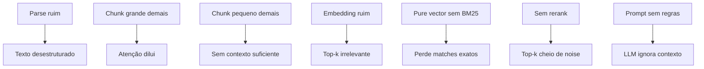

# Anatomia do pipeline RAG

> [!abstract] TL;DR
> Pipeline [[Dicionário de IA#RAG (Retrieval-Augmented Generation)|RAG]] tem **duas fases**: indexing (offline, uma vez por documento) e query (online, cada pergunta). Indexing: parse → chunk → embed → store. Query: rewrite → embed → retrieve → rerank → generate. Cada passo é uma oportunidade de melhorar OU destruir qualidade. Saber onde cada peça encaixa é pré-requisito para debugar quando a resposta vier ruim.

> [!question]- Por que a qualidade do retrieval importa mais que o modelo?
> O LLM só pode usar o que chega no contexto. Se o retrieval trouxer os chunks errados — ou nenhum chunk relevante — o modelo mais poderoso do mundo vai alucinar ou dizer "não sei". Por outro lado, com retrieval excelente e contexto correto, até um modelo mais simples gera respostas precisas. O gargalo quase sempre é o retrieval, não a geração. Em benchmarks internos, melhorar retrieval precision de 60% para 90% eleva a qualidade final das respostas mais do que dobrar o tamanho do modelo de linguagem.

Imagine um engenheiro que acabou de colocar um sistema RAG em produção. Um usuário faz uma pergunta simples sobre a documentação interna, e o sistema responde com confiança — só que errado. A resposta é bem escrita, cita trechos com aparência plausível, mas não é o que o documento diz. O reflexo natural é culpar o modelo: "preciso de um LLM mais forte". Só que ao instrumentar o pipeline e inspecionar exatamente quais chunks chegaram ao contexto antes da geração, o engenheiro descobre outra coisa: o retrieval trouxe três trechos genéricos e irrelevantes, e nenhum continha a resposta certa. O LLM não alucinou do nada — ele fez o melhor trabalho possível com o material errado que recebeu. Esse é o padrão de falha mais comum em sistemas RAG, e a única forma de diagnosticá-lo com precisão é entender exatamente onde cada peça do pipeline encaixa — para poder isolar, uma a uma, qual delas quebrou.

## As duas fases

```text
INDEXING (offline, uma vez)        QUERY (online, cada pergunta)
═══════════════════════════         ════════════════════════════
1. Parse                            5. Rewrite
2. Chunk                            6. Embed (query)
3. Embed (chunks)                   7. Retrieve
4. Store                            8. Rerank
                                    9. Generate
```

## Fase Indexing (offline)

Roda **uma vez** por documento (e quando ele muda).

### 1. Parse — texto estruturado

```
PDF / HTML / DOCX / MD → texto + metadata
```

| Formato | Tool |
|---|---|
| PDF | `pypdf`, `unstructured`, `marker`, `Docling` |
| HTML | `BeautifulSoup`, `trafilatura` |
| DOCX | `python-docx`, `unstructured` |
| Markdown | `mistletoe`, `markdown-it-py` |

> [!warning] Parse ruim destrói RAG
> PDF mal-parseado vira texto sem estrutura — chunks misturam tabelas com prosa, headers somem, citações se perdem. **Investigue** o output do parse antes de seguir.

### 2. Chunk — partir em pedaços

Texto → pedaços de N tokens com overlap. Crítico para qualidade. Detalhes em [[04 - Chunking — onde 50% da qualidade vive]].

### 3. Embed — texto vira vetor

Cada chunk → vetor denso (256-3072 dimensões). Detalhes em [[03 - Embeddings — representação semântica]].

### 4. Store — vector database

Salvar `(chunk_text, embedding, metadata)` em vector DB. Opções em [[05 - Vector databases — pgvector, Pinecone, Qdrant]].

## Fase Query (online)

Roda **a cada pergunta**. Latência total tipica: 200ms-2s.

### 5. Rewrite — query → query melhor (opcional)

```
"como faço para configurar X?" → "configurar X documentação"
```

Técnicas:
- **HyDE** (Hypothetical Document Embeddings) — gera resposta hipotética, usa como query
- **Query expansion** — múltiplas queries do mesmo conceito
- **Subquestion decomposition** — pergunta complexa → várias simples

Detalhes em [[06 - Retrieval — hybrid search, BM25, query rewriting]].

### 6. Embed (query)

Mesmo modelo do indexing. **Crucial** que seja o mesmo — [[Dicionário de IA#embedding|embeddings]] de modelos diferentes não são comparáveis.

### 7. Retrieve — similarity search

```sql
-- Vector search com pgvector
SELECT chunk, metadata
FROM chunks
ORDER BY embedding <=> query_embedding
LIMIT 50;
```

Em produção: **[[Dicionário de IA#hybrid search|hybrid retrieval]]** ([[Dicionário de IA#BM25|BM25]] + vector). Pure vector vence em ~70% dos casos; hybrid vence em ~95%.

### 8. Rerank — refinar top-k

Top-50 do retrieve → top-5 que vão pro prompt.

Modelos: Cohere Rerank, Voyage Rerank, BGE Reranker. Cross-encoders são mais precisos que bi-encoders (embeddings).

Detalhes em [[07 - Reranking — Cohere, Voyage, cross-encoders]].

### 9. Generate — LLM com contexto

Prompt típico:

```
Você é um assistente que responde baseado nos trechos abaixo.

Trechos:
{chunk1}
{chunk2}
{chunk3}

Pergunta: {query}

Regras:
- Cite o trecho usado em cada afirmação [1], [2], etc.
- Se trechos não cobrem a pergunta, diga "não sei".
```

Detalhes em [[08 - Generation — passar contexto ao LLM com citação]].

## Onde cada problema vive



Eval **separa [[Dicionário de IA#retrieval|retrieval]] de generation** ([[09 - Evaluation de RAG]]) — sem isso, você não sabe onde está o problema.

## Latência típica

| Step | Latência |
|---|---|
| Parse + chunk + embed (indexing) | offline, varia |
| Query rewrite | 100-500ms (LLM call) |
| Embed query | 20-50ms |
| Retrieve (vector + BM25) | 50-200ms |
| Rerank top-50 | 100-300ms |
| Generate | 500ms-3s (depende do modelo) |
| **Total online** | 800ms-4s |

## Custo típico (1000 queries/dia)

| Componente | Custo mensal |
|---|---|
| Embeddings (indexing one-time) | $5-50 |
| Embeddings (query) | $1-5/mês |
| Vector DB | $0-50 (pgvector free) |
| Reranker | $5-30 |
| LLM generation | $10-100 (depende do modelo) |
| **Total** | $20-235/mês |

## Métricas para monitorar

| Métrica | Alvo |
|---|---|
| Retrieval precision (top-5) | >70% |
| Retrieval recall | >85% |
| Faithfulness (resposta vs contexto) | >90% |
| Latência total p95 | <3s |
| Cost por query | <$0.01 |

## Debugging end-to-end — o caso do engenheiro

Voltando ao cenário da abertura: como o engenheiro realmente descobriu que o problema estava no retrieval, e não na geração? A resposta é instrumentar cada etapa do pipeline isoladamente, em vez de olhar só a resposta final. Segue um caso prático, indexing e query, com o mesmo código que ele usou para isolar a falha.

### Indexing — montando o índice

```python
# indexing.py — roda uma vez por documento
from openai import OpenAI
import psycopg2

client = OpenAI()
conn = psycopg2.connect("dbname=rag_db")

def parse(path: str) -> str:
    # unstructured/Docling fazem o trabalho pesado de PDF -> texto
    from unstructured.partition.auto import partition
    elements = partition(filename=path)
    return "\n\n".join(str(el) for el in elements)

def chunk(text: str, size=500, overlap=50) -> list[str]:
    words = text.split()
    chunks = []
    step = size - overlap
    for i in range(0, len(words), step):
        chunks.append(" ".join(words[i:i + size]))
    return chunks

def embed(texts: list[str]) -> list[list[float]]:
    resp = client.embeddings.create(model="text-embedding-3-small", input=texts)
    return [d.embedding for d in resp.data]

def store(chunks: list[str], embeddings: list[list[float]], doc_id: str):
    with conn.cursor() as cur:
        for text, vec in zip(chunks, embeddings):
            cur.execute(
                "INSERT INTO chunks (doc_id, chunk_text, embedding) VALUES (%s, %s, %s)",
                (doc_id, text, vec),
            )
    conn.commit()

def index_document(path: str, doc_id: str):
    text = parse(path)
    pieces = chunk(text)
    vectors = embed(pieces)
    store(pieces, vectors, doc_id)
    print(f"Indexed {doc_id}: {len(pieces)} chunks")
```

Rodar `index_document("politica-reembolso.pdf", "pol-001")` já é o primeiro ponto de instrumentação: `print(len(pieces))` diz se o parse quebrou o documento em pedaços plausíveis (dezenas, não milhares — e não 1 chunk gigante).

### Query — isolando cada etapa

```python
# query.py — roda a cada pergunta
def retrieve(query_embedding: list[float], k=50) -> list[dict]:
    with conn.cursor() as cur:
        cur.execute(
            "SELECT chunk_text, embedding <=> %s AS distance "
            "FROM chunks ORDER BY distance LIMIT %s",
            (query_embedding, k),
        )
        return [{"text": row[0], "distance": row[1]} for row in cur.fetchall()]

def answer(question: str, debug=False) -> str:
    q_embedding = embed([question])[0]
    candidates = retrieve(q_embedding, k=50)

    if debug:
        print(f"--- Top 5 chunks recuperados para: {question!r} ---")
        for c in candidates[:5]:
            print(f"  dist={c['distance']:.3f}  {c['text'][:80]}...")

    top5 = candidates[:5]  # sem rerank neste exemplo mínimo
    context = "\n\n".join(c["text"] for c in top5)

    prompt = f"Responda com base nos trechos:\n\n{context}\n\nPergunta: {question}"
    return prompt  # em produção, chamada ao LLM aqui
```

O parâmetro `debug=True` é o que resolveu o mistério do engenheiro. Ao rodar `answer("qual o prazo de reembolso?", debug=True)`, ele viu os cinco chunks que realmente chegaram ao prompt — e nenhum mencionava prazo, reembolso ou política. Eram parágrafos genéricos da introdução do documento, que por acaso tinham similaridade vetorial alta com a pergunta (termos comuns, tom formal parecido) sem conter a informação factual buscada.

### O diagnóstico, passo a passo

1. **Checou o parse** — o PDF tinha uma tabela com prazos por tipo de produto. `unstructured` linearizou a tabela em texto corrido, misturando linhas e colunas. A informação de prazo virou ruído textual.
2. **Checou o chunk** — o chunk que continha (de forma corrompida) a tabela ficou no meio de um bloco de 500 tokens dominado por texto de introdução. O embedding do chunk representava majoritariamente a introdução, não a tabela.
3. **Checou o retrieve** — como consequência direta de 1 e 2, a query embedding nunca ficou próxima o suficiente do chunk certo. Ele existia no índice, mas não aparecia nem no top-50.
4. **Conclusão** — o problema nunca esteve na geração. Estava no parse (perdeu a estrutura da tabela) e propagou por chunk e embed.

A correção não envolveu trocar de LLM: envolveu trocar `unstructured` por `Docling` (que preserva tabelas como Markdown estruturado) e reprocessar o indexing daquele documento. Depois da re-indexação, o mesmo chunk apareceu em 1º lugar no retrieve, e a resposta ficou correta — sem nenhuma mudança no modelo de geração.

> [!tip] A lição generalizável
> Sempre que uma resposta de RAG estiver errada, resista ao impulso de "trocar o LLM" como primeiro passo. Rode a query com `debug=True` (ou equivalente), inspecione os chunks que realmente chegaram ao prompt, e só então decida se o problema é de contexto (parse/chunk/retrieve) ou de geração (prompt/modelo). Na prática, é quase sempre contexto.

## Anti-patterns

- **Pular passo de rerank** — top-k vira ruidoso
- **Skipping query rewrite** — pergunta do usuário ≠ query ótima
- **Mesmo modelo de embedding em queries de domínio diferente** — bias
- **Sem metadata em chunks** — não consegue filtrar (data, tipo, etc.)
- **Eval só de generation** — não detecta retrieval ruim

## Armadilhas comuns

> [!warning] Avaliar só a geração, ignorar retrieval
> O erro mais frequente em sistemas RAG: medir se a resposta final "parece boa" sem medir se os chunks certos chegaram no contexto. Um LLM competente pode soar convincente mesmo com chunks errados — e isso é perigoso. Sempre meça retrieval precision e recall separadamente da geração. Sem essa separação, você não sabe onde o pipeline está quebrando.

> [!warning] Usar o mesmo modelo de embedding para query e indexing diferentes
> Query embedding e chunk embedding **precisam vir do mesmo modelo** — vetores de modelos diferentes vivem em espaços incompatíveis. Trocar o modelo de embedding depois do indexing sem re-indexar tudo é uma das formas mais silenciosas de quebrar o retrieval: os números continuam funcionando, mas os resultados se tornam lixo sem nenhuma exception.

> [!warning] Skipping rerank por "custo" em top-k pequeno
> Com retrieval de top-50 sem rerank, o contexto que chega ao LLM tem muito ruído. O custo de um reranker (Cohere, Voyage, BGE) é marginal — ~$0.001/query — e o ganho de qualidade é significativo. Economizar no rerank frequentemente sai mais caro em qualidade de resposta e confiança do usuário.

## Como explicar em inglês

The RAG pipeline has two distinct phases that you must keep mentally separate. The **indexing phase** runs offline — once per document, or when it changes: you parse the raw content, split it into semantically coherent chunks, run each chunk through an embedding model to get a dense vector, and store both the vector and the original text in a vector database with metadata. This phase is a sunk cost that you pay upfront.

The **query phase** runs online, on every user request. The user's question gets optionally rewritten into a better search query (using HyDE, query expansion, or subquestion decomposition), embedded with the same model used during indexing, and used to retrieve the top candidates from the vector store. A reranker then scores each candidate against the original question and selects the final top-k. The LLM then generates an answer grounded in those top-k chunks.

The most important debugging habit in RAG is keeping these phases separate in your metrics. Latency and cost profiles are completely different: indexing is a batch job measured in hours and dollars; the query path is measured in milliseconds and fractions of a cent per request.

**In a technical interview**, you might say:

> "I think of the RAG pipeline as two separate concerns: an offline indexing pipeline and an online query pipeline. For indexing, you parse, chunk, embed, and store — that's a one-time or triggered job. For queries, the critical path is: optionally rewrite the query, embed it, do hybrid retrieval — BM25 plus vector — rerank the top-50 down to top-5, then pass those to the LLM with a prompt that instructs it to cite sources. If a RAG system is behaving badly, I always instrument retrieval first: I check what chunks actually made it to context before I blame the LLM."

| PT | EN |
|----|-----|
| Fase de indexação | Indexing phase |
| Fase de consulta | Query phase |
| Reescrita de consulta | Query rewriting |
| Recuperação híbrida | Hybrid retrieval |
| Reclassificação | Reranking |
| Trecho / fragmento | Chunk |
| Metadados | Metadata |
| Pipeline online | Online pipeline |
| Latência de ponta a ponta | End-to-end latency |
| Precisão de recuperação | Retrieval precision |

## O que vem a seguir

Com o mapa do pipeline na cabeça, o próximo passo natural é mergulhar nos componentes individuais — começando pelos dois que mais determinam a qualidade do RAG antes mesmo de uma query acontecer: embeddings e chunking. Embeddings são o mecanismo por trás de "textos semanticamente similares ficam próximos", e entender como eles funcionam ajuda a escolher o modelo certo, entender trade-offs de dimensionalidade e evitar armadilhas de lock-in.

- [[03 - Embeddings — representação semântica]] — como texto vira vetor, modelos disponíveis em 2026, matryoshka, decisões arquiteturais e custo

## Veja também

- [[01 - O que é RAG e quando usar]]
- [[03 - Embeddings — representação semântica]]
- [[04 - Chunking — onde 50% da qualidade vive]]
- [[05 - Vector databases — pgvector, Pinecone, Qdrant]]
- [[06 - Retrieval — hybrid search, BM25, query rewriting]]
- [[07 - Reranking — Cohere, Voyage, cross-encoders]]
- [[09 - Evaluation de RAG]]

## Referências

- **Anthropic** — *Introducing Contextual Retrieval* (2024) — <https://www.anthropic.com/news/contextual-retrieval>
- **Pinecone** — *Retrieval Augmented Generation (Learn)* (2025) — <https://www.pinecone.io/learn/retrieval-augmented-generation/>
- **LlamaIndex** — *Building a RAG pipeline (docs)* (2026) — <https://docs.llamaindex.ai/en/stable/understanding/rag/>
