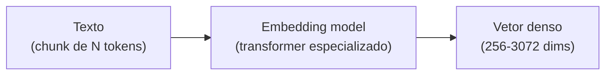

# Embeddings — representação semântica

> [!abstract] TL;DR
> **[[Dicionário de IA#embedding|Embedding]]** é a representação vetorial de texto (ou outro dado) como array de números, tipicamente 256-3072 dimensões. Textos com significado similar ficam próximos nesse espaço. Modelos modernos (OpenAI text-embedding-3, Voyage 3, Cohere Embed v4) têm propriedades específicas: matryoshka (truncar dimensões preserva qualidade), domain-specific (legal, código), multilingue. Custo é baixo: $0.02-$0.13/M tokens. **A escolha do [[Dicionário de IA#embedding model|modelo de embedding]] é decisão arquitetural** — você fica casado com ele para o lifecycle do índice.

> [!question]- Por que a distância de cosseno e não distância euclidiana para embeddings?
> Distância euclidiana mede o comprimento do segmento entre dois pontos — e embeddings de textos longos tendem a ter magnitudes maiores do que textos curtos, independentemente do significado. Isso distorce o resultado: um parágrafo de 5 frases estaria "mais longe" de uma query curta mesmo que o conteúdo seja idêntico. Cosseno mede o **ângulo** entre os vetores, ignorando magnitude — apenas a direção importa. Como modelos de embedding codificam semântica na direção dos vetores, não no comprimento, cosseno é a métrica correta. É por isso que todo vector DB usa cosine similarity ou produto interno (inner product) como default, não distância L2.

## A intuição

```
"rei"     → [0.12, -0.88, 0.34, ..., 0.21]   ┐
"rainha"  → [0.15, -0.85, 0.39, ..., 0.19]   │  perto (semanticamente similar)
"mesa"    → [-0.77, 0.23, 0.12, ..., 0.64]   ┘  longe
```

Tokens com significado parecido ficam próximos no espaço vetorial. Distância tipicamente medida com **cosine similarity**.

## Como funciona



[[Dicionário de IA#embedding model|Embedding model]] é tipicamente um **[[Dicionário de IA#transformer|transformer]] encoder-only** (BERT-style) treinado para que textos similares produzam vetores próximos. Diferente do [[Dicionário de IA#LLM (Large Language Model)|LLM]] (decoder-only) que gera texto.

## Modelos populares (2026)

| Modelo | Provider | Dims | Custo / M tokens | Forte em |
|---|---|---|---|---|
| **text-embedding-3-small** | OpenAI | 256-1536 | $0.02 | Default barato |
| **text-embedding-3-large** | OpenAI | 1024-3072 | $0.13 | Default qualidade |
| **voyage-3-large** | Voyage AI | 1024-2048 | $0.18 | Alta qualidade |
| **voyage-code-3** | Voyage AI | 1024 | $0.18 | Código (specialized) |
| **embed-english-v4** | Cohere | 1024 | $0.10 | English-only, multimodal |
| **embed-multilingual-v4** | Cohere | 1024 | $0.10 | 100+ idiomas |
| **bge-large-en-v1.5** | BAAI | 1024 | self-hosted | Open source forte |
| **e5-mistral-7b** | Microsoft | 4096 | self-hosted | LLM-as-embedder |

> [!tip] Default sensato em 2026
> - **Inglês geral:** OpenAI text-embedding-3-large (default), Voyage 3 (qualidade premium)
> - **Multilingue (incluindo PT-BR):** Cohere multilingual-v4
> - **Código:** Voyage code-3
> - **Self-hosted:** BGE-large ou e5-mistral

## Propriedades importantes

### Matryoshka (dimensões aninhadas)

Modelos modernos (OpenAI v3, Voyage 3) treinados para que **truncar as primeiras K dimensões preserve qualidade**. Permite trade-off custo/qualidade:

```python
# Mesma embedding, diferentes truncamentos
emb_full = openai.embeddings.create(model="text-embedding-3-large", input=text).data[0].embedding
# Truncar para 256 dims:
emb_256 = emb_full[:256]
# normalize após truncar
```

Vantagem: indexar uma vez, usar em diferentes níveis de qualidade.

### Anisotropia

Espaços de embedding têm uma **direção quente** onde todos os vetores concentram. Isso distorce similaridade. Mitigação: **whitening** (centrar e normalizar) em alguns pipelines.

### Linear structure

Operações como `king - man + woman ≈ queen` funcionam (parcialmente) em modelos bem treinados. Base de "word analogies".

### Dense vs sparse

| Tipo | Dimensão | Característica |
|---|---|---|
| **Dense** | 256-4000 | Maioria dos valores não-zero |
| **Sparse** | dim do vocabulário (~30K) | Maioria zero, semelhante a TF-IDF |

Sparse (SPLADE, ELSER): bom para keyword exact match. [[Dicionário de IA#dense retrieval|Dense]]: bom para semântica. **[[Dicionário de IA#hybrid search|Hybrid]] usa os dois** (ver [[06 - Retrieval — hybrid search, BM25, query rewriting]]).

## Decisões arquiteturais

### 1. Qual modelo escolher

Critérios:
- **Idioma:** EN-only? Multilingue? Tem PT-BR específico?
- **Domínio:** código, legal, medical?
- **Qualidade vs custo:** premium pequeno ou bom barato em volume?
- **Self-hosted vs API:** compliance ou latência?

### 2. Qual dimensão

| Dim | Custo storage | Qualidade | Latência |
|---|---|---|---|
| 256 | Mínimo | -10% | Rápido |
| 768 | Baixo | -3% | Médio |
| 1024 | Médio | Baseline | Médio |
| 1536+ | Alto | +2-5% | Lento |

Default: 1024-1536. Reduza para 256-768 em escala alta com matryoshka.

### 3. Lock-in

> [!warning] Embedding model é decisão de longo prazo
> Mudar de modelo = re-indexar **toda** a base. Custo:
> - Re-embed milhões de chunks
> - Validação rigorosa (golden set rodando)
> - Migração com zero downtime
>
> Escolha pensando em 1-2 anos.

## Custo típico

```
1M chunks × 500 tokens/chunk × 1 indexing = 500M tokens
500M × $0.13/M (text-embedding-3-large) = $65 indexing one-time

1000 queries/dia × 100 tokens/query × 30 dias = 3M tokens/mês
3M × $0.13/M = $0.39/mês query
```

Embedding é **barato**. Não é onde o custo do [[Dicionário de IA#RAG (Retrieval-Augmented Generation)|RAG]] vive.

## Embeddings multimodais

Modelos que embedam **texto + imagem** no mesmo espaço:

| Modelo | Provider |
|---|---|
| **embed-english-v4** (multimodal) | Cohere |
| **CLIP** | OpenAI (open source) |
| **Voyage Multimodal-3** | Voyage |

Use case: busca visual ("encontre páginas com diagramas similares").

## Métricas

| Métrica | Alvo |
|---|---|
| **Latência embedding** (1 chunk) | <50ms |
| **Throughput batch** | >1000/s |
| **Cosine similarity em pares relevantes** | >0.7 |
| **Cost embeddings / total RAG cost** | <10% |

## Anti-patterns

- **Trocar modelo sem re-indexar** — embeddings ficam incompatíveis silenciosamente
- **Embedding query com modelo diferente do indexing** — busca quebrada
- **Embedding texto não-normalizado** (HTML cru, JSON) — qualidade ruim
- **Embedding chunks gigantes** — atenção do encoder dilui
- **Single dimension fits all** — domínios diferentes podem precisar de modelos diferentes

## Armadilhas comuns

> [!warning] Trocar modelo de embedding sem re-indexar
> Se você mudar o modelo de embedding após indexar, os vetores antigos e os novos vivem em espaços matemáticos completamente diferentes — e não há como compará-los. Queries vão retornar resultados aleatórios sem nenhum erro explícito. Mudar de modelo exige re-embed de **toda** a base. Planeje essa decisão com o mesmo cuidado de uma migração de banco de dados.

> [!warning] Usar embedding de texto bruto sem pré-processamento
> HTML com tags, JSON com chaves, PDFs mal-parseados com caracteres lixo — tudo isso degrada a qualidade do embedding. O modelo de embedding foi treinado em texto limpo e natural. Texto sujo entra, vetor sem sentido sai. Sempre limpe o texto antes de embedar: remova markup, normalize espaços, decodifique entidades HTML.

> [!warning] Assumir que embeddings multilíngues são iguais para todas as línguas
> Modelos "multilíngues" têm desempenho desigual entre idiomas — geralmente inglês tem qualidade muito superior ao PT-BR, Árabe ou Japonês. Para aplicações em português que exijam alta qualidade, valide o modelo no seu domínio específico antes de assumir que o multilíngue resolve. Às vezes modelos menores fine-tuned em PT-BR superam modelos maiores genéricos.

## Como explicar em inglês

An embedding is the transformation of text into a dense numerical vector — think of it as a coordinate in a high-dimensional semantic space, where similar meanings cluster together and dissimilar meanings are far apart. When you embed the word "king" and "queen," their vectors end up close in that space; "table" ends up far from both. This geometric property is what makes similarity search possible.

Modern embedding models are transformer-based encoder architectures — distinct from the decoder-only LLMs used for generation. They're trained with contrastive loss objectives: similar sentence pairs are pulled together in vector space, dissimilar pairs are pushed apart. The key metric used for comparison is cosine similarity, which measures the angle between vectors rather than their distance, making it scale-invariant.

The architectural decision that matters most is model selection — you're committing to a particular embedding space for the entire lifecycle of your index. Switching models means re-embedding everything. In 2026, the practical default is OpenAI text-embedding-3-large for English, Cohere multilingual-v4 for multilingual use cases, and Voyage code-3 for code retrieval. Matryoshka-trained models let you trade off storage and quality by truncating dimensions without retraining.

**In a technical interview**, you might say:

> "Embeddings are the foundation of semantic retrieval in RAG. The embedding model maps text into a vector space where cosine similarity approximates semantic relevance. The key architectural constraint is lock-in: query-time and index-time embeddings must come from the same model, and switching models requires full re-indexing. I treat model selection as an architectural decision with a 12-18 month horizon — I evaluate on a domain-specific golden set before committing, because MTEB rankings don't always translate to production quality on your specific data."

| PT | EN |
|----|-----|
| Modelo de embedding | Embedding model |
| Vetor denso | Dense vector |
| Similaridade de cosseno | Cosine similarity |
| Dimensionalidade | Dimensionality |
| Espaço vetorial | Vector space |
| Encoder-only | Encoder-only (BERT-style) |
| Anisotropia | Anisotropy |
| Embeddings matriciais (aninhados) | Matryoshka embeddings |
| Produto interno | Inner product / dot product |
| Lock-in de modelo | Model lock-in |

## O que vem a seguir

Embeddings resolvem *como* textos são representados como vetores comparáveis. Mas antes de chegar ao embedding, há uma decisão ainda mais fundamental que determina o que vai ser embedded: como dividir o documento original em pedaços. Chunking é onde mais de 50% da qualidade do RAG é decidida — porque um embedding perfeito de um chunk ruim ainda retorna contexto inútil.

- [[04 - Chunking — onde 50% da qualidade vive]] — estratégias de divisão (fixed-size, recursive, semantic, structure-aware, contextual), trade-offs de tamanho, overlap e metadata obrigatória

## Veja também

- [[02 - Anatomia do pipeline RAG]]
- [[04 - Chunking — onde 50% da qualidade vive]]
- [[05 - Vector databases — pgvector, Pinecone, Qdrant]]
- [[06 - Retrieval — hybrid search, BM25, query rewriting]]

## Referências

- **OpenAI** — *Embeddings documentation* (2026)
- **Voyage AI** — *voyageai.com/docs* (2026)
- **Cohere** — *Embed v4 documentation* (2026)
- **MTEB Leaderboard** — *Massive Text Embedding Benchmark* (HuggingFace)
- **Karpukhin et al.** — *Dense Passage Retrieval* (paper original DPR, 2020)


