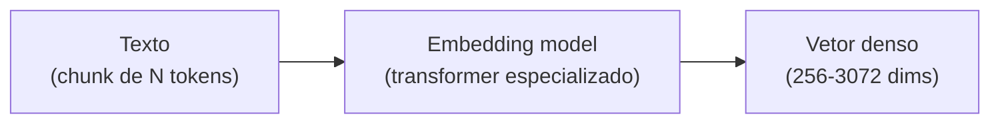

# Embeddings — representação semântica

> [!abstract] TL;DR
> **[[Dicionário de IA#embedding|Embedding]]** é a representação vetorial de texto (ou outro dado) como array de números, tipicamente 256-3072 dimensões. Textos com significado similar ficam próximos nesse espaço. Modelos modernos (OpenAI text-embedding-3, Voyage 3, Cohere Embed v4) têm propriedades específicas: matryoshka (truncar dimensões preserva qualidade), domain-specific (legal, código), multilingue. Custo é baixo: $0.02-$0.13/M tokens. **A escolha do [[Dicionário de IA#embedding model|modelo de embedding]] é decisão arquitetural** — você fica casado com ele para o lifecycle do índice.

> [!question]- Por que a distância de cosseno e não distância euclidiana para embeddings?
> Distância euclidiana mede o comprimento do segmento entre dois pontos — e embeddings de textos longos tendem a ter magnitudes maiores do que textos curtos, independentemente do significado. Isso distorce o resultado: um parágrafo de 5 frases estaria "mais longe" de uma query curta mesmo que o conteúdo seja idêntico. Cosseno mede o **ângulo** entre os vetores, ignorando magnitude — apenas a direção importa. Como modelos de embedding codificam semântica na direção dos vetores, não no comprimento, cosseno é a métrica correta. É por isso que todo vector DB usa cosine similarity ou produto interno (inner product) como default, não distância L2.

Imagine que você implementou a busca do seu sistema de RAG com um `SELECT ... WHERE texto LIKE '%cancelar assinatura%'` no banco. Um usuário pergunta "como encerro meu plano?" — e o sistema não retorna nada, porque o documento certo fala em "cancelamento de assinatura", não em "encerrar plano". As duas frases significam a mesma coisa para qualquer humano, mas para um `LIKE` são strings sem nenhum caractere relevante em comum. Esse é o limite fundamental de qualquer busca por correspondência textual (LIKE, regex, full-text search ingênuo): ela compara **ortografia**, não **significado**. É exatamente esse problema que os embeddings resolvem — transformar texto em um vetor numérico onde a *proximidade geométrica* corresponde à *proximidade de sentido*, não à sobreposição de palavras.

## A intuição

```
"rei"     → [0.12, -0.88, 0.34, ..., 0.21]   ┐
"rainha"  → [0.15, -0.85, 0.39, ..., 0.19]   │  perto (semanticamente similar)
"mesa"    → [-0.77, 0.23, 0.12, ..., 0.64]   ┘  longe
```

Tokens com significado parecido ficam próximos no espaço vetorial. Distância tipicamente medida com **cosine similarity**.

## Como funciona



[[Dicionário de IA#embedding model|Embedding model]] é tipicamente um **[[Dicionário de IA#transformer|transformer]] encoder-only** (BERT-style) treinado para que textos similares produzam vetores próximos. Diferente do [[Dicionário de IA#LLM (Large Language Model)|LLM]] (decoder-only) que gera texto.

## Modelos populares (2026)

| Modelo | Provider | Dims | Custo / M tokens | Forte em |
|---|---|---|---|---|
| **text-embedding-3-small** | OpenAI | 256-1536 | $0.02 | Default barato |
| **text-embedding-3-large** | OpenAI | 1024-3072 | $0.13 | Default qualidade |
| **voyage-3-large** | Voyage AI | 1024-2048 | $0.18 | Alta qualidade |
| **voyage-code-3** | Voyage AI | 1024 | $0.18 | Código (specialized) |
| **embed-english-v4** | Cohere | 1024 | $0.10 | English-only, multimodal |
| **embed-multilingual-v4** | Cohere | 1024 | $0.10 | 100+ idiomas |
| **bge-large-en-v1.5** | BAAI | 1024 | self-hosted | Open source forte |
| **e5-mistral-7b** | Microsoft | 4096 | self-hosted | LLM-as-embedder |

> [!tip] Default sensato em 2026
> - **Inglês geral:** OpenAI text-embedding-3-large (default), Voyage 3 (qualidade premium)
> - **Multilingue (incluindo PT-BR):** Cohere multilingual-v4
> - **Código:** Voyage code-3
> - **Self-hosted:** BGE-large ou e5-mistral

## Propriedades importantes

### Matryoshka (dimensões aninhadas)

Modelos modernos (OpenAI v3, Voyage 3) treinados para que **truncar as primeiras K dimensões preserve qualidade**. Permite trade-off custo/qualidade:

```python
# Mesma embedding, diferentes truncamentos
emb_full = openai.embeddings.create(model="text-embedding-3-large", input=text).data[0].embedding
# Truncar para 256 dims:
emb_256 = emb_full[:256]
# normalize após truncar
```

Vantagem: indexar uma vez, usar em diferentes níveis de qualidade.

### Anisotropia

Espaços de embedding têm uma **direção quente** onde todos os vetores concentram. Isso distorce similaridade. Mitigação: **whitening** (centrar e normalizar) em alguns pipelines.

### Linear structure

Operações como `king - man + woman ≈ queen` funcionam (parcialmente) em modelos bem treinados. Base de "word analogies".

### Dense vs sparse

| Tipo | Dimensão | Característica |
|---|---|---|
| **Dense** | 256-4000 | Maioria dos valores não-zero |
| **Sparse** | dim do vocabulário (~30K) | Maioria zero, semelhante a TF-IDF |

Sparse (SPLADE, ELSER): bom para keyword exact match. [[Dicionário de IA#dense retrieval|Dense]]: bom para semântica. **[[Dicionário de IA#hybrid search|Hybrid]] usa os dois** (ver [[06 - Retrieval — hybrid search, BM25, query rewriting]]).

## Decisões arquiteturais

### 1. Qual modelo escolher

Critérios:
- **Idioma:** EN-only? Multilingue? Tem PT-BR específico?
- **Domínio:** código, legal, medical?
- **Qualidade vs custo:** premium pequeno ou bom barato em volume?
- **Self-hosted vs API:** compliance ou latência?

### 2. Qual dimensão

| Dim | Custo storage | Qualidade | Latência |
|---|---|---|---|
| 256 | Mínimo | -10% | Rápido |
| 768 | Baixo | -3% | Médio |
| 1024 | Médio | Baseline | Médio |
| 1536+ | Alto | +2-5% | Lento |

Default: 1024-1536. Reduza para 256-768 em escala alta com matryoshka.

### 3. Lock-in

> [!warning] Embedding model é decisão de longo prazo
> Mudar de modelo = re-indexar **toda** a base. Custo:
> - Re-embed milhões de chunks
> - Validação rigorosa (golden set rodando)
> - Migração com zero downtime
>
> Escolha pensando em 1-2 anos.

## Custo típico

```
1M chunks × 500 tokens/chunk × 1 indexing = 500M tokens
500M × $0.13/M (text-embedding-3-large) = $65 indexing one-time

1000 queries/dia × 100 tokens/query × 30 dias = 3M tokens/mês
3M × $0.13/M = $0.39/mês query
```

Embedding é **barato**. Não é onde o custo do [[Dicionário de IA#RAG (Retrieval-Augmented Generation)|RAG]] vive.

## Embeddings multimodais

Modelos que embedam **texto + imagem** no mesmo espaço:

| Modelo | Provider |
|---|---|
| **embed-english-v4** (multimodal) | Cohere |
| **CLIP** | OpenAI (open source) |
| **Voyage Multimodal-3** | Voyage |

Use case: busca visual ("encontre páginas com diagramas similares").

## Métricas

| Métrica | Alvo |
|---|---|
| **Latência embedding** (1 chunk) | <50ms |
| **Throughput batch** | >1000/s |
| **Cosine similarity em pares relevantes** | >0.7 |
| **Cost embeddings / total RAG cost** | <10% |

## Avaliando embeddings

Uma pergunta que todo engenheiro sênior deveria fazer antes de comprometer o índice inteiro a um modelo: **"como eu sei que este modelo de embedding é bom o suficiente para o meu domínio?"** A resposta ingênua — "olho o MTEB Leaderboard e escolho o do topo" — é um dos erros mais caros e mais silenciosos em RAG. O erro é caro porque, como visto em "Lock-in", trocar de modelo depois significa re-indexar toda a base; é silencioso porque um modelo mal escolhido não gera erro nenhum — só resultados sutilmente piores, difíceis de atribuir à causa raiz.

### MTEB × realidade do domínio

O **MTEB** (Massive Text Embedding Benchmark) agrega dezenas de tarefas — classificação, clustering, retrieval, similaridade semântica — em datasets majoritariamente em inglês, majoritariamente de domínio geral (Wikipedia, notícias, reviews de produto). Um modelo no topo do ranking geral pode:

- Ter desempenho medíocre em português — porque poucas tarefas do MTEB avaliam PT-BR isoladamente, e a média agregada esconde essa fraqueza.
- Não ter sido avaliado em jargão técnico, jurídico ou médico — vocabulário que difere estruturalmente do que o benchmark testa.
- Performar bem em *retrieval* genérico mas mal no *seu* padrão de query — perguntas curtas e informais de um chat de suporte são diferentes de perguntas de pesquisa acadêmica.

> [!question]- Por que um ranking agregado pode enganar mais do que ajudar?
> Porque uma média esconde variância. Um modelo pode tirar nota altíssima em clustering de notícias em inglês e nota baixa em retrieval de PT-BR — e a média das duas tarefas ainda parece "boa" no ranking geral. Se o seu caso de uso é 100% retrieval em português técnico, a métrica que importa está escondida dentro do agregado, não no topo da tabela. **MTEB é um ponto de partida para filtrar candidatos, nunca a decisão final.**

Pense no MTEB como o currículo de um candidato numa entrevista de emprego: mostra que ele tem competência geral e passou por provas variadas, mas não garante que ele vai ser bom especificamente na vaga que você está contratando. A entrevista técnica específica — o golden set — é o que decide.

O MTEB serve para reduzir o universo de candidatos de "todos os modelos existentes" para "os 5-10 mais promissores" — não para escolher o vencedor. A escolha final exige avaliação **no seu domínio**.

### Métricas de retrieval, em detalhe

- **Recall@k** — dos documentos corretos, quantos aparecem entre os top-k retornados? Se `recall@5 = 0.89`, em 89% das queries do golden set o documento certo estava entre os 5 primeiros resultados.
- **MRR (Mean Reciprocal Rank)** — a média do inverso da posição do primeiro resultado correto. Se o documento certo aparece na posição 1, contribui com 1.0; na posição 2, com 0.5; na posição 5, com 0.2. Penaliza mais forte resultados corretos que aparecem tarde.
- **nDCG (Normalized Discounted Cumulative Gain)** — quando há múltiplos documentos relevantes por query com graus diferentes de relevância, nDCG pondera a posição pela relevância — mais rigoroso que recall/MRR binários.

Para a maioria dos times começando a avaliar embeddings, recall@k e MRR já são suficientes — nDCG entra quando a relevância deixa de ser binária (certo/errado) e passa a ter graus.

### Quando revalidar

Avaliação com golden set não é evento único no início do projeto. Três gatilhos exigem rodar de novo:

- **Provider lança nova versão do modelo** (ex: text-embedding-3 → text-embedding-4) — versões novas mudam o espaço vetorial; a comparação "antes vs depois" no golden set decide se vale migrar.
- **Domínio do conteúdo muda** — se o produto passa a indexar um novo tipo de documento (ex: de FAQ para contratos jurídicos), o golden set antigo não representa mais a distribuição real de queries.
- **Métricas de produção degradam sem mudança óbvia no código** — sintoma clássico de *drift*: o modelo não mudou, mas o conteúdo indexado foi crescendo em direções que o golden set original não cobre.

### Golden set: a avaliação que importa

Um **golden set** é uma amostra curada de pares (query real, documento correto) extraída do seu próprio domínio — não do benchmark de ninguém. O processo:

1. **Coletar 50-200 perguntas reais** que usuários fariam (ou já fizeram) ao seu sistema.
2. **Anotar manualmente qual chunk/documento é a resposta correta** para cada uma (pode ter mais de um).
3. **Rodar cada modelo candidato** contra o golden set, medindo métricas de retrieval: `recall@k` (o documento certo apareceu entre os top-k?) e `MRR` (Mean Reciprocal Rank — em que posição ele apareceu?).
4. **Comparar candidatos na mesma régua** — o vencedor é quem maximiza recall@k no *seu* domínio, não no MTEB.

```
Golden set (exemplo, domínio jurídico PT-BR):
query: "posso cancelar contrato dentro do prazo de reflexão?"
doc_correto: chunk_042 ("direito de arrependimento em até 7 dias...")

Modelo A (text-embedding-3-large): recall@5 = 0.71
Modelo B (Cohere multilingual-v4): recall@5 = 0.89
Modelo C (fine-tuned PT-BR jurídico): recall@5 = 0.94
```

Repare que o modelo com melhor posição geral no MTEB pode perder para um modelo menor e mais especializado quando a régua é o seu golden set — é exatamente o cenário do "modelo pequeno fine-tuned em PT-BR supera modelo grande genérico" mencionado nas armadilhas comuns.

### Caso prático: escolhendo modelo de embedding para PT-BR

Um cenário recorrente: uma equipe brasileira monta RAG para suporte técnico em português e precisa decidir entre três rotas.

| Rota | Prós | Contras |
|---|---|---|
| **API multilingue genérica** (Cohere embed-multilingual-v4, OpenAI text-embedding-3-large) | Zero manutenção, qualidade sólida "out of the box", cobre PT-BR razoavelmente | Não é otimizado especificamente para PT-BR; pode perder nuances de domínio técnico |
| **API especializada em código/domínio** (Voyage, se o conteúdo for técnico/código) | Melhor em nichos específicos (código, jurídico) | Cobertura de idioma pode ser mais fraca; ainda exige validação |
| **Modelo self-hosted fine-tuned em PT-BR** (ex: variantes BGE ou e5 com fine-tuning local) | Pode superar modelos maiores genéricos no domínio específico; controle total, sem lock-in de API | Custo de infraestrutura, expertise de ML no time, manutenção do fine-tuning |

O processo recomendado não é escolher pela ficha técnica, mas: (1) montar o golden set com 100+ pares reais do domínio da equipe; (2) rodar os três candidatos contra o golden set; (3) medir recall@5 e custo por milhão de tokens; (4) escolher o modelo com melhor recall@5 dentro do orçamento de custo/latência aceitável — e só então comprometer o índice de produção a ele.

> [!tip] Golden set não é custo descartável
> O golden set não serve só para escolher o modelo uma vez. Ele vira o **regression test** do seu pipeline de retrieval: toda vez que você trocar de modelo, ajustar chunking ou mudar a estratégia de reranking, roda o golden set de novo para garantir que a qualidade não regrediu silenciosamente.

No caso da tabela acima, o time descobriu na prática que o "Modelo C" (self-hosted fine-tuned) ganhava em recall@5 mas perdia em latência p99 — a API genérica respondia em ~40ms, o self-hosted em ~180ms sob carga, porque a equipe não tinha experiência operando inferência de embedding em produção. A decisão final não foi "o modelo com melhor recall", foi "o melhor recall dentro do orçamento de latência e do custo operacional que o time conseguia sustentar". Essa é a lição que a métrica isolada nunca conta: **avaliação de embedding é sempre multi-objetivo** — qualidade, custo, latência e capacidade operacional do time, todos ao mesmo tempo.

## Anti-patterns

- **Trocar modelo sem re-indexar** — embeddings ficam incompatíveis silenciosamente
- **Embedding query com modelo diferente do indexing** — busca quebrada
- **Embedding texto não-normalizado** (HTML cru, JSON) — qualidade ruim
- **Embedding chunks gigantes** — atenção do encoder dilui
- **Single dimension fits all** — domínios diferentes podem precisar de modelos diferentes

## Armadilhas comuns

> [!warning] Trocar modelo de embedding sem re-indexar
> Se você mudar o modelo de embedding após indexar, os vetores antigos e os novos vivem em espaços matemáticos completamente diferentes — e não há como compará-los. Queries vão retornar resultados aleatórios sem nenhum erro explícito. Mudar de modelo exige re-embed de **toda** a base. Planeje essa decisão com o mesmo cuidado de uma migração de banco de dados.

> [!warning] Usar embedding de texto bruto sem pré-processamento
> HTML com tags, JSON com chaves, PDFs mal-parseados com caracteres lixo — tudo isso degrada a qualidade do embedding. O modelo de embedding foi treinado em texto limpo e natural. Texto sujo entra, vetor sem sentido sai. Sempre limpe o texto antes de embedar: remova markup, normalize espaços, decodifique entidades HTML.

> [!warning] Assumir que embeddings multilíngues são iguais para todas as línguas
> Modelos "multilíngues" têm desempenho desigual entre idiomas — geralmente inglês tem qualidade muito superior ao PT-BR, Árabe ou Japonês. Para aplicações em português que exijam alta qualidade, valide o modelo no seu domínio específico antes de assumir que o multilíngue resolve. Às vezes modelos menores fine-tuned em PT-BR superam modelos maiores genéricos.

## Como explicar em inglês

An embedding is the transformation of text into a dense numerical vector — think of it as a coordinate in a high-dimensional semantic space, where similar meanings cluster together and dissimilar meanings are far apart. When you embed the word "king" and "queen," their vectors end up close in that space; "table" ends up far from both. This geometric property is what makes similarity search possible.

Modern embedding models are transformer-based encoder architectures — distinct from the decoder-only LLMs used for generation. They're trained with contrastive loss objectives: similar sentence pairs are pulled together in vector space, dissimilar pairs are pushed apart. The key metric used for comparison is cosine similarity, which measures the angle between vectors rather than their distance, making it scale-invariant.

The architectural decision that matters most is model selection — you're committing to a particular embedding space for the entire lifecycle of your index. Switching models means re-embedding everything. In 2026, the practical default is OpenAI text-embedding-3-large for English, Cohere multilingual-v4 for multilingual use cases, and Voyage code-3 for code retrieval. Matryoshka-trained models let you trade off storage and quality by truncating dimensions without retraining.

**In a technical interview**, you might say:

> "Embeddings are the foundation of semantic retrieval in RAG. The embedding model maps text into a vector space where cosine similarity approximates semantic relevance. The key architectural constraint is lock-in: query-time and index-time embeddings must come from the same model, and switching models requires full re-indexing. I treat model selection as an architectural decision with a 12-18 month horizon — I evaluate on a domain-specific golden set before committing, because MTEB rankings don't always translate to production quality on your specific data."

| PT | EN |
|----|-----|
| Modelo de embedding | Embedding model |
| Vetor denso | Dense vector |
| Similaridade de cosseno | Cosine similarity |
| Dimensionalidade | Dimensionality |
| Espaço vetorial | Vector space |
| Encoder-only | Encoder-only (BERT-style) |
| Anisotropia | Anisotropy |
| Embeddings matriciais (aninhados) | Matryoshka embeddings |
| Produto interno | Inner product / dot product |
| Lock-in de modelo | Model lock-in |

## O que vem a seguir

Embeddings resolvem *como* textos são representados como vetores comparáveis. Mas antes de chegar ao embedding, há uma decisão ainda mais fundamental que determina o que vai ser embedded: como dividir o documento original em pedaços. Chunking é onde mais de 50% da qualidade do RAG é decidida — porque um embedding perfeito de um chunk ruim ainda retorna contexto inútil.

- [[04 - Chunking — onde 50% da qualidade vive]] — estratégias de divisão (fixed-size, recursive, semantic, structure-aware, contextual), trade-offs de tamanho, overlap e metadata obrigatória

## Veja também

- [[02 - Anatomia do pipeline RAG]]
- [[04 - Chunking — onde 50% da qualidade vive]]
- [[05 - Vector databases — pgvector, Pinecone, Qdrant]]
- [[06 - Retrieval — hybrid search, BM25, query rewriting]]
- [[03 - Embeddings — do token ao vetor]] — a mesma peça vista pelo ângulo da arquitetura do transformer (Anatomia dos LLMs), em vez do ângulo de RAG

## Referências

- **OpenAI** — *Embeddings documentation* — [platform.openai.com/docs/guides/embeddings](https://platform.openai.com/docs/guides/embeddings)
- **Voyage AI** — *Documentation* — [docs.voyageai.com](https://docs.voyageai.com)
- **Cohere** — *Embed v4 documentation* — [docs.cohere.com/docs/embeddings](https://docs.cohere.com/docs/embeddings)
- **MTEB Leaderboard** — *Massive Text Embedding Benchmark* — [huggingface.co/spaces/mteb/leaderboard](https://huggingface.co/spaces/mteb/leaderboard)
- **Karpukhin et al.** — *Dense Passage Retrieval for Open-Domain Question Answering* (arXiv 2004.04906, 2020) — [arxiv.org/abs/2004.04906](https://arxiv.org/abs/2004.04906)

