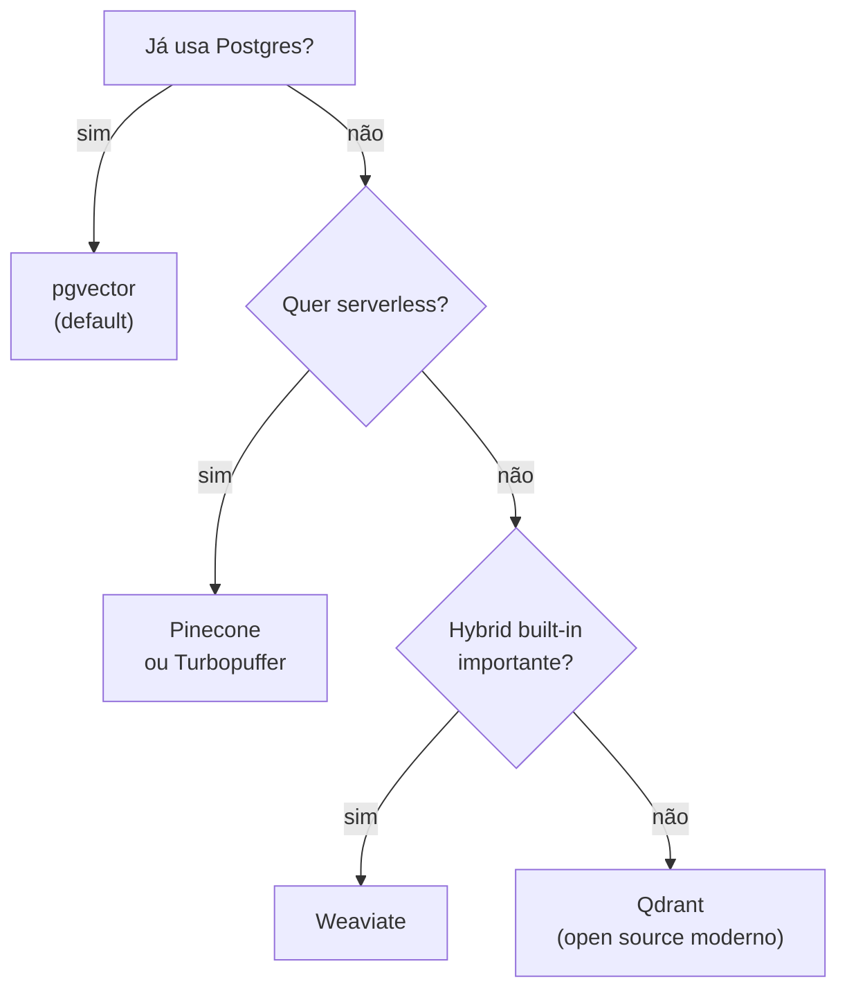

# Vector databases — pgvector, Pinecone, Qdrant

> [!abstract] TL;DR
> [[Dicionário de IA#vector database|Vector DB]] armazena `(chunk_text, embedding, metadata)` e responde queries de similaridade rapidamente. Em 2026, ele é **commodity** — onde a qualidade do [[Dicionário de IA#RAG (Retrieval-Augmented Generation)|RAG]] vive é em [[Dicionário de IA#chunking|chunking]], [[Dicionário de IA#retrieval|retrieval]], [[Dicionário de IA#reranking|reranking]]. **Default sensato:** pgvector se já usa Postgres (o que abrange a maioria); Pinecone para serverless; Qdrant para self-hosted moderno; Weaviate para [[Dicionário de IA#hybrid search|hybrid]] built-in. Custo: $0-200/mês para a maioria das aplicações. Performance é raramente o gargalo — com índice HNSW, query <100ms é trivial até 10M vetores.

> [!question]- Por que pgvector para começar e não Pinecone?
> Pinecone elimina operação, mas exige uma conta SaaS, uma API key extra e lock-in de vendor. pgvector é uma extensão do Postgres — se você já tem Postgres (o que vale para a maioria dos projetos), zero infraestrutura nova, zero custo adicional, join com tabelas existentes e backup familiar. O Pinecone faz sentido quando você precisa de escala serverless acima de 10M vetores ou não tem time para operar banco. Abaixo disso, pgvector é literalmente mais simples.

Um time típico chega aqui de duas formas. A primeira: já rodou meses em Pinecone, a fatura de serverless cresceu junto com o volume de queries, e alguém percebe que o Postgres que já hospeda o resto da aplicação poderia hospedar os vetores também — migrar para pgvector vira questão de custo e simplicidade operacional, não de performance. A segunda, mais cara de aprender: o time troca de vector DB (ou tunning o índice) esperando que o RAG melhore, e nada muda — porque a qualidade das respostas nunca dependia de qual banco guarda os vetores. Ela depende de como o texto foi cortado em [[Dicionário de IA#chunking|chunks]], de que estratégia de [[Dicionário de IA#retrieval|retrieval]] traz os candidatos certos, e se há [[Dicionário de IA#reranking|reranking]] filtrando o ruído antes do LLM ver o contexto. Entender o que um vector DB realmente faz — e o que ele não pode consertar — evita as duas armadilhas.

## O que vector DB faz

```sql
-- Pseudo-SQL
SELECT chunk, metadata
FROM chunks
ORDER BY embedding <=> query_embedding   -- cosine distance
LIMIT 50;
```

3 operações essenciais:
1. **Insert** vetor com metadata
2. **Query** k-NN por similaridade (cosine, dot product, L2)
3. **Filter** por metadata (`WHERE date > X AND lang = 'pt'`)

## As principais opções (2026)

| DB | Tipo | Hosting | Forte em |
|---|---|---|---|
| **pgvector** | Extension Postgres | Self / RDS / Supabase | Já usa Postgres, transações |
| **Pinecone** | SaaS proprietary | Serverless | Escala sem operação |
| **Qdrant** | Open source dedicated | Self / Qdrant Cloud | Performance, filters |
| **Weaviate** | Open source | Self / Weaviate Cloud | Hybrid search nativo |
| **Milvus** | Open source | Self / Zilliz Cloud | Escala bilhões de vetores |
| **ChromaDB** | Open source dev-friendly | Self / embedded | Prototipos, simplicidade |
| **Redis Vector** | Extension Redis | Self / Redis Cloud | Já usa Redis |
| **Elasticsearch** | Search engine | Self / Elastic Cloud | Já usa ES, hybrid |
| **Vespa** | Open source enterprise | Self / Vespa Cloud | Yahoo-scale, hybrid |
| **Turbopuffer** | Serverless newcomer | Cloud only | Cost/performance ratio |

## pgvector — o default em 2026

> [!tip] pgvector ganhou em 2024-2025
> Razão: **a maioria já tem Postgres**. Adicionar vector capability como extension é trivial. Transações ACID, joins, filtros relacionais — tudo de graça.

```sql
-- Setup
CREATE EXTENSION vector;

CREATE TABLE chunks (
    id BIGSERIAL PRIMARY KEY,
    text TEXT,
    embedding VECTOR(1536),
    metadata JSONB,
    doc_id BIGINT REFERENCES documents(id),
    created_at TIMESTAMPTZ
);

-- Index HNSW (rápido, aproximado)
CREATE INDEX ON chunks USING hnsw (embedding vector_cosine_ops);

-- Query com filter
SELECT text, metadata
FROM chunks
WHERE doc_id IN (1,2,3) AND created_at > '2026-01-01'
ORDER BY embedding <=> $1
LIMIT 50;
```

**Vantagens:**
- Filtros relacionais robustos (`WHERE complex AND ...`)
- Transações
- Joins com tabelas existentes
- Backup/restore familiar
- Free no Postgres existing

**Limitações:**
- Performance cai >10M vetores (caso raro)
- Sem features fancy (multi-tenancy, gestão de índices automática)

## Pinecone — para serverless

```python
from pinecone import Pinecone

pc = Pinecone(api_key="...")
index = pc.Index("rag-prod")

# Insert
index.upsert([
    ("chunk_1", embedding, {"doc_id": 1, "text": "..."}),
])

# Query
results = index.query(
    vector=query_embedding,
    top_k=50,
    filter={"doc_date": {"$gt": "2026-01-01"}}
)
```

**Vantagens:**
- Zero operação
- Escala transparente (bilhões de vetores)
- Multi-tenancy nativo
- Pricing serverless (paga pelo uso)

**Limitações:**
- Lock-in
- Custo cresce com escala
- Sem joins relacionais
- Latência cross-region

## Qdrant — open source moderno

```python
from qdrant_client import QdrantClient
client = QdrantClient(url="http://localhost:6333")

client.upsert(
    collection_name="rag",
    points=[{
        "id": 1,
        "vector": embedding,
        "payload": {"doc_id": 1, "text": "..."}
    }]
)

results = client.search(
    collection_name="rag",
    query_vector=query_embedding,
    limit=50,
    query_filter={
        "must": [{"key": "doc_date", "range": {"gt": "2026-01-01"}}]
    }
)
```

**Vantagens:**
- Performance excelente
- Filters poderosos
- Open source maduro
- Pode rodar embedded ou distribuído

**Limitações:**
- Operação adicional (não usa Postgres existing)
- Backup/restore separado

## Weaviate — hybrid built-in

Forte em **[[Dicionário de IA#hybrid search|hybrid search]] nativo** (vector + [[Dicionário de IA#BM25|BM25]] sem precisar configurar).

```python
client.query.get("Chunk", ["text"]).with_hybrid(
    query="user question",
    alpha=0.5  # 0=BM25, 1=vector
).do()
```

Vantagem: hybrid out-of-the-box, sem stack adicional.

## Heurística de escolha



## Index types

| Index | Trade-off |
|---|---|
| **HNSW** | Padrão moderno: fast query, mais memória |
| **IVF** | Menos memória, query mais lenta |
| **Flat** | Exato (brute force), pequena escala |
| **PQ / SQ** | Quantization para reduzir memória |

Default: **HNSW** com parâmetros padrão. Tune apenas se houver problema concreto.

## Performance típica

| Escala | Latência query | DB |
|---|---|---|
| 100K vetores | <30ms | Qualquer |
| 1M vetores | <100ms | pgvector com HNSW |
| 10M vetores | <200ms | Qdrant, Pinecone |
| 100M+ vetores | <500ms | Pinecone serverless, Milvus |

> [!warning] Preços mudam rápido — não trate estes números como cravados
> A tabela abaixo reflete faixas de preço observadas em 2026. Pricing de SaaS (Pinecone, Qdrant Cloud, Weaviate Cloud) muda com frequência — planos serverless, novos tiers e descontos por volume aparecem sem aviso. Antes de decidir com base em custo, confira a página de pricing oficial de cada provedor em vez de confiar nestes valores.

## Custo típico (1M chunks, 1M queries/mês)

| DB | Hosting | Custo/mês |
|---|---|---|
| **pgvector (Supabase)** | Managed Postgres | $25-100 |
| **pgvector (RDS)** | AWS RDS | $50-200 |
| **Pinecone serverless** | SaaS | $50-300 |
| **Qdrant Cloud** | SaaS | $50-200 |
| **Weaviate Cloud** | SaaS | $50-300 |
| **Self-hosted Qdrant** | EC2/GCE | $30-100 + ops |

## Armadilhas comuns

> [!warning] Trocar de vector DB sem re-indexar os vetores
> Cada modelo de embedding gera um espaço vetorial diferente. Se você mudar de `text-embedding-ada-002` para `text-embedding-3-large`, os vetores antigos são incompatíveis — as distâncias deixam de fazer sentido. Toda vez que trocar de modelo de embedding, você precisa re-gerar e re-inserir todos os vetores. Documente o modelo usado como metadado no banco para evitar mistura acidental.

> [!warning] Não indexar a metadata com B-tree antes de filtrar
> pgvector e Qdrant suportam filtros por metadata (`WHERE doc_date > X`), mas sem índice B-tree na coluna filtrada a query faz full scan antes do k-NN — e isso mata a performance muito antes de chegar a 1M vetores. Crie índices nas colunas filtradas frequentemente (`doc_date`, `tenant_id`, `lang`) como primeiro passo, não como otimização tardia.

> [!warning] Usar pgvector sem HNSW assume brute force
> Por padrão, pgvector usa busca exata (brute force). Sem o `CREATE INDEX ... USING hnsw`, cada query varre toda a tabela. O índice HNSW reduz a latência de 10s para <100ms em 1M vetores com recall >95%. Adicione o índice imediatamente após a criação da tabela — retrofitar em produção com 5M linhas exige uma janela de manutenção.

## Anti-patterns

- **Vector DB sem metadata indexada** — não consegue filtrar com performance
- **Index sem HNSW** — query lenta sem necessidade
- **Trocar de DB sem re-indexar** — formato de [[Dicionário de IA#embedding|embedding]] pode mudar
- **Pinecone para 10K vetores** — overengineered, pgvector basta
- **pgvector para 100M vetores em uma tabela** — split por shard ou troque
- **Sem backup do DB** — re-indexar 1M chunks custa horas e $$$

## Métricas

| Métrica | Alvo |
|---|---|
| **Latência p95 (search)** | <100ms |
| **Throughput insert** | >1000/s |
| **Recall@10** | >95% (vs brute force) |
| **Storage por vetor (1536 dims)** | ~6KB |

## Como explicar em inglês

Vector databases solve a specific problem: finding the most semantically similar chunks to a query — fast. Unlike a relational database that searches for exact matches, a vector DB uses approximate nearest-neighbor algorithms (like HNSW) to find chunks whose embedding vectors are closest in high-dimensional space. The result is semantic search: you can ask "how do I deploy this?" and retrieve chunks that talk about "deployment", "production setup", and "release process" — even without those exact words.

The key insight is that **vector DBs are commodity in 2026**. The choice of database rarely determines RAG quality. What matters is chunking strategy, retrieval quality, and reranking. pgvector wins in most cases simply because teams already have Postgres — adding vector search is one SQL command, not a new infrastructure component.

For production, three things matter beyond the basic query: metadata filtering (narrowing the search space before k-NN), HNSW indexing (making k-NN sub-100ms), and backup strategy (re-indexing 1M vectors takes hours and costs money).

**In a technical interview**, you might say:

> "For most projects, I default to pgvector — it's a Postgres extension, so if you already have a relational database, you get vector search with zero extra infrastructure. You create an HNSW index, and queries on 1M vectors come back under 100ms. I only reach for Pinecone when I need serverless scale beyond 10M vectors and the team can't afford to operate another database. Qdrant is my pick for self-hosted when pgvector's metadata filtering starts struggling — it has purpose-built payload indexes that outperform Postgres at complex pre-filter workloads."

| PT | EN |
|----|-----|
| banco de dados vetorial | vector database |
| busca por similaridade | similarity search |
| vizinho mais próximo aproximado | approximate nearest neighbor (ANN) |
| índice HNSW | HNSW index |
| produto escalar | dot product |
| distância cosseno | cosine distance |
| metadados | metadata |
| filtro por metadados | metadata filtering |
| quantização | quantization |
| armazenamento self-hosted | self-hosted storage |

## O que vem a seguir

Saber onde armazenar os vetores é metade do problema. A outra metade é como fazer a busca retornar os chunks certos. Vector search puro é o ponto de partida óbvio — mas em produção ele falha em uma classe inteira de casos: nomes próprios, IDs, termos técnicos raros, qualquer coisa onde correspondência exata importa mais que semântica. A próxima nota explora como hybrid search (BM25 + vector) fecha essa lacuna e por que Reciprocal Rank Fusion é a forma mais robusta de combinar os dois rankings.

- [[06 - Retrieval — hybrid search, BM25, query rewriting]] — como recuperar chunks com qualidade real

## Veja também

- [[02 - Anatomia do pipeline RAG]]
- [[03 - Embeddings — representação semântica]]
- [[06 - Retrieval — hybrid search, BM25, query rewriting]]
- [[Memória de Agentes|15 - Mem0 — vetorial + grafo]]
- [[Memória de Agentes|16 - Zep e Graphiti — knowledge graph temporal]]

## Referências

- **pgvector** — [github.com/pgvector/pgvector](https://github.com/pgvector/pgvector)
- **Pinecone** — [docs.pinecone.io](https://docs.pinecone.io) (2026)
- **Qdrant** — [qdrant.tech/documentation](https://qdrant.tech/documentation) (2026)
- **Weaviate** — [weaviate.io/developers](https://weaviate.io/developers) (2026)
- **MTEB Benchmark** — vetor DB comparison
- **ann-benchmarks.com** — [ann-benchmarks.com](https://ann-benchmarks.com) (performance comparativo)
