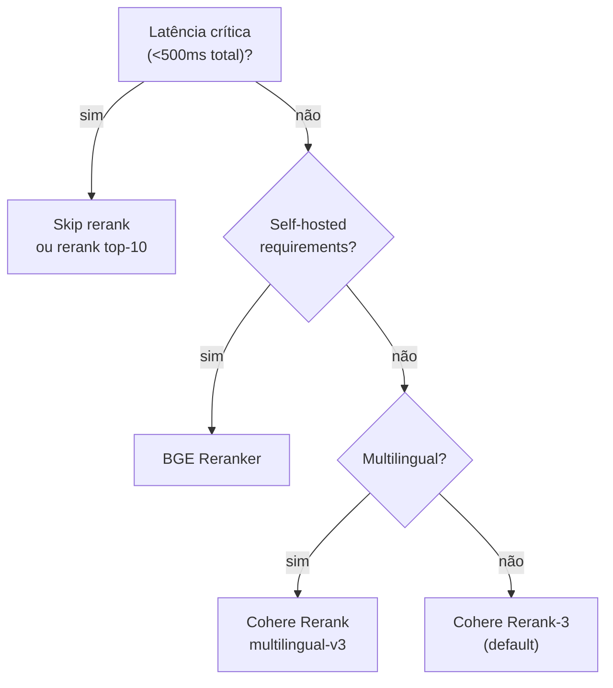

# Reranking — Cohere, Voyage, cross-encoders

> [!abstract] TL;DR
> Reranker é um modelo que **refina o ranking** dos top-N do retrieve. Diferente de [[Dicionário de IA#embedding|embeddings]] (bi-encoders, embedam query e doc separadamente), rerankers são **cross-encoders** — analisam query+doc juntos, com atenção total entre eles. Resultado: ranking muito mais preciso, ao custo de latência (cada par requer 1 forward pass). Padrão: [[Dicionário de IA#retrieval|retrieve]] top-50, [[Dicionário de IA#reranking|rerank]] → top-5. Modelos: Cohere Rerank (default), Voyage Rerank, BGE Reranker (open source). **Skip rerank = ruído no prompt.**

> [!question]- Por que reranker depois de vector search e não só vector search melhor?
> Um embedding melhor não resolve o problema estrutural: bi-encoders comprimem query e documento em vetores independentes — eles nunca "se veem" juntos. A distância cosseno mede similaridade global, não relevância específica para a pergunta. Um reranker cross-encoder processa `[query][SEP][documento]` como um par único, ativando atenção cruzada entre todos os tokens de ambos. Isso permite detectar que "Python suporta async" é mais relevante para "como fazer chamadas async em Python?" do que "Python é uma linguagem de alto nível" — mesmo que o segundo documento tenha embedding mais similar à query genérica. Melhorar o bi-encoder ajuda na margem; cross-encoder resolve a classe inteira de problema.

## Por que rerankers existem

Embeddings (bi-encoders):

```
Query  → encoder → vector_q
Doc    → encoder → vector_d
score = cosine(vector_q, vector_d)
```

Rápido, mas **encoders nunca se conhecem**. Vetores otimizados para approximate similarity, não relevância profunda.

Rerankers (cross-encoders):

```
[Query] [SEP] [Doc] → encoder → score
```

Query e doc **passam juntos** pelo encoder. Atenção total entre eles. Resultado: muito mais preciso, mas O(N) — precisa rodar uma vez por par.

## Trade-off explícito

| | Bi-encoder (embedding) | Cross-encoder (reranker) |
|---|---|---|
| **Latência por doc** | 0ms (pré-computado) | 50-200ms |
| **Precisão** | Boa | Excelente |
| **Escalabilidade** | Bilhões | Milhares |
| **Uso** | Top-50 do corpus | Top-5 do top-50 |

Pipeline ideal: bi-encoder filtra de 1M para 50; cross-encoder refina de 50 para 5.

## Modelos populares (2026)

| Reranker | Provider | Latência | Forte em |
|---|---|---|---|
| **Cohere Rerank 3** | Cohere API | 100-300ms | Default, multilingual |
| **Voyage Rerank-2** | Voyage AI | 100-300ms | Premium quality |
| **BGE Reranker v2-m3** | BAAI (open) | self-hosted | Open source forte |
| **Jina Reranker v2** | Jina AI | 100-300ms | Multilingual, multimodal |
| **MS MARCO** | Microsoft (open) | self-hosted | Baseline open source |

Default sensato em 2026: **Cohere Rerank** (API simples, qualidade alta) ou **BGE-Reranker-v2-m3** (self-hosted).

## Como usar — Cohere

```python
import cohere

co = cohere.Client(api_key="...")

response = co.rerank(
    model="rerank-3",
    query="user question",
    documents=[
        "doc 1 text...",
        "doc 2 text...",
        # ... up to 1000 docs
    ],
    top_n=5
)

# response.results: [{index: 2, relevance_score: 0.94}, ...]
final_docs = [docs[r.index] for r in response.results]
```

Custo: $1 / 1000 chamadas (1 chamada = 1 query + N docs). 100 docs por query: $1 / 100K queries. Barato.

## Como usar — BGE (self-hosted)

```python
from FlagEmbedding import FlagReranker

reranker = FlagReranker('BAAI/bge-reranker-v2-m3')

pairs = [(query, doc) for doc in candidates]
scores = reranker.compute_score(pairs)
ranked = sorted(zip(candidates, scores), key=lambda x: -x[1])[:5]
```

Custo: free (GPU), latência depende do hardware.

## Quando usar cada



## O ganho real

> [!example] Anthropic Contextual Retrieval (2024)
> Hybrid search (BM25 + vector) sozinho: 5.7% failed retrievals Hybrid + Reranker: 1.9% failed retrievals **Redução de 67%** apenas adicionando reranker.

Esse é o efeito típico em produção. Skip rerank = deixar dinheiro na mesa.

## Latência considerações

```
Top-50 docs × 200ms / doc = ~10s    ❌ inviável

Solução: batch
Top-50 docs em 1 batch call = 200-400ms total ✅
```

APIs (Cohere, Voyage) batcham automaticamente. Self-hosted: configure batch size.

## Filtragem antes de rerank

Para reduzir custo e latência, filtre **antes** do rerank. O pipeline completo tem 4 etapas — cada uma existe para eliminar um tipo específico de ruído antes que ele chegue ao passo mais caro (o cross-encoder):

```python
def retrieve_and_rerank(query: str, top_k_final: int = 5):
    # 1. Hybrid retrieval — maximiza RECALL, não precisão.
    #    BM25 (léxico) + vector search (semântico) rodando em paralelo,
    #    resultados combinados via reciprocal rank fusion (RRF).
    #    Objetivo aqui: garantir que os documentos certos estejam ENTRE
    #    os 50 — não que já estejam ordenados corretamente.
    candidates = hybrid_retrieve(query, k=50)

    # 2. Filtro de metadados — elimina candidatos estruturalmente errados
    #    ANTES de gastar forward passes de cross-encoder com eles.
    #    Ex: documentos de uma versão descontinuada, tenant errado
    #    (multi-tenant RAG), ou fora da janela de validade temporal.
    candidates = [c for c in candidates if c.metadata.get("status") == "active"]

    # 3. Deduplicação — chunks quase-idênticos (overlap de sliding window,
    #    ou o mesmo parágrafo indexado 2x por re-ingestão) desperdiçam
    #    slots do rerank sem agregar informação nova.
    candidates = dedupe_by_similarity(candidates, threshold=0.95)

    # 4. Filtro por score bruto do retrieval — sinal FRACO mas barato.
    #    Não substitui o rerank; só descarta os casos óbvios de baixa
    #    afinidade, para não gastar o orçamento de latência do
    #    cross-encoder em candidatos que ele quase certamente rejeitaria.
    filtered = [c for c in candidates if c.retrieval_score > MIN_THRESHOLD]

    # 5. Rerank — só agora entra o cross-encoder, sobre um conjunto já
    #    limpo. Esta é a etapa que de fato ordena por relevância; as
    #    anteriores só reduzem o volume que chega até aqui.
    top_n = rerank(query, filtered, top_n=top_k_final)
    return top_n
```

Cada etapa de filtro é mais barata que a seguinte — metadados e deduplicação custam microssegundos; o cross-encoder custa uma forward pass por par. A ordem importa: filtrar caro antes de barato desperdiça o que o filtro barato deveria evitar.

### O que acontece quando você pula a etapa 1 (hybrid retrieval)

O erro mais comum não está na filtragem — está em pular o retrieval de alto recall e confiar só em vector search puro antes do rerank:

```python
# ❌ ANTI-PADRÃO: vector search puro, sem hybrid, direto pro rerank
def retrieve_and_rerank_quebrado(query: str):
    # Vector search sozinho tem recall menor em queries com termos exatos
    # (siglas, nomes próprios, códigos de erro, IDs) — embeddings borram
    # esses tokens em similaridade semântica, perdendo o match léxico.
    candidates = vector_search_only(query, k=50)  # sem BM25

    # O rerank processa fielmente os 50 candidatos que recebeu...
    top5 = rerank(query, candidates, top_n=5)
    return top5  # mas se o documento certo nunca entrou nos 50,
                 # o "melhor dos 50 ruins" ainda é ruim.
```

Suponha a query "erro HTTP 429 na API de checkout". Vector search puro pode devolver 50 documentos sobre "limites de taxa", "políticas de retry" e "arquitetura de APIs" — semanticamente próximos, mas nenhum menciona o código `429` explicitamente porque a busca vetorial tratou o número como ruído. O reranker recebe esses 50, os ordena com perfeição técnica — e entrega no topo um documento genérico sobre rate limiting que nunca cita o código do erro real. **O reranker fez seu trabalho corretamente; o problema está uma etapa antes.** Essa é a essência de "garbage in, garbage out": nenhuma capacidade de reordenação do cross-encoder compensa a ausência do documento certo no conjunto de entrada.

## Validação de threshold

Default: aceita top-N do reranker, sem threshold. Mas em produção:

```python
top5 = rerank(query, candidates, top_n=5)

# Se nem o top-1 tem boa relevância, devolve "não sei"
if top5[0].relevance_score < 0.6:
    return "Não encontrei informação relevante para sua pergunta."
```

Threshold típico: 0.5-0.7 (dependente do modelo).

## Reranker para multimodal

Modelos multimodais (Cohere Embed v4, Jina Reranker multimodal) ranqueiam pares **texto + imagem**. Útil em busca visual ou docs com diagramas.

## Métricas

| Métrica | Alvo |
|---|---|
| **NDCG@10** (após rerank) | >0.7 |
| **Precision@5** | >70% |
| **Latência rerank** | <500ms |
| **Cost rerank / total RAG** | <20% |
| **Threshold de "não sei"** | top-1 score <0.6 |

> [!question]- Por que "NDCG@10 > 0.7" é abstrato até você calcular um exemplo?
> Porque a métrica só ganha sentido quando você vê o que ela penaliza. NDCG (Normalized Discounted Cumulative Gain) mede se os documentos **mais relevantes vieram primeiro** — não só se estão presentes no top-10.

**Exemplo numérico — NDCG@10.** Suponha uma query com 3 documentos relevantes (relevância graduada 3, 2, 1 — "muito relevante", "relevante", "pouco relevante") escondidos entre 10 candidatos retornados pelo reranker.

Ranking A (reranker bom): posições 1, 2, 4 recebem os documentos com relevância 3, 2, 1.

```
DCG_A = 3/log2(1+1) + 2/log2(2+1) + 1/log2(4+1)
      = 3/1.0 + 2/1.585 + 1/2.322
      = 3.0 + 1.262 + 0.431
      = 4.693
```

Ranking B (reranker fraco, mesmos documentos mas em posições 3, 7, 9):

```
DCG_B = 3/log2(3+1) + 2/log2(7+1) + 1/log2(9+1)
      = 3/2.0 + 2/3.0 + 1/3.322
      = 1.5 + 0.667 + 0.301
      = 2.468
```

IDCG (ranking ideal, os 3 relevantes nas posições 1, 2, 3): `3/1.0 + 2/1.585 + 1/2.0 = 4.762`.

```
NDCG_A = 4.693 / 4.762 = 0.985   ✅ acima do alvo (>0.7)
NDCG_B = 2.468 / 4.762 = 0.518   ❌ abaixo do alvo — mesmo documentos, ranking pior
```

O documento certo estar "em algum lugar do top-10" não basta — a posição é o que a métrica pune. Um reranker que enterra o documento certo na posição 9 conta quase como não tê-lo recuperado, porque a maioria dos LLMs (e usuários) dão peso decrescente aos chunks mais distantes do início do contexto.

**Exemplo numérico — Precision@5.** De 5 documentos retornados após o rerank, quantos são de fato relevantes (julgamento binário, não graduado)? Se 4 de 5 são relevantes: `Precision@5 = 4/5 = 80%` — acima do alvo de 70%. Se apenas 2 de 5 são relevantes (`40%`), o sinal é que o filtro de relevância anterior ao rerank (ou o próprio retrieval) está deixando passar ruído — o reranker não cria relevância do nada, só reordena o que chega.

**Exemplo numérico — threshold de "não sei".** Um reranker Cohere retorna `relevance_score` normalizado entre 0 e 1. Em 1.000 queries de produção, suponha a distribuição: 850 queries com top-1 score ≥0.6 (resposta com confiança), 150 queries com top-1 score <0.6 (candidatas a "não encontrei"). Sem o threshold, essas 150 queries geram respostas fabricadas a partir de chunks marginalmente relevantes — o preço de "sempre responder" é ~15% de respostas potencialmente alucinadas. Com o threshold, essas 150 viram um fallback honesto — trade-off deliberado entre cobertura e confiabilidade.

## Fine-tuning domain-specific de rerankers

> [!question]- Quando um reranker genérico (Cohere, BGE stock) não é suficiente?
> Quando o vocabulário e a noção de "relevância" do seu domínio divergem do que o modelo viu no treino. Um reranker treinado majoritariamente em MS MARCO (queries e passagens de busca web genérica) aprende que "relevante" significa "sobre o mesmo tópico". Em domínios especializados — jurídico, médico, código-fonte — relevância frequentemente significa outra coisa: "a cláusula que se aplica a este caso específico", não "qualquer cláusula sobre contratos".

Sintomas de domain mismatch: o reranker ordena bem documentos genéricos, mas erra sistematicamente em jargão técnico, siglas do domínio, ou quando dois documentos são lexicalmente parecidos mas semanticamente distintos (ex: "Artigo 5º da Lei X" vs "Artigo 5º da Lei Y" — mesma estrutura sintática, relevância completamente diferente dependendo do contexto do caso).

**Mecanismo do fine-tuning.** Cross-encoders (BGE, MS MARCO, Cohere self-hosted quando disponível) são fine-tunáveis com contrastive loss sobre triplas `(query, doc_positivo, doc_negativo)`:

```python
from sentence_transformers import CrossEncoder, InputExample
from torch.utils.data import DataLoader

# Cada exemplo: par (query, doc) com label de relevância (0.0 a 1.0)
train_examples = [
    InputExample(texts=["cláusula de rescisão por justa causa",
                         "Art. 482 CLT — hipóteses de rescisão..."], label=1.0),
    InputExample(texts=["cláusula de rescisão por justa causa",
                         "Art. 7º CLT — direitos do trabalhador urbano..."], label=0.0),
    # ... centenas a milhares de pares rotulados do domínio
]

model = CrossEncoder("BAAI/bge-reranker-v2-m3")  # parte de um checkpoint já forte
train_dataloader = DataLoader(train_examples, shuffle=True, batch_size=16)
model.fit(train_dataloader=train_dataloader, epochs=2, warmup_steps=100)
model.save("reranker-juridico-v1")
```

O passo crítico — e o que mais separa fine-tuning bem-sucedido de perda de tempo — é **hard negative mining**: em vez de usar documentos aleatórios como negativos (fáceis demais, o modelo já os rejeitaria), usar documentos que o *retrieval atual* já confunde (alto score de embedding, mas irrelevantes de fato). Isso ensina o reranker exatamente onde ele erra hoje, não onde já acerta.

> [!warning] Fine-tuning sem golden set de validação é fine-tuning cego
> Sem um conjunto de queries+respostas corretas do seu domínio (mesmo que só 50-100 exemplos, revisados por humano), não há como saber se o fine-tuning melhorou ou piorou o reranker fora do conjunto de treino — overfitting em domínio estreito é comum e silencioso. Valide NDCG@10 no golden set antes/depois do fine-tuning; se não melhorar, o modelo base já estava bom o suficiente e o custo de manter um checkpoint customizado não se paga.

**Quando vale o esforço:** volume alto de queries no mesmo domínio + vocabulário/jargão consistentemente mal ordenado pelo reranker genérico + orçamento para manter um golden set atualizado. Quando não vale: poucos milhares de queries/mês, domínio genérico, ou ausência de capacidade de avaliação contínua — nesses casos, Cohere Rerank ou BGE stock captura a maior parte do ganho por uma fração do esforço.

## Armadilhas comuns

> [!warning] Rerankar sem hybrid retrieve — garbage in, garbage out
> O reranker refina o ranking do top-50, mas não cria relevância do nada. Se o top-50 do vector search não contém os documentos certos (baixo recall), o reranker vai ordenar 50 documentos mediocres — e o melhor do lote ainda vai ser ruim. O padrão correto é hybrid retrieval primeiro (para maximizar recall no top-50), depois reranker (para maximizar precisão no top-5). Rerankar sem hybrid é otimizar a segunda etapa enquanto ignora a primeira.

> [!warning] Rerankar top-1000 por cautela
> Cada documento no batch de rerank custa uma forward pass de cross-encoder. Top-50 em uma chamada de API Cohere leva 200-400ms total. Top-1000 pode levar 4-8s e custa 20x mais — sem ganho proporcional, porque os documentos adicionais já teriam recall baixo do retrieval. O sweet spot empírico é rerankar top-50 a top-100. Se você sente que precisa de mais de 100 candidatos, o problema está no retrieval, não no reranker.

> [!warning] Sem threshold de relevância — força resposta mesmo quando não há informação
> Por padrão, o reranker retorna um score de relevância. Se o top-1 tem score 0.2 (muito baixo), forçar a geração de uma resposta com esse chunk quase certamente vai resultar em hallucination — o LLM vai complementar o que falta com conhecimento próprio. Defina um threshold (tipicamente 0.5-0.7 dependendo do modelo) e devolva "não encontrei informação relevante" quando nenhum chunk passa. Isso não é falha — é o comportamento correto de um sistema RAG honesto.

## Anti-patterns

- **Skip rerank em produção** — Anthropic mostrou 67% redução de failed retrievals
- **Rerank top-1000** — caro sem ganho marginal vs top-50
- **Sem threshold de relevância** — força resposta mesmo sem info
- **Rerankear sem hybrid retrieve** — top-50 vector ruim → rerank salva pouco
- **Reranker diferente do dataset de treino** — domain mismatch
- **Não validar reranker em golden set** — assume que qualquer reranker é melhor

## Como explicar em inglês

Reranking is the step that bridges high recall and high precision. After hybrid retrieval gives you a top-50 with good recall, the reranker reorders those 50 candidates using a fundamentally different model architecture. Bi-encoders (the ones that generate embeddings) encode query and document independently — they never interact. Cross-encoders process the query-document pair together, allowing full attention between every token in both. This makes them dramatically more accurate at judging relevance, at the cost of running once per pair instead of once per query.

The practical result is significant. Anthropic's Contextual Retrieval paper shows that adding a reranker after hybrid search reduces failed retrievals from 3.4% to 1.9% — a 44% improvement just from this single step. The cost is minimal: a batch call to Cohere Rerank for 50 documents takes 200-400ms and costs roughly $1 per 100,000 queries.

The architecture pattern is fixed: retrieve top-50 (for recall), rerank to top-5 (for precision), then pass only those 5 to the LLM. The reranker also provides relevance scores that enable a "I don't know" gate — if the top-1 score is below 0.6, the system returns a fallback instead of forcing a hallucinated answer.

**In a technical interview**, you might say:

> "I always add a reranker between retrieval and generation. The reason is architectural: vector embeddings encode query and document independently, so similarity score is an approximation of relevance. A cross-encoder like Cohere Rerank-3 processes the query and each candidate document as a pair, with full self-attention between them — it can reason about whether the document actually answers the question, not just whether it's topically similar. In production, I retrieve top-50 from hybrid search, rerank to top-5, and use the top-1 relevance score as a threshold gate: if it's below 0.6, I return 'I couldn't find relevant information' rather than risk a hallucinated answer."

| PT | EN |
|----|-----|
| reordenação | reranking |
| codificador cruzado | cross-encoder |
| codificador duplo | bi-encoder |
| pontuação de relevância | relevance score |
| passagem direta | forward pass |
| limiar de relevância | relevance threshold |
| recuperação em lote | batch retrieval |
| recuperações falhas | failed retrievals |
| precisão do topo | top-N precision |
| recall com reordenação | recall@N with reranking |

## O que vem a seguir

Depois de retrieval + rerank, você tem os 5 chunks mais relevantes para a pergunta. O trabalho não acabou — agora o desafio é transformar esses chunks em uma resposta confiável. Como estruturar o prompt para que o LLM cite as fontes? Como ordenar os chunks dentro do contexto para evitar o efeito "lost in the middle"? Como garantir que a resposta não invente informação além do que está nos trechos? A próxima nota cobre a etapa de geração — incluindo estrutura de prompt, padrões de citação e como tratar faithfulness em produção.

- [[08 - Generation — passar contexto ao LLM com citação]] — gerar resposta fiel com citações explícitas

## Veja também

- [[02 - Anatomia do pipeline RAG]]
- [[06 - Retrieval — hybrid search, BM25, query rewriting]]
- [[09 - Evaluation de RAG]]
- [[Anatomia dos LLMs|03 - A janela de contexto]]

## Referências

- **Anthropic** — *Contextual Retrieval* (2024) — [anthropic.com/news/contextual-retrieval](https://www.anthropic.com/news/contextual-retrieval)
- **Cohere** — *Rerank documentation* (2026) — [docs.cohere.com/docs/rerank-2](https://docs.cohere.com/docs/rerank-2)
- **Voyage AI** — *Reranker docs* (2026) — [docs.voyageai.com/docs/reranker](https://docs.voyageai.com/docs/reranker)
- **BGE** — *FlagEmbedding (BAAI)* (2026) — [github.com/FlagOpen/FlagEmbedding](https://github.com/FlagOpen/FlagEmbedding)
- **Nogueira & Cho** — *Passage Re-ranking with BERT* (paper original cross-encoder, 2019) — [arxiv.org/abs/1901.04085](https://arxiv.org/abs/1901.04085)
