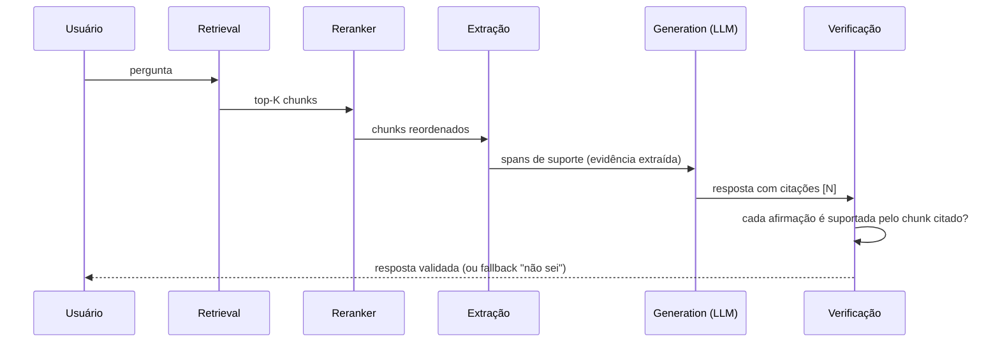

# Generation — passar contexto ao LLM com citação

> [!abstract] TL;DR
> Geração é onde [[Dicionário de IA#RAG (Retrieval-Augmented Generation)|RAG]] vira **resposta com citação**. Estrutura padrão de prompt: trechos delimitados + pergunta + regras explícitas (citar trecho usado, devolver "não sei" se contexto não cobre). Citação não é nice-to-have — é a feature que diferencia RAG de chatbot. Cuidado com **faithfulness**: [[Dicionário de IA#LLM (Large Language Model)|LLM]] pode misturar contexto com conhecimento próprio. Padrões: [[Dicionário de IA#structured output|structured output]] com source ID, [[Dicionário de IA#system prompt|system prompt]] restritivo, validação de citação no post-processing.

> [!question]- Por que passar citação explícita e não deixar o LLM inferir?
> Quando você não instrui o LLM a citar, ele vai responder com confiança absoluta — mesclando o contexto recuperado com seu conhecimento de treinamento sem avisar qual é qual. O usuário não tem como distinguir "o documento diz X" de "o modelo acha que X é verdade". Citação explícita cria um contrato verificável: cada afirmação aponta para um trecho numerado, e qualquer pessoa pode checar. Em domínios regulados (legal, médico, financeiro), isso não é opcional — é o que transforma RAG em evidência auditável. "Deixar o LLM inferir" também aumenta hallucination porque o modelo preenche lacunas com conhecimento próprio quando o prompt não proíbe explicitamente.

## A estrutura do prompt

Imagine o cenário mais traiçoeiro de todos: o retrieval fez o trabalho certo. Os três chunks recuperados cobrem exatamente a pergunta do usuário, o reranker os colocou na ordem certa, e ainda assim a resposta final está errada — porque o LLM, ao gerar, misturou um detalhe do contexto recuperado com um detalhe do seu conhecimento de treinamento, sem sinalizar qual é qual. O usuário lê uma frase fluente e confiante, sem forma de saber que metade veio do documento e a outra metade veio de um palpite do modelo. Esse é o motivo pelo qual a estrutura do prompt de generation não é um detalhe cosmético: é o único ponto do pipeline onde você pode instruir explicitamente o LLM a não fazer essa mistura — e a citação por número de trecho é o mecanismo que torna essa instrução verificável depois do fato.

```text
SYSTEM:
Você responde apenas com base nos trechos fornecidos. Cite [N] cada
afirmação usando o número do trecho. Se trechos não cobrem a pergunta,
responda: "Não encontrei essa informação."

USER:
Trechos:
[1] {chunk_1_text}
[2] {chunk_2_text}
[3] {chunk_3_text}

Pergunta: {user_question}
```

3 elementos cruciais:
1. **Delimitação** — trechos numerados, separados
2. **Regra de citação** — explícita
3. **Regra de fallback** — "não sei" como opção válida

## Construção de contexto — o elo entre retrieval e geração

> [!warning] Retrieval certo ≠ resposta certa
> Recuperar o documento certo **não garante** resposta certa. Quando o chunk correto está no contexto e a resposta ainda erra, o gargalo está *entre* recuperar e gerar — não é "o LLM alucinou, melhore o prompt". As 5 causas possíveis estão mapeadas em [[09 - Evaluation de RAG]]; aqui tratamos das três que vivem na construção do contexto.

### Ordenação importa (Lost in the Middle)

LLMs aproveitam melhor o que está no **início e no fim** do contexto e tendem a ignorar o meio — a [[Dicionário de IA#Lost in the Middle|curva de atenção em U]]. Um chunk relevante jogado no meio de um top-K longo pode ser desprezado mesmo tendo sido recuperado e bem ranqueado.

- Posicione os chunks de **maior score nas pontas** do contexto, não no meio.
- Poucos chunks bem ordenados > muitos chunks "na ordem crua do retrieval".

### Menos é mais — ruído dilui evidência

Empilhar o chunk certo junto com N chunks irrelevantes (ou desatualizados/conflitantes) **piora** a resposta. Não é [[Dicionário de IA#Hallucination|hallucination]] — é confusão de evidência: o modelo tem o material certo, mas afogado em ruído.

- Priorize **precisão** sobre volume (ver `context_precision` em [[09 - Evaluation de RAG]]).
- 3 chunks de alta relevância costumam bater 10 chunks "por garantia".

### Extrair antes de gerar (extract-then-generate)

Para queries difíceis, não passe chunks crus direto pro LLM. Insira uma etapa que **extrai os spans de suporte exatos** (as sentenças que de fato respondem à pergunta) e gere a resposta só a partir delas. Menos texto cru = menos espaço para o modelo improvisar.

### Pipeline de geração robusto

Quando a resposta exige juntar fatos espalhados em vários chunks, a geração vira um **fluxo multi-etapa**, não uma chamada única:

```text
retrieve → rerank → extrair evidência → resolver conflitos → gerar → verificar contra evidência
```



- **Resolver conflitos** — quando chunks discordam (ex.: versões diferentes da mesma doc), reconcilie antes de gerar (a regra 4 do system prompt restritivo, abaixo, é a semente disso).
- **Verificar contra evidência** — checar se cada afirmação da resposta é suportada por algum trecho recuperado é o gate de faithfulness ([[09 - Evaluation de RAG]]). Frameworks como **Self-RAG** e **Corrective RAG (CRAG)** automatizam essa auto-checagem; o CRAG ainda dispara correção (ex.: nova busca) quando o retrieval vem fraco.

## Por que citação importa

Sem citação:
- Usuário não sabe se LLM inventou
- Compliance (medical, legal, finance) inviável
- Auditoria impossível
- Confiança limitada

Com citação:
- Usuário verifica fonte
- Audit trail natural
- Compliance facilitado
- Confiança aumenta

## Patterns de prompt

### Pattern 1 — Numbered citations (default)

```
Trechos:
[1] FastAPI suporta async desde a versão 0.5...
[2] Para criar endpoint async, use async def...
[3] Connection pooling melhora performance...

Resposta esperada:
"FastAPI suporta async [1]. Para criar endpoints, use async def [2]. Para
performance, considere connection pooling [3]."
```

Simples, fácil de validar (regex `\[\d+\]`).

### Pattern 2 — Structured output

```python
from pydantic import BaseModel

class Citation(BaseModel):
    text: str
    sources: list[int]  # IDs dos chunks

class RAGResponse(BaseModel):
    answer: list[Citation]
    confidence: Literal["high", "medium", "low"]
    is_supported: bool
```

LLM retorna JSON válido. Validação automática.

### Pattern 3 — XML delimiters

```
<context>
  <doc id="1">...</doc>
  <doc id="2">...</doc>
</context>
<question>...</question>
```

XML reduz prompt injection (ver [[Segurança e Guardrails]]).

## System prompt restritivo

Padrão consolidado:

```
You are a {domain} assistant. Answer ONLY based on the provided context.

Rules:
1. Cite each claim with [N] referencing the source chunk.
2. If context does not contain the answer, respond: "I cannot answer
   based on available information."
3. Do NOT use external knowledge, even if you "know" the answer.
4. If chunks contradict, point out the contradiction.
5. Quote directly when accuracy is critical.

Context:
[1] {chunk_1}
[2] {chunk_2}
...

Question: {user_question}
```

A regra **3** é crítica — LLM tende a complementar com conhecimento próprio. System prompt restritivo reduz mas não elimina.

## Faithfulness — o problema central

**Faithfulness:** a resposta é fiel ao contexto (sem inventar)?

Modos comuns de falha:

| Falha | Exemplo |
|---|---|
| **Mistura de fontes** | Resposta combina dois chunks contraditórios sem notar |
| **Inferência não-suportada** | Contexto diz "FastAPI suporta async". LLM diz "FastAPI é mais rápido que Flask" (não no contexto) |
| **Generalização** | Contexto sobre v3, LLM responde sobre todas as versões |
| **Citação errada** | Cita [2] mas info está em [1] |
| **[[Dicionário de IA#Hallucination\|Halucinação]] total** | Inventa info não presente em nenhum chunk |

Mitigações:

- **System prompt restritivo** (acima)
- **Reduzir [[Dicionário de IA#temperature|temperature]]** (0 ou 0.2 para tarefas factuais)
- **Validação automática** (LLM-as-judge: a resposta usa info do contexto?)
- **Estimativa de confidence** (LLM declara confidence)

Detalhes em [[09 - Evaluation de RAG]].

## Quando dizer "não sei"

> [!tip] Devolver "não sei" é feature, não falha
> RAG-bom é melhor que RAG-tudo-respondendo. Condições para "não sei":
> - Reranker top-1 score <0.6 ([[07 - Reranking — Cohere, Voyage, cross-encoders|07 - Reranking]])
> - Contexto não cobre a pergunta semanticamente
> - Pergunta fora do escopo do dataset

LLM-as-judge auxiliar:

```python
def is_answerable(question, chunks):
    prompt = f"""
    Os trechos abaixo são suficientes para responder?
    Pergunta: {question}
    Trechos: {chunks}

    Responda: yes/no/partial
    """
    return llm.complete(prompt)
```

## Output formatting

### Resposta direta + citações inline

```
"FastAPI suporta async desde a versão 0.5 [1]. Para criar um endpoint async,
use async def antes da função handler [2]."
```

Mais usado. Boa UX.

### Resposta + sources separados

```json
{
  "answer": "FastAPI suporta async desde a versão 0.5...",
  "sources": [
    {"chunk_id": 1, "page": 42},
    {"chunk_id": 2, "page": 51}
  ]
}
```

Útil para UIs com tooltips ou expansíveis.

### Quote-driven

```
> "FastAPI fully supports async since v0.5"
> — manual.md, page 42

> "Endpoints can be made async by using `async def`..."
> — manual.md, page 51
```

Em domínios legal ou medical, citações textuais reduzem ambiguidade.

## Modelos para generation

| Modelo | Forte em RAG | Custo |
|---|---|---|
| **Claude Sonnet 4.6** | Excelente em seguir instruções restritivas | Médio |
| **GPT-5** | Muito bom, costuma "complementar" mais | Médio |
| **Gemini 2.5 Pro** | Long context, multimodal | Médio |
| **Haiku / Flash / GPT-4o-mini** | Bom para QA simples, barato | Baixo |
| **Llama 3.3 70B** | Self-hosted | $$ infra |

> [!tip] Tiering em RAG
> Use Haiku/Flash para 90% das perguntas simples. Escala para Sonnet/Opus quando confidence baixa ou pergunta complexa.

## Latência típica

| Componente | Latência |
|---|---|
| Generation com 5 chunks de 500 tokens | 500ms-2s |
| Streaming (TTFT) | 200-500ms |
| Total user-facing (com retrieval) | 1-3s |

Streaming é crucial para UX em RAG — usuário vê resposta começando imediatamente.

## Métricas

| Métrica | Alvo |
|---|---|
| **Faithfulness** (LLM-as-judge) | >90% |
| **Citation accuracy** (citação aponta info correta) | >95% |
| **% respostas "não sei" apropriadas** | 5-15% |
| **Latência generation** | <2s (p95) |
| **Cost por resposta** | <$0.005 |

## Anti-patterns

- **Sem regra de citação** — LLM responde sem fontes
- **Sem regra de "não sei"** — força resposta mesmo sem info
- **Temperature alta** (>0.5) em RAG factual — mais hallucination
- **Não validar citações** — citação errada passa
- **Modelo grande para tudo** — Haiku resolve a maioria
- **Sem streaming** — UX ruim
- **Prompt sem delimitação** — confusão entre context e instruction

## Armadilhas comuns

> [!warning] Temperature alta em geração factual — convida hallucination
> Temperature controla aleatoriedade do sampling. Em RAG factual (medical, legal, técnico), temperature >0.5 aumenta a probabilidade de o modelo "completar criativamente" onde o contexto é ambíguo. O resultado é uma resposta que parece confiante mas inventou detalhes não presentes nos chunks. Para RAG factual, use temperature 0 ou 0.1. Reserve temperature mais alta para tarefas criativas (resumo narrativo, emails) onde alguma variação é desejável.

> [!warning] Não delimitar chunks — confunde contexto com instrução
> Se você colocar os chunks diretamente no prompt sem delimitação clara (números, XML tags, separadores), o LLM pode confundir onde terminam as instruções e onde começam os dados — especialmente se um chunk contém texto imperativo ou parece um prompt. Use delimitação explícita: `[1] texto do chunk`, `<doc id="1">...</doc>`, ou blocos separados por `---`. Prompt injection em RAG acontece justamente via chunks não delimitados que contêm instruções adversariais.

> [!warning] Validar citação só visualmente — citação errada passa fácil
> Citações numéricas `[1]` são fáceis de verificar com regex, mas isso só confirma que o LLM usou um número — não que aquele número aponta para o chunk correto. Em testes, modelos ocasionalmente trocam `[1]` por `[2]` ou citam um chunk que não suporta a afirmação. Adicione validação automática pós-geração: extraia os números de citação, recupere os chunks correspondentes, e use um LLM-as-judge para confirmar que cada afirmação é suportada pelo chunk citado. Isso detecta "citação fantasma" antes de chegar ao usuário.

## Como explicar em inglês

Generation is the final step in the RAG pipeline, where retrieved chunks become a user-facing answer. The core challenge is faithfulness: an LLM trained on the entire internet has strong priors about every topic, and without explicit constraints, it will blend retrieved context with its own knowledge — often without flagging which is which. The solution is a system prompt that creates a contract: the model may only use the provided context, must cite each claim with a chunk reference, and must return a fallback ("I cannot answer based on available information") when the context doesn't cover the question.

Citation is not a cosmetic feature. In regulated domains, it's the difference between a conversational tool and an auditable system. Numbered citations `[1]` allow any claim to be traced back to a source document. Structured output (Pydantic models with `sources: list[int]`) makes citation machine-verifiable. XML delimiters reduce prompt injection risk by separating instruction space from data space.

Beyond prompt structure, context construction matters significantly. The "lost in the middle" phenomenon means LLMs attend most strongly to the beginning and end of long contexts — placing the most relevant chunk in the middle of a 10-chunk context can cause it to be underweighted. Fewer, higher-precision chunks consistently outperform larger context dumps, which is why reranking to top-5 before generation is standard practice.

**In a technical interview**, you might say:

> "In RAG generation, the most important design decision is the system prompt contract. I always include three rules: cite every claim with the chunk number, don't use external knowledge even if you know the answer, and return a specific fallback string if the context doesn't cover the question. I use numbered chunks in the user message and validate citations automatically post-generation — a quick check that [2] actually supports the claim that references it. For temperature, I use 0 or 0.1 for factual RAG. And I always stream the response — in a 1-3 second total pipeline, streaming gives the user something to read while the rest loads."

| PT | EN |
|----|-----|
| geração com contexto | context-grounded generation |
| fidelidade | faithfulness |
| alucinação | hallucination |
| citação de fonte | source citation |
| prompt restritivo | restrictive system prompt |
| saída estruturada | structured output |
| temperatura | temperature |
| resposta de recuo | fallback response |
| verificação de citação | citation verification |
| perdido no meio | lost in the middle |

## O que vem a seguir

Você agora tem o pipeline completo: chunking → embedding → retrieval → reranking → generation com citação. Mas como saber se ele funciona bem? A intuição de "parece bom" não escala — você precisa de métricas objetivas para detectar onde o pipeline quebra, comparar versões e justificar mudanças para o time. A próxima nota cobre evaluation de RAG: as métricas de faithfulness, relevância de contexto e qualidade de resposta, e como frameworks como RAGAS automatizam a avaliação com LLM-as-judge.

- [[09 - Evaluation de RAG]] — medir onde o pipeline RAG quebra com métricas objetivas

## Veja também

- [[01 - O que é RAG e quando usar]]
- [[06 - Retrieval — hybrid search, BM25, query rewriting]]
- [[07 - Reranking — Cohere, Voyage, cross-encoders]]
- [[09 - Evaluation de RAG]]
- [[Segurança e Guardrails|07 - Security-focused prompting]]

## Referências

- **Anthropic** — *Citations API* (2024) — https://www.anthropic.com/news/citations
- **Eugene Yan** — *Patterns for Building LLM-based Systems* (2024)
- **OpenAI** — *Structured outputs guide* (2026)
- **Liu et al.** — *Lost in the Middle: How Language Models Use Long Contexts* (arXiv 2307.03172, TACL 2024) — https://arxiv.org/abs/2307.03172
- **Asai et al.** — *Self-RAG: Learning to Retrieve, Generate and Critique through Self-Reflection* (arXiv 2310.11511, 2023) — https://arxiv.org/abs/2310.11511
- **Yan et al.** — *Corrective Retrieval Augmented Generation (CRAG)* (arXiv 2401.15884, 2024) — https://arxiv.org/abs/2401.15884
