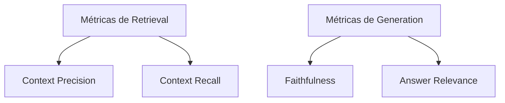

# Evaluation de RAG

> [!abstract] TL;DR
> [[Dicionário de IA#RAG (Retrieval-Augmented Generation)|RAG]] sem evaluation é aposta. Métricas fundamentais: **context precision** (chunks recuperados são relevantes?), **context recall** (chunks relevantes foram recuperados?), **faithfulness** (resposta é fiel ao contexto?), **answer relevance** (resposta atende à pergunta?). **Crucial:** medir [[Dicionário de IA#retrieval|retrieval]] **separado** de generation. Se retrieval falha, generation não salva. Tools: Ragas (mais popular), TruLens, DeepEval. Golden set de 30-100 perguntas com gabarito é o mínimo.

> [!question]- Por que medir retrieval separado de generation em RAG?
> Porque são dois mecanismos distintos com falhas distintas: se o retrieval não trouxer o chunk certo, o generation não tem como inventar a resposta correta — e quando inventa, isso é faithfulness ruim, não retrieval bom. Juntar as métricas obscurece a causa raiz: você pode ter faithfulness alta (LLM fiel ao que recebeu) com recall baixo (LLM recebeu lixo). Sem separação, você não sabe se precisa consertar o chunker, o ranker ou o prompt.

> [!info] Trilha mestre
> Esta nota é o deep-dive de evaluation **no contexto de RAG**. Pra disciplina geral de evaluation (golden datasets, rubrics, LLM-as-judge, frameworks 2026, eval em CI), veja a trilha [[Evaluation]].

Imagine o cenário: você fez o deploy de um RAG, testou manualmente umas vinte perguntas, as respostas pareceram boas — fluentes, no tom certo, aparentemente corretas. Duas semanas depois, em produção, começam a chegar reclamações de erros sutis: uma citação que aponta para o chunk errado, uma resposta que soa convincente mas contradiz o documento fonte. O problema é que "parecer bom" no teste manual não diz **onde** está a falha — pode ser que o chunk certo nunca tenha sido recuperado, que o rerank tenha descartado o certo, ou que o LLM tenha completado a lacuna com conhecimento próprio. Sem métricas que isolem cada etapa do pipeline, você não sabe se o culpado é o retrieval, o reranking ou a generation — só sabe que "algo está errado".

## A regra fundamental

> *"Mede retrieval separado de generation. Senão você não sabe onde está o problema."*

Resposta ruim em RAG tem **5 causas possíveis**:

1. [[Dicionário de IA#chunking|Chunk]] relevante **não existe** no corpus (parse/chunk ruim)
2. Chunk relevante existe mas **não foi recuperado** (retrieval ruim)
3. Chunk recuperado mas **[[Dicionário de IA#reranking|rerank]] baixou** (rerank ruim)
4. Chunks corretos mas **prompt não usou** (generation ruim)
5. Generation **complementou com knowledge** (faithfulness ruim)

Métricas separadas detectam cada causa.

## As 4 métricas canônicas (Ragas)



### 1. Context precision

*"Os chunks recuperados são relevantes?"*

```
context_precision = relevant_chunks_retrieved / total_chunks_retrieved
```

Mede se o retrieval **trouxe lixo junto**. Top-5 com 5 relevantes = 1.0. Top-5 com 2 relevantes = 0.4.

### 2. Context recall

*"Os chunks relevantes foram recuperados?"*

```
context_recall = relevant_chunks_retrieved / total_relevant_chunks_in_corpus
```

Mede se o retrieval **deixou info importante de fora**. Requer golden set com chunks esperados.

### 3. Faithfulness

*"A resposta é fiel ao contexto (não inventou)?"*

LLM-as-judge:

```
Para cada afirmação na resposta, verifique se ela é
suportada pelos chunks fornecidos. Output: 0-1.
```

Score abaixo de 0.9 = [[Dicionário de IA#LLM (Large Language Model)|LLM]] está complementando com conhecimento próprio.

### 4. Answer relevance

*"A resposta atende à pergunta?"*

LLM-as-judge: pergunta original vs resposta. Mede se a resposta é **on-topic**, não se é correta.

## Outras métricas úteis

### Citation accuracy

```
% de citações onde [N] aponta para chunk que realmente contém a info
```

Critical em compliance. Implementação: parse `[N]` em resposta, verificar contra chunk[N].

### Latency p95

```
% queries respondidas em <Xs
```

Operacional. RAG bom mas lento perde para "joga tudo no contexto".

### Cost per query

```
$ por (retrieve + rerank + generate)
```

Muda decisões — Cohere Rerank é grátis comparado a query Opus.

## Golden set

A base de toda evaluation. 30-100 entradas:

```yaml
- id: q_001
  question: "Como configurar autenticação no FastAPI?"
  expected_answer: "Use Depends() com OAuth2..."
  expected_chunks: ["doc-12-section-3", "doc-12-section-4"]
  category: "tutorial"

- id: q_002
  question: "FastAPI é melhor que Django?"
  expected_answer: "[NÃO RESPONDER — não está no escopo]"
  category: "out_of_scope"
```

Categorias úteis:

- **Factual** — resposta direta no corpus
- **Multi-hop** — precisa juntar 2+ chunks
- **Out of scope** — corpus não cobre, deve responder "não sei"
- **Adversarial** — prompt injection, queries enganadoras

## Tools — Ragas

```python
from ragas import evaluate
from ragas.metrics import (
    context_precision,
    context_recall,
    faithfulness,
    answer_relevancy
)
from datasets import Dataset

dataset = Dataset.from_dict({
    "question": ["..."],
    "answer": ["..."],
    "contexts": [["..."]],
    "ground_truths": [["..."]],
})

result = evaluate(
    dataset,
    metrics=[context_precision, context_recall, faithfulness, answer_relevancy]
)
print(result)
# {"context_precision": 0.85, "faithfulness": 0.92, ...}
```

Ragas usa LLM-as-judge internamente. Custo: $0.05-0.20/exemplo (depende do modelo).

## Tools alternativas

| Tool | Forte em |
|---|---|
| **Ragas** | Mais popular, métricas canônicas |
| **TruLens** | Tracing + eval integrados |
| **DeepEval** | Pytest-style, fácil em CI |
| **[[Dicionário de IA#Arize Phoenix\|Phoenix (Arize)]]** | Tracing visual + eval |
| **[[Dicionário de IA#Langfuse\|Langfuse]]** | Observabilidade + eval em prod |

## Pipeline de eval em CI

```yaml
# .github/workflows/rag-eval.yml
name: RAG Evaluation

on:
  pull_request:
    paths: ["src/rag/**", "prompts/**"]

jobs:
  eval:
    runs-on: ubuntu-latest
    steps:
      - uses: actions/checkout@v4
      - run: |
          python -m rag_eval --golden-set tests/golden_set.yaml                              --threshold-context-precision 0.7                              --threshold-faithfulness 0.85                              --report eval_report.md
      - run: |
          # Bloqueia merge se métricas caírem
          python -c "import json; r = json.load(open('eval_results.json'));                      assert r['context_precision'] >= 0.7"
```

Roda a cada PR de RAG. Bloqueia regressão.

## A/B test em produção

Eval automatizado mostra: nova versão é **5% melhor** em context_precision. Significa nada para usuário.

```python
# A/B em prod
def get_response(query, user_id):
    variant = ab_assign(user_id, "rag_v3_test", split=0.5)

    if variant == "control":
        rag = RAG_V2
    else:
        rag = RAG_V3

    response = rag.answer(query)
    log_event("rag_response", {
        "user_id": user_id,
        "variant": variant,
        "feedback": None  # preencher depois com thumbs up/down
    })
    return response
```

Métricas de negócio (resolution rate, NPS) > métricas técnicas.

## Maturidade

> [!example] Diagnóstico
>
> | Nível | Sinal |
> |---|---|
> | **0** | "Funcionou nos meus testes manuais" |
> | **1** | Golden set ad-hoc em planilha |
> | **2** | Ragas rodando em script local |
> | **3** | Eval em CI bloqueando merge |
> | **4** | Eval em CI + observabilidade prod (Langfuse) |
> | **5** | A/B test em prod com métricas de negócio |

Maioria está em 0-1. Meta para 2026: nível 3.

## Anti-patterns

- **Eval só de generation** — não detecta retrieval ruim
- **Golden set de 5 exemplos** — não representativo
- **Rodar eval só "no final"** — descobre regressão tarde
- **Métricas técnicas sem A/B** — pode estar otimizando o errado
- **Sem categoria "out of scope"** — não sabe se RAG diz "não sei" apropriadamente
- **Reusar prompts gold em treino** — circular reasoning

## Métricas-alvo

| Métrica | Alvo (produção) |
|---|---|
| **Context precision** | >0.7 |
| **Context recall** | >0.8 |
| **Faithfulness** | >0.9 |
| **Answer relevance** | >0.85 |
| **Citation accuracy** | >0.95 |
| **% "não sei" apropriado** | >70% das out-of-scope |
| **Latência p95** | <3s |

## Armadilhas comuns

> [!warning] Avaliar só a última resposta, não o pipeline
> É tentador olhar a resposta final e dizer "parece boa". Mas uma resposta fluente pode esconder retrieval ruim (LLM completou com conhecimento próprio), rerank ruim (chunk certo ficou fora do top-5) ou generation off-topic. Sem métricas separadas por fase, você está medindo sorte, não qualidade.

> [!warning] Golden set muito pequeno ou viesado
> Com 5-10 exemplos, qualquer variação aleatória parece tendência. Pior: se o golden set foi gerado pelo mesmo LLM que avalia, você cria circular reasoning — o modelo aprende a parecer bom nos próprios exemplos. Use no mínimo 30-50 perguntas, geradas por humanos, cobrindo factual, multi-hop, out-of-scope e adversarial.

> [!warning] Ragas como substituto de A/B em produção
> Ragas é ótimo para detectar regressão offline, mas métricas de 0 a 1 não dizem se o usuário ficou satisfeito. Um sistema com faithfulness 0.95 pode ter NPS negativo se a resposta for correta mas verbosa, lenta ou sem citação clicável. Use Ragas para gate em CI; use thumbs up/down em produção para o que realmente importa.

## O que vem a seguir

A nota 09 fecha o ciclo técnico das métricas — você agora sabe o que medir e como automatizar o gate de qualidade. Mas existe um passo anterior ao refinamento do pipeline: **decidir se RAG é a abordagem certa**. Antes de investir semanas otimizando context_precision, vale confrontar RAG com suas alternativas: long context e fine-tuning. Essa decisão muda radicalmente o que você vai construir.

- [[10 - RAG vs long context vs fine-tuning]] — quando RAG perde para long context, quando fine-tuning resolve o que RAG não resolve, e como montar o híbrido maduro

## Como explicar em inglês

Evaluation is the quality gate that separates RAG systems that "seemed to work in my tests" from systems you can actually trust in production. The core insight is deceptively simple: retrieval and generation are distinct failure modes and must be measured independently. A high faithfulness score (the model stays true to what it received) combined with low context recall (it missed the relevant chunk) means you have a polite liar — the model faithfully summarizes the wrong information.

The canonical framework is the Ragas quadrant: context precision and context recall measure retrieval; faithfulness and answer relevance measure generation. You need all four because they catch different bugs. A golden set of 30-100 human-generated questions — covering factual, multi-hop, out-of-scope and adversarial cases — is the minimum infrastructure to detect regression before it reaches users. Plugging that into a CI pipeline that blocks merges on threshold violations is the difference between level 2 and level 3 maturity.

**In a technical interview**, you might say:

> "We instrument RAG evaluation in two layers. Offline, we run Ragas against a golden set of 80 questions every time a PR touches the RAG pipeline — it checks context precision, recall, faithfulness, and answer relevance and blocks the merge if any metric drops below threshold. In production, we complement that with Langfuse tracing and a thumbs-up/down widget: automated metrics tell us *where* the pipeline broke, user feedback tells us *whether* it mattered. The most important design decision was keeping retrieval and generation metrics separate so we can pinpoint root cause quickly."

| PT | EN |
|----|-----|
| Conjunto dourado | Golden set |
| Precisão de contexto | Context precision |
| Recall de contexto | Context recall |
| Fidelidade | Faithfulness |
| Relevância da resposta | Answer relevance |
| Juiz baseado em LLM | LLM-as-judge |
| Regressão de qualidade | Quality regression |
| Pipeline de avaliação em CI | Eval pipeline in CI |
| Conjunto fora do escopo | Out-of-scope set |
| Taxa de resolução | Resolution rate |

## Veja também

- [[Evaluation]]
- [[02 - Anatomia do pipeline RAG]]
- [[06 - Retrieval — hybrid search, BM25, query rewriting]]
- [[07 - Reranking — Cohere, Voyage, cross-encoders]]
- [[08 - Generation — passar contexto ao LLM com citação]]
- [[Anatomia dos LLMs|17 - Evaluation de LLMs em produção]]
- [[Spec-Driven Development|07 - Fase Validate — spec como contrato executável]]

## Referências

- **Ragas** — [docs.ragas.io](https://docs.ragas.io) (2026)
- **TruLens** — [trulens.org](https://www.trulens.org) (2026)
- **DeepEval** — [deepeval.com](https://deepeval.com) (2026)
- **Es et al.** — *RAGAS: Automated Evaluation of Retrieval Augmented Generation* — [arXiv:2309.15217](https://arxiv.org/abs/2309.15217) (paper, 2023)
- **Eugene Yan** — *Evaluation patterns* — [eugeneyan.com/writing/evals](https://eugeneyan.com/writing/evals/) (2024)
