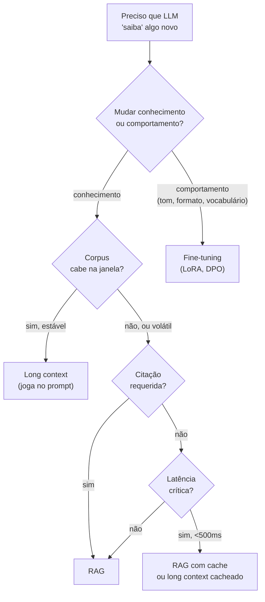
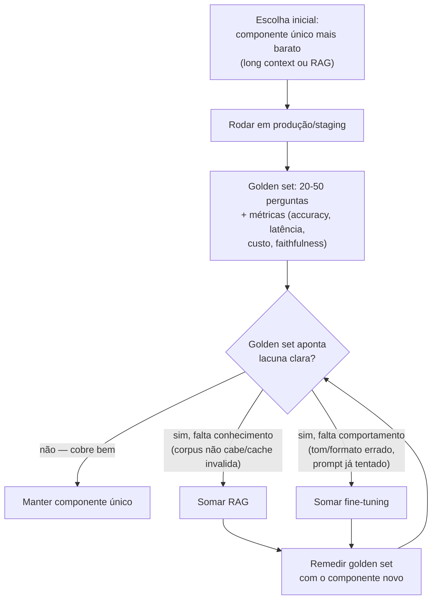

# RAG vs long context vs fine-tuning

> [!abstract] TL;DR
> Três caminhos para fazer [[Dicionário de IA#LLM (Large Language Model)|LLM]] "saber seus dados": **[[Dicionário de IA#RAG (Retrieval-Augmented Generation)|RAG]]** (busca em runtime), **long context** (joga tudo no prompt), **[[Dicionário de IA#fine-tuning|fine-tuning]]** (treina modelo). Não competem — resolvem problemas diferentes. Long context vence em corpus pequeno e estável. RAG vence em corpus grande, dinâmico, com requisito de citação. Fine-tuning vence em mudar **comportamento**, não conhecimento. **Híbridos são comuns:** fine-tuning de tom + RAG de fatos é padrão maduro em 2026.

> [!question]- Quando long context supera RAG?
> Long context vence quando o corpus é pequeno, estável e cabe na janela com custo aceitável — especialmente com prompt caching, que elimina o custo de retransmitir o mesmo contexto a cada query. O ponto de virada acontece quando o corpus cresce além de ~200K tokens úteis (context rot deteriora a atenção do modelo) ou quando atualização frequente invalida o cache e reverte a vantagem de custo. A regra prática: se você consegue cachear o contexto inteiro e o corpus não muda mais que uma vez por semana, long context ganha em simplicidade e latência; caso contrário, RAG escala melhor.

## A confusão comum

> *"Devo usar RAG ou fine-tuning?"*

Pergunta errada. Os dois resolvem problemas diferentes:

- **RAG** adiciona **conhecimento factual** ao LLM
- **Fine-tuning** muda **comportamento** do LLM

Não é "ou", é "qual problema você tem".

## Comparativo

| Aspecto | RAG | Long context | Fine-tuning |
|---|---|---|---|
| **O que muda** | Adiciona conhecimento | Adiciona conhecimento | Muda comportamento + estilo |
| **Custo upfront** | Baixo (indexar) | Zero | Alto (treino) |
| **Custo por query** | Médio ([[Dicionário de IA#retrieval\|retrieval]] + tokens) | Alto (muitos tokens) | Baixo |
| **Frescor** | Atualizar = re-indexar | Mudar prompt | Re-treinar |
| **Citação** | Direta | Frágil | Não suporta |
| **Multi-tenant** | Filtrar por user_id | Difícil | Modelo por tenant é caro |
| **Quando vence** | Corpus grande, dinâmico | Corpus pequeno e estável | Estilo, tom, formato |

## Decision tree



## Long context — quando vence

✅ Corpus pequeno e **estável** (manual, FAQ pequeno) ✅ Latência <500ms importa (sem round-trip de retrieval) ✅ Multi-hop reasoning (LLM pode "ver tudo" e juntar) ✅ Modelo top de gama com prompt caching ([[Economia de Tokens|05 - Prompt caching na prática]])

> [!example] Caso real
> SaaS de devops com 50K tokens de docs internas. Joga tudo no prompt + cache. Latência 600ms. Custo $0.03/query (cached). Sem RAG infra para manter.
>
> Conta cresce → muda para RAG.

❌ **Cuidado com context rot:** [[Dicionário de IA#Context window|janela]] de 1M tokens não significa qualidade em 1M tokens (ver [[Context Engineering|03 - Context rot e atenção diluída]]).

## RAG — quando vence

✅ Corpus grande (>200K tokens) ou crescendo ✅ Atualização frequente (docs mudam toda semana) ✅ **Citação obrigatória** (compliance, auditabilidade) ✅ Multi-tenant (cada user tem dados) ✅ Volume alto (RAG é mais barato por query que long context)

> [!example] Caso real
> Suporte interno de empresa com 10K artigos. Indexa em pgvector. 1000 queries/dia. Custo $30/mês. Atualizações = re-indexar artigo modificado.

## Fine-tuning — quando vence

✅ **Tom e estilo** específicos (formal jurídico, conciso técnico, brand voice) ✅ Vocabulário de domínio que LLM base não tem ✅ Formato de output rígido (sempre estrutura X) ✅ Latência crítica + custo (modelo menor + fine-tune > modelo grande + prompt) ✅ Compliance que exige modelo controlado (não cloud)

> [!example] Caso real
> Empresa legal com 100K pareceres formatados de jeito específico. Fine-tune de Llama 70B com LoRA. Modelo gera no estilo certo sem precisar few-shot gigante.

❌ **Não use fine-tuning para "ensinar fatos novos":**

- Custa caro
- Atualização = re-treinar
- Não funciona bem (knowledge fica difuso)
- Use RAG

## Híbridos — o padrão maduro

```
Fine-tune (tom + formato) + RAG (fatos)
```

Exemplo: assistente legal que usa **modelo fine-tuned em estilo formal jurídico** + **RAG sobre jurisprudência atualizada**. Cada componente faz o que faz bem.

```
Long context + Fine-tune
```

Modelo fine-tuned com long context window estendida pré-treinado em domain corpus. Custo: alto. Use case: domínios fechados (medicine, legal).

> [!question]- "Por que não começar direto com o híbrido, se ele é o padrão maduro?"
> Porque "padrão maduro" descreve onde sistemas em produção **terminam**, não onde eles **começam**. Adotar fine-tune + RAG no dia 1 é comprar dois custos fixos (pipeline de treino recorrente + infra de indexação) antes de saber se algum dos dois resolve o problema sozinho. É dívida técnica disfarçada de sofisticação: cada componente extra é superfície a manter — versionamento de modelo fine-tuned, re-treino quando o tom "desvia", *e* re-indexação, avaliação de retrieval, tuning de reranking. Se o RAG puro já cobre 90% do golden set, o fine-tuning vira custo permanente pago por um ganho marginal que ninguém mediu. A pergunta certa não é "qual é o padrão maduro", é "qual componente eu tenho evidência de que preciso agora".

O caminho até o híbrido segue um fluxo de decisão, não uma escolha de arquitetura de uma vez só:

**1. Escolha inicial — o componente mais simples que pode funcionar.** Comece com o approach de menor custo operacional que cobre a *maior* fatia do requisito: long context se o corpus cabe e é estável; RAG se o corpus é grande ou dinâmico. Fine-tuning **nunca** é o ponto de partida — ele resolve comportamento, e comportamento ruim geralmente é sintoma de prompt mal desenhado, não de modelo errado. Rode esse componente único em produção (ou staging avançado) antes de cogitar somar outro.

**2. Golden set — meça antes de adicionar peça.** Construa um golden set de 20-50 perguntas representativas do uso real, com respostas de referência revisadas por humano. Rode o componente único contra ele e registre accuracy, faithfulness, latência p95 e custo por query (mesmas métricas da tabela "Métricas para comparar" acima). Esse número é a linha de base — sem ele, qualquer decisão de adicionar um segundo componente é opinião, não dado. Repita a medição a cada mudança de arquitetura; o golden set é o critério de aceite, não um teste que se roda uma vez e se esquece.

**3. Critério de adição de componente — só some o que o golden set provou que falta.** Adicione RAG a um sistema de long context quando o corpus golden set expõe perguntas que exigem informação fora do que cabe/foi cacheado, ou quando a citação se torna requisito (compliance). Adicione fine-tuning a um sistema de RAG quando o golden set mostra respostas **factualmente corretas mas no tom/formato errado** de forma consistente — e você já tentou resolver via prompt engineering e few-shot sem sucesso. Se o golden set não distingue as falhas por causa (não sabe o fato vs. sabe o fato mas erra o tom), o diagnóstico está incompleto; volte para a etapa 2 antes de somar arquitetura.

> [!summary] Fluxo em uma frase
> Escolha o componente único mais barato → meça contra um golden set → só some o próximo componente quando o golden set apontar exatamente qual lacuna (conhecimento vs. comportamento) ele resolve.



O ciclo é **iterativo**: cada componente novo volta pro golden set antes de considerar somar o próximo. Isso evita a armadilha de empilhar arquitetura em resposta a uma sensação de "ainda não está bom" sem isolar qual parte do sistema está falhando.

| Sinal no golden set | Causa provável | Componente a somar |
|---|---|---|
| Resposta erra o fato, mas o tom está certo | Conhecimento ausente ou desatualizado | RAG |
| Resposta acerta o fato, mas o tom/formato está errado (mesmo com few-shot) | Comportamento do modelo base | Fine-tuning |
| Resposta erra o fato **e** o tom | Diagnóstico incompleto — dois problemas misturados | Isolar: medir tom e fato separadamente antes de somar qualquer componente |
| Accuracy cai quando o corpus cresce além do que cabe no prompt | Limite de long context (context rot) | RAG |
| Latência p95 sobe com o crescimento do corpus em long context | Reprocessamento de contexto sem cache eficaz | RAG ou cache mais agressivo antes de RAG |

Esse fluxo evita duas armadilhas simétricas: parar cedo demais no componente único (aceitando uma lacuna que o golden set já provou existir) e somar componente cedo demais (pagando custo permanente por um ganho não medido). Ambas custam caro — a primeira em qualidade percebida pelo usuário, a segunda em manutenção de infraestrutura que ninguém revisita.

> [!example] Aplicando o fluxo — assistente legal
> Retomando o caso do parecer jurídico: a equipe **não** começou com fine-tune + RAG. Primeiro passo foi RAG puro sobre a jurisprudência (conhecimento grande e dinâmico venceu de cara — regra da seção "RAG — quando vence"). Golden set de 30 perguntas revisadas por um advogado sênior mostrou accuracy factual de 88%, mas 60% das respostas saíam em tom "conversacional", fora do padrão formal exigido pelos pareceres. Prompt engineering (few-shot com 5 exemplos de estilo) reduziu o problema, mas não eliminou — o padrão de citação processual continuava inconsistente. Só nesse ponto, com o golden set isolando "fato certo, forma errada" como causa dominante, a equipe fez fine-tune do modelo em cima do RAG existente. Resultado: accuracy factual manteve-se em 88% (o RAG já resolvia isso), conformidade de formato subiu de 40% para 92%. O fine-tuning não teria sido justificável sem esse número.

> [!warning] Time sem capacidade de manter golden set
> Se ninguém no time vai revisar e atualizar o golden set periodicamente, o fluxo acima colapsa de volta em opinião — a mesma armadilha do anti-pattern "comparar approaches sem golden set". Nesse cenário, prefira manter o componente único mais simples pelo maior tempo possível: um sistema RAG-only mal medido ainda é mais previsível de operar do que um híbrido fine-tune + RAG sem instrumentação para justificar por que os dois existem.

Esse é o mesmo raciocínio por trás do anti-pattern "híbrido prematuro" listado abaixo: a etiqueta "padrão maduro" não é permissão para pular a etapa de evidência — é a descrição do estado final de quem já passou por ela.

## Custo comparativo (1000 queries/dia, corpus 50MB)

| Approach | Setup | Custo/mês |
|---|---|---|
| **Long context (com cache)** | $0 | ~$50-200 |
| **RAG (pgvector + Cohere Rerank + Sonnet)** | ~$200 | ~$80-300 |
| **Fine-tune (LoRA Llama-70B + RAG)** | $500-2000 | ~$200-500 |

O salto de custo entre a linha "RAG" e a linha "Fine-tune + RAG" nesta tabela é o preço concreto do híbrido — e é exatamente o número que o fluxo de golden set da seção anterior serve para justificar antes de pagar.

O setup de $500-2000 do fine-tune não é só o treino em si: inclui coleta e limpeza do dataset de treino, infraestrutura de re-treino recorrente e validação de regressão a cada nova versão do modelo base. Esse custo fixo é o que o golden set precisa justificar — não o custo/mês recorrente, que tende a cair com volume.

Na prática, times subestimam a validação de regressão: cada re-treino do modelo fine-tuned exige rodar o golden set de novo antes do deploy, porque uma nova versão pode corrigir o tom e, sem querer, degradar accuracy factual que dependia do RAG continuar bem integrado ao pipeline.

Esse é o custo invisível que raramente aparece na estimativa inicial de orçamento — e mais um motivo pra não somar o componente sem prova prévia de necessidade.

Long context é **mais barato** em volume baixo. RAG escala melhor. Fine-tune tem ganhos qualitativos não-financeiros.

## Tabela de decisão prática

| Cenário | Recomendado |
|---|---|
| Chatbot de FAQ com 100 perguntas | Long context |
| Suporte com 10K artigos | RAG |
| Assistente médico com guidelines + citações | RAG |
| Bot de marketing com brand voice | Fine-tune |
| Code review em estilo de empresa | Fine-tune + RAG (codebase) |
| Tradutor especializado em jargão técnico | Fine-tune |
| Customer support multilíngue | RAG (multilingual embeddings) |
| Análise de docs financeiros novos | RAG (frescor) |

## Quando NÃO faz fine-tuning

- Tem <1000 exemplos de treino → RAG ou prompt engineering
- Goal é "saber fatos" → RAG
- Modelo base se sai >85% bem em prompts → não vale o custo
- Time não tem expertise em treino → terceiriza ou pula

## Quando NÃO faz RAG

- Pergunta requer info não-textual (visualização, cálculo numérico)
- Corpus tem <50 entradas e cabe no prompt → long context
- Latência crítica e queries são repetitivas → cache + long context

## Quando NÃO faz long context

- Corpus muda mais que 1x/semana (cache invalida)
- >200K tokens (context rot real)
- Citação obrigatória (long context cita pouco bem)

## Métricas para comparar

Compare experimentalmente em **golden set**:

| Métrica | Long context | RAG | Fine-tune |
|---|---|---|---|
| Accuracy (golden Q&A) | medir | medir | medir |
| Latência p95 | medir | medir | medir |
| Cost/query | medir | medir | medir |
| Faithfulness | medir | medir | medir |
| Citation accuracy | n/a | medir | n/a |

Isolar a causa de cada falha (conhecimento vs. comportamento) é o que transforma esse golden set em critério de adição de componente, e não só em placar geral:

- **Separe as perguntas por tipo de falha esperada.** Um subconjunto testa só recall factual (o modelo sabe o dado?); outro testa só forma (o modelo responde no tom/formato certo, dado que o fato já está no contexto?). Misturar os dois numa métrica única esconde qual componente precisa de reforço.
- **Rode o golden set a cada mudança de arquitetura**, não só uma vez no início — adicionar RAG ou fine-tuning pode melhorar uma métrica e degradar outra (ex: RAG reduz custo mas pode piorar latência se o reranking for caro).
- **Guarde o histórico de execuções do golden set** (não só o resultado mais recente) — é o que permite justificar, depois, por que o híbrido foi adotado e não outra combinação.

## Anti-patterns

- **"Vou fine-tunar pra LLM saber meus dados"** — uso errado
- **"RAG vai dar latência" sem medir** — superstição
- **Long context sem caching** — desperdício
- **Hibrido prematuro** (fine-tune + RAG) sem provar que cada componente vale
- **Comparar approaches sem golden set** — opinião, não dado

## Armadilhas comuns

> [!warning] Fine-tuning para ensinar fatos
> É o erro mais comum: o time quer que o modelo "saiba" os documentos internos e parte direto para fine-tuning porque parece mais definitivo. Na prática, fine-tuning codifica padrões de comportamento, não fatos declarativos. O conhecimento fica difuso nos pesos, não endereçável, e qualquer atualização exige re-treino completo. Use RAG para fatos; use fine-tuning para tom, formato e vocabulário de domínio.

> [!warning] Comparar abordagens sem golden set
> "O long context pareceu melhor" e "RAG deu resposta mais rápida" são observações anedóticas. Sem golden set com perguntas representativas e métricas definidas (accuracy, latência, custo por query), você está otimizando intuição. Qualquer decisão entre RAG, long context e fine-tuning deve ter número por trás — mesmo que um golden set rápido de 20-30 perguntas representativas.

> [!warning] Híbrido prematuro sem provar os componentes
> Fine-tune + RAG é o padrão maduro, mas adotar os dois de início sem evidência de que cada componente vale é engenharia por ansiedade. Comece com long context ou RAG puro; adicione fine-tuning só quando tiver dado concreto de que o comportamento base está prejudicando o output e que prompts sozinhos não resolvem.

## O que vem a seguir

Com o mapa de decisão entre RAG, long context e fine-tuning, você sabe quando RAG é a escolha certa. Mas RAG não é um monolito — quando o pipeline básico não alcança a qualidade necessária, existem padrões avançados que ampliam o que é possível: retrieval multi-hop, Graph RAG para domínios com entidades relacionadas, e Agentic RAG para queries de complexidade variável.

- [[11 - Padrões avançados — Graph RAG, Agentic RAG, multi-hop]] — quando vanilla RAG não resolve e como escalar para os 20% de casos mais difíceis

## Como explicar em inglês

Choosing between RAG, long context, and fine-tuning is a common interview question that trips up candidates who treat them as competing alternatives. The key insight is that they solve fundamentally different problems: RAG and long context both add knowledge at inference time, while fine-tuning modifies the model's behavior and style at training time. The practical consequence is that "should I RAG or fine-tune?" is almost always the wrong question — the right question is "what's missing: knowledge or behavior?"

Long context wins when the corpus is small, stable, and can be loaded into the prompt with caching enabled. RAG wins when the corpus is large, frequently updated, or requires traceable citations. Fine-tuning wins when you need consistent tone, domain-specific vocabulary, or rigid output formats that prompting alone can't produce reliably. The mature pattern in 2026 is the hybrid: a fine-tuned model for behavior, RAG for facts.

**In a technical interview**, you might say:

> "I evaluate all three against a golden set before committing. Long context is my first attempt for small corpora — if I can fit the knowledge with caching, I avoid the infra overhead of RAG. When the corpus exceeds roughly 200K useful tokens or updates frequently, RAG scales better. Fine-tuning is off the table unless I need consistent tone or output format that prompts alone can't reliably produce — it's expensive to update and doesn't handle factual recall as well as retrieval does. The hybrid of fine-tuned style plus RAG facts is the pattern I've seen work best in production for legal and medical domains."

| PT | EN |
|----|-----|
| Contexto longo | Long context |
| Ajuste fino | Fine-tuning |
| Atualização do corpus | Corpus update |
| Cache de prompt | Prompt caching |
| Degradação de atenção | Context rot |
| Tom e estilo | Tone and style |
| Vocabulário de domínio | Domain vocabulary |
| Custo por query | Cost per query |
| Combinação híbrida | Hybrid approach |
| Raciocínio multi-hop | Multi-hop reasoning |

## Veja também

- [[01 - O que é RAG e quando usar]]
- [[09 - Evaluation de RAG]]
- [[Anatomia dos LLMs|14 - Fine-tuning vs prompting vs RAG]]
- [[Anatomia dos LLMs|16 - Como LLMs são treinados — pretraining, SFT, RLHF]]
- [[Economia de Tokens|05 - Prompt caching na prática]]
- [[Context Engineering|03 - Context rot e atenção diluída]]

## Referências

- **OpenAI** — [*Fine-tuning guide*](https://platform.openai.com/docs/guides/fine-tuning) (2024). Quando fine-tuning vale o custo vs. RAG/prompt engineering.
- **Anthropic** — [*Context windows*](https://docs.anthropic.com/en/docs/build-with-claude/context-windows) (2026). Mecânica de janela de contexto, prompt caching e limites práticos de long context.
- **Eugene Yan** — [*Patterns for Building LLM-based Systems & Products*](https://eugeneyan.com/writing/llm-patterns/) (2024). Padrões de retrieval-augmentation, fine-tuning e avaliação com golden set.
- **Chip Huyen** — [*AI Engineering*](https://ai-engineering.ai/) (2025), capítulos sobre customization (RAG, fine-tuning e agentes).
