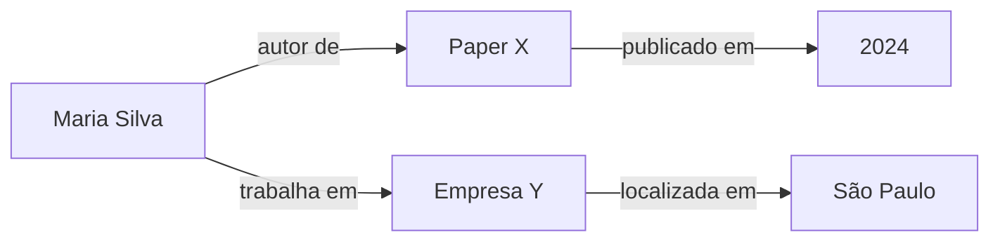
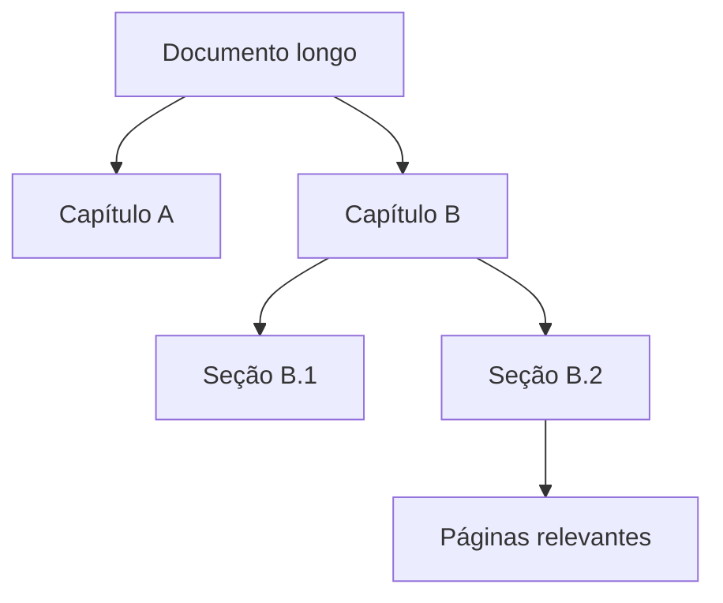
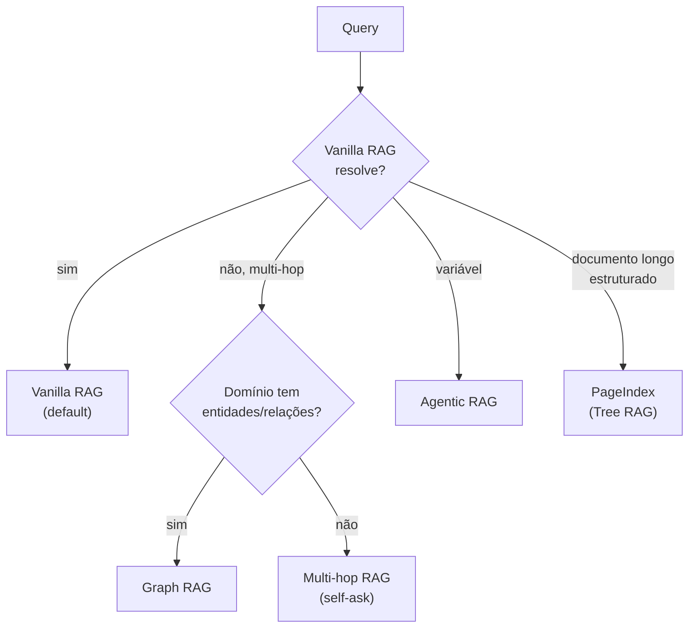

# Padrões avançados — Graph RAG, Agentic RAG, multi-hop

> [!abstract] TL;DR
> [[Dicionário de IA#RAG (Retrieval-Augmented Generation)|RAG]] vanilla resolve ~80% dos casos. Para os 20% restantes, padrões avançados: **Multi-hop RAG** (resposta requer juntar 2+ chunks via passos sequenciais), **Graph RAG** (Microsoft, indexa entidades e relações em knowledge graph para queries complexas), **Agentic RAG** ([[Dicionário de IA#Agent|agent]] decide iterativamente quando/o que buscar) e **Vectorless / Tree RAG** (PageIndex, navegação hierárquica por documento). **Custo cresce significativamente** — só use quando RAG simples falha. Default: tente [[Dicionário de IA#hybrid search|Hybrid]] + [[Dicionário de IA#reranking|Rerank]] antes de partir para complexidade.

> [!question]- Por que Graph RAG não é a solução padrão se é tão poderoso?
> Porque o custo de indexação é uma ordem de magnitude maior que RAG vetorial: extrair entidades com NER + LLM, construir relações, clusterizar communities e sumarizar cada uma gera dezenas de chamadas de LLM por documento. Para um corpus de 1000 docs, o índice de Graph RAG pode custar $50-200 só para ser construído — e precisa ser reconstruído quando o corpus muda. Isso é racional para domínios ricos em relações (legal, médico, inteligência de negócios) onde RAG vetorial falha consistentemente. Para a maioria dos casos, chunking bem feito + hybrid search + rerank resolve sem esse custo.

## Quando RAG vanilla falha

Sintomas que indicam padrão avançado:

- Pergunta requer juntar **2+ chunks de docs diferentes** (multi-hop)
- Pergunta sobre **relacionamentos** ("quais empresas são fornecedoras de X que estão na Europa?")
- Pergunta exige **exploração** ("encontre todos os pacientes com sintoma Y após 2024")
- Single [[Dicionário de IA#retrieval|retrieval]] **não cobre** mesmo com hybrid+rerank
- Documento é longo e estruturado, mas [[Dicionário de IA#chunking|chunking]] destrói a hierarquia (contratos, relatórios, manuais)

## Multi-hop RAG

Pergunta que requer **N retrievals sequenciais**, onde cada retrieval usa info do anterior.

```
Q: "Em qual empresa trabalha o autor do paper X de 2024?"

Hop 1: encontre paper X de 2024 → "autor: Maria Silva"
Hop 2: encontre info sobre "Maria Silva" → "trabalha em Empresa Y"
A: "Empresa Y"
```

Vanilla RAG falha porque:
- Top-k do "paper X" tem o autor, mas não a empresa
- Top-k do "Maria Silva" pode não estar relacionado se a query inicial é sobre paper

### Implementação

**Padrão decomposition:**

```python
def multi_hop_rag(question):
    # 1. Decompor em sub-questions
    sub_qs = llm.decompose(question)
    # ["Quem é autor do paper X?", "Onde trabalha esse autor?"]

    answers = []
    for sub_q in sub_qs:
        # 2. RAG normal em cada sub-question
        chunks = retrieve(sub_q)
        answer = generate(sub_q, chunks)
        answers.append(answer)

        # 3. Próxima sub-question pode usar answer anterior
        sub_q_next = llm.refine(sub_q_next, previous_answer=answer)

    # 4. Sintetizar
    return llm.synthesize(question, answers)
```

**Padrão self-ask (mais elegante):**

```
Q: Em qual empresa trabalha autor do paper X?
Self-ask: Quem é o autor do paper X?
[retrieve...]
Self-answer: Maria Silva.
Self-ask: Onde trabalha Maria Silva?
[retrieve...]
Self-answer: Empresa Y.
Final: Empresa Y.
```

### Custo

3-5x query single. Latência multiplicada. Use só quando necessário.

## Graph RAG (Microsoft GraphRAG)

Em vez de chunks soltos, **knowledge graph** de entidades e relações.



### Como funciona

**Indexing:**
1. Parse docs e extrai entidades (NER + LLM)
2. Extrai relações entre entidades
3. Constrói grafo
4. Cluster por communities (Leiden algorithm)
5. Sumariza cada community

**Query:**
1. Pergunta → identifica entidades mencionadas
2. Localiza no grafo
3. Expande N hops a partir das entidades
4. Recupera community summaries relevantes
5. Genera resposta

### Quando usar Graph RAG

✅ Domínio com entidades e relações claras (legal, medical, scientific, business intelligence)
✅ Queries comparativas ou agregativas
✅ Dataset ≥1000 documentos com riqueza relacional

❌ Texto livre sem entidades (literatura, opiniões)
❌ Dataset pequeno (overhead não compensa)
❌ Time sem expertise em knowledge graphs

### Tools

- **Microsoft GraphRAG** — implementação oficial open source
- **Neo4j + LLM** — knowledge graph clássico
- **LlamaIndex KnowledgeGraphIndex** — building block
- **Graphiti (Zep)** — temporal knowledge graph

## Agentic RAG

Agent decide **quando** e **o quê** buscar — em vez de pipeline fixo.

```python
# Pipeline fixo (vanilla)
chunks = retrieve(query)
answer = generate(query, chunks)

# Agentic
agent = Agent(tools=[search, expand_search, read_doc])
answer = agent.run(query, max_steps=10)
# Agent decide: buscar primeiro? expandir? ler doc específico?
```

### Vantagens

- Adapta a queries de complexidade variável
- Pode "perceber" que precisa buscar mais
- Permite refinamento iterativo
- Multi-hop natural

### Desvantagens

- Custo alto (múltiplos LLM calls)
- Latência alta (não é one-shot)
- Difícil de debugar
- Pode entrar em loops

### Quando usar

✅ Queries variadas (alguns simples, outros complexos)
✅ Resultados podem ser refinados iterativamente
✅ Time tem expertise com agents ([[Anatomia de Agents]])

❌ Queries sempre similares (pipeline fixo é mais barato)
❌ Latência crítica
❌ Compliance exige resposta determinística

Detalhes em [[Context Engineering|06 - Dynamic retrieval beyond RAG]].

## Vectorless / Tree RAG (PageIndex)

Em documentos longos e estruturados, a falha nem sempre é "preciso de mais [[Dicionário de IA#embedding|embeddings]]"; muitas vezes é "o chunking destruiu o mapa do documento". **PageIndex** organiza o documento como uma árvore tipo table of contents e usa o LLM para navegar essa árvore por raciocínio. A pergunta deixa de ser "quais chunks são parecidos com a query?" e vira "qual ramo do documento contém a informação relevante?".



### Quando usar

✅ PDFs longos com estrutura real (financeiro, jurídico, regulatório, acadêmico, manuais técnicos)
✅ Citação por página/seção importa
✅ Similaridade vetorial traz trechos parecidos mas não decisivos
✅ Corpus controlado onde operar uma árvore por documento é aceitável

❌ Corpus enorme de snippets curtos
❌ Conteúdo sem hierarquia
❌ Latência crítica
❌ Quando o problema é memória conversacional, não retrieval documental

Detalhes em [[13 - PageIndex — RAG vectorless por árvore de documentos]].

## Comparativo de custo

```
Vanilla RAG:        1 retrieval + 1 generation = $0.005
Multi-hop RAG:      3 retrievals + 3 generation = $0.015 (3x)
Graph RAG:          1 retrieval + 1 generation = $0.005 (mas indexing é 5-10x mais caro)
Agentic RAG:        5-10 LLM calls + tools = $0.020-0.050 (4-10x)
PageIndex:          tree build + tree search = custo concentrado no index e calls de navegação
```

## Hybrid de patterns

Padrão maduro: **Vanilla RAG + Agentic fallback**.

```python
def smart_rag(query):
    # 1. Tentar vanilla
    chunks = retrieve(query)
    answer = generate(query, chunks)

    # 2. Se confidence baixa, escalar para agentic
    if confidence(answer, chunks) < 0.7:
        answer = agentic_rag(query)

    return answer
```

90% das queries pegam vanilla (rápido, barato). 10% caem em agentic (lento mas resolve).

## Decision tree



## Anti-patterns

- **Graph RAG em corpus pequeno** — overhead enorme sem ganho
- **Agentic RAG sempre** — custo escala assustadoramente
- **Multi-hop sem evaluation** — não sabe se está melhorando
- **PageIndex em corpus sem estrutura** — cria árvore artificial que não ajuda retrieval
- **"Vamos fazer Graph RAG porque é cool"** — sem evidência de que vanilla falha
- **Hybrid sem confidence threshold** — escala sem critério

## Quando ficar no vanilla

> [!tip] Princípio de simplicidade
> *"Vanilla RAG bem feito (chunking + hybrid + rerank) resolve 80%+ dos casos. Padrões avançados são para os 20% restantes — não para o conjunto inteiro."*
>
> Investir em **chunking estrutural + hybrid retrieval + Cohere Rerank + golden set** é maior ROI que partir direto para Graph RAG.

## Métricas

| Métrica | Vanilla | Multi-hop | Graph RAG | Agentic |
|---|---|---|---|---|
| Cost/query | $0.005 | $0.015 | $0.005 + indexing pesado | $0.02-0.05 |
| Latência p95 | 1-3s | 3-8s | 1-4s | 5-15s |
| Recall em multi-hop | <50% | >80% | >85% | >85% |
| Setup complexity | Baixa | Média | Alta | Alta |

PageIndex não entra bem nessa tabela porque mede outro eixo: navegação dentro de documento longo. Compare contra baseline de long-context, chunking estrutural e hybrid+rerank no mesmo corpus.

## Armadilhas comuns

> [!warning] Graph RAG em corpus pequeno ou sem entidades
> O custo fixo de construir o knowledge graph — NER, extração de relações, clustering, sumarização de communities — é difícil de justificar para menos de 500 documentos. Pior ainda em texto sem estrutura relacional clara: literatura, opiniões, logs de suporte. A armadilha clássica é escolher Graph RAG pela sofisticação antes de verificar se o domínio tem entidades e relações reais que o grafo vai capturar.

> [!warning] Agentic RAG sem timeout e confidence threshold
> Um agent que decide iterativamente quando buscar pode entrar em loops de refinamento indefinidos — a cada retrieval "suficiente", decide que precisa de mais contexto. Sem limite de steps e sem confidence threshold para encerrar o ciclo, você paga N chamadas de LLM para responder perguntas simples. A solução é sempre começar com vanilla RAG e escalar para agentic só quando a confidence do vanilla fica abaixo de threshold.

> [!warning] Multi-hop sem avaliação específica
> Multi-hop RAG soa como uma melhoria automática, mas sem golden set de perguntas multi-hop você não tem como saber se está melhorando. O recall pode subir em queries compostas e cair em queries simples (decomposição desnecessária introduz ruído). Crie uma categoria explícita de perguntas multi-hop no seu golden set e meça contexto precision/recall por categoria.

## O que vem a seguir

Com o mapa dos padrões avançados, você tem a caixa de ferramentas completa do RAG. O próximo passo é concreto: colocar tudo em produção com um checklist estruturado que cobre desde a indexação básica até observabilidade e fallback. A nota a seguir fecha a trilha com esse roadmap operacional de 8 semanas.

- [[12 - Setup completo — checklist de produção]] — roadmap de 4 fases para ir do protótipo ao RAG em produção com observabilidade, eval em CI e custo previsível

## Como explicar em inglês

Advanced RAG patterns exist to solve problems that vanilla RAG cannot handle reliably: questions that require combining information from multiple documents (multi-hop), queries over domains with rich entity relationships (Graph RAG), and situations where the complexity of queries varies so much that a fixed pipeline is wasteful (Agentic RAG). The key decision framework is: start with vanilla RAG with good chunking, hybrid search and reranking, and only escalate when you have concrete evidence — from evaluation metrics — that vanilla is failing on a specific class of queries.

Graph RAG is powerful for domains like legal, medical, and business intelligence where the relationships between entities (companies, people, regulations, events) carry as much information as the text itself. But the indexing cost is substantial: building the knowledge graph requires extracting entities and relations with LLMs, clustering communities, and generating summaries — work that must be repeated whenever the corpus changes. Agentic RAG solves a different problem: when query complexity is unpredictable, letting an agent decide how many retrieval steps to execute is more efficient than always running the full pipeline. The tradeoff is latency and cost on complex queries, offset by savings on simple ones.

**In a technical interview**, you might say:

> "My default is vanilla RAG with hybrid search and Cohere reranking. I escalate to advanced patterns only when evaluation shows consistent failure on a specific query type. For domains with strong entity relationships — legal or medical — Graph RAG makes sense because the knowledge graph captures connections that pure semantic search misses. For varied query complexity, I implement an Agentic fallback: vanilla RAG runs first; if confidence falls below 0.7, the agent takes over with up to 5 steps. Multi-hop I handle with query decomposition: decompose into sub-questions, run RAG on each, then synthesize. The critical thing is having a golden set that covers each query type so I can actually measure whether the escalation is helping."

| PT | EN |
|----|-----|
| Grafo de conhecimento | Knowledge graph |
| Extração de entidades | Named entity recognition (NER) |
| Recuperação multi-salto | Multi-hop retrieval |
| Agente de RAG | Agentic RAG |
| Decomposição de query | Query decomposition |
| Cluster de comunidade | Community cluster |
| Sumário de comunidade | Community summary |
| Limiar de confiança | Confidence threshold |
| Busca hierárquica | Hierarchical retrieval |
| Auto-pergunta | Self-ask |

## Veja também

- [[02 - Anatomia do pipeline RAG]]
- [[06 - Retrieval — hybrid search, BM25, query rewriting]]
- [[09 - Evaluation de RAG]]
- [[13 - PageIndex — RAG vectorless por árvore de documentos]]
- [[Anatomia de Agents|01 - O que é um agent]]
- [[Context Engineering|06 - Dynamic retrieval beyond RAG]]
- [[Memória de Agentes|12 - graphify — knowledge graph de raw]]
- [[Memória de Agentes|16 - Zep e Graphiti — knowledge graph temporal]]

## Referências

- **Microsoft** — *GraphRAG* (microsoft.github.io/graphrag, 2024)
- **Edge et al.** — *From Local to Global: A Graph RAG Approach* (paper 2024)
- **Press et al.** — *Self-Ask paper* (2022)
- **LlamaIndex** — *Multi-document agents* (2026)
- **Zep** — *Graphiti documentation* (2026)
- **VectifyAI** — *PageIndex: Vectorless, Reasoning-based RAG* (`github.com/VectifyAI/PageIndex`, 2026)
