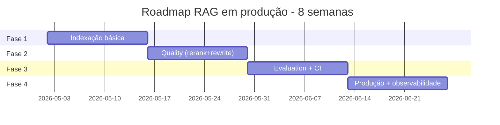

# Setup completo — checklist de produção

> [!abstract] TL;DR
> Esta nota fecha a trilha com o checklist end-to-end para colocar [[Dicionário de IA#RAG (Retrieval-Augmented Generation)|RAG]] em produção. Stack base: pgvector + Cohere Rerank + Sonnet + Ragas + [[Dicionário de IA#Langfuse|Langfuse]]. Roadmap: 4 fases × 2 semanas. Saída: RAG funcional com observabilidade, evaluation em CI, fallback, citação obrigatória, custo previsível. Pular fases = retrabalho. **Investimento total: ~6-8 semanas part-time.**

> [!question]- Por que a ordem do checklist importa?
> Porque cada fase depende do resultado da anterior: você não pode medir regressão em CI (Fase 3) se não tem golden set — e não sabe o que incluir no golden set se não viu o sistema falhar em produção real. Pior, adicionar observabilidade (Fase 4) antes de resolver qualidade (Fase 2) é monitorar um sistema ruim com mais detalhes. A ordem não é burocracia — é dependência técnica: retrieval funcional → qualidade medida → regressão detectada → produção com confiança.

É comum o RAG "funcionar" em dev e quebrar em produção sem que o código mude uma linha. O protótipo roda bem porque as queries de teste são fáceis, o provider de rerank nunca cai numa demo de 10 minutos, e ninguém mede faithfulness porque "dá pra ver que a resposta está certa" olhando a tela. Em produção, esses três privilégios desaparecem ao mesmo tempo: queries reais são mais variadas e ambíguas do que qualquer conjunto de teste manual, um provider externo eventualmente falha (SLA <100% é regra, não exceção), e ninguém está olhando cada resposta — só o dashboard, se existir. Sem fallback e sem evaluation automatizada, a primeira regressão de qualidade — um chunker que mudou, um prompt que "melhorou" um caso e piorou outros dez — só aparece quando o usuário reclama. O checklist abaixo existe para que essas duas lacunas (fallback, evaluation) sejam resolvidas antes de virarem incidente, não depois.

## Stack recomendada (2026)

```
┌────────────────────────────────────────────────────────────┐
│  1. Parsing:        unstructured / Docling / pypdf         │
│  2. Chunking:       LangChain RecursiveCharacterTextSplitter│
│  3. Embedding:      OpenAI text-embedding-3-large          │
│  4. Vector DB:      pgvector (Postgres)                    │
│  5. Hybrid search:  pgvector + ts_vector (BM25)            │
│  6. Reranking:      Cohere Rerank-3                         │
│  7. Generation:     Anthropic Claude Sonnet 4.6            │
│  8. Evaluation:     Ragas + golden set                     │
│  9. Observability:  Langfuse                               │
│  10. Tracing:       OpenTelemetry                          │
└────────────────────────────────────────────────────────────┘
```

Custo total típico: **$50-200/mês** para 100K queries.

## Roadmap de 4 fases



## Fase 1 — Indexação básica (semanas 1-2)

**Objetivo:** ter RAG mínimo funcional.

### Checklist

- [ ] Coletar documentos representativos (start: 100-1000)
- [ ] Parser que extrai texto preservando estrutura
- [ ] [[Dicionário de IA#chunking|Chunking]] recursivo (500-1000 tokens, 10% overlap)
- [ ] Validação manual de 10 amostras de chunks
- [ ] Postgres com extension `vector` instalada
- [ ] Schema com `chunks` table + `documents` table + metadata JSONB
- [ ] Index HNSW em embedding column
- [ ] Script de indexação idempotente
- [ ] [[Dicionário de IA#embedding|Embedding]] via OpenAI text-embedding-3-large
- [ ] Top-k vector search funcionando
- [ ] Generation com Sonnet 4.6 + system prompt restritivo
- [ ] Citação `[N]` no output

### Saída esperada

Demo funcional. Performance ainda tosca, mas ciclo completo end-to-end.

## Fase 2 — Quality (semanas 3-4)

**Objetivo:** subir qualidade do [[Dicionário de IA#retrieval|retrieval]].

### Checklist

- [ ] [[Dicionário de IA#BM25|BM25]] search (Postgres `ts_vector` ou Elasticsearch)
- [ ] [[Dicionário de IA#hybrid search|Hybrid retrieval]] com Reciprocal Rank Fusion (RRF)
- [ ] Cohere [[Dicionário de IA#reranking|Rerank]] em top-50 → top-5
- [ ] Query rewriting com LLM (system prompt curto, modelo barato)
- [ ] HyDE para queries vagas (opcional)
- [ ] Metadata filtering (data, tipo, tenant)
- [ ] Threshold de "não sei" baseado em rerank score
- [ ] Test manual de 20 queries em diferentes categorias

### Saída esperada

Recall@5 >70% em golden set. Citação correta >80%.

## Fase 3 — Evaluation + CI (semanas 5-6)

**Objetivo:** medir e prevenir regressão.

### Checklist

- [ ] Golden set de 50-100 queries com ground truth
- [ ] Ragas integrado: context_precision, recall, faithfulness, answer_relevance
- [ ] Categorias no golden set: factual, multi-hop, out-of-scope, adversarial
- [ ] Pipeline CI roda eval em PRs que tocam RAG
- [ ] Threshold mínimo bloqueia merge
- [ ] LLM-as-judge para faithfulness (Claude Opus ou GPT-5)
- [ ] Validação automática de citation accuracy
- [ ] Test de "out-of-scope": RAG diz "não sei" quando deveria
- [ ] Comparação A/B entre versões em ambiente staging

### Saída esperada

Eval automatizado funcionando. Métricas baseline registradas.

## Fase 4 — Produção (semanas 7-8)

**Objetivo:** deploy seguro com observabilidade.

### Checklist

- [ ] Langfuse integrado (trace de cada query)
- [ ] Dashboard: latência p95, cost/query, error rate, faithfulness
- [ ] Rate limiting per user
- [ ] Retry com backoff em falha de provider
- [ ] Fallback: se Cohere Rerank fail, segue sem rerank com warning
- [ ] Streaming response no frontend
- [ ] Citações clicáveis na UI
- [ ] Log estruturado: query, retrieved IDs, response, user_feedback
- [ ] Mecanismo de feedback (thumbs up/down)
- [ ] A/B test infra (variantes de prompt/modelo)
- [ ] Alert se faithfulness cair >5% em 24h
- [ ] Documentação operacional (runbook)
- [ ] Plan de re-indexação (semanal? on-change?)

### Saída esperada

RAG em produção com confiança. Time consegue debugar via Langfuse.

## Configuração-modelo (pgvector)

```sql
-- Extensão
CREATE EXTENSION IF NOT EXISTS vector;
CREATE EXTENSION IF NOT EXISTS pg_trgm;

-- Tabelas
CREATE TABLE documents (
    id BIGSERIAL PRIMARY KEY,
    source TEXT NOT NULL,
    title TEXT,
    metadata JSONB,
    indexed_at TIMESTAMPTZ DEFAULT NOW(),
    UNIQUE(source)
);

CREATE TABLE chunks (
    id BIGSERIAL PRIMARY KEY,
    doc_id BIGINT REFERENCES documents(id) ON DELETE CASCADE,
    text TEXT NOT NULL,
    text_search tsvector GENERATED ALWAYS AS (to_tsvector('portuguese', text)) STORED,
    embedding VECTOR(1536) NOT NULL,
    metadata JSONB,
    chunk_index INT,
    created_at TIMESTAMPTZ DEFAULT NOW()
);

-- Índices
CREATE INDEX idx_chunks_embedding ON chunks USING hnsw (embedding vector_cosine_ops);
CREATE INDEX idx_chunks_text ON chunks USING gin(text_search);
CREATE INDEX idx_chunks_doc_id ON chunks(doc_id);
CREATE INDEX idx_chunks_metadata ON chunks USING gin(metadata);
CREATE INDEX idx_documents_metadata ON documents USING gin(metadata);
```

## Hybrid retrieval (SQL)

```sql
WITH vector_search AS (
    SELECT
        id, text, doc_id, metadata,
        1 - (embedding <=> $1::vector) AS vector_score,
        ROW_NUMBER() OVER (ORDER BY embedding <=> $1::vector) AS vector_rank
    FROM chunks
    WHERE metadata @> $2  -- filter
    ORDER BY embedding <=> $1::vector
    LIMIT 50
),
bm25_search AS (
    SELECT
        id, text, doc_id, metadata,
        ts_rank(text_search, plainto_tsquery('portuguese', $3)) AS bm25_score,
        ROW_NUMBER() OVER (ORDER BY ts_rank(text_search, plainto_tsquery('portuguese', $3)) DESC) AS bm25_rank
    FROM chunks
    WHERE text_search @@ plainto_tsquery('portuguese', $3)
    LIMIT 50
)
SELECT
    COALESCE(v.id, b.id) AS id,
    COALESCE(v.text, b.text) AS text,
    -- RRF: 1/(60+rank)
    COALESCE(1.0 / (60 + v.vector_rank), 0) +
    COALESCE(1.0 / (60 + b.bm25_rank), 0) AS rrf_score
FROM vector_search v
FULL OUTER JOIN bm25_search b ON v.id = b.id
ORDER BY rrf_score DESC
LIMIT 50;
```

## Pipeline em código (Python)

```python
async def rag_query(question: str, user_id: str, filters: dict = None):
    # 1. Rewrite (opcional)
    rewritten = await rewrite_query(question)

    # 2. Embed
    query_emb = await embed(rewritten)

    # 3. Hybrid retrieval (top-50)
    candidates = await hybrid_search(query_emb, rewritten, filters or {}, k=50)

    # 4. Rerank (top-5)
    top_chunks = await cohere_rerank(rewritten, candidates, top_n=5)

    # 5. Threshold de "não sei"
    if top_chunks[0].relevance_score < 0.5:
        return RAGResponse(
            answer="Não encontrei essa informação na base.",
            sources=[],
            confidence="low"
        )

    # 6. Generate
    answer = await generate_with_citations(question, top_chunks)

    # 7. Log to Langfuse
    log_trace(user_id, question, top_chunks, answer)

    return answer
```

## Métricas-alvo de produção

| Métrica | Alvo |
|---|---|
| **Latência p95** | <3s |
| **Cost por query** | <$0.01 |
| **Faithfulness** | >0.9 |
| **Context precision** | >0.7 |
| **Citation accuracy** | >0.95 |
| **% "não sei" apropriado** | >70% das out-of-scope |
| **User feedback (thumbs up rate)** | >75% |

## Quando subir para padrões avançados

Sinais que indicam mudança ([[11 - Padrões avançados — Graph RAG, Agentic RAG, multi-hop|11 - Padrões avançados]]):

- Multi-hop queries falhando consistentemente → Multi-hop ou Agentic
- Domínio com entidades fortes → Graph RAG
- Queries muito variáveis em complexidade → Agentic com fallback
- Documentos longos estruturados e chunking ruim → PageIndex / Tree RAG

## Anti-patterns no setup

- **Pular Fase 3** — produção sem evaluation = caixa preta
- **Sem fallback de Cohere** — provider down = RAG down
- **Sem rate limit per user** — abuse mata budget
- **Sem feedback loop** — não sabe o que melhorar
- **Re-indexação manual** — inconsistência inevitável
- **Mesmo embedding model em domínios diferentes** — qualidade desigual
- **Cost dashboard "depois"** — descoberta de gasto alto = surpresa

## Armadilhas comuns

> [!warning] Pular a Fase 3 (Evaluation) e ir direto para produção
> O impulso de "já está funcionando nos testes manuais" é perigoso: sem golden set e Ragas em CI, qualquer mudança no prompt, modelo ou chunker pode regredir qualidade sem aviso. Você descobre em produção quando usuário reclama. A Fase 3 é o gate de qualidade — ela não é opcional, é o que transforma "parece funcionar" em "sabemos que funciona".

> [!warning] Sem fallback para provider externo
> Cohere Rerank, OpenAI Embedding e Anthropic Claude são serviços externos com SLA menor que 100%. Se qualquer um cair sem fallback, o RAG inteiro para. A Fase 4 exige fallback explícito: se Cohere fail, seguir sem rerank com degradação controlada; se embedding provider fail, retornar erro claro em vez de resposta silenciosamente incorreta. Planeje o fallback antes de ir para produção, não depois.

> [!warning] Cost dashboard "depois"
> "Vamos adicionar monitoramento de custo quando estabilizar" é uma das frases mais caras em AI engineering. Chamadas de reranking, embedding e generation acumulam de forma não linear — uma query vaga que dispara Agentic RAG pode custar 20x o normal. Configurar cost/query dashboard na Fase 4 (não depois) é o que permite detectar abuse, queries anormalmente caras e tendências de custo antes da surpresa na fatura.

## O que vem a seguir

Esta nota fecha o ciclo operacional da trilha. O checklist de 4 fases cobre do protótipo ao RAG em produção com observabilidade e gate de qualidade automatizado. Se ao longo da operação você identificar que o pipeline básico não alcança a qualidade necessária para uma classe específica de documentos, o passo natural é PageIndex — uma abordagem alternativa de retrieval para documentos longos e estruturados que dispensa o chunking e o vector DB tradicional.

- [[13 - PageIndex — RAG vectorless por árvore de documentos]] — quando o retrieval vetorial falha em PDFs longos estruturados e como a navegação hierárquica por árvore resolve onde embeddings não chegam

## Como explicar em inglês

Shipping a RAG system to production is not just about making it work — it's about making it trustworthy and maintainable. The four-phase roadmap structures that journey deliberately: build a working pipeline first, then improve retrieval quality, then add automated quality gates, and only then add production observability. Each phase depends on the previous one; jumping ahead means building on an unknown foundation.

The recommended stack — pgvector for hybrid search, Cohere Rerank-3 for relevance, Anthropic Sonnet for generation, Ragas for evaluation, and Langfuse for observability — is not arbitrary. Each component was chosen for a specific role in the quality chain: pgvector unifies vector and BM25 search in Postgres, avoiding a second database; Cohere Rerank improves precision without changing the retrieval infra; Ragas provides the canonical four-metric quadrant for automated evaluation; Langfuse enables trace-level debugging when something goes wrong in production. The total cost of $50-200/month for 100K queries makes this stack accessible for most teams.

**In a technical interview**, you might say:

> "I follow a four-phase rollout for RAG production. First two weeks: get the basic pipeline end-to-end — parse, chunk, embed into pgvector, generate with citations. Weeks three and four: quality improvements — hybrid search with BM25 via ts_vector, Cohere reranking, query rewriting, and a confidence threshold for 'I don't know' responses. Weeks five and six: evaluation infrastructure — golden set of 80 questions across factual, multi-hop, and out-of-scope categories, Ragas metrics in CI blocking merges on regression. Final two weeks: production hardening — Langfuse tracing, cost dashboard, fallbacks for each external provider, rate limiting, and a feedback widget. The phase order is deliberate: you can't automate quality gates before you know what quality looks like."

| PT | EN |
|----|-----|
| Lista de verificação | Checklist |
| Busca híbrida | Hybrid search |
| Reordenação | Reranking |
| Citação clicável | Clickable citation |
| Limite de taxa | Rate limiting |
| Retroalimentação do usuário | User feedback |
| Rastreabilidade | Traceability |
| Observabilidade | Observability |
| Degradação controlada | Graceful degradation |
| Custo por query | Cost per query |

## Veja também

- [[01 - O que é RAG e quando usar]] — começo da trilha
- [[09 - Evaluation de RAG]]
- [[11 - Padrões avançados — Graph RAG, Agentic RAG, multi-hop]]
- [[13 - PageIndex — RAG vectorless por árvore de documentos]]
- [[Economia de Tokens|18 - Playbook de economia — checklist completo]]
- [[Segurança e Guardrails|07 - Security-focused prompting]]

## Referências

- **Anthropic** — [*Contextual Retrieval*](https://www.anthropic.com/engineering/contextual-retrieval) (2024) — best practices end-to-end
- **Eugene Yan** — [*Patterns for Building LLM-based Systems & Products*](https://eugeneyan.com/writing/llm-patterns/) (2024)
- **Pinecone** — [*Retrieval-Augmented Generation*](https://www.pinecone.io/learn/retrieval-augmented-generation/) (2026)
- **Chip Huyen** — [*AI Engineering*](https://huyenchip.com/books/) (2025)
