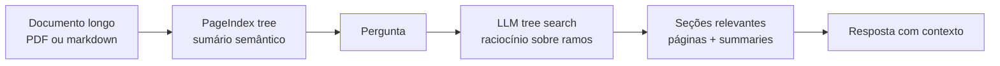

# PageIndex

> [!abstract] TL;DR
> **PageIndex** (`github.com/VectifyAI/PageIndex`) é uma abordagem de **[[Dicionário de IA#RAG (Retrieval-Augmented Generation)|RAG]] vectorless** para documentos longos: em vez de quebrar o documento em [[Dicionário de IA#chunking|chunks]], gerar [[Dicionário de IA#embedding|embeddings]] e buscar por similaridade, ele constrói uma **árvore hierárquica tipo table of contents** e usa o [[Dicionário de IA#LLM (Large Language Model)|LLM]] para navegar essa árvore por raciocínio. A tese é simples e forte: similaridade semântica não é o mesmo que relevância; em documentos profissionais longos, a seção certa muitas vezes é encontrada por estrutura, contexto e inferência multi-step. PageIndex encaixa como padrão avançado de [[Dicionário de IA#retrieval|retrieval]], especialmente para PDFs financeiros, jurídicos, regulatórios, manuais técnicos e livros. Não substitui [[Dicionário de IA#vector database|vector DB]] em todos os casos, nem é memória de agentes por si só; é uma técnica de indexação/retrieval que pode alimentar sistemas como [[Memória de Agentes|11 - OpenKB — wiki compilada com PageIndex]].

> [!question]- Por que PageIndex não usa vector DB se RAG resolve o mesmo problema?
> Porque em documentos longos e estruturados, o problema não é "qual chunk é semanticamente similar à query" — é "em qual seção do documento está a resposta, dado o que a pergunta quer saber". Embeddings capturam similaridade de vocabulário; a árvore hierárquica do PageIndex captura relevância estrutural. Um contrato de 300 páginas pode ter a cláusula de rescisão no capítulo 8, seção 3 — um embedding dessa cláusula dificilmente vai casar com a query "quais são as condições para sair do contrato" se o texto usa linguagem formal diferente. A árvore permite que o LLM raciocine sobre onde procurar, não apenas sobre o que parece similar.

## O que é

PageIndex se posiciona como **"Vectorless, Reasoning-based RAG"**. A proposta ataca uma falha conhecida do RAG vetorial: embeddings recuperam trechos parecidos com a query, mas nem sempre recuperam o trecho **relevante** para responder. Em documentos profissionais longos, a resposta pode depender de navegação estrutural: primeiro entender o capítulo, depois a subseção, depois a página específica. Esse caminho se parece menos com similarity search e mais com um especialista folheando um documento pelo sumário.

O pipeline básico tem duas fases:

1. **Gerar uma árvore do documento.** A árvore parece um sumário enriquecido: cada nó tem título, intervalo de páginas ou índices, resumo e filhos.
2. **Fazer retrieval por tree search.** O LLM lê a pergunta, raciocina sobre quais ramos da árvore são promissores e navega até as seções relevantes.

A consequência é uma forma de RAG que troca **chunking + vector DB** por **estrutura + raciocínio**. Isso aproxima PageIndex de [[11 - Padrões avançados — Graph RAG, Agentic RAG, multi-hop|Agentic RAG]], mas com uma diferença: o espaço de busca não é uma lista flat de chunks ou um grafo de entidades; é a hierarquia interna do documento.

## Por que importa

- **Ataca o ponto fraco de documentos longos.** PDFs financeiros, contratos, manuais e textbooks têm estrutura. Chunking arbitrário destrói parte dessa estrutura; PageIndex tenta preservá-la.
- **Faz retrieval por relevância, não só por similaridade.** A pergunta pode não compartilhar vocabulário com a resposta; a árvore dá ao LLM uma superfície para raciocinar sobre onde procurar.
- **Reduz dependência de vector DB.** Para alguns casos, especialmente corpus pequeno/médio de documentos longos, operar uma árvore por documento é mais simples que embeddings + índice HNSW + rerank.
- **Melhora explicabilidade.** A resposta pode apontar caminho estrutural: documento → seção → subseção → página. Isso é mais auditável que "o chunk top-5 por cosine veio daqui".
- **É peça técnica do OpenKB.** [[Memória de Agentes|11 - OpenKB — wiki compilada com PageIndex]] usa PageIndex para lidar com documentos longos antes de compilar a wiki.

## Como funciona



Um nó típico da árvore contém:

- `title` — título da seção;
- `node_id` — identificador estável;
- `start_index` / `end_index` — intervalo coberto;
- `summary` — resumo semântico do nó;
- `nodes` — filhos, quando a seção é subdividida.

Na prática, isso é um JSON recursivo — não uma abstração, mas um artefato que dá pra abrir e ler. Um trecho de árvore gerado a partir de um relatório financeiro (10-K) se parece com isto:

```json
{
  "title": "Item 7. Management's Discussion and Analysis",
  "node_id": "0006",
  "start_index": 42,
  "end_index": 78,
  "summary": "Discussão da administração sobre resultados operacionais, liquidez e posição de capital do exercício fiscal, incluindo variações ano a ano em receita e margem.",
  "nodes": [
    {
      "title": "Liquidity and Capital Resources",
      "node_id": "0006-02",
      "start_index": 61,
      "end_index": 70,
      "summary": "Análise de caixa disponível, linhas de crédito não utilizadas e capacidade de financiar operações nos próximos 12 meses.",
      "nodes": []
    }
  ]
}
```

O ponto central: `node_id` é a chave que o LLM devolve depois do tree search — não texto solto, mas um identificador que o pipeline usa para buscar o intervalo `start_index`/`end_index` correspondente no documento original e montar o contexto de geração. Isso é o que torna o retrieval auditável: dá pra provar exatamente qual nó (e qual página) originou uma resposta, em vez de reconstruir a proveniência a partir de um score de similaridade.

O tree search em si funciona como uma busca recursiva guiada por raciocínio, não por embedding: o LLM recebe a pergunta e os `summary` dos nós de um nível (por exemplo, os filhos diretos da raiz), decide quais ramos parecem promissores, desce para o próximo nível só nesses ramos, e repete até chegar em folhas com `start_index`/`end_index` específicos. Isso evita jogar a árvore inteira no contexto — cada chamada só vê os nós do nível corrente — e é o motivo do custo dominante ser **chamadas de LLM por navegação**, não embeddings.

Essa representação transforma um documento longo em uma estrutura navegável. Em vez de perguntar "quais chunks são similares à query?", o sistema pergunta "qual ramo da estrutura tem maior chance de conter a resposta, dado o objetivo da pergunta?".

## Comparação com RAG vetorial

| Dimensão | RAG vetorial | PageIndex |
|---|---|---|
| Unidade de indexação | Chunk artificial | Seção/nó estrutural |
| Busca | Similaridade de embeddings | Tree search por LLM |
| Infra | Vector DB + embedding model | Árvore JSON/markdown + LLM |
| Melhor caso | Corpus amplo, queries semânticas variadas | Documento longo com estrutura forte |
| Explicabilidade | Score vetorial e chunk id | Caminho na árvore + páginas/seções |
| Custo principal | Embeddings + storage + rerank | Construção da árvore + calls de raciocínio |
| Falha típica | Similaridade ≠ relevância | Árvore ruim ou navegação cara/lenta |

PageIndex não invalida [[06 - Retrieval — hybrid search, BM25, query rewriting|hybrid search]] nem [[07 - Reranking — Cohere, Voyage, cross-encoders|reranking]]. Ele é uma alternativa para uma classe específica de corpus: documentos longos, estruturados, em que o problema é navegar dentro do documento mais que buscar entre milhões de fragmentos independentes.

## Quando usar / quando não usar

**Quando vale:**

- Documentos longos acima do contexto útil do modelo.
- PDFs profissionais com estrutura real: relatórios financeiros, SEC filings, contratos, normas, manuais, livros técnicos.
- Perguntas que exigem localizar seção específica antes de responder.
- Casos em que citação por página/seção é mais importante que recall amplo.
- Times que querem evitar vector DB para um corpus documental controlado.
- Pipelines como OpenKB, onde retrieval de documento longo é etapa anterior à compilação de uma knowledge base.

**Quando NÃO vale:**

- Corpus enorme de snippets curtos, FAQs, tickets e páginas pequenas. Vector/hybrid search é mais direto.
- Conteúdo sem hierarquia clara, como logs, conversas soltas ou comentários sociais.
- Latência crítica: tree search pode exigir múltiplas chamadas LLM.
- Casos onde o custo de construir árvore por documento não se paga.
- Ambientes que precisam de comportamento determinístico e barato em escala de milhões de queries.
- Quando o problema principal é **memória**: consolidar fatos, resolver contradições, esquecer, aprender preferências. Para isso, ver [[Memória de Agentes]].

## Relação com padrões avançados

PageIndex fica entre três famílias, mas não se confunde com nenhuma delas — cada uma empresta um pedaço da ideia, com um diferencial concreto que vale nomear:

- **Agentic RAG.** Em [[11 - Padrões avançados — Graph RAG, Agentic RAG, multi-hop|Agentic RAG]] genérico, o agente decide livremente entre múltiplas ferramentas — buscar na web, consultar um vector DB, chamar uma API — e o espaço de ação é aberto. No PageIndex, o "agente" (o LLM fazendo tree search) só tem uma ferramenta: navegar os nós da árvore de um único documento. É Agentic RAG com escopo de ação deliberadamente restrito — a vantagem é previsibilidade de custo e menos superfície para o LLM alucinar uma ferramenta errada; a desvantagem é que não resolve perguntas que exigem múltiplas fontes fora do documento.
- **Hierarchical retrieval.** A ideia de buscar em níveis (documento → seção → subseção → página) já existe em índices hierárquicos clássicos (ex: HNSW multi-nível, ou RAPTOR com clusters recursivos de embeddings). A diferença do PageIndex é que os níveis não vêm de clustering estatístico sobre embeddings — vêm da **estrutura editorial real do documento** (o sumário que um autor humano escreveria). Isso troca robustez estatística por fidelidade à intenção do autor: funciona muito bem quando o documento tem uma hierarquia editorial forte (10-K, manual, contrato) e piora quando essa hierarquia é fraca ou inconsistente.
- **Long-context RAG.** A alternativa a fazer retrieval é simplesmente jogar o documento inteiro (ou grandes blocos dele) na janela de contexto do modelo — ver [[10 - RAG vs long context vs fine-tuning]]. PageIndex ocupa o meio-termo: não descarta contexto bruto (como faria um retrieval por chunk pequeno), mas também não joga o documento inteiro na janela — a árvore decide um recorte de seções relevantes, do tamanho do resumo dos nós escolhidos mais o texto das folhas, e só isso entra no prompt de geração. O ganho é reduzir tokens de contexto sem perder a seção certa; o custo é que a navegação em si consome chamadas de LLM que long-context puro não precisaria pagar.

Ele não é Graph RAG no sentido clássico, porque não extrai entidades/relações para um knowledge graph. Também não é multi-hop RAG genérico, embora possa fazer perguntas multi-step navegando ramos diferentes do mesmo documento.

## Armadilhas comuns

> [!warning] Confiar na árvore como se fosse ground truth
> A qualidade do retrieval depende inteiramente da qualidade da árvore construída. Se o parser/OCR falhou, se o LLM usou uma hierarquia incorreta ou se o documento tem estrutura inconsistente (seções sem títulos, numeração quebrada), a árvore vai guiar o retrieval para o lugar errado. PageIndex exige validação da árvore antes de confiar no retrieval — pelo menos por amostragem manual em 10-20 nós críticos.

> [!warning] Usar PageIndex para memória conversacional
> Histórico de conversa não é documento estruturado — é uma sequência temporal de mensagens sem hierarquia de conteúdo. Forçar PageIndex sobre histórico de chat cria uma pseudo-árvore artificial que geralmente deteriora a qualidade comparado a extração simples de fatos ou RAG vetorial sobre transcrições. Para memória de agentes, use as abordagens específicas de [[Memória de Agentes]].

> [!warning] Generalizar o benchmark do FinanceBench
> O resultado de 98,7% do sistema Mafin 2.5 no FinanceBench é sinal forte para documentos financeiros estruturados — relatórios SEC, earnings reports, filings — que são exatamente o tipo de documento que PageIndex foi otimizado para navegar. Esse número não é transferível para texto livre, documentos sem hierarquia ou domínios onde a estrutura é fraca. Avalie sempre no seu próprio corpus antes de decidir.

## O que vem a seguir

PageIndex encerra a trilha de RAG e Vector Databases com uma pergunta aberta: e quando o problema não é retrieval de documentos, mas memória persistente de agentes ao longo do tempo? Consolidar fatos, resolver contradições, aprender preferências — esses são problemas de memória, não de retrieval documental, e exigem abordagens completamente diferentes.

- [[Memória de Agentes]] — a trilha complementar que cobre como agentes mantêm estado, aprendem com interações passadas e usam knowledge graphs para memória estruturada

## Como explicar em inglês

PageIndex is a retrieval approach specifically designed for long, structured documents where the fundamental problem is not "which chunks are semantically similar to the query?" but rather "which section of this document contains the relevant information, given what the question is trying to find out?" The distinction matters because semantic similarity and structural relevance can diverge significantly: a contract clause about termination conditions may use formal legal language that shares no vocabulary with the query "how can I exit this contract?", but it lives in a predictable location in the document's hierarchy.

The mechanism works in two phases: first, build a tree representation of the document — essentially a semantic table of contents where each node has a title, page range, summary, and children. Second, use the LLM to navigate that tree by reasoning about which branches are likely to contain the answer, then retrieve the relevant sections and generate a grounded response. This replaces chunking and vector search with structure and reasoning, which trades embedding costs for LLM call costs during tree construction and navigation.

**In a technical interview**, you might say:

> "PageIndex is a good fit when I have structured professional documents — SEC filings, contracts, technical manuals — where chunking destroys the document's natural hierarchy and semantic search retrieves the wrong sections because the query vocabulary doesn't match the document's formal language. Instead of chunking, I build a hierarchical tree of the document and let the LLM navigate it by reasoning about which section is most likely to contain the answer. The tradeoff is that tree construction requires multiple LLM calls per document, so it's cost-effective for a controlled corpus of long documents but doesn't scale to millions of short snippets. For those, standard hybrid search with reranking remains the better default."

| PT | EN |
|----|-----|
| Árvore de documentos | Document tree |
| Sumário semântico | Semantic table of contents |
| Recuperação por raciocínio | Reasoning-based retrieval |
| RAG sem vetores | Vectorless RAG |
| Navegação hierárquica | Hierarchical navigation |
| Nó da árvore | Tree node |
| Intervalo de páginas | Page range |
| Busca por estrutura | Structure-based search |
| Construção do índice | Index construction |
| Relevância estrutural | Structural relevance |

## Veja também

- [[02 - Anatomia do pipeline RAG]] — onde PageIndex substitui chunking/embedding/indexing tradicionais
- [[04 - Chunking — onde 50% da qualidade vive]] — problema que PageIndex tenta evitar em documentos longos
- [[06 - Retrieval — hybrid search, BM25, query rewriting]] — baseline que PageIndex desafia
- [[07 - Reranking — Cohere, Voyage, cross-encoders]] — alternativa complementar para melhorar relevância
- [[10 - RAG vs long context vs fine-tuning]] — quando documento longo deve virar retrieval em vez de contexto bruto
- [[11 - Padrões avançados — Graph RAG, Agentic RAG, multi-hop]] — família onde vectorless/tree RAG se encaixa
- [[Memória de Agentes|11 - OpenKB — wiki compilada com PageIndex]] — uso de PageIndex dentro de knowledge base persistente

## Referências

- Repositório oficial — `https://github.com/VectifyAI/PageIndex` — README verificado em 06/05/2026; MIT; Python; ~28,6k stars; descreve PageIndex como "Document Index for Vectorless, Reasoning-based RAG".
- Documentação oficial — `https://docs.pageindex.ai` — cookbooks, tutorials e exemplos.
- Developer / MCP / API — `https://pageindex.ai` — integração via MCP e API.
- Blog introdutório — *PageIndex: Next-Generation Vectorless, Reasoning-based RAG* (Zhang, Tang e PageIndex Team, setembro de 2025), citado no README.
- FinanceBench — `https://arxiv.org/abs/2311.11944` — benchmark mencionado no README como caso onde Mafin 2.5, sistema baseado em PageIndex, reporta 98,7% de accuracy.
