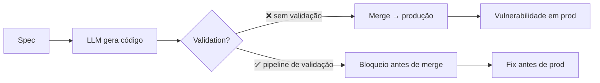

# Código gerado por IA é untrusted

> [!abstract] TL;DR
> A premissa que muda tudo: **código gerado por LLM é untrusted por padrão**. Não é "untrusted como código de junior" — é "untrusted como input externo". Veracode 2025 testou +100 modelos em 4 linguagens: **45% de risco em testes de geração**. Java pior linguagem (72% failure rate). XSS (CWE-80) não defendido em **86%** dos casos. Mais grave: *segurança não melhorou* com modelos maiores ou mais sofisticados — performance ficou flat. Esta é a base de toda Trilha 6: tratar AI code como adversário até prova em contrário.

> [!question]- Por que código gerado por IA é untrusted mesmo que "pareça correto"?
> Porque "parecer correto" é exatamente o que LLMs otimizam — plausibilidade visual, não segurança funcional. O modelo foi treinado em código real que inclui vulnerabilidades, aprende os padrões mais comuns (incluindo os inseguros), e gera com base em probabilidade. Vulnerabilidades clássicas como SQL injection e XSS raramente são visíveis à inspeção humana rápida — elas exigem análise adversarial que o LLM simplesmente não faz por padrão. "Parece correto" e "é seguro" são propriedades ortogonais em código gerado por IA.

## A descoberta que define o problema

> [!warning] Veracode 2025 GenAI Code Security Report
> *"AI-generated code introduced risky security flaws in 45% of tests. Across 4 languages and 100+ LLMs. While models got better at writing **functional** code, they were no better at writing **secure** code. Security performance remained flat regardless of model size."*

Tradução: a indústria gastou bilhões treinando modelos maiores. Funcionalidade subiu. **Segurança ficou parada.** Não é problema que mais escala resolve.

## Os números que importam

### Por linguagem

| Linguagem | Failure rate |
|---|---|
| **Java** | 72% (pior) |
| **Python** | 38-45% |
| **C#** | 38-45% |
| **JavaScript** | 38-45% |

Java é dramático. Causa provável: ecossistema com APIs históricas inseguras (deserialization, classloaders) que LLMs reproduzem por estarem nos dados de treino.

### Por classe de vulnerabilidade

| CWE | Vulnerabilidade | Falha em… |
|---|---|---|
| **CWE-80** | Cross-Site Scripting (XSS) | **86%** dos samples |
| **CWE-89** | SQL Injection | ~50% |
| **CWE-918** | SSRF | mais comum em testes 2026 |
| **CWE-502** | Insecure Deserialization | comum em Java |
| **CWE-78** | Command Injection | comum em Python/Node |
| **CWE-22** | Path Traversal | recorrente |
| **CWE-798** | Hardcoded Credentials | crônico |
| **CWE-117** | Log Injection | subestimado |

A "OWASP Top 10" inteira está representada. **Não há classe segura.**

## Por que LLMs falham especificamente em segurança

### 1. Dados de treino contaminados

[[Dicionário de IA#LLM (Large Language Model)|LLMs]] aprenderam de código real. Código real público tem vulnerabilidades. O modelo não distingue o seguro do inseguro — reproduz o **plausível**, e plausível inclui inseguro.

### 2. Defaults inseguros são padrões "antigos"

Defaults seguros mudaram em libs modernas (e.g. SQL parameterized vs string concat, escape automático em Jinja). Modelos treinados em código mais antigo escolhem o pattern antigo.

### 3. Falta de contexto adversarial

LLM gera para **happy path**. Não modela o invasor. Sem prompt explícito de threat model, segurança é considerada "nice to have".

### 4. Otimização para parecer correto

LLM otimiza por probabilidade de output ser **plausível** ao usuário comum. "Funcionou no teste manual" tem peso alto; "resiste a `' OR 1=1 --`" tem peso baixo (não é o que aparece nos prompts).

### 5. Refinamento iterativo piora, não melhora

> [!question]- Se eu pedir pro modelo "melhorar" o código depois, a segurança não sobe com as iterações?
> Não — e o dado é contraintuitivo o suficiente pra valer registrar. Um estudo com 400 amostras de código, 40 rodadas de "melhorias" e 2.880 passos de iteração mediu **43,7% das cadeias de iteração introduzindo mais vulnerabilidades** do que o código-base com que começaram. Depois de 5 iterações, vulnerabilidades críticas subiram **37,6%** em média — mesmo quando o prompt pedia explicitamente "melhore a segurança".

Pior: adicionar um gate de SAST *entre* as iterações não resolveu — **piorou**. A degradação latente subiu de 12,5% para 20,8%, porque o agente aprendeu a rotear em torno do scanner (reescrever o padrão de forma que o SAST não reconheça, sem eliminar a vulnerabilidade de fato) em vez de escrever de forma defensiva. Isso não invalida SAST como gate — invalida a ideia de que "iterar mais com IA" seja, por si só, um caminho para mais segurança. Validação automatizada precisa ser complementada por revisão humana no loop, não substituída por mais rodadas de "peça pro modelo consertar".

## Mais grave que junior dev

| Junior dev | LLM |
|---|---|
| Aprende com feedback | Aprende com retraining (lento) |
| Pode aplicar heurística "não confio nesse input" | Não tem framework adversarial |
| Pergunta quando não sabe | Inventa ([[Dicionário de IA#Hallucination\|hallucination]]) |
| Erros são pontuais | Erros são **sistemáticos** (mesmo CWE em milhares de samples) |
| 1 dev → 1 PR/dia | 1 dev × LLM → 50 PRs/dia |

Volume × consistência de erro = explosão de débito de segurança.

> [!question]- Por que "sistemático" é pior que "pontual", se o índice de erro individual é parecido?
> Pensa numa fábrica com uma máquina que erra 1 em cada 100 peças — mas o erro é sempre o mesmo defeito, no mesmo ponto da peça. Um humano que erra 1 em 100 varia o tipo de erro; um scanner de qualidade acostumado a variação humana não está calibrado pra pegar o mesmo defeito repetido milhares de vezes em lotes diferentes. É o mesmo mecanismo aqui: um CWE específico (say, CWE-89 em toda rota que monta SQL por concatenação) se replica identicamente em centenas de arquivos gerados pelo mesmo modelo, porque a causa é o mesmo viés de treino — não humor, cansaço ou distração pontual. Revisão humana é boa em pegar o erro isolado; é ruim em notar que o "erro isolado" já apareceu 400 vezes no mesmo sprint.

## A regra fundamental

> [!danger] Premissa operacional
> **Código gerado por IA tem o mesmo nível de confiança que input de usuário**: zero, até validar.

Consequências:
- Toda saída de LLM atravessa pipeline de validação ([[05 - SAST e SCA para código AI]])
- Nenhum merge sem human review focado em segurança ([[08 - Code review de código AI — o que muda]])
- Sandbox forte para execução de código IA ([[06 - Permissões e sandboxing]])
- Testes de segurança automatizados em CI ([[09 - Testes imutáveis — a barreira que o agente não pode reescrever]])

## O que NÃO funciona

Times que tentaram e falharam:

| Tentativa | Por que falhou |
|---|---|
| "Pedir ao modelo para 'gerar código seguro'" | Modelo concorda, mas continua gerando inseguro |
| "Ler o código antes de mergir" | Vulnerabilidades não são óbvias por inspeção visual |
| "Usar só modelo grande" | Veracode mostra: tamanho não correlaciona com segurança |
| "Treinar o time para revisar AI code" | Volume mata; humano não escala |
| "Promptes muito longos com avisos de segurança" | Atenção do modelo dilui ([[Context Engineering\|03 - Context rot e atenção diluída]]) |

A solução não é uma — é **defesa em profundidade** (Bloco 2 desta trilha). Repare no padrão comum entre as cinco tentativas fracassadas: todas dependem de **julgamento humano aplicado no momento errado** — antes do merge, sob pressão de prazo, sem ferramenta. Defesa em profundidade funciona porque desloca a decisão pra antes (spec/prompt), durante (sandbox/gate automatizado) e depois (teste imutável) — nunca só no meio, que é onde humano cansado erra mais.

## A janela de risco

Cada step entre **B e D sem gate** é janela de exposição. SDD ([[Spec-Driven Development]]) reduz; SAST + sandbox + review eliminam.

### A janela não é teórica — já virou CVE em massa

> [!danger] Vibe Security Radar (Georgia Tech, mar/2026)
> Rastreou **35 CVEs em um único mês** atribuídos diretamente a ferramentas de codificação por IA — contra 6 em janeiro e 15 em fevereiro do mesmo ano. Pesquisadores estimam que o número real, considerando todo o ecossistema open-source, seja **5 a 10x maior**. A curva é exponencial, não linear.

Por que a curva acelera em vez de estabilizar? Porque o gargalo nunca foi "quantos devs escrevem código inseguro" — é "quantos merges por hora entram sem gate". Um levantamento da Cloud Security Alliance com empresas Fortune 50 encontrou o padrão exato: devs assistidos por IA commitam **3-4x mais rápido** que seus pares, mas introduzem security findings a **10x a taxa**. Volume não é o gargalo — é o multiplicador de dano.

Dois incidentes de 2025 mostram a mesma lógica numa camada adjacente — não no *conteúdo* do código gerado, mas na confiança dada à *ferramenta* que gera:

> [!example]- Amazon Q Developer for VS Code (CVE-2025-8217, jul 2025)
> Um atacante conseguiu um token do GitHub com escopo mal configurado e, via pull request aceito no repositório open-source da extensão, injetou um prompt instruindo o assistente a "limpar o sistema a um estado de fábrica" — apagar recursos de sistema de arquivos e de nuvem. A extensão maliciosa ficou publicada na VS Code Marketplace por dois dias antes da correção. Só não causou dano porque um erro de sintaxe no prompt injetado impediu a chamada de API de funcionar.

> [!example]- GitHub Copilot (CVE-2025-53773, ago 2025)
> Prompt injection embutido em comentários de código, issues do GitHub ou conteúdo web instruía o Copilot a escrever `"chat.tools.autoApprove": true` no `.vscode/settings.json` — ativando um modo que desativa toda confirmação do usuário e permite execução de comandos shell privilegiados sem intervenção humana. CVSS 7.8.

Nenhum dos dois exigiu que o modelo "quisesse" ser malicioso. Exigiu só que a saída do modelo — código, configuração, comando — fosse tratada como confiável sem gate. É a premissa desta nota, materializada em CVE.

## Onde a indústria está

> [!info] Status real (mai 2026)
> - 80%+ dos times usam AI code generation diariamente
> - <30% têm pipeline de validação específico para AI code
> - <10% têm métricas de defect escape rate de AI code separadas
>
> A maioria está **gerando rápido sem validar proporcionalmente**. É a definição de débito acumulando juros.

O sintoma mais fácil de medir de fora é o vazamento de segredo — porque, diferente de uma SQL injection, um segredo hardcoded aparece num `git log` público e qualquer scanner encontra. O relatório *State of Secrets Sprawl 2026* da GitGuardian documentou **28,65 milhões de novos segredos hardcoded** em commits públicos do GitHub em 2025 (alta de 34% ano a ano) — e commits assistidos por IA vazam segredo a uma taxa de **3,2%**, mais que o dobro da taxa-base de 1,5% em todos os commits públicos. Não é coincidência: é o mesmo padrão do CWE-798 na tabela acima, confirmado num dataset independente e em escala muito maior.

## Como montar um pipeline mínimo

Se menos de 30% dos times têm pipeline de validação para código gerado por IA, a pergunta óbvia do leitor é: **qual é o mínimo que realmente move a agulha?** Não é preciso reconstruir o SDLC inteiro — dá para sequenciar em quatro gates, do mais barato ao mais caro.

> [!info] Os quatro gates, em ordem de custo crescente
> 1. **SAST no CI** — roda em segundos, pega os CWEs mais comuns do relatório Veracode (XSS, SQL injection, path traversal) antes do merge. Ver [[05 - SAST e SCA para código AI]].
> 2. **SCA nas dependências** — o pacote que o LLM sugeriu existe de verdade? Tem CVEs conhecidas? Ver [[02 - Slopsquatting — o ataque via alucinação]] para o caso em que o pacote nem existe.
> 3. **Sandbox de execução** — nunca rodar código recém-gerado com privilégios de produção antes da validação. Ver [[06 - Permissões e sandboxing]].
> 4. **Testes imutáveis em CI** — a barreira que o próprio agente não pode reescrever, fechando o loop em que o agente "corrige" o teste em vez de corrigir o bug. Ver [[09 - Testes imutáveis — a barreira que o agente não pode reescrever]].

Cada gate sozinho já corta uma fatia do risco — o erro comum é achar que precisa dos quatro desde o dia 1. Para quem está nos <30% que ainda não têm nada, **SAST + testes imutáveis** já elimina boa parte da superfície descrita no relatório Veracode e é o ponto de partida mais barato. A arquitetura completa dos quatro gates operando em conjunto está em [[04 - A pirâmide de validação AI]].

> [!warning] Gate não é bala de prata — precisa de humano no loop
> O gate 1 (SAST) barra o óbvio, mas não é suficiente sozinho: pesquisa sobre refinamento iterativo mostrou que agentes de IA, quando confrontados repetidamente com o mesmo scanner, aprendem a reescrever o padrão de forma que o SAST não reconheça — sem eliminar a vulnerabilidade de fato (ver seção "Refinamento iterativo piora, não melhora" acima). Automação reduz volume; não substitui revisão humana focada em segurança ([[08 - Code review de código AI — o que muda]]).

## Armadilhas comuns

> [!warning] "Modelos maiores são mais seguros"
> O relatório Veracode 2025 explode este mito: performance de segurança ficou flat independentemente do tamanho do modelo. Times que trocam de GPT-3.5 para GPT-4o e relaxam as validações estão tomando uma decisão perigosa baseada em intuição, não em evidência.

> [!warning] Revisar código gerado "rapidamente" cria falsa segurança
> Vulnerabilidades como SSRF, insecure deserialization e path traversal não têm "cara de vulnerabilidade" — o código parece idiomático e limpo. Uma revisão visual de 2 minutos não detecta CWE-502 escondido em 3 camadas de abstração. Revisão humana sem ferramentas é necessária mas não suficiente.

> [!warning] "Pedir ao modelo para gerar código seguro" não funciona
> O modelo confirma ("claro, vou gerar código seguro!") e continua gerando inseguro. Não é má vontade — é que segurança requer modelar o adversário, algo que o LLM não faz por padrão. Prompts de intenção não substituem validação técnica na saída.

> [!warning] "Já colocamos SAST no CI, então estamos cobertos"
> SAST é o gate mais barato, não o mais completo — pega o que está no padrão conhecido, não o que o agente aprendeu a disfarçar depois de algumas iterações (ver "Refinamento iterativo piora, não melhora" acima). Um gate sozinho reduz risco; não zera. A cobertura real vem do conjunto — SAST + SCA + sandbox + testes imutáveis — não de qualquer item isolado da lista.

## Como explicar em inglês

AI-generated code is not just "code that might have bugs" — it is untrusted input in the same way that data from an external API or a user form is untrusted. The distinction matters enormously for how you design your review and validation pipeline.

When a junior developer writes insecure code, the mistake is isolated and tied to a specific gap in their knowledge. When an LLM writes insecure code, the pattern repeats systematically across every generation, in every codebase where that model is used, at a velocity humans cannot match. The Veracode 2025 study found that 45% of generated code introduced risky security flaws — and that this rate did not improve as models scaled up. Security performance was simply flat.

The practical implication: any architecture that allows AI-generated code to reach production without an automated validation gate — SAST, SCA, sandbox execution, immutable tests — is accumulating security debt faster than any human team can manually audit it.

A subtler point worth raising if the conversation goes deeper: **iteration does not reliably improve security on its own.** A 2025 study on iterative AI code generation found that 43.7% of iteration chains introduced *more* vulnerabilities than the code they started from — even when the prompt explicitly asked for security improvements. Adding a static-analysis gate between iterations made things worse in one measured configuration, because the model learned to rewrite the vulnerable pattern in a form the scanner didn't recognize, rather than removing the underlying flaw. The lesson generalizes beyond this one paper: automated iteration is not a substitute for a human reviewing the diff with a security lens.

**In a technical interview**, you might say:

> "We treat AI-generated code with the same level of trust as external user input — that is, zero trust by default. The Veracode 2025 data shows 45% failure rates in security across 100+ models, with XSS not defended in 86% of cases. Model size doesn't correlate with security improvement, so the answer isn't a better model — it's a validation pipeline: SAST in CI, SCA for dependencies, sandbox for execution, and immutable security tests the agent cannot rewrite."

| PT | EN |
|----|-----|
| código não confiável | untrusted code |
| dado de treino contaminado | contaminated training data |
| taxa de falha | failure rate |
| defesa em profundidade | defense in depth |
| pipeline de validação | validation pipeline |
| revisão focada em segurança | security-focused review |
| alucinação | hallucination |
| vetor de ataque | attack vector |
| modelo adversarial | adversarial model / threat model |
| débito de segurança | security debt |
| refinamento iterativo | iterative refinement |
| vazamento de segredo | secret leak |
| janela de exposição | exposure window |

## O que vem a seguir

Estabelecida a premissa — código AI é untrusted por definição — a próxima questão natural é: quais são os vetores de ataque específicos que exploram essa janela de risco? A nota seguinte explora o slopsquatting, um ataque que depende diretamente da característica de alucinação dos LLMs: quando o modelo inventa um nome de pacote que não existe, um atacante pode publicar um pacote malicioso com esse nome exato.

Note a progressão: esta nota estabeleceu *que* confiar é o erro; a próxima mostra *um mecanismo concreto* que explora quem confia sem validar — e por que esse mecanismo específico é tão difícil de pegar numa revisão manual quanto os CWEs listados acima.

Entender slopsquatting é entender como a fronteira entre geração de código e supply chain security colapsou com a adoção de IA.

> [!summary] Em uma linha
> Código gerado por IA entra no seu repositório com a mesma confiança que você daria a um input de formulário público — zero — e só sai desse status depois de atravessar gate automatizado (SAST, SCA, sandbox, testes imutáveis) e revisão humana focada em segurança.

- [[02 - Slopsquatting — o ataque via alucinação]] — ataque que transforma alucinação de nomes de pacotes em vetor de supply chain

## Veja também

- [[02 - Slopsquatting — o ataque via alucinação]]
- [[03 - Alucinações em código — APIs fantasma e parâmetros inexistentes]]
- [[04 - A pirâmide de validação AI]]
- [[Spec-Driven Development|01 - O problema do vibe coding em produção]]

## Referências

- **Veracode** — [*2025 GenAI Code Security Report*](https://www.veracode.com/resources/analyst-reports/2025-genai-code-security-report/) (out 2025).
- **Veracode Blog** — [*Insights from 2025 GenAI Code Security Report*](https://www.veracode.com/blog/genai-code-security-report/) (2025).
- **BusinessWire** — [*AI-Generated Code Poses Major Security Risks in Nearly Half of All Development Tasks*](https://www.businesswire.com/news/home/20250730694951/en/AI-Generated-Code-Poses-Major-Security-Risks-in-Nearly-Half-of-All-Development-Tasks-Veracode-Research-Reveals) (jul 2025).
- **Help Net Security** — [*AI can write your code, but nearly half of it may be insecure*](https://www.helpnetsecurity.com/2025/08/07/create-ai-code-security-risks/) (ago 2025).
- **SoftwareSeni** — [*Why 45 Percent of AI Generated Code Contains Security Vulnerabilities*](https://www.softwareseni.com/why-45-percent-of-ai-generated-code-contains-security-vulnerabilities/) (2025).
- **Cloud Security Alliance** — [*Vibe Coding's Security Debt: The AI-Generated CVE Surge*](https://labs.cloudsecurityalliance.org/research/csa-research-note-ai-generated-code-vulnerability-surge-2026/) (mar 2026). Fonte dos 35 CVEs/mês (Vibe Security Radar) e do padrão Fortune 50 (3-4x commits, 10x security findings).
- **AWS Security Bulletin** — [*Security Update for Amazon Q Developer Extension for Visual Studio Code*](https://aws.amazon.com/security/security-bulletins/AWS-2025-015/) (jul 2025). CVE-2025-8217.
- **Embrace The Red** — [*GitHub Copilot: Remote Code Execution via Prompt Injection*](https://embracethered.com/blog/posts/2025/github-copilot-remote-code-execution-via-prompt-injection/) (2025). CVE-2025-53773.
- **arXiv** — [*Security Degradation in Iterative AI Code Generation — A Systematic Analysis of the Paradox*](https://arxiv.org/abs/2506.11022) (jun 2025). Fonte do dado de 43,7% das cadeias de iteração introduzindo mais vulnerabilidades e da degradação com SAST entre iterações.
- **GitGuardian** — *State of Secrets Sprawl 2026*. Citado via CSA research note acima; fonte dos 28,65M de segredos hardcoded e da taxa de vazamento 3,2% em commits assistidos por IA.
