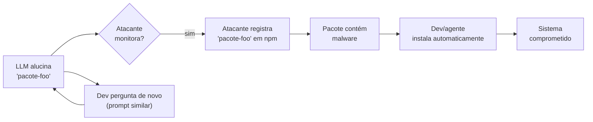

# Slopsquatting — o ataque via alucinação

> [!abstract] TL;DR
> Slopsquatting (termo cunhado por Seth Larson) é um ataque de supply chain que **não existia antes dos LLMs**: atacante observa que um modelo alucina certos nomes de pacote inexistentes, **registra esses nomes** em npm/PyPI/etc, e espera que devs (ou agentes) instalem. Pesquisa USENIX Security mostrou que [[Dicionário de IA#LLM (Large Language Model)|LLMs]] são **determinísticos nas [[Dicionário de IA#Hallucination|alucinações]]** — GPT-4 sugere o mesmo nome falso para >20% dos prompts similares. Em janeiro de 2026, `react-codeshift` (pacote inexistente) se espalhou por **237 repos GitHub** via skills de agentes que ninguém revisava. Mitigação: sandboxing, lockfile verification, package allowlisting.

> [!question]- Por que slopsquatting é diferente de typosquatting tradicional?
> Typosquatting depende de erro humano de digitação — alguém escreve `reqeusts` em vez de `requests`. Slopsquatting não depende de nenhum erro humano: o nome inventado é gerado com confiança pelo LLM, parece legítimo, e o desenvolvedor não tem razão óbvia para duvidar. Pior: a alucinação é **determinística** — o mesmo nome falso aparece para múltiplos desenvolvedores em situações similares, então o atacante pode registrar sistematicamente os nomes mais alucinados e esperar o tráfego chegar. Escala industrialmente de um modo que typosquatting jamais alcançou.

## A mecânica do ataque



O ataque explora **determinismo da alucinação**: LLMs alucinam de forma reprodutível. Se você pergunta "como faço X em Python", o modelo sugere o mesmo pacote inventado para você e para outros mil devs.

## A descoberta que mudou o jogo

> [!quote] USENIX Security Symposium (research) — 2024-2025
> *"LLMs são creatures of habit — se GPT-4 sugere um pacote falso para um dev, há alta probabilidade (frequentemente >20%) de sugerir o mesmo pacote falso para outros devs em queries similares."*

Antes: alucinações pareciam **aleatórias**. Pensava-se que cada dev veria nomes inventados diferentes. **Falso.** Os mesmos nomes aparecem repetidamente. Atacantes apenas precisam observar e registrar.

## O caso `react-codeshift` (jan 2026)

> [!example] react-codeshift — caso real
> Janeiro de 2026: pacote `react-codeshift` foi reclamado em npm. Não tinha autor real, não tinha histórico, não tinha funcionalidade. Era um nome **alucinação-por-conflação** — modelo confundiu `react` + `codeshift` (real, mas separado).
>
> Espalhou em 237 repositórios GitHub via **AI-generated agent skills** que ninguém revisou.
>
> Downloads diários de **agentes automatizados** que instalavam sem humano olhar.
>
> Quem descobriu foi Charlie Eriksen, pesquisador da Aikido Security: ele rastreou o pacote até um único commit contendo 47 arquivos de "agent skills" gerados por IA, nenhum revisado por humano antes do merge — e reivindicou o nome fantasma antes que um atacante o fizesse.
>
> Source: Trend Micro, Socket.dev, Aikido (2026)

## Impacto real — o que os estudos medem

> [!question] "Isso é raro ou é sistemático?"
> A intuição diz que alucinação de nome de pacote deve ser um evento ocasional — um azar do modelo, num prompt específico. Os números do maior estudo já feito sobre o assunto dizem o contrário: é sistemático, mensurável e **replicável em escala industrial**.

O paper *"We Have a Package for You!"* (Spracklen et al., USENIX Security 2025) testou 16 LLMs de geração de código — incluindo GPT-4, GPT-3.5, CodeLlama, DeepSeek e Mistral — gerando **576.000 amostras de código** com dois datasets de prompts distintos. Os resultados:

| Métrica | Valor |
|---|---|
| Taxa média de alucinação — modelos comerciais | ≥5,2% dos pacotes sugeridos |
| Taxa média de alucinação — modelos open-source | ≥21,7% dos pacotes sugeridos |
| Nomes de pacote alucinados únicos catalogados | 205.474 |
| Alucinações que se repetem em **todas** as 10 re-execuções do mesmo prompt | 43% |
| Alucinações que se repetem em **mais de uma** execução | 58% |

O número que importa pra este ataque não é a taxa de alucinação em si — é a **taxa de repetição**. Se cada execução gerasse um nome diferente, o atacante não teria alvo fixo pra registrar. Mas quase metade das alucinações aparece de forma **determinística**: o mesmo prompt, rodado dez vezes, produz o mesmo nome fantasma quase sempre. É esse padrão que transforma "o modelo erra às vezes" em "o modelo erra do mesmo jeito, previsivelmente, pra qualquer um que perguntar algo parecido".

> [!example] O caso `huggingface-cli` — antes do react-codeshift
> Em 2024, o pesquisador Bar Lanyado (Lasso Security) testou a teoria na prática: identificou `huggingface-cli` como um nome frequentemente alucinado por LLMs (o pacote real se chama `huggingface_hub`) e registrou uma versão vazia, inofensiva, no PyPI — só pra medir o tráfego. Resultado: **mais de 30.000 downloads em três meses**, todos de gente (ou agentes) que confiou na sugestão do modelo sem checar o registry. Nenhum código malicioso foi distribuído — era uma prova de conceito —, mas demonstrou que o vetor funciona antes mesmo do incidente `react-codeshift` virar notícia.

> [!question]- Quantas alucinações viram, de fato, pacote malicioso registrado?
> Nem toda alucinação é "capturada" por um atacante — a maioria dos nomes fantasma simplesmente falha silenciosamente (`module not found`) sem que ninguém os tenha registrado antes. Mas quando um pesquisador ou atacante monitora os nomes mais recorrentes, a taxa de conversão é significativa: pesquisas indicam que **entre 20% e 35% dos nomes de pacote alucinados em Python e npm** já foram convertidos em upload malicioso real no registry correspondente (Cloudsmith, 2026). Isso é o que separa slopsquatting de curiosidade acadêmica: uma fração relevante das alucinações catalogadas já virou vetor de ataque ativo, não hipotético.

> [!question]- Os modelos de 2026 ainda alucinam tanto quanto os de 2024?
> Um re-teste do mesmo protocolo sobre a geração de modelos "frontier" de 2026 (arXiv:2605.17062, *"The Range Shrinks, the Threat Remains"*) encontrou exatamente o que o título sugere: a taxa média de alucinação caiu em relação ao estudo original — os modelos ficaram melhores em não inventar nomes —, mas a ameaça **não desapareceu**. O intervalo entre o melhor e o pior modelo diminuiu, e mesmo os modelos mais avançados continuam produzindo um volume de nomes fantasma suficiente pra sustentar o ataque. Progresso no modelo reduz a superfície; não a elimina.

> [!summary] O que os dados dizem, em uma linha
> Alucinação de pacote não é ruído aleatório: é um padrão estatístico mensurável, replicável entre modelos, e explorável em escala — os três ingredientes que fazem um bug de modelo virar vetor de ataque de supply chain.

## Tipos de slopsquat

| Variante | Mecânica |
|---|---|
| **Hallucination-by-creation** | Modelo inventa nome do nada |
| **Hallucination-by-conflation** | Modelo combina nomes de libs reais (`react-codeshift`, `axios-fetch`) |
| **Hallucination-by-typo** | Modelo aproxima nome real (`pyhton-requests` em vez de `requests`) |
| **Cross-language confusion** | Modelo sugere nome de pacote npm em projeto Python e vice-versa |
| **Outdated reference** | Modelo sugere nome de lib que existiu mas foi descontinuada |

## Por que LLMs alucinam tanto pacote

> [!question] Se o modelo "sabe" o ecossistema de pacotes, por que inventa nomes?
> Porque o modelo nunca consultou o registry — ele completou um padrão de texto que parece um import válido. Nada no processo de geração verifica se o nome existe de fato; a verificação teria que vir de fora do modelo.

- **Treinamento misto**: dados de treino incluem repos que mencionam libs antigas, deprecated, ou de domínio adjacente
- **Pattern completion**: modelo prefere completar com "nome plausível" do que admitir ignorância
- **Bundling de libs**: quando pedido para "usar X + Y + Z juntos", modelo inventa nome composto
- **Benchmarks que premiam confiança**: training optimization pode reforçar "responder algo" sobre "dizer não sei"
- **Confusão de ecossistema**: o modelo sugere pacote de uma linguagem em projeto de outra — recomendar `lodash` num código Python ou `pandas` num projeto Node.js — porque o embedding de "isso resolve X" não está ancorado ao registry correto (Snyk, 2026)
- **Recomendação fora de propósito**: o modelo sugere um pacote real, mas para um uso que ele não cobre — `matplotlib` para processamento de áudio, `requests` para operação de banco de dados — sintoma do mesmo mecanismo de pattern completion aplicado à *função* do pacote, não só ao nome

Duas linhas de mitigação **na origem do modelo** (antes de qualquer camada de defesa do lado do desenvolvedor) têm mostrado redução mensurável sem raspar a qualidade do código gerado:

- **RAG (Retrieval-Augmented Generation)** — injeta informação real do registry no prompt antes da geração, ancorando a resposta a pacotes que de fato existem.
- **Self-Refinement (SR)** — o próprio modelo re-verifica sua saída contra uma segunda passada antes de entregar o resultado final.

Nenhuma das duas elimina a alucinação — apenas reduz a taxa —, o que reforça por que as camadas de defesa das seções seguintes continuam necessárias mesmo com um modelo "melhor".

> [!example] O quanto a mitigação reduz, em números
> No próprio estudo da USENIX (Spracklen et al., 2025), combinar várias estratégias de mitigação — incluindo RAG — reduziu a taxa de alucinação do DeepSeek em **83%**, de um baseline alto para apenas 2,66%. É uma redução substancial, mas 2,66% de um volume de milhares de imports gerados por dia ainda significa dezenas de nomes fantasma plausíveis circulando — suficiente pra um atacante paciente continuar rentável. Reduzir a taxa do modelo ajuda; não substitui a verificação de registry do lado do desenvolvedor.

## Por que ataque escala em 2026

| Fator | Multiplicador |
|---|---|
| **Volume de geração** | LLMs geram milhares de imports/dia |
| **Velocidade de install automático** | Agentes rodam `npm install` sem prompt humano |
| **Tail de pacotes raros** | Atacante pode ocupar 1000s de nomes baratos |
| **Cross-pollination** | AI skills reutilizam lista de deps geradas |
| **Confiança no agente** | Devs aprovam install sem checar registry |

Slopsquat **multiplica** ataques tradicionais de supply chain (typosquatting). Antes: atacante precisava errar com letrinha. Agora: atacante apenas registra alucinações conhecidas.

> [!summary] Por que isso não é só "mais um CVE"
> Cada fator da tabela acima remove uma barreira que antes protegia por acidente — volume, velocidade e confiança cega no agente convertem uma falha de modelo (previsível e mensurável, como visto na seção de impacto) num vetor de ataque barato de escalar e caro de detectar depois do fato.

## Mitigação — Defense in depth

### Layer 1 — Lockfiles + verification

```bash
# Sempre commitar e validar
package-lock.json
yarn.lock
poetry.lock

# CI verifica que install só usa pacotes do lockfile
npm ci  # NÃO npm install
```

`npm ci` falha se package.json discorda do lockfile. **Não permite que agente adicione dep silenciosamente.**

### Layer 2 — Allowlisting de registry

Usar registry interno (Verdaccio, JFrog Artifactory) com política de allowlist. Pacote desconhecido → bloqueado.

```yaml
# Política de exemplo
allowlist:
  - axios
  - react
  - lodash
  # ...

policy:
  unknown_package: BLOCK
  require_human_approval: true
```

### Layer 3 — Sandboxing de install

Rodar `npm install` em sandbox (container, VM, [[06 - Permissões e sandboxing|seatbelt/bubblewrap]]) com network limitada — evita post-install scripts maliciosos atingirem host.

### Layer 4 — Validação de pacote

```bash
# Verificar se package realmente existe e é confiável
npm view <pkg>
# Checar: idade, downloads, autor, fonte
```

Ferramentas: Socket.dev, Snyk Open Source, Endor Labs — fazem essa checagem automaticamente em CI.

### Layer 5 — Extended thinking nos agentes

Agentes modernos (Claude Code, OpenAI Codex CLI, Cursor com MCP) podem **verificar online** que o pacote existe antes de sugerir:

> [!quote] Claude Code CLI documentation
> *"Dynamically interleaves internal reasoning with external tools — live web searches, documentation lookups — to verify package availability as part of its generation pipeline."*

Reduz a alucinação significantemente. **Não elimina.**

## Detecção em projeto existente

```bash
# Listar deps suspeitas
npm ls --json | jq '.dependencies | keys[]' | xargs -I {} npm view {} --json 2>/dev/null

# Para cada dep:
# - Idade < 30 dias? Suspeito
# - Downloads < 100/semana? Suspeito
# - Sem maintainers ativos? Suspeito
# - Ausente de fontes confiáveis? Bloquear
```

Tools: Snyk, Socket.dev, npq (Node), pip-audit (Python).

## Sinais de slopsquat numa codebase

> [!question] Diagnóstico
> - [ ] Pacotes com nomes "compostos" estranhos (`react-tools-extras`)
> - [ ] Deps adicionadas sem PR — direto pelo agente
> - [ ] Lockfile mudou sem mudança de package.json correspondente
> - [ ] Pacote com <100 downloads/semana sendo usado
> - [ ] Pacote sem documentação ou repo
> - [ ] Skills de agente reutilizadas com lista de deps incluída
>
> 2+ marcadas: audit imediato.

## O que fazer se cair

1. **Isolar** — sandbox onde foi instalado, não conectar à rede
2. **Auditar** — `npm audit`, scan com Snyk; checar persistência (cron, services)
3. **Reset de credenciais** — qualquer secret tocado pelo processo
4. **Reportar** — para registry (npm support@npmjs.com, PyPI security@python.org)
5. **Postmortem** — qual gate falhou; reforçar (ver [[12 - O roadmap de segurança para times]])

## Anti-patterns

- **Confiar no `npm install`** — é o vetor primário
- **Aprovar install via prompt do agente sem checar** — humano fadiga e clica yes
- **Sem CI scan de novas deps** — slopsquat passa despercebido por dias
- **Lockfiles sem CI verification** — atacante pode adicionar via PR camuflado
- **Permitir agente em rede aberta** — install + post-install scripts comprometem host
- **Achar que "modelo melhor" resolve o problema** — mesmo com RAG e self-refinement aplicados, a taxa de alucinação cai mas não zera (USENIX: 83% de redução ainda deixa 2,66% de resíduo); a defesa do lado do desenvolvedor continua obrigatória

## Armadilhas comuns

> [!warning] Verificar o nome do pacote no Google "não é suficiente"
> Um pacote malicioso de slopsquatting pode ter uma página npm legítima, README copiado de outro projeto e algumas estrelas compradas. A presença no registry não prova legitimidade — o que importa é a combinação de idade, histórico de downloads, maintainers e se o pacote aparece em fontes confiáveis auditadas.

> [!warning] Agentes em modo autônomo instalam deps sem confirmação humana
> No workflow agentico padrão, o agente gera código com `import pacote-inventado` e logo após executa `npm install pacote-inventado` como ação de tool use. Se o humano só revisa o código final e não o log de ações, a instalação já aconteceu. Configurar o agente para exigir aprovação explícita em qualquer operação de install é requisito, não opcional.

> [!warning] Lockfiles sem CI enforcement são decoração
> Commitar `package-lock.json` é bom, mas se o CI usa `npm install` em vez de `npm ci`, o lockfile é ignorado na prática. Qualquer dep nova adicionada por agente ou por PR automatizado entra sem gate. A distinção `npm install` vs `npm ci` é pequena na digitação e enorme no vetor de ataque.

## Como explicar em inglês

Slopsquatting is a supply chain attack that emerged directly from the deterministic nature of LLM hallucinations. Traditional typosquatting relied on human typing errors — an attacker registers `reqeusts` hoping someone miskeys `requests`. Slopsquatting is different: the LLM confidently suggests a package name that doesn't exist, the same hallucinated name appears for many developers asking similar questions, and an attacker only needs to monitor which names are frequently hallucinated and register them in advance.

The attack surface exploded with agentic workflows. When an AI agent writes code that imports a hallucinated package and then automatically runs the install command without human review, the malicious package executes post-install scripts on the developer's machine before anyone notices. The `react-codeshift` incident in January 2026 — where a hallucinated package spread across 237 GitHub repositories — is the clearest demonstration of how agentic speed amplifies this risk.

Defense requires treating every new dependency as untrusted until verified: lockfile enforcement with `npm ci`, package allowlists via internal registries, sandboxed install environments, and automated scanning with tools like Socket.dev or Snyk.

**In a technical interview**, you might say:

> "Slopsquatting targets the determinism of LLM hallucinations — the same fake package name appears across many developers' prompts, so attackers can pre-register those names at scale. In agentic pipelines, this is critical because the agent may install without human review. Our defense is layered: `npm ci` instead of `npm install` in CI, an internal registry allowlist so unknown packages are blocked by default, and sandboxed execution of install scripts. We also use Socket.dev to flag newly registered or suspicious packages before they enter our lockfile."

| PT | EN |
|----|-----|
| ataque de cadeia de fornecimento | supply chain attack |
| alucinação determinística | deterministic hallucination |
| nome de pacote inventado | hallucinated package name |
| lista de permissões | allowlist |
| registro interno | internal registry |
| arquivo de bloqueio | lockfile |
| script pós-instalação | post-install script |
| agente autônomo | autonomous agent |
| auditoria de dependências | dependency audit |
| superfície de ataque | attack surface |

## O que vem a seguir

Slopsquatting explora um tipo específico de alucinação: o modelo inventa nomes de pacotes. Mas as alucinações vão além dos nomes de bibliotecas — LLMs também inventam APIs inteiras, parâmetros que não existem, e assinaturas de funções que nunca foram implementadas. A próxima nota explora esse fenômeno mais amplo: quando o modelo não apenas sugere um pacote errado, mas descreve como usá-lo com detalhes convincentes que são completamente fabricados.

Entender as duas formas de alucinação juntas revela o padrão: o LLM é otimizado para gerar output plausível, não output verificado.

- [[03 - Alucinações em código — APIs fantasma e parâmetros inexistentes]] — quando o modelo inventa não só pacotes, mas métodos, classes e parâmetros inteiros

## Veja também

- [[01 - Código gerado por IA é untrusted]]
- [[03 - Alucinações em código — APIs fantasma e parâmetros inexistentes]]
- [[06 - Permissões e sandboxing]]
- [[05 - SAST e SCA para código AI]]

## Referências

- **Trend Micro** — [*Slopsquatting: When AI Agents Hallucinate Malicious Packages*](https://www.trendmicro.com/vinfo/us/security/news/cybercrime-and-digital-threats/slopsquatting-when-ai-agents-hallucinate-malicious-packages) (2026).
- **Socket.dev** — [*The Rise of Slopsquatting: How AI Hallucinations Are Fueling a New Class of Supply Chain Attacks*](https://socket.dev/blog/slopsquatting-how-ai-hallucinations-are-fueling-a-new-class-of-supply-chain-attacks) (2025).
- **Snyk** — [*Package Hallucination: Impacts, and Mitigation*](https://snyk.io/articles/package-hallucinations/) (2026).
- **Aikido** — [*Slopsquatting: The AI Package Hallucination Attack Already Happening*](https://www.aikido.dev/blog/slopsquatting-ai-package-hallucination-attacks) (2026).
- **Mend.io** — [*The Hallucinated Package Attack: Slopsquatting Explained*](https://www.mend.io/blog/the-hallucinated-package-attack-slopsquatting/) (2025).
- **USENIX Security Symposium** — Spracklen et al., [*We Have a Package for You! A Comprehensive Analysis of Package Hallucinations by Code Generating LLMs*](https://www.usenix.org/conference/usenixsecurity25/presentation/spracklen) (2025). Paper completo: [PDF](https://www.usenix.org/system/files/usenixsecurity25-spracklen.pdf); preprint: [arXiv:2406.10279](https://arxiv.org/abs/2406.10279).
- **Cloudsmith** — [*Typosquatting & Slopsquatting: Protecting Your Software Supply Chain*](https://cloudsmith.com/blog/slopsquatting-and-typosquatting-how-to-detect-ai-hallucinated-malicious-packages) (2026).
- **arXiv:2605.17062** — [*The Range Shrinks, the Threat Remains: Re-evaluating LLM Package Hallucinations on the 2026 Frontier-Model Cohort*](https://arxiv.org/abs/2605.17062) (2026).
