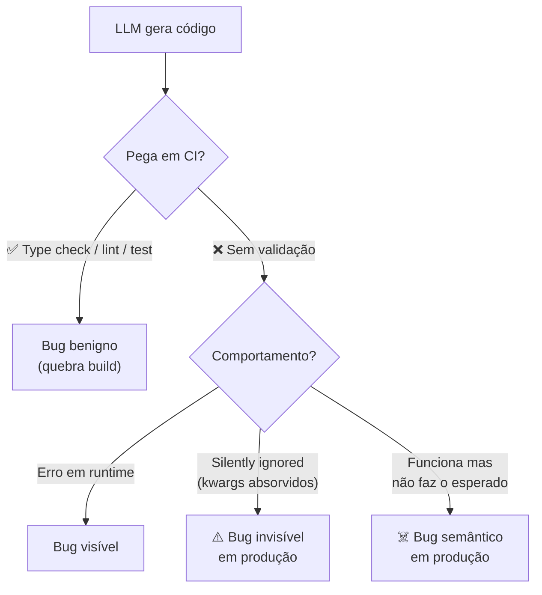

# Alucinações em código — APIs fantasma e parâmetros inexistentes

> [!abstract] TL;DR
> Além de [[02 - Slopsquatting — o ataque via alucinação|alucinar pacotes]], [[Dicionário de IA#LLM (Large Language Model)|LLMs]] [[Dicionário de IA#Hallucination|alucinam]] **dentro do código**: chamam métodos que não existem, passam parâmetros inventados, importam funções de módulos que não as exportam, criam tipos que ninguém declarou. Diferente de slopsquatting (vetor de ataque externo), essas alucinações são **bugs internos** que parecem código bom até alguém rodar. Detecção: type checker, linter, test, e — em projetos sérios — schema validation. O problema não é "o modelo é burro" — é que **plausibilidade visual ≠ correção semântica**.

> [!question]- Por que LLMs alucinam APIs e parâmetros que nunca existiram?
> O LLM não tem acesso à especificação formal de uma API — ele tem acesso às **ocorrências estatísticas** dessa API nos dados de treino. Quando uma lib é pouco representada, quando mudou entre versões, ou quando um nome de método é semanticamente parecido com outra lib, o modelo preenche a lacuna com o que é **mais provável dado o contexto** — não o que é tecnicamente correto. É o mesmo mecanismo que permite ao modelo gerar código fluente: pattern completion a partir de exemplos. A diferença é que em código, plausibilidade ≠ validade. O compilador e o type checker são as únicas fontes de verdade, não a confiança visual.

## Os 5 tipos de alucinação em código

Imagine o cenário: você pede para o assistente de IA "adicionar validação de e-mail no cadastro de usuário". Ele gera um bloco de código limpo, com nomes de função que fazem sentido, indentação correta, até um comentário explicando a lógica. Você lê por cima, parece competente, e aceita o diff. Dois dias depois, em produção, o campo `auto_validate=True` que o modelo inventou nunca fez nada — foi silenciosamente absorvido por um `**kwargs` que ninguém notou, e usuários continuam cadastrando e-mails inválidos. Não houve erro, não houve exceção, não houve sinal algum de que algo estava errado. É exatamente esse tipo de falha — sintaticamente perfeita, semanticamente fantasma — que os cinco padrões abaixo catalogam.

### 1. Métodos fantasma

```python
# Modelo gera:
result = response.json_safe()      # ← não existe em requests.Response

# Real:
result = response.json()            # API correta
```

Nome plausível. IDE corrige se você roda type check; passa silencioso se você não roda.

### 2. Parâmetros inventados

```python
# Modelo gera:
client.create_user(
    name="Maria",
    auto_validate=True,             # ← parâmetro não existe
    send_welcome_email=True
)

# Função real só aceita: name, email, role
```

Argumentos que **soam razoáveis**. Python aceita kwargs em assinaturas com `**kwargs`, então pode até rodar e ser silenciosamente ignorado.

### 3. Imports inválidos

```javascript
// Modelo gera:
import { useDeepCompareEffect } from 'react';   // ← não existe nativo

// Real:
import useDeepCompareEffect from 'use-deep-compare-effect'; // dep externa
```

Modelo confunde React core com hook de lib externa. Resultado: import quebrado em build.

### 4. Tipos inexistentes

```typescript
// Modelo gera:
function process(req: HttpRequest): HttpResponse { }

// Real: HttpRequest e HttpResponse não estão importados de lugar nenhum;
// modelo sugeriu nomes "razoáveis" sem checar tipos disponíveis
```

TypeScript pega na compilação. JavaScript puro deixa passar como `any`.

### 5. Comportamento alucinado

```python
# Modelo gera:
df.sort_by_multiple(["age", "name"])  # ← não existe; pandas usa sort_values

# Modelo gera (pior):
re.compile(pattern, flags=re.MAGIC)   # ← MAGIC não existe
```

O nome **descreve o que o dev quer**. Não corresponde à API real. LLM confundiu conceitos similares de outras libs.

## Por que LLMs fazem isso

| Causa | Exemplo |
|---|---|
| **Mistura entre versões** | API era assim em v1 da lib, mudou em v2 |
| **Confusão entre libs similares** | "Em pandas, sort_by_multiple não existe; em SQL, ORDER BY suporta múltiplas colunas" |
| **Pattern completion** | "Se função tem `create_user(name, email)`, modelo extrapola `auto_validate=` |
| **Naming intuitivo** | Modelo escolhe nome que **descreve o que faz**, não o que **é o nome real** |
| **Long-tail libs** | Lib pouco representada nos dados de treino |
| **Linguagens novas** | Pior em Rust, Zig, Mojo, etc. |

## A diferença entre alucinação benigna e perigosa



**Benigno:** quebra build → você descobre antes de mergir. **Perigoso:** silenciosamente passa → produção em fogo.

## A camada de validação que pega cada tipo

| Camada | Pega |
|---|---|
| **Type check** (mypy, tsc) | Métodos/tipos inexistentes (estático) |
| **Linter** (ruff, eslint) | Imports não-usados, problemas de assinatura |
| **Test suite** | Comportamento errado se houver teste |
| **Schema validation** (Pydantic, Zod) | Parâmetros não declarados rejeitados |
| **Mock checking** (autospec) | Tests catch quando lib mockada não tem método |
| **Production telemetry** | Última linha de defesa — exceções, erros |

> [!tip] Pelo menos type check + test em CI
> Time que merge sem essas duas em CI está convidando alucinações para produção. Não é negociável em 2026.

## Detecção sistemática

### Estratégia 1 — Strict type checking

```toml
# pyproject.toml — mypy strict
[tool.mypy]
strict = true
warn_unused_ignores = true
disallow_any_explicit = true
```

```json
// tsconfig.json — TypeScript strict
{
  "compilerOptions": {
    "strict": true,
    "noUncheckedIndexedAccess": true,
    "noImplicitOverride": true
  }
}
```

Strict pega 80%+ das alucinações estáticas.

### Estratégia 2 — Pydantic / Zod / runtime schemas

```python
class CreateUserRequest(BaseModel):
    model_config = ConfigDict(extra="forbid")  # ← rejeita kwargs inventados
    name: str
    email: EmailStr
    role: Literal["admin", "user"]
```

`extra="forbid"` faz Pydantic **rejeitar** parâmetros não declarados em vez de ignorar. Mata "parâmetros inventados" silenciosos.

### Estratégia 3 — Spec-as-source

Em [[Spec-Driven Development|03 - Níveis de rigor — spec-first, spec-anchored, spec-as-source|spec-as-source]], a spec é a fonte autoritativa de assinaturas. Geração derivada da spec **não pode alucinar** — só pode produzir o que está declarado.

### Estratégia 4 — LLM critic com referência externa

Pipeline:
1. LLM gera código
2. **Outro agente** (critic) consulta documentação real (MCP server de docs)
3. Critic flag se referência não existe
4. Bloqueia merge

Latência maior, mas pega alucinação semântica que linter não pega.

## Quando "compila e roda" não basta

> [!warning] False sense of safety
> Código que roda **pode** estar errado. Exemplos:
>
> - `**kwargs` absorve `auto_validate=True` silenciosamente
> - JavaScript prototype pollution permite "métodos fantasma" funcionarem
> - Python duck typing aceita objetos errados se eles têm o método certo
> - SQL silenciosamente ignora colunas se driver permite
>
> Smoke test não substitui type check + schema validation.

## Mitigação proativa

### Para o agente

- AGENTS.md instruir: *"Se incerto sobre API, USE tools (web search, doc lookup). Não invente."*
- Skill: *"Antes de chamar lib X, verifique no código se a função existe."*
- Hook pre-commit: rodar type check + test relevante

### Para o time

- Type check **obrigatório** em CI (não warning)
- Schema validation em todos os boundaries (input/output)
- Code review focado em "essa função/parâmetro existe mesmo?"
- Adicionar `extra="forbid"`, `strict: true` em todo schema novo

## Métricas

| Métrica | Alvo |
|---|---|
| **% PRs com type errors detectados em CI** | <5% (se >10%, modelos alucinando muito) |
| **% bugs em prod por "API não existia"** | <2% |
| **% schemas com extra=forbid / strict** | >90% em boundaries |
| **Tempo médio CI type check** | <2 min |

## Anti-patterns

- **Type check como warning, não erro** — vira ruído ignorado
- **Schemas permissivos** — `extra="allow"` ou `Object<string, any>` passam alucinações
- **Confiar no "olhômetro"** — alucinação visual é plausível por design
- **Skipar test em CI "porque é só ajuste"** — janela perfeita para alucinação semântica
- **Sem audit log de prompts** — não sabe qual prompt levou ao bug

## Armadilhas comuns

> [!warning] "Compila e roda" não significa "está correto"
> Linguagens dinâmicas como Python e JavaScript aceitam silenciosamente parâmetros inventados via `**kwargs` ou prototype lookup. Um LLM que passa `auto_validate=True` para uma função que não o aceita pode não causar erro — o kwarg é simplesmente ignorado, e o comportamento esperado (validação automática) nunca acontece. Smoke tests que não cobrem esse branch passam na CI e o bug vai para produção.

> [!warning] Type check configurado como "warning" vira ruído
> Muitos projetos têm mypy ou tsc configurados mas sem fail no CI quando há erros de tipo. O desenvolvedor habitua a ignorar os warnings do type checker na pipeline — e as alucinações passam. Type check precisa ser um gate de bloqueio, não uma lista de avisos decorativos.

> [!warning] Schemas permissivos são convites para alucinação silenciosa
> Pydantic com `extra="allow"` (padrão antes da v2) aceita qualquer campo inventado sem reclamar. O parâmetro `send_welcome_email=True` que o LLM adicionou entra no schema, é serializado, e some sem efeito — mas o desenvolvedor assume que funcionou. `extra="forbid"` é a única configuração que torna alucinações de parâmetros detectáveis no runtime.

## Como explicar em inglês

LLMs hallucinate not just package names, but entire APIs within code. They call methods that don't exist, pass parameters that were never declared, and import functions from modules that don't export them — all with the same visual fluency as correct code. This happens because the model generates based on statistical patterns, not formal specifications. A method name like `response.json_safe()` is plausible because it follows the naming conventions of the library; whether it actually exists is a separate question the model doesn't verify.

The dangerous hallucinations are the silent ones: in dynamically typed languages, a non-existent keyword argument may simply be absorbed by `**kwargs` and ignored. The code runs, tests pass, and the expected behavior never occurs. This is why type checkers, strict schema validation, and test coverage targeting the specific behaviors are non-negotiable gates — they are the only mechanisms that distinguish "looks right" from "is right."

**In a technical interview**, you might say:

> "We treat AI-generated code as potentially containing hallucinated APIs and parameters — not just bugs in logic, but references to things that don't exist. Our defense is a strict validation stack: mypy in strict mode blocks the build on type errors, Pydantic schemas use `extra='forbid'` so invented parameters cause failures at runtime, and we require test coverage for every new boundary the AI introduces. We also have a critic agent that checks generated API calls against live documentation via MCP before they reach code review."

| PT | EN |
|----|-----|
| alucinação | hallucination |
| método fantasma | phantom method / ghost method |
| parâmetro inventado | invented parameter / hallucinated argument |
| verificação de tipo | type checking |
| schema estrito | strict schema |
| validação em tempo de execução | runtime validation |
| argumento ignorado silenciosamente | silently ignored argument |
| completação de padrão | pattern completion |
| check de tipo como gate de CI | type check as CI gate |
| agente crítico | critic agent |

## O que vem a seguir

Agora que mapeamos como alucinações se manifestam — pacotes externos e APIs internas — a questão natural é: como organizar a validação de forma sistemática? Não como checklist, mas como uma estratégia em camadas onde cada gate faz a triagem que o anterior não consegue fazer.

A próxima nota introduz a pirâmide de validação AI: uma hierarquia de controles que vai desde análise estática até execução em sandbox, cada camada compensando os pontos cegos da anterior.

- [[04 - A pirâmide de validação AI]] — a hierarquia de controles que transforma validação ad-hoc em defesa sistemática

## Veja também

- [[01 - Código gerado por IA é untrusted]]
- [[02 - Slopsquatting — o ataque via alucinação]]
- [[05 - SAST e SCA para código AI]]
- [[09 - Testes imutáveis — a barreira que o agente não pode reescrever]]
- [[Spec-Driven Development|07 - Fase Validate — spec como contrato executável]]

## Referências

- **Veracode** — [*2025 GenAI Code Security Report*](https://www.veracode.com/resources/analyst-reports/2025-genai-code-security-report/) (2025).
- **Trend Micro** — [*Slopsquatting: When AI Agents Hallucinate Malicious Packages*](https://www.trendmicro.com/vinfo/us/security/news/cybercrime-and-digital-threats/slopsquatting-when-ai-agents-hallucinate-malicious-packages).
- **OWASP** — [*Top 10 for LLM Applications*](https://owasp.org/www-project-top-10-for-large-language-model-applications/) — categoria *Hallucination*.
- **Pydantic Documentation** — [*Models — extra fields (`extra="forbid"`)*](https://docs.pydantic.dev/latest/concepts/models/#extra-fields).


