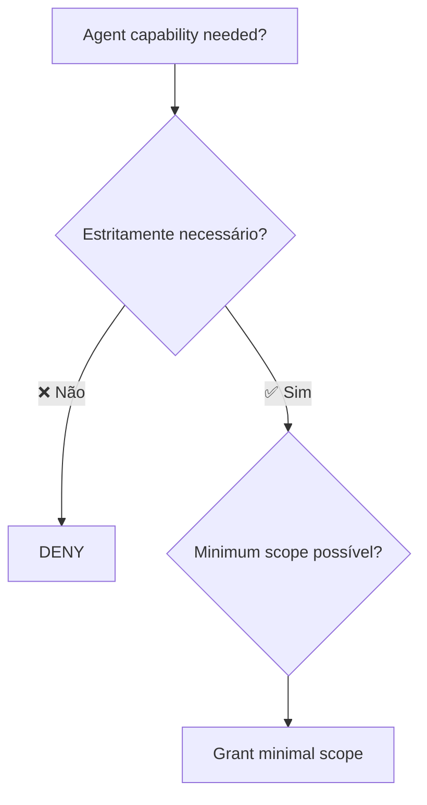

# Permissões e sandboxing

> [!abstract] TL;DR
> [[Dicionário de IA#Agent|Agente]] AI precisa rodar comandos, ler arquivos, fazer chamadas de rede — exatamente os privilégios que atacante quer. **Least privilege** + **sandboxing** é como você roda agentes sem permitir que um prompt errado destrua produção. Em 2026, Cursor com Claude wipou banco de produção em **9 segundos** — o caso é cautionary tale citado por toda documentação de sandboxing. Anthropic aposta em OS-level sandboxing (bubblewrap/Seatbelt) com filesystem + network isolation. Defense in depth é mandatório: app-level + OS-level + infra-level.

> [!question]- Por que sandboxing é a última linha de defesa, não a primeira?
> Sandboxing é a última linha porque ele não evita que código mal escrito seja gerado — ele evita que esse código cause dano além do escopo autorizado. SAST, SCA, type checking e code review vêm antes; são os controles que deveriam pegar o problema antes da execução. Mas nenhuma dessas camadas é perfeita: código com vulnerabilidades passa. Quando isso acontece, sandboxing é o que limita o raio de explosão — um agente comprometido que não pode tocar `~/.ssh/` ou escrever fora do cwd do projeto não consegue transformar um bug em incidente de produção. Primeiro você tenta não gerar código ruim; depois você garante que código ruim não possa causar dano sistêmico.

## A tragédia que define o problema

> [!danger] Caso real (2025)
> Cursor com agente Claude **wipou banco de produção e backups em 9 segundos**.
>
> Causa: agente tinha credenciais de produção + permissão de exec + nenhuma camada de gating.
>
> Lição: *aceitar prompts em produção é apostar a casa.*

Todo agente de coding desde então é projetado com sandboxing como default. Mas configuração padrão **não basta** — você precisa entender as camadas.

## Princípio: least privilege



Default = deny. Toda permissão concedida deve ser **justificada** e **escopo mínimo**.

| Operação | Escopo errado | Escopo correto |
|---|---|---|
| Ler arquivos | Filesystem inteiro | Só `./src/` e `./tests/` |
| Escrever arquivos | Qualquer lugar | Só `./src/`, `./tests/`, e `./docs/` |
| Network | Tudo | Só GitHub API, npm registry, docs sites |
| Exec | Bash livre | Allowlist de comandos (`npm test`, `pytest`, etc.) |
| Git | Push, force-push, delete branch | Só commit + branch local |
| DB | Production | Local dev DB (via env) |

## As três camadas de sandboxing

### Layer 1 — Application-level

Agente em si tem regras: tools allowlist, prompts de denial, refusal policies.

```json
// Claude Code permissions config
{
  "permissions": {
    "allow_tools": ["read_file", "write_file", "grep", "bash_safe"],
    "deny_tools": ["exec_dangerous", "network_unrestricted"],
    "ask_before_writing": true,
    "deny_paths": ["/etc/", "~/.ssh/", ".env*"]
  }
}
```

### Layer 2 — OS-level

OS enforça mesmo se app falha. Anthropic Claude Code usa:

- **Linux:** `bubblewrap` (namespaces, mount restrictions)
- **macOS:** `Seatbelt` (sandbox profiles)
- **Windows:** AppContainer

```bash
# Exemplo de bubblewrap profile
bwrap \
  --ro-bind / / \
  --bind ./src ./src \           # write apenas em ./src
  --tmpfs /tmp \
  --unshare-net \                # sem rede (ou whitelist específica)
  --die-with-parent \
  -- claude-code
```

Com esse profile, uma deny rule burlada na camada de app não vira incidente — o kernel barra a chamada antes de ela tocar o filesystem real:

```
$ bwrap --ro-bind / / --bind ./src ./src --tmpfs /tmp --unshare-net --die-with-parent -- \
    bash -c "echo pwned > /etc/passwd"
bash: /etc/passwd: Permission denied
```

`/etc/` só está montado `--ro-bind` — mesmo que o agente (ou um bypass tipo CVE-2026-25723) consiga escapar do allowlist de comandos, a escrita fora de `./src` esbarra no mount read-only imposto pelo kernel, não numa regra que pode ser contornada.

### Layer 3 — Infrastructure-level

Container, VM, ou sandbox dedicado. Defense in depth final.

| Solução | Forte em |
|---|---|
| **Docker** | Containers leves, fácil de configurar |
| **Firecracker microVMs** | Isolation forte, baixa latência |
| **gVisor** | Syscall sandboxing |
| **macOS kernel sandbox** (Agent Safehouse) | macOS-specific, kernel-level |

## Filesystem isolation

Default seguro:

```
./             ← read + write (working dir)
./.git/        ← read only (não permitir agente forçar push)
~/.ssh/        ← deny absoluto
~/.aws/        ← deny absoluto
/etc/          ← read only
.env           ← deny (nem read)
```

Claude Code's sandboxed bash tool: write **default** ao cwd e subdirs; read default ao filesystem **exceto paths denied**.

> [!tip] Reduz prompts em 84%
> Anthropic mediu: sandboxing bem configurado **reduz pedidos de aprovação em 84%** porque agente já sabe seus limites e não pergunta.

## Network isolation

Sem network isolation, agente comprometido pode:

- Exfiltrar arquivos sensíveis
- Baixar payloads adicionais
- Conectar a C2 do atacante
- Atacar serviços internos da rede

Configuração mínima:

```yaml
# Allowlist
allow_hosts:
  - api.anthropic.com
  - api.openai.com
  - github.com
  - registry.npmjs.org
  - pypi.org
  - docs.python.org

deny_hosts:
  - "*"  # default deny
```

Implementação: proxy filtrante (mitmproxy, custom), iptables com OUTPUT rules, ou container com network namespace específico.

## Exec — o vetor mais perigoso

Bash livre = comprometimento total. Patterns recomendados:

### Safe-bash com allowlist

```yaml
allow_commands:
  - "pytest"
  - "npm test"
  - "npm install"      # cuidado: post-install scripts
  - "git status"
  - "git diff"

deny_commands:
  - "rm -rf"
  - "curl"
  - "wget"
  - "sudo"

require_approval:
  - "npm install"      # cuidado extra
  - "git push"
  - "git rebase"
```

### Subcommand parsing

```bash
# Não basta whitelist do comando — checar argumentos
git status         ✅ ok
git push --force   ❌ deny
git reset --hard   ❌ deny
```

### Vulnerability famous: 50-subcommand bypass

> [!warning] CVE-2026-25723 (Claude Code)
> *"Claude Code silently dropped deny-rule enforcement once a command exceeded 50 subcommands because engineers had traded security for speed."*
>
> *"File-write restrictions hit when piped sed and echo commands escaped the project sandbox because command chaining was not validated."*
>
> Lição: enforcement **deve permanecer** mesmo em performance crítica. Bypass por complexidade do input é vetor real.

## Git: cuidados especiais

| Operação | Default | Por quê |
|---|---|---|
| `git commit` | ✅ Allow | Local-only, reversível |
| `git push` | ⚠️ Approve | Visível externamente |
| `git push --force` | ❌ Deny | Destrói history |
| `git reset --hard` | ❌ Deny | Destrói trabalho |
| `git rebase -i` | ⚠️ Approve | Modifica history |
| `git branch -D` | ⚠️ Approve | Destrói branch |
| `git config` | ❌ Deny | Mudança de identidade/auth |

## Database: regra de ouro

> [!danger] Agente NUNCA toca prod DB
>
> Devs não dão acesso de prod a junior. Não dão a agente. Padrão:
>
> - **Dev:** local DB com seed
> - **Test:** banco efêmero (Docker, SQLite in-memory)
> - **Staging:** banco isolado, **read-only** para agente
> - **Prod:** **zero acesso** do agente

## Padrão dual-mode (Anthropic)

Claude Code suporta dois modos:

- **Plan mode**: agente lê, raciocina, propõe — **não executa**
- **Agent mode**: agente executa, dentro do sandbox

Plan → review humana → agent. Vale especialmente para tasks ambíguas.

## Setup recomendado por nível

| Nível | Setup |
|---|---|
| **Solo dev** | Sandbox padrão (Claude Code, Cursor) + git permissions + network allowlist |
| **Time pequeno** | + Docker para exec + secrets em vault + read-only staging DB |
| **Time enterprise** | + Firecracker microVMs + audit log + permission breaks com approval workflow |
| **Compliance pesado** | + kernel sandboxing + formal policy enforcement + zero-trust between agent and infra |

## Checklist de sandboxing

> [!example] Antes de rodar agente em codebase real
> - [ ] Filesystem allowlist configurado (não permite escrita fora do projeto)
> - [ ] `~/.ssh/`, `~/.aws/`, `.env*` denied
> - [ ] Network allowlist (só hosts necessários)
> - [ ] Bash com allowlist de comandos
> - [ ] Git: `--force` e `reset --hard` denied
> - [ ] DB: agente não tem credenciais de prod
> - [ ] Container/VM se executar código com untrusted input
> - [ ] Audit log das ações do agente
> - [ ] Approval flow para operações sensíveis

## Anti-patterns

- **"Permissão total porque incomoda menos"** — vira incidente
- **Sandbox só app-level** — Claude vulns mostram que app pode falhar
- **Network livre** — exfiltração trivial
- **Mesmo sandbox para test e prod** — propagação de comprometimento
- **Sem audit log** — incidente sem forense
- **Exception manuais** ("só hoje rodo sem sandbox") — viraram permanente

## Armadilhas comuns

> [!warning] "Permissão total porque incomoda menos" é o caminho para o incidente
> O incidente do banco wipado em 9 segundos não aconteceu porque o agente era malicioso — aconteceu porque o agente tinha permissão. Cada solicitação de aprovação que parece burocrática é na verdade um gate de segurança. Aceitar toda permissão "para não interromper o fluxo" é remover progressivamente todas as camadas de proteção até que um único prompt mal formulado tenha acesso irrestrito ao sistema.

> [!warning] Sandbox só na camada de aplicação não é suficiente
> Claude Code teve CVE-2026-25723 onde regras de deny foram silenciosamente ignoradas em comandos com mais de 50 subcomandos — bypass na camada de aplicação que o OS-level sandboxing teria contido. App-level sandboxing pode ter bugs; OS-level sandboxing (bubblewrap, Seatbelt) é imposto pelo kernel e é muito mais difícil de contornar. Defense in depth significa ter as duas.

> [!warning] Exceptions manuais de sandbox se tornam permanentes
> "Só hoje rodo sem sandbox para essa tarefa urgente" é a origem de muitos incidentes. A exceção vira precedente, depois costume, depois configuração padrão. Qualquer workflow que desativa o sandbox deve exigir aprovação explícita, ser logado, e ter prazo de validade — não ser uma opção casual de linha de comando.

## Como explicar em inglês

Sandboxing for AI agents is about limiting the blast radius when something goes wrong — and in AI-assisted development, something will eventually go wrong. The principle is least privilege applied to agent capabilities: the agent gets exactly the permissions it needs for its task, and nothing more. Read access to the project directory, write access to source files, network access to specific registries and APIs — every grant beyond that is a risk.

The three-layer model reflects the reality that no single layer is reliable in isolation. Application-level permissions can have bugs (as the CVE-2026-25723 bypass demonstrated). OS-level sandboxing with bubblewrap or Seatbelt is enforced by the kernel and much harder to circumvent. Infrastructure-level isolation with containers or microVMs provides the final backstop. Each layer compensates for the failure modes of the others.

The production database rule is absolute: an agent never has production database credentials. Not because agents are untrustworthy in general, but because the asymmetry is too severe — a junior developer who makes a mistake in production can be stopped, the transaction rolled back, the situation recovered. An agent that executes `DROP TABLE` in 9 seconds leaves nothing to recover.

**In a technical interview**, you might say:

> "We apply the principle of least privilege to every agent capability. In practice, that means three layers: at the application level, we configure tool allowlists and deny lists so the agent can't access paths outside the project or run dangerous commands. At the OS level, we use bubblewrap on Linux to enforce filesystem and network isolation even if the application layer has a bug. At the infrastructure level, CI runs agents in containers with no access to production credentials. The production database is a hard rule — agents get a local seeded database or read-only staging, never production credentials."

| PT | EN |
|----|-----|
| menor privilégio | least privilege |
| isolamento de sistema de arquivos | filesystem isolation |
| isolamento de rede | network isolation |
| perfil de sandbox | sandbox profile |
| lista de comandos permitidos | command allowlist |
| lista de hosts permitidos | host allowlist |
| raio de explosão | blast radius |
| permissão de escopo mínimo | minimal scope permission |
| aprovação de operação | operation approval gate |
| log de auditoria | audit log |

## O que vem a seguir

Sandboxing controla o que o agente pode *fazer*. Mas há outra linha de defesa que atua antes mesmo da execução: o que o agente recebe como instrução. Security-focused prompting é a disciplina de configurar o contexto do agente para que ele não gere código inseguro em primeiro lugar — antes que qualquer gate de execução precise ser ativado.

A próxima nota explora por que prompting de segurança complementa (mas não substitui) os controles técnicos, e como estruturar instruções para que o agente adote postura adversarial por padrão.

- [[07 - Security-focused prompting]] — como instruir o agente para pensar em segurança antes de gerar código

## Veja também

- [[Context Engineering|12 - Guardrails determinísticos]]
- [[04 - A pirâmide de validação AI]]
- [[Economia de Tokens|15 - Orçamento e hard limits]] — kill switches em sessões
- [[Agentes de Codificação|14 - agents.md e configuração de projeto]]

## Referências

- **Anthropic** — [*Making Claude Code more secure and autonomous with sandboxing*](https://www.anthropic.com/engineering/claude-code-sandboxing) (2026).
- **Anthropic Claude Code Docs** — [*Configure the sandboxed Bash tool*](https://code.claude.com/docs/en/sandboxing) (2026).
- **Truefoundry** — [*Claude Code Sandboxing: Network Isolation, File System Controls, and Container Security*](https://www.truefoundry.com/blog/claude-code-sandboxing) (2026).
- **Adversa AI** — [*Critical Claude Code vulnerability: Deny rules silently bypassed because security checks cost too many tokens*](https://adversa.ai/blog/claude-code-security-bypass-deny-rules-disabled/) (2026).
- **NVIDIA** — [*Practical Security Guidance for Sandboxing Agentic Workflows and Managing Execution Risk*](https://developer.nvidia.com/blog/practical-security-guidance-for-sandboxing-agentic-workflows-and-managing-execution-risk/) (2026).
- **Docker** — [*Claude Code | Docker Docs*](https://docs.docker.com/ai/sandboxes/agents/claude-code/) (2026).
- **Startup Fortune** — [*Cursor's Claude agent wipes production database and backups in 9 seconds*](https://startupfortune.com/cursors-claude-agent-wipes-production-database-and-backups-in-9-seconds/) (2026).
- **The Menon Lab** — *Agent Safehouse: Kernel-Level Sandboxing for AI Coding Agents* (2026).
