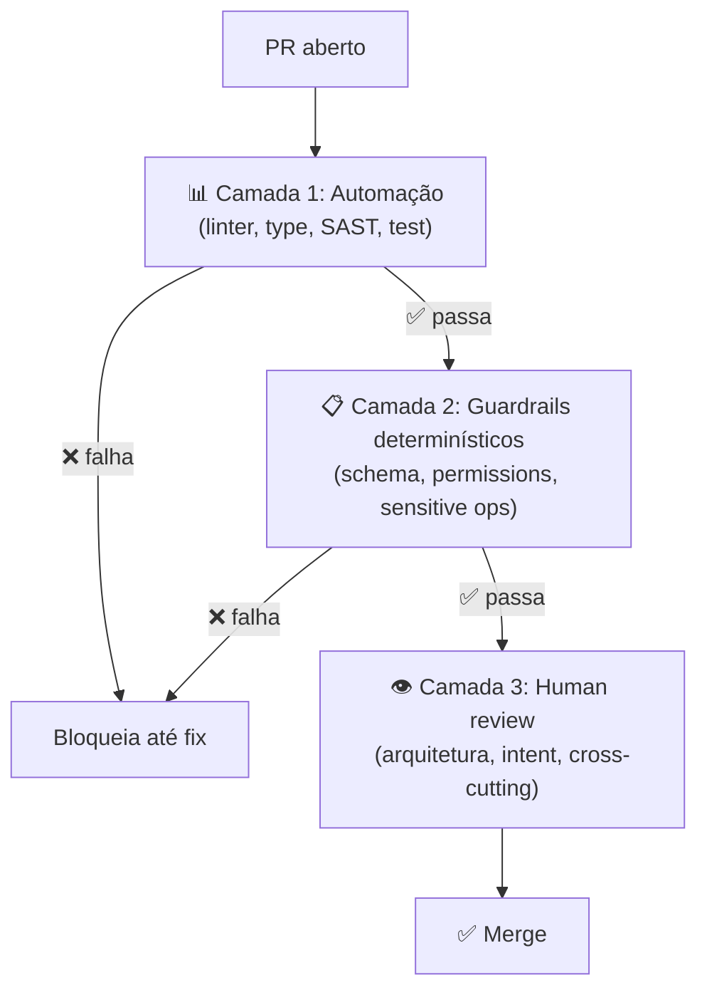

# Code review de código AI — o que muda

Um tech lead abre a fila de PRs na segunda-feira e encontra 47 pull requests esperando review — contra as 8-10 de um mês atrás, antes do time adotar agentes de codificação em produção. Cada PR "parece" bem escrito: nomes de variável claros, comentários explicando cada passo, testes que passam. Ele aprova os primeiros dez em vinte minutos, sente o alívio de estar "em dia", e só descobre três semanas depois — quando um endpoint de cobrança processa valores duplicados em produção — que um desses PRs continha uma race condition que nenhum humano jamais olhou de verdade. O reviewer não falhou por preguiça; falhou porque aplicou o processo de review desenhado para volume humano a um volume que só automação suporta.

> [!abstract] TL;DR
> Code review de código gerado por IA **não é o mesmo** de código humano. Volume é maior (5-10x), velocidade é maior, viés do reviewer é diferente (aceita demais por inércia), e classes de defeito são diferentes ([[Dicionário de IA#Hallucination|alucinações]] + vulnerabilidades sistemáticas). A regra: **delegue o que máquina faz para [[04 - A pirâmide de validação AI|automação]]**, e **foque humano** em arquitetura, intent, e mudanças cross-cutting. Esta nota apresenta o checklist específico, os red flags, e o anti-pattern do "approve fadigado" que está mascarando débito em todo lugar em 2026.

> [!question]- O que muda fundamentalmente no code review quando o autor é IA?
> Com código humano, bugs são distribuídos pelo estilo individual do autor — você desenvolve intuição para os pontos cegos de cada pessoa no time. Com código AI, os bugs são **sistemáticos por classe**: o mesmo modelo comete o mesmo tipo de erro em todos os PRs. Isso muda o que vale revisar: em vez de procurar bugs idiossincráticos, você procura padrões conhecidos (XSS sem escape, queries com f-string, parâmetros alucinados). Mais importante: o viés de automação inverte — código AI parece confiante e fluente mesmo quando está errado, e reviewers tendem a aprovar por inércia. O volume 5-10x maior amplifica isso a ponto de review manual sem automação se tornar inviável.

## Por que review tradicional falha

| Review tradicional | Code review de IA |
|---|---|
| 5-10 PRs/dev/semana | 50+ PRs (incluindo IA) |
| Reviewer conhece o autor | Autor é "modelo X versão Y" |
| Bugs distribuídos por estilo individual | Bugs **sistemáticos** por classe |
| Volume cabe em atenção humana | Volume **esmaga** atenção humana |
| Critério: "faz sentido?" | Critério: "atende contrato?" |

Aplicar review tradicional a volume IA = **review fadigado** = approve sem ler.

## A divisão de trabalho correta



Humano **só vê** o que **precisa** de julgamento humano. Se PR fica em camadas 1 ou 2, **nem chega** ao reviewer.

## O que humano deve checar (sim)

### 1. Intent vs implementation

> *"Esse código atende ao 'porquê' da feature?"*

[[Dicionário de IA#LLM (Large Language Model)|LLM]] atende ao "o quê" tipicamente bem (especialmente com [[Spec-Driven Development|02 - O que é Spec-Driven Development|spec]]). Atende ao "porquê" tipicamente mal — não tem visão estratégica do produto.

Pergunte:
- Esse approach faz sentido para o negócio?
- Foi resolvido o problema correto, ou só implementado o que o ticket pediu?
- Há trade-offs implícitos que precisam ser explicados?

### 2. Mudanças cross-cutting

PRs que tocam vários módulos são alto risco. LLM pode quebrar invariantes que estão em pedaços não-óbvios da codebase.

Procure:
- Mudança em padrão usado em vários lugares mas só atualizado em um
- Adição de dependência que afeta outros módulos
- Mudança em interface compartilhada
- Migration que afeta dados existentes

### 3. Decisões arquiteturais

Mesmo com [[Spec-Driven Development|05 - Fase Design e Plan — arquitetura e decomposição|plan]], LLM pode introduzir patterns alternativos que conflitam com convenções do projeto.

Procure:
- Novo pattern arquitetural sem ADR
- "Service" criado quando outro fazia parecido
- Camada extra que duplica responsabilidade
- Dependência que viola layering (ex: model importando service)

### 4. Edge cases sutis

Acceptance tests cobrem casos esperados. LLM tende a **não pensar** em casos não esperados.

Procure:
- O que acontece se input é vazio? null? muito grande?
- Concorrência: dois usuários simultâneos?
- Falha parcial: tool 1 ok, tool 2 falhou?
- Timeout: e se o request demorar 30s?
- Retry: e se o request for repetido?

### 5. Mudanças sensíveis

Mesmo com camadas 1 e 2 verdes, **estas exigem humano**:

- Mudança em código de auth/authorization
- Migrations destrutivas (DROP COLUMN, etc.)
- Mudança em código de cobrança/pagamento
- Alteração em política de logging (especialmente PII)
- Alteração em CI/CD security gates
- Atualização de dependências críticas

## O que humano NÃO deve checar (não)

Coisas que máquina faz **melhor**:

- Estilo de código (linter)
- Tipos (type checker)
- XSS, SQL injection, etc. (SAST)
- Pacotes vulneráveis (SCA)
- Coverage de testes (CI)
- Format / spacing (formatter)
- Imports não usados (linter)

Se você está checando isso manualmente, está **gastando humano em automação**. Mova para CI.

## Red flags em PR de IA

> [!warning] Sinais de alerta
> - **PR enorme** (>500 LOC adicionadas) — provavelmente vibe-coded
> - **Sem tests novos** ou tests que não falham se você quebrar a feature
> - **Many small unrelated changes** ("aproveitei e refatorei isso aqui também")
> - **Comentários explicando o óbvio** (sinal de modelo "preenchendo")
> - **Imports estranhos ou compostos** (`react-codeshift`, possível [[02 - Slopsquatting — o ataque via alucinação|slopsquat]])
> - **API calls com parâmetros não documentados** ([[03 - Alucinações em código — APIs fantasma e parâmetros inexistentes|alucinação]])
> - **Mudança "drive-by" em arquivo não relacionado** — drift
> - **Justificativa vaga**: "fix bug" sem dizer qual
> - **Resposta do autor "o agente fez"** quando perguntado sobre escolha — sem [[Dicionário de IA#Comprehension gate|comprehension gate]]

## Checklist de review para AI PR

```markdown
## AI Code Review Checklist

### Arquitetura
- [ ] Approach faz sentido para o problema?
- [ ] Não introduz pattern divergente do projeto?
- [ ] Não viola separation of concerns / layering?

### Intent
- [ ] Atende ao "porquê" do ticket, não só "o quê"?
- [ ] Trade-offs implícitos estão documentados?
- [ ] Out-of-scope da spec foi respeitado?

### Edge cases
- [ ] Input vazio / null / muito grande?
- [ ] Concorrência?
- [ ] Falha parcial / retry?
- [ ] Timeout?

### Cross-cutting
- [ ] Padrão alterado em todos os lugares relevantes?
- [ ] Dependências afetadas atualizadas?
- [ ] Migration não quebra dados existentes?

### Specific risk
- [ ] Auth / authorization tocado? (escalação extra)
- [ ] DB migration destrutiva? (escalação extra)
- [ ] Cobrança / dados sensíveis? (escalação extra)

### Sanity
- [ ] PR de tamanho razoável (<300 LOC ideal)?
- [ ] Tests novos cobrem comportamento, não só linha?
- [ ] Imports não suspeitos?
- [ ] Comentários úteis (não "preenchimento")?
```

## Routing automático

Em volume alto, route reviews por categoria:

```yaml
# Pseudo-config de routing
routes:
  - if: changed_files matches "src/auth/**"
    require: senior_dev + security_team

  - if: changed_files matches "migrations/**"
    require: senior_dev + dba

  - if: pr_size > 500
    require: senior_dev
    label: "large-pr-review-needed"

  - if: changed_files matches "tests/**"
    require: any_dev  # tests são candidato a review mais leve

  - default:
    require: any_dev
```

Filtra automaticamente: PRs sensíveis vão para reviewers certos. PRs rotina vão para qualquer um.

## Comprehension gate aplicado

[[Agentes de Codificação|03 - O comprehension gate]] em prática durante review:

> [!quote]
> *"Se o autor (humano que abriu o PR) não consegue explicar a mudança, NÃO mergeie. Se você (reviewer) não entende a mudança, NÃO aprove."*

Adapte: peça ao autor para explicar **a decisão arquitetural** — não a mudança linha-a-linha. Se ele recorre a "o agente fez assim", o gate falhou.

## Métricas de review

| Métrica | Alvo |
|---|---|
| **Tempo médio review** | <2h após CI verde |
| **Mean comments por PR** | 1-3 (acima → camadas 1-2 fracas; abaixo → review superficial) |
| **% PRs aprovados sem comentário** | <30% (acima → review fadigado) |
| **% bugs em prod por classe "passou no review"** | <2% |
| **% PRs revertidos** | <3% |
| **Reviewer fatigue index** | Watch out — métrica nova |

## Anti-patterns

- **"LGTM" como pattern** — review virou ritual; rever processo
- **Reviewer único para tudo** — tech lead fadigado vira gargalo
- **Review depois do merge** ("merge first, review later") — política de débito
- **"O agente fez, eu só rodei"** — autor sem comprehension gate
- **Aprovar com testes vermelhos** — destrói o sinal completamente
- **Sem checklist** — review depende do dia do reviewer

## Armadilhas comuns

> [!warning] "LGTM" como pattern de review mata a segurança
> Quando "LGTM" (looks good to me) se torna a resposta padrão em PRs de IA, o processo de review virou teatro. Isso acontece quando as camadas de automação são fracas e o reviewer está sobrecarregado com volume. O sinal é o percentual de PRs aprovados sem nenhum comentário subindo acima de 30%. A solução não é "revisar com mais cuidado" — é fortalecer as camadas 1 e 2 para que o reviewer receba menos PRs, mas cada um mereça atenção real.

> [!warning] "O agente fez" é ausência de comprehension gate
> Se o autor do PR não consegue explicar as decisões arquiteturais presentes no código — apenas que "o agente gerou assim" — o comprehension gate falhou. Código que ninguém no time entende é código que ninguém no time pode manter, depurar, ou evoluir com segurança. Review deve incluir perguntar ao autor sobre as decisões, não só verificar o resultado.

> [!warning] Fazer review depois do merge é política de débito acumulado
> "Merge first, review later" elimina o único gate humano antes de produção. Em código AI que pode conter alucinações, vulnerabilidades sistemáticas e mudanças cross-cutting não intencionais, essa política garante que problemas entrem na base de código antes de qualquer validação humana. O custo de reverter um merge é quase sempre maior que o custo de fazer review antes.

## Como explicar em inglês

Code review for AI-generated code differs from traditional review in three critical ways. First, volume: an AI-assisted team can generate 5-10x more PRs per week, which makes the traditional one-reviewer-per-PR model unscalable. Second, error distribution: human bugs are idiosyncratic and tied to individual styles; AI bugs are systematic by class — the same model makes the same type of error across all its output. Third, reviewer bias: code that reads fluently and confidently tends to get approved more readily, and AI-generated code is optimized for fluency even when incorrect.

The correct response is not "review harder" — it's a division of labor where automation handles the high-volume mechanical checks (types, linters, SAST, SCA, tests) and humans focus exclusively on what requires judgment: architecture decisions, intent alignment, cross-cutting changes, and sensitive operations. The comprehension gate principle applies directly: if the human author of the PR can't explain the architectural decisions made by the agent, the PR should not be merged.

**In a technical interview**, you might say:

> "We restructured code review around a three-layer model. Layers one and two — automation and deterministic guardrails — handle everything that's codifiable: type errors, SAST findings, SCA vulnerabilities, test coverage. Reviewers only see PRs that pass those layers, which is maybe 30-40% of what gets opened. For those PRs, the review focuses on three things: intent alignment (did the agent solve the right problem?), architectural decisions (does this introduce patterns inconsistent with the project?), and sensitive areas like auth changes or destructive migrations that always require escalated review. We also enforce a comprehension gate — if the developer who opened the PR can't explain why the agent made a particular architectural choice, we require a revision before merge."

| PT | EN |
|----|-----|
| revisão de código | code review |
| fadiga do revisor | reviewer fatigue |
| bugs sistemáticos | systematic bugs |
| gate de compreensão | comprehension gate |
| revisão focada em intent | intent-focused review |
| mudança transversal | cross-cutting change |
| roteamento de revisão | review routing |
| derivação de código | code drift |
| alucinação de parâmetro | parameter hallucination |
| aprovação por inércia | rubber-stamp approval |

## O que vem a seguir

Code review é o gate humano sobre o código gerado. Mas há um gate igualmente crítico que o *agente* não pode ultrapassar: os testes. A próxima nota explora o princípio dos testes imutáveis — por que é fundamental que o agente não possa modificar os testes que validam seu próprio comportamento, e como implementar essa barreira técnica e organizacionalmente.

- [[09 - Testes imutáveis — a barreira que o agente não pode reescrever]] — como proteger os testes de modificação pelo próprio agente que está sendo testado

## Veja também

- [[04 - A pirâmide de validação AI]]
- [[09 - Testes imutáveis — a barreira que o agente não pode reescrever]]
- [[10 - Métricas de qualidade AI — defect escape rate, rework ratio]]
- [[Agentes de Codificação|03 - O comprehension gate]]
- [[Spec-Driven Development|07 - Fase Validate — spec como contrato executável]]

## Referências

- **Anthropic** — *Best practices for Claude Code* — https://code.claude.com/docs/en/best-practices (2026).
- **GitHub** — *Review AI-generated code* — https://docs.github.com/en/copilot/tutorials/review-ai-generated-code (2026).
- **Augment Code** — *How AI Enhances Spec-Driven Development Workflows* — https://www.augmentcode.com/guides/ai-spec-driven-development-workflows (2026).
- **Atlassian** — *How Atlassian cut PR cycle time by 45% with AI code reviews* — https://www.atlassian.com/blog/announcements/how-we-cut-pr-cycle-time-with-ai-code-reviews (2026).
- **Plus8Soft** — *AI Coding Agents in 2026: How They Work, What They Break, and How to Use Them Right* (seção "Comprehension Gate") — https://plus8soft.com/blog/ai-coding-agents/ (2026).


