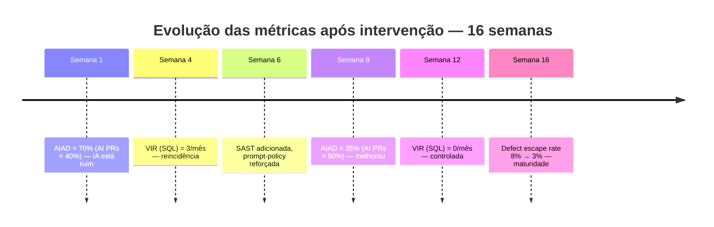

# Métricas de qualidade AI — defect escape rate, rework ratio

> [!abstract] TL;DR
> "Estamos produzindo mais com IA" não é métrica — é vibe. As métricas que importam medem **qualidade líquida**: quantos bugs escaparam para prod (defect escape rate), quanto código foi reescrito sobre código gerado (rework ratio), quanto tempo passou entre código aceito e bug em prod (mean time to defect), e quantas vulns de cada classe foram introduzidas. Sem essas métricas, time não sabe se está acumulando ou pagando débito. Esta nota dá o set mínimo para acompanhar honestamente.

> [!question]- Por que métricas de qualidade tradicionais falham em código AI?
> Métricas tradicionais como "velocity" (story points), "LOC adicionadas/dia" e "% de testes passando" foram projetadas para medir produção humana, onde qualidade e quantidade tendem a correlacionar. Código AI quebra essa correlação: um LLM pode gerar 10x mais LOC por dia, com tests verdes, enquanto acumula rework ratio de 60% e defect escape rate triplicando. "Velocity subiu 40% com IA" pode ser verdadeiro e enganoso ao mesmo tempo se o rework ratio dobrou e o MTTD caiu para dias. Métricas adaptadas medem o que importa: qual fração do código gerado sobrevive ao escrutínio, e quanto dele cria problemas em produção.

## A pergunta que essas métricas respondem

> *"O ganho de velocidade está sendo comido por retrabalho e bugs?"*

Velocidade bruta sem qualidade é **ilusão produtiva**. As métricas abaixo separam ganho real de ganho aparente.

## As 5 métricas essenciais

### 1. Defect escape rate (DER)

**Definição:** % de bugs que **escapam** das camadas de validação ([[04 - A pirâmide de validação AI]]) e chegam em produção.

```
DER = bugs detectados em prod / total de bugs detectados (CI + review + prod)
```

**Alvo:** <5% para AI code; <2% para projeto maduro.

**Cuidado:** medir só "bugs detectados em prod" sem dividir mascara realidade. Time pode estar **sem bugs detectados** porque sem usuários, não porque qualidade é alta.

### 2. Rework ratio

**Definição:** % de LOC reescritas em até 2 sprints sobre LOC adicionadas.

```
Rework = LOC mudadas em files alterados pelos últimos 30 dias / LOC total adicionadas
```

**Alvo:** <20%. Acima disso, time está produzindo código que precisa ser refeito — débito puro.

**Como medir:** `git log` + análise de diff sobre arquivos. Tools: GitClear, Code Climate.

> [!info] Insight crítico
> *"Times com adoção desprotegida de IA frequentemente têm rework ratio de 40-60% — significa que mais de metade do código gerado precisou ser refeito antes de estabilizar."* — pesquisa Augment Code, 2026.

### 3. Mean time to defect (MTTD)

**Definição:** Tempo médio entre código mergido e bug detectado em prod (que não foi pego em CI/review).

**Alvo:** longe — quanto mais tempo passa sem bug, mais robusto o código.

**Sinal de alerta:** MTTD curto (dias) = código gerado tem bugs que não fomos capazes de detectar antes.

```
MTTD = média(timestamp_bug_em_prod - timestamp_merge_PR_origem)
```

### 4. Vulnerability introduction rate (VIR)

**Definição:** Quantas vulnerabilidades de cada classe (CWE) entraram via PRs nos últimos N dias.

| CWE | Categoria | Alvo |
|---|---|---|
| CWE-89 | SQL Injection | 0 |
| CWE-78 | Command Injection | 0 |
| CWE-918 | SSRF | 0 |
| CWE-798 | Hardcoded creds | 0 |
| CWE-22 | Path Traversal | 0 |
| CWE-80 | XSS | <2/mês |
| CWE-117 | Log Injection | <5/mês |

VIR > 0 em CWE crítica = camadas de validação falhando.

### 5. AI-attributable defects (AIAD)

**Definição:** Bugs que vieram especificamente de PRs com geração de IA (vs PRs humanos).

**Como medir:** label `ai-generated` em PRs (manual ou auto-detection); rastrear bugs de prod até PR origem.

```
AIAD = bugs originados em PRs com ai-generated / total bugs
```

**Alvo:** AIAD < % de PRs com IA. Se 60% PRs são AI mas AIAD = 80%, IA está produzindo qualidade pior que humano.

## Métricas vanity (a evitar)

| Métrica vanity | Por que engana | Use no lugar |
|---|---|---|
| LOC adicionadas/dia | Mais código ≠ mais valor | Features completas/sprint |
| % de PRs com IA | Uso ≠ valor | AIAD + qualidade líquida |
| [[Dicionário de IA#Token\|Tokens]] consumidos | Uso ≠ valor | Horas economizadas validadas |
| % de tests passing | Pode estar testando errado | Defect escape rate |
| Velocity (story points) | Inflado quando "easy" | Cycle time real |

## Dashboard mínimo

```
┌─────────────────────────────────────────────────┐
│   AI Code Quality Dashboard                     │
├─────────────────────────────────────────────────┤
│   Defect escape rate:   3.2%   ✅ (alvo: <5%)   │
│   Rework ratio:         18%    ✅ (alvo: <20%)  │
│   MTTD:                 14d    ✅ (alvo: >7d)   │
│   Critical CWEs (30d):  0      ✅ (alvo: 0)     │
│   AIAD vs % AI PRs:     55/60% ✅ (alvo: AIAD ≤)│
├─────────────────────────────────────────────────┤
│   Velocity (líquido):   +18% vs Q4              │
│   AI code volume:       +110% vs Q4             │
└─────────────────────────────────────────────────┘
```

Tudo em uma tela. Time olha semanalmente.

## Como instrumentar

### Para defect escape rate

- Issue tracker (GitHub, Jira) com tag `bug-from-prod`
- Pipeline de CI conta bugs detectados pre-merge (lint failures, test failures)
- Calcula proporção mensalmente

### Para rework ratio

```bash
# Pseudo-script
cd repo
since="30 days ago"

# LOC adicionadas no período
added=$(git log --since="$since" --numstat | awk '{total += $1} END {print total}')

# LOC modificadas em arquivos que tiveram >1 commit no período
rework=$(git log --since="$since" --name-only --format="" | sort | uniq -c | awk '$1 > 1' | xargs git diff --numstat HEAD~30 HEAD | awk '{total += $1} END {print total}')

echo "Rework ratio: $(bc -l <<< "$rework / $added * 100")%"
```

### Para MTTD

Requer link **PR origem ↔ bug ticket**. Convenção: PR description tem `Closes: BUG-123`. Métrica = `bug.created_at - PR.merged_at`.

### Para VIR

Saída de [[05 - SAST e SCA para código AI|SAST]] em CI agregada por CWE. Criar cards no painel.

### Para AIAD

Tag em PRs (manual ou auto: PR description menciona Cursor/Claude/etc.). Bug tracker linka a PR origem.

## Cadência

| Métrica | Frequência |
|---|---|
| Defect escape rate | Mensal |
| Rework ratio | Mensal |
| MTTD | Mensal |
| VIR | Semanal (alerta em CWE crítica) |
| AIAD | Mensal |

Revisão **trimestral** profunda: time discute tendências, ajusta processo.

## Sinais de alerta

> [!warning] Quando reagir
>
> | Sinal | Causa provável | Reação |
> |---|---|---|
> | DER subindo | Camadas de validação afrouxando | Reforce SAST, mais review |
> | Rework subindo | Specs vagas ou agente inadequado | Revisitar spec rigor |
> | MTTD encurtando | Bugs entrando "junto" do merge | Slow down, melhor review |
> | VIR > 0 em crítica | Pipeline com gap | Adicione regra específica de SAST |
> | AIAD > % AI PRs | IA pior que humano | Revisão de adoção; treinamento; melhor sandbox |

## A história que dashboards contam

```
Semana 1: AIAD = 70%, AI PRs = 40%   ← IA está ruim
Semana 4: VIR (SQL) = 3/mês          ← reincidência
Semana 6: SAST adicionada, prompt-policy reforçada
Semana 8: AIAD = 35%, AI PRs = 50%   ← melhorou
Semana 12: VIR (SQL) = 0/mês         ← controlada
Semana 16: Defect escape = 8% → 3%   ← maturidade
```

A mesma história, em linha do tempo — cada marco é o mesmo dado do bloco acima, só que visível de relance:



Repare o padrão: nenhum marco é "consertar tudo de uma vez". É intervenção pontual (SAST na semana 6) seguida de observação (VIR cai só na semana 12) — a métrica confirma o efeito, não o substitui.

Sem métricas, time **não sabe** se intervenção funcionou.

## Anti-patterns

- **Vanity metrics em dashboard** — líderes acham que vai bem
- **Sem baseline pré-IA** — não consegue medir impacto
- **Métricas só mensais** — alerta tarde
- **Esconder DER por medo de "parecer mal"** — perde aprendizado
- **AIAD sem isolar AI vs humano** — não consegue debugar
- **Métricas sem ação** — relatório bonito sem fix implementado

## Métricas que enganam executivos

> [!danger] Reportes externos enganam
> "Velocity subiu 40% com IA" sem mencionar:
> - Rework ratio dobrou
> - Defect escape rate triplicou
> - MTTD caiu de 30d para 4d
>
> Líderes técnicos têm responsabilidade ética de **mostrar o quadro completo**. Reportar só ganho mascara dívida.

## Armadilhas comuns

> [!warning] Reportar só ganho de velocity mascara débito técnico
> "Velocity subiu 40% com IA" sem mencionar que rework ratio dobrou e defect escape rate triplicou é tecnicamente verdadeiro e eticamente problemático. Líderes técnicos que reportam apenas o número positivo estão construindo pressão para manter uma adoção que está criando débito silenciosamente. O quadro completo — ganhos e custos — é obrigatório para decisões informadas sobre adoção de IA.

> [!warning] Sem baseline pré-IA, não dá para medir impacto
> "AIAD = 55%" significa que IA é boa, média, ou ruim? Sem dados históricos de qualidade antes da adoção de IA, não há como comparar. Times que adotam IA sem registrar as métricas atuais primeiro perdem a referência para avaliar o impacto real. Baseline pré-IA é um pré-requisito para qualquer avaliação honesta.

> [!warning] Métricas sem ação são relatório decorativo
> Dashboard bonito com DER subindo e MTTD encurtando que não gera nenhuma mudança de processo é teatro de qualidade. Cada sinal de alerta precisa de dono, prazo, e ação específica — adicionar regra de SAST, fortalecer revisão de code review, rever a especificação usada nos prompts. Sem essa conexão métrica → ação, o dashboard existe para apresentar em reunião, não para melhorar o produto.

## Como explicar em inglês

Quality metrics for AI-generated code exist to answer one question: is the speed gain from AI assistance real, or is it velocity debt that will be paid as rework and production incidents? The traditional metrics — story points, LOC per day, test pass rate — don't capture this because they measure output, not quality of output.

The five core metrics fill that gap. Defect escape rate measures what fraction of bugs slip past all validation layers and reach production. Rework ratio measures how much AI-generated code needs to be rewritten within two sprints — research from Augment Code shows teams with unguarded AI adoption have rework ratios of 40-60%, meaning more than half the generated code is eventually rewritten. Mean time to defect tracks the lag between merge and production bug discovery. Vulnerability introduction rate tracks security-class defects by CWE. And AI-attributable defects isolates bugs that came specifically from AI-generated PRs, enabling an honest comparison with human-authored code.

Together, these metrics create accountability: the team can see whether their investment in validation tooling is actually reducing AI-specific bugs, whether prompting improvements are moving the defect rate, and whether the net velocity gain is real after accounting for the rework cost.

**In a technical interview**, you might say:

> "We track five AI-specific quality metrics: defect escape rate targeting under 5%, rework ratio targeting under 20%, mean time to defect as a lagging indicator of code stability, vulnerability introduction rate by CWE with zero tolerance for critical classes, and AI-attributable defects compared to the proportion of AI PRs. We review these monthly with a weekly alert on VIR for critical CWEs. The key insight is that without AIAD tracking, you can't know whether AI is producing better or worse quality than your team baseline — and that's the number that justifies or questions the adoption."

| PT | EN |
|----|-----|
| taxa de escape de defeitos | defect escape rate |
| taxa de retrabalho | rework ratio |
| tempo médio até defeito | mean time to defect |
| taxa de introdução de vulnerabilidade | vulnerability introduction rate |
| defeitos atribuíveis à IA | AI-attributable defects |
| métrica de vaidade | vanity metric |
| qualidade líquida | net quality |
| débito técnico | technical debt |
| linha de base | baseline |
| cadência de revisão | review cadence |

## O que vem a seguir

Métricas de qualidade monitoram o que está acontecendo. Mas quando as métricas revelam problemas de compliance ou regulação — código que processa dados pessoais, sistemas de alto risco, licenças open-source mal gerenciadas — a resposta não é técnica, é arquitetural. A próxima nota explora como EU AI Act, GDPR e licenças mudam fundamentalmente as decisões de design de sistemas que usam geração de código por IA.

- [[11 - Governance as architecture — EU AI Act, GDPR, licenças]] — quando regulação não é documentação, é restrição de arquitetura

## Veja também

- [[04 - A pirâmide de validação AI]]
- [[08 - Code review de código AI — o que muda]]
- [[12 - O roadmap de segurança para times]]
- [[Economia de Tokens|17 - ROI de IA — quando o agente vale o custo]]

## Referências

- **DORA** — [*DORA's software delivery performance metrics*](https://dora.dev/guides/dora-metrics/) — as cinco métricas de entrega (lead time, deployment frequency, failed deployment recovery time, change fail rate, deployment rework rate) que inspiram a adaptação para qualidade de código AI (2026).
- **Augment Code** — *AI Adoption Quality Metrics* — origem do dado de rework ratio de 40-60% em adoção desprotegida de IA (2026).
- **GitClear** — [*AI Copilot Code Quality: 2025 Data Suggests 4x Growth in Code Clones*](https://www.gitclear.com/ai_assistant_code_quality_2025_research) — 211M linhas analisadas (2020-2024): código copy/pasted subiu de 8,3% para 12,3%, refatoração caiu de 25% para <10% dos changes, revisão em até 2 semanas subiu de 3,1% para 5,7% (2025).
- **METR** — [*Measuring the Impact of Early-2025 AI on Experienced Open-Source Developer Productivity*](https://metr.org/blog/2025-07-10-early-2025-ai-experienced-os-dev-study/) — RCT com 16 devs experientes e 246 issues reais: uso de IA aumentou o tempo de conclusão em 19% (contra a expectativa dos próprios devs) (2025).
- **Veracode** — [*2025 GenAI Code Security Report*](https://www.veracode.com/resources/analyst-reports/2025-genai-code-security-report/) — mais de 100 LLMs testados; 45% do código gerado falhou em checagens de segurança (introduziu falhas OWASP Top 10); Java foi a linguagem mais arriscada (72% de falha) (2025).
