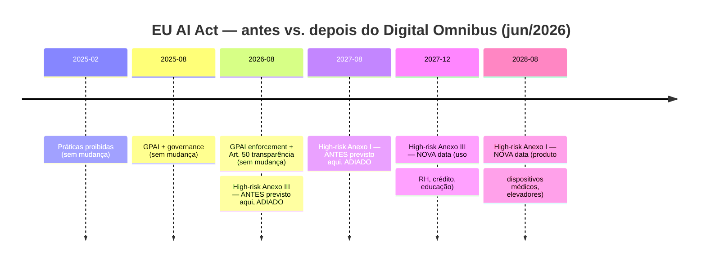
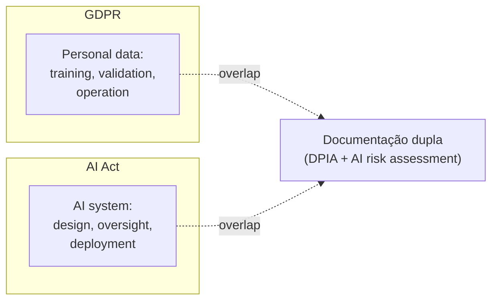

# Governance as architecture — EU AI Act, GDPR, licenças

> [!abstract] TL;DR
> **Deadline e impacto imediato:** em 2 de agosto de 2026, a Comissão Europeia ganha poder de multa sobre providers de GPAI e as obrigações de transparência do Art. 50 entram em vigor para a maioria dos sistemas de IA — mas o "Digital Omnibus" (acordo de maio/junho de 2026) **adiou** a aplicabilidade plena dos sistemas high-risk baseados em uso (Anexo III) para **2 de dezembro de 2027**, e dos high-risk baseados em produto (Anexo I) para **2 de agosto de 2028**.
> **Obrigações práticas para code generation:** documentar qual modelo GPAI foi usado, qual spec governou a geração, qual revisão humana ocorreu, quais modificações foram feitas — **logs por mínimo 6 meses (Art. 19)**. GDPR continua valendo em paralelo: dados pessoais usados em treino, validação ou operação caem sob os dois regimes ao mesmo tempo.
> **Consequência de não fazer:** multa de até **€35M ou 7% do faturamento global anual** — o teto mais alto entre os dois valores, aplicável mesmo a empresas fora da UE que atendem clientes europeus. Para sair com isso de pé, tratar **governance as architecture**: gates de compliance no pipeline, não em PDF.

> [!question]- Por que EU AI Act muda a arquitetura do sistema, não só a documentação?
> Compliance tratado como documentação retroativa — "vamos documentar o que fizemos" — falha quando o sistema não foi projetado para gerar os registros que o compliance exige. EU AI Act Art. 19 exige logs automáticos de decisões, retenção mínima de 6 meses, rastreabilidade de qual modelo foi usado em qual saída. Isso não pode ser adicionado depois sem refatoração significativa. Sistemas que não têm audit trail imutável, que não registram qual versão do modelo gerou qual código, que não rastreiam revisão humana por PR — esses sistemas precisam ser redesenhados, não documentados. Daí "governance as architecture": os controles de compliance são gates no pipeline de CI/CD, não PDFs no Google Drive.

## O que muda em agosto de 2026

> [!warning] EU AI Act — datas-chave (atualizado após o Digital Omnibus, jun/2026)
> - **2 fev 2025:** práticas proibidas começam a aplicar
> - **2 ago 2025:** governance + obrigações de GPAI models
> - **2 ago 2026:** Comissão ganha poder de multa sobre GPAI providers; transparência do Art. 50 entra em vigor; autoridades nacionais podem investigar e sancionar
> - **2 dez 2027:** high-risk **baseado em uso** (Anexo III — RH, crédito, educação etc.) fica totalmente aplicável (adiado de ago/2026)
> - **2 ago 2028:** high-risk **baseado em produto** (Anexo I — dispositivos médicos, elevadores, equipamento de rádio) fica totalmente aplicável (adiado de ago/2027)

A partir de agosto de 2026, **descumprir não é "boas práticas"** — é multa de até **€35M ou 7% do faturamento global**. O valor de multa não mudou com o Omnibus; o que mudou foi **quando** as obrigações high-risk passam a valer.



> [!warning] Caducidade regulatória desta nota
> Esta nota foi escrita antes do "Digital Omnibus on AI" (acordo político de 7 mai 2026, aprovação final do Conselho/Parlamento em jun/2026) reagendar as obrigações high-risk. A versão atual já reflete o adiamento (Anexo III → dez/2027, Anexo I → ago/2028), mas **a partir de 2 de agosto de 2026** a lei entra em modo de enforcement real para GPAI e transparência — vale revisar esta nota nessa data para incorporar: primeiras multas ou investigações abertas pela Comissão, comunicados oficiais de enforcement, e o texto final publicado do Omnibus (a formalização plena era esperada para jul/2026). Fonte: [Digital AI Omnibus — DLA Piper](https://knowledge.dlapiper.com/dlapiperknowledge/globalemploymentlatestdevelopments/2026/The-Digital-AI-Omnibus-Proposed-deferral-of-high-risk-AI-obligations-under-the-AI-Act), [AI Act Timeline — artificialintelligenceact.eu](https://artificialintelligenceact.eu/implementation-timeline/).

## Quem é afetado

| Papel | Obrigações |
|---|---|
| **Provider GPAI** (treina/oferece modelo) | Documentação técnica, copyright transparency, training data disclosure |
| **Deployer** (usa AI em produção) | Risk assessment, human oversight, monitoring, transparency to users |
| **Empresa fora da UE** que vende para clientes UE | Mesmas obrigações que provider/deployer UE — extraterritorialidade |

> [!info] US/BR companies não escapam
> Empresa brasileira vendendo SaaS com IA para cliente alemão **está sujeita ao Act**. Tem que documentar e compliance da mesma forma.

## Para code generation especificamente

Empresa usando [[Dicionário de IA#LLM (Large Language Model)|LLM]] para gerar código tem que documentar:

| O quê | Como armazenar |
|---|---|
| **GPAI model usado** (Claude X, GPT Y) | Per-PR ou per-deploy log |
| **Spec ou prompt que governou geração** | Versionado em git ([[Spec-Driven Development\|02 - O que é Spec-Driven Development]]) |
| **Revisão humana ocorrida** | Code review record (PR, approver, comments) |
| **Modificações feitas** | Diff entre output do LLM e código mergido |
| **Data/hora** | Audit log |

Tudo retido por **mínimo 6 meses** (Art. 19). Bens regulados (financeiro, médico): **anos**.

> [!question]- Por que "documentar o modelo usado" não é só anotar o nome numa planilha?
> Porque a rastreabilidade exigida é **por output**, não por projeto. Se um time troca de Claude Sonnet 4 para Sonnet 5 no meio do trimestre, cada PR gerado antes e depois da troca precisa apontar pra versão exata do modelo que gerou aquele código — não "usamos modelos da Anthropic em 2026". Isso importa na prática porque, se um bug ou vulnerabilidade for atribuído a um comportamento específico de uma versão de modelo (ex: um modelo mais antigo alucinando uma dependência - ver [[05 - SAST e SCA para código AI]]), o auditor pergunta "quais PRs vieram desse modelo?" — e se a resposta exige investigação arqueológica no histórico do Slack, o gate falhou. A granularidade certa é **modelo + versão + data**, capturada automaticamente no momento do commit, não reconstruída depois.

Na prática, isso se traduz em metadados mínimos por PR gerado por IA:

| Campo | Exemplo de valor | Onde captar |
|---|---|---|
| `model_id` | `claude-sonnet-5-20260701` | Header de resposta da API, se disponível; senão, config do agente |
| `spec_ref` | `specs/checkout-refactor/spec.md@a1b2c3d` | Commit hash do spec no momento da geração |
| `human_reviewer` | `@josenaldo` | GitHub PR approver |
| `review_scope` | `full` \| `diff-only` \| `spot-check` | Nível de revisão humana real (nem toda "revisão" é igual) |
| `modification_delta` | link pro diff | Diff entre output bruto do LLM e o que foi mergido |
| `timestamp` | ISO 8601 | Momento do merge, não da geração |

> [!tip] `review_scope` é o campo que mais times esquecem
> Um PR "revisado" onde o humano só clicou "approve" sem ler linha a linha não oferece a mesma garantia que um `full` review. Auditores da AI Act perguntam sobre a **qualidade** do human oversight (Art. 14), não só sua existência formal — registrar o nível de revisão evita que "tivemos revisão humana" vire uma afirmação vazia.

Para times que usam ferramentas de agentic coding (Claude Code, Cursor, Copilot Workspace), o gate de compliance precisa capturar isso **no momento do PR**, via CI, e não depender de disciplina manual — o mesmo princípio de "governance as architecture" descrito mais abaixo.

## A interseção AI Act + GDPR



GDPR governa **dados** que entram/saem do AI. AI Act governa **o sistema** AI em si. Em produto real, **ambos aplicam**.

| Cenário | GDPR | AI Act |
|---|---|---|
| Modelo treinado com PII | ✅ Sim (DPIA) | ✅ Sim (data governance) |
| Endpoint que chama LLM com user input | ✅ Sim (processing) | ✅ Sim (deployer obligations) |
| LLM gera código que processa PII | ✅ Indireto | ✅ Sim |
| Logs de prompts contendo PII | ✅ Sim (retention rules) | ✅ Sim (Art. 19) |

## High-risk AI systems

AI Act define categorias de risco. **High-risk** tem requisitos pesados:

- Risk management system documentado
- Data governance (qualidade de dados de treino)
- Documentação técnica detalhada
- Logging automático com retenção
- Human oversight obrigatório
- Accuracy + robustness + cybersecurity comprovados

Categorias high-risk relevantes para devs:
- AI em educação (admission, scoring)
- AI em recrutamento
- AI em crédito / scoring
- AI em justiça / law enforcement
- AI em infraestrutura crítica

> [!info] Duas famílias de high-risk, dois relógios diferentes
> A lei distingue **Anexo III** (high-risk *baseado em uso* — recrutamento, crédito, educação, justiça: a lista acima) do **Anexo I** (high-risk *baseado em produto regulado* — dispositivos médicos, elevadores, equipamento de rádio, onde a IA é um componente de segurança de um produto já regulado por outra diretiva). Com o Digital Omnibus, os dois relógios ficaram diferentes: Anexo III passa a valer em **2 dez 2027**, Anexo I em **2 ago 2028**. Antes do Omnibus, ambos apontavam pra agosto de 2026/2027. Um sistema de scoring de crédito e um software embarcado num equipamento médico agora têm prazos de compliance distintos, mesmo os dois sendo "high-risk".

> [!tip] Code generation **típica** não é high-risk
> Usar Claude/Cursor para gerar código de feature comum **não cai em high-risk** por si só. Mas **o produto que você está construindo** pode cair, e aí o code generation fica sob escrutínio também.

> [!question]- O adiamento do Anexo III significa que dá pra "deixar pra depois" a compliance de sistemas high-risk?
> Não recomendado, por três razões práticas. Primeiro, o adiamento é do **enforcement pleno**, não da existência da obrigação — o texto legal continua lá, e a Comissão pode revisar o calendário de novo. Segundo, sistemas complexos (scoring de crédito, triagem de currículos) levam meses para instrumentar logging, DPIA e risk assessment retroativamente; começar em nov/2027 pra valer em dez/2027 não dá tempo. Terceiro, e mais concreto: as obrigações de **GPAI e transparência (Art. 50)** — que afetam qualquer time usando LLM de terceiros, inclusive pra code generation — **não foram adiadas** e valem normalmente a partir de 2 ago 2026. O adiamento é específico do bloco high-risk, não da lei inteira.

## Open source — exceção parcial

Modelos liberados sob **licença open source** estão **isentos** de obrigações de provider — **exceto** se forem GPAI com risco sistêmico.

```
Llama 3 (Meta, open source)        → exceção (não-sistêmico)
DeepSeek-R1 (open source)          → caso a caso (sistêmico se large?)
GPT-5 (proprietary, OpenAI)        → obrigações completas
```

**Mas** se você **deploya** open-source model em high-risk use, herda obrigações de **deployer**. Open source não te isenta de avaliar o uso.

## Licenças de código gerado

Discussão paralela: **quem é dono do código gerado por IA?**

| Posição | Argumento |
|---|---|
| **Sem copyright** (US Copyright Office, 2023+) | Não há autor humano direto |
| **Copyright do prompt-author** | Se humano deu input substancial |
| **Copyright do model provider** | Termos de serviço |
| **Domínio público de facto** | Se ninguém pode reivindicar |

**Implicações práticas:**
- Não confunda licença de código com licença de modelo
- Verifique TOS de Cursor/Copilot/Claude para code IP rights
- Em compliance regulado, **nunca** assuma — pergunte ao legal

## Licenças de dependências

LLM pode introduzir libs com licenças incompatíveis:

| Licença | Compatível com proprietary? |
|---|---|
| **MIT, BSD, Apache 2** | ✅ Sim |
| **LGPL** | ⚠️ Sim com cuidados (linking dynamic) |
| **GPL, AGPL** | ❌ Contamina (copyleft viral) |
| **SSPL** | ❌ Restrição de SaaS |
| **CC-NC** | ❌ Não-comercial — não pode em produto |

> [!warning] AGPL via slopsquat = pesadelo
> Atacante registra pacote em npm com licença AGPL. Agente instala. Produto proprietário "infectado" — toda codebase pode virar copyleft.
>
> Defesa: SCA com **license check** ([[05 - SAST e SCA para código AI]]).

## Governance as architecture — operacionalização

Em vez de "compliance é responsabilidade do legal", embute na arquitetura:

```yaml
# .github/workflows/compliance.yml

jobs:
  ai-attribution:
    steps:
      - name: Detect AI-generated PR
        run: ./scripts/detect-ai-pr.sh
        # Procura por padrões: PR aberto por bot, mensagens com 'generated by'

      - name: Attach AI metadata
        if: ${{ env.IS_AI_PR == 'true' }}
        run: |
          echo "AI Model: ${{ env.AI_MODEL }}" >> ai-audit.log
          echo "Spec: $(cat specs/${{ env.FEATURE }}/spec.md)" >> ai-audit.log
          echo "Reviewer: ${{ github.event.pull_request.assignees[0].login }}" >> ai-audit.log

  license-check:
    steps:
      - run: |
          # SCA tool com license whitelist
          snyk test --license-policy=licenses-allowed.json

  data-governance:
    steps:
      - run: |
          # PII detection em logs de prompt
          ./scripts/scan-prompts-for-pii.sh

  retention-enforcement:
    steps:
      - run: |
          # Garantir que audit logs estão sendo exportados
          ./scripts/verify-audit-pipeline.sh
```

Cada gate de compliance é **código**. Falha de gate é falha de PR.

## DPIA e AI risk assessment integrados

| Documento | Quando | Conteúdo |
|---|---|---|
| **DPIA** (Data Protection Impact Assessment) | Antes de deploy de processing de PII | GDPR Art. 35 |
| **AI Risk Assessment** | Antes de deploy de AI system | AI Act Art. 9 |
| **Combined** (recomendado) | Sistemas que tocam ambos | Cobre os dois |

Padrão: produzir **um documento** que satisfaça os dois — economiza retrabalho.

## Logging e retenção

Mínimo legal AI Act: 6 meses. Recomendado:

| Tipo | Retenção sugerida |
|---|---|
| Audit log (quem, quando, o quê) | 7 anos (compliance financeiro) |
| Prompts dos usuários (sem PII) | 6-12 meses |
| Outputs do modelo (para auditoria) | 12-24 meses |
| Decisões de approval/denial | 7 anos |
| Métricas agregadas | indefinida |

**Não armazene PII em logs.** Use redaction ([[Context Engineering|12 - Guardrails determinísticos]]) antes de log.

## Sinais de compliance maduro

- ✅ Cada PR de IA tem audit metadata anexada
- ✅ Audit log é immutable (write-once, time-stamped)
- ✅ License check bloqueia AGPL/SSPL no SCA
- ✅ DPIA + AI assessment combinados, versionados
- ✅ Retenção de prompts/outputs automatizada
- ✅ Time legal/security tem dashboard, não relatórios manuais

## Sinais de compliance teatral

- ❌ "Documentamos as práticas" mas não há audit automático
- ❌ DPIA em Word, não acionável
- ❌ Sem rastreio de qual modelo foi usado em que código
- ❌ Sem SCA com license policy
- ❌ Logs com PII (não-conformidade GDPR + AI Act)
- ❌ Compliance "é responsabilidade do legal" — devs não envolvidos

## Para times brasileiros

LGPD é o equivalente brasileiro do GDPR. Em estrutura, similar. **Não há ainda** equivalente brasileiro do AI Act, mas:

- Marco Civil + LGPD já cobrem boa parte
- Lei do AI brasileira (PL 2338/2023) em discussão — vai espelhar partes do EU AI Act
- Empresas exportando para UE: cumprir EU AI Act direto

> [!info] Status do PL 2338/2023 (julho de 2026)
> O projeto foi aprovado por unanimidade no Senado em 10 dez 2024 e remetido à Câmara dos Deputados em mar 2025, onde tramita numa Comissão Especial (presidência de Luísa Canziani, relatoria de Aguinaldo Ribeiro). Doze audiências públicas ocorreram entre mai-set 2025. A votação final, originalmente esperada em 2025, foi **empurrada para 2026** em meio a impasses políticos, disputas setoriais e um vício de inconstitucionalidade apontado pelo próprio Executivo — com o calendário eleitoral de 2026 como pressão adicional para acelerar (ou paralisar) a pauta. O texto adota o modelo europeu: classificação por risco (excessivo/alto/baixo), direitos dos afetados (transparência, explicação, contestação), um Sistema Nacional de Regulação e Governança de IA (SIA), e multas de até **R$ 50 milhões** por infração — ordem de grandeza bem menor que o teto do EU AI Act (€35M / 7% do faturamento).

> [!question]- Se o PL 2338 ainda não é lei, por que um time brasileiro deveria se importar agora?
> Três motivos práticos. Primeiro, **extraterritorialidade do EU AI Act**: uma fintech brasileira com um cliente alemão já está sujeita à lei europeia hoje, PL 2338 ou não (ver seção "Quem é afetado" acima). Segundo, o PL 2338 **espelha o desenho do EU AI Act** — classificação por risco, obrigações de transparência, direito à explicação — então a arquitetura de compliance construída para a UE (audit logs, DPIA, gates de CI) já cobre boa parte do que o PL brasileiro vai exigir quando virar lei. Terceiro, LGPD **já está em vigor** e já cobre a fatia de dados pessoais que atravessa qualquer sistema de IA — não dá pra esperar o PL 2338 pra tratar essa parte.

Comparativo rápido entre os três regimes:

| Dimensão | LGPD (Brasil) | GDPR (UE) | EU AI Act |
|---|---|---|---|
| Objeto regulado | Dados pessoais | Dados pessoais | Sistemas de IA |
| Em vigor desde | 2020 | 2018 | 2024 (aplicação escalonada até 2028) |
| Multa máxima | R$ 50 milhões por infração | €20M ou 4% do faturamento global | €35M ou 7% do faturamento global |
| Extraterritorial? | Sim (dados de titular no Brasil) | Sim (dados de titular na UE) | Sim (produto/serviço oferecido na UE) |
| Autoridade | ANPD | DPAs nacionais + EDPB | Comissão + autoridades nacionais de mercado |
| Equivalente brasileiro de IA | — | — | PL 2338/2023 (em tramitação, não é lei ainda) |

> [!warning] Não confundir "estamos LGPD-compliant" com "estamos EU AI Act-compliant"
> São regimes de objetos diferentes: LGPD/GDPR regulam **dados pessoais**; EU AI Act regula **o sistema de IA** (mesmo quando não processa PII nenhum). Um sistema de scoring de crédito treinado só com dados sintéticos, sem PII, ainda pode ser high-risk sob o AI Act — LGPD não teria nada a dizer sobre ele. Compliance com um regime não substitui o outro; eles se sobrepõem parcialmente (ver seção "A interseção AI Act + GDPR"), mas não são o mesmo checklist.

## Anti-patterns

- **"Vamos fazer compliance no Q4"** — Q4 nunca chega
- **PDF de policy sem enforcement** — vira papel
- **Audit log gerado mas nunca lido** — sem alerta, sem auditoria real
- **Confundir AI Act com GDPR** — são complementares, ambos aplicam
- **Open source = isento de tudo** — só de obrigações específicas, não de deployer
- **License check superficial** — pacote dependency-of-dependency pode introduzir AGPL

## Armadilhas comuns

> [!warning] "Somos empresa brasileira/americana, EU AI Act não se aplica"
> A lei tem efeito extraterritorial: qualquer empresa que oferece produtos ou serviços com IA para usuários na União Europeia está sujeita ao EU AI Act — independentemente de onde a empresa está sediada. Empresa brasileira com clientes na Alemanha, francesa, ou italiana precisa cumprir as mesmas obrigações de deployer. "Não temos sede na UE" não é isenção.

> [!warning] Compliance via PDF não resiste a auditoria
> Um relatório anual de compliance em PDF que descreve as práticas de 2026 não satisfaz Art. 19 — que exige logs automáticos e imutáveis, por evento, com timestamp verificável. Se um auditor pede o audit trail de quais decisões o modelo tomou em um sistema de crédito em março, a resposta não pode ser "está documentado no nosso processo de revisão". Compliance AI Act exige registros técnicos automáticos, não narrativa retroativa.

> [!warning] License check superficial não pega dependency-of-dependency
> Uma biblioteca com licença MIT pode depender de outra com licença AGPL em suas dependências transitivas. SCA que verifica só as dependências diretas declara o projeto "limpo" enquanto AGPL está dois níveis abaixo. O ataque via slopsquat torna isso especialmente perigoso: pacote malicioso com licença copyleft introduzido por alucinação pode "contaminar" a codebase proprietária. SCA precisa varrer a árvore completa de dependências, não só o primeiro nível.

## Como explicar em inglês

The EU AI Act's practical implication for software teams is not primarily a legal compliance exercise — it is an architectural one. The law requires automatic logging of AI system decisions, minimum six-month retention, traceability of which model version was used for which output, and documented human oversight per deployment. None of these can be bolted on after the system is built without significant refactoring.

"Governance as architecture" means encoding compliance requirements as technical gates in the development pipeline: a CI job that attaches AI attribution metadata to every AI-generated PR, a license check that blocks AGPL and SSPL dependencies in SCA, PII detection that scans prompt logs before they're stored, and retention enforcement that verifies audit data is flowing to long-term storage. When compliance is code, it fails like code — and failing is auditable, fixable, and improvable. When compliance is documentation, it passes by assertion until an actual audit reveals the gap.

**In a technical interview**, you might say:

> "We treat regulatory compliance as an architectural concern, not a legal afterthought. EU AI Act Art. 19 requires six-month minimum retention of audit logs for AI system decisions — that's a pipeline requirement, not a documentation requirement. In practice, we have a CI job that attaches AI attribution metadata to every PR: which model was used, which spec governed generation, who reviewed it. License check in SCA blocks copyleft licenses at the dependency tree level. PII redaction runs before any prompt log is persisted. These are all code — they fail CI if not satisfied, which means they're enforced by the same mechanisms as our security controls."

| PT | EN |
|----|-----|
| governança como arquitetura | governance as architecture |
| avaliação de impacto | impact assessment |
| trilha de auditoria | audit trail |
| modelo de risco alto | high-risk AI system |
| retenção de logs | log retention |
| compliance como código | compliance as code |
| extraterritorialidade | extraterritorial applicability |
| licença de copyleft | copyleft license |
| verificação de licenças | license check |
| obrigação de deployer | deployer obligation |

## O que vem a seguir

Governance estabelece o framework regulatório. A nota final deste galho sintetiza tudo em um roadmap concreto: por onde começar, como sequenciar os controles, e como maturar a postura de segurança progressivamente ao longo do tempo, sem tentar implementar tudo de uma vez.

- [[12 - O roadmap de segurança para times]] — sequência prática de implementação dos controles deste galho

## Veja também

- [[Context Engineering|12 - Guardrails determinísticos]]
- [[05 - SAST e SCA para código AI]]
- [[12 - O roadmap de segurança para times]]
- [[10 - Métricas de qualidade AI — defect escape rate, rework ratio]]

## Referências

- **EU Commission** — [*AI Act | Shaping Europe's digital future*](https://digital-strategy.ec.europa.eu/en/policies/regulatory-framework-ai) (digital-strategy.ec.europa.eu).
- **artificialintelligenceact.eu** — [*Implementation Timeline*](https://artificialintelligenceact.eu/implementation-timeline/) (2026).
- **EU AI Act Service Desk** — [*Timeline for the Implementation of the EU AI Act*](https://ai-act-service-desk.ec.europa.eu/en/ai-act/timeline/timeline-implementation-eu-ai-act) (2026).
- **DLA Piper GENIE** — [*The Digital AI Omnibus: Proposed deferral of high risk AI obligations under the AI Act*](https://knowledge.dlapiper.com/dlapiperknowledge/globalemploymentlatestdevelopments/2026/The-Digital-AI-Omnibus-Proposed-deferral-of-high-risk-AI-obligations-under-the-AI-Act) (2026). Fonte da confirmação do adiamento Anexo III → dez/2027 e Anexo I → ago/2028.
- **Travers Smith** — [*EU agrees to delay key AI Act compliance deadlines*](https://www.traverssmith.com/knowledge/knowledge-container/eu-agrees-to-delay-key-ai-act-compliance-deadlines/) (2026).
- **Gibson Dunn** — [*EU AI Act Omnibus Agreement — Postponed High-Risk Deadlines and Other Key Changes*](https://www.gibsondunn.com/eu-ai-act-omnibus-agreement-postponed-high-risk-deadlines-and-other-key-changes/) (2026).
- **Secure Privacy** — *EU AI Act 2026: Key Compliance Requirements* (2026).
- **Augment Code** — *The 2026 EU AI Act and AI-Generated Code* (2026).
- **Legalnodes** — *EU AI Act 2026 Updates: Compliance Requirements and Business Risks* (2026).
- **GDPR Register** — *EU AI Act Compliance 2026* (2026).
- **Tredence** — *EU AI Act 2026 Compliance Guide for US Companies* (2026).
- **iaLocus** — [*PL 2338/2023: Marco Legal da IA no Brasil — O Que Muda em 2026*](https://ialocus.com.br/blog/post-pl-2338-marco-legal-ia-brasil-2026.html) (2026).
- **CBRdoc Blog** — [*Marco Legal da IA terá votação final em 2026*](https://blog.cbrdoc.com.br/marco-legal-da-ia-tera-votacao-final-em-2026/) (2026).
- **Câmara dos Deputados** — [*Ficha de tramitação — PL 2338/2023*](https://www.camara.leg.br/proposicoesWeb/fichadetramitacao?idProposicao=2487262) (2026).
