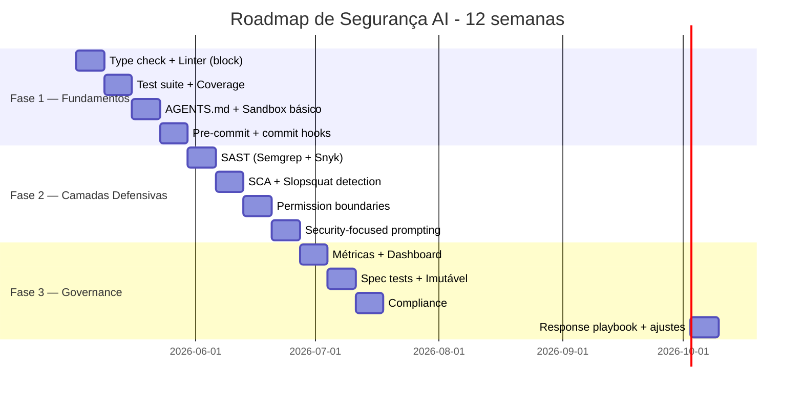

# O roadmap de segurança para times

> [!abstract] TL;DR
> Esta nota fecha a Trilha 6 com **plano de adoção progressiva** — semana a semana, do zero a um pipeline de segurança maduro para AI code. Não tente tudo de uma vez. Padrão recomendado: **3 fases**, cada uma de 4-6 semanas. Fase 1 instala **fundamentos** (type check, lint, test obrigatórios em CI); fase 2 adiciona **camadas defensivas** (SAST, SCA, sandbox, prompting policies); fase 3 traz **governance** (métricas, compliance, response playbooks). Ao final: time vai gerar com IA **mais rápido E mais seguro** que a baseline pré-IA.

> [!question]- Por que o roadmap de segurança começa com observabilidade, não com controles?
> Começar com controles avançados (SAST, sandbox, compliance) sem baseline de observabilidade é instalar alarme sem saber o que deveria soar. As semanas 1-4 estabelecem fundamentos que também criam observabilidade: type check em CI revela quantas alucinações chegam por semana, test coverage revela onde o código não tem verificação, lint failures revelam padrões problemáticos recorrentes. Sem essa linha de base, você não sabe se o SAST da semana 5 está bloqueando algo relevante, ou se sua intervenção de prompting da semana 8 teve algum efeito. Observabilidade primeiro significa que cada controle subsequente tem dados para provar seu valor.

## A premissa

> *"Sem AI security é incidente em prod; com AI security mal implementada é fricção que mata produtividade. Adopt progressively."*

Mover muito devagar = produção em fogo. Mover muito rápido = time abandona o método. Roadmap intermediário é o caminho.

## O panorama de 12 semanas



Cada barra = ~1 semana de implementação + monitoring.

## Fase 1 — Fundamentos (semanas 1-4)

### Semana 1 — Type check + Linter bloqueando

**Por quê primeiro:** pega 60% das [[03 - Alucinações em código — APIs fantasma e parâmetros inexistentes|alucinações]] sem custo extra.

```yaml
# .github/workflows/checks.yml
on: [push, pull_request]
jobs:
  static:
    steps:
      - name: Type check (BLOCK)
        run: mypy src/ --strict   # ou tsc --noEmit
      - name: Lint (BLOCK)
        run: ruff check src/      # ou eslint
```

> [!tip] **Block, não warn.** Sem block, time aprende a ignorar.

### Semana 2 — Test suite + coverage

```yaml
- name: Test
  run: pytest --cov=src --cov-fail-under=80
```

Coverage 80% é meta inicial. Subir gradualmente.

### Semana 3 — AGENTS.md + sandbox básico

Criar/atualizar `AGENTS.md` com:

- Convenções de código
- **Security policies** ([[07 - Security-focused prompting]])
- Test policy (ver [[09 - Testes imutáveis — a barreira que o agente não pode reescrever]])

Sandbox padrão de Claude Code/Cursor habilitado:

- Filesystem allowlist
- Network allowlist
- Bash command allowlist
- `~/.ssh/`, `.env*` denied

### Semana 4 — Pre-commit hooks

Hooks locais que rodam **antes** de commit:

```yaml
# .pre-commit-config.yaml
repos:
  - repo: https://github.com/astral-sh/ruff-pre-commit
    hooks: [{id: ruff}]
  - repo: https://github.com/pre-commit/mirrors-mypy
    hooks: [{id: mypy}]
  - repo: https://github.com/Yelp/detect-secrets
    hooks: [{id: detect-secrets}]
```

Time recebe feedback **imediato**, não no CI 10 min depois.

### Saída da Fase 1

- ✅ Type check + lint bloqueando todos os PRs
- ✅ Test coverage ≥80%
- ✅ AGENTS.md com policies básicas
- ✅ Sandbox configurado
- ✅ Pre-commit ativo
- ✅ Defect escape rate caindo

## Fase 2 — Camadas defensivas (semanas 5-8)

### Semana 5 — SAST

Adicionar **2 tools** (regra dos 78%):

```yaml
- name: Semgrep
  uses: returntocorp/semgrep-action@v1
  with:
    config: p/owasp-top-ten p/secrets

- name: Snyk Code
  uses: snyk/actions/setup@master
  run: snyk code test --severity-threshold=medium
```

Calibrar: começar como warning, virar block após 1 semana de calibração.

### Semana 6 — SCA + slopsquat

```yaml
- name: Snyk Open Source
  run: snyk test --severity-threshold=high

- name: Socket Security
  uses: socketsecurity/action@v1
```

Lockfile verification:

```yaml
- run: |
    if ! npm ci; then
      echo "::error::package-lock.json out of sync"
      exit 1
    fi
```

### Semana 7 — Permission boundaries refinadas

[[06 - Permissões e sandboxing|Sandbox]] avançado:

- Allowlist de comandos bash mais estrita
- Network proxy filtrante
- Git: deny de `--force`, `reset --hard`
- DB: confirmar zero acesso a prod
- Audit log de todas as ações do [[Dicionário de IA#Agent|agente]]

Considerar: rodar agente em container Docker para isolation extra.

### Semana 8 — Security-focused prompting

Migrar instruções genéricas para [[07 - Security-focused prompting|patterns que funcionam]]:

- Threat models por tipo de feature
- Listas negativas explícitas em AGENTS.md
- Schema enforcement com `extra="forbid"`
- Templates por categoria de feature

### Saída da Fase 2

- ✅ SAST + SCA bloqueando PRs
- ✅ Slopsquat detection ativa
- ✅ Sandbox refinado
- ✅ Prompting policies em AGENTS.md
- ✅ Vulnerability introduction rate (VIR) próxima de zero em CWE críticas

## Fase 3 — Governance (semanas 9-12)

### Semana 9 — Métricas + dashboard

Implementar [[10 - Métricas de qualidade AI — defect escape rate, rework ratio|métricas]]:

- Defect escape rate
- Rework ratio
- Mean time to defect
- Vulnerability introduction rate
- AI-attributable defects

Dashboard simples (Grafana/Datadog/Notion table) com revisão semanal.

### Semana 10 — Spec tests + imutabilidade

[[09 - Testes imutáveis — a barreira que o agente não pode reescrever|Spec tests]]:

- Estrutura `tests/spec/`, `tests/security/`, `tests/contract/`
- Path-based deny no sandbox
- CODEOWNERS para essas pastas
- AGENTS.md atualizado com regra explícita

### Semana 11 — Compliance: AI Act + GDPR

Se aplicável (clientes UE, dados de EU citizens, high-risk use):

- Audit log automático de PRs com IA
- Metadata: modelo, spec, reviewer, modificações
- Retenção configurada (mínimo 6 meses)
- DPIA + AI risk assessment combinados (versionados)
- License check no SCA

Ver [[11 - Governance as architecture — EU AI Act, GDPR, licenças]].

### Semana 12 — Response playbook + ajustes

Documento "**O que fazer quando**":

- Slopsquat detectado → isolar, audit, reset creds
- Vuln em prod → rollback, postmortem, fix forward
- AIAD subindo → análise causa raiz, ajuste de gates
- Drift → reforçar SDD, calibrar gates

Revisão final: o que funcionou, o que não, ajustes para próximo trimestre.

### Saída da Fase 3

- ✅ Dashboard com métricas atualizado semanalmente
- ✅ Spec tests imutáveis em produção
- ✅ Compliance pipeline ativa
- ✅ Response playbook documentado
- ✅ Time tem **mais** velocity líquida com **menos** débito que pré-IA

## Sinais de adoção bem-sucedida

| Sinal | Meta |
|---|---|
| **Defect escape rate** | -50% vs início |
| **Vulnerability introduction (críticas)** | 0 nas últimas 8 semanas |
| **Rework ratio** | <20% |
| **MTTD** | >7 dias (vs 1-2 dias inicial) |
| **PRs bloqueados em CI** | 30-50% (saudável) |
| **PRs com human review fadigado** | -70% |
| **Velocity líquida** | +10-30% vs baseline |

## Sinais de adoção falhando

> [!warning] Reagir
> - DER subindo apesar de gates → camadas com gap
> - Time desativando rules → falsos positivos demais; calibrar
> - Pre-commit pulado em PRs urgentes → política de exception
> - Dashboard nunca olhado → revisão semanal não acontece
> - Devs frustrados → adoção forçada vs. cultural

## Adaptações por tamanho de time

| Tamanho | Fase 1 | Fase 2 | Fase 3 |
|---|---|---|---|
| **Solo dev** | 1-2 semanas | Skip ou simplificado | Skip ou simplificado |
| **Time pequeno (2-5)** | 4 semanas | 4 semanas | 4 semanas |
| **Time médio (5-15)** | 4 semanas | 4 semanas | 4 semanas + dedicated security person |
| **Time grande (>15)** | 6 semanas | 6 semanas + multiple SAST | 6 semanas + dedicated security team |
| **Enterprise / regulated** | 8 semanas | 8 semanas | Compliance é primário, não Fase 3 |

## Manutenção pós-adoção

- **Mensal:** revisar métricas, ajustar gates calibrados
- **Trimestral:** revisar SAST rules, atualizar dependências de tools
- **Semestral:** atualizar threat models, AI tools (Claude/Cursor versões novas)
- **Anual:** auditoria de compliance, atualização de DPIA/AI assessment

## Anti-patterns na adoção

- **Tudo de uma vez** — time abandona, vira teatro
- **Pular Fase 1, ir direto para SAST avançado** — fundação fraca
- **Compliance só no final, sem fundação técnica** — vira documentação sem enforcement
- **Sem buy-in do time** — gates ignorados ou desativados
- **Sem revisão de métricas** — não sabe se funcionou
- **"Configurar e esquecer"** — tools envelhecem, ataques evoluem

## A pergunta de fechamento

Após 12 semanas:

> *"Estamos gerando código com IA mais rápido E com qualidade igual ou melhor que pré-IA?"*

Se sim → adoção bem-sucedida.
Se não → ajuste calibração, talvez voltar uma fase.

Sem essa pergunta sendo respondida com **dados**, adoção é fé.

## Armadilhas comuns

> [!warning] Implementar tudo de uma vez garante abandono
> O roadmap em 3 fases não é burocracia — é psicologia de adoção. Times que tentam ativar SAST, SCA, sandbox, spec tests, compliance e métricas simultaneamente em duas semanas invariavelmente enfrentam resistência: muitas mudanças de processo ao mesmo tempo, muitos falsos positivos não calibrados, muito atrito antes de qualquer benefício percebido. O resultado é "o time desativou tudo e voltou ao anterior". Adoção progressiva significa que cada fase é estabilizada antes de adicionar a próxima.

> [!warning] Pular Fase 1 para "ir logo para o relevante" destrói o roadmap
> A tentação é pular para SAST e compliance porque "parece mais sério". Mas SAST sem type check configurado e sem test suite obrigatório é ruído sobre ruído — o time não tem baseline para distinguir vulnerabilidade nova de problema existente, e os findings de SAST não têm contexto de "isso passa nos testes?". Fase 1 é fundação, não preliminar.

> [!warning] Gates sem buy-in do time tornam-se gates burlados
> CI que bloqueia PRs sem explicar por que, sem treinamento sobre o que o gate está protegendo, sem espaço para discussão de falsos positivos — esse CI gera ressentimento. Devs aprendem a forçar merge, desativar rules localmente, ou criar PRs que contornam os gates. Buy-in técnico (explicar o problema que o gate resolve) e buy-in cultural (o time decide as regras juntos) são pré-requisitos para que os gates funcionem.

## Como explicar em inglês

A security roadmap for AI-assisted development needs to be progressive because two failure modes exist: moving too slowly leaves the production environment vulnerable to the 45% defect rate that Veracode documented, and moving too fast creates compliance theater — a set of gates that look rigorous but that the team has learned to route around because they're miscalibrated and disruptive.

The three-phase structure addresses this. Phase one establishes observability: type checking and linting in CI reveal what categories of hallucinations are occurring; test coverage gives a baseline for measuring improvement; pre-commit hooks give developers immediate feedback before they reach CI. Only with this instrumentation in place does phase two make sense — you can now see whether SAST is catching real vulnerabilities or generating noise, and calibrate accordingly. Phase three adds governance on top of a functional security foundation, which means the metrics are meaningful and the compliance automation is enforcing something real.

The closing question for the entire roadmap is empirical: after twelve weeks, are we generating code faster and at equal or better quality than before AI adoption? If the data says yes, adoption succeeded. If not, the roadmap tells you exactly which phase needs attention.

**In a technical interview**, you might say:

> "When I introduce AI security tooling to a team, I follow a three-phase roadmap that prioritizes observability before controls. Phase one — type check, linting, test coverage, basic sandbox — establishes what the baseline looks like and gives us data to prove subsequent phases are working. Phase two adds SAST with two complementary scanners, SCA for supply chain, and refined permission boundaries. Phase three is governance: quality metrics dashboard, immutable spec tests, and compliance pipeline for AI Act if relevant. The key principle is progressive adoption: each phase is stabilized before adding the next, and buy-in from the team precedes gate enforcement."

| PT | EN |
|----|-----|
| adoção progressiva | progressive adoption |
| fundamentos de segurança | security foundations |
| camadas defensivas | defensive layers |
| governança como código | governance as code |
| buy-in da equipe | team buy-in |
| calibração de regras | rule calibration |
| falso positivo de SAST | SAST false positive |
| linha de base | baseline |
| roadmap de 12 semanas | 12-week roadmap |
| velocity líquida | net velocity |

## O que vem a seguir

Esta é a nota de fechamento da Trilha 6 — Segurança e Guardrails. O roadmap de 12 semanas sintetiza tudo o que o galho construiu: código AI é untrusted (nota 01), ataques via alucinação existem (notas 02-03), validação precisa de camadas (nota 04), ferramentas automatizam parte dela (notas 05-06), prompting e review mudam o processo (notas 07-08), testes imutáveis protegem o contrato (nota 09), métricas revelam se funciona (nota 10), e governance embute compliance na arquitetura (nota 11).

O próximo passo natural não é mais uma ferramenta ou controle — é execução. Volte à nota 01 e trace o caminho completo: qual das 3 fases do roadmap você já tem? O que está faltando? O roadmap existe para ser personalizado ao contexto do seu time, não seguido cegamente.

- [[01 - Código gerado por IA é untrusted]] — o ponto de partida do galho: por que todo código AI precisa de validação externa

## Veja também

- [[01 - Código gerado por IA é untrusted]]
- [[04 - A pirâmide de validação AI]]
- [[10 - Métricas de qualidade AI — defect escape rate, rework ratio]]
- [[11 - Governance as architecture — EU AI Act, GDPR, licenças]]
- [[Spec-Driven Development|11 - Guia de implementação SDD — do zero ao projeto]]
- [[Context Engineering|14 - Context engineering na prática — setup completo]]

## Referências

- **Veracode** — *2025 GenAI Code Security Report* (2025).
- **DryRun Security** — *Top 10 AI SAST Tools for 2026* (2026).
- **Anthropic** — *Best practices for Claude Code* (2026).
- **NVIDIA** — *Practical Security Guidance for Sandboxing Agentic Workflows* (2026).
- **EU AI Act** — entrada em aplicação total agosto 2026.
