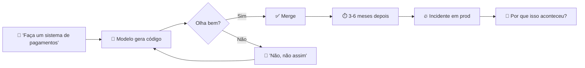
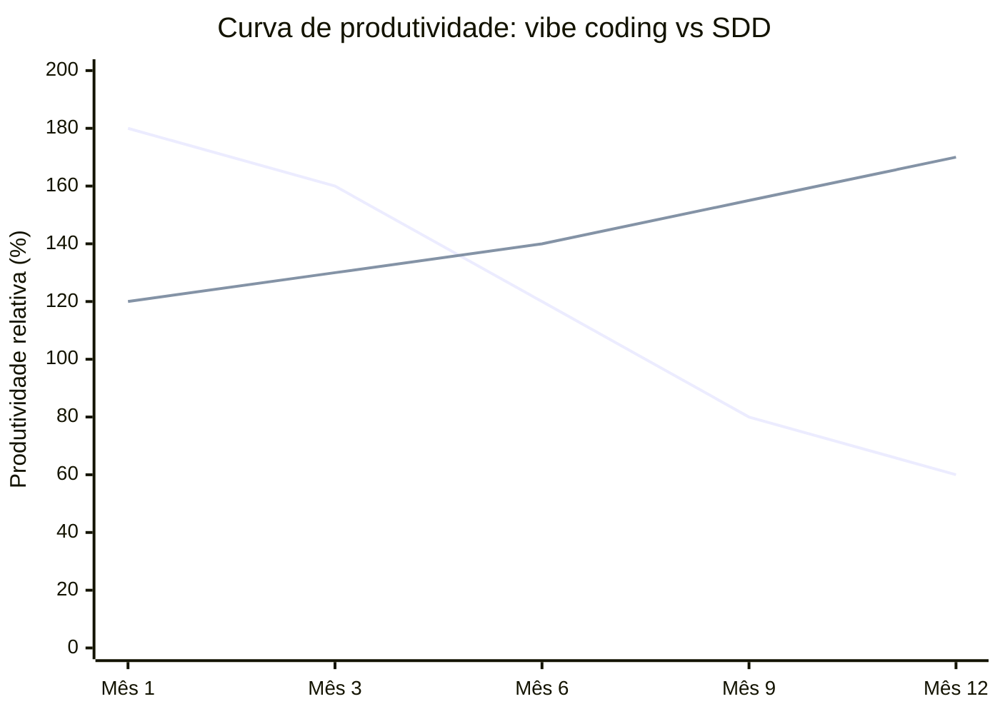
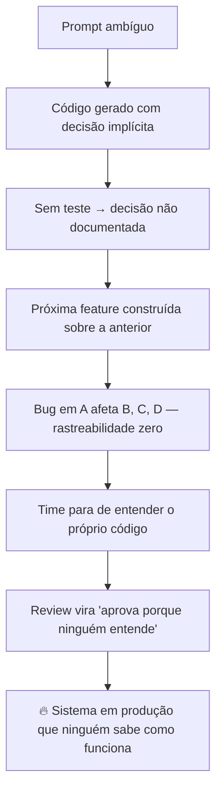
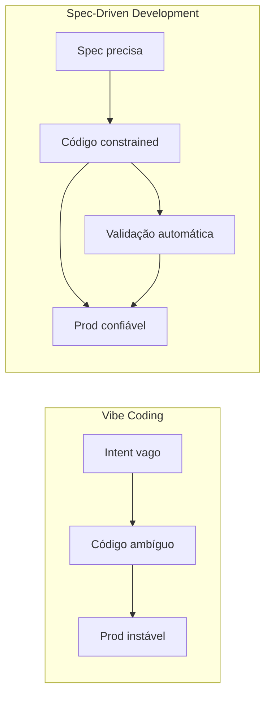
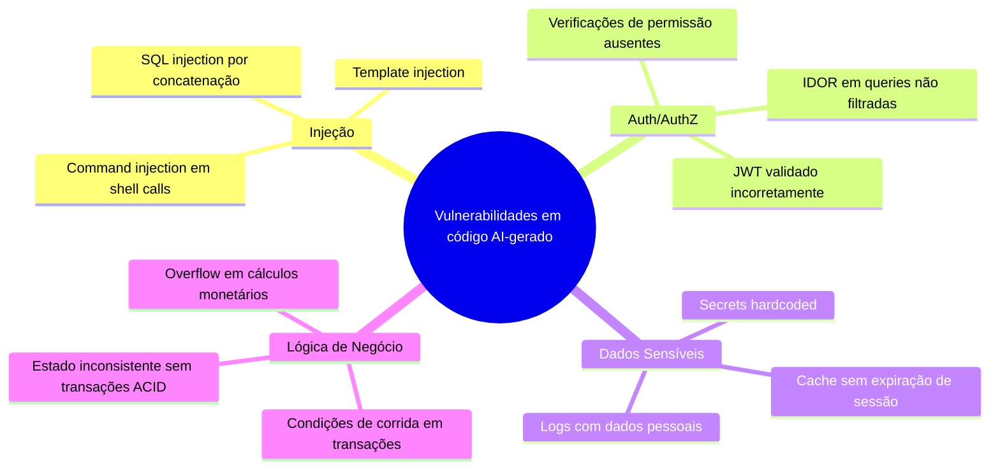

# O problema do vibe coding em produção

> [!abstract] TL;DR
> "Vibe coding" — descrever objetivos vagos para um agente e aceitar o que ele entrega — é fantástico para protótipos e ruinoso em produção. Em 2025-2026, múltiplos relatórios convergiram: **45% do código gerado por IA tem vulnerabilidade de segurança** (Veracode 2025); estudos acadêmicos elevam para >60%; Salesforce Ben e analistas chamam **2026 de "o ano do tech debt"**. O problema não é a ferramenta — é a metodologia. Pedir código com prompts ambíguos garante código ambíguo. SDD existe como resposta direta a esta crise.

## A definição que se popularizou

O termo *[[Dicionário de IA#vibe coding|vibe coding]]* foi cunhado por [[Andrej Karpathy|Karpathy]] em fevereiro de 2025 para descrever um modo casual e intuitivo de codificar com IA: você descreve a intenção em linguagem natural, aceita o que o modelo entrega, e itera por feedback emocional — "parece errado, tenta diferente". Para protótipos de final de semana, é libertador. Para produção, é o caminho mais rápido para tech debt acumulado.

Pense numa analogia: imagine contratar um empreiteiro e dizer "quero uma casa bonita, acolhedora, boa para família". O empreiteiro é talentoso e entrega algo em 3 dias. Parece ótimo na visita rápida. Só quando você muda dentro é que descobre que a fiação elétrica é improvisada, as paredes não têm isolamento térmico e o encanamento não atende código de obras. A casa *parece* funcionar; *não é* habitável de modo seguro. Esse é o vibe coding em produção.



O loop "olha bem? → merge" é o cerne do problema. Sem critério explícito de sucesso, o que vai para produção é o que parece certo na demo, não o que **é** certo. E quando o incidente chega, rastrear a causa é mais difícil porque nenhuma decisão foi registrada.

## O que "vibe" significa tecnicamente

A palavra "vibe" captura um modo de trabalhar orientado por intuição e fluxo emocional. Karpathy descreveu: *"I just see stuff, say stuff, run stuff, and it mostly works."* Traduzindo isso para eng de software:

- **Critério de aceitação implícito**: "parece funcionar" substituiu "atende aos requisitos X, Y, Z"
- **Validação visual**: a demo é o teste; se rodar na apresentação, está bom
- **Especificação emergente**: o que o sistema faz é descoberto iterando, não definido antes
- **Contexto efêmero**: cada sessão começa do zero; o agente não sabe o que foi decidido ontem

Para prototipagem, isso é eficiente. Para sistemas com usuários reais, transações financeiras, dados sensíveis ou SLAs — é uma aposta perigosa.

> [!question] Pergunta de diagnóstico rápido
> Se alguém perguntasse "como esse trecho decide qual usuário pode acessar qual recurso?", você saberia responder sem abrir o código e ler linha por linha? Se não, você está em vibe coding territory.

## Os números que a indústria não esperava

Quando LLMs de código explodiram em 2023-2024, a narrativa predominante era: "produtividade vai a 10x". O que os dados de 2025-2026 mostram é mais complexo:

> [!warning] Veracode 2025 GenAI Code Security Report
> *"Cerca de 45% do código gerado por IA contém falhas de segurança — e essas taxas são consistentemente mais altas do que código humano equivalente revisado."* Estudos acadêmicos independentes mediram >60% em bases de código AI-heavy sem revisão rigorosa.

> [!warning] Salesforce Ben (jan 2026)
> *"2026 será o ano do tech debt — graças ao vibe coding. Times que adotaram AI coding sem metodologia estão pagando a conta agora."*

> [!warning] Gartner AI Engineering Survey (Q1 2026)
> 67% dos times que adotaram agressivamente copilots de código em 2024 relataram aumento de incidentes de segurança em 2025. 41% interromperam ou reverteram partes do uso por impacto em qualidade.

> [!warning] CIO Magazine (2025)
> 65% das falhas enterprise atribuídas a AI coding foram causadas por *context drift* — o agente não tinha acesso ao contexto de decisões anteriores e tomou uma decisão incompatível.

A questão não é se acontece — é quão rápido escala. Um time pequeno com um agente capaz pode produzir em 3 meses uma codebase que um time de manutenção levaria 18 meses para estabilizar.



*Vibe coding (linha superior inicial) começa com euforia e decai conforme o débito se acumula. SDD começa mais lento mas mantém trajetória crescente.*

## Por que LLMs falham em produção sem spec

A falha não é "modelo não é inteligente o bastante" — é **falta de constraint**. Um LLM é, por natureza, um otimizador de plausibilidade: ele gera o texto mais provável dado o contexto. Se o contexto não contém restrições explícitas, o modelo usa defaults — e defaults são o que funciona *na média*, não o que é correto *para você*.

| Sintoma observado | Mecanismo de falha | Consequência em prod |
|---|---|---|
| **[[Dicionário de IA#Hallucination\|Hallucinations de dependências]]** | Sem schema, modelo inventa libs/imports plausíveis | Build quebra em CI; dependências fantasma |
| **Drift arquitetural** | Sem regra explícita, cada feature usa padrão diferente | Código inconsistente; onboarding impossível |
| **Bug regression em retrabalho** | Sem teste como contrato, fix A quebra B | Incidentes em cascata; rollbacks frequentes |
| **Insegurança "padrão"** | Sem política, modelo escolhe defaults inseguros | SQL injection, auth bypass, IDOR |
| **Inconsistência cross-feature** | Sem canon, mesma operação tem 3 implementações | Comportamento imprevisível; dados corrompidos |
| **Perda de contexto entre sessões** | Sem persistência, agente "esquece" decisões | Mesmo erro reintroduzido após fix |
| **Scope creep silencioso** | Sem boundary explícito, modelo adiciona feature não pedida | Superfície de ataque ampliada; complexidade |

Cada sintoma é a ausência de uma **especificação** explícita funcionando como constraint. Mais inteligência no modelo não cura — porque ambiguidade no input gera ambiguidade no output, independentemente de quão capaz seja o gerador.

> [!note] O insight central
> LLMs não têm intenção — têm distribuição de probabilidade. Sem especificação, a distribuição favorece o que é comum na internet, não o que é correto para seu domínio.

## A equação do tech debt acelerado

```
tech_debt = velocidade_geração × ambiguidade_intent × (1 - cobertura_validação)
```

LLMs maximizam o primeiro fator de forma dramática — e isso é genuinamente valioso. O problema é que sem reduzir os outros dois, o débito não cresce linearmente: **cresce exponencialmente**, porque código ruim escrito rápido se torna a fundação sobre a qual mais código ruim é escrito.



Vibe coding maximiza os três fatores da equação simultaneamente: velocidade alta, especificação ausente, validação por "parece funcionar".

## O paradoxo da produtividade

A primeira sensação ao adotar agentes é **euforia genuína**: "produzo 5x mais!". E é real — na fase inicial. O paradoxo começa quando o time enfrenta a primeira grande refatoração, o primeiro bug difícil, o primeiro auditor de segurança.

Distribuição típica do tempo em times com 6-12 meses de vibe coding (baseada em pesquisa GitClear 2025 e relatórios de engenharia):

| Atividade | % do tempo |
|---|---|
| Revisar e entender output do agente | 25-35% |
| Refatorar "quase certo" para production-ready | 15-25% |
| Debugar falhas que passaram batido em review | 10-15% |
| Regravar contexto perdido entre sessões | 5-10% |
| Trabalho novo real | 30-40% |

O ganho líquido existe — mas está longe da promessa de 10x. E a erosão é composta: cada mês com débito acumulado reduz a fração de "trabalho novo real".

> [!example] Caso real — startup de fintech (2025)
> Time de 4 engenheiros adotou Cursor + Claude agressivamente em jan/2025. Em março, entregaram MVP em tempo recorde. Em julho, tinham 3 incidentes de segurança (dois com dados de usuários), pipeline de CI com 40% de testes falhando silenciosamente, e um engenheiro sênior saindo alegando que "não conseguia mais entender o código base". O CEO chamou isso de "débito com juros de 200% ao mês".

## Sintomas de vibe coding em uma equipe

> [!question] Diagnóstico — sua equipe sofre disso?
>
> - [ ] Não há padrão claro do que entra em PR gerado por IA
> - [ ] "Funciona na minha máquina" virou "funciona pro Cursor"
> - [ ] Cada engenheiro prompta de jeito diferente para a mesma feature
> - [ ] Não há testes específicos para regressões introduzidas por IA
> - [ ] Decisões de arquitetura mudam sem registro entre sessões
> - [ ] Specs (quando existem) ficam stale enquanto código avança
> - [ ] Code review virou "olhar e aprovar" porque ninguém entende mais o todo
> - [ ] Ninguém sabe explicar por que um trecho de código foi escrito assim
> - [ ] Tempo de onboarding de novos devs aumentou, não diminuiu
> - [ ] Bugs surgem em partes do sistema que "ninguém tocou"
>
> **4-5 marcadas** → você está em vibe coding territory e o débito está se acumulando. **6+ marcadas** → crise iminente. Precisa de intervenção metodológica agora.

## O problema cultural que amplifica tudo

Vibe coding não é só técnico — é cultural. Quando a narrativa é "10x com IA", times sentem pressão para produzir volume rapidamente. Isso cria incentivos perversos:

- **Revisores aprovam mais rápido** porque questionar o output do agente parece ingratidão
- **Testes são pulados** porque "o agente já deve ter pensado nisso"
- **Arquitetura não é discutida** porque "o agente vai descobrir o padrão certo"
- **Documentação é adiada** porque "o código é documentação"

O resultado é uma cultura onde nenhuma decisão técnica é deliberada — ela é *emergente* do que o modelo gerou no momento. E decisões emergentes em sistemas complexos tendem a conflitar entre si com o tempo.

## O momento de inflexão: 2026

Em 2026, a narrativa da indústria mudou de "adote IA" para "adote IA *com método*". Alguns marcadores dessa transição:

- **GitHub Copilot Enterprise** lançou recursos de "workspace context" e "custom instructions" — formas de dar spec ao agente
- **Amazon Q Developer** introduziu "feature development mode" com steps explícitos de spec e validation
- **Anthropic** publicou guidelines de agent workflows com ênfase em especificação e critérios de saída
- **Kiro IDE** (Amazon, jun 2026) foi lançado especificamente com spec-first como paradigma central
- Conferências como QCon e StrangeLoop 2025-2026 tiveram trilhas dedicadas a "engineering discipline with AI"

A indústria não está recuando do uso de IA. Está amadurecendo o método.

## A resposta: por que SDD emerge agora

> [!quote] Augment Code (2026)
> *"Teams that win are the ones who 'encode intent precisely', using spec-driven development (SDD), one of the strongest emerging methods for engineering, because it translates business intent into machine-readable constraints, which both humans and AI can follow."*

SDD não é "voltar ao waterfall". É reconhecer que **agentes precisam de contrato**, do mesmo jeito que um humano júnior precisa de um brief claro. Um sênior humano tem anos de contexto implícito sobre o domínio, a empresa, as decisões passadas. Um agente começa do zero toda sessão. Spec é o mecanismo de injetar esse contexto de forma persistente e verificável.



As próximas notas desta trilha mostram o **como**: como escrever specs que agentes conseguem usar, como estruturar as fases de trabalho, como transformar critérios de aceitação em testes executáveis.

## A dívida que não aparece no gráfico

Há uma dimensão que os números não capturam completamente: o **custo cognitivo**. Quando um sistema é construído sem spec, o time perde a capacidade de raciocinar sobre ele. Não é só que o código está ruim — é que ninguém consegue mais:

1. Prever o que muda quando uma feature é adicionada
2. Estimar com confiança o esforço de manutenção
3. Onboarding de novos membros sem meses de "arqueologia de código"
4. Tomar decisões arquiteturais informadas porque o histórico foi perdido

Isso é o que torna o débito de vibe coding diferente do débito técnico clássico: o débito técnico clássico você pelo menos *sabe onde está*. O débito de vibe coding é sistêmico e opaco.

## Implicações de segurança: o problema mais grave

O número de 45% de código com vulnerabilidades merece destaque próprio, porque as consequências são assimétricas: uma falha de segurança pode invalidar todo o valor entregue pelo uso de IA.

Os vetores mais comuns encontrados em auditorias de código AI-gerado:



O padrão é consistente: o modelo resolve o problema funcional e ignora o problema de segurança — porque a segurança raramente aparece no prompt. Um agente instruído a "criar endpoint de pagamento" vai criar um endpoint funcional. Sem spec que diga "o endpoint deve validar que o usuário autenticado é o dono do recurso antes de processar", esse check simplesmente não existe.

> [!warning] O custo de um breach
> O custo médio de um data breach em 2025 (IBM Cost of Data Breach Report) é de US$ 4,88 milhões. Para uma startup, é o fim do negócio. Para uma enterprise, é multa regulatória + reputação + churn. O "ganho de produtividade" do vibe coding pode ser completamente anulado por um único incidente.

## Onde vibe coding ainda faz sentido

É importante não demonizar a abordagem — ela tem domínios legítimos:

| Contexto | Vibe coding OK? | Por quê |
|---|---|---|
| Protótipo/POC descartável | ✅ Sim | Não vai para prod; objetivo é validar ideia |
| Script de uso único | ✅ Sim | Baixo risco; complexidade limitada |
| Ferramenta interna sem dados sensíveis | ⚠️ Com cuidado | Depende do contexto de segurança |
| Automação pessoal | ✅ Sim | Você é o único usuário |
| Produto com usuários reais | ❌ Não | Dados, SLA, segurança, confiabilidade |
| Sistema financeiro | ❌ Nunca | Regulação + consequências financeiras |
| Código com acesso a dados sensíveis | ❌ Nunca | LGPD/GDPR + risco de breach |
| Sistema crítico (saúde, infra, segurança) | ❌ Nunca | Consequências físicas e legais |

A linha divisória é clara: **usuários reais + dados sensíveis + SLA = precisa de spec**. O problema não é usar LLMs para escrever código — é usar o modo casual de LLMs para escrever código que importa.

## O problema de escala: quando o agente é mais rápido que a sua atenção

Existe um fenômeno particular em AI coding que não existia no mundo de "dev humano escrevendo código". Chame de **velocity mismatch**: um agente pode gerar 500 linhas de código em 30 segundos. Um revisor humano competente pode revisar ~100-150 linhas por hora com qualidade.

Isso cria um desbalanço estrutural:

```
Taxa de geração: ~1.000 linhas/hora (agente)
Taxa de revisão: ~150 linhas/hora (humano sênior)
Razão: 6-7x mais geração do que revisão
```

O resultado natural é que a revisão torna-se seletiva por necessidade — e seletiva significa que bugs passam. Sem um mecanismo automático de validação (testes como spec executável), a única linha de defesa é o olho humano sobrecarregado.

SDD resolve isso invertendo a equação: a spec é escrita uma vez com cuidado, e a validação é automática. O agente pode gerar 1.000 linhas/hora; a test suite vai dizer em segundos se as constraints foram respeitadas.

> [!example] Analogia do compilador
> Antes dos compiladores modernos, erros de tipo eram pegos em runtime — custosos e imprevisíveis. Compiladores transformaram "encontrar erros" de trabalho humano em trabalho automático. Specs com testes fazem o mesmo para requisitos de negócio e segurança: o que antes dependia de revisão humana cuidadosa, agora é verificado automaticamente.

## O que a história da engenharia de software nos ensina

Essa crise tem precedente. Cada vez que a indústria ganhou uma ferramenta de alta produtividade, houve um ciclo similar:

```
Alta produtividade → Adoção acelerada → Descuido metodológico → Crise de qualidade → Amadurecimento com método
```

- **Anos 1990**: RAD (Rapid Application Development) prometia entrega 5x mais rápida. Entregou débito técnico massivo e o "big ball of mud" tornou-se um anti-pattern famoso.
- **Anos 2000**: Copy-paste driven development com Stack Overflow levou a codebases ininteligíveis.
- **Anos 2010**: "Move fast and break things" produziu incidentes históricos em grandes plataformas.
- **2023-2025**: AI coding sem método está seguindo o mesmo ciclo.

A diferença desta vez: a *velocidade* de acumulação de débito é ordens de magnitude maior. Um dev humano em modo copy-paste pode fazer ~200-300 linhas/dia de "código problemático". Um agente pode fazer 2.000-5.000.

> [!note] O insight histórico
> A indústria não aprendeu a usar RAD de forma responsável dizendo "não usem RAD". Aprendeu criando Extreme Programming, Scrum, e outras metodologias que estruturavam o uso da velocidade. SDD é o mesmo movimento para AI coding.

## Como mensurar o problema na sua base de código

Se você suspeita que sua codebase sofre de vibe coding debt, aqui estão métricas concretas para medir:

**Métricas de cobertura e qualidade:**
- Taxa de cobertura de testes nas features mais recentes (cai com vibe coding)
- Cyclomatic complexity média por arquivo nos últimos 6 meses (sobe)
- Número de "TODO" e "FIXME" no código (proxy de decisões adiadas)

**Métricas de incidentes:**
- Tempo médio de resolução de bugs (sobe quando rastreabilidade é perdida)
- Taxa de regressões por deploy (proxy de ausência de testes como contrato)
- Número de rollbacks em produção

**Métricas de equipe:**
- Tempo de onboarding para novo dev contribuir com PR (sobe com opacidade)
- Velocidade de sprint ao longo do tempo (cai com débito acumulado)
- Satisfação do time com qualidade do código (proxy de frustração)

Se três ou mais dessas métricas estão se deteriorando enquanto o uso de AI coding tools aumenta, o diagnóstico é claro.

## O caminho de saída: spec como antídoto

Entender o problema é metade do caminho. A outra metade é saber que a solução não é "trabalhar menos com IA" — é trabalhar de modo diferente. O spec-driven development resolve cada sintoma listado acima:

| Problema do vibe coding | Como SDD resolve |
|---|---|
| Intent ambíguo | Spec define outcomes e constraints explicitamente |
| Sem critério de aceitação | Spec inclui testes verificáveis automaticamente |
| Perda de contexto entre sessões | Spec é o contexto persistente do agente |
| Drift arquitetural | Design doc define padrões como regras, não sugestões |
| Decisões não registradas | Spec vive no repositório junto com o código |
| Sem rastreabilidade | Cada mudança referencia a spec que motivou |
| Segurança ausente | Constraints de segurança estão na spec, não no prompt |

A transição de vibe coding para SDD não precisa ser um big bang. É possível introduzir spec progressivamente — começando pelas features mais críticas, construindo o hábito, expandindo para o sistema inteiro.

> [!quote] O que muda na prática
> Com vibe coding, você pergunta ao agente: *"Como eu faria X?"*. Com SDD, você diz ao agente: *"Dado que Y é o outcome, Z são as constraints e W é o critério de sucesso — implemente X."* A diferença parece sutil. O resultado em produção é radical.

## Números sobre o custo de saída do vibe coding

Para times que estão no meio do ciclo e precisam fazer a transição, os dados de 2025-2026 mostram:

- **Custo médio de auditoria** de uma codebase de 6-12 meses de vibe coding: 2-4 sprints completos de eng
- **Taxa de reescrita** em auditorias sérias: 30-60% do código precisa ser refatorado ou reescrito
- **Redução de incidentes** após adoção de SDD: 40-70% em 90 dias (Augment Code customer data)
- **Tempo para onboarding** cai em 50% quando specs estão disponíveis como documentação viva

O custo de saída é real — mas é menor do que o custo de permanecer.

## Como explicar em inglês

Se você precisa discutir esse problema em inglês — numa entrevista, num post-mortem com stakeholders internacionais, ou revisando um PR de um time distribuído — vale ter os termos centrais na ponta da língua. Alguns deles não têm tradução literal boa; "traduzir ao pé da letra" costuma soar estranho ou impreciso.

| Português | Inglês | Nota de uso |
|---|---|---|
| Vibe coding | Vibe coding | Não traduz — é o termo cunhado por Karpathy; usar em inglês mesmo em texto PT |
| Dívida técnica | Tech debt | "Technical debt" é a forma completa; "tech debt" é o uso corrente no dia a dia |
| Especificação | Spec | "Specification" é formal; "spec" é o termo do dia a dia em times de engenharia |
| Deriva de contexto | Context drift | O agente perde ou nunca teve acesso ao contexto de decisões anteriores |
| Critério de aceitação | Acceptance criteria | Sempre no plural em inglês, mesmo referindo-se a um critério só do conjunto |
| Regressão | Regression | Bug que reaparece ou surge por quebra de algo que já funcionava |
| Raio de explosão | Blast radius | Extensão do impacto de uma falha; termo emprestado de segurança/infra |
| Descompasso de velocidade | Velocity mismatch | Desbalanço entre taxa de geração de código (agente) e taxa de revisão (humano) |
| Revisão de código | Code review | Praticamente idêntico ao PT; cuidado para não dizer "code revision" (erro comum) |
| Alucinação | Hallucination | Modelo gera algo plausível mas falso (ex: import de lib que não existe) |

> [!tip] Frase de transição útil
> Em vez de "the AI made a mistake", prefira algo mais preciso em contexto técnico: *"the model hallucinated a dependency because the prompt didn't constrain the available libraries"* — nomeia o mecanismo, não só o sintoma. Isso comunica que você entende a causa, não só o efeito.

## O que vem a seguir

Entender o problema é necessário, mas não constrói nada. A próxima nota da trilha, [[02 - O que é Spec-Driven Development]], define o que exatamente é uma "spec" nesse contexto — não é voltar a escrever documentos de requisitos de 40 páginas que ninguém lê. É definir o menor artefato possível que consiga carregar intent, constraints e critério de sucesso de um jeito que tanto humano quanto agente conseguem seguir. Se este capítulo respondeu "por que isso é um problema", o próximo responde "o que fazer a respeito, na prática".

## Veja também

- [[02 - O que é Spec-Driven Development]]
- [[03 - Níveis de rigor — spec-first, spec-anchored, spec-as-source]]
- [[Agentes de Codificação|02 - Vibe coding vs engenharia disciplinada]]
- [[Agentes de Codificação|03 - O comprehension gate]]
- [[Segurança e Guardrails]]
- [[10 - Integração com context engineering — specs como contexto persistente]]

## O custo humano frequentemente esquecido

Além dos números de segurança e produtividade, há um custo que raramente aparece nos relatórios: o impacto nos engenheiros.

Quando o sistema é opaco — construído por outputs de agente que ninguém revisou de verdade — os engenheiros enfrentam:

- **Síndrome do impostor amplificada**: "eu não entendo meu próprio código, portanto não sou competente"
- **Perda de ownership**: ninguém sente que o sistema "pertence" a ele; é um organismo que cresceu sozinho
- **Medo de tocar**: "se eu mudar isso, não sei o que vai quebrar" — paralisia por incerteza
- **Frustração crônica**: reuniões de debugging onde ninguém sabe por que algo acontece
- **Burnout por revisão**: revisar outputs de agente por horas é cognitivamente desgastante sem satisfação

Em pesquisa do Stack Overflow Developer Survey 2026, 43% dos devs que trabalham em ambientes AI-heavy sem metodologia relataram "baixa satisfação com qualidade do trabalho" — taxa significativamente maior que times sem AI ou times com AI estruturado.

O vibe coding, paradoxalmente, pode piorar a experiência de desenvolvimento mesmo enquanto acelera a entrega de código.

## Referências

- **Andrej Karpathy** — *"Vibe coding"* (X/Twitter, fev 2025). Cunhou o termo.
- **Veracode** — *2025 GenAI Code Security Report* (2025). 45% falhas de segurança. https://www.veracode.com/resources/analyst-reports/2025-genai-code-security-report/
- **Salesforce Ben** — *2026 Predictions: It's the Year of Technical Debt* (jan 2026). (URL a confirmar)
- **Pixelmojo** — *The AI Coding Technical Debt Crisis* (2026). (URL a confirmar)
- **Tech Startups** — *The Vibe Coding Delusion* (dez 2025). (URL a confirmar)
- **arxiv:2512.11922** — Waseem, Ahmad, Kemell, Rasku, Lahti, Mäkelä, Abrahamsson — *Vibe Coding in Practice: Flow, Technical Debt, and Guidelines for Sustainable Use* (2025). https://arxiv.org/abs/2512.11922
- **GitClear** — *AI Copilot Code Quality: 2025 Data Suggests 4x Growth in Code Clones* — métricas de produtividade real com AI coding tools. https://www.gitclear.com/ai_assistant_code_quality_2025_research
- **Gartner** — *AI Engineering Survey Q1 2026* — 67% de times com aumento de incidentes. (URL a confirmar)
- **Augment Code** — spec-driven development como resposta à crise de qualidade (referência a confirmar — não foi possível localizar artigo específico com o título "The Rise of Spec-Driven Development"; ver conteúdo relacionado em https://www.augmentcode.com/guides/what-is-spec-driven-development)
- **Amazon** — *Kiro IDE: Spec-First Development* (jun 2026).
- **IBM** — *Cost of a Data Breach Report 2025* — custo médio de US$ 4,88M por breach.
- **Stack Overflow** — *Developer Survey 2026* — satisfação de devs em ambientes AI-heavy.
- **GitClear** — *Coding on Copilot: The 2025 Annual Report* — análise de qualidade de código AI-gerado vs humano, churn rate, complexidade ciclomática.
- **Gartner** — *Magic Quadrant for AI-Augmented Software Engineering* (2026) — tendências de adoção e falhas metodológicas.
- **OWASP** — *Top 10 for LLM Applications 2025* — vulnerabilidades específicas de sistemas AI-gerados.
- **McKinsey** — *The State of AI in Software Engineering* (2026) — ROI real vs esperado de ferramentas de AI coding.
- **Netlify** — *State of Web Development 2026* — dados de adoção e métricas de qualidade em projetos AI-heavy.
- **GitHub** — *Octoverse 2025* — análise de tendências de código AI-gerado em repositórios públicos e privados.
